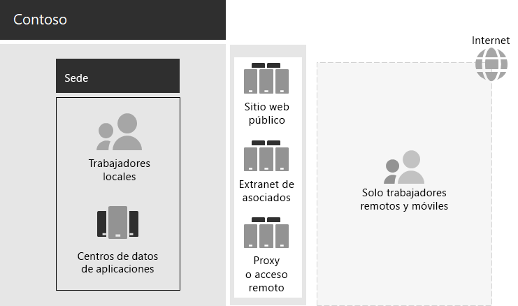

# Infraestructura de ti y necesidades empresariales de ContosoContoso IT infrastructure and business needs

Contoso está pasando de una infraestructura de ti centralizada local a una configuración de nube inclusiva que incorpora las cargas de trabajo y aplicaciones de productividad personal basadas en la nube.Contoso is transitioning from an on-premises, centralized IT infrastructure to a cloud-inclusive setup that incorporates cloud-based personal productivity workloads and applications.

## Infraestructura de TI existente de ContosoExisting Contoso IT infrastructure

Contoso usa una infraestructura de TI local mayoritariamente centralizada, con centros de datos de aplicaciones en la sede de París.Contoso uses a mostly centralized on-premises IT infrastructure, with application datacenters in the Paris headquarters.

A continuación se muestra la oficina central con centros de aplicaciones, una red perimetral e Internet.Here is the headquarters office with application datacenters, a DMZ, and the internet.

En los centros de datos de aplicaciones locales se hospeda lo siguiente:The on-premises application datacenters host: 

- Aplicaciones de línea de negocio personalizadas que usan SQL Server y otras bases de datos de Linux.Custom line-of-business applications that use SQL Server and other Linux databases.
- Un conjunto de servidores de SharePoint heredados.A set of legacy SharePoint servers.
- Servidores de nivel de equipo y de la organización para el almacenamiento de archivos.Organization and team-level servers for file storage.

Además, cada una de las oficinas centrales regionales es compatible con un conjunto de servidores que tiene un conjunto de aplicaciones similares.Additionally, each regional hub office supports a set of servers with a similar set of applications. Estos servidores están bajo el control de los departamentos de TI regionales.These servers are under the control of regional IT departments.

La capacidad de búsqueda entre las aplicaciones y los datos de todos estos centros de datos separados geográficamente sigue siendo un desafío.Searchability across the applications and data of these separate multi-geographical datacenters continues to be a challenge.

En la DMZ de la sede central de Contoso, los distintos conjuntos de servidores proporcionan lo siguiente:In the Contoso headquarters DMZ, different sets of servers provide:

- Hospedaje para el sitio web público de Contoso, desde el que los clientes pueden solicitar productos, piezas, suministros y servicio.Hosting for the Contoso public web site, from which customers can order products, parts, supplies, and service.
- Hospedaje de la extranet de partners de Contoso para la colaboración y comunicación de los partners.Hosting for the Contoso partner extranet for partner communication and collaboration.
- Acceso remoto a la intranet de Contoso basado en VPN (Red privada virtual) y proxy web para los trabajadores de la sede de París.Virtual private network (VPN)-based remote access to the Contoso intranet and web proxying for workers in the Paris headquarters.

## Necesidades empresariales de ContosoContoso business needs

Las necesidades empresariales de Contoso se dividen en cinco categorías principales:Contoso business needs fall into five main categories:

**Productividad****Productivity**

- Facilitar la colaboraciónMake collaboration easier

  Reemplace el correo electrónico y la colaboración basada en recursos compartidos de archivos con un modelo en línea que permita cambios en tiempo real en documentos, reuniones en línea más sencillas y conversaciones de conversación capturadas.Replace email and file share-based collaboration with an online model that allows real-time changes on documents, easier online meetings, and captured conversation threads.
- Mejorar la productividad de los trabajadores remotos y móvilesImprove productivity for remote and mobile workers

  Con muchos empleados que trabajan desde casa o en el campo, reemplace la solución VPN con cuellos de botella por el acceso de tipo de Contoso a los datos y recursos de la nube.With many employees working from home or in the field, replace the bottlenecked VPN solution with performant access to Contoso data and resources in the cloud.
- Aumentar la creatividad y la innovaciónIncrease creativity and innovation

  Aproveche las ventajas de los métodos más recientes de aprendizaje visual y desarrollo de ideas, como la entrada manuscrita y la visualización 3D.Take advantage of the latest visual learning and idea development methods, including inking and 3D visualization.

**Seguridad****Security**

- Administración de identidad y accesoIdentity and access management

  Exigir la autenticación multifactor y otras formas de autenticación y proteger las credenciales de las cuentas de usuario y administrador.Enforce multifactor and other forms of authentication and protect user and administrator account credentials.

- Protección contra amenazasThreat protection

  Proteja contra amenazas de seguridad externas, como el correo electrónico y el malware basado en el sistema operativo.Protect against external security threats, including email and operating system-based malware.

- Protección de la informaciónInformation protection

  Restrinja el acceso y cifre los activos digitales de gran valor, como los datos del cliente, las especificaciones de diseño y manufactura y la información de los empleados.Lock down access to and encrypt high-value digital assets, such as customer data, design and manufacturing specifications, and employee information.

- Administración de seguridadSecurity management

  Supervise el postura de seguridad y detecte y responda a amenazas en tiempo real.Monitor security posture and detect and respond to threats in real time.

**Acceso móvil y remoto, y socios comerciales****Remote and mobile access and business partners**

- Mejorar la seguridad de los trabajadores remotos y móvilesImprove security for remote and mobile workers

  Implemente su propio dispositivo (BYOD) y la administración de dispositivos de propiedad de la empresa para garantizar el acceso seguro, el comportamiento correcto de las aplicaciones y la protección de datos de la empresa.Implement bring your own device (BYOD) and company-owned device management to ensure secured access, correct application behavior, and company data protection.

- Reducir la infraestructura de acceso remoto para los empleadosReduce remote access infrastructure for employees

  Reducir los costos de mantenimiento y soporte técnico y mejorar el rendimiento de la solución de acceso remoto moviendo los recursos a los que se accede habitualmente a la nube.Reduce maintenance and support costs and improve performance for remote access solution by moving commonly accessed resources to the cloud.

- Proporcionar mejor conectividad y menor overhead para las transacciones de negocio a susiness (B2B)Provide better connectivity and lower overhead for business-to-susiness (B2B) transactions

  Reemplace una extranet de asociados con una detección de asociados con una solución basada en la nube que use la autenticación federada.Replace an aging and expensive partner extranet with a cloud-based solution that uses federated authentication.

**Cumplimiento****Compliance**

- Cumplir los requisitos normativos regionalesAdhere to regional regulatory requirements

  Garantizar el cumplimiento de las regulaciones de la industria y la regional para el almacenamiento de datos, el cifrado, la privacidad de datos y las regulaciones de datos personales, como el Reglamento General de protección de datos (RGPD) para la Unión Europea.Ensure compliance with industry and regional regulations for data storage, encryption, data privacy, and personal data regulations, such as the General Data Protection Regulation (GDPR) for the Europe Union.

**Administración****Management**

- Reducir la sobrecarga de TI para administrar el software que se ejecuta en equipos y dispositivos clienteLower IT overhead for managing software running on client PCs and devices

  Automatizar la instalación de actualizaciones para el sistema operativo Windows y las aplicaciones de Microsoft 365 para empresas en toda la organización.Automate installation of updates to the Windows operating system and Microsoft 365 Apps for enterprise across the organization.

## Asignación de las necesidades empresariales de Contoso a Microsoft 365 para empresasMapping Contoso business needs to Microsoft 365 for enterprise

El Departamento de TI de Contoso determinó la siguiente asignación de necesidades empresariales a las características de Microsoft 365 E5 antes de la implementación:The Contoso IT department determined the following mapping of business needs to Microsoft 365 E5 features prior to deployment:

| CategoríaCategory | Necesidad empresarialBusiness need | Microsoft 365 para productos o características de empresaMicrosoft 365 for enterprise products or features |
|:-------|:-----|:-----|
| ProductividadProductivity |  |  |
|  | Facilitar la colaboraciónMake collaboration easier | Microsoft Teams, SharePoint, OneDriveMicrosoft Teams, SharePoint, OneDrive |
|  | Mejorar la productividad de los trabajadores remotos y móvilesImprove productivity for remote and mobile workers | Cargas de trabajo de Microsoft 365 y datos basados en la nubeMicrosoft 365 workloads and cloud-based data |
|  | Aumentar la creatividad y la innovaciónIncrease creativity and innovation | Windows Ink, Cortana en el trabajo, PowerPointWindows Ink, Cortana at Work, PowerPoint |
| SeguridadSecurity |  |  |
|  | Administración de identidad y accesoIdentity & access management | Cuentas de administrador global dedicadas con Azure multi-factor Authentication (MFA) y Azure Active Directory privileged Identity Management (PIM)Dedicated global administrator accounts with Azure Multi-Factor Authentication (MFA) and Azure Active Directory Privileged Identity Management (PIM)   MFA para todas las cuentas de usuarioMFA for all user accounts   Acceso condicionalConditional Access   Windows HelloWindows Hello   Credential Guard de Windows DefenderWindows Credential Guard |
|  | Protección contra amenazasThreat protection | Advanced Threat AnalyticsAdvanced Threat Analytics   Windows DefenderWindows Defender   Protección contra amenazas avanzadaAdvanced Threat Protection   Protección contra amenazas avanzada de Office 365Office 365 Advanced Threat Protection   Respuesta y investigación de amenazas de Microsoft 365Microsoft 365 threat investigation and response   |
|  | Protección de la informaciónInformation protection | Azure Information ProtectionAzure Information Protection   Prevención de pérdida de datos (DLP)Data Loss Prevention (DLP)   Windows Information Protection (WIP)Windows Information Protection (WIP)   Microsoft Cloud App SecurityMicrosoft Cloud App Security   Microsoft IntuneMicrosoft Intune |
|  | Administración de seguridadSecurity management | Azure Security CenterAzure Security Center    Centro de seguridad de Windows DefenderWindows Defender Security Center |
| Acceso móvil y remoto, y socios comercialesRemote and mobile access and business partners |  |  |
|  | Mejorar la seguridad de los trabajadores remotos y móvilesBetter security for remote and mobile workers | Microsoft IntuneMicrosoft Intune |
|  | Reducir la infraestructura de acceso remoto para los empleadosReduce remote access infrastructure for employees | Cargas de trabajo de Microsoft 365 y datos basados en la nubeMicrosoft 365 workloads and cloud-based data |
|  | Mejorar la conectividad y reducir la sobrecarga para las transacciones B2BImprove connectivity and lower overhead for B2B transactions | Autenticación federada y recursos basados en la nubeFederated authentication and cloud-based resources |
| CumplimientoCompliance |  |  |
|  | Cumplir los requisitos normativos regionalesAdhere to regional regulatory requirements | Características de RGPD en Microsoft 365GDPR features in Microsoft 365 |
| AdministraciónManagement |  |  |
|  | Reducir la sobrecarga de TI para instalar actualizaciones de clienteLower IT overhead for installing client updates | Actualizaciones de Windows 10 EnterpriseWindows 10 Enterprise updates   Actualizaciones para las aplicaciones de Microsoft 365 para empresasMicrosoft 365 Apps for enterprise updates |
||||

## Paso siguienteNext step

Obtenga información sobre la [red local de](contoso-networking.md) contoso Corporation y cómo se optimizó para el acceso y la latencia de los recursos basados en la nube de Microsoft 365.Learn about the Contoso Corporation [on-premises network](contoso-networking.md) and how it was optimized for access and latency to Microsoft 365 cloud-based resources.

## Recursos adicionalesSee also

[Información general de Microsoft 365 EnterpriseMicrosoft 365 for enterprise overview](microsoft-365-overview.md)

[Guías del laboratorio de pruebasTest lab guides](m365-enterprise-test-lab-guides.md)
