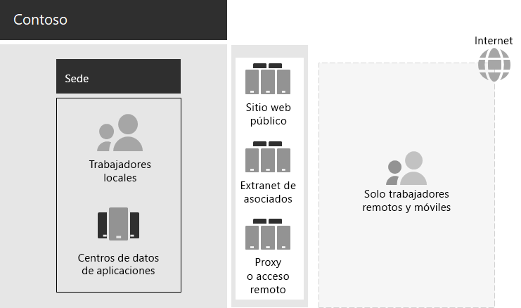

# Necesidades empresariales y de infraestructura de TI de Contoso

**Resumen:** Comprenda la estructura básica de la infraestructura de TI local de Contoso y cómo sus necesidades empresariales se pueden satisfacer mediante Microsoft 365 Enterprise.

Contoso ha realizado la transición de una infraestructura de TI centralizada local a una infraestructura de nube inclusiva que incorpora las cargas de trabajo de productividad del personal y las aplicaciones basadas en la nube.

## Infraestructura de TI existente de Contoso

Contoso usa una infraestructura de TI local mayoritariamente centralizada, con centros de datos de aplicaciones en la sede de París.

En la Figura 1 se muestra una oficina central con centros de datos de aplicaciones, una red perimetral e Internet.

**Figura 1: Infraestructura de TI existente de Contoso**
 
En los centros de datos de aplicaciones locales se hospeda lo siguiente: 

- Aplicaciones de línea de negocio personalizadas que usan SQL Server y otras bases de datos de Linux.
- Un conjunto de servidores de SharePoint heredados.
- Servidores de nivel de equipo y de la organización para el almacenamiento de archivos.

Además, cada centro regional admite un conjunto de servidores con un conjunto de aplicaciones similar. Estos servidores están bajo el control de los departamentos de TI regionales.

La capacidad de búsqueda entre las aplicaciones y los datos de todos estos centros de datos separados geográficamente sigue siendo un desafío.

En la red perimetral de la sede central de Contoso, los distintos conjuntos de servidores proporcionan lo siguiente:

- Acceso remoto basado en VPN a la intranet de Contoso y proxy web para los trabajadores de la sede de París.
- Hospedaje del sitio web público de Contoso, desde el que los clientes pueden solicitar productos, piezas, suministros o servicio.
- Hospedaje de la extranet de partners de Contoso para la colaboración y comunicación de los partners.

## Necesidades empresariales de Contoso

Las necesidades empresariales de Contoso se dividen en cinco categorías principales.

Productividad:

- Facilitar la colaboración

  Reemplace la colaboración basada en el correo electrónico y los recursos compartidos de archivos con un modelo en línea que permita modificar los documentos en tiempo real, facilite las reuniones en línea y capture las conversaciones.
- Mejorar la productividad de los trabajadores remotos y móviles

  Con tantos empleados trabajando desde casa o sobre el terreno, cambie la solución VPN con cuellos de botella por el acceso eficaz a los datos y recursos de Contoso en la nube.
- Aumentar la creatividad y la innovación

  Aproveche las ventajas de los métodos más recientes de aprendizaje visual y desarrollo de ideas, como la entrada manuscrita y la visualización 3D.

Seguridad:

- Administración de identidad y acceso

  Exija la autenticación multifactor y de otros tipos, y proteja las credenciales de las cuentas de usuario y administrador.

- Protección contra amenazas

  Proteja contra amenazas de seguridad externas, como el correo electrónico y el malware basado en el sistema operativo.

- Protección de la información

  Restrinja el acceso y cifre los activos digitales de gran valor, como los datos del cliente, las especificaciones de diseño y la información de los empleados.

- Administración de seguridad

  Supervise el nivel de seguridad y sea capaz de detectar y responder a las amenazas en tiempo real.

Acceso móvil y remoto, y socios comerciales:

- Mejorar la seguridad de los trabajadores remotos y móviles

  Instaure la administración de dispositivos Bring Your Own Device (BYOD) y de propiedad de la empresa para garantizar el acceso seguro, el comportamiento correcto de las aplicaciones y la protección de los datos de la empresa.

- Reducir la infraestructura de acceso remoto para los empleados

  Reduzca los costos de mantenimiento y soporte técnico, y mejore el rendimiento de la solución de acceso remoto moviendo a la nube los recursos a los que se accede con frecuencia.

- Proporcionar mejor conectividad y menos sobrecarga para las transacciones de negocio a negocio (B2B)

  Reemplace la extranet de partners, anticuada y costosa, por una solución basada en la nube que use la autenticación federada.

Cumplimiento:

- Cumplir los requisitos normativos regionales

  Cumpla con los reglamentos regionales y del sector sobre almacenamiento de datos, cifrado, privacidad de datos y normativas de datos personales, como el Reglamento general de protección de datos (RGPD) de la Unión Europea.

Administración:

- Reducir la sobrecarga de TI de la administración de software en los equipos y dispositivos cliente

  Automatice la instalación de actualizaciones para el sistema operativo Windows y Microsoft Office en toda la organización.

## Asignación de las necesidades empresariales de Contoso a Microsoft 365 Enterprise

Antes de la implementación, el departamento de TI de Contoso determinó la siguiente asignación de las necesidades empresariales a las características de Microsoft 365 Enterprise E5:

||||
|:-------|:-----|:-----|
| **Categoría** | **Necesidad empresarial** | **Productos o características de Microsoft 365 Enterprise** |
| Productividad |  |  |
|  | Facilitar la colaboración | Teams, SharePoint Online, Skype Empresarial Online |
|  | Mejorar la productividad de los trabajadores remotos y móviles | Cargas de trabajo de Office 365 y datos basados en la nube |
|  | Aumentar la creatividad y la innovación | Windows Ink, Cortana en el trabajo, PowerPoint |
| Seguridad |  |  |
|  | Administración de identidad y acceso | Cuentas de administrador global dedicadas con la autenticación multifactor (MFA) y Azure AD Privileged Identity Management (PIM)   MFA para todas las cuentas de usuario   Acceso condicional   Windows Hello   Credential Guard de Windows Defender |
|  | Protección contra amenazas | Advanced Threat Analytics   Windows Defender   Protección contra amenazas avanzada   Protección contra amenazas avanzada de Office 365   Investigación y respuesta de amenazas de Office 365   |
|  | Protección de la información | Azure Information Protection   Prevención de pérdida de datos (DLP) de Office 365   Windows Information Protection   Microsoft Cloud App Security   Microsoft Intune |
|  | Administración de seguridad | Azure Security Center    Centro de seguridad de Windows Defender |
| Acceso móvil y remoto, y socios comerciales |  |  |
|  | Mejorar la seguridad de los trabajadores remotos y móviles | Microsoft Intune |
|  | Reducir la infraestructura de acceso remoto para los empleados | Cargas de trabajo de Office 365 y datos basados en la nube |
|  | Proporcionar mejor conectividad y menos sobrecarga para las transacciones B2B | Autenticación federada y recursos basados en la nube |
| Cumplimiento |  |  |
|  | Cumplir los requisitos normativos regionales | Características del RGPD en Office 365 |
| Administración |  |  |
|  | Reducir la sobrecarga de TI para la instalación de actualizaciones de cliente | Anillos de implementación   Actualización local de Windows 10 y Autopilot   Office 365 ProPlus |
||||

## Paso siguiente

[Obtenga más información](contoso-networking.md) sobre la red local de Contoso Corporation y cómo se optimizó para el acceso y la latencia para los recursos basados en la nube de Microsoft 365 en la organización.

## Vea también

[Guía de implementación](deploy-microsoft-365-enterprise.md)

[Guías del laboratorio de pruebas](m365-enterprise-test-lab-guides.md)
