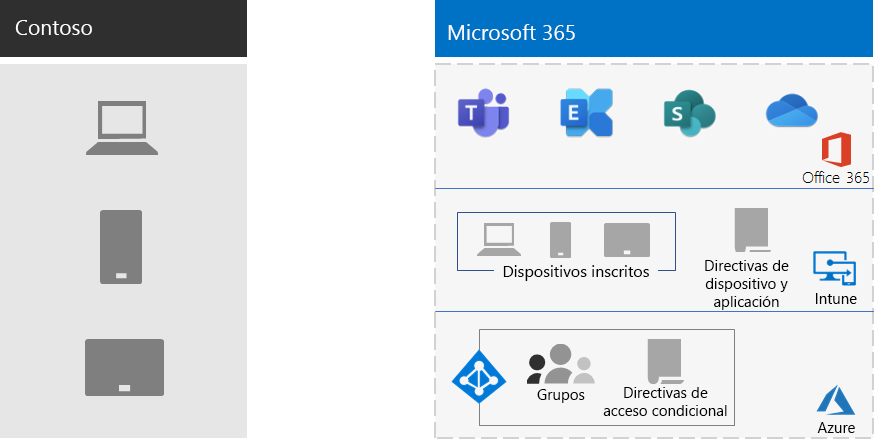

# Administración de dispositivos móviles para Contoso

Microsoft 365 para empresas incluye Intune y un conjunto de servicios de Azure que admiten la seguridad y la administración de aplicaciones y dispositivos móviles.

Contoso tiene muchos empleados habilitados para móviles. Algunas tienen oficinas en ubicaciones de Contoso y otras no tienen oficinas. Contoso necesitaba una forma de habilitar la productividad de los empleados, pero mantener los dispositivos, los datos de Contoso almacenados en esos dispositivos y el comportamiento de la aplicación seguros.

## Plan

Contoso identificó los siguientes casos de uso de Intune de administración de dispositivos móviles para Microsoft 365 empresa:

- Proteja Exchange Online correo electrónico y datos para que los dispositivos móviles puedan acceder a él de forma segura.
- Implemente un programa bring-your-own-device (BYOD) para los empleados de Contoso.
- Emitir teléfonos propiedad de la organización y tabletas compartidas de uso limitado para los empleados de Contoso.

Contoso no usa Intune para:

- Permitir que los empleados accedan de forma Microsoft 365 desde un quiosco público no administrado.
- Proteja el correo electrónico y los datos locales para que los dispositivos móviles puedan acceder a él de forma segura, ya que no hay servidores de Microsoft Exchange local.

## Implementación

Contoso configuró la infraestructura de administración de sus dispositivos móviles de la siguiente manera:

- Establece Intune como entidad de administración de dispositivos móviles (MDM) y usa Intune en Azure para administrar contenido y administrar los dispositivos
- Grupos Azure Active Directory (Azure AD) para dispositivos para la inscripción y la configuración de Intune y directivas de acceso condicional basadas en dispositivos

  Para obtener más información, vea [Contoso Conditional Access policies](contoso-identity.md#conditional-access-policies-for-identity-and-device-access).

- Se ha habilitado la plataforma de dispositivos Apple para admitir a los empleados con iPads, iMacs y iPhones y iPhones de propiedad corporativa
- Creó directivas de términos y condiciones específicas para Contoso, que se muestran durante la instalación del Portal de empresa de Contoso en dispositivos móviles.
- Para dispositivos que no están inscritos, implementó un conjunto de directivas de administración de aplicaciones móviles (MAM) para requerir autenticación para el acceso a Microsoft 365 servicios
- Creó directivas de Intune que determinan lo siguiente:
  - Aplicaciones permitidas.
  - Cifrado de dispositivos para evitar el acceso no autorizado.
  - Un PIN o contraseña de seis dígitos.
  - Un período de tiempo de espera de inactividad.
  - Protección contra antivirus y malware, y actualizaciones de firmas con Windows Defender en Windows 10 dispositivos.
  - Actualizaciones automáticas en Windows 10 dispositivos que incluyen las actualizaciones de seguridad más recientes.
  - Insertar certificados en dispositivos administrados.
  - Una separación clara entre los datos personales y empresariales. Los usuarios o administradores pueden borrar datos corporativos desde el dispositivo, dejando intactos los datos personales, como, por ejemplo, imágenes, cuentas de correo electrónico personales y archivos personales.

Contoso inscribió equipos implementados y smartphones y tabletas de propiedad de la empresa agregándolos a los grupos de dispositivos de Intune adecuados. También establecieron un programa BYOD para que los empleados inscriban sus dispositivos personales. Los dispositivos inscritos reciben directivas de Intune, lo que da como resultado dispositivos administrados y protegidos y sus aplicaciones. Los dispositivos que no están inscritos tienen directivas de administración de aplicaciones móviles (MAM) que especifican aplicaciones permitidas.

Esta es la arquitectura de implementación de administración de dispositivos móviles contoso.

## Paso siguiente

Obtenga información sobre cómo Contoso usa las [capacidades](contoso-info-protect.md) de protección de la información de Microsoft 365 empresa para clasificar, identificar y proteger activos digitales cruciales en toda su organización.

## Consulte también

[Administración de dispositivos para Microsoft 365](device-management-roadmap-microsoft-365.md)

[Información general de Microsoft 365 Enterprise](microsoft-365-overview.md)

[Guías del laboratorio de pruebas](m365-enterprise-test-lab-guides.md)

