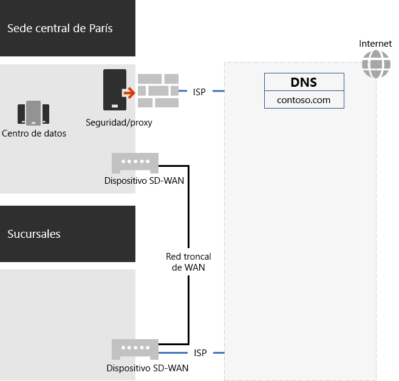
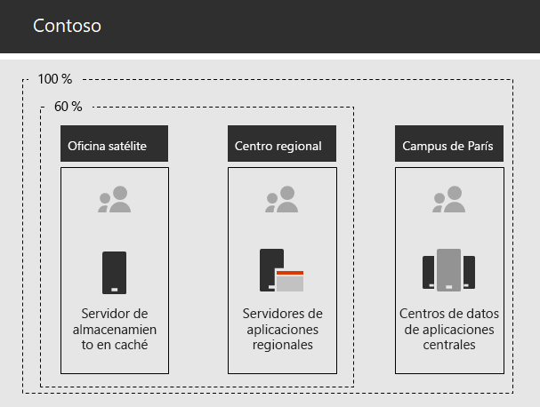

# Redes para Contoso CorporationNetworking for the Contoso Corporation

Para adoptar una infraestructura de nube inclusiva, los ingenieros de redes de Contoso materializaron el cambio fundamental en el modo en que el tráfico de red viaja a los servicios en la nube. En lugar de un modelo de concentrador y radio interno que centra la conectividad y el tráfico de red para el siguiente nivel de la jerarquía de la oficina de Contoso, trabajaron para asignar las ubicaciones de usuario a la salida de Internet local y las conexiones locales a las ubicaciones de red de Microsoft 365 más cercanas en Internet.To adopt a cloud-inclusive infrastructure, Contoso's network engineers realized the fundamental shift in the way that network traffic to cloud services travels. Instead of an internal hub and spoke model that focusses network connectivity and traffic for the next level of the Contoso office hierarchy, they worked to map user locations to local Internet egress and local connections to the closest Microsoft 365 network location on the Internet.

## Infraestructura de red de ContosoContoso's networking infrastructure

Los elementos de la red de Contoso que vincula sus oficinas en todo el mundo son los siguientes:The elements of Contoso's network that links their offices across the globe are the following:

- Red WAN de conmutación de etiquetas multiprotocolo (MPLS)Multiprotocol Label Switching (MPLS) WAN network

  Una red WAN MPLS conecta la sede central de París a las oficinas regionales y las oficinas regionales a las oficinas satélite en una configuración de concentrador y radio. Esto permite a los usuarios acceder a los servidores locales que conforman las aplicaciones de línea de negocio en la oficina de París. También enruta el tráfico de Internet genérico a la oficina de París, donde los dispositivos de seguridad de red limpian las solicitudes. En cada oficina, los enrutadores entregan el tráfico a hosts por cable o puntos de acceso inalámbricos en subredes, en las que se usa el espacio de direcciones IP privadas.An MPLS WAN network connects the Paris headquarters to regional offices and regional offices to satellite offices in a spoke and hub configuration. This is for users to access on-premises servers that make up line of business applications in the Paris office. It also routes any generic Internet traffic to the Paris office where network security devices scrub the requests. Within each office, routers deliver traffic to wired hosts or wireless access points on subnets, which use the private IP address space.

- Acceso a Internet directo local para el tráfico de Microsoft 365Local direct Internet access for Microsoft 365 traffic

  Cada oficina tiene un dispositivo WAN definido por software (SD-WAN) con uno o varios circuitos de red de ISP de Internet local con su propia conectividad a Internet a través de un servidor proxy. Esto suele implementarse como un vínculo WAN a un ISP local que también proporciona direcciones IP públicas y un servidor DNS local.Each office has a Software-Defined WAN (SD-WAN) device with one of more local Internet ISP network circuits, with its own Internet connectivity through a proxy server. This is typically implemented as a WAN link to a local ISP that also provides public IP addresses and a local DNS server.

- Presencia en InternetInternet presence

  Contoso posee el nombre de dominio público contoso.com. El sitio web público de Contoso para pedir productos es un conjunto de servidores en un centro de datos conectado a Internet en las instalaciones de París. Contoso usa un intervalo de direcciones IP públicas /24 en Internet.Contoso owns the contoso.com public domain name. The Contoso public web site for ordering products is a set of servers in an Internet-connected datacenter in the Paris campus. Contoso uses a /24 public IP address range on the Internet.

En la ilustración 1, se muestra la infraestructura de red de Contoso y sus conexiones a Internet.Figure 1 shows Contoso's networking infrastructure and its connections to the Internet.

 
**Ilustración 1: Red de Contoso****Figure 1: Contoso's network**

## Uso de SD-WAN para la conectividad de red óptima a MicrosoftUse of SD-WAN for optimal network connectivity to Microsoft

Contoso siguió los [principios de conectividad de red de Office 365](https://docs.microsoft.com/office365/enterprise/office-365-network-connectivity-principles) para:Contoso followed [Office 365 network connectivity principles](https://docs.microsoft.com/office365/enterprise/office-365-network-connectivity-principles) to:

1. Identificar y diferenciar el tráfico de red de Office 365Identify and differentiate Office 365 network traffic
2. Conexiones de red de salida de forma localEgress network connections locally
3. Evitar las redirecciones de redAvoid network hairpins
4. Omitir los dispositivos de seguridad de red duplicadosBypass duplicate network security devices

Hay tres categorías de tráfico de red para Office 365: optimizar, permitir y predeterminado.There are three categories of network traffic for Office 365: Optimize, Allow, and Default. El tráfico de las categorías Optimizar y Permitir es el tráfico de red de confianza que se cifra y protege en los puntos de conexión y se destina a la red de Microsoft 365.Optimize and Allow traffic is trusted network traffic that is encrypted and secured at the endpoints and is destined for the Microsoft 365 network.

Contoso decidió:Contoso decided to:

- Usar la salida de Internet directa para el tráfico de las categorías Optimizar y Permitir, y reenviar todo el tráfico de la categoría Predeterminado a la conexión de Internet de la central en París.Use direct Internet egress for Optimize and Allow category traffic and to forward all Default category traffic to the Paris-based central Internet connection.

- Implementar dispositivos SD-WAN en cada una de las oficinas como una forma sencilla de seguir estos principios y obtener un rendimiento de red óptimo para los servicios basados en la nube de Microsoft 365.Deploy SD-WAN devices at each of their office locations as a simple way to follow these principles and achieve optimal network performance for Microsoft 365 cloud-based services.

  Los dispositivos SD-WAN tienen un puerto LAN para la red de oficina local y varios puertos WAN.The SD-WAN devices have a LAN port for the local office network and multiple WAN ports. Un puerto WAN se conecta a su red MPLS y otro puerto WAN se conecta a un circuito ISP local.One WAN port connects to their MPLS network and another WAN port connects to a local ISP circuit. El dispositivo SD-WAN enruta el tráfico de las categorías Optimizar y Permitir en el vínculo de ISP.The SD-WAN device routes Optimize and Allow category network traffic over the ISP link.

## Infraestructura de aplicaciones de línea de negocio de ContosoContoso's line of business app infrastructure

Contoso ha diseñado su infraestructura de intranet de servidores y aplicaciones de línea de negocio para lo siguiente:Contoso has architected its line of business application and server intranet infrastructure for the following:

- En las oficinas satélite se usan servidores de almacenamiento en caché locales para almacenar documentos y sitios web internos a los que se accede frecuentemente.Satellite offices use local caching servers to store frequently accessed documents and internal web sites.
- En los centros regionales se usan servidores de aplicaciones regionales para las oficinas regionales y satélite. Estos servidores se sincronizan con los de la sede de París.Regional hubs use regional application servers for the regional and satellite offices. These servers synchronize with servers in the Paris headquarters.
- Los centros de datos que contienen los servidores de aplicaciones centralizados que sirven a toda la organización se encuentran en las instalaciones de París.The Paris campus has the datacenters that contain the centralized application servers that serve the entire organization.

En la ilustración 2, se muestra el porcentaje de tráfico de red cuando se obtiene acceso a los servidores de la intranet de Contoso.Figure 2 shows the percentage of network traffic when accessing servers across Contoso’s intranet.

 
**Ilustración 2: Infraestructura de Contoso para aplicaciones internas****Figure 2: Contoso's infrastructure for internal applications**

Para los usuarios de oficinas de centros regionales o satélite, el 60 % de los recursos que necesitan los empleados pueden obtenerse de los servidores de oficinas de concentradores regionales o satélite. El 40 % adicional de solicitudes de recursos debe realizarse a través del vínculo WAN a las instalaciones de París.For users in satellite or regional hub offices, 60% of the resources needed by employees can be served by satellite and regional hub office servers. The additional 40% of resource requests must go over the WAN link to the Paris campus.

## Análisis de red de Contoso y preparación de su red para Microsoft 365 EnterpriseContoso's network analysis and preparation of their network for Microsoft 365 Enterprise

La adopción correcta de los servicios de Microsoft 365 Enterprise por parte de los usuarios de Contoso depende de la alta disponibilidad y del rendimiento de la conectividad a Internet, o bien directamente a los servicios en la nube de Microsoft. Contoso siguió estos pasos para planear e implementar la conectividad optimizada a los servicios en la nube de Microsoft 365 Enterprise:Successful adoption of Microsoft 365 Enterprise services by Contoso’s users depend on highly available and performant connectivity to the Internet, or directly to Microsoft cloud services. Contoso took these steps to plan for and implement optimized connectivity to Microsoft 365 Enterprise cloud services:

1. Creación de un diagrama de red WAN de la empresa para ayudar con la planificaciónCreated a company WAN network diagram to aid with planning

   Contoso inició la planificación de la red creando un diagrama en el que se muestran sus ubicaciones, la conectividad de red y los dispositivos perimetrales de red existentes, y las clases de servicio que se administran en la red. Usaron este diagrama en todos los pasos siguientes de la planificación e implementación de la conectividad de red.Contoso started their network planning by creating a diagram showing their locations, the existing network connectivity, their existing network perimeter devices and classes of service that are managed on the network. They used this diagram for each subsequent step in the planning and implementation of networking connectivity.

2. Crear un plan para la conectividad de red de Microsoft 365 EnterpriseCreated a plan for Microsoft 365 Enterprise network connectivity

   Contoso usó los [principios de conectividad de red de Office 365](https://docs.microsoft.com/office365/enterprise/office-365-network-connectivity-principles) y proporcionó arquitecturas de red de referencia para determinar SD-WAN como su topología preferida para la conectividad de Office 365.Contoso used the [Office 365 network connectivity principles](https://docs.microsoft.com/office365/enterprise/office-365-network-connectivity-principles) and provided reference network architectures to determine SD-WAN as their preferred topology for Office 365 connectivity.

3. Se analizó el uso de la conexión a Internet y el ancho de banda WAN MPLS en cada oficina y se aumentó el ancho de banda si era necesario.Analyzed Internet connection utilization and MPLS WAN bandwidth at each office and increased bandwidth as needed

   En todas las oficinas se analizó el uso actual y se aumentaron los circuitos para que el tráfico basado en la nube de Microsoft 365 pronosticado fuera operativo con una media del 20 % de la capacidad sin usar.Each office was analyzed for the current usage and circuits were increased so that predicted Microsoft 365 cloud-based traffic would be operating with an average of 20% of unused capacity.

4. Optimización del rendimiento para los servicios de red de MicrosoftOptimized performance to Microsoft network services

   Contoso determinó el conjunto de puntos de conexión de Office 365, Intune y Azure, y configuró firewalls, dispositivos de seguridad y otros sistemas en la ruta de acceso a Internet para obtener un rendimiento óptimo.Contoso determined the set of Office 365, Intune, and Azure endpoints and configured firewalls, security devices, and other systems in the Internet path for optimal performance. Se configuraron puntos de conexión para el tráfico de la categoría optimizar y permitir de Office 365 en los dispositivos SD-WAN para enrutar a través del circuito ISP.Endpoints for Office 365 Optimize and Allow category traffic was configured into the SD-WAN devices for routing over the ISP circuit.

5. Configuración de DNS internoConfigured internal DNS

   DNS debe ser funcional y buscarse de forma local para el tráfico de Office 365.DNS is required to be functional and to be looked up locally for Office 365 traffic.

6. Validación de los puntos de conexión de red y la conectividad de los puertosValidated network endpoint and port connectivity

   Contoso ejecutó herramientas de pruebas de conectividad de red proporcionadas por Microsoft para validar la conectividad de los servicios en la nube de Microsoft 365 Enterprise.Contoso ran network connectivity test tools provided by Microsoft to validate connectivity for Microsoft 365 Enterprise cloud services.

7. Optimización de los equipos de los empleados para la conectividad de redOptimized employee computers for network connectivity

   Los equipos se comprobaron de forma individual para asegurarse de que se habían instalado las actualizaciones del sistema operativo más recientes y que la supervisión de la seguridad de los puntos de conexión estaba activa en todos los clientes.Individual computers were checked to ensure that the latest operating system updates were installed and that endpoint security monitoring is active on all clients.

## Siguiente pasoNext step

[Obtenga información sobre](contoso-identity.md) cómo aprovecha Contoso sus Servicios de dominio de Active Directory(AD DS) locales en la nube para la autenticación de federación y empleados para los clientes y socios empresariales.[Learn](contoso-identity.md) how Contoso is leveraging its on-premises Active Directory Domain Services (AD DS) in the cloud for employees and federating authentication for customers and business partners.

## Vea tambiénSee also

[Redes para Microsoft 365 EnterpriseNetworking for Microsoft 365 Enterprise](networking-infrastructure.md)

[Guía de implementaciónDeployment guide](deploy-microsoft-365-enterprise.md)

[Guías del laboratorio de pruebasTest lab guides](m365-enterprise-test-lab-guides.md)
