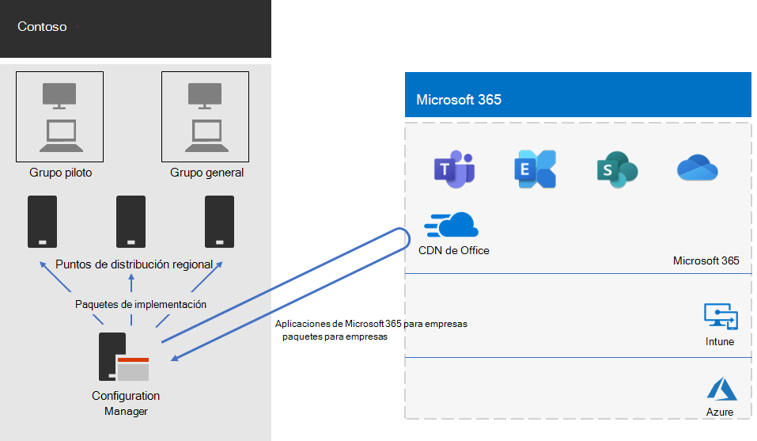

# Implementación de Aplicaciones de Microsoft 365 para empresas en Contoso

Contoso actualizó sus PCs a Windows 10 Enterprise y Microsoft 365 apps for Enterprise para permitir una colaboración más eficaz, una mejor seguridad y una experiencia de escritorio más moderna. Después de evaluar su infraestructura y necesidades empresariales, contoso identificó estos requisitos clave para la implementación:

- Todos los equipos deben ejecutar las aplicaciones de Microsoft 365 para empresas.
- La implementación debe usar la infraestructura y las herramientas de administración existentes cuando sea posible.
- La implementación debe admitir varios idiomas y arquitecturas existentes en los dispositivos de los usuarios.
- Los equipos deben mantenerse actualizados y protegidos con los mínimos costos administrativos de ti y un impacto mínimo en los usuarios.

## Herramientas de implementación

En función de sus requisitos, contoso decidió implementar Windows 10 Enterprise y Microsoft 365 apps for Enterprise a través de Configuration Manager (rama actual). Configuration Manager escala para entornos grandes y proporciona un amplio control sobre la instalación, las actualizaciones y la configuración. También tiene características integradas para que sea más fácil y eficaz implementar y administrar Office, entre los que se incluyen:

- Memoria caché del mismo nivel, que puede ayudar con la capacidad de red limitada cuando se implementa en dispositivos en ubicaciones remotas.
- El panel de administración de clientes de Office, que facilita la implementación de las actualizaciones de Office y de supervisión, y proporciona a los administradores acceso a las últimas características de implementación y administración.
- Implementación de paquetes de idioma inteligentes, que incluye la implementación automática del mismo idioma que el sistema operativo.
- Un método totalmente compatible y fácil de usar para quitar versiones existentes de Office desde un cliente durante la implementación.

Además de Configuration Manager, contoso usó [Readiness Toolkit for Office Add-in and VBA](https://docs.microsoft.com/deployoffice/readiness-toolkit-application-compatibility-microsoft-365-apps), una herramienta gratuita de Microsoft, para evaluar los problemas de compatibilidad con sus complementos y macros de Office.

## Administración de la implementación y las actualizaciones

Microsoft 365 apps for Enterprise tiene un nuevo modelo de versión: Office como servicio. El modelo de servicio facilita la tarea de mantenerse al día con las nuevas características. Pero, a menudo, requiere que los departamentos de ti cambien la forma en que implementan y prueban las versiones nuevas. Para minimizar los problemas de compatibilidad y asegurarse de que sus equipos estén actualizados, contoso implementó Windows y Office en dos fases:

- En primer lugar, implementaron Microsoft 365 apps for Enterprise en un pequeño conjunto de dispositivos representativos en toda la organización. Este grupo piloto se usó para probar aplicaciones, complementos y hardware con las aplicaciones de Microsoft 365 para empresas.
- Cuatro meses más tarde, después de solucionar todos los problemas críticos relacionados con las aplicaciones, los complementos y el hardware en el grupo piloto, Contoso implementó Aplicaciones de Microsoft 365 para empresas en el resto de los dispositivos de la organización (el grupo general).

En lugar de administrar las actualizaciones de Office mediante el administrador de configuración, contoso habilitó actualizaciones automáticas desde la nube. Las actualizaciones basadas en la nube reducen la sobrecarga administrativa, al tiempo que garantizan la actualización de los dispositivos.

Contoso siguió el mismo enfoque de dos fases para las actualizaciones de características que se usaban para la implementación de Office: los dispositivos del grupo piloto recibieron actualizaciones de características cuatro meses antes que los dispositivos del resto de la organización (el grupo amplio). Para habilitar esta opción para Office, Contoso usó dos [canales de actualización](https://docs.microsoft.com/DeployOffice/overview-update-channels) recomendados:

- Canal semestral empresarial (versión preliminar) para actualizaciones al grupo piloto
- Semi-Annual el canal de empresa para las actualizaciones del grupo general

Como el canal semestral empresarial (versión preliminar) publica una versión de Aplicaciones de Microsoft 365 para empresas cuatro meses antes que el canal empresarial semestral, Contoso tiene tiempo para validar las actualizaciones sin tener que administrarlas.

## Proceso de implementación

Para completar la implementación de Office, Contoso implementó el siguiente proceso, que incluye los procedimientos recomendados de Microsoft:

1. Antes de la implementación, contoso usó Readiness Toolkit for Office Add-in y VBA para probar sus aplicaciones y complementos de Office para evaluar su compatibilidad con las aplicaciones de Microsoft 365 para empresas.
1. En el administrador de configuración, habilitaban la caché del mismo nivel en sus dispositivos cliente, lo que ayuda con la capacidad de red limitada al implementar en dispositivos cliente en ubicaciones remotas. 
1. Contoso definió dos grupos de implementación como colecciones de dispositivos en Configuration Manager: un grupo piloto y un grupo amplio. El grupo piloto, que incluye un pequeño conjunto de dispositivos representativos en toda la organización, se usó para las pruebas adicionales de aplicaciones, complementos y hardware con Windows 10 Enterprise y las aplicaciones de Microsoft 365 para empresas.
1. Han creado paquetes de implementación para Office usando el panel de administración de clientes de Office y el Asistente de Office 365 Installer, que forman parte de la consola de Configuration Manager. Han creado dos aplicaciones de Microsoft 365 para paquetes para empresas, una para el grupo piloto del canal de empresa de Semi-Annual (versión preliminar) y otra para el grupo general en el canal de empresa de Semi-Annual.
2. Cada paquete de Office incluía los paquetes de idioma inglés, francés y alemán. Si un dispositivo requería un idioma que no se incluía en el paquete de Office, ese paquete de idioma se descargó automáticamente de la red de entrega de contenido (CDN) de Office.
3. Para eliminar de forma automática todas las versiones MSI existentes de Office antes de instalar Aplicaciones de Microsoft 365 para empresas, usaron las características integradas en el paquete de Office.
4. En el administrador de configuración, implementaban los paquetes de Windows y Office en puntos de distribución en su red. A continuación, ejecutaban las secuencias de tareas de implementación de Configuration Manager para implementar el paquete piloto Microsoft 365 apps for Enterprise en el grupo piloto.
5. Después de haber abordado los problemas de compatibilidad con el grupo piloto, contoso ejecutó las secuencias de tareas para implementar el paquete de aplicaciones de Microsoft 365 para empresas en el grupo general.

Como contoso decidió actualizar automáticamente los dispositivos de la nube, no había necesidad de administrar el proceso en Configuration Manager. Sus dispositivos se actualizan automáticamente directamente desde la nube en el canal de actualización que se definió en la implementación inicial.

Esta es la arquitectura de implementación de aplicaciones Microsoft 365 para la instalación empresarial y actualizaciones continuas de contoso.

 
## Paso siguiente

[Obtenga información sobre](contoso-mdm.md) cómo contoso usa Microsoft Intune en Microsoft 365 para empresas para administrar los dispositivos y las aplicaciones que ejecutan en la organización.

## Recursos adicionales

[Aplicaciones de Microsoft 365 para empresas](https://docs.microsoft.com/deployoffice/deployment-guide-microsoft-365-apps)

[Información general de Microsoft 365 para empresas](microsoft-365-overview.md)

[Guías del laboratorio de pruebas](m365-enterprise-test-lab-guides.md)
