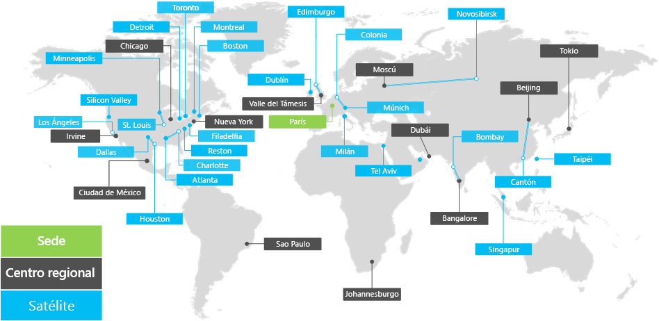

# Información general sobre Contoso CorporationOverview of the Contoso Corporation

**Resumen:** Entender Contoso Corporation como un negocio y la estructura en niveles de sus oficinas en todo el mundo.**Summary:** Understand the Contoso Corporation as a business and the tiered structure of its worldwide offices.

Contoso Corporation es una empresa multinacional con sede en París, Francia. Es una organización conglomerada de fabricación, ventas y soporte técnico con más de 100 000 productos.The Contoso Corporation is a multi-national business with headquarters in Paris, France. It is a conglomerate manufacturing, sales, and support organization with over 100,000 products.

## Contoso en todo el mundoContoso around the world

En la figura 1, se muestran la sede central en París, las oficinas de los centros regionales y las oficinas satélite en varios continentes.Figure 1 shows the headquarters office in Paris and regional hub and satellite offices in various continents.

**Figura 1: Oficinas de Contoso en todo el mundo****Figure 1: Contoso's offices around the world**
 
Las oficinas de Contoso en todo el mundo siguen un diseño de tres niveles.Contoso's offices around the world follow a three-tier design.

- SedeHeadquarters

  La sede de Contoso Corporation se encuentra en unas grandes instalaciones corporativas en las afueras de París con decenas de edificios de instalaciones administrativas, de ingeniería y fabricación. Todos los centros de datos de Contoso y su presencia en Internet se albergan en la sede de París.The Contoso Corporation headquarters is a large corporate campus on the outskirts of Paris with dozens of buildings for administrative, engineering, and manufacturing facilities. All of Contoso's datacenters and its Internet presence are housed in the Paris headquarters.

  La sede cuenta con 25 000 empleados.The headquarters has 25,000 workers.

- Centros regionalesRegional hubs

  Las oficinas de centros regionales sirven a una región específica del mundo con el 60 % de ventas y personal de soporte técnico. Cada centro regional está conectado a la sede de París con un vínculo WAN de ancho de banda alto. Regional hub offices serve a specific region of the world with 60% sales and support staff. Each regional hub is connected to the Paris headquarters with a high-bandwidth WAN link.

  Cada centro regional tiene un promedio de 2000 trabajadores.Each regional hub has an average of 2,000 workers.

- Oficinas satéliteSatellite offices

  Las oficinas satélite hospedan un 80 % del personal de ventas, y proporcionan presencia física e in situ para los clientes de Contoso en ciudades importantes o subregiones. Cada oficina satélite está conectada a un hub regional con un vínculo WAN de ancho de banda alto.Satellite offices contain 80% sales and support staff and provide an on-site presence for Contoso customers in key cities or sub-regions. Each satellite office is connected to a regional hub with a high-bandwidth WAN link.

  Cada oficina satélite tiene un promedio de 250 trabajadores.Each satellite office has an average of 250 workers.

El 25 % de la plantilla de Contoso es exclusivamente móvil, con un porcentaje más alto de trabajadores exclusivamente móviles en los centros regionales y las oficinas satélite. Proporcionar soporte técnico mejorado para los trabajadores exclusivamente móviles es un objetivo empresarial importante para Contoso.25% of Contoso's workforce is mobile-only, with a higher percentage of mobile-only workers in the regional hubs and satellite offices. Providing better support for mobile-only workers is an important business goal for Contoso.

## Consideraciones sobre diseño para Microsoft 365 EnterpriseDesign considerations for Microsoft 365 Enterprise

Los arquitectos de TI de Contoso identificaron las siguientes consideraciones y requisitos de diseño al implementar Microsoft 365 Enterprise:Contoso's IT architects identified the following design considerations when deploying Microsoft 365 Enterprise: 

- Varias ubicaciones geográficas con normativas y requisitos de cumplimiento localesMultiple geographic locations with local regulations and compliance requirements
- Un centro de datos de intranet en la sede central y servidores de aplicaciones regionales que hospedan aplicaciones internas de línea de negocioA central intranet datacenter in the headquarters office and regional application servers that host internal line of business applications
- Una infraestructura existente de System Center Configuration ManagerAn existing System Center Configuration Manager infrastructure
- Una combinación de dispositivos informáticos cliente, incluidos dispositivos Windows, Mac y LinuxA mix of client computing devices, including Windows, Mac, and Linux
- Una combinación de dispositivos móviles personales y dispositivos propiedad de la empresa, incluidos dispositivos iOS (iPhone y iPad) y smartphones y tabletas AndroidA mix of personal and company-owned mobile devices, including iOS (iPhone and iPad) and Android smart phones and tablets
- Muchos trabajadores remotos y móvilesMany remote and mobile workers
- Muchos asociados comercialesMany business partners
- Una gran cantidad de información de clientes y de identificación personalA large amount of customer and personally identifiable data
- Una gran cantidad de propiedad intelectual de gran valor en forma de especificaciones de diseño de productos y secretos empresariales de fabricaciónA large amount of high-value intellectual property in the form of design specifications for products and manufacturing trade secrets

## Siguiente pasoNext step

[Obtenga más información](contoso-infra-needs.md) sobre la estructura básica de la infraestructura de TI local de Contoso y cómo sus necesidades empresariales se  satisficieron mediante Microsoft 365 Enterprise.[Learn](contoso-infra-needs.md) about the Contoso Corporation’s on-premises IT infrastructure and how their business needs can be addressed with Microsoft 365 Enterprise.

## Vea tambiénSee also

[Guía de implementaciónDeployment guide](deploy-microsoft-365-enterprise.md)

[Guías del laboratorio de pruebasTest lab guides](m365-enterprise-test-lab-guides.md)

