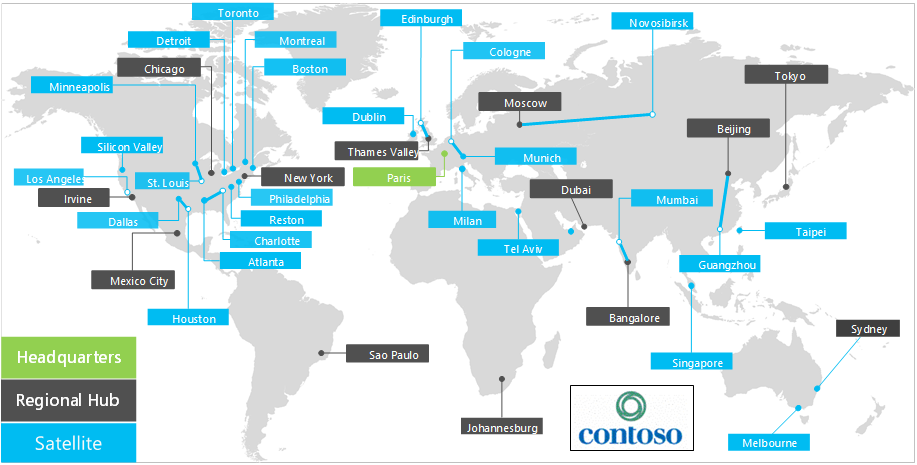

# Información general sobre Contoso Corporation

Contoso Corporation es una empresa multinacional con sede en París, Francia. Es una organización conglomerada de fabricación, ventas y soporte técnico con más de 100 000 productos.

## Contoso en todo el mundo

En la figura 1, se muestran la sede central en París, las oficinas de los centros regionales y las oficinas satélite en varios continentes.

**Figura 1: Oficinas de Contoso en todo el mundo**
 
Las oficinas de Contoso en todo el mundo siguen un diseño de tres niveles.

- Sede

  La sede de Contoso Corporation se encuentra en unas grandes instalaciones corporativas en las afueras de París con decenas de edificios de instalaciones administrativas, de ingeniería y fabricación. Todos los centros de datos de Contoso y su presencia en Internet se albergan en la sede de París.

  La sede cuenta con 25 000 empleados.

- Centros regionales

  Las oficinas de centros regionales sirven a una región específica del mundo con el 60 % de ventas y personal de soporte técnico. Cada centro regional está conectado a la sede de París con un vínculo WAN de ancho de banda alto. 

  Cada centro regional tiene un promedio de 2000 trabajadores.

- Oficinas satélite

  Las oficinas satélite hospedan un 80 % del personal de ventas, y proporcionan presencia física e in situ para los clientes de Contoso en ciudades importantes o subregiones. Cada oficina satélite está conectada a un hub regional con un vínculo WAN de ancho de banda alto.

  Cada oficina satélite tiene un promedio de 250 trabajadores.

El 25 % de la plantilla de Contoso es exclusivamente móvil, con un porcentaje más alto de trabajadores exclusivamente móviles en los centros regionales y las oficinas satélite. Proporcionar soporte técnico mejorado para los trabajadores exclusivamente móviles es un objetivo empresarial importante para Contoso.

## Consideraciones de diseño para Microsoft 365 para empresas

Los arquitectos de TI de Contoso identificaron los siguientes requisitos y consideraciones de diseño al implementar Microsoft 365 para empresas: 

- Varias ubicaciones geográficas con normativas y requisitos de cumplimiento locales
- Un centro de datos de intranet en la sede central y servidores de aplicaciones regionales que hospedan aplicaciones internas de línea de negocio
- Una infraestructura existente de Microsoft Endpoint Configuration Manager
- Una combinación de dispositivos informáticos cliente, incluidos dispositivos Windows, Mac y Linux
- Una combinación de dispositivos móviles personales y dispositivos propiedad de la empresa, incluidos dispositivos iOS (iPhone y iPad) y smartphones y tabletas Android
- Muchos trabajadores remotos y móviles
- Muchos asociados comerciales
- Una gran cantidad de información de clientes y de identificación personal
- Una gran cantidad de propiedad intelectual de gran valor en forma de especificaciones de diseño de productos y secretos empresariales de fabricación

## Siguiente paso

[Obtenga información](contoso-infra-needs.md) acerca de la infraestructura de ti local de Contoso Corporation y cómo se dirigiron sus necesidades empresariales con Microsoft 365 para empresas.

## Vea también

[Información general de Microsoft 365 Enterprise](microsoft-365-overview.md)

[Guías del laboratorio de pruebas](m365-enterprise-test-lab-guides.md)

