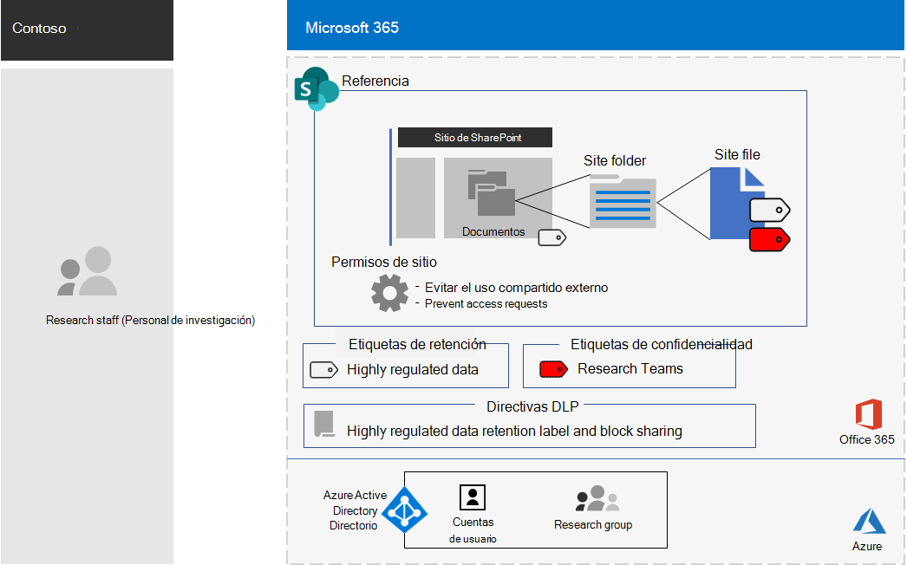

# Sitio de SharePoint para activos digitales altamente confidenciales de Contoso CorporationSharePoint site for highly confidential digital assets of the Contoso Corporation

Los activos más valiosos de Contoso son su propiedad intelectual en forma de secretos comerciales, como técnicas de fabricación patentadas, así como especificaciones de diseño para productos que están en desarrollo.Contoso's most valuable assets are its intellectual property in the form of trade secrets, such as proprietary manufacturing techniques, and design specifications for products that are in development. Estos activos estaban en formato digital, que se almacenaban originalmente como archivos en un sitio de SharePoint Server 2016.These assets were in digital form, originally stored as files on a SharePoint Server 2016 site. Cuando contoso implementó Microsoft 365 Enterprise, quería realizar la transición de sus activos digitales locales a la nube para facilitar el acceso y aumentar la colaboración entre los equipos de investigación de París, Moscú, Nueva York, Beijing y Bangalore.When Contoso deployed Microsoft 365 Enterprise, they wanted to transition their on-premises digital assets to the cloud for easier access and more open collaboration across research teams in Paris, Moscow, New York, Beijing, and Bangalore. 
  
Sin embargo, debido a su carácter confidencial, el acceso a estos archivos debe ser:However, due to their sensitive nature, access to these files must be:

- Restringido al conjunto de personas a las que se les permite acceder a ellos.Restricted to the set of people who are allowed access them. 
- Protegido con una directiva de prevención de pérdida de datos (DLP) para evitar que los usuarios los distribuyan fuera del sitio.Protected with a Data Loss Prevention (DLP) policy to prevent users from distributing them outside the site.
- Cifrado y protegido con permisos para evitar que los usuarios no autorizados obtengan acceso a su contenido, incluso si se distribuyen fuera del sitio.Encrypted and protected with permissions to prevent unauthorized users from accessing their contents, even if they are distributed outside the site.

Los administradores de SharePoint y de seguridad en el Departamento de TI de Contoso decidieron usar un [sitio de SharePoint para datos altamente regulados](teams-sharepoint-online-sites-highly-regulated-data.md).Security and SharePoint administrators in Contoso's IT department decided to use a [SharePoint site for highly regulated data](teams-sharepoint-online-sites-highly-regulated-data.md).
  
Contoso usó estos pasos para crear y proteger sitios de grupo de SharePoint para sus equipos de investigación.Contoso used these steps to create and secure a SharePoint team sites for their research teams.

## Paso 1: crear un sitio de grupo privado de SharePointStep 1: Created a private SharePoint team site

Para proteger el acceso al sitio de SharePoint, contoso ha configurado las [directivas de acceso de SharePoint recomendadas](sharepoint-file-access-policies.md).To protect access to the SharePoint site, Contoso IT configured the [recommended SharePoint access policies](sharepoint-file-access-policies.md).

Después, los administradores de Contoso IT recopilaron una lista de las cuentas de usuario de los investigadores de sus oficinas de París, Moscú, Nueva York, Beijing y Bangalore.Next, Contoso IT admins compiled a list of the user accounts for the researchers in their Paris, Moscow, New York, Beijing, and Bangalore offices. 

A continuación, un administrador de TI de Contoso ha creado un nuevo sitio de grupo privado denominado **Research** y ha agregado todas las cuentas de usuario para sus investigadores.Next, a Contoso IT admin created a new private team site named **Research** and added all of the user accounts for its researchers.

A continuación, se configuraron opciones de permisos adicionales para el sitio con el fin de evitar que los investigadores compartan el acceso al sitio y evitar que los investigadores soliciten acceso al sitio.Then they configured additional permission settings for the site to prevent researchers from sharing access to the site and to prevent non-researchers from requesting access to the site.

## Paso 2: configurar el sitio para una directiva DLP restrictivaStep 2: Configured the site for a restrictive DLP policy

En primer lugar, los administradores de Contoso aplicaron la etiqueta de retención **altamente confidencial** existente a la carpeta documentos del sitio de **investigación** .First, Contoso admins applied the existing **Highly Confidential** retention label to the Documents folder of the **Research** site.

A continuación, creamos una nueva Directiva de DLP denominada **Research** que:Next, they created a new DLP policy named **Research** that:

- Usa la etiqueta de retención **muy confidencial** .Uses the **Highly Confidential** retention label. 
- Bloquea a los usuarios cuando intentan compartir un activo digital en el sitio de **investigación** fuera de contoso.Blocks users when they attempt to share a digital asset on the **Research** site outside of Contoso.

Para obtener información detallada sobre la configuración, vea [proteger archivos de SharePoint con etiquetas de retención y DLP](https://docs.microsoft.com/office365/enterprise/protect-sharepoint-online-files-with-office-365-labels-and-dlp).For the configuration details, see [Protect SharePoint files with retention labels and DLP](https://docs.microsoft.com/office365/enterprise/protect-sharepoint-online-files-with-office-365-labels-and-dlp).

## Paso 3: se creó una subetiqueta de confidencialidad para el sitioStep 3: Created a sensitivity sublabel for the site

Los administradores de Contoso crearon una nueva subetiqueta de sensibilidad denominada **Research Teams** de la etiqueta **extremadamente confidencial** que:Contoso admins created a new sensitivity sublabel named **Research Teams** of the **Highly Confidential** label that:

- Requiere cifrado.Requires encryption.
- Permite permisos de co-autoría para el grupo de **investigación** 365 de MicrosoftAllows Co-Author permissions for the **Research** Microsoft 365 group
- Se aplica al grupo de **investigación** de Microsoft 365Applies to the **Research** Microsoft 365 group

Esta es la configuración resultante del sitio de grupo de **investigación** para los activos extremadamente confidenciales.Here is the resulting configuration of the **Research** team site for highly confidential assets.

Los archivos de las carpetas del sitio de **investigación** están protegidos por:Files in folders of the **Research** site are protected by:

- Los permisos del sitio, que solo permiten el acceso a los miembros del grupo de **investigación** 365 de Microsoft.The site permissions, which only allow access to members of the **Research** Microsoft 365 group.
- La Directiva DLP de **investigación** , que usa la etiqueta de retención y la configuración de retención **extremadamente confidenciales** , que impiden que el archivo se comparta con usuarios externos.The **Research** DLP policy, which uses the **Highly Confidential** retention label and settings that prevent the file from being shared with external users.
- Subetiqueta de confidencialidad de los **equipos de investigación** , con cifrado y permisos que viajan con el archivo si se mueven o se copian desde el sitio de **investigación** .The **Research Teams** sensitivity sublabel, with encryption and permissions that travel with the file if it is moved or copied from the **Research** site.

A continuación, se muestra un ejemplo de un archivo almacenado en el sitio de **investigación** con la subetiqueta de confidencialidad de **Teams de investigación** asignada.Here is an example of a file stored in the **Research** site with the **Research Teams** sensitivity sublabel assigned.

## Paso 4: migrar los datos de la investigación de SharePoint localStep 4: Migrated the on-premises SharePoint research data

Los administradores de Contoso movieron todos los archivos de investigación local en el sitio local de SharePoint Server 2016 a las carpetas del nuevo sitio de SharePoint de **referencia** .Contoso admins moved all of the on-premises research files in the on-premises SharePoint Server 2016 site to folders in the new **Research** SharePoint site.

## Paso 5: formación de sus investigadoresStep 5: Trained their researchers

El personal de seguridad de Contoso ha entrenado a los miembros del grupo de **investigación** Microsoft 365 en un curso obligatorio que les ha ejecutado:Contoso security staff trained the members of the **Research** Microsoft 365 group in a mandatory course that stepped them through:

- Cómo obtener acceso al nuevo sitio de **investigación** y sus archivos existentes.How to access the new **Research** site and its existing files.
- Cómo crear archivos nuevos en el sitio o cargar archivos nuevos almacenados de forma local.How to create new files on the site and upload new files stored locally.
- Una demostración de cómo la Directiva DLP de **investigación** bloquea los archivos para que no se compartan de forma externa.A demonstration of how the **Research** DLP policy blocks files from being shared externally.
- Cómo etiquetar archivos con la subetiqueta de confidencialidad de los **equipos de investigación** .How to label files with the **Research Teams** sensitivity sublabel.
- Una demostración de cómo la subcarpeta **equipos de investigación** protege un archivo incluso cuando se pierde del sitio.A demonstration of how the **Research Teams** sub-label protects a file even when it is leaked from the site.

El resultado final es un entorno seguro en el que los investigadores pueden colaborar a través de Contoso en un entorno seguro en archivos que contienen información de referencia.The end result is a secure environment in which the researchers can collaborate across Contoso in a secure environment on files containing research information. 

Si un documento de investigación de la subetiqueta **equipos de investigación** abandona el sitio de **investigación** , sólo se cifra y es accesible para los miembros del grupo de Microsoft 365 **Research** con credenciales de cuenta de usuario válidas.If a research document with the **Research Teams** sublabel leaves the **Research** site, it is encrypted and accessible only to members of the **Research** Microsoft 365 group with valid user account credentials.

## Siguiente pasoNext step

[Implementar](deploy-microsoft-365-enterprise.md) Microsoft 365 Enterprise en su organización.[Deploy](deploy-microsoft-365-enterprise.md) Microsoft 365 Enterprise in your organization.

## Vea tambiénSee also

[Biblioteca de productividad de Microsoft 365](https://aka.ms/productivitylibrary)(https://aka.ms/productivitylibrary)[Microsoft 365 Productivity Library](https://aka.ms/productivitylibrary) (https://aka.ms/productivitylibrary)
