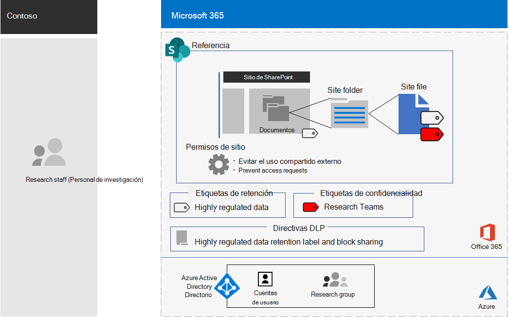
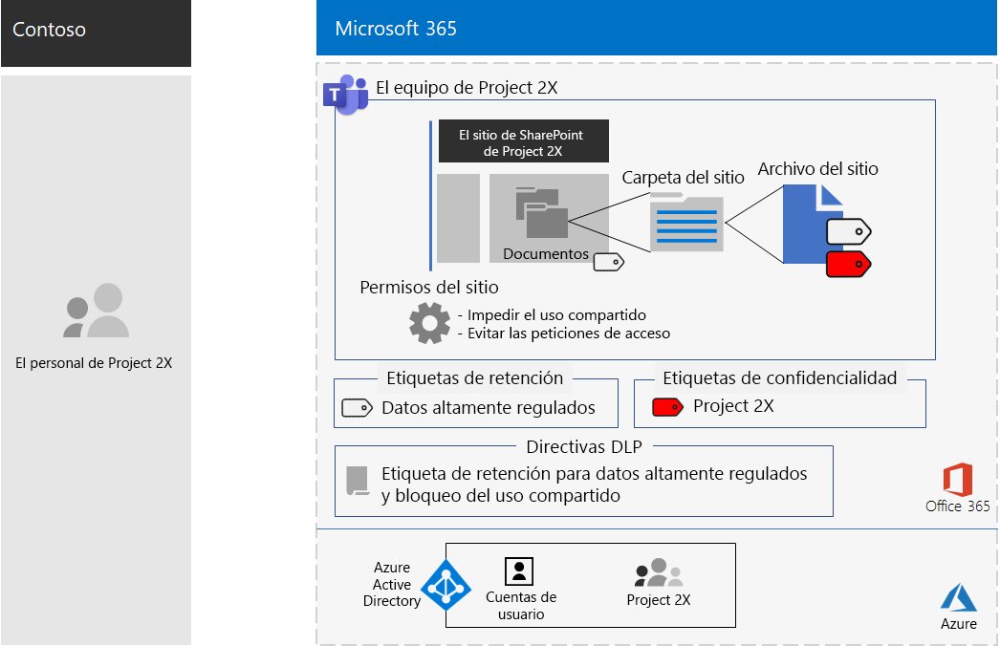

# Equipo para un proyecto confidencial de la empresa ContosoTeam for a top-secret project of the Contoso Corporation

Después de una ejecutiva fuera del sitio, el CEO de Contoso solicitó el desarrollo de un nuevo conjunto de productos y servicios que podían duplicar las ganancias de Contoso en los próximos cinco años.After an executive offsite, Contoso’s CEO ordered the development of a new suite of products and services that could double Contoso’s profits in the next five years. El proyecto principal para desarrollar el plan empresarial, de ingeniería y de mercado se llamaba **proyecto 2x** y el personal clave en toda la compañía ha sido reclutado.The top-secret project to develop the business, engineering, and market plan was named **Project 2X** and key staff across the company were recruited. 

Las escalas de tiempo para la investigación y el desarrollo han sido estrictas, lo que significaba que la colaboración tenía que ser eficaz y proporcionar reuniones seguras, conversaciones en curso y almacenamiento de archivos.The timelines for research and development were tight, which meant that collaboration had to be efficient and provide for secure meetings, ongoing conversations, and file storage.

Las entregas resultantes del proyecto 2 fueron los planes de negocio, las especificaciones de ingeniería y productos, y los materiales y programaciones de marketing en forma de archivos de Word, Excel y PowerPoint.The resulting deliverables for Project 2X were business plans, product and engineering specifications, and marketing materials and schedules in the form of Word, Excel, and PowerPoint files. 

Debido a su naturaleza confidencial, el acceso a estos archivos ha sido:Due to their sensitive nature, access to these files were:

- Restringido al proyecto el doble de miembros del equipo.Restricted to Project 2X team members.
- Está protegido con una directiva de prevención de pérdida de datos (DLP) para evitar que los miembros del equipo con un uso compartido al doble del equipo lo compartan fuera del equipo.Protected with a Data Loss Prevention (DLP) policy to prevent Project 2X team members from sharing them outside the team.
- Cifrado y protegido con permisos para permitir el acceso solo al doble integrante del equipo, incluso si los archivos se distribuyeron fuera de contoso.Encrypted and protected with permissions to allow access only to Project 2X team members, even if the files were distributed outside of Contoso.

El personal de TI de Contoso usó un [equipo para datos altamente regulados](secure-teams-highly-regulated-data-scenario.md) para el proyecto 2x y estos pasos.Contoso IT staff used a [team for highly-regulated data](secure-teams-highly-regulated-data-scenario.md) for Project 2X and these steps.

## Paso 1: creación de un equipo privado y bloqueo del sitio de SharePoint subyacenteStep 1: Created a private team and locked down the underlying SharePoint site

Para proteger el acceso al sitio de SharePoint subyacente del equipo, los administradores de TI de Contoso configuraron las [directivas de acceso de SharePoint recomendadas](sharepoint-file-access-policies.md).To protect access to the underlying SharePoint site for the team, Contoso IT administrators configured the [recommended SharePoint access policies](sharepoint-file-access-policies.md).

A continuación, un administrador de Contoso ha creado un nuevo equipo privado denominado proyecto 2X y ha agregado las cuentas de usuario del proyecto el doble de personal como miembros.Next, a Contoso IT administrator created a new private team named Project 2X and added the user accounts of Project 2X staff as members.

A continuación, se configuraron opciones de permisos adicionales para el sitio con el fin de evitar que Project 2X comparta el acceso al sitio y evitar que se solicite el acceso al sitio.Next, they configured additional permission settings for the site to prevent Project 2X from sharing access to the site and to prevent other from requesting access to the site.

Para obtener información detallada sobre la configuración, vea [configuración de SharePoint para un equipo altamente regulado](https://docs.microsoft.com/microsoft-365/security/office-365-security/deploy-teams-three-tiers#highly-confidential-teams).For the configuration details, see [SharePoint settings for a highly regulated team](https://docs.microsoft.com/microsoft-365/security/office-365-security/deploy-teams-three-tiers#highly-confidential-teams).

## Paso 2: configurar una directiva DLP y el sitio subyacente para una etiqueta de retenciónStep 2: Configured a DLP policy and the underlying site for a retention label 

En primer lugar, los administradores de Contoso aplicaron la etiqueta de retención **altamente confidencial** existente a la sección de **documentos** del sitio de SharePoint subyacente del equipo del proyecto de dos equipos.First, Contoso admins applied the existing **Highly Confidential** retention label to the **Documents** section of the underlying SharePoint site of the Project 2X team.

A continuación, creamos una nueva Directiva DLP denominada **proyecto 2x** que:Next, they created a new DLP policy named **Project 2X** that:

- Usa la etiqueta de retención muy confidencial.Uses the Highly Confidential retention label.
- Bloquea a los usuarios cuando intentan compartir un archivo en el equipo del proyecto el doble de equipo fuera de contoso.Blocks users when they attempt to share a file in the Project 2X team outside of Contoso.

Para obtener información detallada sobre la configuración, consulte [proteger archivos en Microsoft Teams con etiquetas de retención y DLP](https://docs.microsoft.com/microsoft-365/security/office-365-security/deploy-teams-retention-dlp).For the configuration details, see [Protect files in teams with retention labels and DLP](https://docs.microsoft.com/microsoft-365/security/office-365-security/deploy-teams-retention-dlp).

## Paso 3: se creó una etiqueta de confidencialidad para el equipo del proyecto de dos equiposStep 3: Created a sensitivity label for the Project 2X team

Los administradores de Contoso crearon una nueva etiqueta de confidencialidad denominada **proyecto 2x** que:Contoso admins created a new sensitivity label named **Project 2X** that:

- Requiere cifrado.Requires encryption.
- Permite permisos de coautoría para el grupo 2 del proyecto en el segundo grupo de Microsoft 365.Allows Co-Author permissions for the Project 2X Microsoft 365 group.

Esta es la configuración resultante del equipo del proyecto de 2X.Here is the resulting configuration of the Project 2X team.

 
Los archivos de la sección documentos del proyecto subyacente 2X del sitio de SharePoint estaban protegidos por:Files in the Documents section of the underlying Project 2X SharePoint site were protected by:

- Los permisos del sitio, que solo permiten el acceso a los miembros del grupo de 2 a 2 grupos de Microsoft 365.The site permissions, which only allow access to members of the Project 2X Microsoft 365 group.
- La etiqueta de retención extremadamente confidencial, que se asigna automáticamente a nuevos archivos.The  Highly Confidential retention label, which is automatically assigned to new files.
- Una directiva DLP que usa la etiqueta de retención extremadamente confidencial y la configuración que impide que el archivo se comparta con usuarios externos.A DLP policy that uses the Highly Confidential retention label and settings that block the file from being shared with external users.
- La etiqueta de sensibilidad proyecto 2X, con cifrado y permisos que viajan con el archivo si se mueven o se copian del sitio.The Project 2X sensitivity label, with encryption and permissions that travel with the file if it is moved or copied from the site.

A continuación, se muestra un ejemplo de un archivo almacenado en el sitio del espacio de nombre 2X subyacente con la etiqueta de retención altamente regulada y la etiqueta de sensibilidad espacio en proyecto 2X asignada.Here is an example of a file stored in the underlying Project 2X site with the Highly Regulated retention label and the Project 2X sensitivity label assigned.

 
## Paso 4: miembros del equipo con experiencia en el 2X del proyectoStep 4: Trained Project 2X team members

El personal de seguridad de Contoso ha entrenado en el proyecto el doble de miembros del equipo en un curso obligatorio que les ha ejecutado:Contoso security staff trained the Project 2X team members in a mandatory course that stepped them through:

- Cómo obtener acceso al nuevo proyecto el equipo al doble, usar reuniones y chats y cómo colaborar en archivos de equipo.How to access the new Project 2X team, use meetings and chats, and how to collaborate on team files.
- Cómo crear nuevos archivos en el equipo y cargar nuevos archivos creados de forma local.How to create new files in the team and upload new files created locally.
- Una demostración de cómo la Directiva DLP bloquea los archivos para que no se compartan de forma externa.A demonstration of how the DLP policy blocks files from being shared externally.
- Cómo etiquetar archivos con la etiqueta de confidencialidad del proyecto de dos.How to label files with the Project 2X sensitivity label.
- Una demostración de cómo la etiqueta del proyecto 2X protege un archivo incluso cuando éste sale del equipo.A demonstration of how the Project 2X  label protects a file even when it leaves the team.

El resultado final fue un entorno seguro en el que el proyecto 2X de miembros del equipo colaboraron en un entorno seguro para chats, reuniones y archivos.The end result was a secure environment in which Project 2X team members collaborated in a secure environment for chats, meetings, and files.

En un par de instancias, Project 2X los miembros del equipo descargaron archivos protegidos por la etiqueta del proyecto 2X en una unidad local para trabajar sin conexión.In a couple of instances, Project 2X team members downloaded files protected by the Project 2X label to a local drive for offline work. Sin embargo, después de que se soliciten las credenciales al abrirlas, se han dado cuenta de su error y se han eliminado.However, after being prompted for credentials when opening them, they realized their mistake and deleted them.

Debido al entorno de colaboración de Microsoft Teams y las características de seguridad de Microsoft 365, los detalles del proyecto 2X se mantuvieron en secreto mientras dure el proyecto.Because of the collaboration environment of Teams and the security features of Microsoft 365, the details of Project 2X were kept secret for the duration of the project. Contoso anunció sus planes y se encuentra en el proceso de implementar los nuevos productos y servicios a la alegría de sus clientes e inversionistas y la Chagrin de sus competidores.Contoso announced its plans and is in the process of rolling out the new products and services to the delight of its customers and investors and the chagrin of its competitors.

## Siguiente pasoNext step

[Implementar](deploy-microsoft-365-enterprise.md) Microsoft 365 Enterprise en su organización.[Deploy](deploy-microsoft-365-enterprise.md) Microsoft 365 Enterprise in your organization.

## Vea tambiénSee also

[Biblioteca de productividad de Microsoft 365](https://aka.ms/productivitylibrary)(https://aka.ms/productivitylibrary)[Microsoft 365 Productivity Library](https://aka.ms/productivitylibrary) (https://aka.ms/productivitylibrary)
