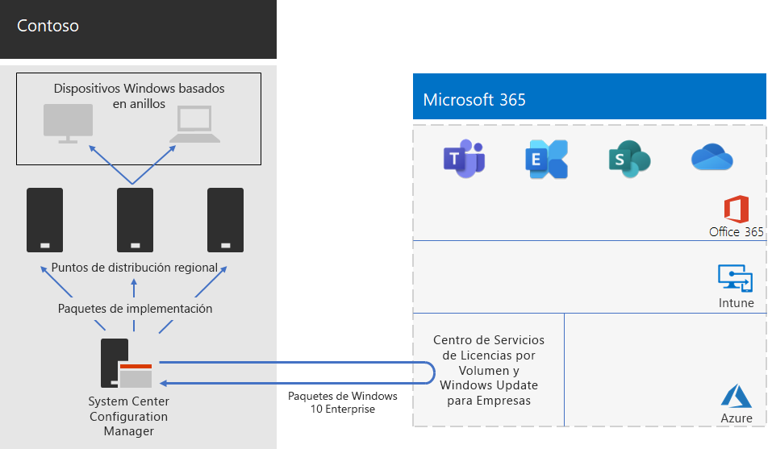

# Implementación de Windows 10 Enterprise para Contoso

**Resumen:** Entienda cómo Contoso usó Configuration Manager de Microsoft Endpoint para implementar las actualizaciones locales de Windows 10 Enterprise.

Antes de la amplia implementación de Microsoft 365 Enterprise, Contoso tenía equipos y dispositivos compatibles con Windows con una combinación de Windows 7 (10 %), Windows 8.1 (65 %) y Windows 10 (25 %). Contoso quería actualizar sus equipos para que Windows 10 Enterprise aprovechara las ventajas de la seguridad avanzada y la reducción de la sobrecarga de TI de las implementaciones automatizadas de las actualizaciones. 

Después de evaluar la infraestructura y las necesidades empresariales, Contoso identificó estos requisitos de implementación principales:

- Se debería ejecutar Windows 10 Enterprise en el mayor número posible de equipos y dispositivos.
- La implementación de las actualizaciones locales aprovecha la infraestructura existente de Configuration Manager.
- Control sobre qué versiones de Windows 10 Enterprise se implementan y actualizan a través de anillos.
- Los equipos y dispositivos se deberían mantener actualizados con los mínimos costos administrativos de TI y el menor impacto en los usuarios finales.

Actualizado se define como la versión compatible de Windows 10 Enterprise que satisface las necesidades empresariales de Contoso, lo que puede diferir de tener equipos compatibles con Windows con la versión más reciente de Windows 10 Enterprise.

## Herramientas de implementación

Antes y durante las actualizaciones locales de Windows 10 Enterprise, Contoso usó las siguientes soluciones de Windows Analytics:

- Upgrade Readiness  

  Recopila datos del sistema, aplicaciones y controladores para el análisis y, después, identifica los problemas de compatibilidad que pueden bloquear una actualización y sugiere correcciones de los problemas que Microsoft conoce.

- Update Compliance  

  Le muestra el estado de sus dispositivos con respecto a las actualizaciones de Windows, para que pueda asegurarse de que tienen instaladas las actualizaciones más recientes según corresponda.

- Estado del dispositivo  

  Identifica los dispositivos que se bloquean con frecuencia y que quizás deban volver a crearse o reemplazarse, y los controladores de dispositivos que estén causando bloqueos en los mismos, y ofrece sugerencias de versiones alternativas de dichos controladores que pueden reducir el número de bloqueos. Proporciona una notificación de las configuraciones incorrectas de Windows Information Protection que envía avisos a los usuarios finales.
 
Contoso tiene una infraestructura existente de Configuration Manager (Rama actual). Configuration Manager se escala en entornos de gran tamaño y proporciona un amplio control sobre la instalación, las actualizaciones y la configuración. También incluye características integradas para que sea más fácil y eficaz implementar y administrar Windows 10 Enterprise.

## Proceso de planeación

Antes de la implementación, Contoso definió los anillos siguientes:

- Tres anillos de validación y pruebas de implementación 
  - Uno para las compilaciones de versión preliminar 
  - Uno para las compilaciones de versión nuevas
  - Uno para una versión anterior 
- Un anillo para la implementación general de Windows 10 Enterprise en función de los datos de los anillos de validación

Contoso también usó la solución Upgrade Readiness de Windows Analytics para determinar el conjunto de aplicaciones instaladas y su compatibilidad con Windows 10 Enterprise.

## Proceso de implementación

Para completar la implementación de actualizaciones locales de Windows 10 Enterprise, Contoso implementó el siguiente proceso, que incluye los procedimientos recomendados de Microsoft:

1. Habilitó la caché del mismo nivel para Configuration Manager.
2. Creó paquetes de Windows personalizados en función de imágenes del Centro de servicios de licencias por volumen.
3. Usó Configuration Manager para implementar los paquetes de Windows en puntos de distribución en su red e implementó las compilaciones en los tres anillos de validación y pruebas de implementación.
4. Evaluó el éxito de los equipos y dispositivos en los tres anillos de validación y pruebas de implementación mediante las soluciones Estado del dispositivo y Update Compliance de Windows Analytics.
5. Según la información de Windows Analytics, Contoso determinó la versión de Windows 10 Enterprise que se iba a implementar en el anillo de implementación general.
6. Ejecutó las secuencias de tareas de implementación de Configuration Manager para implementar el paquete de Windows seleccionado en el anillo de implementación general.
7. Equipos y dispositivos del anillo de implementación general supervisados mediante las soluciones para solucionar los problemas.

Aquí se muestra la arquitectura de implementación de actualización local y actualizaciones continuas de Contoso.

Esta infraestructura consta de:

- Configuration Manager, el cual:
  - Obtiene imágenes de paquetes de Windows 10 Enterprise del Centro de servicios de licencias por volumen de Microsoft en Microsoft Network.
  - Es el punto de administración central para los paquetes de implementación.
- Puntos de distribución regionales que normalmente se encuentran en las oficinas centrales regionales de Contoso.
- Equipos y dispositivos Windows en diferentes ubicaciones que reciben e instalan los paquetes de implementación para la actualización local o las actualizaciones continuas según el anillo al que pertenezcan.

## Paso siguiente

[Aprenda](contoso-o365pp.md) cómo Contoso aprovecha su infraestructura de Configuration Manager para implementar y mantener actualizado Office 365 ProPlus en toda la organización. 

## Vea también

[Windows 10 Enterprise para Microsoft 365 Enterprise](windows10-infrastructure.md)

[Guía de implementación](deploy-microsoft-365-enterprise.md)

[Guías del laboratorio de pruebas](m365-enterprise-test-lab-guides.md)
