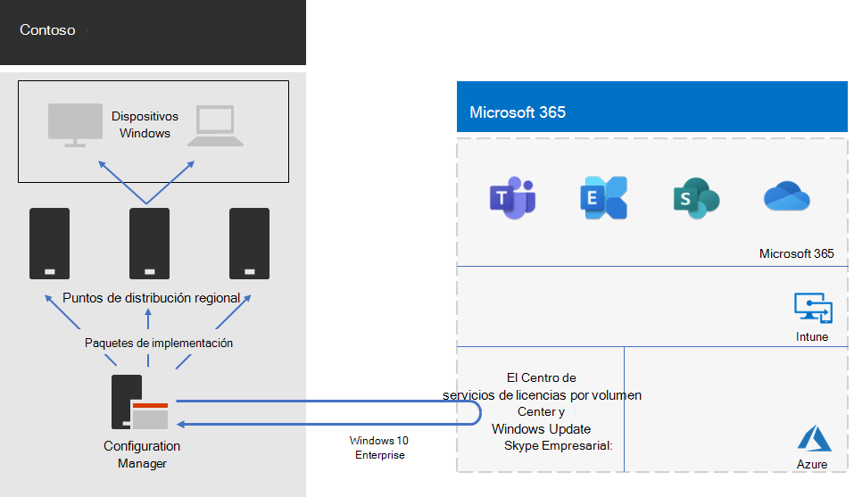

# Implementación de Windows 10 Enterprise para ContosoWindows 10 Enterprise deployment for Contoso

Antes de la implementación de Microsoft 365 para empresas, Contoso tenía equipos y dispositivos compatibles con Windows que ejecutaba una mezcla de Windows 7 (10%), Windows 8.1 (65%) y Windows 10 (25%).Prior to the wide rollout of Microsoft 365 for enterprise, Contoso had Windows-compatible PCs and devices running a mixture of Windows 7 (10%), Windows 8.1 (65%), and Windows 10 (25%). Contoso quería actualizar sus equipos para Windows 10 Enterprise aprovechar la seguridad avanzada y reducir la sobrecarga de TI de las implementaciones automatizadas de actualizaciones.Contoso wanted to upgrade their PCs for Windows 10 Enterprise take advantage of advanced security and lowered IT overhead from automated deployments of updates. 

Después de evaluar la infraestructura y las necesidades empresariales, Contoso identificó estos requisitos de implementación principales:After assessing their infrastructure and business needs, Contoso identified these key requirements for the deployment:

- Se debería ejecutar Windows 10 Enterprise en el mayor número posible de equipos y dispositivos.As many PCs and devices as possible should run Windows 10 Enterprise
- La implementación de las actualizaciones locales aprovecha la infraestructura existente de Configuration Manager.Rollout of the in-place upgrades leverages existing Configuration Manager infrastructure
- Control sobre qué versiones de Windows 10 Enterprise se implementan y actualizan a través de anillos.Control over which versions of Windows 10 Enterprise to deploy and updates are done through rings
- Los equipos y dispositivos se deberían mantener actualizados con los mínimos costos administrativos de TI y el menor impacto en los usuarios finales.PCs and devices should stay up to date with minimal IT administrative costs and with minimal impact to end-users

Actualizado se define como la versión compatible de Windows 10 Enterprise que satisface las necesidades empresariales de Contoso, lo que puede diferir de tener equipos compatibles con Windows con la versión más reciente de Windows 10 Enterprise.Up to date is defined as the supported version of Windows 10 Enterprise that meets Contoso’s business needs, which can be different from having all Windows-compatible PCs running the latest version of Windows 10 Enterprise.

## Herramientas de implementaciónDeployment tools

Antes y durante las actualizaciones locales de Windows 10 Enterprise, Contoso usó las siguientes soluciones de Windows Analytics:Prior to and during in-place upgrades of Windows 10 Enterprise, Contoso used the following solutions of Windows Analytics:

- Upgrade ReadinessUpgrade Readiness  

  Recopila datos del sistema, aplicaciones y controladores para el análisis y, después, identifica los problemas de compatibilidad que pueden bloquear una actualización y sugiere correcciones de los problemas que Microsoft conoce.Collects system, application, and driver data for analysis, and then identifies compatibility issues that can block an upgrade and suggested fixes the issues are known to Microsoft.

- Update ComplianceUpdate Compliance  

  Le muestra el estado de sus dispositivos con respecto a las actualizaciones de Windows, para que pueda asegurarse de que tienen instaladas las actualizaciones más recientes según corresponda.Shows you the state of your devices with respect to the Windows updates so that you can ensure that they are on the most current updates as appropriate.

- Estado del dispositivoDevice Health  

  Identifica los dispositivos que se bloquean con frecuencia y que quizás deban volver a crearse o reemplazarse, y los controladores de dispositivos que estén causando bloqueos en los mismos, y ofrece sugerencias de versiones alternativas de dichos controladores que pueden reducir el número de bloqueos.Identifies devices that crash frequently, and therefore might need to be rebuilt or replaced and device drivers that are causing device crashes, with suggestions of alternative versions of those drivers that might reduce the number of crashes. Proporciona una notificación de las configuraciones incorrectas de Windows Information Protection que envía avisos a los usuarios finales.Provides notification of Windows Information Protection misconfigurations that send prompts to end users.
 
Contoso tiene una infraestructura existente de Configuration Manager (Rama actual). Configuration Manager se escala en entornos de gran tamaño y proporciona un amplio control sobre la instalación, las actualizaciones y la configuración. También incluye características integradas para que sea más fácil y eficaz implementar y administrar Windows 10 Enterprise.Contoso has an existing Configuration Manager (Current Branch) infrastructure. Configuration Manager scales for large environments and provides extensive control over installation, updates, and settings. It also has built-in features to make it easier and more efficient to deploy and manage Windows 10 Enterprise.

## Proceso de planeaciónPlanning process

Contoso usó la preparación de actualización en Windows Analytics para determinar el conjunto de aplicaciones instaladas y su compatibilidad con Windows 10 Enterprise.Contoso used the Upgrade Readiness in Windows Analytics to determine the set of installed apps and their compatibility with Windows 10 Enterprise.

## Proceso de implementaciónDeployment process

Para completar la implementación de actualizaciones locales de Windows 10 Enterprise, Contoso implementó el siguiente proceso, que incluye los procedimientos recomendados de Microsoft:To complete the in-place upgrade deployment of Windows 10 Enterprise, Contoso implemented the following process, which includes best practice recommendations from Microsoft:

1. Habilitó la caché del mismo nivel para Configuration Manager.Enabled peer cache for Configuration Manager.
2. Creó paquetes de Windows personalizados en función de imágenes del Centro de servicios de licencias por volumen.Created customized Windows packages based on images from the Volume Licensing Service Center.
3. Se usó Configuration Manager para implementar los Windows paquetes de distribución en puntos de distribución en toda la red y se implementaron compilaciones en los tres grupos de validación e implementación provisional.Used Configuration Manager to deploy the Windows packages to distribution points across their network and deployed builds to the three validation and deployment staging groups.
4. Evaluó el éxito de los equipos y dispositivos en los tres anillos de validación y pruebas de implementación mediante las soluciones Estado del dispositivo y Update Compliance de Windows Analytics.Performed assessment of success for PCs and devices in the three validation and deployment staging rings using the Device Health and Update Compliance solutions of Windows Analytics.
5. En función de la Windows analytics, Contoso determinó la versión de Windows 10 Enterprise implementar en el grupo de implementación general.Based on the Windows Analytics information, Contoso determined the version of Windows 10 Enterprise to deploy to the broad deployment group.
6. Se ejecutaron las secuencias de tareas de implementación de Configuration Manager para implementar el paquete Windows seleccionado en el grupo de implementación general.Ran the Configuration Manager deployment task sequences to deploy the selected Windows package to the broad deployment group.
7. Equipos y dispositivos supervisados en el grupo de implementación general mediante las soluciones de mantenimiento de dispositivos y cumplimiento de actualizaciones para solucionar problemas.Monitored PCs and devices in the broad deployment group using the Device Health and Update Compliance solutions to address issues.

Aquí se muestra la arquitectura de implementación de actualización local y actualizaciones continuas de Contoso.Here is Contoso’s in-place upgrade and ongoing updates deployment architecture.

Esta infraestructura consta de:This infrastructure consists of:

- Configuration Manager, el cual:Configuration Manager, which:
  - Obtiene imágenes de paquetes de Windows 10 Enterprise del Centro de servicios de licencias por volumen de Microsoft en Microsoft Network.Obtains images for Windows 10 Enterprise packages from the Microsoft Volume Licensing Center in the Microsoft Network.
  - Es el punto de administración central para los paquetes de implementación.Is the central administration point for deployment packages.
- Puntos de distribución regionales que normalmente se encuentran en las oficinas centrales regionales de Contoso.Regional distribution points that are typically located in Contoso’s regional hub offices.
- Windows Equipos y dispositivos en distintas ubicaciones que reciben e instalan los paquetes de implementación para la actualización local o actualizaciones en curso basadas en la pertenencia a grupos.Windows PCs and devices in various locations that receive and install the deployment packages for the in-place upgrade or ongoing updates based on group membership.

## Paso siguienteNext step

Obtenga información sobre cómo Contoso está aprovechando su infraestructura de Configuration Manager para [implementar y](contoso-o365pp.md) mantener las actualizaciones Aplicaciones Microsoft 365 para empresas toda la organización.Learn how Contoso is leveraging its Configuration Manager infrastructure to [deploy and keep current Microsoft 365 Apps for enterprise](contoso-o365pp.md) across its organization. 

## Consulte tambiénSee also

[Windows 10 EnterpriseWindows 10 Enterprise](/windows/deployment/)

[Información general de Microsoft 365 EnterpriseMicrosoft 365 for enterprise overview](microsoft-365-overview.md)

[Guías del laboratorio de pruebasTest lab guides](m365-enterprise-test-lab-guides.md)