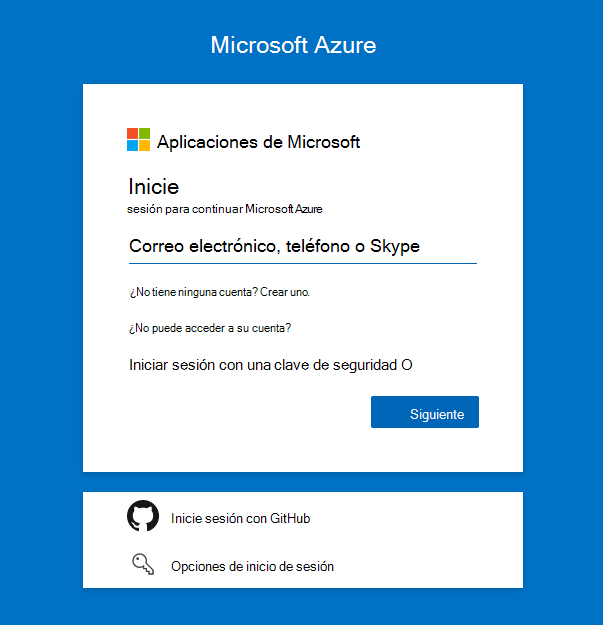
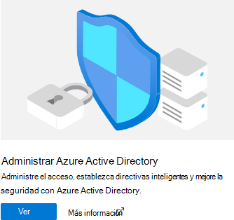
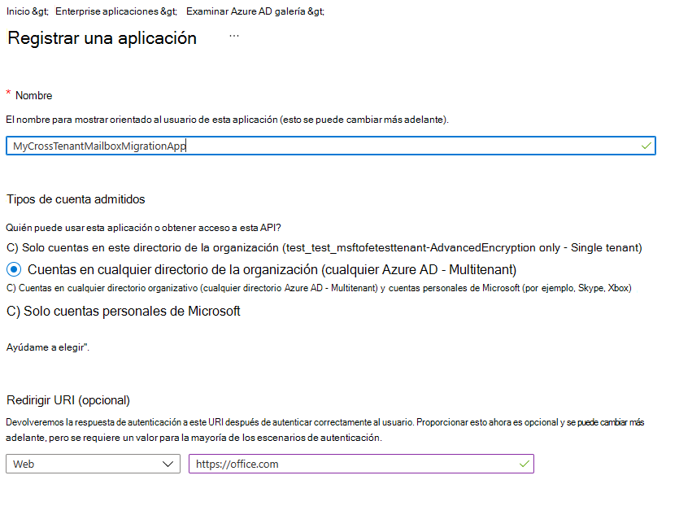
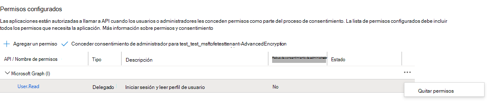

# <a name="cross-tenant-mailbox-migration-preview"></a>Migración de buzones entre inquilinos (versión preliminar)

Normalmente, durante fusiones o desinstituras, necesita la capacidad de mover el buzón de correo de Exchange Online usuario a un nuevo inquilino. La migración de buzones entre inquilinos permite a los administradores de inquilinos usar interfaces conocidas como Remote PowerShell y MRS para realizar la transición de usuarios a su nueva organización.

Los administradores pueden usar el cmdlet New-MigrationBatch, disponible a través del rol de administración Mover buzones, para ejecutar movimientos entre inquilinos.

Los usuarios que migran deben estar presentes en el inquilino de destino Exchange Online como MailUsers, marcado con atributos específicos para habilitar los movimientos entre inquilinos. El sistema producirá un error en los movimientos de los usuarios que no estén configurados correctamente en el espacio empresarial de destino.

Cuando se completan los movimientos, el buzón de usuario de origen se convierte en un MailUser y el targetAddress (que se muestra como ExternalEmailAddress en Exchange) se marca con la dirección de enrutamiento al inquilino de destino. Este proceso deja el mailuser heredado en el inquilino de origen y permite la coexistencia y el enrutamiento de correo. Cuando los procesos empresariales lo permiten, el inquilino de origen puede quitar el mailuser de origen o convertirlo en un contacto de correo.

Las migraciones entre inquilinos Exchange buzones de correo se admiten solo para inquilinos en la nube o híbrida, o cualquier combinación de los dos.

En este artículo se describe el proceso de movimientos de buzones entre inquilinos y se proporcionan instrucciones sobre cómo preparar los inquilinos de origen y de destino para los movimientos de contenido Exchange Online buzón de correo.

   > [!NOTE]
   > Hemos actualizado recientemente nuestros pasos de configuración para habilitar la migración de buzones entre inquilinos para que ya no necesite Azure Key Vault. Si es la primera vez que se incorpora a esta vista previa, no se requiere ninguna acción y puede seguir los pasos detallados en este documento. Si ha comenzado a configurar los inquilinos con el método AKV anterior, le recomendamos encarecidamente que detenga o quite esa configuración para empezar a usar este nuevo método. Si tiene migraciones de buzones en curso con el método AKV anterior, espere hasta que se completen las migraciones existentes y siga los pasos siguientes para habilitar el nuevo método simplificado. Los pasos de configuración necesarios de Azure Key Vault se archivan, pero se pueden encontrar **[aquí](https://github.com/microsoft/cross-tenant/wiki/V1-Content#cross-tenant-mailbox-migration-preview)**, para obtener referencia.

## <a name="preparing-source-and-target-tenants"></a>Preparación de inquilinos de origen y de destino

### <a name="prerequisites-for-source-and-target-tenants"></a>Requisitos previos para inquilinos de origen y de destino

Antes de empezar, asegúrese de que tiene los permisos necesarios para configurar la aplicación Mover buzón en Azure, el extremo de migración de EXO y la relación de organización de EXO.

Además, se requiere al menos un grupo de seguridad habilitado para correo en el espacio empresarial de origen. Estos grupos se usan para establecer el ámbito de la lista de buzones que pueden moverse del espacio empresarial de origen (o a veces denominado recurso) al espacio empresarial de destino. Esto permite al administrador de inquilinos de origen restringir o establecer el ámbito del conjunto específico de buzones que se deben mover, lo que impide que los usuarios no intencionados se migren. No se admiten grupos anidados.

También tendrá que comunicarse con su empresa asociada de confianza (con la que va a mover buzones) para obtener su identificador Microsoft 365 inquilino. Este identificador de inquilino se usa en el campo DomainName de relación de la organización.

Para obtener el identificador de inquilino de una suscripción, inicie sesión en el [Centro de administración de Microsoft 365](https://go.microsoft.com/fwlink/p/?linkid=2024339) y vaya a [https://aad.portal.azure.com/\#blade/Microsoft_AAD_IAM/ActiveDirectoryMenuBlade/Properties](https://aad.portal.azure.com/#blade/Microsoft_AAD_IAM/ActiveDirectoryMenuBlade/Properties) . Haga clic en el icono de copia de la propiedad Id. de inquilino para copiarla en el Portapapeles.

### <a name="configuration-steps-to-enable-your-tenants-for-cross-tenant-mailbox-migrations"></a>Pasos de configuración para habilitar los inquilinos para migraciones de buzones entre inquilinos

   > [!NOTE]
   > Primero debe configurar el destino (destino). Para completar estos pasos, no es necesario que tenga ni conozca las credenciales de administrador de inquilinos para el inquilino de origen y de destino. Los distintos administradores pueden realizar los pasos individualmente para cada inquilino.

### <a name="prepare-the-target-destination-tenant-by-creating-the-migration-application-and-secret"></a>Preparar el inquilino de destino (destino) mediante la creación de la aplicación de migración y el secreto

1. Inicie sesión en el portal de Azure AD ( ) con las credenciales de administrador <https://portal.azure.com> de inquilino de destino

   

2. Haga clic en vista en Administrar Azure Active Directory.

   

3. En la barra de navegación izquierda, seleccione Registros de aplicaciones.

4. Seleccionar nuevo registro

   

5. En la página Registrar una aplicación, en Tipos de cuentas compatibles, seleccione Cuentas en cualquier directorio de la organización (Cualquier directorio Azure AD - Multitenant). A continuación, en URI de redireccionamiento (opcional), seleccione Web y escriba <https://office.com> . Por último, seleccione Registrar.

   

6. En la esquina superior derecha de la página, verás una notificación emergente que indica que la aplicación se creó correctamente.

7. Vuelve a Inicio, Azure Active Directory y haz clic en Registros de aplicaciones.

8. En Aplicaciones de propiedad, busca la aplicación que creaste y haz clic en ella.

9. En ^Essentials, tendrá que copiar el identificador de aplicación (cliente), ya que lo necesitará más adelante para crear una dirección URL para el inquilino de destino.

10. Ahora, en la barra de navegación izquierda, haga clic en Permisos de api para ver los permisos asignados a la aplicación.

11. De forma predeterminada, User. Los permisos de lectura se asignan a la aplicación que creaste, pero no los necesitamos para las migraciones de buzones, puedes quitar ese permiso.

    

12. Ahora necesitamos agregar permisos para la migración de buzones, seleccione Agregar un permiso

13. En las ventanas Solicitar permisos de API, seleccione API que usa mi organización, busque Office 365 Exchange Online y selecciónelo.

    

14. Después, seleccione Permisos de aplicación

15. A continuación, en Seleccionar permisos, expanda Buzón y compruebe Mailbox.Migration y Agregar permisos en la parte inferior de la pantalla.

    

16. Ahora seleccione Certificados & secretos en la barra de navegación izquierda de la aplicación.

17. En Secretos de cliente, seleccione nuevo secreto de cliente.

    

18. En la ventana Agregar un secreto de cliente, escriba una descripción y configure la configuración de expiración deseada.

      > [!NOTE]
      > Esta es la contraseña que se usará al crear el extremo de migración. Es extremadamente importante que copie esta contraseña en el portapapeles o copie esta contraseña en una ubicación segura y secreta. Esta es la única vez que podrá ver esta contraseña. Si de alguna manera lo pierde o necesita restablecerlo, puede volver a iniciar sesión en Azure Portal, ir a Registros de aplicaciones, buscar la aplicación de migración, seleccionar Secretos & certificados y crear un nuevo secreto para la aplicación.

19. Ahora que ha creado correctamente la aplicación de migración y el secreto, tendrá que dar su consentimiento a la aplicación. Para dar su consentimiento a la aplicación, vuelva a la página de aterrizaje de Azure Active Directory, haga clic en aplicaciones de Enterprise en la navegación izquierda, busque la aplicación de migración que creó, selecciónelo y seleccione Permisos en la navegación izquierda.

20. Haga clic en el botón Conceder consentimiento de administrador para [su inquilino].

21. Se abrirá una nueva ventana del explorador y se seleccionará Aceptar.

22. Puedes volver a la ventana del portal y seleccionar Actualizar para confirmar tu aceptación.

23. Formula la dirección URL para enviar a tu partner de confianza (administrador del espacio empresarial de origen) para que también puedan aceptar la aplicación para habilitar la migración de buzones. Este es un ejemplo de la dirección URL para proporcionarles que necesitarás el identificador de aplicación de la aplicación que creaste:

    ```powershell
    https://login.microsoftonline.com/sourcetenant.onmicrosoft.com/adminconsent?client_id=[application_id_of_the_app_you_just_created]&redirect_uri=https://office.com
    ```

    > [!NOTE]
    > Necesitará el identificador de aplicación de la aplicación de migración de buzones que acaba de crear.
    >
    > Deberá reemplazar los sourcetenant.onmicrosoft.com en el ejemplo anterior por los inquilinos de origen correctos onmicrosoft.com nombre.
    >
    > También tendrá que reemplazar [application_id_of_the_app_you_just_created] por el identificador de aplicación de la aplicación de migración de buzones que acaba de crear.

### <a name="prepare-the-target-tenant-by-creating-the-exchange-online-migration-endpoint-and-organization-relationship"></a>Preparar el inquilino de destino creando el punto Exchange Online de migración y la relación de organización

1. Cree una conexión remota de PowerShell al inquilino Exchange Online destino.

2. Crear un nuevo punto de conexión de migración para movimientos de buzones entre inquilinos

   > [!NOTE]
   > Necesitará el identificador de aplicación de la aplicación de migración de buzones que acaba de crear y la contraseña (el secreto) que configuró durante este proceso. También dependiendo de la Microsoft 365 de nube que use el punto de conexión puede ser diferente. Consulte la página [Microsoft 365 puntos](/microsoft-365/enterprise/microsoft-365-endpoints) de conexión y seleccione la instancia correcta para su inquilino y revise la dirección Exchange Online Optimizar requerida y reemplace según corresponda.

   ```powershell
   $AppId = "[guid copied from the migrations app]"

   $Credential = New-Object -TypeName System.Management.Automation.PSCredential -ArgumentList $AppId, (ConvertTo-SecureString -String "[this is your secret password you saved in the previous steps]" -AsPlainText -Force)

   New-MigrationEndpoint -RemoteServer outlook.office.com -RemoteTenant "sourcetenant.onmicrosoft.com" -Credentials $Credential -ExchangeRemoteMove:$true -Name "[the name of your migration endpoint]" -ApplicationId $AppId
   ```

3. Cree un objeto de relación de organización nuevo o edite en el espacio empresarial de origen.

   ```powershell
   $sourceTenantId="[tenant id of your trusted partner, where the source mailboxes are]"
   $orgrels=Get-OrganizationRelationship
   $existingOrgRel = $orgrels | ?{$_.DomainNames -like $sourceTenantId}
   If ($null -ne $existingOrgRel)
   {
       Set-OrganizationRelationship $existingOrgRel.Name -Enabled:$true -MailboxMoveEnabled:$true -MailboxMoveCapability Inbound
   }
   If ($null -eq $existingOrgRel)
   {
       New-OrganizationRelationship "[name of the new organization relationship]" -Enabled:$true -MailboxMoveEnabled:$true -MailboxMoveCapability Inbound -DomainNames $sourceTenantId
   }
   ```

### <a name="prepare-the-source-current-mailbox-location-tenant-by-accepting-the-migration-application-and-configuring-the-organization-relationship"></a>Preparar el espacio empresarial de origen (ubicación actual del buzón) aceptando la aplicación de migración y configurando la relación de la organización

1. Desde un explorador, vaya al vínculo url proporcionado por su socio de confianza para dar su consentimiento a la aplicación de migración de buzones. La dirección URL tendrá este aspecto:

   ```powershell
   https://login.microsoftonline.com/sourcetenant.onmicrosoft.com/adminconsent?client_id=[application_id_of_the_app_you_just_created]&redirect_uri=https://office.com
   ```

   > [!NOTE]
   > Necesitará el identificador de aplicación de la aplicación de migración de buzones que acaba de crear.
   > Deberá reemplazar los sourcetenant.onmicrosoft.com en el ejemplo anterior por los inquilinos de origen correctos onmicrosoft.com nombre.
   > También tendrá que reemplazar [application_id_of_the_app_you_just_created] por el identificador de aplicación de la aplicación de migración de buzones que acaba de crear.

2. Acepte la aplicación cuando aparezca la ventana emergente. También puede iniciar sesión en el portal de Azure Active Directory y buscar la aplicación en Enterprise aplicaciones.

3. Cree nuevo o edite el objeto de relación de organización existente con el inquilino de destino (destino) desde Exchange Online ventana de PowerShell remoto.

   ```powershell
   $targetTenantId="[tenant id of your trusted partner, where the mailboxes are being moved to]"
   $appId="[application id of the mailbox migration app you consented to]"
   $scope="[name of the mail enabled security group that contains the list of users who are allowed to migrate]"
   $orgrels=Get-OrganizationRelationship
   $existingOrgRel = $orgrels | ?{$_.DomainNames -like $targetTenantId}
   If ($null -ne $existingOrgRel)
   {
       Set-OrganizationRelationship $existingOrgRel.Name -Enabled:$true -MailboxMoveEnabled:$true -MailboxMoveCapability RemoteOutbound -OAuthApplicationId $appId -MailboxMovePublishedScopes $scope
   }
   If ($null -eq $existingOrgRel)
   {
       New-OrganizationRelationship "[name of your organization relationship]" -Enabled:$true -MailboxMoveEnabled:$true -MailboxMoveCapability RemoteOutbound -DomainNames $targetTenantId -OAuthApplicationId $appId -MailboxMovePublishedScopes $scope
   }
   ```
   
> [!NOTE]
> El identificador de inquilino que escriba como el $sourceTenantId y $targetTenantId es el GUID y no el nombre de dominio del espacio empresarial. Para obtener un ejemplo de un identificador de inquilino e información acerca de cómo encontrar el identificador de inquilino, vea [Find your Microsoft 365 tenant ID](/onedrive/find-your-office-365-tenant-id).
   
### <a name="how-do-i-know-this-worked"></a>¿Cómo saber si el proceso se ha completado correctamente?

Puede comprobar la configuración de migración de buzones entre inquilinos ejecutando el cmdlet [Test-MigrationServerAvailability](/powershell/module/exchange/Test-MigrationServerAvailability) en el extremo de migración entre inquilinos que creó en el inquilino de destino.

   > [!NOTE]
   > Test-MigrationServerAvailability -Endpoint "[el nombre del extremo de migración entre inquilinos]" -TestMailbox "[dirección de correo electrónico de un buzón de origen que forma parte del ámbito de migración]"

### <a name="move-mailboxes-back-to-the-original-source"></a>Volver a mover buzones al origen original

Si es necesario que un buzón vuelva al espacio empresarial de origen original, deberá ejecutarse el mismo conjunto de pasos y scripts tanto en nuevos inquilinos de origen como en nuevos inquilinos de destino. El objeto Relación de la organización existente se actualizará o anexará, no se volverá a crear.

## <a name="prepare-target-user-objects-for-migration"></a>Preparar objetos de usuario de destino para la migración

Los usuarios que migran deben estar presentes en el inquilino de destino y en el sistema Exchange Online (como MailUsers) marcados con atributos específicos para habilitar los movimientos entre inquilinos. El sistema producirá un error en los movimientos de los usuarios que no estén configurados correctamente en el espacio empresarial de destino. En la siguiente sección se detallan los requisitos del objeto MailUser para el inquilino de destino.

### <a name="prerequisites-for-target-user-objects"></a>Requisitos previos para objetos de usuario de destino

Asegúrese de que los siguientes objetos y atributos se establecen en la organización de destino.

1. Para cualquier buzón que se mueva desde una organización de origen, debe aprovisionar un objeto MailUser en la organización de destino:

   - El mailuser de destino debe tener estos atributos del buzón de origen o asignados con el nuevo objeto User:
      - ExchangeGUID (flujo directo de origen a destino): el GUID del buzón debe coincidir. El proceso de movimiento no continuará si no está presente en el objeto de destino.
      - ArchiveGUID (flujo directo de origen a destino): el GUID de archivo debe coincidir. El proceso de movimiento no continuará si no está presente en el objeto de destino. (Esto solo es necesario si el buzón de origen está habilitado para archivo).
      - LegacyExchangeDN (flujo como proxyAddress, "x500: "): LegacyExchangeDN debe estar presente en mailuser de destino como \<LegacyExchangeDN> x500: proxyAddress. Además, también debe copiar todas las direcciones x500 del buzón de origen al usuario de correo de destino. Los procesos de movimiento no procederán si no están presentes en el objeto de destino.
      - UserPrincipalName: UPN se alineará con la nueva identidad o la compañía de destino del usuario (por ejemplo, user@northwindtraders.onmicrosoft.com).
      - SmtpAddress principal: la dirección SMTP principal se alineará con la compañía NEW del usuario (por ejemplo, user@northwind.com).
      - TargetAddress/ExternalEmailAddress: MailUser hará referencia al buzón actual del usuario hospedado en el inquilino de origen (por ejemplo, user@contoso.onmicrosoft.com). Al asignar este valor, compruebe que también ha asignado PrimarySMTPAddress o este valor establecerá PrimarySMTPAddress, lo que provocará errores de movimiento.
      - No puede agregar direcciones de proxy smtp heredadas desde el buzón de origen al mailuser de destino. Por ejemplo, no puede mantener contoso.com en el MEU en fabrikam.onmicrosoft.com objetos de inquilino). Los dominios están asociados con Azure AD o Exchange Online inquilino único.

     Objeto  MailUser de destino de ejemplo:

     | Atributo            | Valor                                                                                                                   |
     | -------------------- | ----------------------------------------------------------------------------------------------------------------------- |
     | Alias                | LaraN                                                                                                                   |
     | RecipientType        | MailUser                                                                                                                |
     | RecipientTypeDetails | MailUser                                                                                                                |
     | UserPrincipalName    | LaraN@northwintraders.onmicrosoft.com                                                                                   |
     | PrimarySmtpAddress   | Lara.Newton@northwind.com                                                                                               |
     | ExternalEmailAddress | SMTP:LaraN@contoso.onmicrosoft.com                                                                                      |
     | ExchangeGuid         | 1ec059c7-8396-4d0b-af4e-d6bd4c12a8d8                                                                                    |
     | LegacyExchangeDN     | /o=First Organization/ou=Exchange Administrative Group                                                                  |
     |                      | (FYDIBOHF23SPDLT)/cn=Recipients/cn=74e5385fce4b46d19006876949855035Lara                                                 |
     | EmailAddresses       | x500:/o=First Organization/ou=Exchange Administrative Group (FYDIBOHF23SPDLT)/cn=Recipients/cn=d11ec1a2cacd4f81858c8190 |
     |                      | 7273f1f9-Lara                                                                                                           |
     |                      | smtp:LaraN@northwindtraders.onmicrosoft.com                                                                             |
     |                      | SMTP:Lara.Newton@northwind.com                                                                                          |
     |                      |                                                                                                                         |

     Objeto **Mailbox de origen** de ejemplo:

     | Atributo            | Valor                                                                   |
     | -------------------- | ----------------------------------------------------------------------- |
     | Alias                | LaraN                                                                   |
     | RecipientType        | UserMailbox                                                             |
     | RecipientTypeDetails | UserMailbox                                                             |
     | UserPrincipalName    | LaraN@contoso.onmicrosoft.com                                           |
     | PrimarySmtpAddress   | Lara.Newton@contoso.com                                                 |
     | ExchangeGuid         | 1ec059c7-8396-4d0b-af4e-d6bd4c12a8d8                                    |
     | LegacyExchangeDN     | /o=First Organization/ou=Exchange Administrative Group                  |
     |                      | (FYDIBOHF23SPDLT)/cn=Recipients/cn=d11ec1a2cacd4f81858c81907273f1f9Lara |
     | EmailAddresses       | smtp:LaraN@contoso.onmicrosoft.com                                      |
     |                      | SMTP:Lara.Newton@contoso.com                                            |
     |                      |                                                                         |

   - Los atributos adicionales pueden incluirse en Exchange escritura híbrida ya. Si no es así, deben incluirse.
   - msExchBlockedSendersHash: escribe datos de remitentes seguros y bloqueados de clientes en Active Directory local.
   - msExchSafeRecipientsHash: escribe los datos de remitentes seguros y bloqueados en línea de los clientes en Active Directory local.
   - msExchSafeSendersHash: escribe los datos de remitentes seguros y bloqueados de los clientes en Active Directory local.

2. Si el buzón de origen está en LitigationHold y el tamaño de elementos recuperables del buzón de origen es mayor que el valor predeterminado de nuestra base de datos (30 GB), los movimientos no se realizarán ya que la cuota de destino es menor que el tamaño del buzón de origen. Puede actualizar el objeto MailUser de destino para realizar la transición de las marcas de buzón elC del entorno de origen al destino, lo que desencadena que el sistema de destino expanda la cuota de MailUser a 100 GB, lo que permite el movimiento al destino. Estas instrucciones solo funcionarán para la identidad híbrida que se Azure AD Conectar, ya que los comandos para marcar las marcas de ELC no se exponen a los administradores de inquilinos.

    > [!NOTE]
    > EJEMPLO: TAL COMO ESTÁ, SIN GARANTÍA
    >
    > Este script supone una conexión con el buzón de origen (para obtener los valores de origen) y el Active Directory local de destino (para marcar el objeto ADUser). Si el origen tiene habilitada la recuperación de un solo elemento o litigio, esta opción se establece en la cuenta de destino.  Esto aumentará el tamaño de contenedor de la cuenta de destino a 100 GB.

    ```powershell
    $ELCValue = 0
    if ($source.LitigationHoldEnabled) {$ELCValue = $ELCValue + 8} if ($source.SingleItemRecoveryEnabled) {$ELCValue = $ELCValue + 16} if ($ELCValue -gt 0) {Set-ADUser -Server $domainController -Identity $destination.SamAccountName -Replace @{msExchELCMailboxFlags=$ELCValue}}
    ```

3. Los inquilinos de destino no híbridos pueden modificar la cuota de la carpeta Elementos recuperables de MailUsers antes de la migración ejecutando el siguiente comando para habilitar la retención por juicio en el objeto MailUser y aumentar la cuota a 100 GB: `Set-MailUser -EnableLitigationHoldForMigration` . Tenga en cuenta que esto no funcionará para los inquilinos en híbrido.

4. Los usuarios de la organización de destino deben tener una licencia con las Exchange Online correspondientes aplicables a la organización. Puede aplicar una licencia antes de un movimiento de buzón, pero SOLO una vez que el mailuser de destino esté configurado correctamente con ExchangeGUID y las direcciones proxy. La aplicación de una licencia antes de que se aplique ExchangeGUID dará como resultado un nuevo buzón aprovisionado en la organización de destino.

    > [!NOTE]
    > Al aplicar una licencia en un objeto Mailbox o MailUser, todos los proxyAddresses de tipo SMTP se depuran para garantizar que solo se incluyan dominios comprobados en la matriz emailAddresses Exchange de correo electrónico.

5. Debe asegurarse de que mailuser de destino no tiene ExchangeGuid anterior que no coincida con el ExchangeGuid de origen. Esto puede ocurrir si el MEU de destino tenía licencia previa para Exchange Online y aprovisionaba un buzón. Si el mailuser de destino tenía una licencia previa para o tenía un ExchangeGuid que no coincide con el ExchangeGuid de origen, debe realizar una limpieza del MEU en la nube. Para estas MEUs en la nube, puede ejecutar `Set-User <identity> -PermanentlyClearPreviousMailboxInfo` .

    > [!CAUTION]
    > Este proceso es irreversible. Si el objeto tiene un buzón softDeleted, no se puede restaurar después de este punto. Sin embargo, una vez desactivada, puede sincronizar el ExchangeGuid correcto con el objeto de destino y MRS conectará el buzón de origen al buzón de destino recién creado. (Consulte el blog EHLO sobre el nuevo parámetro).

    Busque objetos que anteriormente eran buzones de correo mediante este comando.

    ```powershell
    Get-User <identity> | select Name, *recipient* | Format-Table -AutoSize
    ```

    Aquí le mostramos un ejemplo.

    ```powershell
    Get-User John@northwindtraders.com |select name, *recipient*| Format-Table -AutoSize

    Name       PreviousRecipientTypeDetails     RecipientType RecipientTypeDetails
    ----       ---------------------------- ------------- --------------------
    John       UserMailbox                  MailUser      MailUser
    ```

    Borra el buzón eliminado temporalmente con este comando.

    ```powershell
    Set-User <identity> -PermanentlyClearPreviousMailboxInfo
    ```

    Aquí le mostramos un ejemplo.

    ```powershell
    Set-User John@northwindtraders.com -PermanentlyClearPreviousMailboxInfo -Confirm
    
    Are you sure you want to perform this action?
    Delete all existing information about user "John@northwindtraders.com"?. This operation will clear existing values from Previous home MDB and Previous Mailbox GUID of the user. After deletion, reconnecting to the previous mailbox that existed in the cloud will not be possible and any content it had will be unrecoverable PERMANENTLY.
    Do you want to continue?
    [Y] Yes  [A] Yes to All  [N] No  [L] No to All  [?] Help (default is "Y"): Y
    ```

### <a name="perform-mailbox-migrations"></a>Realizar migraciones de buzones

Las migraciones entre inquilinos Exchange buzones de correo se inician desde el inquilino de destino como lotes de migración. Esto es como el modo en que los lotes de migración desde el abordaje funcionan al migrar de Exchange local a Microsoft 365.

### <a name="create-migration-batches"></a>Crear lotes de migración

Este es un cmdlet por lotes de migración de ejemplo para iniciar movimientos.

```powershell
New-MigrationBatch -Name T2Tbatch -SourceEndpoint target_source_7977 -CSVData ([System.IO.File]::ReadAllBytes('users.csv')) -Autostart -TargetDeliveryDomain target.onmicrosoft.com

Identity                   Status  Type               TotalCount
--------                   ------  ----               ----------
T2Tbatch                   Syncing ExchangeRemoteMove 1
```

> [!NOTE]
> La dirección de correo electrónico del archivo CSV debe ser la especificada en el inquilino de destino, no el inquilino de origen.
>
> [Para obtener más información sobre el cmdlet, haga clic aquí](/powershell/module/exchange/new-migrationbatch)
>
> [Para ver un archivo CSV de ejemplo, haga clic aquí](/exchange/csv-files-for-mailbox-migration-exchange-2013-help)

El envío por lotes de migración también se admite desde el nuevo <a href="https://go.microsoft.com/fwlink/p/?linkid=2059104" target="_blank">centro Exchange administración</a> al seleccionar la opción entre inquilinos.

### <a name="update-on-premises-mailusers"></a>Actualizar MailUsers local

Una vez que el buzón se mueve de origen a destino, debe asegurarse de que los usuarios de correo locales, tanto en el origen como en el destino, se actualicen con el nuevo targetAddress. En los ejemplos, el targetDeliveryDomain usado en el movimiento es **contoso.onmicrosoft.com**. Actualice los usuarios de correo con este targetAddress.

## <a name="frequently-asked-questions"></a>Preguntas frecuentes

**¿Es necesario actualizar RemoteMailboxes en el origen local después del movimiento?**

Sí, debe actualizar el targetAddress (RemoteRoutingAddress/ExternalEmailAddress) de los usuarios locales de origen cuando el buzón de inquilino de origen se mueve al inquilino de destino.  Mientras que el enrutamiento de correo puede seguir las referencias entre varios usuarios de correo con diferentes targetAddresses, las búsquedas de disponibilidad para los usuarios de correo DEBEN dirigirse a la ubicación del usuario del buzón. Las búsquedas de disponibilidad no perseguirán varios redireccionamientos.

**¿Teams reuniones migran entre inquilinos?**

Las reuniones se moverán, pero la dirección URL Teams reunión no se actualiza cuando los elementos migran entre inquilinos. Dado que la dirección URL no será válida en el inquilino de destino, deberá quitar y volver a crear las Teams reuniones.

**¿El contenido Teams carpeta de chat migra entre inquilinos?**

No, el contenido Teams carpeta de chat no migra entre inquilinos.

**¿Cómo puedo ver solo movimientos que son movimientos entre inquilinos, no mis movimientos de incorporación y de salida?**

Use el _parámetro Flags._ Aquí le mostramos un ejemplo.

```powershell
Get-MoveRequest -Flags "CrossTenant"
```

**¿Puede proporcionar scripts de ejemplo para copiar atributos usados en las pruebas?**

> [!NOTE]
> SAMPLE– AS IS, NO WARRANTY This script assumes a connection to both source mailbox (to get source values) and the target on-premises Active Directory Domain Services (to stamp the ADUser object). Si el origen tiene habilitada la recuperación de un solo elemento o litigio, esta opción se establece en la cuenta de destino.  Esto aumentará el tamaño de contenedor de la cuenta de destino a 100 GB.


   ```powershell
   # This will export users from the source tenant with the CustomAttribute1 = "Cross-Tenant-Project"
   # These are the 'target' users to be moved to the Northwind org tenant
   $outFileUsers = "$home\desktop\UsersToMigrate.txt"
   $outFileUsersXML = "$home\desktop\UsersToMigrate.xml"
   Get-Mailbox -Filter "CustomAttribute1 -like 'Cross-Tenant-Project'" -ResultSize Unlimited | Select-Object -ExpandProperty  Alias | Out-File $outFileUsers
   $mailboxes = Get-Content $outFileUsers
   $mailboxes | ForEach-Object {Get-Mailbox $_} | Select-Object PrimarySMTPAddress,Alias,SamAccountName,FirstName,LastName,DisplayName,Name,ExchangeGuid,ArchiveGuid,LegacyExchangeDn,EmailAddresses | Export-Clixml $outFileUsersXML
   ```

   ```powershell
   # Copy the file $outfile to the desktop of the target on-premises then run the below to create MEU in Target
   $mailboxes = Import-Clixml $home\desktop\UsersToMigrate.xml
   add-type -AssemblyName System.Web
   foreach ($m in $mailboxes) {
       $organization = "@contoso.onmicrosoft.com"
       $mosi = $m.Alias+$organization
       $Password = [System.Web.Security.Membership]::GeneratePassword(16,4) | ConvertTo-SecureString -AsPlainText -Force
       $x500 = "x500:" +$m.LegacyExchangeDn
       $tmpUser = New-MailUser -MicrosoftOnlineServicesID $mosi -PrimarySmtpAddress $mosi -ExternalEmailAddress $m.PrimarySmtpAddress -FirstName $m.FirstName -LastName $m.LastName -Name $m.Name -DisplayName $m.DisplayName -Alias $m.Alias -Password $Password
       $tmpUser | Set-MailUser -EmailAddresses @{add=$x500} -ExchangeGuid $m.ExchangeGuid -ArchiveGuid $m.ArchiveGuid -CustomAttribute1 "Cross-Tenant-Project"
       $tmpx500 = $m.EmailAddresses | ?{$_ -match "x500"}
       $tmpx500 | %{Set-MailUser $m.Alias -EmailAddresses @{add="$_"}}
       }
   ```

   ```powershell
   # Now sync the changes from On-Premises to Azure and Exchange Online in the Target tenant
   # This action should create the target mail enabled users (MEUs) in the Target tenant
   Start-ADSyncCycle
   ```

**¿Cómo accedemos a Outlook día 1 después de mover el buzón de uso?**

Dado que solo un inquilino puede ser propietario de un dominio, el smtpaddress principal anterior no se asociará al usuario en el inquilino de destino cuando se complete el movimiento del buzón; solo los dominios asociados con el nuevo inquilino. Outlook usa el nuevo UPN de los usuarios para autenticarse en el servicio y el perfil de Outlook espera encontrar el SMTPAddress principal heredado para que coincida con el buzón en el sistema de destino. Dado que la dirección heredada no está en el sistema de destino, el perfil de outlook no se conectará para buscar el buzón recién movido.

Para esta implementación inicial, los usuarios tendrán que volver a generar su perfil con su nuevo UPN, dirección SMTP principal y volver a sincronizar el contenido OST.

> [!NOTE]
> Planee en consecuencia al procesar por lotes a los usuarios para su finalización. Debe tener en cuenta el uso y la capacidad de la red cuando se Outlook perfiles de cliente y los archivos OST y OAB posteriores se descargan en los clientes.

**¿Exchange roles RBAC necesito ser miembro para configurar o completar un movimiento entre inquilinos?**

Hay una matriz de roles basada en la suposición de tareas delegadas al ejecutar un movimiento de buzón. Actualmente, se requieren dos roles:

- El primer rol es para una tarea de configuración única que establece la autorización para mover contenido dentro o fuera del límite del espacio empresarial o de la organización. Como mover datos fuera del control de la organización es una preocupación crítica para todas las empresas, optamos por el rol asignado más alto de administrador de la organización (OrgAdmin). Este rol debe modificar o configurar una nueva OrganizationRelationship que defina -MailboxMoveCapability con la organización remota. Solo OrgAdmin puede modificar la configuración MailboxMoveCapability, mientras que el administrador de uso compartido federado puede administrar otros atributos de OrganizationRelationship.

- El rol de ejecutar los comandos de movimiento reales se puede delegar en una función de nivel inferior. El rol de Mover buzones se asigna a la capacidad de mover buzones de correo dentro o fuera de la organización.

**¿Cómo se selecciona la dirección SMTP seleccionada para targetAddress (TargetDeliveryDomain) en el buzón convertido (en conversión MailUser)?**

Exchange buzón de correo se mueve mediante MRS craft el targetAddress en el buzón de origen original al convertir a un MailUser al hacer coincidir una dirección de correo electrónico (proxyAddress) en el objeto de destino. El proceso toma el valor -TargetDeliveryDomain pasado al comando move y, a continuación, comprueba si hay un proxy que coincida con ese dominio en el lado de destino. Cuando se encuentra una coincidencia, se usa el proxyAddress correspondiente para establecer externalEmailAddress (targetAddress) en el objeto de buzón convertido (ahora MailUser).

**¿Cómo se hacen las transiciones de permisos de buzón de correo?**

Los permisos de buzón incluyen Enviar en nombre de y Acceso de buzones:

- Enviar en nombre de (AD:publicDelegates) almacena el DN de los destinatarios con acceso al buzón de un usuario como delegado. Este valor se almacena en Active Directory y actualmente no se mueve como parte de la transición del buzón. Si el buzón de origen tiene publicDelegates establecido, tendrá que cambiar el tamaño de los publicDelegates en el buzón de destino una vez completada la conversión de MEU a buzón de correo en el entorno de destino ejecutando `Set-Mailbox <principle> -GrantSendOnBehalfTo <delegate>` .

- Los permisos de buzón que se almacenan en el buzón se moverán con el buzón cuando la entidad de seguridad y el delegado se muevan al sistema de destino. Por ejemplo, al usuario TestUser_7 se le concede FullAccess al buzón TestUser_8 en el espacio empresarial SourceCompany.onmicrosoft.com. Una vez completado el movimiento del buzón TargetCompany.onmicrosoft.com, se establecen los mismos permisos en el directorio de destino. A continuación se muestran ejemplos que usan *Get-MailboxPermission* TestUser_7 en los inquilinos de origen y de destino. Exchange cmdlets tienen el prefijo source y target en consecuencia.

Este es un ejemplo de la salida del permiso de buzón antes de un movimiento.

```powershell
Get-SourceMailboxPermission TestUser_7 | Format-Table -AutoSize User, AccessRights, IsInherited, Deny

User                                             AccessRights                         IsInherited Deny
----                                             ------------                         ----------- ----
NT AUTHORITY\SELF                                {FullAccess, ReadPermission}         False       False
TestUser_8@SourceCompany.onmicrosoft.com         {FullAccess}                         False       False
```

Este es un ejemplo de la salida del permiso de buzón después del movimiento.

```powershell
Get-TargetMailboxPermission TestUser_7 | Format-Table -AutoSize User, AccessRights, IsInherited, Deny

User                                             AccessRights                         IsInherited Deny
----                                             ------------                         ----------- ----
NT AUTHORITY\SELF                                {FullAccess, ReadPermission}         False       False
TestUser_8@TargetCompany.onmicrosoft.com         {FullAccess}                         False       False
```

> [!NOTE]
> No se admiten los permisos de buzón de correo y calendario entre inquilinos. Debe organizar entidades de seguridad y delegados en lotes de movimiento consolidados para que estos buzones conectados se transiciónn al mismo tiempo desde el espacio empresarial de origen.

**¿Qué proxy X500 se debe agregar a las direcciones proxy mailuser de destino para habilitar la migración?**

La migración de buzones entre inquilinos requiere que el valor LegacyExchangeDN del objeto de buzón de origen se estampe como una dirección de correo electrónico x500 en el objeto MailUser de destino.

Ejemplo:

```powershell
LegacyExchangeDN value on source mailbox is:
/o=First Organization/ou=Exchange Administrative Group(FYDIBOHF23SPDLT)/cn=Recipients/cn=d11ec1a2cacd4f81858c81907273f1f9Lara

so, the x500 email address to be added to target MailUser object would be:
x500:/o=First Organization/ou=Exchange Administrative Group (FYDIBOHF23SPDLT)/cn=Recipients/cn=d11ec1a2cacd4f81858c81907273f1f9-Lara
```

> [!NOTE]
> Además de este proxy X500, deberá copiar todos los servidores proxy X500 del buzón del buzón de correo en el buzón de correo del destino.

**¿El inquilino de origen y de destino puede usar el mismo nombre de dominio?**

No. Los nombres de dominio de inquilino de origen y de destino deben ser únicos. Por ejemplo, un dominio de origen de contoso.com el dominio de destino de fourthcoffee.com.

**¿Los buzones compartidos se moverán y seguirán funcionando?**

Sí, sin embargo, solo guardamos los permisos de almacén como se describe en estos artículos:

- [Microsoft Docs | Administrar permisos para destinatarios en Exchange Online](/exchange/recipients-in-exchange-online/manage-permissions-for-recipients)

- [Soporte técnico de Microsoft | Cómo conceder permisos Exchange y Outlook buzón de correo en Office 365 dedicado](https://support.microsoft.com/topic/how-to-grant-exchange-and-outlook-mailbox-permissions-in-office-365-dedicated-bac01b2c-08ff-2eac-e1c8-6dd01cf77287)

**¿Tiene alguna recomendación para lotes?**

No supere los 2000 buzones por lote. Recomendamos encarecidamente enviar lotes dos semanas antes de la fecha de corte, ya que no hay ningún impacto en los usuarios finales durante la sincronización. Si necesita instrucciones sobre las cantidades de buzones de correo que supere los 50 000, puede comunicarse con la Lista de distribución de comentarios de ingeniería en crosstenantmigrationpreview@service.microsoft.com.

**¿Qué ocurre si uso el cifrado de servicio con clave de cliente?**

El buzón se descifrará antes de moverlo. Asegúrese de que la clave de cliente está configurada en el espacio empresarial de destino si aún es necesaria. Vea [aquí](/microsoft-365/compliance/customer-key-overview) para obtener más información.

**¿Cuál es el tiempo estimado de migración?**

Para ayudarle a planear la [](/exchange/mailbox-migration/office-365-migration-best-practices#estimated-migration-times) migración, la tabla que se muestra aquí muestra las directrices sobre cuándo esperar que se completen las migraciones masivas de buzones de correo o las migraciones individuales. Estas estimaciones se basan en un análisis de datos de migraciones de clientes anteriores. Dado que cada entorno es único, la velocidad exacta de migración puede variar.

Recuerde que esta característica está actualmente en versión preliminar y el SLA, y los niveles de servicio aplicables no se aplican a ningún problema de rendimiento o disponibilidad durante el estado de vista previa de esta característica.

**Proteger los documentos del inquilino de origen consumibles por los usuarios del inquilino de destino.**

La migración entre inquilinos solo migra los datos del buzón y nada más. Hay varias otras opciones, que se documentan en la siguiente entrada de blog que pueden ayudar: <https://techcommunity.microsoft.com/t5/security-compliance-and-identity/mergers-and-spinoffs/ba-p/910455>

**¿Puedo tener las mismas etiquetas en el inquilino de destino que tenía en el inquilino de origen, ya sea como el único conjunto de etiquetas o un conjunto adicional de etiquetas para los usuarios migrados en función de la alineación entre las organizaciones.**

Dado que, las migraciones entre inquilinos no exportan etiquetas y no hay forma de compartir etiquetas entre inquilinos, solo puede hacerlo recreando las etiquetas en el inquilino de destino.

**¿Es compatible con mover Microsoft 365 grupos?**

Actualmente, la característica migraciones de buzones entre inquilinos no admite la migración de grupos Microsoft 365 inquilinos.

**¿Puede un administrador de inquilinos de origen realizar una búsqueda de exhibición de documentos electrónicos en un buzón después de migrar el buzón al inquilino nuevo o de destino?**

No, después de una migración de buzones entre inquilinos, la exhibición de documentos electrónicos en el buzón del usuario migrado en el origen no funciona. Esto se debe a que ya no hay un buzón en el origen en el que buscar, ya que el buzón se ha migrado al inquilino de destino y ahora pertenece al inquilino de destino. La exhibición de documentos electrónicos, la migración posterior al buzón solo se puede realizar en el inquilino de destino (donde ahora existe el buzón). Si una copia del buzón de origen debe persistir en el inquilino de origen después de la migración, el administrador del origen puede copiar el contenido en un buzón alternativo antes de la migración para futuras operaciones de exhibición de documentos electrónicos en los datos.

## <a name="known-issues"></a>Problemas conocidos

- **Problema: la funcionalidad posterior Teams migración en el espacio empresarial de origen será limitada.** Después de migrar el buzón al inquilino de destino, Teams en el espacio empresarial de origen ya no tendrá acceso al buzón del usuario. Por lo tanto, si un usuario inicia sesión en Teams con la credencial de inquilino de origen, habrá una pérdida de funcionalidad, como la incapacidad para actualizar la imagen de perfil, ninguna aplicación de calendario y la incapacidad de buscar y unirse a equipos públicos.

- **Problema: no se pueden migrar los archivos expandido automáticamente.** La característica de migración entre inquilinos admite las migraciones del buzón principal y del buzón de archivo para un usuario específico. Sin embargo, si el usuario del origen tiene un archivo expandido automáticamente, lo que significa más de un buzón de archivo, la característica no puede migrar los archivos adicionales y debería producir un error.

- **Problema: Los usuarios de correo en la nube con proxy smtp no propietarioSombre de dirección de dirección se mueve en segundo plano.** Al crear objetos MailUser de inquilino de destino, debe asegurarse de que todas las direcciones proxy SMTP pertenecen a la organización de inquilino de destino. Si existe un proxy SMTPAddress en el usuario de correo de destino que no pertenece al inquilino local, se impide la conversión de MailUser a Mailbox. Esto se debe a nuestra seguridad de que los objetos de buzón solo pueden enviar correo desde dominios para los que el inquilino es autoritativo (dominios reclamados por el inquilino):

  - Al sincronizar usuarios locales con Azure AD Conectar, se aprovisionan objetos MailUser locales con ExternalEmailAddress que apuntan al espacio empresarial de origen donde existe el buzón (LaraN@contoso.onmicrosoft.com) y se marca primarySMTPAddress como un dominio que reside en el inquilino de destino (Lara.Newton@northwind.com). Estos valores se sincronizan con el inquilino y se aprovisiona un usuario de correo adecuado y listo para la migración. Aquí se muestra un objeto de ejemplo.

    ```powershell
    Get-MailUser LaraN | select ExternalEmailAddress, EmailAddresses

    ExternalEmailAddress               EmailAddresses
    --------------------               --------------
    SMTP:LaraN@contoso.onmicrosoft.com {SMTP:lara.newton@northwind.com}
    ```

   > [!NOTE]
   > La *contoso.onmicrosoft.com* no *está presente* en la matriz EmailAddresses/proxyAddresses.

- **Problema: Los objetos MailUser con direcciones SMTP principales "externas" se modifican o restablecen a dominios "internos" reclamados por la compañía**

  Los objetos MailUser son punteros a buzones no locales. En el caso de las migraciones de buzones entre inquilinos, se usan objetos MailUser para representar el buzón de origen (desde la perspectiva de la organización de destino) o el buzón de destino (desde la perspectiva de la organización de origen). Los MailUsers tendrán una dirección ExternalEmailAddress (targetAddress) que apunta a la dirección smtp del buzón real (ProxyTest@fabrikam.onmicrosoft.com) y la dirección primarySMTP que representa la dirección SMTP mostrada del usuario del buzón en el directorio. Algunas organizaciones deciden mostrar la dirección SMTP principal como una dirección SMTP externa, no como una dirección propiedad o comprobada por el inquilino local (como fabrikam.com en lugar de como contoso.com).  Sin embargo, una vez que se aplica un objeto de plan de servicio de Exchange a MailUser mediante operaciones de licencia, la dirección SMTP principal se modifica para mostrarse como un dominio comprobado por la organización local (contoso.com). Existen dos posibles motivos:

  - Cuando se aplica un plan de servicio de Exchange a un mailuser, el proceso de Azure AD comienza a aplicar la depuración de proxy para garantizar que la organización local no pueda enviar correo, suplantación o correo de otro inquilino. Cualquier dirección SMTP de un objeto de destinatario con estos planes de servicio se quitará si la organización local no comprueba la dirección. Como en el ejemplo, el inquilino de Fabikam.com no comprueba el dominio contoso.onmicrosoft.com, por lo que la depuración quita fabrikam.com dominio. Si desea conservar estos dominios externos en MailUser, ya sea antes de la migración o después de la migración, debe modificar los procesos de migración para quitar licencias una vez completado el movimiento o antes del movimiento para asegurarse de que los usuarios tienen aplicada la personalización de marca externa esperada. Deberá asegurarse de que el objeto de buzón tenga una licencia adecuada para no afectar al servicio de correo.
  - Aquí se muestra un script de ejemplo para quitar los planes de servicio de un mailuser en el contoso.onmicrosoft.com inquilino.

    ```powershell
    $LO = New-MsolLicenseOptions -AccountSkuId "contoso:ENTERPRISEPREMIUM" DisabledPlans "LOCKBOX_ENTERPRISE","EXCHANGE_S_ENTERPRISE","INFORMATION_BARRIERS","MIP_S_CLP2","MIP_S_CLP1","MYANALYTICS_P2","EXCHANGE_ANALYTICS","EQUIVIO_ANALYTICS","THREAT_INTELLIGENCE","PAM_ENTERPRISE","PREMIUM_ENCRYPTION"
    Set-MsolUserLicense -UserPrincipalName ProxyTest@contoso.com LicenseOptions $lo
    ```

       Los resultados en el conjunto de ServicePlans asignados se muestran aquí.

    ```powershell
    (Get-MsolUser -UserPrincipalName ProxyTest@contoso.com).licenses | Select-Object -ExpandProperty ServiceStatus |sort ProvisioningStatus -Descending

    ServicePlan           ProvisioningStatus
    -----------           ------------------
    ATP_ENTERPRISE        PendingProvisioning
    MICROSOFT_SEARCH      PendingProvisioning
    INTUNE_O365           PendingActivation
    PAM_ENTERPRISE        Disabled
    EXCHANGE_ANALYTICS    Disabled
    EQUIVIO_ANALYTICS     Disabled
    THREAT_INTELLIGENCE   Disabled
    LOCKBOX_ENTERPRISE    Disabled
    PREMIUM_ENCRYPTION    Disabled
    EXCHANGE_S_ENTERPRISE Disabled
    INFORMATION_BARRIERS  Disabled
    MYANALYTICS_P2        Disabled
    MIP_S_CLP1            Disabled
    MIP_S_CLP2            Disabled
    ADALLOM_S_O365        PendingInput
    RMS_S_ENTERPRISE      Success
    YAMMER_ENTERPRISE     Success
    PROJECTWORKMANAGEMENT Success
    BI_AZURE_P2           Success
    WHITEBOARD_PLAN3      Success
    SHAREPOINTENTERPRISE  Success
    SHAREPOINTWAC         Success
    KAIZALA_STANDALONE    Success
    OFFICESUBSCRIPTION    Success
    MCOSTANDARD           Success
    Deskless              Success
    STREAM_O365_E5        Success
    FLOW_O365_P3          Success
    POWERAPPS_O365_P3     Success
    TEAMS1                Success
    MCOEV                 Success
    MCOMEETADV            Success
    BPOS_S_TODO_3         Success
    FORMS_PLAN_E5         Success
    SWAY                  Success
    ```

    El primarySMTPAddress del usuario ya no se limpia. El fabrikam.com no es propiedad del inquilino contoso.onmicrosoft.com y persistirá como la dirección SMTP principal que se muestra en el directorio.

    Aquí le mostramos un ejemplo.

    ```powershell
    Get-Recipient ProxyTest | Format-Table -AutoSize UserPrincipalName, PrimarySmtpAddress, ExternalEmailAddress, ExternalDirectoryObjectId
    UserPrincipalName               PrimarySmtpAddress              ExternalEmailAddress                 ExternalDirectoryObjectId
    -----------------               ------------------              --------------------                 -------------------------
    ProxyTest@fabrikam.com          ProxyTest@fabrikam.com          SMTP:ProxyTest@fabrikam.com          e2513482-1d5b-4066-936a-cbc7f8f6f817
    ```

    - Cuando msExchRemoteRecipientType se establece en 8 (DeprovisionMailbox), para mailusers locales que se migran al inquilino de destino, la lógica de depuración de proxy en Azure quitará los dominios no pertenecientes y restablecerá el primarySMTP a un dominio de propiedad. Al borrar msExchRemoteRecipientType en el mailuser local, la lógica de depuración de proxy ya no se aplica.

      A continuación se muestra el conjunto completo de planes de servicio actuales que incluyen Exchange Online.

      | Nombre                                             |
      | ------------------------------------------------ |
      | Advanced eDiscovery Storage (500 GB)              |
      | Caja de seguridad del cliente                                 |
      | Prevención de pérdida de datos                             |
      | Servicios de Exchange Enterprise CAL (EOP, DLP)      |
      | Exchange Essentials                              |
      | Exchange Foundation                              |
      | Exchange Online (P1)                             |
      | Exchange Online (plan 1)                         |
      | Exchange Online (plan 2)                         |
      | Archivado de Exchange Online para Exchange Online    |
      | Archivado de Exchange Online para Exchange Server    |
      | Exchange Online complemento de usuario inactivo             |
      | Quiosco de Exchange Online                            |
      | Exchange Online Multi-Geo                        |
      | Plan 1 de Exchange Online                           |
      | POP de Exchange Online                              |
      | Exchange Online Protection                       |
      | Barreras de información                             |
      | Information Protection para Office 365 - Premium  |
      | Information Protection para Office 365 - Estándar |
      | Ideas de MyAnalytics                          |
      | Microsoft 365 auditoría avanzada                  |
      | Microsoft Bookings                               |
      | Centro de negocios de Microsoft                        |
      | Microsoft MyAnalytics (Completo)                     |
      | eDiscovery avanzado de Office 365                   |
      | Microsoft Defender para Office 365 (Plan 1)       |
      | Microsoft Defender para Office 365 (Plan 2)       |
      | Office 365 Privileged Access Management          |
      | Premium cifrado en Office 365                 |
      |                                                  |
