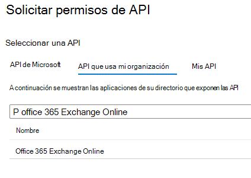
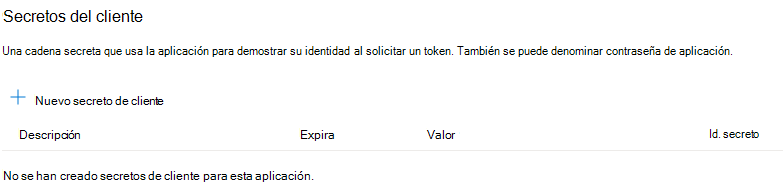

# <a name="cross-tenant-mailbox-migration-preview"></a>Migración de buzones entre inquilinos (versión preliminar)

Normalmente, durante las fusiones o desinversiones, necesita la capacidad de mover el buzón de Exchange Online del usuario a un nuevo inquilino. La migración de buzones entre inquilinos permite a los administradores de inquilinos usar interfaces conocidas como Exchange Online PowerShell y MRS para realizar la transición de los usuarios a su nueva organización.

Los administradores pueden usar el cmdlet New-MigrationBatch, disponible a través del rol de administración Mover buzones, para ejecutar movimientos entre inquilinos.

Los usuarios que migran deben estar presentes en el inquilino de destino Exchange Online sistema como MailUsers, marcados con atributos específicos para habilitar los movimientos entre inquilinos. El sistema producirá un error en los movimientos de los usuarios que no estén configurados correctamente en el inquilino de destino.

Cuando se completan los movimientos, el buzón de usuario de origen se convierte en mailUser y targetAddress (que se muestra como ExternalEmailAddress en Exchange) se marca con la dirección de enrutamiento al inquilino de destino. Este proceso deja el elemento MailUser heredado en el inquilino de origen y permite la coexistencia y el enrutamiento de correo. Cuando los procesos empresariales lo permiten, el inquilino de origen puede quitar el objeto MailUser de origen o convertirlo en un contacto de correo.

Las migraciones entre inquilinos Exchange buzón de correo solo se admiten para inquilinos en híbridos o en la nube, o cualquier combinación de los dos.

En este artículo se describe el proceso de traslados de buzones entre inquilinos y se proporcionan instrucciones sobre cómo preparar los inquilinos de origen y de destino para los movimientos de contenido del buzón de Exchange Online.

   > [!NOTE]
   > Recientemente hemos actualizado los pasos de instalación para permitir que la migración de buzones entre inquilinos deje de requerir Azure Key Vault. Si es la primera vez que se incorpora a esta versión preliminar, no se requiere ninguna acción y puede continuar y seguir los pasos detallados en este documento. Si ha empezado a configurar los inquilinos con el método akv anterior, se recomienda detener o quitar esa configuración para empezar a usar este nuevo método. Si tiene migraciones de buzones en curso con el método AKV anterior, espere hasta que se completen las migraciones existentes y siga los pasos siguientes para habilitar el nuevo método simplificado. Azure Key Vault los pasos de instalación necesarios se archivan, pero se pueden encontrar **[aquí](https://github.com/microsoft/cross-tenant/wiki/V1-Content#cross-tenant-mailbox-migration-preview)**, como referencia.

## <a name="preparing-source-and-target-tenants"></a>Preparación de inquilinos de origen y destino

### <a name="prerequisites-for-source-and-target-tenants"></a>Requisitos previos para inquilinos de origen y destino

Antes de empezar, asegúrese de que tiene los permisos necesarios para configurar la aplicación Mover buzón en Azure, el punto de conexión de migración EXO y la relación de organización exo.

Además, se requiere al menos un grupo de seguridad habilitado para correo en el inquilino de origen. Estos grupos se usan para limitar la lista de buzones que pueden pasar del inquilino de origen (o a veces denominado recurso) al inquilino de destino. Esto permite al administrador de inquilinos de origen restringir o limitar el conjunto específico de buzones que se deben mover, lo que evita que se migren usuarios no deseados. No se admiten grupos anidados.

También tendrá que comunicarse con su empresa asociada de confianza (con la que va a mover buzones) para obtener su identificador de inquilino de Microsoft 365. Este identificador de inquilino se usa en el campo NombreDeDominio de relación de organización.

Para obtener el identificador de inquilino de una suscripción, inicie sesión en el [Centro de administración de Microsoft 365](https://go.microsoft.com/fwlink/p/?linkid=2024339) y vaya a [https://aad.portal.azure.com/\#blade/Microsoft_AAD_IAM/ActiveDirectoryMenuBlade/Properties](https://aad.portal.azure.com/#blade/Microsoft_AAD_IAM/ActiveDirectoryMenuBlade/Properties). Haga clic en el icono de copia de la propiedad Id. de inquilino para copiarla en el Portapapeles.

### <a name="configuration-steps-to-enable-your-tenants-for-cross-tenant-mailbox-migrations"></a>Pasos de configuración para habilitar los inquilinos para migraciones de buzones entre inquilinos

   > [!NOTE]
   > Primero debe configurar el destino (destino). Para completar estos pasos, no es necesario tener ni conocer las credenciales de administrador de inquilinos para el inquilino de origen y de destino. Los distintos administradores pueden realizar los pasos individualmente para cada inquilino.

### <a name="prepare-the-target-destination-tenant-by-creating-the-migration-application-and-secret"></a>Preparar el inquilino de destino (destino) mediante la creación de la aplicación de migración y el secreto

1. Inicie sesión en el portal de Azure AD (<https://portal.azure.com>) con las credenciales de administrador de inquilinos de destino.

   

2. Haga clic en Vista en Administrar Azure Active Directory.

   

3. En la barra de navegación izquierda, seleccione Registros de aplicaciones.

4. Seleccione Nuevo registro.

   

5. En la página Registrar una aplicación, en Tipos de cuenta admitidos, seleccione Cuentas en cualquier directorio organizativo (Cualquier directorio de Azure AD: multiinquilino). A continuación, en URI de redirección (opcional), seleccione Web y escriba <https://office.com>. Por último, seleccione Registrar.

   

6. En la esquina superior derecha de la página, verá un elemento emergente de notificación que indica que la aplicación se creó correctamente.

7. Volver a Inicio, Azure Active Directory y haga clic en Registros de aplicaciones.

8. En Aplicaciones de propiedad, busque la aplicación que creó y haga clic en ella.

9. En ^Essentials, tendrá que copiar el identificador de aplicación (cliente), ya que lo necesitará más adelante para crear una dirección URL para el inquilino de destino.

10. Ahora, en la barra de navegación izquierda, haga clic en Permisos de API para ver los permisos asignados a la aplicación.

11. De forma predeterminada, Usuario. Los permisos de lectura se asignan a la aplicación que ha creado, pero no los necesitamos para las migraciones de buzones. Puede quitar ese permiso.

    

12. Ahora tenemos que agregar permiso para la migración del buzón de correo, seleccione Agregar un permiso.

13. En las ventanas Solicitar permisos de API, seleccione API que usa mi organización, busque Office 365 Exchange Online y selecciónela.

    

14. A continuación, seleccione Permisos de aplicación.

15. A continuación, en Seleccionar permisos, expanda Buzón y compruebe Mailbox.Migration y Agregar permisos en la parte inferior de la pantalla.

    

16. Ahora seleccione Certificados & secretos en la barra de navegación izquierda de la aplicación.

17. En Secretos de cliente, seleccione Nuevo secreto de cliente.

    

18. En la ventana Agregar un secreto de cliente, escriba una descripción y configure los valores de expiración deseados.

      > [!NOTE]
      > Esta es la contraseña que se usará al crear el punto de conexión de migración. Es muy importante que copie esta contraseña en el Portapapeles o copie esta contraseña en una ubicación segura de contraseña segura o secreta. ¡Esta es la única vez que podrá ver esta contraseña! Si de alguna manera la pierde o necesita restablecerla, puede volver a iniciar sesión en nuestro Azure Portal, ir a Registros de aplicaciones, buscar la aplicación de migración, seleccionar Secretos & certificados y crear un nuevo secreto para la aplicación.

19. Ahora que ha creado correctamente la aplicación de migración y el secreto, tendrá que dar su consentimiento a la aplicación. Para dar su consentimiento a la aplicación, vuelva a la página de aterrizaje de Azure Active Directory, haga clic en Enterprise aplicaciones en el panel de navegación izquierdo, busque la aplicación de migración que creó, selecciónela y seleccione Permisos en el panel de navegación izquierdo.

20. Haga clic en el botón Conceder consentimiento de administrador para [su inquilino].

21. Se abrirá una nueva ventana del explorador y seleccionará Aceptar.

22. Puede volver a la ventana del portal y seleccionar Actualizar para confirmar su aceptación.

23. Formule la dirección URL que se va a enviar a su asociado de confianza (administrador de inquilinos de origen) para que también pueda aceptar la aplicación para habilitar la migración de buzones. Este es un ejemplo de la dirección URL para proporcionarles el identificador de aplicación de la aplicación que ha creado:

    ```powershell
    https://login.microsoftonline.com/sourcetenant.onmicrosoft.com/adminconsent?client_id=[application_id_of_the_app_you_just_created]&redirect_uri=https://office.com
    ```

    > [!NOTE]
    > Necesitará el identificador de aplicación de la aplicación de migración de buzón que acaba de crear.
    >
    > Tendrá que reemplazar sourcetenant.onmicrosoft.com en el ejemplo anterior por el nombre de onmicrosoft.com correcto de los inquilinos de origen.
    >
    > También tendrá que reemplazar [application_id_of_the_app_you_just_created] por el identificador de aplicación de la aplicación de migración de buzón que acaba de crear.

### <a name="prepare-the-target-tenant-by-creating-the-exchange-online-migration-endpoint-and-organization-relationship"></a>Prepare el inquilino de destino mediante la creación del punto de conexión de migración Exchange Online y la relación de la organización

1. [Conectar para Exchange Online PowerShell](/powershell/exchange/connect-to-exchange-online-powershell) en el inquilino de Exchange Online de destino.

2. Creación de un nuevo punto de conexión de migración para movimientos de buzones entre inquilinos

   > [!NOTE]
   > Necesitará el identificador de aplicación de la aplicación de migración de buzón que acaba de crear y la contraseña (el secreto) que configuró durante este proceso. Además, dependiendo del Microsoft 365 Instancia de nube que use el punto de conexión puede ser diferente. Consulte la página [puntos de conexión de Microsoft 365](/microsoft-365/enterprise/microsoft-365-endpoints) y seleccione la instancia correcta para el inquilino y revise la Exchange Online Optimizar la dirección requerida y reemplace según corresponda.

   ```powershell

   # Enable customization if tenant is dehydrated
   $dehydrated=Get-OrganizationConfig | select isdehydrated
   if ($dehydrated.isdehydrated -eq $true) {Enable-OrganizationCustomization}
   $AppId = "[guid copied from the migrations app]"
   $Credential = New-Object -TypeName System.Management.Automation.PSCredential -ArgumentList $AppId, (ConvertTo-SecureString -String "[this is your secret password you saved in the previous steps]" -AsPlainText -Force)
   New-MigrationEndpoint -RemoteServer outlook.office.com -RemoteTenant "sourcetenant.onmicrosoft.com" -Credentials $Credential -ExchangeRemoteMove:$true -Name "[the name of your migration endpoint]" -ApplicationId $AppId
   ```

3. Cree o edite el objeto de relación de la organización existente con el inquilino de origen.

   ```powershell
   $sourceTenantId="[tenant id of your trusted partner, where the source mailboxes are]"
   $orgrels=Get-OrganizationRelationship
   $existingOrgRel = $orgrels | ?{$_.DomainNames -like $sourceTenantId}
   If ($null -ne $existingOrgRel)
   {
       Set-OrganizationRelationship $existingOrgRel.Name -Enabled:$true -MailboxMoveEnabled:$true -MailboxMoveCapability Inbound
   }
   If ($null -eq $existingOrgRel)
   {
       New-OrganizationRelationship "[name of the new organization relationship]" -Enabled:$true -MailboxMoveEnabled:$true -MailboxMoveCapability Inbound -DomainNames $sourceTenantId
   }
   ```

### <a name="prepare-the-source-current-mailbox-location-tenant-by-accepting-the-migration-application-and-configuring-the-organization-relationship"></a>Prepare el inquilino de origen (ubicación actual del buzón de correo) aceptando la aplicación de migración y configurando la relación de la organización.

1. Desde un explorador, vaya al vínculo URL proporcionado por el asociado de confianza para dar su consentimiento a la aplicación de migración del buzón de correo. La dirección URL tendrá este aspecto:

   ```powershell
   https://login.microsoftonline.com/sourcetenant.onmicrosoft.com/adminconsent?client_id=[application_id_of_the_app_you_just_created]&redirect_uri=https://office.com
   ```

   > [!NOTE]
   > Necesitará el identificador de aplicación de la aplicación de migración de buzón que acaba de crear.
   > Tendrá que reemplazar sourcetenant.onmicrosoft.com en el ejemplo anterior por el nombre de onmicrosoft.com correcto de los inquilinos de origen.
   > También tendrá que reemplazar [application_id_of_the_app_you_just_created] por el identificador de aplicación de la aplicación de migración de buzón que acaba de crear.

2. Acepte la aplicación cuando aparezca el elemento emergente. También puede iniciar sesión en el portal de Azure Active Directory y buscar la aplicación en Enterprise aplicaciones.

3. Cree una nueva relación de organización o edite el objeto de relación de la organización existente con el inquilino de destino (destino) en Exchange Online PowerShell:

   ```powershell
   $targetTenantId="[tenant id of your trusted partner, where the mailboxes are being moved to]"
   $appId="[application id of the mailbox migration app you consented to]"
   $scope="[name of the mail enabled security group that contains the list of users who are allowed to migrate]"
   $orgrels=Get-OrganizationRelationship
   $existingOrgRel = $orgrels | ?{$_.DomainNames -like $targetTenantId}
   If ($null -ne $existingOrgRel)
   {
       Set-OrganizationRelationship $existingOrgRel.Name -Enabled:$true -MailboxMoveEnabled:$true -MailboxMoveCapability RemoteOutbound -OAuthApplicationId $appId -MailboxMovePublishedScopes $scope
   }
   If ($null -eq $existingOrgRel)
   {
       New-OrganizationRelationship "[name of your organization relationship]" -Enabled:$true -MailboxMoveEnabled:$true -MailboxMoveCapability RemoteOutbound -DomainNames $targetTenantId -OAuthApplicationId $appId -MailboxMovePublishedScopes $scope
   }
   ```

> [!NOTE]
> El identificador de inquilino que escriba como $sourceTenantId y $targetTenantId es el GUID y no el nombre de dominio del inquilino. Para obtener un ejemplo de un identificador de inquilino e información sobre cómo buscar el identificador de inquilino, consulte [Buscar el identificador de inquilino de Microsoft 365](/onedrive/find-your-office-365-tenant-id).

### <a name="how-do-i-know-this-worked"></a>¿Cómo saber si el proceso se ha completado correctamente?

Para comprobar la configuración de migración de buzones entre inquilinos, ejecute el cmdlet [Test-MigrationServerAvailability](/powershell/module/exchange/Test-MigrationServerAvailability) en el punto de conexión de migración entre inquilinos que creó en el inquilino de destino.

   > [!NOTE]
   >
   > - Inquilino de destino:
   >
   > Test-MigrationServerAvailability -Endpoint "[el nombre del punto de conexión de migración entre inquilinos]"
   >
   > Get-OrganizationRelationship | fl name, DomainNames, MailboxMoveEnabled, MailboxMoveCapability
   >
   > - Inquilino de origen:
   >
   > Get-OrganizationRelationship | fl name, DomainNames, MailboxMoveEnabled, MailboxMoveCapability

### <a name="move-mailboxes-back-to-the-original-source"></a>Volver a mover los buzones al origen original

Si se requiere un buzón de correo para volver al inquilino de origen original, el mismo conjunto de pasos y scripts tendrá que ejecutarse en los nuevos inquilinos de origen y de destino nuevos. El objeto de relación de organización existente se actualizará o anexará, no se volverá a crear.

## <a name="prepare-target-user-objects-for-migration"></a>Preparación de objetos de usuario de destino para la migración

Los usuarios que migran deben estar presentes en el inquilino de destino y en Exchange Online sistema (como MailUsers) marcados con atributos específicos para habilitar los movimientos entre inquilinos. El sistema producirá un error en los movimientos de los usuarios que no estén configurados correctamente en el inquilino de destino. En la sección siguiente se detallan los requisitos del objeto MailUser para el inquilino de destino.

### <a name="prerequisites-for-target-user-objects"></a>Requisitos previos para objetos de usuario de destino

Asegúrese de que los siguientes objetos y atributos se establecen en la organización de destino.

1. Para cualquier buzón que se mueva desde una organización de origen, debe aprovisionar un objeto MailUser en la organización de destino:

   - Target MailUser debe tener estos atributos desde el buzón de origen o asignados con el nuevo objeto User:
      - ExchangeGUID (flujo directo de origen a destino): el GUID del buzón debe coincidir. El proceso de movimiento no continuará si esto no está presente en el objeto de destino.
      - ArchiveGUID (flujo directo de origen a destino): el GUID de archivo debe coincidir. El proceso de movimiento no continuará si esto no está presente en el objeto de destino. (Esto solo es necesario si el buzón de origen está habilitado para el archivo).
      - LegacyExchangeDN (flujo como proxyAddress, "x500:\<LegacyExchangeDN>"): LegacyExchangeDN debe estar presente en mailUser de destino como x500: proxyAddress. Además, también debe copiar todas las direcciones x500 del buzón de origen al usuario de correo de destino. Los procesos de movimiento no continuarán si no están presentes en el objeto de destino.
      - UserPrincipalName: UPN se alineará con la nueva identidad del usuario o la empresa de destino (por ejemplo, user@northwindtraders.onmicrosoft.com).
      - SMTPAddress principal: la dirección SMTP principal se alineará con la nueva empresa del usuario (por ejemplo, user@northwind.com).
      - TargetAddress/ExternalEmailAddress: MailUser hará referencia al buzón actual del usuario hospedado en el inquilino de origen (por ejemplo, user@contoso.onmicrosoft.com). Al asignar este valor, compruebe que tiene o también está asignando PrimarySMTPAddress o que este valor establecerá PrimarySMTPAddress, lo que provocará errores de movimiento.
      - No puede agregar direcciones de proxy smtp heredadas desde el buzón de origen a MailUser de destino. Por ejemplo, no puede mantener contoso.com en el MEU en fabrikam.onmicrosoft.com objetos de inquilino). Los dominios solo están asociados a un inquilino de Azure AD o Exchange Online.

     Ejemplo **de objeto** MailUser de destino:

     | Atributo            | Valor                                                                                                                   |
     | -------------------- | ----------------------------------------------------------------------------------------------------------------------- |
     | Alias                | Laran                                                                                                                   |
     | RecipientType        | MailUser                                                                                                                |
     | RecipientTypeDetails | MailUser                                                                                                                |
     | UserPrincipalName    | LaraN@northwintraders.onmicrosoft.com                                                                                   |
     | PrimarySmtpAddress   | Lara.Newton@northwind.com                                                                                               |
     | ExternalEmailAddress | SMTP:LaraN@contoso.onmicrosoft.com                                                                                      |
     | ExchangeGuid         | 1ec059c7-8396-4d0b-af4e-d6bd4c12a8d8                                                                                    |
     | LegacyExchangeDN     | /o=First Organization/ou=Exchange Administrative Group                                                                  |
     |                      | (FYDIBOHF23SPDLT)/cn=Recipients/cn=74e5385fce4b46d19006876949855035Lara                                                 |
     | EmailAddresses       | x500:/o=First Organization/ou=Exchange Grupo administrativo (FYDIBOHF23SPDLT)/cn=Recipients/cn=d11ec1a2cacd4f81858c8190 |
     |                      | 7273f1f9-Lara                                                                                                           |
     |                      | smtp:LaraN@northwindtraders.onmicrosoft.com                                                                             |
     |                      | SMTP:Lara.Newton@northwind.com                                                                                          |

     Ejemplo de objeto buzón **de origen** :

     | Atributo            | Valor                                                                   |
     | -------------------- | ----------------------------------------------------------------------- |
     | Alias                | Laran                                                                   |
     | RecipientType        | UserMailbox                                                             |
     | RecipientTypeDetails | UserMailbox                                                             |
     | UserPrincipalName    | LaraN@contoso.onmicrosoft.com                                           |
     | PrimarySmtpAddress   | Lara.Newton@contoso.com                                                 |
     | ExchangeGuid         | 1ec059c7-8396-4d0b-af4e-d6bd4c12a8d8                                    |
     | LegacyExchangeDN     | /o=First Organization/ou=Exchange Administrative Group                  |
     |                      | (FYDIBOHF23SPDLT)/cn=Recipients/cn=d11ec1a2cacd4f81858c81907273f1f9Lara |
     | EmailAddresses       | smtp:LaraN@contoso.onmicrosoft.com                                      |
     |                      | SMTP:Lara.Newton@contoso.com                                            |

   - Se pueden incluir atributos adicionales en Exchange escritura diferida híbrida. Si no es así, deben incluirse.
   - msExchBlockedSendersHash: escribe datos de remitente seguros y bloqueados en línea de los clientes en Active Directory local.
   - msExchSafeRecipientsHash: escribe datos de remitente seguros y bloqueados en línea de los clientes en Active Directory local.
   - msExchSafeSendersHash: escribe datos de remitente seguros y bloqueados en línea de los clientes en Active Directory local.

2. Si el buzón de origen está en LitigationHold y el tamaño de elementos recuperables del buzón de origen es mayor que el valor predeterminado de la base de datos (30 GB), los movimientos no continuarán porque la cuota de destino es menor que el tamaño del buzón de origen. Puede actualizar el objeto MailUser de destino para realizar la transición de las marcas de buzón de ELC desde el entorno de origen al destino, lo que desencadena que el sistema de destino expanda la cuota de MailUser a 100 GB, lo que permite el traslado al destino. Estas instrucciones solo funcionarán para la identidad híbrida que ejecuta Azure AD Conectar, ya que los comandos para marcar las marcas de ELC no se exponen a los administradores de inquilinos.

    > [!NOTE]
    > EJEMPLO: TAL Y COMO ESTÁ, SIN GARANTÍA
    >
    > Este script supone una conexión tanto al buzón de origen (para obtener valores de origen) como al Active Directory local de destino (para marcar el objeto ADUser). Si el origen tiene habilitada la recuperación por litigio o un solo elemento, establézcala en la cuenta de destino.  Esto aumentará el tamaño del contenedor de memoria de la cuenta de destino a 100 GB.

    ```powershell
    $ELCValue = 0
    if ($source.LitigationHoldEnabled) {$ELCValue = $ELCValue + 8} if ($source.SingleItemRecoveryEnabled) {$ELCValue = $ELCValue + 16} if ($ELCValue -gt 0) {Set-ADUser -Server $domainController -Identity $destination.SamAccountName -Replace @{msExchELCMailboxFlags=$ELCValue}}
    ```

3. Los inquilinos de destino no híbridos pueden modificar la cuota en la carpeta Elementos recuperables de MailUsers antes de la migración mediante la ejecución del siguiente comando para habilitar la suspensión por juicio en el objeto MailUser y aumentar la cuota a 100 GB:

   ```powershell
   Set-MailUser -Identity <MailUserIdentity> -EnableLitigationHoldForMigration
   ```

   Tenga en cuenta que esto no funcionará para los inquilinos en híbrido.

4. Los usuarios de la organización de destino deben tener licencia con las suscripciones de Exchange Online adecuadas aplicables a la organización. Puede aplicar una licencia antes de que se mueva un buzón de correo, pero SOLO una vez que mailUser de destino esté configurado correctamente con ExchangeGUID y direcciones proxy. La aplicación de una licencia antes de que se aplique ExchangeGUID dará como resultado un nuevo buzón aprovisionado en la organización de destino.

    > [!NOTE]
    > Al aplicar una licencia en un objeto Mailbox o MailUser, se limpian todos los proxyAddresses de tipo SMTP para asegurarse de que solo se incluyan dominios comprobados en la matriz Exchange EmailAddresses.

5. Debe asegurarse de que el objeto MailUser de destino no tiene ningún ExchangeGuid anterior que no coincida con exchangeGuid de origen. Esto podría ocurrir si el MEU de destino se licenciaba previamente para Exchange Online y aprovisionaba un buzón de correo. Si el objeto MailUser de destino tenía una licencia anterior para o tenía un ExchangeGuid que no coincide con exchangeGuid de origen, debe realizar una limpieza de la MEU en la nube. Para estas MEU en la nube, puede ejecutar `Set-User <identity> -PermanentlyClearPreviousMailboxInfo`.

    > [!CAUTION]
    > Este proceso es irreversible. Si el objeto tiene un buzón softDeleted, no se puede restaurar después de este punto. Sin embargo, una vez desactivado, puede sincronizar el ExchangeGuid correcto con el objeto de destino y MRS conectará el buzón de origen al buzón de destino recién creado. (Blog de referencia de EHLO sobre el nuevo parámetro).

    Busque objetos que anteriormente eran buzones de correo mediante este comando.

    ```powershell
    Get-User <identity> | select Name, *recipient* | Format-Table -AutoSize
    ```

    Aquí le mostramos un ejemplo.

    ```powershell
    Get-User John@northwindtraders.com |select name, *recipient*| Format-Table -AutoSize

    Name       PreviousRecipientTypeDetails     RecipientType RecipientTypeDetails
    ----       ---------------------------- ------------- --------------------
    John       UserMailbox                  MailUser      MailUser
    ```

    Borre el buzón eliminado temporalmente mediante este comando.

    ```powershell
    Set-User <identity> -PermanentlyClearPreviousMailboxInfo
    ```

    Aquí le mostramos un ejemplo.

    ```powershell
    Set-User John@northwindtraders.com -PermanentlyClearPreviousMailboxInfo -Confirm

    Are you sure you want to perform this action?
    Delete all existing information about user "John@northwindtraders.com"?. This operation will clear existing values from Previous home MDB and Previous Mailbox GUID of the user. After deletion, reconnecting to the previous mailbox that existed in the cloud will not be possible and any content it had will be unrecoverable PERMANENTLY.
    Do you want to continue?
    [Y] Yes  [A] Yes to All  [N] No  [L] No to All  [?] Help (default is "Y"): Y
    ```

### <a name="perform-mailbox-migrations"></a>Realizar migraciones de buzones

Las migraciones entre inquilinos Exchange buzón se inician desde el inquilino de destino como lotes de migración. Esto es similar a la forma en que los lotes de migración de incorporación funcionan al migrar de Exchange local a Microsoft 365.

### <a name="create-migration-batches"></a>Creación de lotes de migración

Este es un cmdlet por lotes de migración de ejemplo para iniciar los movimientos.

```powershell
New-MigrationBatch -Name T2Tbatch -SourceEndpoint target_source_7977 -CSVData ([System.IO.File]::ReadAllBytes('users.csv')) -Autostart -TargetDeliveryDomain target.onmicrosoft.com

Identity                   Status  Type               TotalCount
--------                   ------  ----               ----------
T2Tbatch                   Syncing ExchangeRemoteMove 1
```

> [!NOTE]
> La dirección de correo electrónico del archivo CSV debe ser la especificada en el inquilino de destino, no el inquilino de origen.
>
> [Para obtener más información sobre el cmdlet, haga clic aquí.](/powershell/module/exchange/new-migrationbatch)
>
> [Para ver un archivo CSV de ejemplo, haga clic aquí.](/exchange/csv-files-for-mailbox-migration-exchange-2013-help)

El envío por lotes de migración también se admite desde el nuevo <a href="https://go.microsoft.com/fwlink/p/?linkid=2059104" target="_blank">centro de administración de Exchange</a> al seleccionar la opción entre inquilinos.

### <a name="update-on-premises-mailusers"></a>Actualización de MailUsers local

Una vez que el buzón se mueve de origen a destino, debe asegurarse de que los usuarios de correo local, tanto en el origen como en el destino, se actualizan con el nuevo targetAddress. En los ejemplos, se **contoso.onmicrosoft.com** el targetDeliveryDomain usado en el movimiento. Actualice los usuarios de correo con este targetAddress.

## <a name="frequently-asked-questions"></a>Preguntas frecuentes.

**¿Es necesario actualizar RemoteMailboxes en el entorno local de origen después del traslado?**

Sí, debe actualizar targetAddress (RemoteRoutingAddress/ExternalEmailAddress) de los usuarios locales de origen cuando el buzón de inquilino de origen se mueve al inquilino de destino.  Aunque el enrutamiento de correo puede seguir las referencias entre varios usuarios de correo con diferentes targetAddresses, las búsquedas de disponibilidad para los usuarios de correo deben tener como destino la ubicación del usuario del buzón. Las búsquedas de disponibilidad no perseguirán varias redirecciones.

**¿Teams reuniones migran entre inquilinos?**

Las reuniones se moverán, pero la dirección URL de la reunión Teams no se actualiza cuando los elementos migran entre inquilinos. Dado que la dirección URL no será válida en el inquilino de destino, deberá quitar y volver a crear las reuniones de Teams.

**¿El contenido de la carpeta de chat de Teams migra entre inquilinos?**

No, el contenido de la carpeta de chat Teams no migra entre inquilinos.

**¿Cómo puedo ver solo movimientos que son movimientos entre inquilinos, no mis movimientos de incorporación y desembarque?**

Use el parámetro _Flags_ . Aquí le mostramos un ejemplo.

```powershell
Get-MoveRequest -Flags "CrossTenant"
```

**¿Puede proporcionar scripts de ejemplo para copiar los atributos usados en las pruebas?**

> [!NOTE]
> EJEMPLO: TAL CUAL, SIN GARANTÍA Este script supone una conexión con el buzón de origen (para obtener los valores de origen) y el destino Active Directory local Domain Services (para marcar el objeto ADUser). Si el origen tiene habilitada la recuperación por litigio o un solo elemento, establézcala en la cuenta de destino.  Esto aumentará el tamaño del contenedor de memoria de la cuenta de destino a 100 GB.

   ```powershell
   # This will export users from the source tenant with the CustomAttribute1 = "Cross-Tenant-Project"
   # These are the 'target' users to be moved to the Northwind org tenant
   $outFileUsers = "$home\desktop\UsersToMigrate.txt"
   $outFileUsersXML = "$home\desktop\UsersToMigrate.xml"
   Get-Mailbox -Filter "CustomAttribute1 -like 'Cross-Tenant-Project'" -ResultSize Unlimited | Select-Object -ExpandProperty  Alias | Out-File $outFileUsers
   $mailboxes = Get-Content $outFileUsers
   $mailboxes | ForEach-Object {Get-Mailbox $_} | Select-Object PrimarySMTPAddress,Alias,SamAccountName,FirstName,LastName,DisplayName,Name,ExchangeGuid,ArchiveGuid,LegacyExchangeDn,EmailAddresses | Export-Clixml $outFileUsersXML
   ```

   ```powershell
   # Copy the file $outfile to the desktop of the target on-premises then run the below to create MEU in Target
   $mailboxes = Import-Clixml $home\desktop\UsersToMigrate.xml
   add-type -AssemblyName System.Web
   foreach ($m in $mailboxes) {
       $organization = "@contoso.onmicrosoft.com"
       $mosi = $m.Alias+$organization
       $Password = [System.Web.Security.Membership]::GeneratePassword(16,4) | ConvertTo-SecureString -AsPlainText -Force
       $x500 = "x500:" +$m.LegacyExchangeDn
       $tmpUser = New-MailUser -MicrosoftOnlineServicesID $mosi -PrimarySmtpAddress $mosi -ExternalEmailAddress $m.PrimarySmtpAddress -FirstName $m.FirstName -LastName $m.LastName -Name $m.Name -DisplayName $m.DisplayName -Alias $m.Alias -Password $Password
       $tmpUser | Set-MailUser -EmailAddresses @{add=$x500} -ExchangeGuid $m.ExchangeGuid -ArchiveGuid $m.ArchiveGuid -CustomAttribute1 "Cross-Tenant-Project"
       $tmpx500 = $m.EmailAddresses | ?{$_ -match "x500"}
       $tmpx500 | %{Set-MailUser $m.Alias -EmailAddresses @{add="$_"}}
       }
   ```

   ```powershell
   # Now sync the changes from On-Premises to Azure and Exchange Online in the Target tenant
   # This action should create the target mail enabled users (MEUs) in the Target tenant
   Start-ADSyncSyncCycle
   ```

**¿Cómo se accede a Outlook el día 1 después de mover el buzón de uso?**

Dado que solo un inquilino puede poseer un dominio, la dirección SMTP Principal anterior no se asociará al usuario en el inquilino de destino cuando se complete el movimiento del buzón; solo los dominios asociados al nuevo inquilino. Outlook usa el nuevo UPN de los usuarios para autenticarse en el servicio y el perfil de Outlook espera encontrar la dirección SMTPAddress principal heredada para que coincida con el buzón del sistema de destino. Dado que la dirección heredada no está en el sistema de destino, el perfil de Outlook no se conectará para buscar el buzón recién movido.

Para esta implementación inicial, los usuarios tendrán que volver a generar su perfil con su nuevo UPN, dirección SMTP principal y contenido OST resincronizar.

> [!NOTE]
> Planee en consecuencia a medida que realice el procesamiento por lotes de los usuarios para su finalización. Debe tener en cuenta el uso de la red y la capacidad cuando se crean Outlook perfiles de cliente y los archivos OST y OAB posteriores se descargan en los clientes.

**¿De qué Exchange roles de RBAC debo ser miembro para configurar o completar un traslado entre inquilinos?**

Hay una matriz de roles basada en la suposición de tareas delegadas al ejecutar un movimiento de buzón de correo. Actualmente, se requieren dos roles:

- El primer rol es para una tarea de configuración única que establece la autorización para mover contenido dentro o fuera del límite empresarial o organizativo. Dado que el traslado de datos fuera del control organizativo es una preocupación crítica para todas las empresas, optamos por el rol más alto asignado de Administrador de organización (OrgAdmin). Este rol debe modificar o configurar una nueva organizaciónRelationship que defina -MailboxMoveCapability con la organización remota. Solo orgAdmin puede modificar la configuración MailboxMoveCapability, mientras que el administrador de uso compartido federado puede administrar otros atributos de OrganizationRelationship.

- El rol de ejecutar los comandos de movimiento reales se puede delegar en una función de nivel inferior. El rol Mover buzones se asigna a la capacidad de mover buzones dentro o fuera de la organización.

**¿Cómo se destina a qué dirección SMTP se selecciona targetAddress (TargetDeliveryDomain) en el buzón convertido (a la conversión MailUser)?**

Exchange buzón de correo se mueve mediante MRS diseña el targetAddress en el buzón de origen original al convertir a un mailUser mediante la coincidencia de una dirección de correo electrónico (proxyAddress) en el objeto de destino. El proceso toma el valor -TargetDeliveryDomain pasado al comando move y, a continuación, comprueba si hay un proxy coincidente para ese dominio en el lado de destino. Cuando se encuentra una coincidencia, el proxyAddress coincidente se usa para establecer externalEmailAddress (targetAddress) en el objeto de buzón convertido (ahora MailUser).

**¿Cómo se realiza la transición de los permisos de buzón de correo?**

Los permisos de buzón incluyen Enviar en nombre de y Acceso al buzón:

- Enviar en nombre de (AD:publicDelegates) almacena el DN de los destinatarios con acceso al buzón de correo de un usuario como delegado. Este valor se almacena en Active Directory y actualmente no se mueve como parte de la transición del buzón. Si el buzón de origen tiene publicDelegates establecido, deberá remuestreo los publicDelegates en el buzón de destino una vez que la conversión de MEU a Buzón se complete en el entorno de destino mediante la ejecución `Set-Mailbox <principle> -GrantSendOnBehalfTo <delegate>`de .

- Los permisos de buzón que se almacenan en el buzón se moverán con el buzón cuando la entidad de seguridad y el delegado se muevan al sistema de destino. Por ejemplo, al usuario TestUser_7 se le concede FullAccess al buzón de correo TestUser_8 en el SourceCompany.onmicrosoft.com de inquilino. Una vez completado el traslado del buzón a TargetCompany.onmicrosoft.com, se configuran los mismos permisos en el directorio de destino. A continuación se muestran ejemplos de uso *de Get-MailboxPermission* para TestUser_7 en inquilinos de origen y de destino. Exchange cmdlets tienen como prefijo el origen y el destino en consecuencia.

Este es un ejemplo de la salida del permiso de buzón antes de un movimiento.

```powershell
Get-SourceMailboxPermission TestUser_7 | Format-Table -AutoSize User, AccessRights, IsInherited, Deny

User                                             AccessRights                         IsInherited Deny
----                                             ------------                         ----------- ----
NT AUTHORITY\SELF                                {FullAccess, ReadPermission}         False       False
TestUser_8@SourceCompany.onmicrosoft.com         {FullAccess}                         False       False
```

Este es un ejemplo de la salida del permiso de buzón después del movimiento.

```powershell
Get-TargetMailboxPermission TestUser_7 | Format-Table -AutoSize User, AccessRights, IsInherited, Deny

User                                             AccessRights                         IsInherited Deny
----                                             ------------                         ----------- ----
NT AUTHORITY\SELF                                {FullAccess, ReadPermission}         False       False
TestUser_8@TargetCompany.onmicrosoft.com         {FullAccess}                         False       False
```

> [!NOTE]
> No se admiten los permisos de calendario y buzón entre inquilinos. Debe organizar entidades de seguridad y delegados en lotes de movimiento consolidados para que estos buzones conectados se realicen la transición al mismo tiempo desde el inquilino de origen.

**¿Qué proxy X500 debe agregarse a las direcciones proxy de MailUser de destino para habilitar la migración?**

La migración del buzón entre inquilinos requiere que el valor LegacyExchangeDN del objeto de buzón de correo de origen se marcará como una dirección de correo electrónico x500 en el objeto MailUser de destino.

Ejemplo:

```powershell
LegacyExchangeDN value on source mailbox is:
/o=First Organization/ou=Exchange Administrative Group(FYDIBOHF23SPDLT)/cn=Recipients/cn=d11ec1a2cacd4f81858c81907273f1f9Lara

so, the x500 email address to be added to target MailUser object would be:
x500:/o=First Organization/ou=Exchange Administrative Group (FYDIBOHF23SPDLT)/cn=Recipients/cn=d11ec1a2cacd4f81858c81907273f1f9-Lara
```

> [!NOTE]
> Además de este proxy X500, deberá copiar todos los servidores proxy X500 del buzón del origen al buzón del destino.

**¿Puede el inquilino de origen y de destino usar el mismo nombre de dominio?**

No. Los nombres de dominio de inquilino de origen y de destino deben ser únicos. Por ejemplo, un dominio de origen de contoso.com y el dominio de destino de fourthcoffee.com.

**¿Los buzones compartidos se moverán y seguirán funcionando?**

Sí, sin embargo, solo conservamos los permisos de almacén como se describe en estos artículos:

- [Microsoft Docs | Administración de permisos para destinatarios en Exchange Online](/exchange/recipients-in-exchange-online/manage-permissions-for-recipients)

- [Soporte técnico de Microsoft | Cómo conceder permisos de buzón de Exchange y Outlook en Office 365 dedicado](https://support.microsoft.com/topic/how-to-grant-exchange-and-outlook-mailbox-permissions-in-office-365-dedicated-bac01b2c-08ff-2eac-e1c8-6dd01cf77287)

**¿Tiene alguna recomendación para lotes?**

No supere los 2000 buzones por lote. Se recomienda encarecidamente enviar lotes dos semanas antes de la fecha de finalización, ya que no hay ningún impacto en los usuarios finales durante la sincronización. Si necesita instrucciones para las cantidades de buzones de más de 50 000, puede ponerse en contacto con la Lista de distribución de comentarios de ingeniería en crosstenantmigrationpreview@service.microsoft.com.

**¿Qué ocurre si uso el cifrado de servicio con la clave de cliente?**

El buzón se descifrará antes de moverse. Asegúrese de que la clave de cliente está configurada en el inquilino de destino si sigue siendo necesaria. Consulte [aquí](/microsoft-365/compliance/customer-key-overview) para obtener más información.

**¿Cuál es el tiempo de migración estimado?**

Para ayudarle a planear la migración, en la tabla que se muestra [aquí](/exchange/mailbox-migration/office-365-migration-best-practices#estimated-migration-times) se muestran las instrucciones sobre cuándo esperar que se completen migraciones masivas de buzones o migraciones individuales. Estas estimaciones se basan en un análisis de datos de migraciones de clientes anteriores. Dado que cada entorno es único, la velocidad de migración exacta puede variar.

Recuerde que esta característica está actualmente en versión preliminar y el Acuerdo de Nivel de Servicio, y los niveles de servicio aplicables no se aplican a ningún problema de rendimiento o disponibilidad durante el estado de vista previa de esta característica.

**Protección de documentos en el inquilino de origen que los usuarios del inquilino de destino consumen.**

La migración entre inquilinos solo migra los datos del buzón de correo y nada más. Hay varias otras opciones, que se documentan en la siguiente entrada de blog que pueden ayudar: <https://techcommunity.microsoft.com/t5/security-compliance-and-identity/mergers-and-spinoffs/ba-p/910455>

**¿Puedo tener las mismas etiquetas en el inquilino de destino que tenía en el inquilino de origen, ya sea como el único conjunto de etiquetas o un conjunto adicional de etiquetas para los usuarios migrados en función de la alineación entre las organizaciones.**

Dado que las migraciones entre inquilinos no exportan etiquetas y no hay ninguna manera de compartir etiquetas entre inquilinos, solo se puede lograr mediante la recreación de las etiquetas en el inquilino de destino.

**¿Admite el traslado de Grupos de Microsoft 365?**

Actualmente, la característica migraciones de buzones entre inquilinos no admite la migración de Grupos de Microsoft 365.

**¿Puede un administrador de inquilinos de origen realizar una búsqueda de exhibición de documentos electrónicos en un buzón después de migrar el buzón al inquilino nuevo o de destino?**

No, después de una migración de buzón entre inquilinos, eDiscovery en el buzón del usuario migrado en el origen no funciona. Esto se debe a que ya no hay un buzón en el origen en el que buscar, ya que el buzón se ha migrado al inquilino de destino y ahora pertenece al inquilino de destino. eDiscovery, la migración posterior al buzón solo se puede realizar en el inquilino de destino (donde ahora existe el buzón). Si una copia del buzón de origen debe conservarse en el inquilino de origen después de la migración, el administrador del origen puede copiar el contenido en un buzón alternativo previo a la migración para futuras operaciones de exhibición de documentos electrónicos en los datos.

## <a name="known-issues"></a>Problemas conocidos

- **Problema: la funcionalidad de Teams posterior a la migración en el inquilino de origen estará limitada.** Después de migrar el buzón al inquilino de destino, Teams en el inquilino de origen ya no tendrán acceso al buzón del usuario. Por lo tanto, si un usuario inicia sesión en Teams con la credencial de inquilino de origen, habrá una pérdida de funcionalidad, como la incapacidad de actualizar la imagen de perfil, ninguna aplicación de calendario y la incapacidad de buscar y unirse a equipos públicos.

- **Problema: no se pueden migrar los archivos expandidos automáticamente.** La característica de migración entre inquilinos admite migraciones del buzón de correo principal y el buzón de archivo para un usuario específico. Sin embargo, si el usuario del origen tiene un archivo expandido automáticamente, es decir, más de un buzón de archivo, la característica no puede migrar los archivos adicionales y debería producir un error.

- **Problema: Cloud MailUsers with non-owned smtp proxyAddress block MRS mueve el fondo.** Al crear objetos MailUser del inquilino de destino, debe asegurarse de que todas las direcciones proxy SMTP pertenecen a la organización del inquilino de destino. Si existe una dirección proxy SMTP en el usuario de correo de destino que no pertenece al inquilino local, se impide la conversión de MailUser a Mailbox. Esto se debe a nuestra garantía de que los objetos de buzón solo pueden enviar correo desde dominios para los que el inquilino es autoritativo (dominios reclamados por el inquilino):

  - Al sincronizar usuarios del entorno local mediante azure AD Conectar, se aprovisionan objetos MailUser locales con ExternalEmailAddress que apuntan al inquilino de origen donde existe el buzón (LaraN@contoso.onmicrosoft.com) y se marca PrimarySMTPAddress como un dominio que reside en el inquilino de destino (Lara.Newton@northwind.com). Estos valores se sincronizan con el inquilino y un usuario de correo adecuado está aprovisionado y listo para la migración. Aquí se muestra un objeto de ejemplo.

    ```powershell
    Get-MailUser LaraN | select ExternalEmailAddress, EmailAddresses

    ExternalEmailAddress               EmailAddresses
    --------------------               --------------
    SMTP:LaraN@contoso.onmicrosoft.com {SMTP:lara.newton@northwind.com}
    ```

   > [!NOTE]
   > La dirección _contoso.onmicrosoft.com_ _no_ está presente en la matriz EmailAddresses/proxyAddresses.

- **Problema: Los objetos MailUser con direcciones SMTP principales "externas" se modifican o restablecen en dominios reclamados por la empresa "internos".**

  Los objetos MailUser son punteros a buzones no locales. En el caso de las migraciones de buzones entre inquilinos, usamos objetos MailUser para representar el buzón de origen (desde la perspectiva de la organización de destino) o el buzón de destino (desde la perspectiva de la organización de origen). MailUsers tendrá una externalEmailAddress (targetAddress) que apunta a la dirección smtp del buzón real (ProxyTest@fabrikam.onmicrosoft.com) y la dirección primarySMTP que representa la dirección SMTP mostrada del usuario del buzón en el directorio. Algunas organizaciones optan por mostrar la dirección SMTP principal como una dirección SMTP externa, no como una dirección propiedad o comprobada por el inquilino local (como fabrikam.com en lugar de como contoso.com).  Sin embargo, una vez que se aplica un objeto de plan de servicio Exchange a MailUser mediante operaciones de licencia, la dirección SMTP principal se modifica para mostrarse como un dominio comprobado por la organización local (contoso.com). Hay dos posibles razones:

  - Cuando se aplica un plan de servicio de Exchange a mailuser, el proceso de Azure AD comienza a aplicar la depuración de proxy para asegurarse de que la organización local no puede enviar correo, suplantación o correo desde otro inquilino. Cualquier dirección SMTP de un objeto de destinatario con estos planes de servicio se quitará si la organización local no comprueba la dirección. Como sucede en el ejemplo, el inquilino contoso.onmicrosoft.com NO comprueba el dominio de Fabikam.com, por lo que la limpieza quita ese dominio fabrikam.com. Si desea conservar estos dominios externos en MailUser, ya sea antes de la migración o después de la migración, debe modificar los procesos de migración para quitar licencias una vez completado el movimiento o antes del traslado para asegurarse de que los usuarios tienen aplicada la personalización de marca externa esperada. Tendrá que asegurarse de que el objeto de buzón de correo tiene una licencia adecuada para no afectar al servicio de correo.
  - Aquí se muestra un script de ejemplo para quitar los planes de servicio de un objeto MailUser en el inquilino de contoso.onmicrosoft.com.

    ```powershell
    $LO = New-MsolLicenseOptions -AccountSkuId "contoso:ENTERPRISEPREMIUM" DisabledPlans "LOCKBOX_ENTERPRISE","EXCHANGE_S_ENTERPRISE","INFORMATION_BARRIERS","MIP_S_CLP2","MIP_S_CLP1","MYANALYTICS_P2","EXCHANGE_ANALYTICS","EQUIVIO_ANALYTICS","THREAT_INTELLIGENCE","PAM_ENTERPRISE","PREMIUM_ENCRYPTION"
    Set-MsolUserLicense -UserPrincipalName ProxyTest@contoso.com LicenseOptions $lo
    ```

       Los resultados en el conjunto de ServicePlans asignados se muestran aquí.

    ```powershell
    (Get-MsolUser -UserPrincipalName ProxyTest@contoso.com).licenses | Select-Object -ExpandProperty ServiceStatus |sort ProvisioningStatus -Descending

    ServicePlan           ProvisioningStatus
    -----------           ------------------
    ATP_ENTERPRISE        PendingProvisioning
    MICROSOFT_SEARCH      PendingProvisioning
    INTUNE_O365           PendingActivation
    PAM_ENTERPRISE        Disabled
    EXCHANGE_ANALYTICS    Disabled
    EQUIVIO_ANALYTICS     Disabled
    THREAT_INTELLIGENCE   Disabled
    LOCKBOX_ENTERPRISE    Disabled
    PREMIUM_ENCRYPTION    Disabled
    EXCHANGE_S_ENTERPRISE Disabled
    INFORMATION_BARRIERS  Disabled
    MYANALYTICS_P2        Disabled
    MIP_S_CLP1            Disabled
    MIP_S_CLP2            Disabled
    ADALLOM_S_O365        PendingInput
    RMS_S_ENTERPRISE      Success
    YAMMER_ENTERPRISE     Success
    PROJECTWORKMANAGEMENT Success
    BI_AZURE_P2           Success
    WHITEBOARD_PLAN3      Success
    SHAREPOINTENTERPRISE  Success
    SHAREPOINTWAC         Success
    KAIZALA_STANDALONE    Success
    OFFICESUBSCRIPTION    Success
    MCOSTANDARD           Success
    Deskless              Success
    STREAM_O365_E5        Success
    FLOW_O365_P3          Success
    POWERAPPS_O365_P3     Success
    TEAMS1                Success
    MCOEV                 Success
    MCOMEETADV            Success
    BPOS_S_TODO_3         Success
    FORMS_PLAN_E5         Success
    SWAY                  Success
    ```

    PrimarySMTPAddress del usuario ya no se limpia. El dominio fabrikam.com no es propiedad del inquilino de contoso.onmicrosoft.com y se conservará como la dirección SMTP principal que se muestra en el directorio.

    Aquí le mostramos un ejemplo.

    ```powershell
    Get-Recipient ProxyTest | Format-Table -AutoSize UserPrincipalName, PrimarySmtpAddress, ExternalEmailAddress, ExternalDirectoryObjectId
    UserPrincipalName               PrimarySmtpAddress              ExternalEmailAddress                 ExternalDirectoryObjectId
    -----------------               ------------------              --------------------                 -------------------------
    ProxyTest@fabrikam.com          ProxyTest@fabrikam.com          SMTP:ProxyTest@fabrikam.com          e2513482-1d5b-4066-936a-cbc7f8f6f817
    ```

    - Cuando msExchRemoteRecipientType se establece en 8 (DeprovisionMailbox), para los usuarios de Correo locales que se migran al inquilino de destino, la lógica de limpieza de proxy de Azure quitará dominios no propiedad y restablecerá el primarySMTP a un dominio propiedad. Al borrar msExchRemoteRecipientType en el mailuser local, la lógica de depuración de proxy ya no se aplica.

      A continuación se muestra el conjunto completo de planes de servicio actuales que incluyen Exchange Online.

      | Nombre                                             |
      | ------------------------------------------------ |
      | eDiscovery (Premium) Storage (500 GB)             |
      | Caja de seguridad del cliente                                 |
      | Prevención de pérdida de datos                             |
      | Servicios de Exchange Enterprise CAL (EOP, DLP)      |
      | Exchange Essentials                              |
      | Exchange Foundation                              |
      | Exchange Online (P1)                             |
      | Exchange Online (plan 1)                         |
      | Exchange Online (plan 2)                         |
      | Archivado de Exchange Online para Exchange Online    |
      | Archivado de Exchange Online para Exchange Server    |
      | Exchange Online complemento de usuario inactivo             |
      | Quiosco de Exchange Online                            |
      | Exchange Online Multi-Geo                        |
      | Plan 1 de Exchange Online                           |
      | POP de Exchange Online                              |
      | Exchange Online Protection                       |
      | Barreras de información                             |
      | Information Protection para Office 365 - Premium  |
      | Information Protection para Office 365 - Estándar |
      | Ideas por MyAnalytics                          |
      | auditoría avanzada de Microsoft 365                  |
      | Microsoft Bookings                               |
      | Centro de negocios de Microsoft                        |
      | Microsoft MyAnalytics (Completo)                     |
      | eDiscovery Office 365 (Premium)                   |
      | Microsoft Defender para Office 365 (Plan 1)       |
      | Microsoft Defender para Office 365 (plan 2)       |
      | Office 365 Privileged Access Management          |
      | Cifrado de Premium en Office 365                 |
