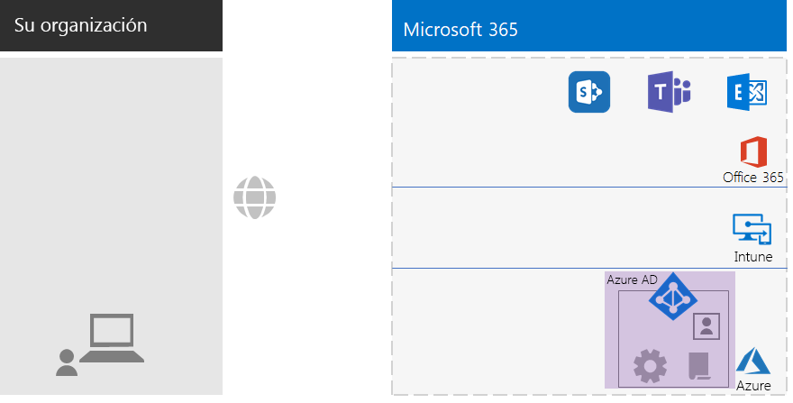

# Infraestructura básica de Microsoft 365 Enterprise para organizaciones que no son empresasMicrosoft 365 Enterprise foundation infrastructure

Las organizaciones que no sean empresas también pueden implementar Microsoft 365 Enterprise y obtener el valor empresarial de una infraestructura integrada y segura que facilita el trabajo en equipo y fomenta la creatividad.Non-enterprise organizations can also deploy Microsoft 365 Enterprise and realize the business value of an integrated and secure infrastructure that enables teamwork and unlocks creativity. Por lo general, una organización que no es una empresa presenta estas características:A non-enterprise typically has:

- Una cantidad limitada de infraestructura de informática local, como correo electrónico y servidores de archivos, y, como mucho, un dominio de Active Directory Domain Services (AD DS).A small amount of on-premises IT infrastructure, such as email and file servers and an Active Directory Domain Services (AD DS) domain, or none at all.
- Un equipo reducido de personal informático, la mayoría de cuyos miembros son generalistas, en lugar de especialistas en una tecnología o carga de trabajo específica, como redes o correo electrónico.A small IT staff, most of whom are IT generalists, rather than specialists in a specific technology or workload such as networking or email.

Si su organización tiene un tamaño reducido y no es una empresa, Microsoft le ofrece [Microsoft 365 Business](https://www.microsoft.com/microsoft-365/business).For your smaller, non-enterprise organization, Microsoft offers [Microsoft 365 Business](https://www.microsoft.com/microsoft-365/business). Sin embargo, puede necesitar Microsoft 365 Enterprise, por las siguientes razones:However, there are reasons why you might need Microsoft 365 Enterprise, such as:

- Su organización necesita o necesitará más de 300 licencias de Microsoft 365, que es el límite máximo para Microsoft 365 Business.Your organization needs more or will need more than 300 Microsoft 365 licenses, which is the maximum for Microsoft 365 Business.
- Su organización necesita servicios de productividad avanzada, voz, seguridad y analítica que no están disponibles en Microsoft 365 Business.Your organization needs the advanced productivity, voice, security, and analytics that are not available with Microsoft 365 Business.

Este artículo le mostrará una implementación simplificada de la infraestructura básica de Microsoft 365 Enterprise, ideal para su organización no empresarial.This article steps you through a simplified deployment of the foundation infrastructure of Microsoft 365 Enterprise suitable for your non-enterprise.

## Primero, configure la suscripciónFirst, set up your subscription

Debe configurar los dominios del Sistema de Nombres de Dominio (DNS) de la suscripción.You must set up the Domain Name System (DNS) domains for your subscription. Si ya tiene una suscripción a Office 365, este paso ya debería de estar realizado.If you already have an Office 365 subscription, this should have been done. Si no lo está, siga las instrucciones para [Agregar un dominio a Office 365](https://docs.microsoft.com/office365/admin/setup/add-domain?view=o365-worldwide).If not, follow the instructions in [Add a domain to Office 365](https://docs.microsoft.com/office365/admin/setup/add-domain?view=o365-worldwide).

El siguiente paso es la configuración de seguridad adicional de Microsoft 365.Next, you need to configure additional security for Microsoft 365. Siga las instrucciones en [Configuración para una mayor seguridad](https://docs.microsoft.com/office365/securitycompliance/tenant-wide-setup-for-increased-security).Follow the instructions in [Configure increased security](https://docs.microsoft.com/office365/securitycompliance/tenant-wide-setup-for-increased-security).

## Fase 1: RedesPhase 1: Networking

Las organizaciones no empresariales suelen tener conexiones a Internet locales en cada oficina y no usan servidores proxy, firewalls ni dispositivos de inspección de paquetes.Non-enterprise organizations typically have local Internet connections in each office and do not use proxy servers, firewalls, or packet inspection devices. El proveedor de acceso a Internet (ISP) de cada oficina tiene un servidor DNS regionalmente local, de modo que el tráfico se dirige a la ubicación de red de Microsoft 365 más cercana a las oficinas y a sus usuarios locales.The Internet service provider (ISP) serving each office has a regionally local DNS server so that traffic is directed to the Microsoft 365 network location that is closest to your offices and their on-premises users.

Por lo tanto, solo tiene que comprobar con su ISP que la conexión de cada una de las ubicaciones de la oficina:Therefore, you only need to verify with your ISP that the connection at each of your office locations:

- Usa un servidor DNS regionalmente local.Uses a regionally local DNS server.
- Es adecuada para las necesidades actuales y futuras, a medida que los usuarios usen más servicios en la nube de Microsoft 365.Is adequate for current and future needs as your users begin using more Microsoft 365 cloud services.

Si usa servidores proxy, firewalls o dispositivos de inspección de paquetes, vea [infraestructura de red de Microsoft 365 Enterprise](networking-infrastructure.md) para obtener más información.If you do use proxy servers, firewalls, or packet inspection devices, see [Networking infrastructure for Microsoft 365 Enterprise](networking-infrastructure.md) for more information.

### Su configuración hasta ahoraYour configuration so far

Este es un resumen visual en el que hemos resaltado el elemento de la Fase 1.Here is a visual summary with the Phase 1 element highlighted. **Su organización** puede contener varias oficinas y cada una de ellas tener una conexión a Internet local con un ISP que use un servidor DNS regionalmente local.**Your organization** can be multiple offices, each of which has a local Internet connection with an ISP that uses a regionally local DNS server. Mediante el ISP, los usuarios de cada oficina pueden acceder a la ubicación de red de Microsoft 365 más cercana y a los recursos de la suscripción a Microsoft 365.Through the ISP, users in each office can reach the nearest Microsoft 365 network location and the resources of your Microsoft 365 subscription.

## Fase 2: IdentidadPhase 2: Identity

Cada uno de los empleados de su organización debe poder iniciar sesión, lo que requiere una cuenta de usuario en el espacio empresarial de Azure Active Directory (Azure AD) de la suscripción a Microsoft 365 Enterprise.Each of the employees of your organization must be able to sign in, which requires a user account in the Azure Active Directory (Azure AD) tenant of your Microsoft 365 Enterprise subscription. Los grupos se usan para contener cuentas de usuario y otros grupos para comunicarse u obtener acceso a recursos con permisos, como un sitio de SharePoint Online o un equipo.Groups are then used to contain user accounts and other groups to communicate or gain access to permissioned resources, such as a SharePoint Online site or a team. 

### Cuentas de administradorAdministrator accounts

Proteja sus cuentas de usuario de administrador global exigiendo el uso de contraseñas muy seguras y de la autenticación multifactor (MFA).Protect your global administrator user accounts by requiring very strong passwords and multi-factor authentication (MFA). Más información en: [Proteger las cuentas de administrador global](identity-designate-protect-admin-accounts.md#protect-global-administrator-accounts)See [Protect your Office 365 global administrator accounts](identity-designate-protect-admin-accounts.md#protect-global-administrator-accounts) for more information about configuration.

Si su organización necesita un alto nivel de seguridad y dispone de Microsoft 365 Enterprise E5, utilice la Azure AD Privileged Identity Management para permitir el acceso de administrador de forma puntual.If your organization requires high security and you have Microsoft 365 Enterprise E5, use Azure AD Privileged Identity Management to enable just-in-time administrator access. Más información en: [Configurar los administradores globales a petición](identity-designate-protect-admin-accounts.md#set-up-on-demand-global-administrators)See [Set up on-demand global administrators](identity-designate-protect-admin-accounts.md#set-up-on-demand-global-administrators) for more information.

### Recomendaciones para gruposRecommendations for groups

Si tiene un dominio de AD DS local, siga usando estos grupos de Microsoft 365 Enterprise como grupos en Azure AD.If you have an on-premises AD DS domain, continue to use those groups in Microsoft 365 Enterprise as groups in Azure AD.

Si no tiene un dominio de AD DS local, cree grupos de seguridad en Azure AD con estos niveles de seguridad.If you don’t have an on-premises AD DS domain, create security groups in Azure AD using these levels of security.

| Nivel de seguridadSecurity level | DescripciónDescription | EjemplosExamples |
|:-------|:-----|:-----|
| Línea baseBaseline | Este es un estándar mínimo y predeterminado para proteger los datos, así como las identidades y los dispositivos que acceden a los datos.This is a minimum and default  standard for protecting data and the identities and devices that access your data.    Normalmente, se trata de la mayoría de los datos de la organización gestionados por la mayoría de los usuarios.This is typically most of your organization’s data managed by most of your users. | Grupos para los trabajadores de primera línea, como ventas, marketing, asistencia al cliente, administración y fabricación.Groups for first line workers, such as sales, marketing, support, administration, and manufacturing. |
| ConfidencialSensitive | Esta es una protección adicional para un subconjunto de los datos que se deban proteger más allá del nivel básico.This is additional protection for a subset of your data that must be protected beyond the baseline level. Estos grupos contienen usuarios que usan y crean datos confidenciales específicos de departamentos y proyectos que no se han diseñado para que estén disponibles para todos los usuarios.These groups contain users that use and create sensitive data that is specific to departments and projects that are not meant to be available to everyone. | Equipos de producto o de marketing que desarrollan futuros productosProduct or marketing teams that are developing future products |
| Extremadamente reguladoHighly regulated | Este es el nivel más alto de protección de una cantidad de datos habitualmente pequeña y altamente confidencial, que se consideran como secretos comerciales o propiedad intelectual, o datos que deben cumplir normas de seguridad.Highly regulated: This is the highest level of protection for organizations that typically have a very small amount of data that is highly classified, considered intellectual property or trade secrets, or data that must adhere to strict security regulations. Microsoft 365 Enterprise has capabilities to help organizations meet these high security requirements, including equivalent protection for identities and devices. |  Los equipos de investigación, de seguridad y de finanzas, o bien equipos que almacenan o usan los datos de clientes o socios.Research, legal, and financial teams, or teams storing or using customer or partner data. |
||||

### Identidad híbridaHybrid identity

Si tiene un dominio de AD DS local, debe sincronizar el conjunto de cuentas de usuario, grupos y contactos de su dominio con el espacio empresarial de Azure AD de su suscripción de Microsoft 365 Enterprise.If you have an on-premises AD DS domain, you need to synchronize the set of user accounts, groups, and contacts of your domain with the Azure AD tenant of your Microsoft 365 Enterprise subscription. Para su organización no empresarial, configure Azure AD Connect en un servidor con sincronización de hash de contraseña (PHS).For your non-enterprise, you configure Azure AD Connect on a server with password hash synchronization (PHS). Vea [Sincronizar identidades](identity-azure-ad-connect.md) para obtener más información.See [Synchronize identities](identity-azure-ad-connect.md) for more information.

### Directivas de acceso condicional para un acceso de usuario más seguroMore secure user access with conditional access policies

Azure AD evalúa las condiciones de inicio de sesión de usuario y puede usar directivas de acceso condicionales para conceder o denegar un acceso e imponer otras acciones para completar el inicio de sesión.Azure AD evaluates the conditions of user sign-ins and can use conditional access policies to grant or deny access and impose further actions that must be taken to complete the sign-in. Por ejemplo, si Azure AD determina que el inicio de sesión se está realizando en condiciones de riesgo medio o alto, puede requerir la implementación de MFA para que el usuario complete el inicio de sesión.For example, if Azure AD determines that the sign-in is happening under medium or high-risk conditions, it can require the user to perform MFA to complete the sign-in.

Aplique directivas de acceso condicional a las cuentas o grupos de usuario.You apply conditional access policies to user accounts or groups. Para facilitar una asignación más fácil de directivas de acceso condicional, cree estos grupos de seguridad de Azure AD en la organización:To facilitate an easier assignment of conditional access policies, create these Azure AD security groups in your organization:

- LÍNEA BASEBaseline

  Contiene los grupos o cuentas de usuario para aquellos usuarios con acceso a los datos de línea base.Contains the groups or user accounts for users with access to baseline data.

- CONFIDENCIALSensitive

  Contiene los grupos o cuentas de usuario para aquellos usuarios con acceso a los datos confidenciales.Contains the groups or user accounts for users with access to sensitive data.

- EXTREMADAMENTE REGULADOHIGHLY-REGULATED

  Contiene los grupos o cuentas de usuario para aquellos usuarios con acceso a datos extremadamente regulados.Contains the groups or user accounts for users with access to highly regulated data.

- COND-ACCESS-EXCLUDECOND-ACCESS-EXCLUDE

  Grupo vacío que puede usar para excluir temporalmente a un usuario de las directivas de acceso condicional.An empty group that you can use to temporarily exclude a user from conditional access policies.

Esta es una lista de las directivas de acceso condicional de Azure AD que se habilitan o se crean.Here is the list of Azure AD conditional access policies to enable or create.

| Directivas de acceso condicional de Azure ADAzure AD conditional access policy | Grupos a los que se aplicaGroups to which it applies |
|:------|:-----|
| Directiva de línea base: requerir MFA para los administradoresBaseline policy: Require MFA for admins | Esta directiva se aplica a roles de administrador, por lo que no es necesario especificar grupos.This policy applies to admin roles, so no groups need to be specified. El único paso que debe dar es habilitar esta directiva.This policy just needs to be enabled. Todas las directivas futuras se deben crear y, luego, habilitar.All subsequent policies need to be created and enabled. |
| Bloquear a los clientes que no sean compatibles con la autenticación modernaBlock clients that don't support modern authentication | Seleccione "Todos los usuarios" en la configuración de la directiva.Select “All users” in the policy settings. |
| Requerir MFA cuando el riesgo de inicio de sesión sea medio o alto (se necesita Microsoft 365 Enterprise E5)Require MFA when sign-in risk is medium or high (requires Microsoft 365 Enterprise E5) | LÍNEA BASEBaseline |
| Requerir MFA cuando el riesgo de inicio de sesión sea bajo, medio o alto (se necesita Microsoft 365 Enterprise E5)Require MFA when sign-in risk is low, medium, or high (requires Microsoft 365 Enterprise E5) | CONFIDENCIALSensitive |
| *Siempre* exigir MFAAlways require MFA | EXTREMADAMENTE REGULADOHIGHLY-REGULATED |
| Requerir aplicaciones aprobadas en dispositivos iOS y AndroidRequire approved apps on iOS and Android devices | LÍNEAS BASE, CONFIDENCIAL, EXTREMADAMENTE REGULADOBASELINE, SENSITIVE, HIGHLY-REGULATED |
| Exigir equipos PC compatiblesRequire compliant PCs | LÍNEA BASEBaseline |
| Requerir PC, y dispositivos iOS y Android compatiblesRequire compliant PCs and iOS and Android devices | CONFIDENCIAL, EXTREMADAMENTE REGULADOSENSITIVE, HIGHLY-REGULATED |
|||

Esta es la Directiva de riesgo de usuario de Azure AD Identity Protection para crear y habilitar (requiere Microsoft 365 Enterprise E5).Here is the Azure AD Identity Protection (requires Microsoft 365 Enterprise E5) user risk policy to create and enable.

| Directiva de riesgo de usuarios de Azure AD Identity ProtectionAzure AD Identity Protection user risk policy | Grupos a los que se aplicaGroups to which it applies |
|:------|:-----|
| Los usuarios de riesgo alto tienen que cambiar las contraseñas.High risk users must change passwords | Seleccione "Todos los usuarios" en la configuración de la directiva.Select “All users” in the policy settings. |
|||

Puede encontrar las instrucciones en [Implementar directivas comunes de acceso a dispositivos e identidad](identity-access-policies.md)See [Common identity and device access policies](identity-access-policies.md) for the instructions.

### Grupos para facilitar la administraciónGroups for easier management

Estas son algunas características que pueden facilitar la administración de licencias y grupos.Here are some features that can make group and licensing management easier for you.

| CaracterísticaFeature | UtiliceUse |
|:------|:-----|
| Administración de grupos de autoservicioSelf-service group management | Permitir que sean los propietarios de los grupos de Azure AD, y no el personal de informática, quienes gestionen dichos grupos.Allow management of Azure AD groups by group owners instead of IT staff. Consulte [Administración de grupos de autoservicio](identity-self-service-group-management.md#allow-users-to-create-and-manage-their-own-groups) para más información.See [Self-service group management](identity-self-service-group-management.md#allow-users-to-create-and-manage-their-own-groups) for more information. |
| Pertenencia a grupo dinámicoDynamic group membership | Configure la incorporación o eliminación automática de cuentas de usuario de grupos de Azure AD en función de los atributos de la cuenta, como departamento o país.Configure automatic addition or removal of user accounts from Azure AD groups based on user account attributes, such as Department or Country. Para obtener más información, consulte [Pertenencia a grupos dinámicos](identity-self-service-group-management.md#set-up-dynamic-group-membership).See [Dynamic group membership](identity-self-service-group-management.md#set-up-dynamic-group-membership) for more information. |
| Licencias basadas en gruposGroup-based licensing | Use la pertenencia a grupos para asignar o retirar licencias a cuentas de usuario automáticamente.Use group membership to automatically assign or unassign licenses to user accounts. Vea [Licencias basadas en grupo](identity-self-service-group-management.md#set-up-automatic-licensing) para obtener más información.See [Group-based licensing](identity-self-service-group-management.md#set-up-automatic-licensing) for more information. |
|  |  |

Si va a usar una licencia basada en grupos, cree un grupo denominado LICENCIADO para que contenga los nombres de las cuentas de usuario asignadas a una licencia de Microsoft 365 Enterprise.If you are using group-based licensing, create a group named LICENSED to contain user account names that are assigned a Microsoft 365 Enterprise license.

### Seguir el acceso del usuarioMonitor user access

Si tiene Microsoft 365 Enterprise E5, puede usar Azure AD Identity Protection para supervisar y analizar los inicios de sesión de los usuarios para comprobar si las credenciales se ven comprometidas.If you have Microsoft 365 Enterprise E5, you can use Azure AD Identity Protection to monitor and analyze user sign-ins for credential compromise. Para obtener más información, consulte [Protegerse en caso de que las credenciales se vean comprometidas](identity-multi-factor-authentication.md#protect-against-credential-compromise).See [Protect against credential compromise](identity-multi-factor-authentication.md#protect-against-credential-compromise) for more information.

### Su configuración hasta ahoraYour configuration so far

Este es un resumen visual de la fase de identidad de la identidad híbrida, con los nuevos elementos resaltados.Here is a visual summary of the Identity phase for hybrid identity, with the new elements highlighted.

 
Los elementos de identidad híbrida nuevos y resaltados incluyen:The new and highlighted hybrid identity elements include:
 
|||
|:------:|:-----|
|  | Un dominio de AD DS local con grupos y cuentas de usuario.An on-premises AD DS domain with user accounts and groups. |
|  | Servidor basado en Windows que ejecuta Azure AD ConnectA Windows-based server running Azure AD Connect. |
|  | El conjunto sincronizado de cuentas y grupos de AD DS en Azure AD.The synchronized set of AD DS accounts and groups in Azure AD. |
|  | Opciones de configuración de Azure AD para autenticarse, proteger cuentas globales y facilitar la administración de grupos y licencias.Azure AD settings for authentication, securing global accounts, and making it easier to manage groups and licenses. |
|  | Directivas de acceso condicional de Azure AD.Azure AD conditional access policies. |
|||

Este es un resumen visual de la fase de identidad de la identidad solo de nube, con los nuevos elementos resaltados.Here is a visual summary of the Identity phase for cloud-only identity, with the new elements highlighted.

 
Los elementos de identidad solo de nube nuevos y resaltados incluyen:The new and highlighted cloud-only identity elements include:
 
|||
|:------:|:-----|
|  | Opciones de configuración de Azure AD para autenticarse, proteger cuentas globales y facilitar la administración de grupos y licencias.Azure AD settings for authentication, securing global accounts, and making it easier to manage groups and licenses. |
|  | Directivas de acceso condicional de Azure AD.Azure AD conditional access policies. |
|||

## Fase 3: Windows 10 EnterprisePhase 3: Windows 10 Enterprise

Tiene las siguientes opciones para asegurarse de que los dispositivos de Windows 10 Enterprise se integren en la infraestructura de identidad y seguridad de Microsoft 365:To ensure that your Windows 10 Enterprise devices are integrated into the identity and security infrastructure of Microsoft 365, here are your options:

- Híbrido (tiene un dominio local de AD DS)Hybrid (you have an on-premises AD DS domain)

  Vincule al espacio empresarial de Azure AD cada dispositivo existente de Windows 10 Enterprise que ya esté vinculado al dominio de AD DS.For each existing Windows 10 Enterprise device already joined to your AD DS domain, join them to the Azure AD tenant. Para descubrir cómo hacerlo, consulte [Configuración de dispositivos híbridos unidos a Azure Active Directory](https://go.microsoft.com/fwlink/p/?linkid=872870).See [How to configure hybrid Azure Active Directory joined devices](https://go.microsoft.com/fwlink/p/?linkid=872870) for the instructions.

  Vincule cada dispositivo nuevo de Windows 10 Enterprise, primero, al dominio de AD DS, y luego al espacio empresarial de Azure AD.For each new Windows 10 Enterprise device, join them to your AD DS domain, and then join them to the Azure AD tenant.

  Inscriba todos los dispositivos con Windows 10 Enterprise en la administración de dispositivos móviles.For each Windows 10 Enterprise device, enroll them for mobile device management. Vea las instrucciones en [Inscripción de un dispositivo con Windows 10 con Intune mediante una directiva de grupo](https://go.microsoft.com/fwlink/p/?linkid=872871).See [Enroll a Windows 10 device with Intune by using a Group Policy](https://go.microsoft.com/fwlink/p/?linkid=872871) for the instructions.

- Solo de nube (no tiene un dominio local de AD DS)Cloud-only (you do not have an on-premises AD DS domain)

  Vincule cada dispositivo de Windows 10 Enterprise al espacio empresarial de Azure AD de su suscripción.Join each Windows 10 Enterprise device to the Azure AD tenant of your subscription.

  Para obtener más información, vea [Unir el dispositivo de trabajo a la red de su organización](https://docs.microsoft.com/es-ES/azure/active-directory/user-help/user-help-join-device-on-network).See [Join your work device to your organization's network](https://docs.microsoft.com/en-us/azure/active-directory/user-help/user-help-join-device-on-network) for more information.

Tras su instalación y vinculación, cada dispositivo con Windows 10 Enterprise instalará automáticamente las actualizaciones desde el servicio en la nube de Windows Update para empresas.Once installed and joined, each Windows 10 Enterprise device automatically installs updates from the Windows Update for Business cloud service. Por lo general, no es necesario que una organización no empresarial configure una infraestructura para distribuir e instalar actualizaciones de Windows 10.There is typically no need in a non-enterprise organization to set up an infrastructure to distribute and install Windows 10 updates.

### Su configuración hasta ahoraYour configuration so far

Este es un resumen visual de la fase de Windows 10 Enterprise, con los nuevos elementos resaltados.Here is a visual summary of the Windows 10 Enterprise phase with the new elements highlighted.

 
Los elementos nuevos y resaltados de Windows 10 Enterprise incluyen:The new and highlighted Windows 10 Enterprise elements include:

|||
|:------:|:-----|
|  | Windows 10 Enterprise instalado en dispositivos Windows, con el portátil local como ejemplo.Windows 10 Enterprise installed on Windows devices, with an on-premises laptop as an example. |
|  | El Centro de servicios de licencias por volumen, que proporciona imágenes para nuevas instalaciones de Windows 10 Enterprise, y el servicio de Windows Update para empresas, que ofrece las actualizaciones más recientes.The Volume Licensing Service Center, which provides images for new installations of Windows 10 Enterprise, and the Windows Update for Business service, which provides the latest updates. |
|||

## Fase 4: Office 365 ProPlusPhase 4: Office 365 ProPlus

Microsoft 365 Enterprise incluye Office 365 ProPlus, la versión de suscripción de Microsoft Office.Microsoft 365 Enterprise includes Office 365 ProPlus, the subscription version of Microsoft Office. Office 365 ProPlus, igual que Office 2016 u Office 2019, está instalado directamente en los dispositivos cliente.Like Office 2016 or Office 2019, Office 365 ProPlus is installed directly on your client devices. Pero Office 365 ProPlus recibe actualizaciones que incluyen las nuevas características de forma periódica.However, Office 365 ProPlus receives updates that include new features on a regular basis. Para más información, vea [Información sobre Office 365 ProPlus en un entorno empresarial](https://docs.microsoft.com/deployoffice/about-office-365-proplus-in-the-enterprise).See [About Office 365 ProPlus in the enterprise](https://docs.microsoft.com/deployoffice/about-office-365-proplus-in-the-enterprise) for more information.

En el caso de una organización no empresarial, instale manualmente Office 365 ProPlus en los dispositivos.For your non-enterprise organization, you manually install Office 365 ProPlus on devices. Esto puede hacerse como parte de la preparación para usar un nuevo dispositivo o lo puede realizar el usuario como parte de su proceso de incorporación.This can be done as part of preparing a new device for use, or by the user as part of their onboarding process.

En ambos casos, el administrador o el usuario deben iniciar sesión en el portal de Office 365 en https://portal.office.com.In either case, the administrator or the user signs in to the Office 365 portal at https://portal.office.com. En la pestaña **Página principal de Microsoft Office** haga clic en **Instalar Office** y siga los pasos del proceso de instalación.On the **Microsoft Office Home** tab, click **Install Office** and step through the installation process.

En cada equipo en el que se instale Office 365 ProPlus se descargarán mensualmente las actualizaciones de características.Feature updates to Office 365 ProPlus are downloaded monthly by each computer on which it is installed. Por lo general, no es necesario que una organización no empresarial configure una infraestructura para distribuir actualizaciones de Office 365 ProPlus.There is typically no need in a non-enterprise organization to set up an infrastructure to distribute Office 365 ProPlus updates. 

### Su configuración hasta ahoraYour configuration so far

Este es un resumen visual de la fase de Office 365 ProPlus, con los nuevos elementos resaltados.Here is a visual summary of the Office 365 ProPlus phase with the new elements highlighted.

 
Los elementos de Office 365 ProPlus nuevos y resaltados incluyen:The new and highlighted Office 365 ProPlus elements include:
 
|||
|:------:|:-----|
|  | Office 365 ProPlus instalado en dispositivos, con el portátil local como ejemplo.Office 365 ProPlus installed on devices, with an on-premises laptop as an example. |
|  | La Red de entrega de contenido (CDN) de Office para Office 365 ProPlus, donde los dispositivos obtienen acceso a las actualizaciones de Office 365 ProPlus.The Office Content Delivery Network (CDN) for Office 365 ProPlus, which devices access for Office 365 ProPlus updates. |
|||

## Fase 5: Administración de dispositivos móvilesPhase 5: Mobile device management

Microsoft 365 Enterprise incluye Microsoft Intune para la administración de dispositivos móviles.Microsoft 365 Enterprise includes Microsoft Intune for mobile device management. Con Intune, puede administrar dispositivos iOS, Android, macOS y Windows para proteger el acceso a los recursos de su organización, incluidos los datos.With Intune, you can manage Windows, iOS, Android, and macOS devices to protect access to your organization's resources, including your data. Intune usa las cuentas de usuario, grupo y equipo de Azure AD.Intune uses the user, group, and computer accounts of Azure AD.

Intune ofrece dos tipos de administración de dispositivos móviles:Intune provides two types of mobile device management:

- La Administración de Dispositivos Móviles (MDM) se utiliza cuando se inscriben dispositivos en Intune.Mobile device management (MDM) is when devices get enrolled in Intune. Una vez que se hayan inscrito, se consideran dispositivos administrados y pueden recibir las directivas, las reglas y la configuración que use su organización.Once enrolled, they are managed devices and can receive the policies, rules, and settings used by your organization. Por lo general, estos tipos de dispositivos son propiedad de su organización y se entregan a sus empleados.These types of devices are typically owned by your organization and issued to your employees.

- Es posible que los usuarios con sus propios dispositivos personales no quieran inscribir sus dispositivos o no quieran que sus dispositivos sean administrados con las directivas y configuraciones de usted.Users with their own personal devices may not want to enroll their devices or be managed by Intune with your policies and settings. Pero todavía debe proteger los datos y recursos de su organización.However, you still need to protect your organization's resources and data. Si esto ocurre, puede proteger las aplicaciones con la administración de aplicaciones móviles (MAM).For this scenario, you can protect your apps with mobile application management (MAM).  

Las directivas de Intune pueden exigir el cumplimiento de dispositivos y la protección de aplicaciones.Intune policies can enforce device compliance and app protection. Esta es la lista de directivas de Intune que debe crear.Here is the list of Intune policies to create.

| Directivas de IntuneIntune policies | Grupos a los que se aplicaGroups to which it applies |
|:------|:-----|
| Directivas de cumplimiento de dispositivos para WindowsDevice compliance policy for Windows | LÍNEAS BASE, CONFIDENCIAL, EXTREMADAMENTE REGULADOBASELINE, SENSITIVE, HIGHLY-REGULATED |
| Directivas de cumplimiento de dispositivos para iOSDevice compliance policy for iOS | CONFIDENCIAL, EXTREMADAMENTE REGULADOSENSITIVE, HIGHLY-REGULATED |
| Cumplimiento de dispositivos para macOSDevice compliance for macOS | CONFIDENCIAL, EXTREMADAMENTE REGULADOSENSITIVE, HIGHLY-REGULATED |
| Directiva de cumplimiento de dispositivos para Android y Android EnterpriseDevice compliance policy for Android and Android Enterprise | CONFIDENCIAL, EXTREMADAMENTE REGULADOSENSITIVE, HIGHLY-REGULATED |
| Directiva de protección de aplicaciones para iOSApp protection policy for iOS | LÍNEAS BASE, CONFIDENCIAL, EXTREMADAMENTE REGULADOBASELINE, SENSITIVE, HIGHLY-REGULATED |
| Directiva de protección de aplicaciones para macOSApp protection policy for macOS | LÍNEAS BASE, CONFIDENCIAL, EXTREMADAMENTE REGULADOBASELINE, SENSITIVE, HIGHLY-REGULATED |
| Directiva de protección de apps para Android y Android EnterpriseApp protection policy for Android and Android Enterprise | LÍNEAS BASE, CONFIDENCIAL, EXTREMADAMENTE REGULADOBASELINE, SENSITIVE, HIGHLY-REGULATED |
|||
    
Puede encontrar las instrucciones en [Implementar directivas comunes de acceso a dispositivos e identidad](identity-access-policies.md)See [Common identity and device access policies](identity-access-policies.md) for the instructions.

### Su configuración hasta ahoraYour configuration so far

Este es un resumen visual de la fase de la Administración de dispositivos móviles, con los nuevos elementos resaltados.Here is a visual summary of the Mobile Device Management phase with the new elements highlighted.

 
Entre los elementos nuevos y resaltados de la administración de dispositivos móviles se incluyen:The new and highlighted mobile device management elements include:

|||
|:------:|:-----|
|  | Dispositivos que se inscriben en Intune que muestran como ejemplo el portátil local que ejecuta Windows 10 Enterprise.Devices that are enrolled in Intune, showing an on-premises laptop running Windows 10 Enterprise as an example. |
|  | Directivas de Intune para el cumplimiento de dispositivos y la protección de aplicaciones.Intune policies for device compliance and app protection. |
|||

## Fase 6: Protección de la informaciónPhase 6: Information protection

Microsoft 365 Enterprise ofrece una gran variedad de opciones para proteger su información. Estas le permiten realizar distintas clasificaciones de datos y aplicar varios niveles de control, seguridad y protección.Microsoft 365 Enterprise has a host of information protection features that allow you to treat classifications of data differently by applying different levels of governance, security, and protection. 

Por ejemplo, se requiere un nivel básico de protección para la correspondencia normal entre la mayoría de los empleados y los documentos con los que trabajan.For example, normal correspondence between most employees and the documents on which they work need a certain baseline level of protection. Pero se requiere un nivel de protección más alto para los registros financieros, los datos de los clientes y su propiedad intelectual.Financial records, customer data, and your intellectual property need a higher level of protection.

El primer paso en una estrategia de protección de datos es determinar los distintos niveles de protección.The first step to an information protection strategy is to determine the levels of protection. Muchas organizaciones usan estos niveles, ya empleados en directivas de acceso condicional:Many organizations use these levels, which are already being used for conditional access policies:

- Línea baseBaseline

  Algunos ejemplos son las comunicaciones empresariales normales (correo electrónico) y los archivos de empleados administrativos, de ventas y de soporte técnico.Examples of Level 1 data are normal business communications (email) and files for administrative, sales, and support workers.

- ConfidencialSensitive

  Algunos ejemplos son la información jurídica y financiera, y los datos de investigación y desarrollo de productos o servicios nuevos.Examples of Level 2 data are financial and legal information and research and development data for new products.

- Extremadamente reguladoHighly regulated

  Algunos ejemplos incluyen la información de identificación personal de clientes y socios, y la propiedad intelectual o la información financiera de su organización.Examples include customer and partner personally identifiable information and your organization’s financial information or intellectual property.

En función de estos niveles de seguridad de datos, el siguiente paso es identificar e implementar:Based on these levels of data security, the next step is to identify and implement:

- Tipos de información confidencial personalizadaCustom sensitive information types

  Microsoft 365 proporciona una amplia variedad de tipos de información confidencial, como el servicio de mantenimiento y los números de tarjeta de crédito.Microsoft 365 supplies a wide selection of sensitive information types, such as health service and credit card numbers. Si no encuentra el que necesita en la lista proporcionada, puede crear su propia lista.If you do not find one that you need in the supplied list, you can create your own.

- Etiquetas de retenciónRetention labels

  Para cumplir con las directivas de la organización y la reglamentación regional, puede que deba especificar cuánto tiempo deben conservarse determinados tipos de documentos o documentos con contenidos específicos.To comply with organization policies and regional regulations, you might have to specify how long specific types of documents or documents with specific contents should be retained. Puede implementarlo para correos electrónicos y documentos con etiquetas de retención.You can implement this for email and documents using retention labels.

- Etiquetas de confidencialidadSensitivity labels

  Puede asignar una etiqueta de confidencialidad con nombre a mensajes de correo electrónico o documentos para que se puedan aplicar niveles de seguridad adicionales.You can label email or documents with a named sensitivity label so that additional levels of security can be applied. Algunos ejemplos son las marcas de agua, el cifrado y los permisos, que especifican a quién se le permite obtener acceso al correo electrónico o documento y qué se les permite hacer.Examples are watermarks, encryption, and permissions, which specify who is allowed to access the email or document and what they are allowed to do.

Para obtener más información, consulte [Tipos de clasificación de Microsoft 365](infoprotect-configure-classification.md#microsoft-365-classification-types).See [Microsoft 365 classification types](infoprotect-configure-classification.md#microsoft-365-classification-types) for more information.

Si usa etiquetas de confidencialidad con permisos, es posible que tenga que crear grupos de seguridad de Azure AD adicionales para definir qué se le permite hacer a cada persona con el correo electrónico y los documentos.If you use sensitivity labels with permissions, you might have to create additional Azure AD security groups to define who is allowed to do what with email and documents. 

Pongamos el supuesto de que necesita crear una etiqueta de confidencialidad de INVESTIGACIÓN para proteger el correo electrónico y los documentos de su equipo de investigación.For example, you need to create a RESEARCH sensitivity label to protect the email and documents of your research team. Usted determina que:You determine that:

- Los investigadores deben tener la capacidad de cambiar los documentos marcados con la etiqueta de confidencialidad de INVESTIGACIÓN.Researchers must have the ability to change documents marked with the RESEARCH sensitivity label.
- Los empleados ajenos a la investigación solo deben tener la capacidad de ver los documentos marcados con la etiqueta de confidencialidad de INVESTIGACIÓN.Non-research employees only need to have the ability to view documents marked with the RESEARCH sensitivity label. 

Esto quiere decir que debe crear y administrar dos grupos adicionales:This means you need to create and manage two additional groups:

- INVESTIGACIÓN-TODORESEARCH-ALL
- INVESTIGACIÓN-VISTARESEARCH-VIEW

Estos grupos y sus permisos forman parte de la configuración de la etiqueta de confidencialidad INVESTIGACIÓN.These groups and their permissions become part of the RESEARCH sensitivity label's configuration.

Para las etiquetas de confidencialidad configuradas con permisos basados en grupos, debe administrar la pertenencia a estos grupos.For sensitivity labels configured with group-based permissions, you must manage the membership of these groups.

### Su configuración hasta ahoraYour configuration so far

Este es un resumen visual de la fase de protección de información, con los nuevos elementos resaltados.Here is a visual summary of the Information Protection phase with the new elements highlighted.

 
Entre los elementos de protección de la información nuevos y resaltados se incluyen:The new and highlighted information protection elements include:
 
|||
|:------:|:-----|
|  | Etiquetas de confidencialidad para los tres niveles de seguridad que los usuarios pueden aplicar a los documentos.Sensitivity labels for the three levels of security that users can apply to documents. |
|||

No se muestran las etiquetas de retención ni los tipos de información personalizados.Custom information types and retention labels are not shown.

## IncorporaciónOnboarding

Con la infraestructura de Microsoft 365 Enterprise, podrá incorporar fácilmente a sus empleados.With your Microsoft 365 Enterprise infrastructure in place, you can easily onboard your employees.

### Un nuevo dispositivo con Windows 10 EnterpriseA new Windows 10 Enterprise device

Antes de dar a un empleado un nuevo dispositivo con Windows 10 Enterprise:Before giving an employee a new Windows 10 Enterprise device:

- Para identidad híbridaFor hybrid identity

  Vincule el dispositivo a su dominio de AD DS, luego vincule el dispositivo a su espacio empresarial de Azure AD y, después, inscriba el dispositivo en Intune.Join the device to your AD DS domain, join the device to your Azure AD tenant, and then enroll the device in Intune.

- Para una identidad solo de nubeFor cloud-only identity

  Vincule el dispositivo al espacio empresarial de Azure AD de su suscripción de Microsoft 365 Enterprise.Next, join the WIN10 computer to the Azure AD tenant of your Microsoft 365 E5 subscription.

### Empleado existente con una cuenta de usuario de AD DSExisting employee with an AD DS user account

Cuando utilice la identidad híbrida, y como parte de la incorporación inicial de su organización, agregue la cuenta de usuario de AD DS a estos grupos de Azure AD:As part of the initial onboarding for your organization when using hybrid identity, add the AD DS user account to these Azure AD groups:

- CON LICENCIALicensed
- Los grupos de seguridad de AD DS o Azure AD adecuados que son miembros de los grupos de Azure AD LÍNEA BASE, CONFIDENCIAL y EXTREMADAMENTE REGULADO.The appropriate AD DS or Azure AD security groups that are members of the BASELINE, SENSITIVE, and HIGHLY-REGULATED Azure AD groups
- Grupos de etiquetas de confidencialidad (si es necesario)Sensitivity label groups (as needed)

El empleado existente ya debe haber sido agregado a los grupos correspondientes de departamento, grupo de trabajo y grupos regionales de AD DS.The existing employee should already be added to the appropriate workgroup, departmental, and regional AD DS groups.

Puede agregar una cuenta de usuario a varios grupos de Azure AD en el Centro de administración de Microsoft 365.You can add a user account to multiple Azure AD groups in the Microsoft 365 admin center. En las propiedades de la cuenta de usuario, haga clic en **Administrar grupos > Agregar miembros**.From the properties of the user account, click **Manage groups > Add memberships**.

Si quiere usar PowerShell, vea este [libro de Excel descargable](https://github.com/MicrosoftDocs/microsoft-365-docs/blob/public/microsoft-365/enterprise/media/Group-License-Mgmt-PowerShell.xlsx?raw=true), donde se generan los comandos de PowerShell basándose en una cuenta de usuario específica y en nombres de grupos seleccionados.If you want to use PowerShell, see this [downloadable Excel workbook](https://github.com/MicrosoftDocs/microsoft-365-docs/blob/public/microsoft-365/enterprise/media/Group-License-Mgmt-PowerShell.xlsx?raw=true), which generates the PowerShell commands based on a specified user account and selected group names.

### Nuevo empleado con una cuenta de usuario solo de nubeNew employee with a cloud-only user account

Cuando utilice la identidad solo de nube como parte de la incorporación inicial de su organización, agregue la nueva cuenta de usuario a estos grupos:As part of the initial onboarding for your organization when using cloud-only identity, add the new user account to these groups:

- CON LICENCIALicensed
- Los grupos de seguridad de Azure AD adecuados que son miembros de los grupos de Azure AD LÍNEA BASE, CONFIDENCIAL y EXTREMADAMENTE REGULADO.The appropriate Azure AD security groups that are members of the BASELINE, SENSITIVE, and HIGHLY-REGULATED Azure AD groups
- Grupos de trabajo, de departamento y regionalesWorkgroup, departmental, and regional groups
- Grupos de etiquetas de confidencialidad (si es necesario)Sensitivity label groups (as needed)

### Primer inicio de sesión en Microsoft 365Initial sign-in to Microsoft 365

La primera vez que los empleados inicien sesión en Microsoft 365, indíqueles que:For the first time employees sign in to Microsoft 365, instruct them to:

1. Deben iniciar sesión en sus dispositivos con las credenciales de su cuenta de usuario.Sign into their devices with their user account credentials.
2. Con un explorador, deben iniciar sesión en el portal de Office 365 en https://portal.office.com.Using a browser on your local computer, sign in to the https://portal.office.com using your global administrator account.
3. Desde la pestaña **Página principal de Office 365**, deben hacer clic en **Instalar Office** para instalar Office 365 ProPlus en su dispositivo.From the **Office 365 Home** tab, click **Install Office** to install Office 365 ProPlus on their device.

## Resultados finalesEnd results

Estos son los resultados de la configuración de la infraestructura básica de Microsoft 365 Enterprise para una organización no empresarial.Here are the results of configuring the Microsoft 365 Enterprise foundation infrastructure for your non-enterprise organization.

### Resultados de la infraestructuraInfrastructure results

Después de la creación y de la configuración de su infraestructura empresarial de Microsoft 365 Enterprise, debe tener:After the build-out and configuration of your Microsoft 365 Enterprise infrastructure, you should have:

- Una conexión a Internet local para cada una de las oficinas, con suficiente ancho de banda proporcionado por un proveedor de Internet que utilice un servidor DNS regionalmente local.A local Internet connection for each of your offices with sufficient bandwidth supplied by an ISP that uses a regionally local DNS server.
- En el caso de las identidades híbridas, Azure AD Connect se ejecuta en un servidor que sincroniza el dominio de AD DS local con su espacio empresarial de Azure AD.For hybrid identity, Azure AD Connect running on a server that synchronizes your on-premises AD DS domain with your Azure AD tenant.
- Estos grupos:These groups:
  - CON LICENCIALicensed
  - COND-ACCESS-EXCLUDECOND-ACCESS-EXCLUDE
  - Los grupos de seguridad de AD DS o Azure AD adecuados que también son miembros de los grupos de Azure AD LÍNEA BASE, CONFIDENCIAL y EXTREMADAMENTE REGULADO.The appropriate AD DS or Azure AD security groups that are also members of the BASELINE, SENSITIVE, and HIGHLY-REGULATED Azure AD groups 
  - Grupos de trabajo, de departamento y regionalesWorkgroup, departmental, and regional groups
  - Grupos de etiquetas de confidencialidad (si es necesario)Sensitivity label groups (as needed)
- Directivas de acceso condicional de inicio de sesión de Azure AD que usan los grupos de Azure AD LÍNEA BASE, CONFIDENCIAL, EXTREMADAMENTE REGULADO y COND-ACCESS-EXCLUDE.Azure AD sign-in conditional access policies that use the BASELINE, SENSITIVE, and HIGHLY-REGULATED, and COND-ACCESS-EXCLUDE Azure AD groups.
- Directivas de cumplimiento normativo de aplicaciones y dispositivos Intune.Intune application and device compliance policies.
- Tipos de información confidencial personalizada (si se necesitan)Custom sensitive information types (as needed).
- Etiquetas de retención (si se necesitan)Retention labels (as needed).
- Etiquetas de confidencialidad (si se necesitan)Sensitivity labels (as needed).

Aquí se muestra un resumen visual de la infraestructura en caso de que su organización use una identidad híbrida. Incluye el dominio de AD DS, un servidor de Azure AD Connect y usuarios y grupos de AD DS sincronizados.Here is a visual summary of the infrastructure if your organization uses hybrid identity, which includes your AD DS domain, an Azure AD Connect server, and synchronized AD DS users and groups.

 
Este es un resumen visual de la infraestructura en caso de que su organización use una identidad solo de nube.Here is a visual summary of the infrastructure if your organization uses cloud-only identity.
 

### Resultados de empleadosEmployee results

Después de ser incorporado, cada empleado debe tener:After their onboarding, each employee should have:

- Una ruta de acceso de red local de altas prestaciones desde su dispositivo hasta los servicios en la nube de Microsoft 365 en su región.A performant, on-premises network path from their device to the Microsoft 365 cloud services in their region.
- Una cuenta de usuario con estas pertenencias de grupo:A user account with these group memberships:
   - CON LICENCIALicensed
   - Los grupos de seguridad de AD DS o Azure AD adecuados que también son miembros de los grupos de Azure AD LÍNEA BASE, CONFIDENCIAL y EXTREMADAMENTE REGULADO para directivas de acceso condicional.The appropriate AD DS or Azure AD security groups, which are also members of the BASELINE, SENSITIVE, and HIGHLY-REGULATED Azure AD groups for conditional access policies 
   - Grupos de trabajo, de departamento y regionales adecuadosThe appropriate workgroup, departmental, and regional groups
   - Grupos de etiquetas de confidencialidad (si es necesario)Sensitivity label groups (as needed)
- Un nuevo dispositivo con Windows 10 Enterprise que:A Windows 10 Enterprise device that:
   - se ha unido al espacio empresarial de Azure AD (solo en la nube) o tanto al espacio empresarial de Azure AD como al dominio de AD DS (híbrido).Is joined to the Azure AD tenant (cloud-only) or to both the Azure AD tenant and your AD DS domain (hybrid).
   - se actualiza automáticamente con las mejoras más recientes de producto y mejoras de seguridad de Windows 10 Enterprise.Automatically updates itself with the latest Windows 10 Enterprise product improvements and security enhancements.
   - tiene Office 365 ProPlus instalado y este se actualiza automáticamente con las mejoras de producto más recientes de Office y mejoras de seguridad.Has Office 365 ProPlus installed, which automatically updates itself with the latest Office product improvements and security enhancements.
   - se ha inscrito en Intune y está sujeto a las directivas de cumplimiento de dispositivos y a las directivas de protección de aplicaciones de Intune.Is enrolled in Intune and subject to Intune device compliance policies and app protection policies.

## Siguiente pasoNext step

Implemente las [cargas de trabajo y los escenarios](deploy-workloads.md) para aprovechar las características y la configuración de su infraestructura de base de Microsoft 365 Enterprise.If you're following the end-to-end deployment of Microsoft 365 Enterprise, you're now ready to have your [workloads and scenarios](deploy-workloads.md) take advantage of all the features and configuration of your foundation infrastructure.
