# Infraestructura básica de Microsoft 365 para empresas para organizaciones que no son empresas

Las organizaciones que no sean empresas también pueden implementar Microsoft 365 para empresas y obtener el valor empresarial de una infraestructura integrada y segura que facilita el trabajo en equipo y fomenta la creatividad. Por lo general, una organización que no es una empresa presenta estas características:

- Una cantidad limitada de infraestructura de informática local, como correo electrónico y servidores de archivos, y, como mucho, un dominio de Active Directory Domain Services (AD DS).
- Un equipo reducido de personal informático, la mayoría de cuyos miembros son generalistas, en lugar de especialistas en una tecnología o carga de trabajo específica, como redes o correo electrónico.

Si su organización tiene un tamaño reducido y no es una empresa, Microsoft le ofrece [Microsoft 365 Empresa](https://www.microsoft.com/microsoft-365/business). Sin embargo, puede necesitar Microsoft 365 para empresas, por las siguientes razones:

- Su organización necesita o necesitará más de 300 licencias de Microsoft 365, que es el límite máximo para Microsoft 365 Empresa.
- Su organización necesita funcionalidades de productividad avanzada, voz, seguridad y análisis que no están disponibles en Microsoft 365 Empresa.

Este artículo le mostrará una implementación simplificada de la infraestructura básica de Microsoft 365 para empresas, ideal para su organización no empresarial.

## Primero, configure la suscripción

Debe configurar los dominios del Sistema de Nombres de Dominio (DNS) de la suscripción. Si ya tiene una suscripción a Office 365, este paso ya debería de estar realizado. Si no lo está, siga las instrucciones para [Agregar un dominio a Office 365](https://docs.microsoft.com/office365/admin/setup/add-domain?view=o365-worldwide).

El siguiente paso es la configuración de seguridad adicional de Microsoft 365. Siga las instrucciones en [Configuración para una mayor seguridad](https://docs.microsoft.com/office365/securitycompliance/tenant-wide-setup-for-increased-security).

## Fase 1: Redes

Las organizaciones no empresariales suelen tener conexiones a Internet locales en cada oficina y no usan servidores proxy, firewalls ni dispositivos de inspección de paquetes. El proveedor de acceso a Internet (ISP) de cada oficina tiene un servidor DNS regionalmente local, de modo que el tráfico se dirige a la ubicación de red de Microsoft 365 más cercana a las oficinas y a sus usuarios locales. Para obtener más información, consulte [Configurar conexiones a Internet locales para cada oficina](networking-dns-resolution-same-location.md)

Por lo tanto, solo tiene que comprobar con su ISP que la conexión de cada una de las ubicaciones de la oficina:

- Usa un servidor DNS regionalmente local.
- Es adecuada para las necesidades actuales y futuras, a medida que los usuarios usen más servicios en la nube de Microsoft 365.

Si usa servidores proxy, firewalls o dispositivos de inspección de paquetes, consulte [Configurar la omisión de tráfico](networking-configure-proxies-firewalls.md) para obtener información sobre cómo optimizar el rendimiento de los servicios de Microsoft 365.

### Su configuración hasta ahora

Este es un resumen visual en el que hemos resaltado el elemento de la Fase 1. **Su organización** puede contener varias oficinas y cada una de ellas tener una conexión a Internet local con un ISP que use un servidor DNS regionalmente local. Mediante el ISP, los usuarios de cada oficina pueden acceder a la ubicación de red de Microsoft 365 más cercana y a los recursos de la suscripción a Microsoft 365.

## Fase 2: Identidad

Cada empleado de su organización debe poder iniciar sesión, lo que requiere una cuenta de usuario en el espacio empresarial de Azure Active Directory (Azure AD) de la suscripción a Microsoft 365 para empresas. Los grupos se usan para contener cuentas de usuario y otros grupos para comunicarse u obtener acceso a recursos con permisos, como un sitio de SharePoint Online o un equipo. 

### Cuentas de administrador

Proteja sus cuentas de usuario de administrador global exigiendo el uso de contraseñas seguras y de la autenticación multifactor (MFA). Más información en: [Proteger las cuentas de administrador global](identity-create-protect-global-admins.md#protect-global-administrator-accounts)

Si su organización necesita un alto nivel de seguridad y dispone de Microsoft 365 E5 para empresas, utilice la Azure AD Privileged Identity Management para permitir el acceso de administrador de forma puntual. Más información en: [Configurar los administradores globales a petición](identity-create-protect-global-admins.md#identity-pim)

### Recomendaciones para grupos

Si tiene un dominio de AD DS local, siga usando estos grupos de Microsoft 365 para empresas como grupos en Azure AD.

Si no tiene un dominio de AD DS local, cree grupos de seguridad en Azure AD con estos niveles de seguridad.

| Nivel de seguridad | Descripción | Ejemplos |
|:-------|:-----|:-----|
| Línea base | Este es un estándar mínimo y predeterminado para proteger los datos, así como las identidades y los dispositivos que acceden a los datos.    Normalmente, se trata de la mayoría de los datos de la organización gestionados por la mayoría de los usuarios. | Grupos para los trabajadores de primera línea, como ventas, marketing, asistencia al cliente, administración y fabricación. |
| Confidencial | Esta es una protección adicional para un subconjunto de los datos que se deban proteger más allá del nivel básico. Estos grupos contienen usuarios que usan y crean datos confidenciales específicos de departamentos y proyectos que no se han diseñado para que estén disponibles para todos los usuarios. | Equipos de producto o de marketing que desarrollan futuros productos |
| Extremadamente regulado | Este es el nivel más alto de protección de una cantidad de datos habitualmente pequeña y altamente confidencial, que corresponde a secretos comerciales o propiedad intelectual, o datos que deben cumplir normas de seguridad. |  Los equipos de investigación, de seguridad y de finanzas, o bien equipos que almacenan o usan los datos de clientes o socios. |
||||

### Identidad híbrida

Si tiene un dominio de AD DS local, debe sincronizar el conjunto de cuentas de usuario, grupos y contactos de su dominio con el espacio empresarial de Azure AD de su suscripción de Microsoft 365 para empresas. Para su organización no empresarial, configure Azure AD Connect en un servidor con sincronización de hash de contraseña (PHS). Vea [Sincronizar identidades](identity-add-user-accounts.md#synchronize-identities-for-hybrid-identity) para obtener más información.

### Directivas de acceso condicional para un acceso de usuario más seguro

Azure AD evalúa las condiciones de inicio de sesión de usuario y puede usar directivas de acceso condicional para conceder o denegar un acceso e imponer otras acciones para completar el inicio de sesión. Por ejemplo, si Azure AD determina que el inicio de sesión se está realizando en condiciones de riesgo medio o alto, puede requerir la implementación de MFA para que el usuario complete el inicio de sesión.

Aplique directivas de acceso condicional a las cuentas o grupos de usuario. Para facilitar una asignación más fácil de directivas de acceso condicional, cree estos grupos de seguridad de Azure AD en la organización:

- LÍNEA BASE

  Contiene los grupos o cuentas de usuario para aquellos usuarios con acceso a los datos de línea base.

- CONFIDENCIAL

  Contiene los grupos o cuentas de usuario para aquellos usuarios con acceso a los datos confidenciales.

- EXTREMADAMENTE REGULADO

  Contiene los grupos o cuentas de usuario para aquellos usuarios con acceso a datos extremadamente regulados.

- COND-ACCESS-EXCLUDE

  Grupo vacío que puede usar para excluir temporalmente a un usuario de las directivas de acceso condicional.

Esta es una lista de las directivas de acceso condicional de Azure AD que se habilitan o se crean.

| Directiva de acceso condicional de Azure AD | Grupos a los que se aplica |
|:------|:-----|
| Directiva de línea base: requerir MFA para los administradores | Esta directiva se aplica a roles de administrador, por lo que no es necesario especificar grupos. El único paso que debe dar es habilitar esta directiva. Todas las directivas futuras se deben crear y, luego, habilitar. |
| Bloquear a los clientes que no sean compatibles con la autenticación moderna | Seleccione "Todos los usuarios" en la configuración de la directiva. |
| Requerir MFA cuando el riesgo de inicio de sesión sea medio o alto (se necesita Microsoft 365 E5 para empresas) | LÍNEA BASE |
| Requerir MFA cuando el riesgo de inicio de sesión sea bajo, medio o alto (se necesita Microsoft 365 E5 para empresas) | CONFIDENCIAL |
| *Siempre* exigir MFA | EXTREMADAMENTE REGULADO |
| Requerir aplicaciones aprobadas en dispositivos iOS y Android | LÍNEAS BASE, CONFIDENCIAL, EXTREMADAMENTE REGULADO |
| Exigir equipos PC compatibles | LÍNEA BASE |
| Requerir PC, y dispositivos iOS y Android compatibles | CONFIDENCIAL, EXTREMADAMENTE REGULADO |
|||

Esta es la Directiva de riesgo de usuario de Azure AD Identity Protection para crear y habilitar (requiere Microsoft 365 E5 para empresas).

| Directiva de riesgo de usuarios de Azure AD Identity Protection | Grupos a los que se aplica |
|:------|:-----|
| Los usuarios de riesgo alto tienen que cambiar las contraseñas. | Seleccione "Todos los usuarios" en la configuración de la directiva. |
|||

Puede encontrar las instrucciones en [Implementar directivas comunes de acceso a dispositivos e identidad](identity-access-policies.md)

### Grupos para facilitar la administración

Estas son algunas características que pueden facilitar la administración de licencias y grupos.

| Característica | Utilice |
|:------|:-----|
| Administración de grupos de autoservicio | Permitir que sean los propietarios de los grupos de Azure AD, y no el personal de informática, quienes gestionen dichos grupos. Consulte [Administración de grupos de autoservicio](identity-use-group-management.md#allow-users-to-create-and-manage-their-own-groups) para más información. |
| Pertenencia a grupo dinámico | Configure la incorporación o eliminación automática de cuentas de usuario de grupos de Azure AD en función de los atributos de la cuenta, como departamento o país. Para obtener más información, consulte [Pertenencia a grupos dinámicos](identity-use-group-management.md#set-up-dynamic-group-membership). |
| Licencias basadas en grupos | Use la pertenencia a grupos para asignar o retirar licencias a cuentas de usuario automáticamente. Vea [Licencias basadas en grupo](identity-use-group-management.md#set-up-automatic-licensing) para obtener más información. |
|  |  |

Si va a usar una licencia basada en grupos, cree un grupo denominado LICENCIADO para que contenga los nombres de las cuentas de usuario asignadas a una licencia de Microsoft 365 para empresas.

### Seguir el acceso del usuario

Si tiene Microsoft 365 E5 para empresas, puede usar Azure AD Identity Protection para supervisar y analizar los inicios de sesión de los usuarios para comprobar si las credenciales se ven comprometidas. Para obtener más información, consulte [Protegerse en caso de que las credenciales se vean comprometidas](identity-secure-user-sign-ins.md#protect-against-credential-compromise).

### Su configuración hasta ahora

Este es un resumen visual de la fase de identidad de la identidad híbrida, con los elementos existentes y nuevos resaltados.

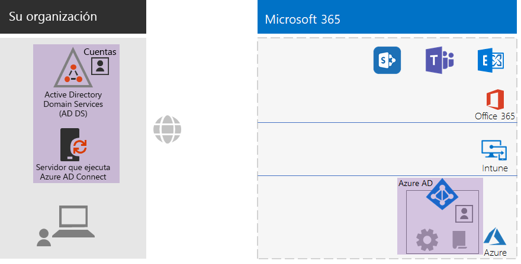
 
Entre los elementos de identidad híbrida nuevos y resaltados, se incluyen los siguientes:
 
|||
|:------:|:-----|
| 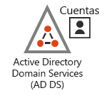 | Un dominio de AD DS local con grupos y cuentas de usuario. |
| 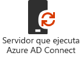 | Servidor basado en Windows que ejecuta Azure AD Connect. |
|  | El conjunto sincronizado de cuentas de usuario y grupos de AD DS en Azure AD. |
|  | Opciones de configuración de Azure AD para autenticarse, proteger cuentas globales y facilitar la administración de grupos y licencias. |
| 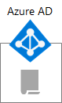 | Directivas de acceso condicional de Azure AD. |
|||

Este es un resumen visual de la fase de identidad de la identidad solo de nube, con los nuevos elementos resaltados.

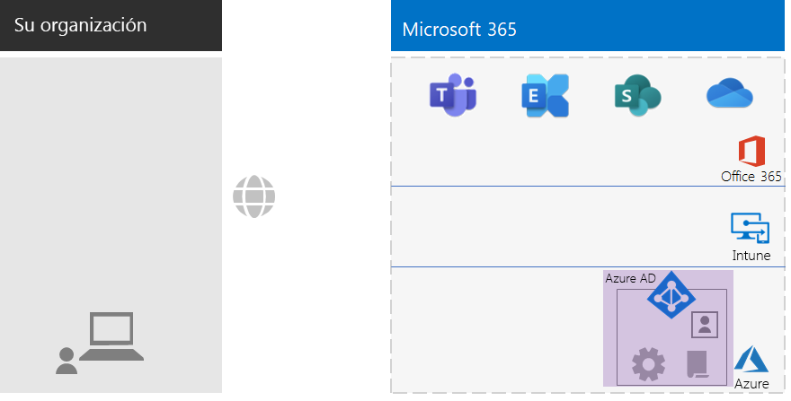
 
Entre los elementos de identidad solo de nube nuevos y resaltados, se incluyen los siguientes:
 
|||
|:------:|:-----|
|  | Los grupos y cuentas de usuario en Azure AD. |
|  | Opciones de configuración de Azure AD para autenticarse, proteger cuentas globales y facilitar la administración de grupos y licencias. |
|  | Directivas de acceso condicional de Azure AD. |
|||

## Fase 3: Windows 10 Enterprise

Tiene las siguientes opciones para asegurarse de que los dispositivos de Windows 10 Enterprise se integren en la infraestructura de identidad y seguridad de Microsoft 365 para empresas:

- Híbrido (tiene un dominio local de AD DS)

  Vincule al espacio empresarial de Azure AD cada dispositivo existente de Windows 10 Enterprise que ya esté vinculado al dominio de AD DS. Para descubrir cómo hacerlo, consulte [Configuración de dispositivos híbridos unidos a Azure Active Directory](https://go.microsoft.com/fwlink/p/?linkid=872870).

  Vincule cada dispositivo nuevo de Windows 10 Enterprise, primero, al dominio de AD DS, y luego al espacio empresarial de Azure AD.

  Inscriba todos los dispositivos con Windows 10 Enterprise en la administración de dispositivos móviles. Vea las instrucciones en [Inscripción de un dispositivo con Windows 10 con Intune mediante una directiva de grupo](https://go.microsoft.com/fwlink/p/?linkid=872871).

- Solo de nube (no tiene un dominio local de AD DS)

  Vincule cada dispositivo de Windows 10 Enterprise al espacio empresarial de Azure AD de su suscripción.

  Para obtener más información, vea [Unir el dispositivo de trabajo a la red de su organización](https://docs.microsoft.com/azure/active-directory/user-help/user-help-join-device-on-network).

Tras su instalación y vinculación, cada dispositivo con Windows 10 Enterprise instalará automáticamente las actualizaciones desde el servicio en la nube de Windows Update para empresas. Por lo general, no es necesario que una organización no empresarial configure una infraestructura para distribuir e instalar actualizaciones de Windows 10.

### Su configuración hasta ahora

Este es un resumen visual de la fase de Windows 10 Enterprise, con los nuevos elementos resaltados.

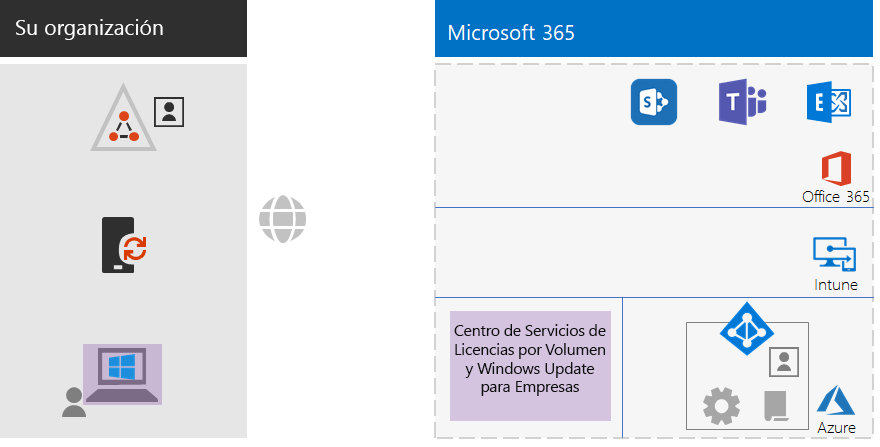
 
Entre los elementos nuevos y resaltados de Windows 10 Enterprise, se incluyen los siguientes:

|||
|:------:|:-----|
|  | Windows 10 Enterprise instalado en dispositivos Windows, con un portátil local como ejemplo. |
| 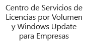 | El Centro de servicios de licencias por volumen, que proporciona imágenes para nuevas instalaciones de Windows 10 Enterprise, y el servicio de Windows Update para empresas, que ofrece las actualizaciones más recientes. |
|||

## Fase 4: Office 365 ProPlus

Microsoft 365 para empresas incluye Office 365 ProPlus, la versión de suscripción de Microsoft Office. Office 365 ProPlus, igual que Office 2016 u Office 2019, está instalado directamente en los dispositivos cliente. Pero Office 365 ProPlus recibe actualizaciones que incluyen las nuevas características de forma periódica. Para más información, vea [Información sobre Office 365 ProPlus en un entorno empresarial](https://docs.microsoft.com/deployoffice/about-office-365-proplus-in-the-enterprise).

En el caso de una organización no empresarial, instale manualmente Office 365 ProPlus en los dispositivos, entre los que se pueden incluir dispositivos Windows, iOS y Android. Esto puede hacerse como parte de la preparación para usar un nuevo dispositivo o lo puede realizar el usuario como parte de su proceso de incorporación.

En ambos casos, el administrador o el usuario deben iniciar sesión en el portal de Office 365 en https://portal.office.com. En la pestaña **Página principal de Microsoft Office** haga clic en **Instalar Office** y siga los pasos del proceso de instalación.

En cada equipo en el que se instale Office 365 ProPlus se descargarán mensualmente las actualizaciones de características. Por lo general, no es necesario que una organización no empresarial configure una infraestructura para distribuir actualizaciones de Office 365 ProPlus. 

### Su configuración hasta ahora

Este es un resumen visual de la fase de Office 365 ProPlus, con los nuevos elementos resaltados.

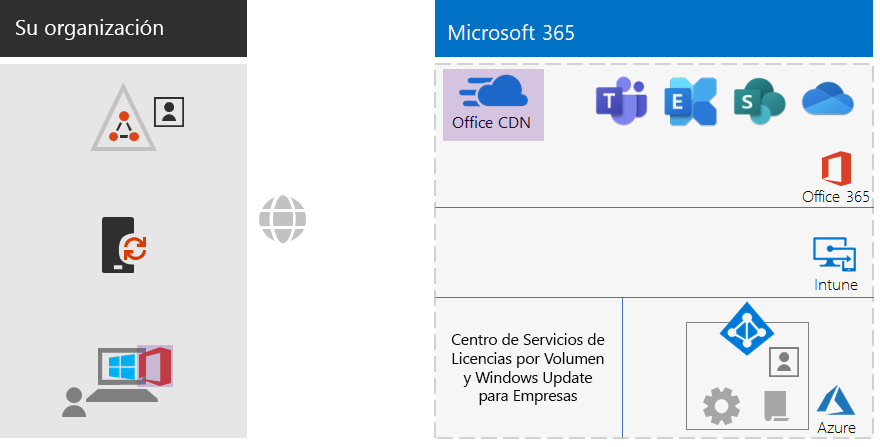
 
Entre los elementos de Office 365 ProPlus nuevos y resaltados, se incluyen los siguientes:
 
|||
|:------:|:-----|
|  | Office 365 ProPlus instalado en dispositivos, con un portátil local como ejemplo. |
|  | La Red de entrega de contenido (CDN) de Office para Office 365 ProPlus, donde los dispositivos obtienen acceso a las actualizaciones de Office 365 ProPlus. |
|||

## Fase 5: Administración de dispositivos móviles

Microsoft 365 para empresas incluye Microsoft Intune para la administración de dispositivos móviles. Con Intune, puede administrar dispositivos iOS, Android, macOS y Windows para proteger el acceso a los recursos de su organización, incluidos los datos. Intune usa las cuentas de usuario, grupo y equipo de Azure AD.

Intune ofrece dos tipos de administración de dispositivos móviles:

- La Administración de Dispositivos Móviles (MDM) se utiliza cuando se inscriben dispositivos en Intune. Una vez que se hayan inscrito, se consideran dispositivos administrados y pueden recibir las directivas, las reglas y la configuración que use su organización. Por lo general, estos tipos de dispositivos son propiedad de su organización y se entregan a sus empleados.

- Es posible que los usuarios con sus propios dispositivos personales no quieran inscribir sus dispositivos o no quieran que sus dispositivos sean administrados con las directivas y configuraciones de usted. Pero todavía debe proteger los datos y recursos de su organización. Si esto ocurre, puede proteger las aplicaciones con la administración de aplicaciones móviles (MAM).  

Las directivas de Intune pueden exigir el cumplimiento de dispositivos y la protección de aplicaciones. Esta es la lista de directivas de Intune que debe crear.

| Directivas de Intune | Grupos a los que se aplica |
|:------|:-----|
| Directivas de cumplimiento de dispositivos para Windows | LÍNEAS BASE, CONFIDENCIAL, EXTREMADAMENTE REGULADO |
| Directivas de cumplimiento de dispositivos para iOS | CONFIDENCIAL, EXTREMADAMENTE REGULADO |
| Cumplimiento de dispositivos para macOS | CONFIDENCIAL, EXTREMADAMENTE REGULADO |
| Directiva de cumplimiento de dispositivos para Android y Android Enterprise | CONFIDENCIAL, EXTREMADAMENTE REGULADO |
| Directiva de protección de aplicaciones para iOS | LÍNEAS BASE, CONFIDENCIAL, EXTREMADAMENTE REGULADO |
| Directiva de protección de aplicaciones para macOS | LÍNEAS BASE, CONFIDENCIAL, EXTREMADAMENTE REGULADO |
| Directiva de protección de apps para Android y Android Enterprise | LÍNEAS BASE, CONFIDENCIAL, EXTREMADAMENTE REGULADO |
|||
    
Puede encontrar las instrucciones en [Implementar directivas comunes de acceso a dispositivos e identidad](identity-access-policies.md)

### Su configuración hasta ahora

Este es un resumen visual de la fase de la Administración de dispositivos móviles, con los nuevos elementos resaltados.

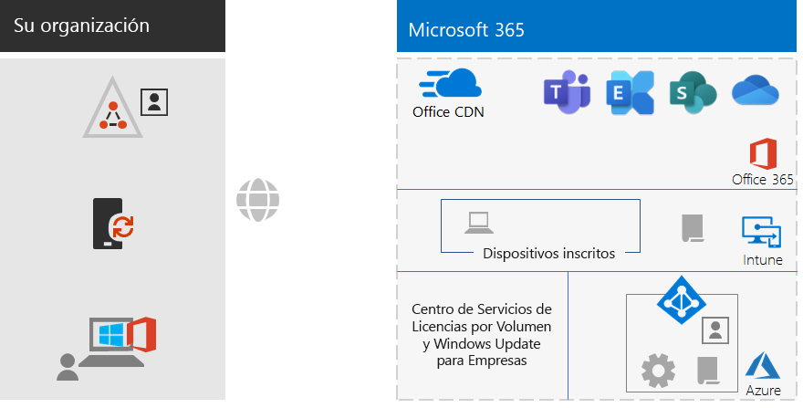
 
Entre los elementos nuevos y resaltados de la administración de dispositivos móviles, se incluyen los siguientes:

|||
|:------:|:-----|
| 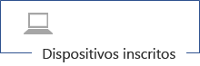 | Dispositivos que se inscriben en Intune que muestran como ejemplo el portátil local que ejecuta Windows 10 Enterprise. |
|  | Directivas de Intune para el cumplimiento de dispositivos y la protección de aplicaciones. |
|||

## Fase 6: Protección de la información

Microsoft 365 para empresas ofrece una gran variedad de opciones para proteger su información. Estas le permiten realizar distintas clasificaciones de datos y aplicar varios niveles de control, seguridad y protección. 

Por ejemplo, se requiere un nivel básico de protección para la correspondencia normal entre la mayoría de los empleados y los documentos con los que trabajan. Pero se requiere un nivel de protección más alto para los registros financieros, los datos de los clientes y su propiedad intelectual.

El primer paso en una estrategia de protección de datos es determinar los distintos niveles de protección. Muchas organizaciones usan estos niveles, ya empleados en directivas de acceso condicional:

- Línea base

  Algunos ejemplos son las comunicaciones empresariales normales (correo electrónico) y los archivos de empleados administrativos, de ventas y de soporte técnico.

- Confidencial

  Algunos ejemplos son la información jurídica y financiera, y los datos de investigación y desarrollo de productos o servicios nuevos.

- Extremadamente regulado

  Algunos ejemplos son la información de identificación personal de los clientes y socios, y la propiedad intelectual o los planes estratégicos de su organización.

En función de estos niveles de seguridad de datos, el siguiente paso es identificar e implementar:

- Tipos de información confidencial personalizada

  Microsoft 365 proporciona una amplia variedad de tipos de información confidencial, como el servicio de mantenimiento y los números de tarjeta de crédito. Si no encuentra el que necesita en la lista proporcionada, puede crear su propia lista.

- Etiquetas de retención

  Para cumplir con las directivas de la organización y la reglamentación regional, puede que deba especificar cuánto tiempo deben conservarse determinados tipos de documentos o documentos con contenidos específicos. Puede implementarlo para correos electrónicos y documentos con etiquetas de retención. Las etiquetas de retención también pueden usarse conjuntamente con las directivas de prevención de pérdida de datos (DLP) que pueden restringir el uso compartido de archivos o correo electrónico fuera de su organización.

- Etiquetas de confidencialidad

  Puede asignar una etiqueta de confidencialidad con nombre a mensajes de correo electrónico o documentos para que se puedan aplicar niveles de seguridad adicionales. Algunos ejemplos son las marcas de agua, el cifrado y los permisos, que especifican a quién se le permite obtener acceso al correo electrónico o documento y qué se les permite hacer.

Para obtener más información, consulte [Tipos de clasificación de Microsoft 365](infoprotect-configure-classification.md#microsoft-365-classification-types).

Si usa etiquetas de confidencialidad con permisos, es posible que tenga que crear grupos de seguridad de Office 365 adicionales para definir qué se le permite hacer a cada persona con el correo electrónico y los documentos que tienen aplicados una etiqueta de confidencialidad. 

Supongamos, por ejemplo, que necesita crear una etiqueta de confidencialidad de INVESTIGACIÓN para proteger el correo electrónico y los documentos de su equipo de investigación. Usted determina que:

- Los investigadores deben tener la capacidad de cambiar los documentos marcados con la etiqueta de confidencialidad de INVESTIGACIÓN.
- Los empleados ajenos a la investigación solo deben tener la capacidad de ver los documentos marcados con la etiqueta de confidencialidad de INVESTIGACIÓN. 

Esto quiere decir que debe crear y administrar dos grupos adicionales de Office 365:

- INVESTIGACIÓN-TODO
- INVESTIGACIÓN-VISTA

Estos grupos y sus permisos forman parte de la configuración de la etiqueta de confidencialidad INVESTIGACIÓN.

Para las etiquetas de confidencialidad configuradas con permisos basados en grupos, debe administrar la pertenencia a estos grupos.

### Su configuración hasta ahora

Este es un resumen visual de la fase de protección de información, con los nuevos elementos resaltados.

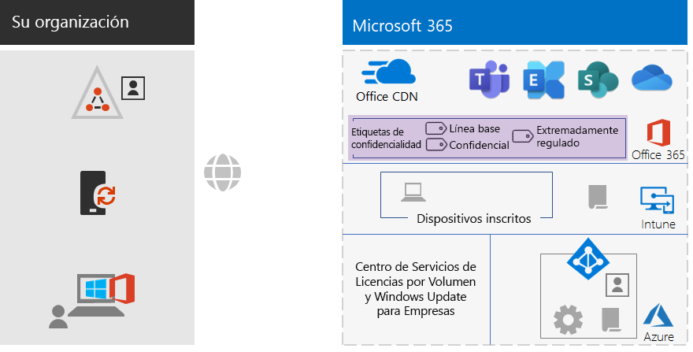
 
Entre los elementos de protección de la información nuevos y resaltados se incluyen:
 
|||
|:------:|:-----|
|  | Etiquetas de confidencialidad para los tres niveles de seguridad que los usuarios pueden aplicar a los documentos y el correo electrónico. |
|||

No se muestran las etiquetas de retención ni los tipos de información personalizados.

## Incorporación

Con la infraestructura de Microsoft 365 para empresas, podrá incorporar fácilmente a sus empleados.

### Un nuevo dispositivo con Windows 10 Enterprise

Antes de dar a un empleado un nuevo dispositivo con Windows 10 Enterprise:

- Para identidad híbrida

  Vincule el dispositivo a su dominio de AD DS, luego vincúlelo a su espacio empresarial de Azure AD y, después, inscríbalo en Intune.

- Para una identidad solo de nube

  Incluya el dispositivo en su espacio empresarial de Azure AD.

### Empleado existente con una cuenta de usuario de AD DS

Cuando utilice la identidad híbrida, y como parte de la incorporación inicial de su organización, agregue la cuenta de usuario de AD DS a estos grupos de Azure AD:

- CON LICENCIA
- Los grupos de seguridad de AD DS o Azure AD adecuados que son miembros de los grupos de Azure AD LÍNEA BASE, CONFIDENCIAL y EXTREMADAMENTE REGULADO.
- Grupos de etiquetas de confidencialidad (si es necesario)

El empleado existente ya debe haber sido agregado a los grupos correspondientes de departamento, grupo de trabajo y grupos regionales de AD DS.

Puede agregar una cuenta de usuario a varios grupos de Azure AD en el Centro de administración de Microsoft 365. En las propiedades de la cuenta de usuario, haga clic en **Administrar grupos > Agregar miembros**.

Si quiere usar PowerShell, vea este [libro de Excel descargable](https://github.com/MicrosoftDocs/microsoft-365-docs/raw/public/microsoft-365/media/deploy-foundation-infrastructure-non-enterprises/Group-License-Mgmt-PowerShell.xlsx), donde se generan los comandos de PowerShell basándose en una cuenta de usuario específica y en nombres de grupos seleccionados.

### Nuevo empleado con una cuenta de usuario solo de nube

Cuando utilice la identidad solo de nube como parte de la incorporación inicial de su organización, agregue la nueva cuenta de usuario a estos grupos:

- CON LICENCIA
- Los grupos de seguridad de Azure AD adecuados que son miembros de los grupos de Azure AD LÍNEA BASE, CONFIDENCIAL y EXTREMADAMENTE REGULADO.
- Grupos de trabajo, de departamento y regionales
- Grupos de etiquetas de confidencialidad (si es necesario)

### Primer inicio de sesión en Microsoft 365

La primera vez que los empleados inicien sesión en Microsoft 365, indíqueles que:

1. Deben iniciar sesión en sus dispositivos con las credenciales de su cuenta de usuario.
2. Con un explorador, deben iniciar sesión en el portal de Office 365 en https://portal.office.com.
3. Desde la pestaña **Página principal de Office 365**, deben hacer clic en **Instalar Office** para instalar Office 365 ProPlus en su dispositivo.

## Resultados finales

Estos son los resultados de la configuración de la infraestructura básica de Microsoft 365 para empresas para una organización no empresarial.

### Resultados de la infraestructura

Después de la creación y de la configuración de su infraestructura empresarial de Microsoft 365 para empresas, debe tener:

- Una conexión a Internet local para cada una de las oficinas, con suficiente ancho de banda proporcionado por un proveedor de Internet que utilice un servidor DNS regionalmente local.
- En el caso de las identidades híbridas, Azure AD Connect se ejecuta en un servidor que sincroniza el dominio de AD DS local con su espacio empresarial de Azure AD.
- Estos grupos:
  - CON LICENCIA
  - COND-ACCESS-EXCLUDE
  - Los grupos de seguridad de AD DS o Azure AD adecuados que también son miembros de los grupos de Azure AD LÍNEA BASE, CONFIDENCIAL y EXTREMADAMENTE REGULADO. 
  - Grupos de trabajo, de departamento y regionales
  - Grupos de etiquetas de confidencialidad de Office 365 (si es necesario)
- Directivas de acceso condicional de inicio de sesión de Azure AD que usan los grupos de Azure AD LÍNEA BASE, CONFIDENCIAL, EXTREMADAMENTE REGULADO y COND-ACCESS-EXCLUDE.
- Directivas de cumplimiento normativo de aplicaciones y dispositivos Intune.
- Tipos de información confidencial personalizada (si se necesitan)
- Etiquetas de retención (si se necesitan)
- Etiquetas de confidencialidad (si se necesitan)

Aquí se muestra un resumen visual de la infraestructura en caso de que su organización use una identidad híbrida. Incluye el dominio de AD DS, un servidor de Azure AD Connect y usuarios y grupos de AD DS sincronizados.

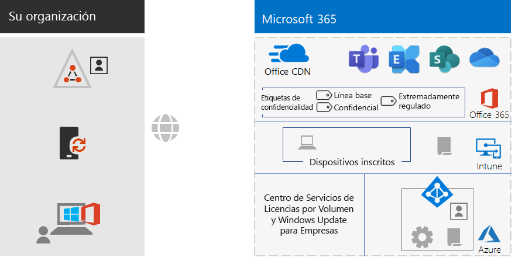
 
Este es un resumen visual de la infraestructura en caso de que su organización use una identidad solo de nube.
 
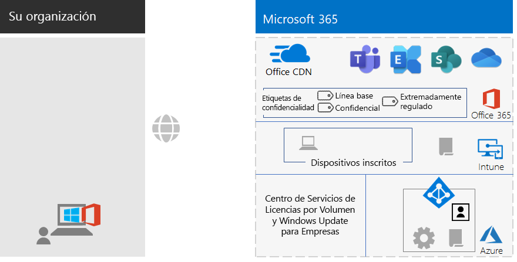

### Resultados de empleados

Después de ser incorporado, cada empleado debe tener:

- Una ruta de acceso de red local de altas prestaciones desde su dispositivo hasta los servicios en la nube de Microsoft 365 en su región.
- Una cuenta de usuario con estas pertenencias de grupo:
   - CON LICENCIA
   - Los grupos de seguridad de AD DS o Azure AD adecuados que también son miembros de los grupos de Azure AD LÍNEA BASE, CONFIDENCIAL y EXTREMADAMENTE REGULADO para directivas de acceso condicional. 
   - Grupos de trabajo, de departamento y regionales adecuados
   - Grupos de etiquetas de confidencialidad de Office 365 (si es necesario)
- Un nuevo dispositivo con Windows 10 Enterprise que:
   - se ha unido al espacio empresarial de Azure AD (solo en la nube) o tanto al espacio empresarial de Azure AD como al dominio de AD DS (híbrido).
   - se actualiza automáticamente con las mejoras más recientes de producto y mejoras de seguridad de Windows 10 Enterprise.
   - tiene Office 365 ProPlus instalado y este se actualiza automáticamente con las mejoras de producto más recientes de Office y mejoras de seguridad.
   - se ha inscrito en Intune y está sujeto a las directivas de cumplimiento de dispositivos y a las directivas de protección de aplicaciones de Intune.

## Paso siguiente

Implemente las [cargas de trabajo y los escenarios](deploy-workloads.md) para aprovechar las características y la configuración de su infraestructura de base de Microsoft 365 para empresas.
