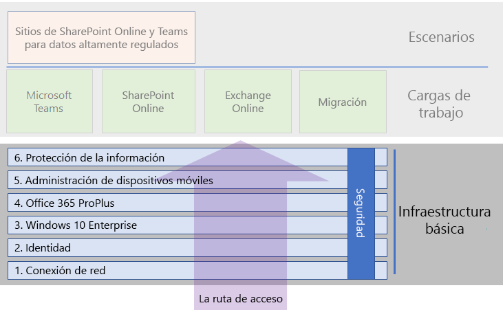

# Infraestructura básica de Microsoft 365 EnterpriseMicrosoft 365 Enterprise foundation infrastructure

Para alcanzar por completo las ventajas de Microsoft 365 Enterprise, empezará la implementación con su infraestructura básica.To fully realize the benefits of Microsoft 365 Enterprise, you’ll begin your deployment with its foundation infrastructure. 

## Infraestructura básica para implementar Microsoft 365 EnterpriseFoundation infrastructure for deploying Microsoft 365 Enterprise

La infraestructura básica es el trabajo preliminar necesario antes de implementar cargas de trabajo de productividad (como Microsoft Teams y Exchange Online en Office 365) y escenarios (como la migración a Microsoft 365 y la automatización de actualizaciones del cliente). Ofrece una integración de seguridad inteligente que simplifica la administración continuada, lo que garantiza que el software cliente se actualice con las mejoras más recientes en productividad y seguridad.The foundation infrastructure is the groundwork upon which you can deploy productivity workloads (such as Microsoft Teams and Exchange Online in Office 365) and scenarios (such as migrating to Microsoft 365 and automating client updates). It provides intelligent security and integration that simplifies ongoing management, which ensures that your client software is updated with the latest productivity and security enhancements.

Use las fases siguientes para planear e implementar la infraestructura básica de Microsoft 365 Enterprise en su organización:You'll use the following phases to plan for and deploy the foundation infrastructure of Microsoft 365 Enterprise in your organization:

|||
|:-------|:-----|
||[Fase 1: RedesPhase 1: Networking](networking-infrastructure.md)|
||[Fase 2: IdentidadPhase 2: Identity](identity-infrastructure.md)|
||[Fase 3: Windows 10 EnterprisePhase 3: Windows 10 Enterprise](windows10-infrastructure.md)|
||[Fase 4: Office 365 ProPlusPhase 4: Office 365 ProPlus](office365proplus-infrastructure.md)|
||[Fase 5: Administración de dispositivos móvilesPhase 5: Mobile device management](mobility-infrastructure.md)|
||[Fase 6: Protección de la informaciónPhase 6: Information protection](infoprotect-infrastructure.md)|

Antes de terminar cada fase, necesita examinar los criterios de salida, que son un conjunto de condiciones obligatorias que necesita cumplir y de condiciones opcionales que es importante tener en cuenta. Los criterios de salida de cada fase garantizan que la infraestructura de nube y local, así como la configuración de un extremo a otro, cumplan con los requisitos de una implementación de Microsoft 365 Enterprise.Before you can exit each phase, you must examine its exit criteria, which is a set of required conditions that you must meet and optional conditions to consider. Exit criteria for each phase ensures that your on-premises and cloud infrastructure and resulting end-to-end configuration meet the requirements for a Microsoft 365 Enterprise deployment.

Vea este vídeo breve sobre cómo funciona el contenido de la infraestructura básica.Watch this short video on how the foundation infrastructure content works.

> [!VIDEO https://www.microsoft.com/videoplayer/embed/RE23VRG]

En la siguiente ilustración se muestra la infraestructura básica en el contenido general de la implementación de Microsoft 365 Enterprise y los pasos intermedios.The following figure shows the foundation infrastructure in the overall Microsoft 365 Enterprise deployment content and your path through it.

## FastTrackFastTrack

FastTrack es una ventaja continuada y repetible (disponible como parte de su suscripción) ofrecida por ingenieros de Microsoft para ayudarle a migrar a la nube a su propio ritmo. FastTrack también le ofrece acceso a partners cualificados para servicios adicionales, si es necesario. Con más de 40 000 clientes habilitados hasta la fecha, FastTrack permite maximizar la rentabilidad de la inversión, agilizar la implementación y mejorar la adopción en su organización. Vea [FastTrack para Microsoft 365](https://fasttrack.microsoft.com/microsoft365).FastTrack is an ongoing and repeatable benefit—available as part of your subscription—that is delivered by Microsoft engineers to help you move to the cloud at your own pace. FastTrack also gives you access to qualified partners for additional services, as needed. With over 40,000 customers enabled to date, FastTrack helps maximize ROI, accelerate deployment, and increase adoption across your organization. See [FastTrack for Microsoft 365](https://fasttrack.microsoft.com/microsoft365). 

Si quiere aprovechar FastTrack para implementar Microsoft 365 Enterprise, puede usar el [Asesor de implementación de Microsoft 365](https://aka.ms/microsoft365setupguide) de FastTrack para obtener directrices sobre cómo implementar y configurar la infraestructura básica. Debe haber iniciado sesión como administrador global en un inquilino de Office 365 o Microsoft 365 para disponer de acceso a esta página.If you want to take advantage of FastTrack to deploy Microsoft 365 Enterprise, you can use the FastTrack [Microsoft 365 deployment advisor](https://aka.ms/microsoft365setupguide) for guidance on how to deploy and set up your foundation infrastructure. You must be signed on as a global administrator in an Office 365 or Microsoft 365 tenant in order to access this page.

## Paso siguienteNext step

Si tiene una infraestructura existente para Office 365, Enterprise Mobility + Security o Windows 10 Enterprise, vea [Implementación de Microsoft 365 Enterprise con una infraestructura existente](deploy-with-existing-infrastructure.md). En este artículo, se describen los criterios de salida de cada fase. Con esta información, podrá determinar con mayor rapidez lo que necesita cambiar para conseguir que su infraestructura de TI sea compatible con Microsoft 365 Enterprise.If you have existing infrastructure for Office 365, Enterprise Mobility + Security, or Windows 10 Enterprise, see [Deployment of Microsoft 365 Enterprise with existing infrastructure](deploy-with-existing-infrastructure.md). This article steps you through the exit criteria for each phase. With this information, you can more quickly determine what you need to change to make your IT infrastructure Microsoft 365 Enterprise-compliant.

De lo contrario, puede empezar la implementación integral de Microsoft 365 Enterprise con [Fase 1: Redes](networking-infrastructure.md).Otherwise, you can begin your Microsoft 365 Enterprise end-to-end deployment journey with [Phase 1: Networking](networking-infrastructure.md).