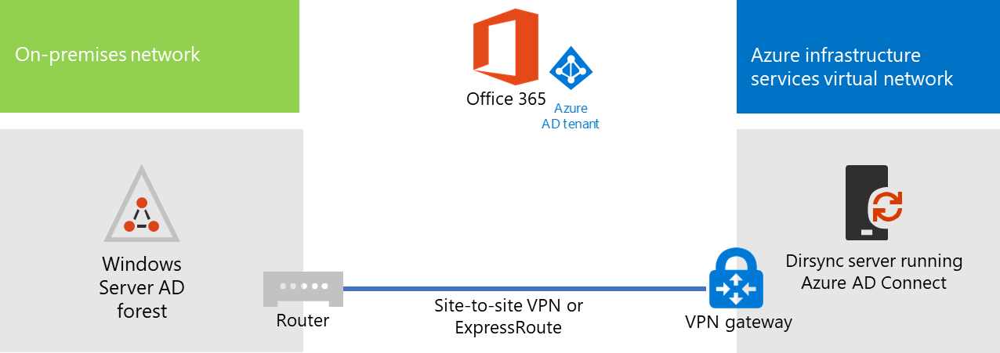

# Implementación de la sincronización de directorios de Microsoft 365 en Microsoft Azure

Azure Active Directory (Azure AD) Connect (anteriormente conocido como herramienta de sincronización de directorios, herramienta de sincronización de directorios o la herramienta de DirSync.exe) es una aplicación que se instala en un servidor unido a un dominio para sincronizar los usuarios de Active Directory local Domain Services (AD DS) con el inquilino de Azure AD de la suscripción de Microsoft 365. Microsoft 365 usa Azure AD para su servicio de directorio. La suscripción de Microsoft 365 incluye un inquilino de Azure AD. Este inquilino también se puede usar para administrar las identidades de su organización con otras cargas de trabajo en la nube, incluidas otras aplicaciones SaaS y aplicaciones en Azure.

Puede instalar Azure AD Connect en un servidor local, pero también puede instalarlo en una máquina virtual de Azure por estos motivos:
  
- Puede aprovisionar y configurar los servidores basados en la nube con mayor rapidez, y conseguir así que los servicios estén disponibles para los usuarios mucho antes.
- Azure ofrece mejor disponibilidad de sitios con menos esfuerzo.
- Puede reducir el número de servidores locales de su organización.

This solution requires connectivity between your on-premises network and your Azure virtual network. For more information, see [Connect an on-premises network to a Microsoft Azure virtual network](connect-an-on-premises-network-to-a-microsoft-azure-virtual-network.md). 
  
> [!NOTE]
> En este artículo se describe la sincronización de un único dominio en un único bosque. Azure AD Connect sincroniza todos los dominios de AD DS del bosque de Active Directory con Microsoft 365. Si tiene varios bosques de Active Directory para sincronizar con Microsoft 365, consulte [Multi-forest Directory Sync with Single Sign-On Scenario (Sincronización de directorios de varios bosques con un único escenario de Sign-On).](/azure/active-directory/hybrid/whatis-hybrid-identity) 
  
## Introducción a la implementación de la sincronización de directorios de Microsoft 365 en Azure

En el diagrama siguiente se muestra Azure AD Connect en ejecución en una máquina virtual de Azure (el servidor de sincronización de directorios) que sincroniza un bosque de AD DS local con una suscripción de Microsoft 365.
  

  
En el diagrama, hay dos redes conectadas mediante una conexión VPN de sitio a sitio o ExpressRoute. Hay una red local donde se encuentran los controladores de dominio de AD DS y hay una red virtual de Azure con un servidor de sincronización de directorios, que es una máquina virtual que ejecuta [Azure AD Connect](https://www.microsoft.com/download/details.aspx?id=47594). Hay dos flujos de tráfico principales que se origina desde el servidor de sincronización de directorios:
  
-  Azure AD Connect consulta un controlador de dominio en la red local para conocer los cambios de cuentas y contraseñas.
-  Azure AD Connect envía los cambios a las cuentas y contraseñas a la instancia de Azure AD de la suscripción de Microsoft 365. Dado que el servidor de sincronización de directorios se encuentra en una parte extendida de la red local, estos cambios se envían a través del servidor proxy de la red local.
    
> [!NOTE]
> En esta solución se describe la sincronización de un único dominio de Active Directory en un único bosque de Active Directory. Azure AD Connect sincroniza todos los dominios de Active Directory del bosque de Active Directory con Microsoft 365. Si tiene varios bosques de Active Directory para sincronizar con Microsoft 365, consulte [Multi-forest Directory Sync with Single Sign-On Scenario (Sincronización de directorios de varios bosques con un único escenario de Sign-On).](/azure/active-directory/hybrid/whatis-hybrid-identity) 
  
Existen dos pasos principales cuando implementa esta solución:
  
1. Create an Azure virtual network and establish a site-to-site VPN connection to your on-premises network. For more information, see [Connect an on-premises network to a Microsoft Azure virtual network](connect-an-on-premises-network-to-a-microsoft-azure-virtual-network.md).
    
2. Instale [Azure AD Connect](https://www.microsoft.com/download/details.aspx?id=47594) en una máquina virtual unida a un dominio en Azure y sincronice el AD DS local con Microsoft 365. Esto conlleva lo siguiente:
    
    Crear una Máquina virtual de Azure para ejecutar Azure AD Connect.
    
    Instalar y configurar [Azure AD Connect](https://www.microsoft.com/download/details.aspx?id=47594).
    
    La configuración de Azure AD Connect requiere las credenciales (nombre de usuario y contraseña) de una cuenta de administrador de Azure AD y una cuenta de administrador de empresa de AD DS. Azure AD Connect se ejecuta de forma inmediata y continua para sincronizar el bosque de AD DS local con Microsoft 365.
    
Antes de implementar esta solución en producción, puede usar las instrucciones de [La configuración base de empresa simulada](simulated-ent-base-configuration-microsoft-365-enterprise.md) para configurar esta configuración como prueba de concepto, para demostraciones o para experimentación.
  
> [!IMPORTANT]
> Cuando la configuración de Azure AD Connect se completa, no guarda las credenciales de la cuenta de administrador de organización de AD DS. 
  
> [!NOTE]
> En esta solución se describe la sincronización de un único bosque de AD DS con Microsoft 365. La topología descrita en este artículo solo representa una manera de implementar esta solución. La topología de la organización puede diferir en función de los requisitos de red únicos y las consideraciones de seguridad. 
  
## Planear el hospedaje de un servidor de sincronización de directorios para Microsoft 365 en Azure

### Requisitos previos

Antes de comenzar, revise los siguientes requisitos previos para esta solución:
  
- Revise el contenido de planeación relacionado en [Planear la red virtual de Azure](connect-an-on-premises-network-to-a-microsoft-azure-virtual-network.md#plan-your-azure-virtual-network).
    
- Asegúrese de que cumple todos los [requisitos previos](connect-an-on-premises-network-to-a-microsoft-azure-virtual-network.md#prerequisites) para configurar la red virtual de Azure.
    
- Tenga una suscripción a Microsoft 365 que incluya la característica de integración de Active Directory. Para obtener información sobre las suscripciones de Microsoft 365, vaya a la [página suscripción de Microsoft 365](https://products.office.com/compare-all-microsoft-office-products?tab=2).
    
- Aprovisione una máquina virtual de Azure que ejecute Azure AD Connect para sincronizar el bosque de AD DS local con Microsoft 365.
    
    Debe tener las credenciales (nombres y contraseñas) de la cuenta de administrador empresarial de AD DS y una cuenta de administrador de Azure AD.
    
### Suposiciones de diseño de la arquitectura de la solución

En la siguiente lista se describen las elecciones de diseño que se han tomado para esta solución.
  
- This solution uses a single Azure virtual network with a site-to-site VPN connection. The Azure virtual network hosts a single subnet that has one server, the directory sync server that is running Azure AD Connect. 
    
- En la red local, hay un controlador de dominio y servidores DNS.
    
- Azure AD Connect realiza la sincronización de hash de contraseña en lugar del inicio de sesión único. No es necesario implementar una infraestructura de Servicios de federación de Active Directory (AD FS) (AD FS). Para más información sobre la sincronización de hash de contraseñas y las opciones de inicio de sesión único, consulte [Elección del método de autenticación adecuado para la solución de identidad híbrida de Azure Active Directory](/azure/active-directory/hybrid/choose-ad-authn).
    
Hay otras opciones de diseño que puede tener en cuenta al implementar esta solución en el entorno. Entre ellas se incluyen las siguientes:
  
- Si hay servidores DNS en una red virtual existente de Azure, determine si desea que el servidor de sincronización de directorios los use para la resolución de nombres, en lugar de usar los servidores DNS de la red local.
    
- If there are domain controllers in an existing Azure virtual network, determine whether configuring Active Directory Sites and Services may be a better option for you. The directory sync server can query the domain controllers in the Azure virtual network for changes in accounts and passwords instead of domain controllers on the on-premises network.
    
## Guía de implementación

La implementación de Azure AD Connect en una máquina virtual en Azure consta de tres fases:
  
- Fase 1: Creación y configuración de la red virtual de Azure
    
- Fase 2: Creación y configuración de la máquina virtual de Azure
    
- Fase 3: Instalar y configurar Azure AD Connect
    
Después de la implementación, también debe asignar ubicaciones y licencias para las nuevas cuentas de usuario en Microsoft 365.

### Fase 1: Creación y configuración de la red virtual de Azure

Para crear y configurar la red virtual de Azure, complete la [Fase 1: Preparar la red local](connect-an-on-premises-network-to-a-microsoft-azure-virtual-network.md#phase-1-prepare-your-on-premises-network) y la [Fase 2: Crear la red virtual entre locales en Azure](connect-an-on-premises-network-to-a-microsoft-azure-virtual-network.md#phase-2-create-the-cross-premises-virtual-network-in-azure) del plan de implementación de [Conectar una red local a Microsoft Azure Virtual Network](connect-an-on-premises-network-to-a-microsoft-azure-virtual-network.md).
  
Esta es la configuración resultante.
  

  
En esta figura se muestra una red local conectada a una red virtual de Azure mediante una conexión de ExpressRoute o VPN de sitio a sitio.
  
### Fase 2: Creación y configuración de la máquina virtual de Azure

Create the virtual machine in Azure using the instructions [Create your first Windows virtual machine in the Azure portal](https://go.microsoft.com/fwlink/p/?LinkId=393098). Use the following settings:
  
- On the **Basics** pane, select the same subscription, location, and resource group as your virtual network. Record the user name and password in a secure location. You will need these later to connect to the virtual machine.
    
- En el panel **Elija un tamaño**, seleccione el tamaño **A2 estándar**.
    
- On the **Settings** pane, in the **Storage** section, select the **Standard** storage type. In the **Network** section, select the name of your virtual network and the subnet for hosting the directory sync server (not the GatewaySubnet). Leave all other settings at their default values.
    
Compruebe que el servidor de sincronización de directorios usa DNS correctamente. Para ello, compruebe su DNS interno y asegúrese de que se ha agregado un registro de dirección (A) para la máquina virtual con su dirección IP. 
  
Use the instructions in [Connect to the virtual machine and sign on](/azure/virtual-machines/windows/connect-logon) to connect to the directory sync server with a Remote Desktop Connection. After signing in, join the virtual machine to the on-premises AD DS domain.
  
For Azure AD Connect to gain access to Internet resources, you must configure the directory sync server to use the on-premises network's proxy server. You should contact your network administrator for any additional configuration steps to perform.
  
Esta es la configuración resultante.
  

  
En esta figura se muestra la máquina virtual del servidor de sincronización de directorios en la red virtual de Azure entre locales.
  
### Fase 3: Instalar y configurar Azure AD Connect

Haga lo siguiente:
  
1. Connect to the directory sync server using a Remote Desktop Connection with an AD DS domain account that has local administrator privileges. See [Connect to the virtual machine and sign on](/azure/virtual-machines/windows/connect-logon).
    
2. En el servidor de sincronización de directorios, abra el artículo [Configurar la sincronización de directorios para Microsoft 365](set-up-directory-synchronization.md) y siga las instrucciones para la sincronización de directorios con sincronización de hash de contraseña.
    
> [!CAUTION]
> El programa de instalación crea la cuenta **AAD_xxxxxxxxxxxx** en la unidad organizativa (UO) de usuarios locales. No mueva ni quite esta cuenta porque entonces se producirá un error de sincronización.
  
Esta es la configuración resultante.
  

  
En esta figura se muestra el servidor de sincronización de directorios con Azure AD Connect en la red virtual de Azure entre locales.
  
### Asignación de ubicaciones y licencias a usuarios de Microsoft 365

Azure AD Connect agrega cuentas a la suscripción de Microsoft 365 desde AD DS local, pero para que los usuarios inicien sesión en Microsoft 365 y usen sus servicios, las cuentas deben configurarse con una ubicación y licencias. Use estos pasos para agregar la ubicación y activar las licencias para las cuentas de usuario adecuadas:
  
1. Inicie sesión en el [Centro de administración de Microsoft 365](https://admin.microsoft.com) y, a continuación, haga clic en **Administración**.
    
2. En el panel de navegación izquierdo, haga clic en **Usuarios** > <a href="https://go.microsoft.com/fwlink/p/?linkid=834822" target="_blank">**activos**</a>.
3. En la lista de las cuentas de usuarios, seleccione la casilla junto al usuario que quiere activar.
    
4. En la página del usuario, haga clic en **Editar** para **Licencias de productos**.
    
5. En la página **Licencias de productos**, seleccione una ubicación para el usuario en **Ubicación** y, después, habilite las licencias adecuadas para el usuario.
    
6. Cuando finalice, haga clic en **Guardar** y, después, haga clic en **Cerrar** dos veces.
    
7. Vuelva al paso 3 para usuarios adicionales.
    
## Recursos adicionales

[Centro de soluciones y arquitectura de Microsoft 365](../solutions/index.yml)
  
[Conectar una red local con una red virtual de Microsoft Azure](connect-an-on-premises-network-to-a-microsoft-azure-virtual-network.md)

[Descargar Azure AD Connect](https://www.microsoft.com/download/details.aspx?id=47594)
  
[Configuración de la sincronización de directorios para Microsoft 365](set-up-directory-synchronization.md)
