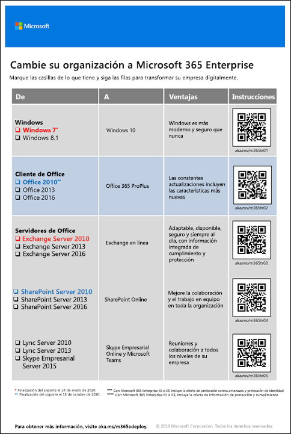

# Implementar Microsoft 365 Enterprise

Microsoft 365 Enterprise es una combinación de aplicaciones de productividad basadas en la nube local y servicios con Windows 10 Enterprise que:  

- Tiene seguridad inteligente.
- Está integrada para ofrecer simplicidad.
- Impulsa la creatividad.
- Se diseñó para el trabajo en equipo.

Puede materializar estas ventajas implementando la carga de trabajo de la infraestructura y la productividad de una manera integrada que incluya características y servicios de seguridad de última generación.

Hay tres formas principales de implementar Microsoft 365 Enterprise:

- Puede hacerlo con los ingenieros de Microsoft, mediante [FastTrack para Microsoft 365](#fasttrack-for-microsoft-365).
- Puede hacerlo con la ayuda de los servicios de consultoría de Microsoft o un [partner de Microsoft](https://partner.microsoft.com/).
- Puede hacerlo usted mismo con la [Guía de implementación de Microsoft 365 Enterprise](#microsoft-365-enterprise-deployment-guide).

## FastTrack para Microsoft 365

FastTrack es un beneficio continuado y repetible, disponible como parte de la suscripción, que se envía a los ingenieros de Microsoft para ayudarle a desplazarse a la nube a su ritmo. FastTrack también le da acceso a partners cualificados para servicios adicionales. Con más de 40 000 clientes habilitados hoy en día, FastTrack le ayuda a maximizar el ROI, acelerar la implementación y aumentar la adopción en toda la organización. Vea [FastTrack para Microsoft 365](https://fasttrack.microsoft.com/microsoft365).

Si quiere aprovechar FastTrack para implementar Microsoft 365 Enterprise, puede usar el [Asesor de implementación de Microsoft 365](https://aka.ms/microsoft365setupguide) de FastTrack para obtener directrices sobre cómo implementar y configurar la infraestructura de base. Debe iniciar sesión como administrador global en un espacio empresarial de Office 365 o Microsoft 365 para acceder a esta página.

Empiece su recorrido de implementación de un extremo a otro con FastTrack [aquí](https://fasttrack.microsoft.com/microsoft365).

## Guía de implementación de Microsoft 365 Enterprise

La guía de implementación de Microsoft 365 Enterprise le mostrará la configuración correcta y necesaria para los productos y características de Microsoft 365 Enterprise.

Para implementar Microsoft 365 Enterprise por su cuenta, puede:

- Implementar la [infraestructura de base](deploy-foundation-infrastructure.md) necesaria para la seguridad integrada y la integración de la administración simplificada, lo que permite garantizar con mayor facilidad que el software cliente esté actualizado con las mejoras de productividad y seguridad más recientes. 
 
  La infraestructura de base se organiza como una serie de fases numeradas que se superponen y crean un entorno que admite cargas de trabajo y escenarios de Microsoft 365 Enterprise. 

  **Si tiene una organización más pequeña o reciente**, siga las fases en orden para crear la infraestructura metódicamente.

  Pero puede implementar fases o porciones de fases de esta infraestructura en el orden que precise, [una tras otra o de forma paralela](deployment-strategies-microsoft-365-enterprise.md), para que se integren con su infraestructura actual, se ajusten a sus recursos y planes de TI y se adapten a sus necesidades empresariales. Para una implementación simplificada para no empresas, haga clic [aquí](deploy-foundation-infrastructure-non-enterprises.md).

  **Si tiene una organización empresarial**,vea las fases como capas de infraestructura de TI en lugar de una ruta definida, y determine la mejor forma de cumplir los requisitos de cada capa en toda la organización.

- Implementar[cargas de trabajo y escenarios](deploy-workloads.md) de productividad clave en la parte superior de la infraestructura. De esta manera, impulsará la creatividad y el trabajo en equipo en su organización.

Esta la relación entre la infraestructura de base y las cargas de trabajo y los escenarios.

Las cargas de trabajo y los escenarios operan sobre la parte superior de la infraestructura de base. Pero no necesitará que todas las fases de infraestructura de base estén implementadas para empezar a usar las cargas de trabajo para la colaboración y la productividad.

Empiece su recorrido de implementación de un extremo a otro con por su cuenta [aquí](deploy-foundation-infrastructure.md).

## Utilice una versión limitada de prueba

"*Lo que tenemos que aprender lo aprendemos haciéndolo.*" - Aristóteles

Si acaba de empezar a utilizar Microsoft 365 Enterprise o un producto o característica específicos, una de las mejores formas de familiarizarse con ellos es utilizándolos usted mismo y observando su funcionamiento.

Esto resulta más fácil con las guías del laboratorio de pruebas (TLG), que le ofrecen información paso a paso sobre la configuración de una infraestructura o una característica en un entorno simplificado pero representativo, mediante suscripciones de prueba o de pago.

Con las TLG, puede aprender por su cuenta, demostrar, personalizar o crear una prueba de concepto de una configuración compleja, carga de trabajo o escenario de un extremo a otro.

Para obtener más información, vea [Guías del laboratorio de pruebas de Microsoft 365 Enterprise](m365-enterprise-test-lab-guides.md).

## Realizar la transición en toda la organización

Para tener una mejor idea de cómo mover toda la organización a los productos y servicios de Microsoft 365 Enterprise, descargue el [póster de transición](https://github.com/MicrosoftDocs/microsoft-365-docs/raw/public/microsoft-365/enterprise/media/deploy-microsoft-365-enterprise/transitionorgtom365.pdf).

Este póster de dos páginas explica una forma rápida de realizar un inventario de su infraestructura existente y conseguir las instrucciones para moverse al producto o servicio correspondiente de Microsoft 365 Enterprise. Incluye productos de Windows y Office y otros elementos de infraestructura y seguridad, tales como la administración de dispositivos, la identidad, la información y la protección contra amenazas.

Puede imprimir este póster en formato carta, oficio o tabloide (11 x 17).

## ¿Cómo lo lograron otras personas?

Use estos recursos para comprender cómo otras personas han implementado y usan Microsoft 365 Enterprise.

### Cómo los clientes usan Microsoft 365 Enterprise

Use el sitio de casos de clientes para ver cómo usan Microsoft los clientes de Microsoft 365 Enterprise.

1. Vaya a [https://customers.microsoft.com/](https://customers.microsoft.com/) y haga clic en **Buscar**.
2. En el panel izquierdo, seleccione su idioma en **Idioma**.
3. Seleccione el sector de su organización en **Sector**.
4. Seleccione **Microsoft 365** en **Producto**.
5. Haga clic en una tarjeta para consultar el caso práctico del cliente.

### Cómo Microsoft utiliza Microsoft 365 Enterprise

Definir una cultura digital es una prioridad principal para cada líder que se esfuerza por fomentar un lugar de trabajo moderno. Microsoft 365 se diseñó para admitir este tipo de cambio cultural para que los líderes puedan ayudar a todos los usuarios de sus empresas a desatar la creatividad y promover la colaboración. El establecimiento de la infraestructura base de Microsoft ha provocado exactamente este tipo de cambio de la cultura digital. La implementación de Microsoft 365 Enterprise nos ha permitido implementar la tecnología de colaboración, como Microsoft Teams y Exchange Online, y compartir los datos confidenciales en línea en sitios de intranet seguros de SharePoint.

Al mismo tiempo, las características de seguridad inteligente y la integración del producto ayudan a simplificar las necesidades de administración y reducir el costo total de propiedad en el ciclo de vida de TI. 

Obtenga información sobre cómo Core Services Engineering and Operations (anteriormente Microsoft IT) [planifica e implementa una base](https://www.microsoft.com/en-us/itshowcase/deploying-and-managing-microsoft-365) para admitir aplicaciones y servicios que desatan la creatividad y facilitan el trabajo en equipo en un entorno seguro.

> [!Note]
> Esta característica solo está disponible en inglés.

### Cómo Contoso Corporation implementó Microsoft 365 Enterprise

Contoso Corporation es un conglomerado industrial a nivel mundial ficticio pero representativo, con sede central en París, Francia. Vea cómo se implementó [Microsoft 365 Enterprise para Contoso Corporation](contoso-case-study.md) y cómo la compañía ha tomado importantes decisiones sobre el diseño y los detalles de implementación de redes, identidades, Windows 10 Enterprise, Office 365 ProPlus, administración de dispositivos móviles, protección de la información y seguridad. 

## Siguiente paso

Para hacerlo con la ayuda directa de Microsoft, use [FastTrack](https://fasttrack.microsoft.com/microsoft365).

Para hacerlo con un consultor, póngase en contacto con los servicios de consultoría de Microsoft o un [partner de Microsoft](https://partner.microsoft.com/).

Para empezar a hacerlo por su cuenta, vea la [infraestructura de base](deploy-foundation-infrastructure.md).
