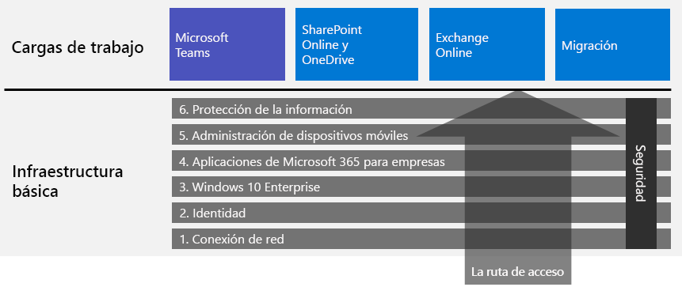

# Implementar Microsoft 365 EnterpriseDeploy Microsoft 365 for enterprise

Microsoft 365 Enterprise es una combinación de aplicaciones de productividad basadas en la nube local y servicios con Windows 10 Enterprise que:Microsoft 365 for enterprise is a combination of local and cloud-based productivity apps and services with Windows 10 Enterprise that:  

- Tiene seguridad inteligente.Has intelligent security.
- Está integrada para ofrecer simplicidad.Is integrated for simplicity.
- Impulsa la creatividad.Unlocks creativity.
- Se diseñó para el trabajo en equipo.Is built for teamwork.

Puede materializar estas ventajas implementando la carga de trabajo de la infraestructura y la productividad de una manera integrada que incluya características y servicios de seguridad de última generación.You can realize these benefits by deploying the infrastructure and productivity workloads in an integrated way that includes state-of-the-art security services and features.

Hay tres formas principales de implementar Microsoft 365 Enterprise:There are three main ways to deploy Microsoft 365 for enterprise:

- Puede hacerlo con los ingenieros de Microsoft, mediante [FastTrack para Microsoft 365](#fasttrack-for-microsoft-365).Do it with Microsoft engineers using [FastTrack for Microsoft 365](#fasttrack-for-microsoft-365).
- Puede hacerlo con la ayuda de los servicios de consultoría de Microsoft o un [partner de Microsoft](https://partner.microsoft.com/).Do it with help from Microsoft Consulting Services or a [Microsoft partner](https://partner.microsoft.com/).
- Puede hacerlo usted mismo con la [Guía de implementación de Microsoft 365 Enterprise](#microsoft-365-for-enterprise-deployment-guide).Do it yourself with the [Microsoft 365 for enterprise deployment guide](#microsoft-365-for-enterprise-deployment-guide).

## FastTrack para Microsoft 365FastTrack for Microsoft 365

FastTrack es una prestación continua y reiterativa,*disponible de forma gratuita como parte de la*suscripción, proporcionada por los ingenieros de Microsoft para ayudarle a pasarse a la nube a su propio ritmo.FastTrack is an ongoing and repeatable benefit—*available for free as part of your subscription*—that is delivered by Microsoft engineers to help you move to the cloud at your own pace. FastTrack también le da acceso a partners cualificados para servicios adicionales.FastTrack also gives you access to qualified partners for additional services. Con más de 40 000 clientes habilitados hoy en día, FastTrack le ayuda a maximizar el ROI, acelerar la implementación y aumentar la adopción en toda la organización.With over 40,000 customers enabled to date, FastTrack helps maximize ROI, accelerate deployment, and increase adoption across your organization. Vea [FastTrack para Microsoft 365](https://fasttrack.microsoft.com/microsoft365).See [FastTrack for Microsoft 365](https://fasttrack.microsoft.com/microsoft365).

Si quiere aprovechar FastTrack para implementar Microsoft 365 Enterprise, puede usar el [Asesor de implementación de Microsoft 365](https://aka.ms/microsoft365setupguide) de FastTrack para obtener directrices sobre cómo implementar y configurar la infraestructura básica.If you want to take advantage of FastTrack to deploy Microsoft 365 for enterprise, you can use the FastTrack [Microsoft 365 deployment advisor](https://aka.ms/microsoft365setupguide) for guidance on how to deploy and set up your foundation infrastructure. Debe iniciar sesión como administrador global en un espacio empresarial de Office 365 o Microsoft 365 para acceder a esta página.You must be signed in as a global administrator in an Office 365 or Microsoft 365 tenant to access this page.

Empiece su recorrido de implementación de un extremo a otro con FastTrack [aquí](https://fasttrack.microsoft.com/microsoft365).Get started on your end-to-end deployment journey with FastTrack [here](https://fasttrack.microsoft.com/microsoft365).

## Guía de implementación de Microsoft 365 EnterpriseMicrosoft 365 for enterprise deployment guide

La guía de implementación de Microsoft 365 Enterprise le mostrará la configuración correcta y necesaria para los productos y características de Microsoft 365 Enterprise.The Microsoft 365 for enterprise deployment guide steps you through the correct and required configuration of Microsoft 365 for enterprise products and features.

Para implementar Microsoft 365 Enterprise por su cuenta, puede:To deploy Microsoft 365 for enterprise yourself, you can:

- Implementar la [infraestructura de base](deploy-foundation-infrastructure.md) necesaria para la seguridad integrada y la integración de la administración simplificada, lo que permite garantizar con mayor facilidad que el software cliente esté actualizado con las mejoras de productividad y seguridad más recientes.Deploy the [foundation infrastructure](deploy-foundation-infrastructure.md) for built-in security and integration for simplified management, which makes it easier to ensure your client software is updated with the latest productivity and security enhancements. 
 
  La infraestructura básica se organiza como una serie de fases numeradas que se superponen y crean un entorno que es compatible con las cargas de trabajo de Microsoft 365 Enterprise.The foundation infrastructure is organized as a series of numbered phases that build upon each other and towards an environment that supports Microsoft 365 for enterprise workloads. 

  **Si tiene una organización más pequeña o reciente**, siga las fases en orden para crear la infraestructura metódicamente.**If you are a smaller or newer organization**, follow the phases in order to methodically build out your infrastructure.

  Pero puede implementar fases o porciones de fases de esta infraestructura en el orden que precise, [una tras otra o de forma paralela](deployment-strategies-microsoft-365-enterprise.md), para que se integren con su infraestructura actual, se ajusten a sus recursos y planes de TI y se adapten a sus necesidades empresariales.However, you can deploy phases or the portions of phases of this infrastructure in any order as needed, [one after the other or in parallel](deployment-strategies-microsoft-365-enterprise.md), to integrate with your current infrastructure, fit your IT plans and resources, and meet your business needs. Para una implementación simplificada para organizaciones no empresariales, vaya a [infraestructura de base para organizaciones que no son empresas](deploy-foundation-infrastructure-non-enterprises.md).For a simplified deployment for non-enterprises, go to [foundation infrastructure for non-enterprises](deploy-foundation-infrastructure-non-enterprises.md).

  **Si tiene una organización empresarial**,vea las fases como capas de infraestructura de TI en lugar de una ruta definida, y determine la mejor forma de cumplir los requisitos de cada capa en toda la organización.**If you are an enterprise organization**, view the phases as layers of IT infrastructure, rather than a defined path, and determine how to best work toward eventual adherence to the requirements of each layer across your organization.

- Implementar[cargas de trabajo](deploy-workloads.md) de productividad clave en la parte superior de la infraestructura.Deploy key productivity [workloads](deploy-workloads.md) on top of your infrastructure. De esta manera, impulsará la creatividad y el trabajo en equipo en su organización.These unlock creativity and teamwork in your organization.

Esta es la relación entre la infraestructura de base y las cargas de trabajo.Here's the relationship between the foundation infrastructure and the workloads.

Las cargas de trabajo operan sobre la parte superior de la infraestructura de base.Workloads operate over the top of the foundation infrastructure. Pero no necesitará que todas las fases de infraestructura de base estén implementadas para empezar a usar las cargas de trabajo para la colaboración y la productividad.However, you do not have to have all of the foundation infrastructure phases built out to begin using workloads for productivity and collaboration.

Obtenga información sobre como comenzar la ruta de implementación completa en [Infraestructura de base de Microsoft 365 para empresas](deploy-foundation-infrastructure.md).Get self-started on your end-to-end deployment journey at [Microsoft 365 for enterprise foundation infrastructure](deploy-foundation-infrastructure.md).

## Utilice una versión limitada de pruebaTake a test drive

"*Porque las cosas que tenemos que aprender antes de poder hacerlas, las aprendemos haciéndolas.*""*For the things we have to learn before we can do them, we learn by doing them.*" - Aristóteles- Aristotle

Si acaba de empezar a utilizar Microsoft 365 Enterprise o un producto o característica específicos, una de las mejores formas de familiarizarse con ellos es utilizándolos usted mismo y observando su funcionamiento.If you're new to Microsoft 365 for enterprise or to a specific product or feature, one of the best ways to gain understanding is to build it out yourself and see it working.

Esto le puede resultar más fácil con las guías del laboratorio de pruebas (TLG), que le ofrecen información paso a paso sobre la configuración de una infraestructura o una característica en un entorno simplificado pero representativo, mediante suscripciones de prueba o de pago.We've made this easier with Test Lab Guides (TLGs), which step you through the configuration of infrastructure or a feature in a simplified but representative test environment using trial or paid subscriptions.

Con las TLG, puede aprender por su cuenta, demostrar, personalizar o crear una prueba de concepto de una configuración compleja, carga de trabajo o escenario de un extremo a otro.With TLGs, you can self-learn, demonstrate, customize, or build a proof of concept (PoC) of a complex configuration, workload, or end-to-end scenario.

Para obtener más información, vea [Guías del laboratorio de pruebas de Microsoft 365 Enterprise](m365-enterprise-test-lab-guides.md).For more information, see [Microsoft 365 for enterprise Test Lab Guides](m365-enterprise-test-lab-guides.md).

## Realizar la transición en toda la organizaciónTransition your entire organization

Para tener una mejor idea de cómo mover toda la organización a los productos y servicios de Microsoft 365 Enterprise, vea el póster [Iniciar la transición de su empresa a Microsoft 365](../media/deploy-microsoft-365-enterprise/transition-org-to-m365.pdf).To get a better picture of how to move your entire organization to the products and services in Microsoft 365 for enterprise, see the [Transition Your Organization to Microsoft 365](../media/deploy-microsoft-365-enterprise/transition-org-to-m365.pdf) poster.

Este póster de dos páginas es una forma rápida de realizar un inventario de su infraestructura existente y conseguir las instrucciones para moverse al producto o servicio correspondiente de Microsoft 365 Enterprise.This two-page poster is a quick way to inventory your existing infrastructure and get to the guidance for moving to the corresponding product or service in Microsoft 365 for enterprise. Incluye productos de Windows y Office y otros elementos de infraestructura y seguridad, tales como la administración de dispositivos, la identidad, la información y la protección contra amenazas.It includes Windows and Office products and other infrastructure and security elements such as device management, identity, and information and threat protection.

También [puede descargar el póster](https://github.com/MicrosoftDocs/microsoft-365-docs/raw/public/microsoft-365/media/deploy-microsoft-365-enterprise/transition-org-to-m365.pdf) de transición e imprimirlo en formatos carta, oficio o tabloide (11 x 17).You can also [download the transition poster](https://github.com/MicrosoftDocs/microsoft-365-docs/raw/public/microsoft-365/media/deploy-microsoft-365-enterprise/transition-org-to-m365.pdf) and print it in letter, legal, or tabloid (11 x 17) formats.

## ¿Cómo lo lograron otras personas?How did others do it?

Use estos recursos para comprender cómo otras personas han implementado y usan Microsoft 365 Enterprise.Use these resources to understand how others have deployed and are using Microsoft 365 for enterprise.

### Cómo los clientes usan Microsoft 365 EnterpriseHow customers use Microsoft 365 for enterprise

Use el sitio de casos de clientes para ver cómo usan Microsoft 365 Enterprise los clientes de Microsoft.Use the Customer Stories site to see how Microsoft customers are using Microsoft 365 for enterprise.

1. Vaya a [https://customers.microsoft.com/](https://customers.microsoft.com/) y haga clic en **Buscar**.Go to [https://customers.microsoft.com/](https://customers.microsoft.com/) and click **Search**.
2. En el panel izquierdo, seleccione su idioma en **Idioma**.In the left pane, select your language in **Language**.
3. Seleccione el sector de su organización en **Sector**.Select your organization's industry in **Industry**.
4. Seleccione **Microsoft 365** en **Producto**.Select **Microsoft 365** in **Product**.
5. Haga clic en una tarjeta para consultar el caso práctico del cliente.Click on a card for the customer's case study.

### Cómo usar Microsoft 365 EnterpriseHow Microsoft uses Microsoft 365 for enterprise

Definir una cultura digital es una prioridad principal para cada líder que se esfuerza por fomentar un lugar de trabajo moderno.Defining a digital culture is a major priority for every leader who strives to foster a modern workplace. Microsoft 365 se diseñó para admitir este tipo de cambio cultural para que los líderes puedan ayudar a todos los usuarios de sus empresas a desatar la creatividad y promover la colaboración.Microsoft 365 was designed to support this kind of cultural shift helping leaders empower everyone at their companies to unleash creativity and collaboration. El establecimiento de la infraestructura base de Microsoft ha provocado exactamente este tipo de cambio de la cultura digital.Establishing Microsoft's foundational infrastructure has sparked precisely this kind of digital culture shift. La implementación de Microsoft 365 Enterprise nos ha permitido implementar la tecnología de colaboración, como Microsoft Teams y Exchange Online, y compartir los datos confidenciales en línea en sitios de intranet seguros de SharePoint.Implementing Microsoft 365 for enterprise has allowed us to deploy collaboration technology, like Microsoft Teams and Exchange Online, and to share sensitive data online across secure SharePoint intranet sites.

Al mismo tiempo, las características de seguridad inteligente y la integración del producto ayudan a simplificar las necesidades de administración y reducir el costo total de propiedad en el ciclo de vida de TI.At the same time, intelligent security features and product integration helps streamline management needs and minimize the total cost of ownership across the IT lifecycle. 

Obtenga información sobre cómo Core Services Engineering and Operations (antes TI de Microsoft) ha [creado un espacio de trabajo moderno con Microsoft 365](https://www.microsoft.com/es-ES/itshowcase/microsoft-365).Learn how Core Services Engineering and Operations (formerly Microsoft IT) has [built a modern workplace with Microsoft 365](https://www.microsoft.com/es-ES/itshowcase/microsoft-365).

> [!Note]
> Esta característica solo está disponible en inglés.This web page is only available in English.

### Cómo Contoso Corporation implementó Microsoft 365 EnterpriseHow the Contoso Corporation deployed Microsoft 365 for enterprise

Contoso Corporation es un conglomerado industrial a nivel mundial ficticio pero representativo, con sede central en París, Francia.The Contoso Corporation is a fictional but representative global manufacturing conglomerate with its headquarters in Paris, France. Vea cómo se implementó [Microsoft 365 Enterprise para Contoso](contoso-case-study.md) y cómo la compañía ha tomado importantes decisiones sobre el diseño y los detalles de implementación de redes, identidades, Windows 10 Enterprise, Aplicaciones de Microsoft 365 para empresas, administración de dispositivos móviles, protección de la información y seguridad.See how [Contoso deployed Microsoft 365 for enterprise](contoso-case-study.md) and addressed major design decisions and implementation details for networking, identity, Windows 10 Enterprise, Microsoft 365 Apps for enterprise, mobile device management, information protection, and security. 

## Paso siguienteNext step

Para hacerlo con la ayuda directa de Microsoft, use [FastTrack](https://fasttrack.microsoft.com/microsoft365).To do it with direct Microsoft assistance, use [FastTrack](https://fasttrack.microsoft.com/microsoft365).

Para hacerlo con un consultor, póngase en contacto con los servicios de consultoría de Microsoft o un [partner de Microsoft](https://partner.microsoft.com/).To do it with a consultant, contact Microsoft Consulting Services or a [Microsoft partner](https://partner.microsoft.com/).

Para empezar a hacerlo por su cuenta, vea la [infraestructura de base](deploy-foundation-infrastructure.md).To get started doing it yourself, see the [foundation infrastructure](deploy-foundation-infrastructure.md).
