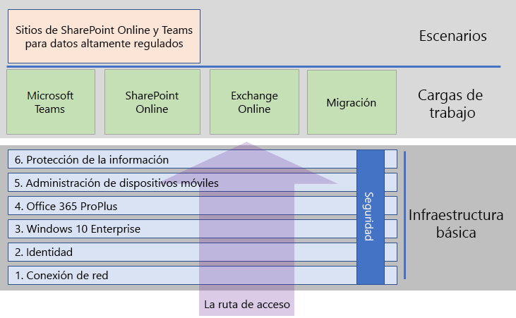

# Implementar Microsoft 365 EnterpriseDeploy Microsoft 365 Enterprise

Microsoft 365 Enterprise es una combinación de Office 365, Enterprise Mobility + Security (EMS) y Windows 10 Enterprise que:Microsoft 365 Enterprise is a combination of Office 365, Enterprise Mobility + Security (EMS), and Windows 10 Enterprise that: 

- Tiene seguridad inteligente.Has intelligent security.
- Está integrada para ofrecer simplicidad.Is integrated for simplicity.
- Impulsa la creatividad.Unlocks creativity.
- Se diseñó para el trabajo en equipo.Is built for teamwork.

Estas ventajas no solo se alcanzan al obtener las licencias para estos tres productos, sino al implementar los productos y sus características de una forma específica. En este conjunto de documentos, se indican los pasos de implementación y las opciones de configuración correctas y obligatorias de estos productos y sus características.These benefits are not realized just by obtaining the licenses for these three products, but by deploying them and their features in a specific way. This documentation set guides you through that deployment and the correct and required configuration of these products and their features.

Estas son las dos fases principales para implementar Microsoft 365 Enterprise:There are two main phases to deploying Microsoft 365 Enterprise:

1. Primero, implemente la [infraestructura básica](deploy-foundation-infrastructure.md) necesaria para la seguridad integrada y la integración de la administración simplificada, lo que permite garantizar con mayor facilidad que el software cliente esté actualizado con las mejoras de productividad y seguridad más recientes.First, deploy the required [foundation infrastructure](deploy-foundation-infrastructure.md) for built-in security and integration for simplified management, which makes it easier to ensure your client software is updated with the latest productivity and security enhancements.
2. Después, implemente un conjunto de [cargas de trabajo y escenarios](deploy-workloads.md) opcionales sobre la infraestructura básica, con el fin de impulsar la creatividad y el trabajo en equipo en su organización.Next, deploy a set of optional [workloads and scenarios](deploy-workloads.md) on top of the foundation infrastructure, to unlock creativity and teamwork in your organization.

En la ilustración siguiente, se muestra la relación entre la infraestructura básica y las cargas de trabajo y escenarios, y los pasos intermedios por el contenido.The following figure shows the relationship between the foundation infrastructure and the workloads and scenarios and your path through the content.

La seguridad está integrada en todas las fases de la infraestructura básica.Security is built into all phases of the foundation infrastructure.

## FastTrackFastTrack

FastTrack es una ventaja continuada y repetible (disponible como parte de su suscripción) ofrecida por ingenieros de Microsoft para ayudarle a migrar a la nube a su propio ritmo. FastTrack también le ofrece acceso a partners cualificados para servicios adicionales, si es necesario. Con más de 40 000 clientes habilitados hasta la fecha, FastTrack permite maximizar la rentabilidad de la inversión, agilizar la implementación y mejorar la adopción en su organización. Vea [FastTrack para Microsoft 365](https://fasttrack.microsoft.com/microsoft365).FastTrack is an ongoing and repeatable benefit—available as part of your subscription—that is delivered by Microsoft engineers to help you move to the cloud at your own pace. FastTrack also gives you access to qualified partners for additional services, as needed. With over 40,000 customers enabled to date, FastTrack helps maximize ROI, accelerate deployment, and increase adoption across your organization. See [FastTrack for Microsoft 365](https://fasttrack.microsoft.com/microsoft365).

Si quiere aprovechar FastTrack para implementar Microsoft 365 Enterprise, puede usar el [Asesor de implementación de Microsoft 365](https://aka.ms/microsoft365setupguide) de FastTrack para obtener instrucciones sobre cómo implementar y configurar la infraestructura básica. Debe haber iniciado sesión como administrador global en un espacio empresarial de Office 365 o Microsoft 365 para disponer de acceso a esta página.If you want to take advantage of FastTrack to deploy Microsoft 365 Enterprise, you can use the FastTrack [Microsoft 365 deployment advisor](https://aka.ms/microsoft365setupguide) for guidance on how to deploy and set up your foundation infrastructure. You must be signed on as a global administrator in an Office 365 or Microsoft 365 tenant in order to access this page.

## Utilice una versión limitada de pruebaTake a test drive

Juegue con Microsoft 365 Enterprise antes de la implementación de producción o la implementación de opciones específicas con guías de laboratorio de pruebas (TLG). Las TLGs son artículos modulares y prescriptivos que le guiarán a través de la configuración de la infraestructura o de una característica en un entorno simplificado pero representativo con suscripciones de prueba o de pago.Play with Microsoft 365 Enterprise prior to production deployment or the deployment of specific options with Test Lab Guides (TLGs). TLGs are modular, prescriptive articles that step you through the configuration of infrastructure or a feature in a simplified but representative environment using trial or paid subscriptions. 

Con las TLG, puede demostrar, personalizar o crear una prueba de concepto de una configuración compleja, carga de trabajo o situación de descentralización.With TLGs, you can demonstrate, customize, or build a proof of concept of a complex configuration, workload, or end-to-end scenario.

Para más información, vea [Guías de laboratorio de pruebas de Microsoft 365 Enterprise](m365-enterprise-test-lab-guides.md).For more information, see [Microsoft 365 Enterprise Test Lab Guides](m365-enterprise-test-lab-guides.md).

## Cómo los clientes usan Microsoft 365 EnterpriseHow customers use Microsoft 365 Enterprise

Consulte estos recursos para obtener información sobre cómo los clientes usan Microsoft 365 Enterprise como su solución completa e inteligente que permite a todos los usuarios ser creativos y colaborar de forma segura:See these resources to learn how customers are using Microsoft 365 Enterprise as their complete, intelligent solution that empowers everyone to be creative and work together securely:

- Servicios de saludHealth services
  - [Lilly envisions a workplace where internal and external collaboration help enable innovation and accelerate time-to-market for new medicines (Lilly visualiza un lugar de trabajo donde la colaboración interna y externa ayudan a innovar y acelerar procesos para poner a la venta nuevas medicinas)Lilly envisions a workplace where internal and external collaboration help enable innovation and accelerate time-to-market for new medicines](https://aka.ms/Eli_CLS)
  - [Healthcare technology innovator accelerates diabetes prevention in the cloud (Compañía sanitaria de innovación de tecnología acelera la prevención diabetes en la nube)Healthcare technology innovator accelerates diabetes prevention in the cloud ](https://aka.ms/Soleracasestudy)
  - [Adventist Health System is enhancing healthcare delivery using Microsoft 365 (Adventist Health System mejora la oferta de servicios sanitarios mediante Microsoft 365)Adventist Health System is enhancing healthcare delivery using Microsoft 365](https://aka.ms/adventisthealth)
  - [Abrona accelerates GDPR compliance and increases productivity with Microsoft 365 (Abrona acelera el cumplimiento del RGPD y aumenta la productividad con Microsoft 365)Abrona accelerates GDPR compliance and increases productivity with Microsoft 365](https://aka.ms/Abrona)
  - [Centra embraces transformation, improves patient care with Microsoft 365 intelligent business tools (Centra adopta la transformación y mejora la atención al paciente con herramientas empresariales inteligentes de Microsoft 365)Centra embraces transformation, improves patient care with Microsoft 365 intelligent business tools](https://aka.ms/Centra_Health)
  - [Advocate Aurora Health helps patients live well using Microsoft care coordination solution to enhance collaboration (Aurora Health ayuda a que los pacientes vivan mejor con la solución de coordinación de cuidados de Microsoft para mejorar la colaboración)Advocate Aurora Health helps patients live well using Microsoft care coordination solution to enhance collaboration](https://aka.ms/Advocate_)
- Servicios financierosFinancial services
  - [TD Bank empowers employees with assistive technology in Office 365 and Windows 10 (TD Bank ofrece a sus empleados tecnología de asistencia de Office 365 y Windows 10)TD Bank empowers employees with assistive technology in Office 365 and Windows 10](https://aka.ms/tdbankgroup)
  - [Family tax preparation startup chooses all-in-one solution to help grow business (Startup de preparación de fiscalidad familiar elige una solución todo en uno para ayudar a hacer crecer el negocio)Family tax preparation startup chooses all-in-one solution to help grow business](https://aka.ms/SOSCaseStudy)
- TransporteTransportation
  - [Qantas empowers employees to do their best work with Microsoft 365, enhancing customer experience (Qantas proporciona a sus empleados las herramientas para hacer su trabajo lo mejor posible con Microsoft 365, lo que mejora la experiencia de los clientes)Qantas empowers employees to do their best work with Microsoft 365, enhancing customer experience](https://aka.ms/Qantas_CS)
  - [Amtrak keeps its mobile enterprise running ahead of schedule with Microsoft 365 (Amtrak mantiene su empresa móvil adelantada a la programación con Microsoft 365)Amtrak keeps its mobile enterprise running ahead of schedule with Microsoft 365](https://aka.ms/Amtrak_)
- IndustriaManufacturing
  - [Steel company eliminates hardware costs, streamlines IT, and gains mobile productivity in the cloud (Empresa acerera elimina los costos de hardware, optimiza las TI y mejora la productividad móvil en la nube)Steel company eliminates hardware costs, streamlines IT, and gains mobile productivity in the cloud](https://aka.ms/Steeledalecasestudy)
  - [Embroidery equipment supplier empowers its business with cloud-based services, spreads word to other small businesses (Proveedor de equipamiento bordados fortalece su negocio con servicios basados en la nube, divulga la palabra otras empresas pequeñas)Embroidery equipment supplier empowers its business with cloud-based services, spreads word to other small businesses](https://aka.ms/PriorityLLCCaseStudy)
  - [Father and son business shows the world what employees with disabilities can achieve (Empresa familiar muestra al mundo qué pueden conseguir los empleados con discapacidades)Father and son business shows the world what employees with disabilities can achieve](https://aka.ms/JCSCaseStudy)
  - [Coconut company gains improved mobility, better metrics, and increased productivity by modernizing collaboration tools (Empresa de cocos gana en movilidad, mejores métricas y productividad mejorada gracias a herramientas de colaboración modernas)Coconut company gains improved mobility, better metrics, and increased productivity by modernizing collaboration tools](https://aka.ms/SilvermillCS)
  - [Thriving Japanese innovator finds future-proof flexibility and enhanced security with Microsoft 365 Business (Gran innovador japonés descubre una flexibilidad a prueba de tiempo y seguridad mejorada con Microsoft 365 Empresa)Thriving Japanese innovator finds future-proof flexibility and enhanced security with Microsoft 365 Business](https://aka.ms/DreamFactoryCaseStudy)
- IngenieríaEngineering
   - [La cadencia incrementa el ritmo del negocio con herramientas de colaboración móvilesCadence increases the pace of business with mobile collaboration tools](https://customers.microsoft.com/story/cadence-partner-professional-services-microsoft-365)
- Servicios profesionalesProfessional services
  - [Boutique business and real estate law firm supports expansion with comprehensive cloud-based platform (Bufete especializado en el mercado inmobiliario y el negocio de la moda impulsa la expansión con una plataforma basada en nube completa)Boutique business and real estate law firm supports expansion with comprehensive cloud-based platform ](https://aka.ms/Lieserskaffcasestudy)
  - [Sports technology company helps athletes reach their peak through biofeedback and analytics (Empresa de tecnología deportiva ayuda a los atletas llegar a su máximo mediante bioinformación y análisis)Sports technology company helps athletes reach their peak through biofeedback and analytics ](https://aka.ms/KMOTIONCasestudy)
  - [Digital transformation and the cloud empower business association to serve its members better (La transformación digital en la nube ayuda a una asociación empresarial a atender mejor a sus miembros)Digital transformation and the cloud empower business association to serve its members better ](https://aka.ms/AIMCS)
- Servicios de energíaEnergy services
  - [Schlumberger refines global teamwork with Microsoft 365 (Schlumberger refina el trabajo en equipo global con Microsoft 365)Schlumberger refines global teamwork with Microsoft 365](https://aka.ms/Schlumberger_)
- ConstrucciónConstruction
  - [Search for data security solution unearths collaborative capabilities of Microsoft 365 at general contracting company (La búsqueda de una solución de seguridad de datos descubre las capacidades de colaboración de Microsoft 365 de una empresa contratista)Search for data security solution unearths collaborative capabilities of Microsoft 365 at general contracting company](https://aka.ms/Transbluecasestudy)
- ConsultoríaConsulting
  - [ERM contributes to a more sustainable future with Microsoft 365 (ERM contribuye a un futuro más sostenible con Microsoft 365)ERM contributes to a more sustainable future with Microsoft 365](https://aka.ms/ERM_CS)
- ONGNon-profit
  - [Move to the cloud saves nonprofit $500,000 while improving security, mobility, and collaboration (El paso a la nube ahorra a una ONG 500 000 $ y mejora la seguridad, la movilidad y la colaboración)Move to the cloud saves nonprofit $500,000 while improving security, mobility, and collaboration ](https://aka.ms/MOWCaseStudy)
  
## Cómo Microsoft utiliza Microsoft 365 EnterpriseHow Microsoft uses Microsoft 365 Enterprise

Eche un vistazo dentro de Microsoft IT y aprenda cómo implementaron Microsoft 365 Enterprise y cómo los empleados de Microsoft usan a diario.Take a peek inside Microsoft IT and learn how they deployed Microsoft 365 Enterprise and how Microsoft employees use it every day.

### Conexión de redNetworking

- [Optimizing network performance for Microsoft Office 365 (Optimizar el rendimiento de red de Microsoft Office 365)Optimizing network performance for Microsoft Office 365](https://www.microsoft.com/itshowcase/Article/Content/631/Optimizing-network-performance-for-Microsoft-Office-365)

### IdentidadIdentity

- [Managing user identities and secure access at Microsoft (Administración de identidades de usuario y el acceso seguro de Microsoft)Managing user identities and secure access at Microsoft](https://www.microsoft.com/itshowcase/Article/Content/931/Managing-user-identities-and-secure-access-at-Microsoft)
- [Using Azure AD Privileged Identity Management for elevated access (Uso de Azure AD Privileged Identity Management para un acceso elevado)Using Azure AD Privileged Identity Management for elevated access](https://www.microsoft.com/itshowcase/Article/Content/887/Using-Azure-AD-Privileged-Identity-Management-for-elevated-access)

### Windows 10 EnterpriseWindows 10 Enterprise

- [Preparing your organization for a seamless Windows 10 deployment (Preparar la organización para una implementación perfecta de Windows 10)Preparing your organization for a seamless Windows 10 deployment](https://www.microsoft.com/itshowcase/windows10deployment?wt.mc_id=bmkg_itsc)
- [Adopting Windows as a service at Microsoft (Adoptar Windows como servicio en Microsoft)Adopting Windows as a service at Microsoft](https://www.microsoft.com/itshowcase/Article/Content/851/Adopting-Windows-as-a-service-at-Microsoft)
- [Deploying Windows 10 at Microsoft as an in-place upgrade (Implementar Windows 10 en Microsoft como una actualización local)Deploying Windows 10 at Microsoft as an in-place upgrade](https://www.microsoft.com/itshowcase/Article/Content/668/Deploying-Windows-10-at-Microsoft-as-an-inplace-upgrade)
- [Implementing strong user authentication with Windows Hello for Business (Implementar la autenticación de usuario segura con Windows Hello para empresas)Implementing strong user authentication with Windows Hello for Business](https://www.microsoft.com/itshowcase/Article/Content/756/Implementing-strong-user-authentication-with-Windows-Hello-for-Business)
- [Windows 10 deployment: tips and tricks from Microsoft IT (Implementación de Windows 10: sugerencias y trucos de TI de Microsoft)](https://www.microsoft.com/itshowcase/Article/Content/951/Windows-10-deployment-tips-and-tricks-from-Microsoft-IT) (vídeo)[Windows 10 deployment: tips and tricks from Microsoft IT](https://www.microsoft.com/itshowcase/Article/Content/951/Windows-10-deployment-tips-and-tricks-from-Microsoft-IT) (video)
- [Windows Defender ATP helps detect sophisticated threats (Windows Defender ATP le ayuda a detectar sofisticadas amenazas)Windows Defender ATP helps detect sophisticated threats](https://www.microsoft.com/itshowcase/Article/Content/854/Windows-Defender-ATP-helps-detect-sophisticated-threats)
- [Securing the modern enterprise with Windows Defender and Windows Defender ATP (Asegurando la empresa moderna con Windows Defender y ATP de Windows Defender)](https://www.microsoft.com/itshowcase/Article/Content/903/Securing-the-modern-enterprise-with-Windows-Defender-and-Windows-Defender-ATP) (vídeo)[Securing the modern enterprise with Windows Defender and Windows Defender ATP](https://www.microsoft.com/itshowcase/Article/Content/903/Securing-the-modern-enterprise-with-Windows-Defender-and-Windows-Defender-ATP) (video)

### Office 365 ProPlusOffice 365 ProPlus

- [Preparing your organization for a seamless Office 365 ProPlus 2016 deployment (Preparar la organización para una implementación perfecta de Office 365 ProPlus 2016)Preparing your organization for a seamless Office 365 ProPlus 2016 deployment](https://www.microsoft.com/itshowcase/Office365adoption)
- [Implementar y actualizar Microsoft Office 365 ProPlusDeploying and updating Microsoft Office 365 ProPlus](https://www.microsoft.com/itshowcase/Article/Content/757/Deploying-and-updating-Microsoft-Office-365-ProPlus)
- [Automation and update channels help deploy Microsoft Office 365 ProPlus (Los canales de automatización y actualización ayudan a implementar Microsoft Office 365 ProPlus)](https://www.microsoft.com/itshowcase/Article/Content/794/Automation-and-update-channels-help-deploy-Microsoft-Office-365-ProPlus) (vídeo)[Automation and update channels help deploy Microsoft Office 365 ProPlus](https://www.microsoft.com/itshowcase/Article/Content/794/Automation-and-update-channels-help-deploy-Microsoft-Office-365-ProPlus) (video)

### Movilidad y administración de dispositivosMobility and device management

- [Managing modern mobile productivity with Enterprise Mobility + Security (Administración de la productividad móvil moderna con Enterprise Mobility + Security)Managing modern mobile productivity with Enterprise Mobility + Security](https://www.microsoft.com/itshowcase/Article/Content/972/Managing-modern-mobile-productivity-with-Enterprise-Mobility--Security)
- [Connecting to work on your Windows 10 device with Microsoft Intune (Conexión al trabajo con un dispositivo Windows 10 con Microsoft Intune)Connecting to work on your Windows 10 device with Microsoft Intune](https://www.microsoft.com/itshowcase/Article/Content/783/Connecting-to-work-on-your-Windows-10-device-with-Microsoft-Intune)
- [Enabling mobile productivity for iOS, OS X, and Android devices at Microsoft (Permitir la productividad móvil para dispositivos iOS, OS X y Android en Microsoft)Enabling mobile productivity for iOS, OS X, and Android devices at Microsoft](https://www.microsoft.com/itshowcase/Article/Content/773/Enabling-mobile-productivity-for-iOS-OS-X-and-Android-devices-at-Microsoft)

### Seguridad y protección de la informaciónSecurity and information protection

- [Protecting files in the cloud with Azure Information Protection](https://www.microsoft.com/itshowcase/Article/Content/924/Protecting-files-in-the-cloud-with-Azure-Information-Protection) (Proteger los archivos en la nube con Azure Information Protection)[Protecting files in the cloud with Azure Information Protection](https://www.microsoft.com/itshowcase/Article/Content/924/Protecting-files-in-the-cloud-with-Azure-Information-Protection)
- [Microsoft uses threat intelligence to protect, detect, and respond to threats](https://www.microsoft.com/itshowcase/Article/Content/934/Microsoft-uses-threat-intelligence-to-protect-detect-and-respond-to-threats) (Microsoft usa inteligencia de amenazas para proteger, detectar y responder a las amenazas)[Microsoft uses threat intelligence to protect, detect, and respond to threats](https://www.microsoft.com/itshowcase/Article/Content/934/Microsoft-uses-threat-intelligence-to-protect-detect-and-respond-to-threats)
- [Microsoft thwarts phishing attempts with Office 365](https://www.microsoft.com/itshowcase/Article/Content/956/Microsoft-thwarts-phishing-attempts-with-Office-365) (Microsoft frustra intentos de suplantación de identidad (phishing) con Office 365)[Microsoft thwarts phishing attempts with Office 365](https://www.microsoft.com/itshowcase/Article/Content/956/Microsoft-thwarts-phishing-attempts-with-Office-365)

### Microsoft TeamsMicrosoft Teams

- [Deploying Microsoft Teams streamlines collaboration and improves teamwork](https://www.microsoft.com/itshowcase/Article/Content/1013/Deploying-Microsoft-Teams-streamlines-collaboration-and-improves-teamwork) (Implementar Microsoft Teams agiliza la colaboración y mejora el trabajo en equipo)[Deploying Microsoft Teams streamlines collaboration and improves teamwork](https://www.microsoft.com/itshowcase/Article/Content/1013/Deploying-Microsoft-Teams-streamlines-collaboration-and-improves-teamwork)
- [Microsoft Teams increases collaboration in the modern workplace at Microsoft](https://www.microsoft.com/itshowcase/Article/Content/1012/Microsoft-Teams-increases-collaboration-in-the-modern-workplace-at-Microsoft) (Microsoft Teams Mejora la colaboración en el área de trabajo moderna de Microsoft)[Microsoft Teams increases collaboration in the modern workplace at Microsoft](https://www.microsoft.com/itshowcase/Article/Content/1012/Microsoft-Teams-increases-collaboration-in-the-modern-workplace-at-Microsoft)

### Migración de datosData migration

- [Microsoft migra 150 000 buzones a Exchange OnlineMicrosoft migrates 150,000 mailboxes to Exchange Online](https://www.microsoft.com/itshowcase/Article/Content/577/Microsoft-migrates-150000-mailboxes-to-Exchange-Online)
- [SharePoint en la nube: Obtenga información sobre cómo Microsoft llevó a cabo su propia migraciónSharePoint to the cloud: Learn how Microsoft ran its own migration](https://www.microsoft.com/itshowcase/Article/Content/691/SharePoint-to-the-cloud-Learn-how-Microsoft-ran-its-own-migration)

## Cómo Contoso Corporation implementó Microsoft 365 EnterpriseHow the Contoso Corporation deployed Microsoft 365 Enterprise

Contoso Corporation es una organización conglomerada global ficticia, aunque representativa, de fabricación con sede en París. Vea como [Contoso ha implementado Microsoft 365 Enterprise](contoso-case-study.md) y ha adoptado importantes decisiones sobre el diseño y los detalles de implementación de redes, identidades, Windows 10 Enterprise, Office 365 ProPlus, administración de dispositivos móviles, protección de la información y seguridad.The Contoso Corporation is a fictional but representative global manufacturing conglomerate with its headquarters in Paris. See how [Contoso deployed Microsoft 365 Enterprise](contoso-case-study.md) and addressed major design decisions and implementation details for networking, identity, Windows 10 Enterprise, Office 365 ProPlus, mobile device management, information protection, and security. 

## Soluciones adicionales de Microsoft 365Additional Microsoft 365 solutions

- [Microsoft 365 EmpresaMicrosoft 365 Business](https://docs.microsoft.com/microsoft-365/business/)
 
  Obtenga información sobre cómo combinar las mejores funciones de productividad y colaboración de Office 365 con soluciones de seguridad y administración de dispositivos para proteger los datos empresariales para pequeñas y medianas empresas (pymes).Bring together the best-in-class productivity and collaboration capabilities of Office 365 with device management and security solutions to safeguard business data for small and midsize businesses (SMB).

- [Microsoft 365 EducaciónMicrosoft 365 Education](https://docs.microsoft.com/education)
 
  Permite a los formadores impulsar la creatividad, fomentar el trabajo en equipo y proporcionar una experiencia segura y sencilla en una única solución asequible diseñada para el ámbito educativo.Empower educators to unlock creativity, promote teamwork, and provide a simple and safe experience in a single, affordable solution built for education.

## Paso siguienteNext step

Use [FastTrack](https://fasttrack.microsoft.com/microsoft365) o empiece con la [infraestructura básica](deploy-foundation-infrastructure.md).Use [FastTrack](https://fasttrack.microsoft.com/microsoft365) or get started with the [foundation infrastructure](deploy-foundation-infrastructure.md).
