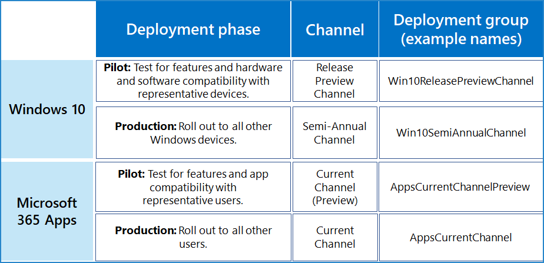

# Ejemplo de una amplia implementación para las versiones más recientes

Este ejemplo de configuración de canal es para una organización que usa la implementación rápida de las versiones más recientes para satisfacer estas prioridades empresariales:

- Asegure la continuidad empresarial con las aplicaciones y los servicios de Microsoft.
- Maximice el dispositivo, el servicio y la seguridad de los datos con las últimas características y correcciones de Microsoft.
- Maximice la productividad de los usuarios con las características más recientes de Microsoft.

Estos objetivos representan la tarea de TI para encontrar el equilibrio entre la implementación rápida de producción y temprano vetting con un subconjunto de usuarios y dispositivos representativos para validarse funcionalmente antes de la implementación general.

Nuestra organización de ejemplo tiene 5 000 empleados en edificios en todo el mundo en Europa, África, Asia y América. el 70% de los empleados usa Microsoft 365 E3 y el resto de la organización usa Microsoft 365 E5.

>[!Note]
>Este ejemplo está diseñado para mostrarle cómo puede usar las fases de implementación y los grupos, que pueden funcionar para organizaciones de muchos tipos y tamaños.
>

Infraestructura de TI de la organización: 

- Es mucho más homogéneo, con Windows, las Aplicaciones de Microsoft 365 y los servicios en la nube de Microsoft que incluyen 60% de la base instalada. Pocos sistemas antiguos se conservan después de un esfuerzo intensivo de varios años para simplificar y agilizar la infraestructura de TI.
- Es mantenida por el personal altamente experimentado y puesto en servicio, manteniendo la productividad de los usuarios y sus dispositivos al seguir el liderazgo de Microsoft en sus versiones.

## Fases de implementación y actualización

En función de las metas de implementación rápida de la última versión, en esta organización de ejemplo se usa un proceso de implementación en dos pasos.

1. **Use una vista previa o una implementación piloto:** valide y realice iteraciones con los pioneros, el personal de TI, los usuarios con configuraciones representativas y el personal de aprendizaje. 

   Las primeras preparaciones, el personal de TI, los usuarios con configuraciones representativas pueden validar la funcionalidad con otras aplicaciones y en dispositivos antes de que las nuevas características se distribuyan al resto de la organización.

   Los administradores de cambios tienen un primer vistazo a las nuevas características antes de la implementación generalizada y pueden planear la mensajería y la implementación.

   El personal de aprendizaje puede planear nuevos cursos internos o actualizar cursos existentes para las nuevas características antes de la implementación generalizada.

2. **Implementación de producción:** implementar para todos los demás usuarios por región, departamento u otro método de implementación.

## Configuración de implementación para Windows 10

El objetivo general es llevar a cabo una implementación amplia de la versión más reciente de canal semianual después de la validación de los cambios en el canal de vista previa de la versión de un grupo de usuarios representativos y sus dispositivos.

Para más información sobre los métodos de implementación y estrategias de Windows 10, vea [Implementación de Windows 10](https://docs.microsoft.com/windows/deployment/).

| Etapa | Canal | Grupo de implementación |
|:-------|:-------|:-----|
| Prueba piloto |  **Lanzamiento de la versión preliminar del canal de vista previa**  <ul><li>Propósito: implementación de las actualizaciones de características para el personal de TI y de las primeras aplicaciones en la validación de los dispositivos y configuraciones (idiomas, aplicaciones de terceros). </li><li> Estado: totalmente compatibles y admitidas para clientes comerciales, y no cuenta con contratos de soporte técnico. </li></ul> | **Win10ReleasePreviewChannel** (nombre de ejemplo)    Los miembros son grupos que contienen: <ul><li> Entusiastas de Windows en distintos departamentos y ubicaciones </li><li> Personal con configuraciones que necesitan validación </li><li> Administradores de TI y personal de implementación de TI </li><li> Administradores de cambios </li><li> Personal de aprendizaje interno </li></ul> |
| Producción |  **Canal semianual**  <ul><li>Propósito: ampliar implementación de las actualizaciones de características más recientes al resto de la organización. </li><li> Estado: totalmente compatible y admitido. </li></ul> | **Win10SemiAnnualChannel** (nombre de ejemplo)    Los miembros son todos los usuarios que no están en el grupo Win10ReleasePreviewChannel. |
||||

Esta organización usa el procedimiento recomendado para implementar la carga del lanzamiento de la versión preliminar del canal de vista previa de la misma manera en que implementan las versiones de canal semianual, como Windows Update o Windows Server Update Services, y aplican las mismas directivas para las actualizaciones de canal.

Proceso de actualización continuada:

1. Los cambios de la versión preliminar del canal se implementan en el grupo de implementación Win10ReleasePreviewChannel (nombre de ejemplo).
2. Los miembros del grupo Win10ReleasePreviewChannel confirman que los cambios del lanzamiento de la versión preliminar del canal de vista previa están funcionando en el personal de implementación de TI, que puede enviar comentarios a Microsoft y esperar al siguiente lanzamiento de la versión preliminar del canal para realizar una validación adicional.
3. Los cambios de características de canal semianual se implementan en el grupo de implementación Win10SemiAnnualChannel. 

>[!Note]
>Aunque el canal semianual es el canal recomendado, su departamento de TI debe usar sus herramientas de administración y determinar cuándo implementar la versión más reciente de canal semianual en su organización y, a continuación, implementarla en ondas.
>

## Configuración de implementación para Aplicaciones de Microsoft 365

El objetivo general es llevar a cabo una implementación amplia de la última versión del canal actual después de la validación de los cambios del canal actual (vista previa) por parte de un grupo de usuarios representativos.

Para más información sobre las estrategias y los métodos de implementación de Aplicaciones 365 de Microsoft, vea [Implementación de Aplicaciones de Microsoft 365](https://docs.microsoft.com/deployoffice/plan-office-365-proplus).

| Etapa | Canal | Grupo de implementación |
|:-------|:-------|:-----|
| Prueba piloto |  **Canal actual (vista previa)** <ul><li> Propósito: {dar a un grupo de usuarios representativos las nuevas características de Aplicaciones de Microsoft 365} la implementación de las actualizaciones de características tan pronto como se prueben con los usuarios del canal actual (vista previa) y estén preparados para la producción. </li><li> Estado: totalmente compatible y admitido.</li><li> Con qué frecuencia: Actualizaciones de 2 a 3 veces al mes. </li></ul> | **AppsCurrentChannelPreview** (nombre de ejemplo)    Los miembros son grupos que contienen: <ul><li> Entusiastas de las aplicaciones de Office en distintos departamentos y ubicaciones </li><li> Personal con configuraciones que necesitan validación </li><li> Administradores de TI y personal de implementación de TI </li><li> Administradores de cambios </li><li> Personal de aprendizaje interno </li></ul>|
| Producción | **Canal actual** <ul><li> Propósito: ampliar implementación de las actualizaciones de características más recientes al resto de la organización. </li><li> Estado: totalmente compatible y admitido. </li></ul> |  **AppsCurrentChannel** (nombre de ejemplo)    Los miembros son todos los usuarios que no están en el grupo AppsCurrentChannelPreview. |
|||

Proceso de actualización continuada:

1. Los cambios en canal actual (vista previa) se implementan en el grupo de implementación AppsCurrentChannelPreview.
2. Los miembros del grupo AppsCurrentChannelPreview confirman que los cambios en el canal actual (vista previa) están funcionando en el personal de implementación TI, que puede proporcionar comentarios a Microsoft y esperar a la siguiente versión del canal actual (vista previa) para realizar una validación adicional.
3. Los cambios del canal actual se implementan en el grupo de implementación AppsCurrentChannel. 

## Resumen visual

Estos son los productos, sus canales y los grupos de implementación utilizados por esta organización de ejemplo. 

## Vea también

[Configuraciones de ejemplo de canal de implementación y actualización](deploy-update-channels-examples.md)

[Información general de Microsoft 365 Enterprise](microsoft-365-overview.md)

[Guías del laboratorio de pruebas](m365-enterprise-test-lab-guides.md)
