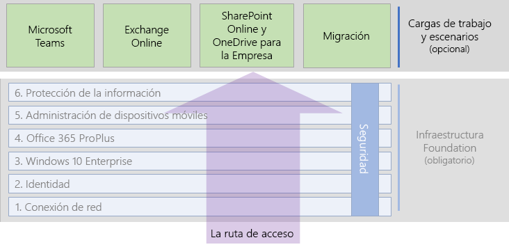

# Cargas de trabajo y escenarios de Microsoft 365 Enterprise

Para lograr las ventajas de creatividad y trabajo en equipo de Microsoft 365 Enterprise, implemente estas cargas sobre su infraestructura básica:

- [Microsoft Teams](teams-workload.md)
- [Exchange Online](exchangeonline-workload.md)
- [SharePoint Online](sharepoint-online-onedrive-workload.md)

Consulte la carga de trabajo [migración](migration-microsoft-365-enterprise-workload.md) para obtener un plan general a fin de migrar toda su organización a Microsoft 365 Enterprise, que incluye los productos de cliente de Microsoft Office, productos locales de Office Server y dispositivos basados en Microsoft Windows.

Los escenarios usan características y servicios de Microsoft 365 Enterprise de una forma integrada para responder a las necesidades empresariales. 

Una de estas necesidades es asegurarse de que los empleados puedan trabajar de forma productiva y segura cuando no estén conectados directamente a la intranet. Consulte el [escenario Capacitar a los trabajadores remotos](empower-people-to-work-remotely.md) para obtener una hoja de ruta que le permita desplegar los elementos de infraestructura e impulsar la adopción de usuarios remotos para cargas de trabajo de gran importancia, como por ejemplo, Teams y Exchange Online.

Otra necesidad de este tipo de información es la protección de los datos altamente regulados almacenados en Microsoft 365. Entre los datos altamente regulados, se incluyen estos recursos digitales:

- Datos sujetos a regulaciones regionales.
- Los datos más importantes para su organización, como pueden ser secretos comerciales, información de recursos humanos o financiera y estrategias de la organización.

Para proteger los datos ante amenazas internas y externas, consulte [Sitios de Microsoft Teams y SharePoint Online para datos altamente regulados](teams-sharepoint-online-sites-highly-regulated-data.md). Este escenario le guiará en la configuración de un sitio de SharePoint Online o un equipo de Microsoft Teams para almacenar de forma segura sus datos más importantes.

En la ilustración siguiente se muestran las cargas de trabajo y escenarios de la guía de implementación general de Microsoft 365 Enterprise.

Vea la[Biblioteca de productividad de Microsoft 365](https://www.microsoft.com/microsoft-365/success/)para escenarios adicionales. 

1. Desde esta página web, escriba una cadena de búsqueda o haga clic en**filtrar por**y especifique sector, roles (departamentos) y productos de Microsoft 365.
2. En los resultados, haga clic en una tarjeta para ver los pasos que pueden ayudarle a empezar.

## Requisitos previos de infraestructura básica

*Idealmente*, debe implementar las cargas de trabajo después de completar la configuración de las fases de la [infraestructura básica](deploy-foundation-infrastructure.md). Esto garantiza que todas las capas subyacentes estén correctamente implementadas para proporcionar integración, seguridad y la mejor experiencia a sus usuarios y sus dispositivos.

| Fase | Resultado |
|:-------|:-----|
| Red | Su red se actualiza para obtener un rendimiento óptimo para los servicios en la nube de Microsoft 365. |
| Identidad | La identidad se sincroniza y se protege mediante autenticación segura para cuentas de usuario y protección para cuentas de administrador. |
| Windows 10 Enterprise | Los equipos que ejecuten Windows 7 o Windows 8.1 se pueden actualizar a Windows 10 Enterprise, e instalar los nuevos dispositivos con Windows 10 Enterprise. |
| Office 365 ProPlus | Los usuarios existentes de Microsoft Office pueden actualizar a Office 365 ProPlus. |
| Administración de dispositivos móviles | Se pueden inscribir y administrar los dispositivos. |
| Protección de la información | Se habilitan las características de seguridad de Office 365 y su confidencialidad o etiquetas de Azure Information Protection están listas para proteger documentos. |

Recuerde que esta es una situación ideal y la planificación, configuración, prueba y pilotaje puede llevar cierto tiempo, en especial en organizaciones de gran tamaño con infraestructuras ya existentes y ubicaciones múltiples. No es necesario completar todas estas fases en todas las ubicaciones para permitirle obtener el valor empresarial de Microsoft 365 Enterprise con mayor rapidez. 

Estas son algunas cargas de trabajo comunes para implementar inmediatamente: 

- Después de que la fase de **identidad** de la infraestructura básica esté implementada en los usuarios, muchas organizaciones implementan:
  - [Office 365 ProPlus](office365proplus-infrastructure.md) combinado con [OneDrive para la Empresa](https://docs.microsoft.com/onedrive/plan-onedrive-enterprise). Office 365 ProPlus ofrece la seguridad de la autenticación moderna y la última experiencia del usuario del cliente de Microsoft Office. La migración de archivos personales del usuario a OneDrive para la Empresa reduce la infraestructura y la necesidad de prestar soporte a carpetas y unidades.
  - [Exchange Online](exchangeonline-workload.md) para que los usuarios puedan empezar a usar el correo electrónico en la nube.
- Si no tiene necesidad inmediata de almacenar en la nube activos digitales altamente regulados, implemente [Microsoft Teams](teams-workload.md) y [SharePoint Online](sharepoint-online-onedrive-workload.md) para los usuarios antes que la fase de **protección de la información**.

Debe decidir la forma más adecuada de ordenar e implementar la configuración de las fases de requisitos previos de la infraestructura básica a fin de satisfacer de la mejor manera sus necesidades empresariales.

### Procedimiento recomendado

Se recomienda implementar fase de **identidad** de la infraestructura básica antes de incorporar los usuarios a las cargas de trabajo o escenarios.

La fase de **identidad** garantiza que su identidad basada en la nube, tanto si se realiza únicamente en la nube o se sincroniza con su Active Directory Domain Services (AD DS) local, contiene las cuentas y grupos de usuario y equipo para gestionar la autenticación y el acceso. La autenticación segura es requerida para todos los usuarios con cuentas de protección segura de administrador antes de ubicar los recursos digitales de la organización en la nube de Microsoft 365.

Si bien la base es muy importante para el rendimiento general, la implementación de la fase de **red** puede estar en marcha mientras se incorporan usuarios a las cargas de trabajo, entendiendo que la aplicación Microsoft 365 y el rendimiento del servicio mejorarán con el tiempo. Esto es especialmente aplicable a organizaciones empresariales con múltiples ubicaciones y una combinación de conexiones locales y a Internet.

