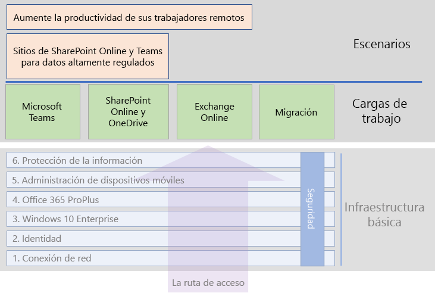

# Microsoft 365 para empresas, cargas de trabajo y escenariosMicrosoft 365 for enterprise workloads and scenarios

Implemente estas cargas de trabajo en su infraestructura de base para obtener los beneficios de la creatividad y el trabajo en equipo de Microsoft 365 para empresas:To get the creativity and teamwork benefits of Microsoft 365 for enterprise, deploy these workloads over your foundation infrastructure:

- [Microsoft TeamsMicrosoft Teams](teams-workload.md)
- [Exchange OnlineExchange Online](exchangeonline-workload.md)
- [SharePoint y OneDriveSharePoint and OneDrive](sharepoint-online-onedrive-workload.md)

Vea el artículo sobre la [migración](migration-microsoft-365-enterprise-workload.md) para obtener un plan de desarrollo que le permita migrar toda la organización a Microsoft 365 para empresas, que incluye los productos del cliente de Microsoft Office, productos locales de Office Server y dispositivos basados en Microsoft Windows.See the [migration](migration-microsoft-365-enterprise-workload.md) article for a general roadmap to migrate your entire organization to Microsoft 365 for enterprise, which includes Microsoft Office client products, on-premises Office Server products, and Microsoft Windows-based devices.

Los escenarios usan características y servicios de una forma integrada para responder a las necesidades empresariales de Microsoft 365 para empresas.Scenarios use features and services from across Microsoft 365 for enterprise in an integrated way to address a business need. 

Una de estas necesidades es asegurarse de que los empleados puedan trabajar de forma productiva y segura cuando no estén conectados directamente a la intranet.One such need is to ensure that your employees can work productively and securely when they're not directly connected to your intranet. Vea el escenario [Capacitar a los trabajadores remotos](empower-people-to-work-remotely.md) para obtener una plan de desarrollo que le permita implementar los elementos de infraestructura e impulsar la adopción de usuarios remotos para cargas de trabajo de gran importancia, como por ejemplo, Teams y Exchange Online.See the [Empower remote workers](empower-people-to-work-remotely.md) scenario for a roadmap to deploy the infrastructure elements and drive remote user adoption for key workloads, such as Teams and Exchange Online.

Otra necesidad de este tipo de información es la protección de los datos altamente regulados almacenados en Microsoft 365.Another such need is to protect highly regulated data stored in Microsoft 365. Entre los datos altamente regulados, se incluyen estos recursos digitales:Highly regulated data includes digital assets that are:

- Datos sujetos a regulaciones regionales.Subject to regional regulations.
- Los datos más importantes para su organización, como pueden ser secretos comerciales, información de recursos humanos o financiera y estrategias de la organización.The most valuable data for your organization, such as trade secrets, financial or human resources information, and organization strategy.

Para proteger estos datos de las amenazas internas y externas, vea:To protect this data from internal and external threats, see:

- [Teams para datos altamente reguladosTeams for highly regulated data](secure-teams-highly-regulated-data-scenario.md)
- [Sitios de SharePoint para datos altamente regulados](teams-sharepoint-online-sites-highly-regulated-data.md)[SharePoint sites for highly regulated data](teams-sharepoint-online-sites-highly-regulated-data.md). 

Estos escenarios le guiarán en la configuración de un sitio de SharePoint o un equipo de Microsoft Teams para almacenar de forma segura sus datos más importantes.These scenarios step you through configuring a Microsoft Teams team or SharePoint site to securely store your most valuable data.

En la ilustración siguiente se muestran las cargas de trabajo y los escenarios de la guía de implementación general de Microsoft 365 para empresas:Here are the workloads and scenarios in the overall Microsoft 365 for enterprise deployment guide:

Vea la[Biblioteca de productividad de Microsoft 365](https://aka.ms/productivitylibrary)(https://aka.ms/productivitylibrary)para escenarios adicionales.See the [Microsoft 365 Productivity Library](https://aka.ms/productivitylibrary) (https://aka.ms/productivitylibrary) for additional scenarios. 

## Requisitos previos de infraestructura básicaFoundation infrastructure prerequisites

*Idealmente*, debe implementar las cargas de trabajo después de completar la configuración de las fases de la [infraestructura básica](deploy-foundation-infrastructure.md).*Ideally*, you should deploy workloads and scenarios after you have configured all of the phases of the [foundation infrastructure](deploy-foundation-infrastructure.md). Esto garantiza que todas las capas subyacentes estén correctamente implementadas para proporcionar integración, seguridad y la mejor experiencia a sus usuarios y sus dispositivos.This ensures that all of the underlying foundation layers are in place to provide integration, security, and the best experience for your users and their devices.

| FasePhase | ResultadoResult |
|:-------|:-----|
| RedNetwork | Su red se actualiza para obtener un rendimiento óptimo para los servicios en la nube de Microsoft 365.Your network is updated for optimum performance to Microsoft 365 cloud services. |
| IdentidadIdentity | La identidad se sincroniza y se protege mediante autenticación segura para cuentas de usuario y protección para cuentas de administrador.Identity is synchronized and secured with strong authentication for user accounts and protection for admin accounts. |
| Windows 10 EnterpriseWindows 10 Enterprise | Los equipos que ejecuten Windows 7 o Windows 8.1 se pueden actualizar a Windows 10 Enterprise, e instalar los nuevos dispositivos con Windows 10 Enterprise.Your computers running Windows 7 or Windows 8.1 can upgrade to Windows 10 Enterprise and new devices are installed with Windows 10 Enterprise. |
| Office 365 ProPlusOffice 365 ProPlus | Los usuarios existentes de Microsoft Office pueden actualizar a Office 365 ProPlus.Your existing users of Microsoft Office can upgrade to Office 365 ProPlus. |
| Administración de dispositivos móvilesMobile device management | Se pueden inscribir y administrar los dispositivos.Your devices can be enrolled and managed. |
| Protección de la informaciónInformation protection | Las características de protección de información de Microsoft 365 están configuradas y sus etiquetas de confidencialidad o de Azure Information Protection están listas para proteger documentos y el correo electrónico.Microsoft 365 information protection features are configured and your sensitivity or Azure Information Protection labels are ready to protect documents and email. |

Recuerde que esta es una situación ideal y la planificación, configuración, prueba y pilotaje puede llevar cierto tiempo, en especial en organizaciones de gran tamaño con infraestructuras ya existentes y ubicaciones múltiples.Remember that this is ideal and can take some time to plan for, configure, test, and pilot, especially in large organizations with existing infrastructure and multiple locations. No es necesario completar todas estas fases en las ubicaciones para permitirle obtener el valor empresarial de Microsoft 365 para empresas con mayor rapidez.Completing all of these phases in all locations is not necessary for you to more quickly get business value from Microsoft 365 for enterprise. 

Estas son algunas cargas de trabajo comunes para implementar inmediatamente:Here are some common workloads to deploy right away: 

- Después de que la fase de **identidad** de la infraestructura básica esté implementada en los usuarios, muchas organizaciones implementan:After the **Identity** phase of the foundation infrastructure is rolled out to users, many organizations deploy:
  - [Office 365 ProPlus](office365proplus-infrastructure.md) combinado con [OneDrive](https://docs.microsoft.com/onedrive/plan-onedrive-enterprise).[Office 365 ProPlus](office365proplus-infrastructure.md) combined with [OneDrive](https://docs.microsoft.com/onedrive/plan-onedrive-enterprise). Office 365 ProPlus ofrece la seguridad de la autenticación moderna y la última experiencia del usuario del cliente de Microsoft Office.Office 365 ProPlus provides the security of modern authentication and the user experience of the latest Microsoft Office client. La migración de archivos personales del usuario a OneDrive reduce la infraestructura y la necesidad de prestar soporte a carpetas y unidades particulares.The migration of user's personal files to OneDrive reduces infrastructure and the need to support home folders and drives.
  - [Exchange Online](exchangeonline-workload.md) para que los usuarios puedan empezar a usar el correo electrónico en la nube.[Exchange Online](exchangeonline-workload.md) so that users can begin using cloud-based email.
- Si no tiene necesidad inmediata de almacenar en la nube activos digitales altamente regulados, implemente [Microsoft Teams](teams-workload.md) y [SharePoint](sharepoint-online-onedrive-workload.md) para los usuarios antes de la fase de **protección de la información**.If you don't have an immediate need for storing highly regulated digital assets in the cloud, deploy [Microsoft Teams](teams-workload.md) and [SharePoint](sharepoint-online-onedrive-workload.md) for your users prior to the **Information protection** phase.

Debe decidir la forma más adecuada de ordenar e implementar la configuración de las fases de requisitos previos de la infraestructura básica a fin de satisfacer de la mejor manera sus necesidades empresariales.You must decide on how to best order and deploy the configuration of prerequisite phases of foundation infrastructure to meet your business needs.

### Procedimiento recomendadoBest practice

Se recomienda implementar fase de **identidad** de la infraestructura básica antes de incorporar los usuarios a las cargas de trabajo o escenarios.We highly recommend that you deploy and roll out the **Identity** phase of the foundation infrastructure prior to onboarding your users to any workloads or scenarios.

La fase de **identidad** garantiza que su identidad basada en la nube, tanto si se realiza únicamente en la nube o se sincroniza con su Active Directory Domain Services (AD DS) local, contiene las cuentas y grupos de usuario y equipo para gestionar la autenticación y el acceso.The **Identity** phase ensures that your cloud-based identity, whether cloud-only or synchronized with your on-premises Active Directory Domain Services (AD DS), contains the user and computer accounts and groups to manage authentication and access. La autenticación segura es requerida para todos los usuarios con cuentas de protección segura de administrador antes de ubicar los recursos digitales de la organización en la nube de Microsoft 365.Strong authentication for all your users along with strong protection of admin accounts is required before placing your organization's digital assets in the Microsoft 365 cloud.

Aunque es fundamental y muy importante para el rendimiento general, la implementación de la fase **Redes** puede estar en marcha mientras se incorporan usuarios a las cargas de trabajo, teniendo en cuenta que la carga de trabajo y el rendimiento del servicio de Microsoft 365 mejorarán con el tiempo.Although foundational and very important to overall performance, the rollout of the **Networking** phase can be in progress while onboarding your users to workloads, with the understanding that Microsoft 365 workload and service performance will improve over time. Esto es especialmente aplicable a organizaciones empresariales con múltiples ubicaciones y una combinación de conexiones locales y a Internet.This is especially true for enterprise organizations with multiple locations and a mixture of edge devices and Internet connections.
