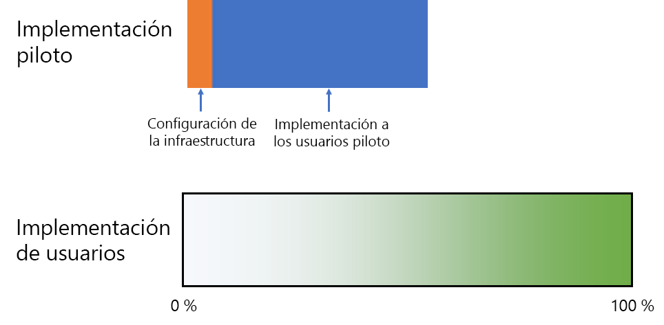
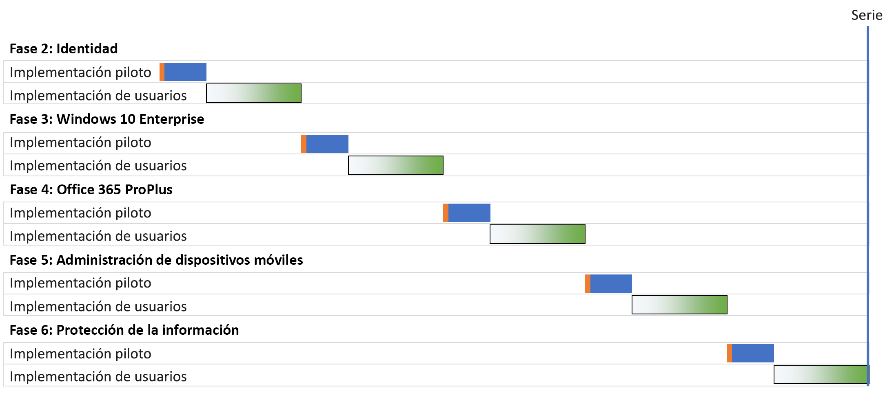
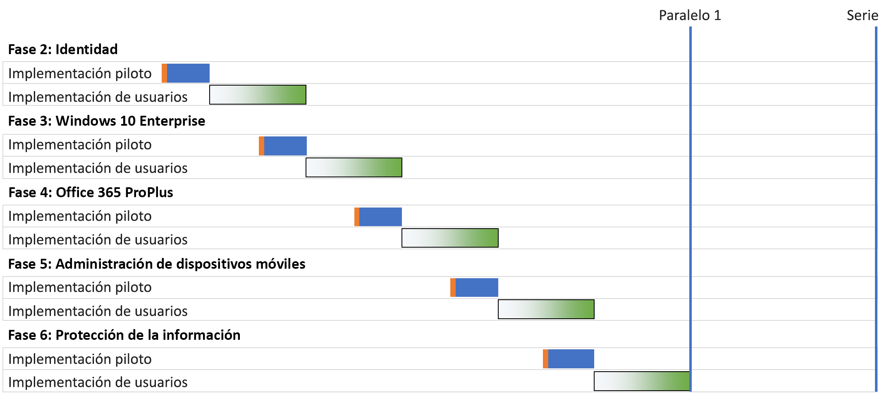
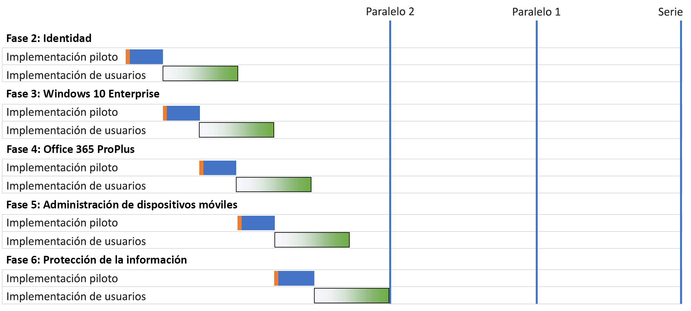
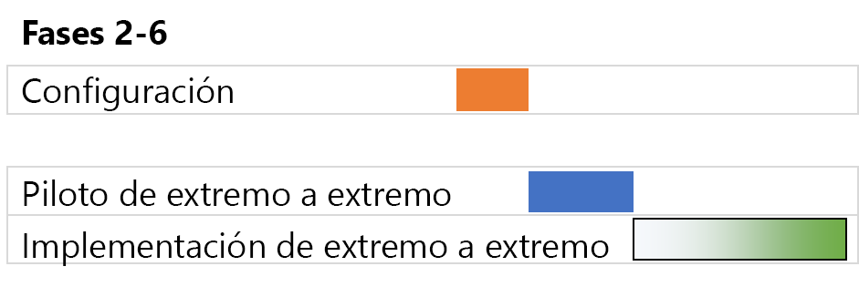

# Estrategias de implementación de la infraestructura base de Microsoft 365 Enterprise

Hay varias formas de implementar las fases de la [infraestructura base](deploy-foundation-infrastructure.md) de Microsoft 365 Enterprise y distribuir las funciones, el software y los servicios a los usuarios. Para empezar a trabajar en la administración de proyectos de esta tarea, que puede ser grande y compleja en función del tamaño de la organización y su infraestructura existente, tenga en cuenta las siguientes estrategias de implementación:

- Implementación de serie:
- Implementación paralela con implementación de usuarios que no se superpone
- Implementación paralela con implementación de usuarios que se superpone
- Infraestructura inicial e implementación de la configuración completa

Utilice estas estrategias para obtener ideas sobre cómo administrar todo el proyecto y obtener más rápidamente las ventajas empresariales de Microsoft 365 Enterprise

>[!Note]
>Este artículo contiene supuestos y simplificaciones como una manera coherente de describir las estrategias de implementación. Estas estrategias de implementación son generalizadas y no pretenden implicar períodos de tiempo concretos, ni se aplican a todas las organizaciones y situaciones.
>

## Elementos de la administración de proyectos de TI para organizaciones empresariales típicas

La infraestructura de TI incluye servicios back-end y la implementación de funcionalidades nuevas o mejoradas o la instalación de software en los usuarios finales. Los departamentos de TI suelen implementar los elementos de una infraestructura de TI de forma metódica. Un enfoque para la implementación correcta de un elemento de la infraestructura de TI consiste en:

- Una implementación piloto 

  Incluye la configuración de la infraestructura inicial y la implementación en un grupo piloto de usuarios, así como las pruebas y las modificaciones posteriores en la configuración de la infraestructura.

- Una implementación de usuarios

  Incluye la implementación en el resto de la organización en función de las regiones, los departamentos o los grupos o con otros tipos de propagación sistemática de la configuración o el software.

El conjunto de usuarios de la implementación piloto no es igual al de la implementación de usuarios.

En este artículo se usan los gráficos siguientes para representar estas definiciones: 

 

El sombreado del gráfico de implementación de usuarios indica el porcentaje en toda la organización de 0 % a 100 % con un enfoque estructurado o metódico, como grupos, departamentos o regiones.

## Estrategias de implementación

Tenga en cuenta las siguientes estrategias de implementación:

- Implementación de serie:
- Implementación paralela con implementación de usuarios que no se superpone
- Implementación paralela con implementación de usuarios que se superpone
- Infraestructura inicial e implementación de la configuración completa

### Implementación de serie:

Con una implementación de serie, se distribuye completamente una fase, lo que permite que la fase llegue a completar el 100 % de la implementación para todos los usuarios antes de pasar a la siguiente. Aquí tiene algunos de los motivos por los que se podría implementar de esta forma:

- Mitigación de riesgos
- Restricciones de recursos
- Ciclos de financiación del departamento de TI
- Dependencias de la tecnología de TI
- Administración de cambios empresariales y resistencia del usuario final

Este diagrama de Gantt muestra una implementación de serie simplificada de las fases 2 a la 6 de la infraestructura base de Microsoft 365 Enterprise.

 
 
Para simplificar la explicación y el ejemplo, se presupone que se tardará lo mismo en cada fase y cada segmento de implementación en cada fase.

>[!Note]
>Fase 1: La creación de la red de la infraestructura base de Microsoft 365 Enterprise es una fase exclusiva del departamento de TI. Los usuarios obtienen las ventajas de una conectividad optimizada con los recursos de nube de Microsoft pero no están obligados a conseguirla.
>

Esta es una experiencia de usuario piloto simplificada como un ejemplo:

- En diciembre, necesito usar mi smartphone para MFA. (Identidad)
- En marzo, instalo Windows 10 Enterprise en el escritorio de Windows 8.1. (Windows 10 Enterprise)
- En junio, instalo Office 365 ProPlus en reemplazo de Office 2013. (Office 365 ProPlus)
- En septiembre, obtengo la inscripción de dispositivos y las directivas de aplicaciones y dispositivos aplicadas. (Administración de dispositivos móviles)
- En diciembre, instalo el cliente de Azure Information Protection y me entreno en la aplicación de etiquetas a los documentos. (Information Protection)

El resultado es una cadencia de 90 días entre implementaciones piloto sucesivas.

Esta es una experiencia de usuario final simplificada como un ejemplo:

- En enero, necesito usar mi smartphone para MFA. (Identidad)
- En abril, instalo Windows 10 Enterprise en el escritorio de Windows 8.1. (Windows 10 Enterprise)
- En julio, instalo Office 365 ProPlus en reemplazo de Office 2013. (Office 365 ProPlus)
- En octubre, obtengo la inscripción de dispositivos y las directivas de aplicaciones y dispositivos aplicadas. (Administración de dispositivos móviles)
- En enero del año siguiente, instalo el cliente de Azure Information Protection y me entreno en la aplicación de etiquetas a los documentos. (Information Protection)

El resultado es una cadencia de 90 días entre implementaciones sucesivas de usuarios.

La desventaja de esta estrategia de implementación es que se puede tardar mucho en implementar por completo la infraestructura base de Microsoft 365 Enterprise.

### Implementación paralela con implementación de usuarios que no se superpone (paralela 1)

En esta estrategia, se inicia la implementación piloto de la siguiente fase durante la última parte de la implementación de usuarios de la fase actual. Aquí tiene la implementación de las fases de la 2 a la 6 cuando la implementación piloto se produce al concluir la implementación de usuarios de la fase anterior.

 
 
El resultado final es que la implementación de usuarios de la fase actual se completa en toda la organización antes de que empiece la siguiente. Los usuarios que no están en la implementación piloto no se enfrentan a las implementaciones de varias fases al mismo tiempo, pero las implementaciones piloto se realizan en paralelo con las implementaciones de usuarios.

Esta es una experiencia de usuario piloto simplificada como un ejemplo:

- En diciembre, necesito usar mi smartphone para MFA. (Identidad)
- En febrero, instalo Windows 10 Enterprise en el escritorio de Windows 8.1. (Windows 10 Enterprise)
- En abril, instalo Office 365 ProPlus en reemplazo de Office 2013. (Office 365 ProPlus)
- En junio, obtengo la inscripción de dispositivos y las directivas de aplicaciones y dispositivos aplicadas. (Administración de dispositivos móviles)
- En agosto, instalo el cliente de Azure Information Protection y me entreno en la aplicación de etiquetas a los documentos. (Information Protection)

El resultado es una cadencia de 60 días entre implementaciones piloto sucesivas.

Esta es una experiencia de usuario final simplificada como un ejemplo:

- En enero, necesito usar mi smartphone para MFA. (Identidad)
- En marzo, instalo Windows 10 Enterprise en el escritorio de Windows 8.1. (Windows 10 Enterprise)
- En mayo, instalo Office 365 ProPlus en reemplazo de Office 2013. (Office 365 ProPlus)
- En julio, obtengo la inscripción de dispositivos y las directivas de aplicaciones y dispositivos aplicadas. (Administración de dispositivos móviles)
- En septiembre, instalo el cliente de Azure Information Protection y me entreno en la aplicación de etiquetas a los documentos. (Information Protection)

El resultado es una cadencia de 60 días entre implementaciones sucesivas de usuarios.

La ventaja de esta estrategia de implementación es que se puede tardar menos en implementar por completo la infraestructura base de Microsoft 365 Enterprise, sin que el departamento de TI y los usuarios tengan que enfrentarse a varias implementaciones a la vez.

### Implementación paralela con implementación de usuarios que se superpone (paralela 2)

Con esta estrategia de implementación, se inicia:

- La implementación piloto de la fase siguiente se realiza durante la última parte de la implementación de usuarios de la fase actual.
- La implementación por parte de los usuarios de la siguiente fase durante la implementación de los usuarios de la fase actual, de modo que no haya ningún usuario trabajando con las implementaciones de varias fases al mismo tiempo. Esto supone que está implementando cada fase de la infraestructura de Foundation de la misma manera, con regiones, departamentos u otros grupos.

Aquí tiene una comparación simplificada entre distintas estrategias de implementación.

 

El resultado final es que:

- Las implementaciones piloto pasan sin pausa de una fase a la siguiente.
- La implementación de usuarios de una fase comienza antes de completar la implementación de usuarios de la fase anterior, pero ningún usuario individual se distribuirá en más de una fase a la vez.

Esta es una experiencia de usuario piloto simplificada como un ejemplo:

- En diciembre, necesito usar mi smartphone para MFA. (Identidad)
- En enero, instalo Windows 10 Enterprise en el escritorio de Windows 8.1. (Windows 10 Enterprise)
- En febrero, instalo Office 365 ProPlus en reemplazo de Office 2013. (Office 365 ProPlus)
- En marzo, obtengo la inscripción de dispositivos y las directivas de aplicaciones y dispositivos aplicadas. (Administración de dispositivos móviles)
- En abril, instalo el cliente de Azure Information Protection y me entreno en la aplicación de etiquetas a los documentos. (Information Protection)

El resultado es una cadencia de 30 días entre implementaciones piloto sucesivas.

Esta es una experiencia de usuario final simplificada como un ejemplo:

- En enero, necesito usar mi smartphone para MFA. (Identidad)
- En febrero, instalo Windows 10 Enterprise en el escritorio de Windows 8.1. (Windows 10 Enterprise)
- En marzo, instalo Office 365 ProPlus en reemplazo de Office 2013. (Office 365 ProPlus)
- En abril, obtengo la inscripción de dispositivos y las directivas de aplicaciones y dispositivos aplicadas. (Administración de dispositivos móviles)
- En mayo, instalo el cliente de Azure Information Protection y me entreno en la aplicación de etiquetas a los documentos. (Information Protection)

El resultado es una cadencia de 30 días entre implementaciones sucesivas de usuarios.

La ventaja de esta estrategia de implementación es que puede tardar menos en completarse la implementación de la infraestructura de Microsoft 365 Enterprise Foundation, sin necesidad de que los usuarios finales se ocupen de varias implementaciones de forma simultánea. Sin embargo, los usuarios no pueden descansar entre fases sucesivas.

### Infraestructura inicial e implementación de la configuración completa

En el caso de organizaciones más pequeñas con la posibilidad de comprimir las fases de la 2 a la 6 en un solo segmento de implementación, la implementación resultante tiene el siguiente aspecto:
 
 

El departamento de TI configura la infraestructura de las fases 2 a la 6, luego la distribuye a los usuarios piloto para comprobar la funcionalidad completa. Por ejemplo, los usuarios piloto obtienen toda esta funcionalidad al mismo tiempo:

- MFA y otras características de identidad (identidad)
- Windows 10 Enterprise en dispositivos Windows (Windows 10 Enterprise)
- Office 365 ProPlus para el conjunto de aplicaciones de Office (Office 365 ProPlus)
- Directivas de aplicaciones y dispositivos (administración de dispositivos móviles)
- Instalación del cliente de Azure Information Protection y entrenamiento en la aplicación de etiquetas a los documentos (Information Protection)

Tras finalizar la implementación piloto, empiece la implementación de usuarios en la que cada usuario obtiene todas las funciones la vez.

## Siguiente paso

Inicio de la implementación de Microsoft 365 Enterprise con la [infraestructura base](deploy-foundation-infrastructure.md).
