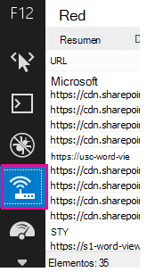

# Diagnosticar problemas de rendimiento con SharePoint OnlineDiagnosing performance issues with SharePoint Online

En este artículo se muestra cómo diagnosticar problemas comunes con el sitio SharePoint Online mediante las herramientas de desarrollador de Internet Explorer.This article shows you how you can diagnose common issues with your SharePoint Online site using Internet Explorer developer tools.
  
Hay tres formas diferentes de identificar que una página de un sitio de SharePoint Online tiene un problema de rendimiento con las personalizaciones.There are three different ways that you can identify that a page on a SharePoint Online site has a performance problem with the customizations.
  
- Monitor de red de la barra de herramientas F12The F12 tool bar network monitor

- Comparación con una línea base no personalizadaComparison to a non-customized baseline

- SharePoint Métricas de encabezado de respuesta en líneaSharePoint Online response header metrics

En este tema se describe cómo usar cada uno de estos métodos para diagnosticar problemas de rendimiento.This topic describes how to use each of these methods to diagnose performance issues. Una vez que haya descubierto la causa del problema, puede trabajar en una solución con los artículos sobre cómo mejorar SharePoint rendimiento que puede encontrar en https://aka.ms/tune .Once you've figured out the cause of the problem, you can work toward a solution using the articles about improving SharePoint performance that you can find on https://aka.ms/tune.
  
## Uso de la barra de herramientas F12 para diagnosticar el rendimiento en SharePoint OnlineUsing the F12 tool bar to diagnose performance in SharePoint Online

En este artículo usamos Internet Explorer 11.In this article we use Internet Explorer 11. Las versiones de las herramientas de desarrollo F12 en otros exploradores tienen características similares, aunque pueden tener un aspecto ligeramente diferente.Versions of the F12 developer tools on other browsers have similar features though they may look slightly different. Para obtener información sobre las herramientas para desarrolladores de F12, vea:For information on the F12 developer tools, see:
  
- [Novedades de F12 Tools](/previous-versions/windows/internet-explorer/ie-developer/dev-guides/bg182632(v=vs.85))[What's new in F12 Tools](/previous-versions/windows/internet-explorer/ie-developer/dev-guides/bg182632(v=vs.85))

- [Usar las herramientas de desarrollo F12](/previous-versions/windows/internet-explorer/ie-developer/samples/bg182326(v=vs.85))[Using the F12 developer tools](/previous-versions/windows/internet-explorer/ie-developer/samples/bg182326(v=vs.85))

Para mostrar las herramientas de desarrollador, **presione F12** y, a continuación, haga clic en Wi-Fi icono:To bring up the developer tools press **F12** and then click the Wi-Fi icon:
  

  
En la **pestaña Red,** presione el botón de reproducción verde para cargar una página.On the **Network** tab, press the green play button to load a page. La herramienta devuelve todos los archivos que el explorador solicita para obtener la página que solicitó.The tool returns all of the files that the browser requests in order to get the page you asked for. En la siguiente captura de pantalla se muestra una de estas listas.The following screen shot shows one such list.
  

  
También puede ver los tiempos de descarga de los archivos en el lado derecho, como se muestra en esta captura de pantalla.You can also see the download times of the files on the right side as shown in this screen shot.
  

  
Esto proporciona una representación visual del tiempo que tardó el archivo en cargarse.This gives you a visual representation of how long the file took to load. La línea verde representa cuándo está lista la página para representarla el explorador.The green line represents when the page is ready to be rendered by the browser. Esto puede proporcionar una vista rápida de los diferentes archivos que pueden estar provocando cargas de página lentas en el sitio.This can give you a quick view of the different files that might be causing slow page loads on your site.
  
## Configurar una línea base no personalizada para SharePoint OnlineSetting up a non-customized baseline for SharePoint Online

La mejor manera de determinar los puntos débiles de rendimiento del sitio es configurar una colección de sitios completamente lista para usar en SharePoint Online.The best way to determine your site's performance weak points is to set up a completely out-of-the-box site collection in SharePoint Online. De este modo, puede comparar todos los distintos aspectos de su sitio con lo que se obtiene sin personalización en la página.This way you can compare all the various aspects of your site with what you would get with no customization on the page. La OneDrive para la Empresa principal es un buen ejemplo de una colección de sitios independiente que es poco probable que tenga personalizaciones.The OneDrive for Business home page is a good example of a separate site collection that is unlikely to have any customizations.
  
## Ver SharePoint de encabezado de respuestaViewing SharePoint response header information

En SharePoint Online, puede obtener acceso a la información que se envía de nuevo al explorador en el encabezado de respuesta de cada archivo.In SharePoint Online, you can access the information that is sent back to the browser in the response header for each file. El valor más útil para diagnosticar problemas de rendimiento es **SPRequestDuration,** que muestra la cantidad de tiempo que la solicitud tardó en procesarse en el servidor.The most useful value for diagnosing performance issues is **SPRequestDuration**, which displays the amount of time that the request took on the server to be processed. Esto puede ayudar a determinar si la solicitud es muy pesada e intensiva en recursos.This can help determine if the request is very heavy and resource intensive. Esta es la mejor información que tiene sobre cuánto trabajo está realizando el servidor para servir a la página.This is the best insight you have into how much work the server is doing to serve the page.

### Para ver la SharePoint de encabezado de respuestaTo view SharePoint response header information
  
1. Asegúrese de que tiene instaladas las herramientas F12.Ensure that you have the F12 tools installed. Para obtener más información sobre cómo descargar e instalar estas herramientas, vea [Novedades de las herramientas F12](/previous-versions/windows/internet-explorer/ie-developer/dev-guides/bg182632(v=vs.85)).For more information on downloading and installing these tools, see [What's new in F12 tools](/previous-versions/windows/internet-explorer/ie-developer/dev-guides/bg182632(v=vs.85)).

2. En las herramientas F12, en la **pestaña** Red, presione el botón verde de reproducción para cargar una página.In the F12 tools, on the **Network** tab, press the green play button to load a page.

3. Haga clic en uno de los archivos .aspx devueltos por la herramienta y, a continuación, haga clic **en DETALLES**.Click one of the .aspx files returned by the tool and then click **DETAILS**.

    
  
4. Haga clic **en Encabezados de respuesta**.Click **Response headers**.

    
  
## ¿Qué está causando problemas de rendimiento en SharePoint Online?What's causing performance issues in SharePoint Online?

En el artículo Opciones de navegación para [SharePoint Online](navigation-options-for-sharepoint-online.md) se muestra un ejemplo de uso del valor SPRequestDuration para determinar que la navegación estructural complicada estaba provocando que la página tardara mucho tiempo en procesarse en el servidor.The article [Navigation options for SharePoint Online](navigation-options-for-sharepoint-online.md) shows an example of using the SPRequestDuration value to determine that the complicated structural navigation was causing the page to take a long time to process on the server. Al tomar un valor para un sitio de línea base (sin personalización), es posible determinar si un archivo determinado tarda mucho tiempo en cargarse.By taking a value for a baseline site (without customization), it is possible to determine if any given file is taking a long time to load. El ejemplo usado en [Opciones de navegación para SharePoint Online](navigation-options-for-sharepoint-online.md) es el archivo .aspx principal.The example used in [Navigation options for SharePoint Online](navigation-options-for-sharepoint-online.md) is the main .aspx file. Ese archivo contiene la mayor parte del ASP.NET que se ejecuta para la carga de la página.That file contains most of the ASP.NET code that runs for your page load. Según la plantilla de sitio que use, podría ser start.aspx, home.aspx, default.aspx u otro nombre si personaliza la página principal.Depending on the site template you use, this could be start.aspx, home.aspx, default.aspx, or another name if you customize the home page. Si este número es considerablemente mayor que el sitio de línea base, es una buena indicación de que hay algo complejo en la página que está causando problemas de rendimiento.If this number is considerably higher than your baseline site, then it's a good indication that there is something complex going on in your page that is causing performance issues.
  
Una vez que haya identificado que un problema específico del sitio, la forma recomendada de averiguar lo que está causando un rendimiento deficiente es eliminar todas las causas posibles, como personalizaciones de página y, a continuación, volver a agregarlas al sitio uno por uno.Once you have identified that an issue specific to your site, the recommended way to figure out what is causing poor performance is to eliminate all of the possible causes, like page customizations, and then add them back to the site one by one. Una vez que haya quitado suficientes personalizaciones que la página está realizando bien, puede agregar personalizaciones específicas una por una.Once you have removed enough customizations that the page is performing well, you can then add back specific customizations one by one.
  
Por ejemplo, si tiene una navegación muy compleja, intente cambiar la navegación para no mostrar subs sitios, compruebe las herramientas de desarrollo para ver si esto marca la diferencia.For example, if you have a very complex navigation try changing the navigation to not show sub-sites then check the developer tools to see if this makes a difference. O bien, si tiene una gran cantidad de roll-ups de contenido, intente quitarlos de la página y vea si esto mejora las cosas.Or if you have a large amount of content roll-ups try removing them from your page and see if this improves things. Si elimina todas las causas posibles y las agrega de una en una, puede identificar fácilmente qué características son el mayor problema y, a continuación, trabajar hacia una solución.If you eliminate all of the possible causes and add them back in one at a time, you can easily identify which features are the biggest problem and then work towards a solution.