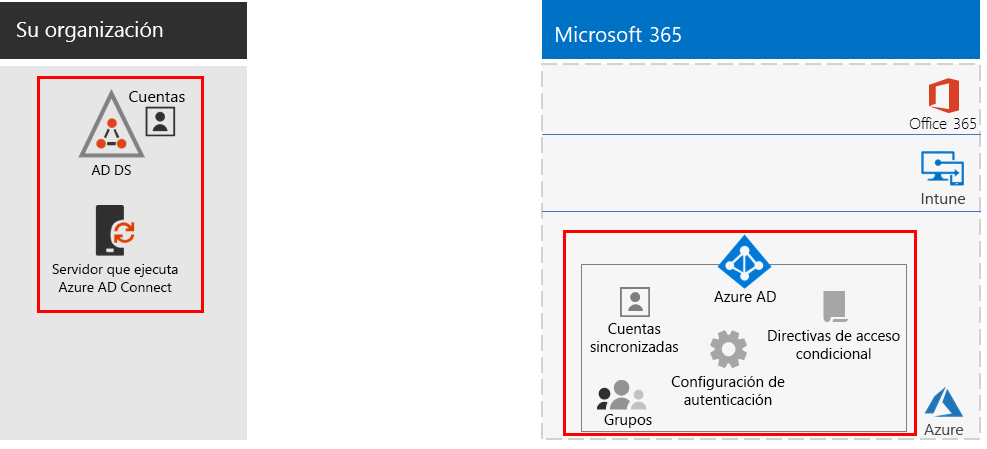
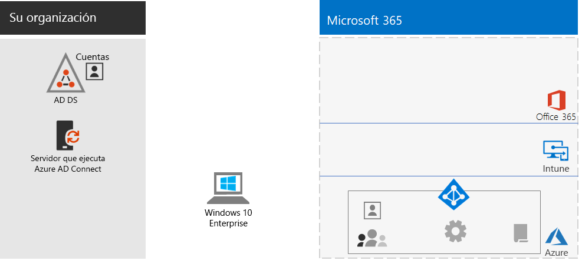
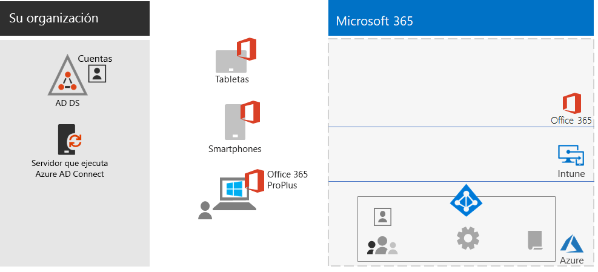
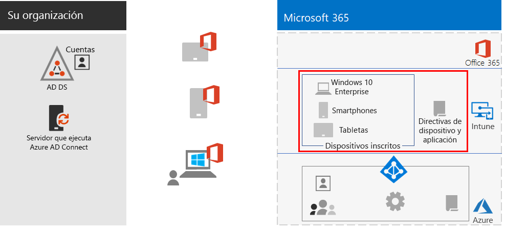
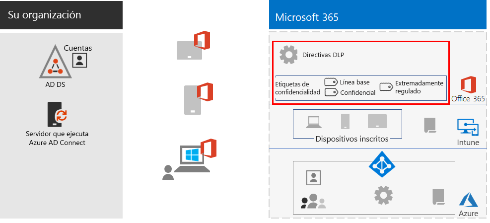
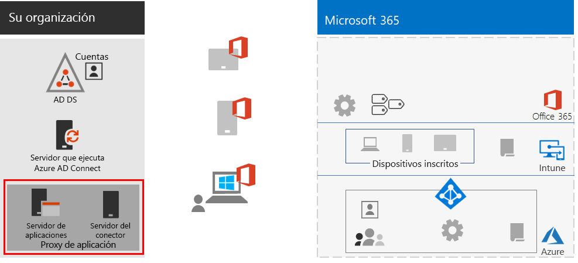
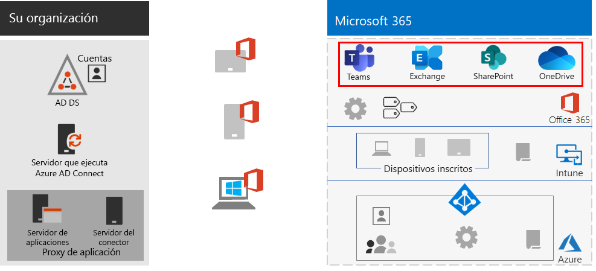
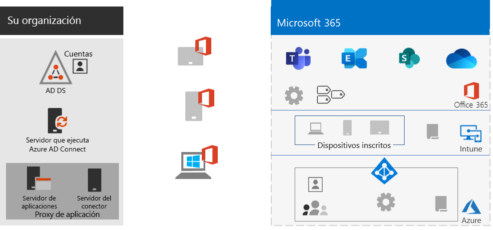
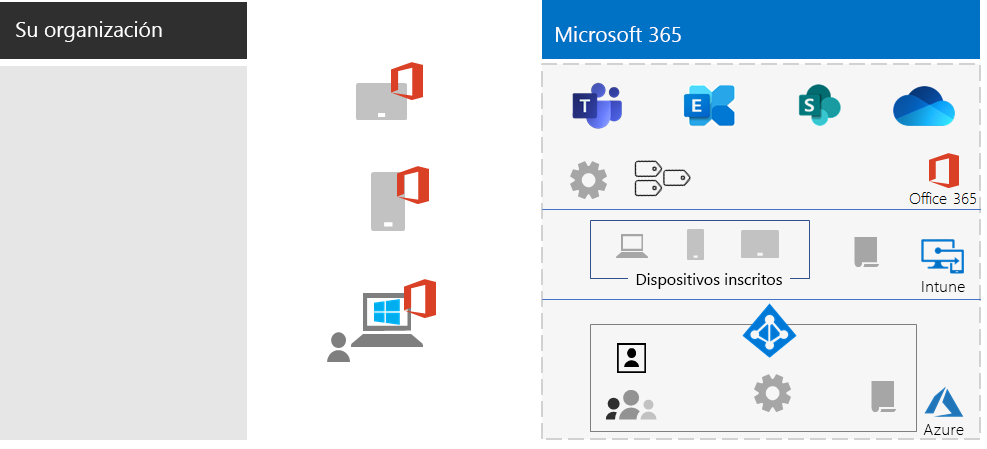

# Aumente la productividad de sus trabajadores remotos

*Este escenario se aplica a las versiones E3 y E5 de Microsoft 365 Enterprise*

Facilitar que los empleados trabajen desde casa, sin complicaciones y de forma segura permite a muchas empresas ahorrar espacio en la oficina, contratar y retener a los empleados que no vayan a reubicar y reducir el transporte al trabajo de los empleados, para que dediquen su tiempo a ser más productivos y a actividades de ocio que reduzcan su estrés. 

El trabajo remoto, también conocido como teletrabajo, abarca un gran espectro. Estos son algunos ejemplos:

- Empleados que salen de la oficina para ir a conferencias o reuniones con los clientes.
- Empleados que trabajan de forma remota a tiempo completo.
- Empresas completamente remotas en las que no hay ninguna oficina y todos los empleados trabajan a distancia.

Microsoft 365 Enterprise le ofrece una combinación de características destinadas a apoyar el trabajo de sus empleados remotos y crear un entorno altamente colaborativo, como:

- Reuniones en línea y sesiones de chat.
- Áreas de trabajo compartidas para almacenar archivos en la nube con accesibilidad global y colaboración en tiempo real.
- Tareas y flujos de trabajo compartidos para dividir el trabajo y terminarlo de forma más efectiva.

Si necesita un alto nivel de seguridad, Microsoft 365 Enterprise incluye:

- Requisitos de autenticación obligatorios, detección y respuesta a los inicios de sesión de alto riesgo, y bloqueo de aplicaciones específicas y dispositivos no compatibles.
- Conexiones cifradas y recursos digitales en la nube.
- Permisos para definir qué acciones se permiten a qué usuarios con ciertos archivos.
- Prevención de pérdida de datos (DLP) para evitar la filtración de datos altamente regulados.

Las siguientes funciones de Microsoft 365 Enterprise le permiten aplicar estos criterios a sus trabajadores remotos:

- Identidad del usuario y seguridad de inicio de sesión
  - Cuentas de usuario de Azure Active Directory (Azure AD) con autenticación multifactor (MFA)
  - Directivas de acceso condicional para requerir MFA en los inicios de sesión de riesgo
- Plataformas de colaboración
  - Microsoft Teams, SharePoint y OneDrive, con los que los trabajadores remotos pueden programar y asistir a reuniones por videoconferencia y trabajar simultáneamente con los mismos documentos.
- Acceso seguro a los recursos
  - Grupos y permisos para Teams, sitios de SharePoint y OneDrive que solo permitan acceder a usuarios autenticados y autorizados
- Protección para filtración de archivos
  - Directivas DLP
  - Etiquetas de confidencialidad para cifrado y permisos que se integran en los archivos incluso cuando estos se transfieren
- Administración de dispositivos y seguridad con Microsoft Intune
  - Inscripción para dispositivos administrados
  - Configuración de la aplicación para dispositivos personales
  - Directivas de dispositivo y aplicación
- Aplicaciones de productividad para dispositivos
  - Aplicaciones de Aplicaciones de Microsoft 365 para empresas para colaborar en Teams, SharePoint y OneDrive 
- Windows 10 Enterprise
  - Características de seguridad integrales para protegerse contra ciberataques y evitar las filtraciones de datos
- Acceso a aplicaciones locales
  - Las organizaciones con identidad híbrida pueden utilizar el proxy de aplicación de Azure AD en lugar de conectarse por una VPN.

En los siguientes pasos le mostramos cómo implementar la característica de Microsoft 365 Enterprise para acceso remoto y cómo aumentar su uso en los trabajadores remotos. Si ya ha implementado elementos de estas fases, asegúrese de que cumplan los requisitos especificados antes de pasar al elemento siguiente.

Para obtener un resumen de una sola página de este escenario, consulte el [póster para aumentar la productividad de los trabajadores remotos](../media/empower-people-to-work-remotely/empower-remote-workers-scenario.pdf).

[Póster para aumentar la productividad de los trabajadores remotos](../media/empower-people-to-work-remotely/empower-remote-workers-scenario.pdf)

También puede descargar este póster en formato [PDF](https://github.com/MicrosoftDocs/microsoft-365-docs/raw/public/microsoft-365/media/empower-people-to-work-remotely/empower-remote-workers-scenario.pdf) o [PowerPoint](https://github.com/MicrosoftDocs/microsoft-365-docs/raw/public/microsoft-365/media/empower-people-to-work-remotely/Empower-Remote-Workers-Poster.pptx) e imprimirlo en tamaño carta, legal o tabloide (11 x 17).

## Fase 1: implementar las características y funciones de Microsoft 365 para trabajadores remotos

Debido a la cantidad y profundidad de características y funcionalidades necesarias, le detallaremos los elementos requeridos de las secciones de infraestructura de base y cargas de trabajo de la [Guía de implementación de Microsoft 365 Enterprise](deploy-microsoft-365-enterprise.md)

### Paso 1: requisitos de infraestructura de base para trabajadores remotos

En este paso, veremos las fases de la [infraestructura de base](deploy-foundation-infrastructure.md) y enumeraremos los elementos necesarios para habilitar a los trabajadores remotos.

Para la [Fase 2: identidad](identity-infrastructure.md), implemente lo siguiente en la identidad de usuario y la seguridad de inicio de sesión:

- Para la identidad híbrida, los grupos y las cuentas de usuario que se sincronizan desde los servicios de dominio locales de Active Directory (AD DS).
- Para asignar permisos, los grupos sincronizados o de Azure AD con los miembros adecuados.
- Configuración de autenticación, por ejemplo, obligar a usar MFA
- Directivas de acceso condicional para requerir el uso de MFA en inicios de sesión peligrosos y bloquear clientes que no sean compatibles con la autenticación moderna.

Esta es la configuración resultante con los elementos de identidad resaltados.

 
Para la [Fase 3: Windows 10 Enterprise](windows10-infrastructure.md):

- Implementar la infraestructura necesaria para implementar Windows 10 Enterprise en nuevos dispositivos y actualizar sus dispositivos con Windows 7 y Windows 8,1 a Windows 10 Enterprise
- Habilitar características de seguridad integrales para la protección de identidad, contra amenazas y de información

Esta es la configuración resultante en los dispositivos con Windows 10 Enterprise.

 
Para [Fase 4: Aplicaciones de Microsoft 365 para empresas](office365proplus-infrastructure.md), implemente la infraestructura para instalar las Aplicaciones de Microsoft 365 para empresas o actualice el conjunto de aplicaciones de Office instalado actualmente, como Office 2010 u Office 2013, a Aplicaciones de Microsoft 365 para empresas en los dispositivos de su organización. Así, sus usuarios podrán colaborar mejor y estarán más protegidos.

Esta es la configuración resultante con Aplicaciones de Microsoft 365 para empresas instalado en los dispositivos.

 
De cara a la [Fase 5: administración de dispositivos móviles](mobility-infrastructure.md), implemente la administración de Intune para aplicaciones y dispositivos para:

- Inscripción de los dispositivos con Windows 10 Enterprise, iOS, macOS, Android y Android Enterprise para recibir características y configuraciones de seguridad definidas por su organización.
- Opciones de configuración de la aplicación para dar mayor seguridad o bloquear aplicaciones, incluso en los dispositivos personales de los empleados.
- Directivas de cumplimiento con Acceso condicional para evitar que se conecten dispositivos sin cumplimiento.

Esta es la configuración resultante con las directivas resaltadas y los dispositivos de Intune inscritos.

 
Para la [Fase 6: protección de la información](infoprotect-infrastructure.md), diseñe y configure la protección de su activo digital con:

- Directivas DLP.
- Etiquetas de confidencialidad de Microsoft 365 para cifrado y permisos que se integran en los archivos incluso cuando estos se transfieren

Esta es la configuración resultante con las directivas DLP y las etiquetas de confidencialidad resaltadas.

 
Para obtener acceso a las aplicaciones locales, puede usar el [proxy de la aplicación AD Azure](https://docs.microsoft.com/azure/active-directory/manage-apps/application-proxy), que requiere un entorno de identidad híbrido.

Esta es la configuración resultante con los componentes del proxy de la aplicación resaltados.

 
### Paso 2: cargas de trabajo para trabajadores remotos

Para [Exchange Online](exchangeonline-workload.md), implemente buzones de Exchange Online para cada uno de los usuarios.

Para [Teams](teams-workload.md), implemente Teams en sus usuarios y grupos.

Para [SharePoint y OneDrive](sharepoint-online-onedrive-workload.md), implemente un grupo de SharePoint o sitios de comunicaciones y carpetas de OneDrive.

Esta es la configuración resultante con las cargas de trabajo resaltadas.

 
### Resultados de la implementación

Después de implementar la infraestructura base y las cargas de trabajo, y después de instalar Windows 10 Enterprise y Aplicaciones de Microsoft 365 para empresas, los trabajadores remotos...:

- tendrán que pasar una autenticación y protección de identidad sólidas.
- tendrán la versión más reciente y segura de Windows en sus dispositivos Windows.
- tendrán la versión más reciente y productiva del conjunto de aplicaciones de Office en sus dispositivos.
- estarán sujetos a las directivas de administración de aplicaciones y cumplimiento de dispositivos.
- estarán sujetos a las directivas y restricciones de DLP.
- podrán asignar etiquetas de confidencialidad para el cifrado y los permisos, que se desplazarán con archivos y correo electrónico.
- accederán a las aplicaciones locales sin una conexión VPN.
- podrán trabajar por su cuenta y colaborar en tiempo real con sus colegas en chats, reuniones y archivos en Teams y archivos en SharePoint y OneDrive.

Cuando trabajen sin conexión a Internet, los trabajadores remotos podrán editar sus copias locales de los archivos. Cuando se vuelvan a conectar a Internet, OneDrive sincronizará las copias locales con los archivos almacenados en la suscripción de Microsoft 365. 

Esta es la configuración resultante para trabajadores remotos de su organización si usa una identidad híbrida.

 
 
Esta es la configuración resultante para trabajadores remotos de su organización si usa una identidad solo para la nube.

## Fase 2: fomentar que los trabajadores remotos usen las funcionalidades

Ahora que la infraestructura de base y las cargas de trabajo están implementadas, es hora de fomentar su uso por parte de los trabajadores remotos para que aumenten su productividad desde cualquier lugar y en cualquier momento.

### Paso 1: formar a los usuarios

La formación de los trabajadores remotos abarca los siguientes aspectos:

- Procedimientos de inicio de sesión adecuados, incluido el registro MFA, y cómo actuar en los inicios de sesión cuando se detectan riesgos.
- El uso de dispositivos y cómo las directivas pueden servir para bloquear el acceso a dispositivos no compatibles.
- El uso de aplicaciones permitidas y cómo se pueden usar las directivas de aplicaciones de Intune para bloquear aplicaciones.
- Características de seguridad de Windows 10 Enterprise.
- Cómo usar Outlook para el correo electrónico y el calendario.
- Cómo usar [Teams](https://docs.microsoft.com/microsoftteams/training-microsoft-teams-landing-page) para chatear, compartir documentos, hacer videoconferencias y tener conversaciones encadenadas.
- Cómo usar los equipos o sitios de comunicaciones de SharePoint y las carpetas de OneDrive para examinar archivos que pertenezcan a una biblioteca de usuario o a un grupo.
- Cómo usar y aplicar etiquetas de confidencialidad para archivos con datos confidenciales o extremadamente regulados, para versiones locales o de archivos en línea.

Esta formación debe incluir ejercicios prácticos para que los usuarios puedan experimentar con las funcionalidades y sus resultados.

### Paso 2: realizar revisiones periódicas de uso y responder a los comentarios de los trabajadores

En las semanas después de la formación haga lo siguiente:

- Responder rápidamente a los comentarios de los trabajadores y ajustar las directivas y las configuraciones.
- Analizar el uso de Teams, los sitios de SharePoint y las carpetas de OneDrive y compararlos con las expectativas de uso previas.
- Comprobar que los archivos confidenciales o extremadamente regulados estén debidamente etiquetados con la etiqueta de confidencialidad adecuada.

Volver a dar formación a los usuarios que lo necesiten.

### Resultados de la adopción de usuarios

Los trabajadores remotos pueden usar sus dispositivos con Windows 10 Enterprise u otros y Aplicaciones de Microsoft 365 para empresas para acceder a (y trabajar en) los recursos compartidos en la nube de Microsoft 365 Enterprise en un entorno seguro, y reunirse, crear y colaborar en tiempo real.

## Características adicionales de Microsoft para proporcionar soporte técnico a trabajadores remotos

Puede usar [conexiones VPN de punto a sitio de Azure](https://docs.microsoft.com/azure/vpn-gateway/point-to-site-about) para conectar trabajadores remotos a servidores que se ejecuten en una red virtual de Azure.

Puede usar el [Windows Virtual Desktop](https://docs.microsoft.com/azure/virtual-desktop/overview) para la virtualización del escritorio y de aplicaciones hospedadas en Azure.

## Consulta también

[Cargas de trabajo y escenarios](deploy-workloads.md)

[Biblioteca de productividad de Microsoft 365](https://aka.ms/productivitylibrary)(https://aka.ms/productivitylibrary)

[Guía de implementación](deploy-microsoft-365-enterprise.md)
