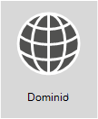

# <a name="external-domain-name-system-records-for-office-365"></a>Registros externos del Sistema de nombres de dominio para Office 365



**Want to see a customized list of DNS records for your Office 365 organization?** You can [find the info you need to create Office 365 DNS records](../admin/get-help-with-domains/information-for-dns-records.md) for your domain in Office 365.

**Need step-by-step help to add these records at your domain's DNS host, such as GoDaddy or eNom?** [Find links to step-by-step instructions for many popular DNS hosts](../admin/get-help-with-domains/create-dns-records-at-any-dns-hosting-provider.md).

**Sticking around to use the reference list for your own custom deployment?** The below list should be used as a reference for your custom Office 365 deployment. You will need to select which records apply to your organization and fill in the appropriate values.

**Regrese a** [Planeamiento de red y ajuste del rendimiento para Office 365](./network-planning-and-performance.md).

Often the SPF and MX records are the hardest to figure out. We've updated our SPF records guidance at the end of this article. The important thing to remember is that _you can only have a single SPF record for your domain_. You can have multiple MX records; however, that can cause problems for mail delivery. Having a single MX record that directs email to one mail system removes many potential problems.

The sections below are organized by service in Office 365. To see a customized list of the Office 365 DNS records for your domain, sign in to Office 365 and [Gather the information you need to create Office 365 DNS records](https://support.office.com/article/77f90d4a-dc7f-4f09-8972-c1b03ea85a67).

## <a name="external-dns-records-required-for-office-365-core-services"></a>Registros DNS externos necesarios para Office 365 (servicios principales)
<a name="BKMK_ReqdCore"> </a>

El registro TXT es necesario para demostrar que es el propietario del dominio y es necesario para todos los clientes.

El registro CNAME solo es necesario para los clientes que usan [Office 365 operado por 21Vianet](/microsoft-365/admin/services-in-china/services-in-china). Garantiza que Office 365 pueda dirigir las estaciones de trabajo para autenticarse con la plataforma de identidad adecuada.

|Registro DNS|Objetivo|Valor para usar|Se aplica a|
|---|---|---|---|
|**TXT** <br/> **(Verificación de dominio)**|Used by Office 365 to verify only that you own your domain. It doesn't affect anything else.|**Host:** @ (o, para algunos proveedores de hospedaje DNS, su nombre de dominio) <br/> **Valor de TXT:** _Una cadena de texto proporcionada por_ Office 365 <br/> El asistente de configuración de dominio de **Office 365** proporciona los valores que utiliza para crear este registro.|Todos los clientes|
|**CNAME** <br/> **(Conjunto de aplicaciones)**|Lo usa Office 365 para dirigir la autenticación a la plataforma de identidad correcta. [Más información](../admin/services-in-china/purpose-of-cname.md?viewFallbackFrom=o365-worldwide) <br/> **Nota**:Este CNAME solo se aplica a Office 365 operado por 21Vianet. Si está presente y su Office 365 no está operado por 21Vianet, los usuarios de su dominio personalizado recibirán un error "*dominio personalizado* no está en nuestro sistema" y no podrán activar su licencia de Office 365. [Más información](/office365/servicedescriptions/office-365-platform-service-description/office-365-operated-by-21vianet) |**Alias:** msoid <br/> **Objetivo:** clientconfig.partner.microsoftonline-p.net.cn| Solo clientes de 21Vianet|

## <a name="external-dns-records-required-for-email-in-office-365-exchange-online"></a>Registros DNS externos necesarios para el correo electrónico en Office 365 (Exchange Online)
<a name="BKMK_ReqdCore"> </a>

Email in Office 365 requires several different records. The three primary records that all customers should use are the Autodiscover, MX, and SPF records.

- **El registro de detección automática** permite que los equipos cliente busquen Exchange de manera automática y configuren el cliente correctamente.

- **The MX record** tells other mail systems where to send email for your domain. **Note:** When you change your email to Office 365, by updating your domain's MX record, ALL email sent to that domain will start coming to Office 365.
Do you just want to switch a few email addresses to Office 365? You can [Pilot Office 365 with a few email addresses on your custom domain](https://support.office.com/article/39cee536-6a03-40cf-b9c1-f301bb6001d7).

- **The TXT record for SPF** is used by recipient email systems to validate that the server sending your email is one that you approve. This helps prevent problems like email spoofing and phishing. See the [External DNS records required for SPF](external-domain-name-system-records.md#BKMK_SPFrecords) in this article to help you understand what to include in your record.

Los clientes de correo electrónico que utilizan federación de Exchange también tendrán un registro CNAME y TXT adicional en la parte inferior de la tabla.

|Registro DNS|Objetivo|Valor para usar|
|---|---|---|
|**CNAME** <br/> **(Exchange Online)**|Helps Outlook clients to easily connect to the Exchange Online service by using the Autodiscover service. Autodiscover automatically finds the correct Exchange Server host and configures Outlook for users.|**Alias:** Autodiscover <br/> **Destino:** autodiscover.outlook.com|
|**MX** <br/> **(Exchange Online)**|Envía el correo entrante para su dominio al servicio de Exchange Online de Office 365. <br/> **Nota:** Una vez que el correo fluye a Exchange Online, debe eliminar los registros MX que hacen referencia a su antiguo sistema. |**Dominio:** por ejemplo, contoso.com <br/> **Servidor de correo electrónico de destino:**\<MX token\>.mail.protection.outlook.com <br/> **Valor de tiempo de vida (TTL):** 3600 <br/> **Preferencia/Prioridad:** Inferior a todos los registros MX (garantiza el envío de correo a Exchange Online) - por ejemplo, 1 o “baja” <br/> Siga estos pasos para buscar el \<MX token\>: <br/> Inicie sesión en Office 365, vaya a la Administración de Office 365 \> Dominios. <br/> En la columna Acción para su dominio, elija Corregir problemas. <br/> En la sección de registros MX, elija ¿Qué puedo corregir? <br/> Siga las instrucciones de esta página para actualizar el registro MX. <br/> [¿Qué es una prioridad de MX?](../admin/setup/domains-faq.yml)|
|**SPF (TXT)** <br/> **(Exchange Online)**|Helps to prevent other people from using your domain to send spam or other malicious email. Sender policy framework (SPF) records work by identifying the servers that are authorized to send email from your domain.|[Registros DNS externos necesarios para SPF](external-domain-name-system-records.md#BKMK_SPFrecords)|
|**TXT** <br/> **(Federación de Exchange)**|Utilizado para la federación de Exchange para la implementación híbrida.|**Registro 1 TXT:** por ejemplo, contoso.com y texto hash asociado, generado de forma personalizada y de prueba de dominio (por ejemplo, Y96nu89138789315669824) <br/> **Registro 2 TXT:** por ejemplo, exchangedelegation.contoso.com y texto hash asociado, generado de forma personalizada y de prueba del dominio (por ejemplo Y3259071352452626169)|
|**CNAME** <br/> **(Federación de Exchange)**|Helps Outlook clients to easily connect to the Exchange Online service by using the Autodiscover service when your company is using Exchange federation. Autodiscover automatically finds the correct Exchange Server host and configures Outlook for your users.|**Alias:** por ejemplo, Autodiscover.service.contoso.com <br/> **Destino:** autodiscover.outlook.com|

## <a name="external-dns-records-required-for-skype-for-business-online"></a>Registros DNS externos necesarios para Skype Empresarial Online
<a name="BKMK_ReqdCore"> </a>

Existen pasos específicos que realizar cuando se usan [rangos de direcciones IP y direcciones URL de Office 365](https://support.office.com/article/8548a211-3fe7-47cb-abb1-355ea5aa88a2#BKMK_LYO) para asegurarse de que la red esté correctamente configurada.

> [!NOTE]
> Estos registros DNS también se aplican a Teams, especialmente en un escenario híbrido de Teams y Skype Empresarial, donde pueden producirse ciertos problemas de federación.

|Registro DNS|Objetivo|Valor para usar|
|---|---|---|
|**SRV** <br/> **(Skype Empresarial Online)**|Allows your Office 365 domain to share instant messaging (IM) features with external clients by enabling SIP federation. Read more about [Office 365 URLs and IP address ranges](https://support.office.com/article/8548a211-3fe7-47cb-abb1-355ea5aa88a2#BKMK_LYO).|**Servicio:** sipfederationtls <br/> **Protocolo:** TCP <br/> **Prioridad:** 100 <br/> **Peso:** 1 <br/> **Puerto:** 5061 <br/> **Objetivo:** sipfed.online.lync.com <br/> **Nota:** Si el firewall o el servidor proxy bloquean las búsquedas de SRV en un DNS externo, debería agregar este registro al registro DNS interno. |
|**SRV** <br/> **(Skype Empresarial Online)**|Lo usa Skype Empresarial para coordinar el flujo de información entre los clientes de Lync.|**Servicio:** sip <br/> **Protocolo:** TLS <br/> **Prioridad:** 100 <br/> **Peso:** 1 <br/> **Puerto:** 443 <br/> **Objetivo:** sipdir.online.lync.com|
|**CNAME** <br/> **(Skype Empresarial Online)**|Lo usa el cliente de Lync para ayudar a encontrar el servicio de Skype Empresarial Online e iniciar sesión.|**Alias:** sip <br/> **Objetivo:** sipdir.online.lync.com <br/> Para obtener más información, consulte[direcciones URL e rangos de direcciones IP de Office 365 ](https://support.office.com/article/8548a211-3fe7-47cb-abb1-355ea5aa88a2#BKMK_LYO).|
|**CNAME** <br/> **(Skype Empresarial Online)**|Lo usa el cliente móvil de Lync para ayudar a encontrar el servicio de Skype Empresarial Online e iniciar sesión.|**Alias:** lyncdiscover <br/> **Objetivo:** webdir.online.lync.com|

## <a name="external-dns-records-required-for-office-365-single-sign-on"></a>Registros DNS externos necesarios para el inicio de sesión único en Office 365
<a name="BKMK_ReqdCore"> </a>

|Registro DNS|Objetivo|Valor para usar|
|---|---|---|
|**Host (A)**|Used for single sign-on (SSO). It provides the endpoint for your off-premises users (and on-premises users, if you like) to connect to your Active Directory Federation Services (AD FS) federation server proxies or load-balanced virtual IP (VIP).|**Destino:** por ejemplo, sts.contoso.com|

## <a name="external-dns-records-required-for-spf"></a>Registros DNS externos necesarios para SPF
<a name="BKMK_SPFrecords"> </a>

> [!IMPORTANT]
> SPF is designed to help prevent spoofing, but there are spoofing techniques that SPF cannot protect against. In order to protect against these, once you have set up SPF, you should also configure DKIM and DMARC for Office 365. To get started, see [Use DKIM to validate outbound email sent from your domain in Office 365](../security/office-365-security/use-dkim-to-validate-outbound-email.md). Next, see [Use DMARC to validate email in Office 365](../security/office-365-security/use-dmarc-to-validate-email.md).

SPF records are TXT records that help to prevent other people from using your domain to send spam or other malicious email. Sender policy framework (SPF) records work by identifying the servers that are authorized to send email from your domain.

You can only have one SPF record (that is, a TXT record that defines SPF) for your domain. That single record can have a few different inclusions but the total DNS lookups that result can't be more than 10 (this helps prevent denial of service attacks). See the table and other examples below to help you create or update the right SPF record values for your environment.

### <a name="structure-of-an-spf-record"></a>Estructura de un registro SPF

All SPF records contain three parts: the declaration that it is an SPF record, the domains, and IP addresses that should be sending email, and an enforcement rule. You need all three in a valid SPF record. Here's an example of a common SPF record for Office 365 when you use only Exchange Online email:

``` dns
TXT Name @
Values: v=spf1 include:spf.protection.outlook.com -all
```

An email system that receives an email from your domain looks at the SPF record, and if the email server that sent the message was an Office 365 server, the message is accepted. If the server that sent the message was your old mail system or a malicious system on the Internet, for example, the SPF check might fail and the message wouldn't be delivered. Checks like this help to prevent spoofing and phishing messages.

### <a name="choose-the-spf-record-structure-you-need"></a>Elegir la estructura de registro SPF que necesita

Para los escenarios donde no solo utiliza el correo electrónico de Exchange Online para Office 365 (por ejemplo, si también usa correo electrónico procedente de SharePoint Online), use la siguiente tabla para determinar qué incluir en el valor del registro.

> [!NOTE]
> If you have a complicated scenario that includes, for example, edge email servers for managing email traffic across your firewall, you'll have a more detailed SPF record to set up. Learn how: [Set up SPF records in Office 365 to help prevent spoofing](../security/office-365-security/set-up-spf-in-office-365-to-help-prevent-spoofing.md). You can also learn much more about how SPF works with Office 365 by reading [How Office 365 uses Sender Policy Framework (SPF) to help prevent spoofing](../security/office-365-security/how-office-365-uses-spf-to-prevent-spoofing.md).

|Número|Si usa...|Finalidad|Agregar estos includes|
|---|---|---|---|
|1|Todos los sistemas de correo electrónico (obligatorio)|Todos los registros SPF comienzan con este valor|v=spf1|
|2|Exchange Online (común)|Usar solo con Exchange Online|include:spf.protection.outlook.com|
|3|Sistema de correo electrónico de terceros (menos común)||incluye:\<email system like mail.contoso.com\>|
|4|Sistema de correo local (menos común)|Usar si usa Exchange Online Protection o Exchange Online además de otro sistema de correo|ip4:\<0.0.0.0\> <br/> ip6:\< : : \> <br/> incluye:\<mail.contoso.com\> <br/> El valor entre corchetes (\<\>) debe corresponder a otros sistemas de correo que enviarán correo electrónico por su dominio.|
|5|Todos los sistemas de correo electrónico (obligatorio)||-all|

### <a name="example-adding-to-an-existing-spf-record"></a>Ejemplo: Agregar a un registro SPF existente
<a name="bkmk_addtospf"> </a>

If you already have an SPF record, you'll need to add or update values for Office 365. For example, say your existing SPF record for contoso.com is this:

``` dns
TXT Name @
Values: v=spf1 ip4:60.200.100.30 include:smtp.adatum.com -all
```

Now you're updating your SPF record for Office 365. You'll edit your current record so you have an SPF record that includes the values that you need. For Office 365, "spf.protection.outlook.com".

Correcto:

``` dns
TXT Name @
Values: v=spf1 ip4:60.200.100.30 include:spf.protection.outlook.com include:smtp.adatum.com -all
```

Incorrecto:

``` dns
Record 1:
TXT Name @
Values: v=spf1 ip4:60.200.100.30 include:smtp.adatum.com -all
Record 2:
Values: v=spf1 include:spf.protection.outlook.com -all
```

### <a name="more-examples-of-common-spf-values"></a>Más ejemplos de valores SPF comunes
<a name="bkmk_addtospf"> </a>

If you are using the full Office 365 suite and are using MailChimp to send marketing emails on your behalf, your SPF record at contoso.com might look like the following, which uses rows 1, 3, and 5 from the table above. Remember, rows 1 and 5 are required.

``` dns
TXT Name @
Values: v=spf1 include:spf.protection.outlook.com include:servers.mcsv.net -all
```

Como alternativa, si tiene una configuración híbrida de Exchange donde se envía correo electrónico desde el sistema de correo local y desde Office 365, el registro SPF en contoso.com podría ser similar al siguiente:

``` dns
TXT Name @
Values: v=spf1 include:spf.protection.outlook.com include:mail.contoso.com -all
```

These are some common examples that can help you adapt your existing SPF record when you add your domain to Office 365 for email. If you have a complicated scenario that includes, for example, edge email servers for managing email traffic across your firewall, you'll have a more detailed SPF record to set up. Learn how: [Set up SPF records in Office 365 to help prevent spoofing](../security/office-365-security/set-up-spf-in-office-365-to-help-prevent-spoofing.md).

Este es un vínculo breve que se puede usar para volver: <https://aka.ms/o365edns>
