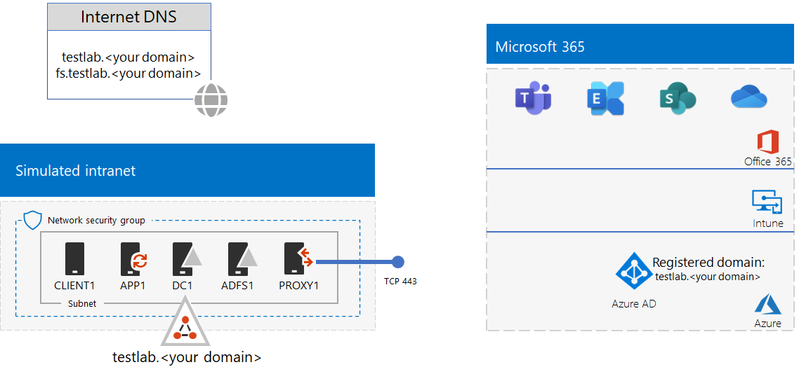

# <a name="federated-identity-for-your-microsoft-365-test-environment"></a>Identidad federada para el entorno de prueba de Microsoft 365

*Esta Guía del laboratorio de pruebas se puede usar tanto Microsoft 365 entornos de prueba empresariales como Office 365 Enterprise de prueba.*

Microsoft 365 admite la identidad federada. Esto significa que, en lugar de realizar la validación de las credenciales él mismo, Microsoft 365 dirige al usuario que se conecta a un servidor de autenticación federada en el que Microsoft 365 confía. Si las credenciales del usuario son correctas, el servidor de autenticación federada emite un token de seguridad que el cliente envía luego a Microsoft 365 como prueba de autenticación. La identidad federada permite la descarga y el escalado vertical de autenticación para una suscripción de Microsoft 365 y escenarios avanzados de seguridad y autenticación.
  
En este artículo se describe cómo configurar la autenticación federada para el Microsoft 365 de prueba, lo que da como resultado lo siguiente:


  
Esta configuración se compone de:
  
- Una Microsoft 365 E5 de prueba o producción.
    
- Una intranet de organización simplificada conectada a Internet, formada por cinco máquinas virtuales en una subred de una red virtual de Azure (DC1, APP1, CLIENT1, ADFS1 y PROXY1). Azure AD Conectar se ejecuta en APP1 para sincronizar la lista de cuentas en el dominio de servicios de dominio de Active Directory para Microsoft 365. PROXY1 recibe las solicitudes de autenticación entrantes. ADFS1 valida las credenciales con DC1 y emite tokens de seguridad.
    
La configuración de este entorno de prueba implica cinco fases:
- [Fase 1: configurar la sincronización de hash de contraseñas para el entorno de prueba de Microsoft 365](#phase-1-configure-password-hash-synchronization-for-your-microsoft-365-test-environment)
- [Fase 2: Crear el servidor de AD FS](#phase-2-create-the-ad-fs-server)
- [Fase 3: Crear el servidor proxy web](#phase-3-create-the-web-proxy-server)
- [Fase 4: Crear un certificado autofirmado y configurar ADFS1 y PROXY1](#phase-4-create-a-self-signed-certificate-and-configure-adfs1-and-proxy1)
- [Fase 5: Configurar Microsoft 365 con identidad federada](#phase-5-configure-microsoft-365-for-federated-identity)
    
> [!NOTE]
> No puede configurar este entorno de prueba con una suscripción de prueba de Azure.
  
## <a name="phase-1-configure-password-hash-synchronization-for-your-microsoft-365-test-environment"></a>Fase 1: configurar la sincronización de hash de contraseñas para el entorno de prueba de Microsoft 365

Siga las instrucciones de [sincronización de hash de contraseña para Microsoft 365](password-hash-sync-m365-ent-test-environment.md). La configuración resultante tiene este aspecto:
  

  
Esta configuración se compone de:
  
- Una Microsoft 365 E5 de prueba o de pago.
- Una intranet de organización simplificada conectada a Internet, formada por las máquinas virtuales DC1, APP1 y CLIENT1 en una subred de una red virtual de Azure. Azure AD Conectar se ejecuta en APP1 para sincronizar el dominio DE SERVICIOS de dominio de Active Directory (AD DS) de TESTLAB con el inquilino de Azure AD de las suscripciones de Microsoft 365 de forma periódica.

## <a name="phase-2-create-the-ad-fs-server"></a>Fase 2: Crear el servidor de AD FS

Un servidor de AD FS proporciona autenticación federada entre Microsoft 365 y las cuentas del dominio corp.contoso.com hospedado en DC1.
  
Para crear una máquina virtual de Azure para ADFS1, indique el nombre de la suscripción y del grupo de recursos y una ubicación de Azure para la configuración básica. Después, ejecute estos comandos en el símbolo del sistema de Azure PowerShell en el equipo local.
  
```powershell
$subscrName="<your Azure subscription name>"
$rgName="<the resource group name of your Base Configuration>"
$vnetName="TlgBaseConfig-01-VNET"
# NOTE: If you built your simulated intranet with Azure PowerShell, comment the previous line with a "#" and remove the "#" from the next line.
#$vnetName="TestLab"
Connect-AzAccount
Select-AzSubscription -SubscriptionName $subscrName
$staticIP="10.0.0.100"
$locName=(Get-AzResourceGroup -Name $rgName).Location
$vnet=Get-AzVirtualNetwork -Name $vnetName -ResourceGroupName $rgName
$pip = New-AzPublicIpAddress -Name ADFS1-PIP -ResourceGroupName $rgName -Location $locName -AllocationMethod Dynamic
$nic = New-AzNetworkInterface -Name ADFS1-NIC -ResourceGroupName $rgName -Location $locName -SubnetId $vnet.Subnets[0].Id -PublicIpAddressId $pip.Id -PrivateIpAddress $staticIP
$vm=New-AzVMConfig -VMName ADFS1 -VMSize Standard_D2_v2
$cred=Get-Credential -Message "Type the name and password of the local administrator account for ADFS1."
$vm=Set-AzVMOperatingSystem -VM $vm -Windows -ComputerName ADFS1 -Credential $cred -ProvisionVMAgent -EnableAutoUpdate
$vm=Set-AzVMSourceImage -VM $vm -PublisherName MicrosoftWindowsServer -Offer WindowsServer -Skus 2016-Datacenter -Version "latest"
$vm=Add-AzVMNetworkInterface -VM $vm -Id $nic.Id
$vm=Set-AzVMOSDisk -VM $vm -Name "ADFS-OS" -DiskSizeInGB 128 -CreateOption FromImage -StorageAccountType "Standard_LRS"
New-AzVM -ResourceGroupName $rgName -Location $locName -VM $vm
```

Después, vaya a [Azure Portal](https://portal.azure.com) para conectarse a la máquina virtual de ADFS1 con el nombre y contraseña de la cuenta de administrador local de ADFS1 y abra un símbolo del sistema de Windows PowerShell.
  
Para comprobar la comunicación de red y la resolución de nombres entre ADFS1 y DC1, ejecute el comando **ping dc1.corp.contoso.com** y compruebe que hay cuatro respuestas.
  
A continuación, una la máquina virtual de ADFS1 al dominio CORP con estos comandos en un símbolo del sistema de Windows PowerShell en ADFS1.
  
```powershell
$cred=Get-Credential -UserName "CORP\User1" -Message "Type the User1 account password."
Add-Computer -DomainName corp.contoso.com -Credential $cred
Restart-Computer
```

La configuración resultante tiene este aspecto:
  

  
## <a name="phase-3-create-the-web-proxy-server"></a>Fase 3: Crear el servidor proxy web

PROXY1 permite crear conexiones proxy de mensajes de autenticación entre usuarios que intentan autenticarse y ADFS1.
  
Para crear una máquina virtual de Azure para PROXY1, indique el nombre de su grupo de recursos y una ubicación de Azure y, después, ejecute estos comandos en el símbolo del sistema de Azure PowerShell en el equipo local.
  
```powershell
$rgName="<the resource group name of your Base Configuration>"
$vnetName="TlgBaseConfig-01-VNET"
# NOTE: If you built your simulated intranet with Azure PowerShell, comment the previous line with a "#" and remove the "#" from the next line.
#$vnetName="TestLab"
$staticIP="10.0.0.101"
$locName=(Get-AzResourceGroup -Name $rgName).Location
$vnet=Get-AzVirtualNetwork -Name $vnetName -ResourceGroupName $rgName
$pip = New-AzPublicIpAddress -Name PROXY1-PIP -ResourceGroupName $rgName -Location $locName -AllocationMethod Static
$nic = New-AzNetworkInterface -Name PROXY1-NIC -ResourceGroupName $rgName -Location $locName -SubnetId $vnet.Subnets[0].Id -PublicIpAddressId $pip.Id -PrivateIpAddress $staticIP
$vm=New-AzVMConfig -VMName PROXY1 -VMSize Standard_D2_v2
$cred=Get-Credential -Message "Type the name and password of the local administrator account for PROXY1."
$vm=Set-AzVMOperatingSystem -VM $vm -Windows -ComputerName PROXY1 -Credential $cred -ProvisionVMAgent -EnableAutoUpdate
$vm=Set-AzVMSourceImage -VM $vm -PublisherName MicrosoftWindowsServer -Offer WindowsServer -Skus 2016-Datacenter -Version "latest"
$vm=Add-AzVMNetworkInterface -VM $vm -Id $nic.Id
$vm=Set-AzVMOSDisk -VM $vm -Name "PROXY1-OS" -DiskSizeInGB 128 -CreateOption FromImage -StorageAccountType "Standard_LRS"
New-AzVM -ResourceGroupName $rgName -Location $locName -VM $vm
```

> [!NOTE]
> PROXY1 se asigna como una dirección IP pública estática porque creará un registro DNS público que la señale y no debe cambiarse cuando reinicie la máquina virtual de PROXY1.
  
A continuación, agregue una regla al grupo de seguridad de red de la subred CorpNet para permitir el tráfico entrante no solicitado de Internet a la dirección IP privada de PROXY1 y al puerto TCP 443. Ejecute estos comandos desde el símbolo del sistema de Azure PowerShell en su equipo local.
  
```powershell
$rgName="<the resource group name of your Base Configuration>"
Get-AzNetworkSecurityGroup -Name CorpNet -ResourceGroupName $rgName | Add-AzNetworkSecurityRuleConfig -Name "HTTPS-to-PROXY1" -Description "Allow TCP 443 to PROXY1" -Access "Allow" -Protocol "Tcp" -Direction "Inbound" -Priority 101 -SourceAddressPrefix "Internet" -SourcePortRange "*" -DestinationAddressPrefix "10.0.0.101" -DestinationPortRange "443" | Set-AzNetworkSecurityGroup
```

Después, use [Azure Portal](https://portal.azure.com) para conectarse a la máquina virtual de PROXY1 con el nombre y contraseña de la cuenta de administrador local de PROXY1 y luego abra un símbolo del sistema de Windows PowerShell en PROXY1.
  
Para comprobar la comunicación de red y la resolución de nombres entre PROXY1 y DC1, ejecute el comando **ping dc1.corp.contoso.com** y compruebe que hay cuatro respuestas.
  
A continuación, una la máquina virtual de PROXY1 al dominio CORP con estos comandos en un símbolo del sistema de Windows PowerShell en PROXY1.
  
```powershell
$cred=Get-Credential -UserName "CORP\User1" -Message "Type the User1 account password."
Add-Computer -DomainName corp.contoso.com -Credential $cred
Restart-Computer
```

Muestra la dirección IP pública de PROXY1 con estos Azure PowerShell comandos en el equipo local.
  
```powershell
Write-Host (Get-AzPublicIpaddress -Name "PROXY1-PIP" -ResourceGroup $rgName).IPAddress
```

Después, trabaje con su proveedor de DNS público y cree un nuevo registro DNS A público para **fs.testlab.**\<*your DNS domain name*> se resuelva en la dirección IP mostrada mediante el comando **Write-Host**. En lo sucesivo, se hace referencia a **fs.testlab.**\<*your DNS domain name*> como el *FQDN del servicio de federación*.
  
Después, use [Azure Portal](https://portal.azure.com) para conectarse a la máquina virtual de DC1 con las credenciales de CORP\\User1 y ejecute los siguientes comandos en un símbolo del sistema de Windows PowerShell con nivel de administrador:
  
```powershell
Add-DnsServerPrimaryZone -Name corp.contoso.com -ZoneFile corp.contoso.com.dns
Add-DnsServerResourceRecordA -Name "fs" -ZoneName corp.contoso.com -AllowUpdateAny -IPv4Address "10.0.0.100" -TimeToLive 01:00:00
```
Estos comandos crean un registro A de DNS interno para que las máquinas virtuales de la red virtual de Azure puedan resolver el FQDN del servicio de federación interno en la dirección IP privada de ADFS1.
  
La configuración resultante tiene este aspecto:
  

  
## <a name="phase-4-create-a-self-signed-certificate-and-configure-adfs1-and-proxy1"></a>Fase 4: Crear un certificado autofirmado y configurar ADFS1 y PROXY1

En esta fase, crea un certificado digital autofirmado para su FQDN del Servicio de federación y configura ADFS1 y PROXY1 como una granja de servidores de AD FS.
  
En primer lugar, use [Azure Portal](https://portal.azure.com) para conectarse a la máquina virtual de DC1 con las credenciales de CORP\\User1 y luego abra un símbolo del sistema de Windows PowerShell con nivel de administrador. 
  
A continuación, crea una cuenta de servicio de AD FS con este comando en el Windows PowerShell de comandos de DC1:
  
```powershell
New-ADUser -SamAccountName ADFS-Service -AccountPassword (read-host "Set user password" -assecurestring) -name "ADFS-Service" -enabled $true -PasswordNeverExpires $true -ChangePasswordAtLogon $false
```
Tenga en cuenta que este comando le pide que proporcione la contraseña de la cuenta. Elija una contraseña segura y grabe en una ubicación protegida. Lo necesitará para esta fase y para la fase 5.
  
Use [Azure Portal](https://portal.azure.com) para conectarse a la máquina virtual de ADFS1 con las credenciales de CORP\\User1. Abra un símbolo del sistema de Windows PowerShell con nivel de administrador en ADFS1, indique el FQDN del Servicio de federación y luego ejecute estos comandos para crear un certificado autofirmado:
  
```powershell
$fedServiceFQDN="<federation service FQDN>"
New-SelfSignedCertificate -DnsName $fedServiceFQDN -CertStoreLocation "cert:\LocalMachine\My"
New-Item -path c:\Certs -type directory
New-SmbShare -name Certs -path c:\Certs -changeaccess CORP\User1
```

Después, use estos pasos para guardar el nuevo certificado autofirmado como archivo.
  
1. Seleccione **Inicio**, escriba **mmc.exe** y, a continuación, presione **Entrar**.
    
2. Seleccione **Agregar**  >  **o quitar archivos Acoplar complemento**.
    
3. En **Agregar o quitar Acoplar,** haga doble  clic en Certificados en la lista de complementos disponibles, seleccione Cuenta de equipo **y,** a continuación, **seleccione Siguiente**.
    
4. En **Seleccionar equipo,** seleccione **Finalizar** y, a continuación, **seleccione Aceptar**.
    
5. En el panel de árbol, abra **Certificados (equipo local) > Personal > Certificados**.
    
6. Seleccione y mantenga presionado (o haga clic con el botón secundario) en el certificado con el FQDN del servicio de federación, seleccione **Todas** las tareas y, a continuación, **seleccione Exportar**.
    
7. En la **página de** bienvenida, seleccione **Siguiente**.
    
8. En la **página Exportar clave privada,** seleccione **Sí** y, a continuación, **seleccione Siguiente**.
    
9. En la **página Exportar formato de archivo,** seleccione Exportar todas las propiedades **extendidas** y, a continuación, **seleccione Siguiente**.
    
10. En la **página Seguridad,** seleccione **Contraseña** e introduzca una contraseña en **Contraseña** y **Confirmar contraseña.**
    
11. En la **página Archivo para exportar,** seleccione **Examinar**.
    
12. Vaya a la **carpeta C: \\ Certs,** escriba **SSL** en **Nombre de archivo** y, a continuación, seleccione **Guardar.**
    
13. En la **página Archivo para exportar,** seleccione **Siguiente**.
    
14. En la **página Finalización del Asistente para exportación de certificados,** seleccione **Finalizar**. Cuando se le pida, seleccione **Aceptar**.
    
Después, instale el servicio de AD FS con este comando en el símbolo del sistema de Windows PowerShell en ADFS1:
  
```powershell
Install-WindowsFeature ADFS-Federation -IncludeManagementTools
```

Espere a que termine la instalación.
  
Después, configure el servicio de AD FS con estos pasos:
  
1. Seleccione **Inicio** y, a continuación, seleccione el **icono Administrador del** servidor.
    
2. En el panel de árbol del Administrador del servidor, seleccione **AD FS**.
    
3. En la barra de herramientas de la parte superior, seleccione el símbolo de precaución naranja y, a continuación, seleccione Configurar el servicio **de federación en este servidor**.
    
4. En la **página de** bienvenida del Asistente para configuración de Servicios de federación de Active Directory, seleccione **Siguiente**.
    
5. En la **Conectar a AD DS,** seleccione **Siguiente**.
    
6. En la página **Especificar propiedades del servicio**:
    
  - En **Certificado SSL,** seleccione la flecha abajo y, a continuación, seleccione el certificado con el nombre del FQDN del servicio de federación.
    
  - En **Nombre para mostrar del servicio de federación,** escriba el nombre de la organización ficticia.
    
  - Seleccione **Siguiente**.
    
7. En la **página Especificar cuenta de** servicio, seleccione **Seleccionar** nombre **de cuenta**.
    
8. En **Seleccionar cuenta de usuario o servicio**, escriba **ADFS-Service**, seleccione **Comprobar nombres** y, a continuación, seleccione **Aceptar**.
    
9. En **Contraseña de** cuenta , escriba la contraseña de la cuenta ADFS-Service y, a continuación, seleccione **Siguiente**.
    
10. En la página **Especificar base de datos de** configuración, seleccione **Siguiente**.
    
11. En la **página Revisar opciones,** seleccione **Siguiente**.
    
12. En la **página Comprobaciones de requisitos** previos, seleccione **Configurar**.

13. En la **página Resultados,** seleccione **Cerrar**.
    
14. Seleccione **Inicio**, seleccione el icono de energía, **Reiniciar** y, a continuación, **seleccione Continuar**.
    
Desde [Azure Portal](https://portal.azure.com), conéctese a PROXY1 con las credenciales de la cuenta CORP\\User1.
  
Después, siga estos pasos para instalar el certificado autofirmado en **PROXY1 y APP1**.
  
1. Seleccione **Inicio**, escriba **mmc.exe** y, a continuación, presione **Entrar**.
    
2. Seleccione **Archivo > Agregar o quitar Acoplar complemento**.
    
3. En **Agregar o quitar Acoplar,** haga doble  clic en Certificados en la lista de complementos disponibles, seleccione Cuenta de equipo **y,** a continuación, **seleccione Siguiente**.
    
4. En **Seleccionar equipo,** seleccione **Finalizar** y, a continuación, **seleccione Aceptar**.
    
5. En el panel de árbol, abra **Certificados (equipo**  >  **local)**  >  **Certificados personales**.
    
6. Seleccione y mantenga presionado (o haga clic con el botón secundario) **Personal**, **seleccione Todas las tareas** y, a continuación, seleccione **Importar**.
    
7. En la **página de** bienvenida, seleccione **Siguiente**.
    
8. En la **página Archivo para importar,** escriba **\\ \\ adfs1 \\ certs \\ ssl.pfx** y, a continuación, **seleccione Siguiente**.
    
9. En la **página Protección de claves privadas,** escriba la contraseña del certificado en **Contraseña** y, a continuación, **seleccione Siguiente.**
    
10. En la **página Almacén de certificados,** seleccione **Siguiente.**
    
11. En la **página Finalización,** seleccione **Finalizar**.
    
12. En la **página Almacén de certificados,** seleccione **Siguiente**.
    
13. Cuando se le pida, seleccione **Aceptar**.
    
14. En el panel de árbol, seleccione **Certificados**.
    
15. Seleccione y mantenga presionado (o haga clic con el botón secundario) en el certificado y, a continuación, **seleccione Copiar**.
    
16. En el panel de árbol, abra **Certificados de entidades** de certificación raíz de  >  **confianza**.
    
17. Mueva el puntero del mouse debajo de la lista de certificados instalados, seleccione y mantenga presionado (o haga clic con el botón secundario) y, a continuación, **seleccione Pegar**.
    
Abra un símbolo del sistema de PowerShell con el nivel de administrador y ejecute el comando siguiente:
  
```powershell
Install-WindowsFeature Web-Application-Proxy -IncludeManagementTools
```

Espere a que termine la instalación.
  
Use estos pasos para configurar el servicio proxy de aplicación web para usar ADFS1 como su servidor de federación:
  
1. Seleccione **Inicio** y, a continuación, **Administrador del servidor**.
    
2. En el panel de árbol, seleccione **Acceso remoto**.
    
3. En la barra de herramientas de la parte superior, seleccione el símbolo de precaución naranja y, a continuación, seleccione Abrir el Asistente para proxy **de aplicación web**.
    
4. En la **página de** bienvenida del Asistente para configuración de proxy de aplicación web, seleccione **Siguiente**.
    
5. En la página **Servidor de federación**:
    
  - En el **cuadro Nombre del servicio de federación,** escriba el FQDN del servicio de federación.
    
  - En el **cuadro Nombre de** usuario, escriba Usuario **\\ CORP1**.
    
  - En el **cuadro Contraseña,** escriba la contraseña de la cuenta User1.
    
  - Seleccione **Siguiente**.
    
6. En la página Certificado de proxy de **AD FS,** seleccione la flecha abajo, seleccione el certificado con el FQDN del servicio de federación y, a continuación, **seleccione Siguiente**.
    
7. En la **página Confirmación,** seleccione **Configurar**.
    
8. En la **página Resultados,** seleccione **Cerrar**.
    
## <a name="phase-5-configure-microsoft-365-for-federated-identity"></a>Fase 5: Configurar Microsoft 365 con identidad federada

Use [Azure Portal](https://portal.azure.com) para conectarse a la máquina virtual de APP1 con las credenciales de la cuenta CORP\\User1.
  
Siga estos pasos para configurar Azure AD Connect y la suscripción de Microsoft 365 con autenticación federada:
  
1. En el escritorio, haga doble clic en **Azure AD Connect**.
    
2. En la **página Bienvenido a Azure AD Conectar,** seleccione **Configurar**.
    
3. En la **página Tareas adicionales,** seleccione **Cambiar inicio de sesión de usuario** y, a continuación, seleccione **Siguiente**.
    
4. En la **Conectar a Azure AD,** escriba el nombre y la contraseña de la cuenta de administrador global y, a continuación, **seleccione Siguiente**.
    
5. En la **página Inicio de sesión de usuario,** seleccione Federación con AD **FS** y, a continuación, **seleccione Siguiente**.
    
6. En la página de la granja de servidores de **AD FS,** seleccione Usar una granja de **ad FS** existente, escriba **ADFS1** en el cuadro **Nombre** del servidor y, a continuación, **seleccione Siguiente**.
    
7. Cuando se le soliciten las credenciales de servidor, escriba las credenciales de la cuenta \\ de usuario corp1 y, a continuación, seleccione **Aceptar**.
    
8. En la **página Credenciales de administrador** de  dominio, escriba **CORP \\ User1** en el cuadro Nombre de usuario, escriba la contraseña de la cuenta en el cuadro Contraseña y, a continuación, **seleccione Siguiente**. 
    
9. En la página Cuenta de servicio de AD **FS,** escriba **CORP \\ ADFS-Service** en el cuadro Nombre de usuario de dominio, escriba la contraseña de la cuenta en el cuadro Contraseña de usuario de dominio y, a continuación, **seleccione Siguiente**.  
    
10. En la **página Dominio de Azure AD,** en **Dominio**, seleccione el nombre del dominio que creó y agregó anteriormente a la suscripción en la fase 1 y, a continuación, **seleccione Siguiente**.
    
11. En la **página Listo para configurar,** seleccione **Configurar**.
    
12. En la **página Instalación completa,** seleccione **Comprobar**.
    
    Debería ver mensajes que indican que se ha comprobado tanto la configuración de intranet como de Internet.
    
13. En la **página Instalación completa,** seleccione **Salir**.
    
Para demostrar que la autenticación federada funciona:
  
1. Abra una nueva instancia privada del explorador en el equipo local y vaya a[https://admin.microsoft.com](https://admin.microsoft.com).
    
2. Para las credenciales de inicio de sesión, **escriba user1@** \<*the domain created in Phase 1*> .
    
    Por ejemplo, si el dominio de prueba **testlab.contoso.com**, escribiría "user1@testlab.contoso.com". Presione la **tecla Tab** o Microsoft 365 para redirigirle automáticamente.
    
    Ahora debería ver una **página Su conexión no es privada.** Esto se ve porque instaló un certificado autofirmado en ADFS1 que el equipo de escritorio no puede validar. En una implementación de producción de autenticación federada, usaría un certificado de una entidad de certificación de confianza y los usuarios no verían esta página.
    
3. En la **página Su conexión no es privada,** seleccione **Avanzadas** y, a continuación, seleccione **Continuar a \<*your federation service FQDN*>**. 
    
4. En la página con el nombre de su organización ficticia, inicie sesión con lo siguiente:
    
  - **CORP\\User1** como nombre
    
  - Contraseña de la cuenta User1
    
    Debe ver la página **principal de Microsoft Office**.
    
En este procedimiento, se muestra que su suscripción de prueba está federada con el dominio corp.contoso.com de AD DS hospedado en DC1. Estos son los conceptos básicos del proceso de autenticación:
  
1. Cuando use el dominio federado que ha creado en la fase 1 en el nombre de cuenta de inicio de sesión, Microsoft 365 redirige su explorador al FQDN del Servicio de federación y a PROXY1.
    
2. PROXY1 envía a su equipo local la página de inicio de sesión de la compañía ficticia.
    
3. Cuando envía CORP\\User1 y la contraseña a PROXY1, estos se reenvían a ADFS1.
    
4. ADFS1 valida CORP\\User1 y la contraseña con DC1 y envía a su equipo local un token de seguridad.
    
5. El equipo local envía el token de seguridad a Microsoft 365.
    
6. Microsoft 365 valida que ese token de seguridad se haya creado mediante ADFS1 y permite el acceso.
    
Su suscripción de evaluación ahora está configurada con la autenticación federada. Puede usar este entorno de desarrollo y prueba para escenarios de autenticación avanzados.
  
## <a name="next-step"></a>Paso siguiente

Cuando esté listo para implementar la autenticación federada de alta disponibilidad y lista para producción para Microsoft 365 en Azure, consulte [Deploy high availability federated authentication for Microsoft 365 in Azure](deploy-high-availability-federated-authentication-for-microsoft-365-in-azure.md).
  
