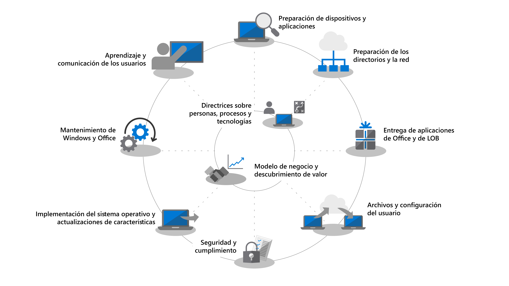
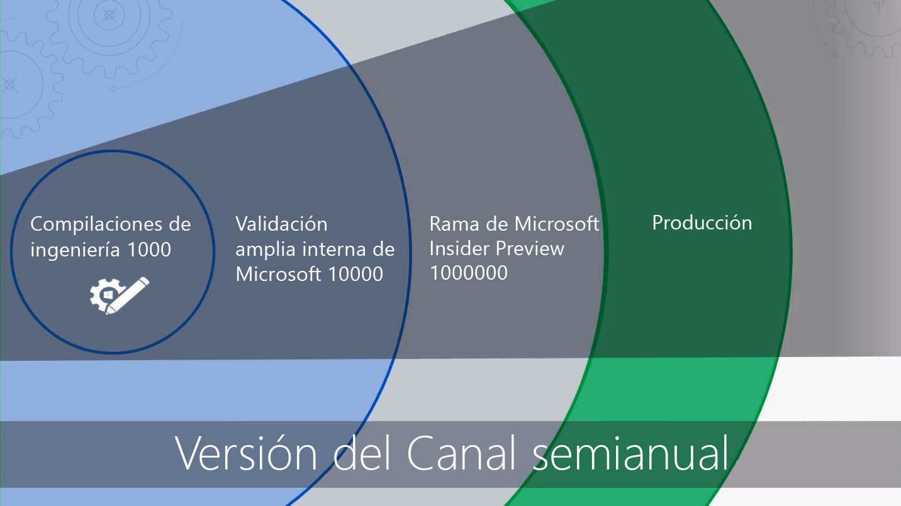

# Introducción: Implementación de escritorio

<table>
<thead>
<td></td>
<td>
<strong>Introducción: Orientaciones acerca de personas, procesos y tecnología</strong>

Descubra las ventajas de Windows 10 y Aplicaciones de Microsoft 365 para empresas, los cambios y consideraciones clave frente a implementaciones anteriores, y los procedimientos recomendados para garantizar un transición sin problemas a Windows 10 y Aplicaciones de Microsoft 365 para empresas.
</td>
<td></td>
</thead>
</table>

>[!NOTE]
>En esta serie explicaremos las mejores formas de usar herramientas existentes y le presentaremos tecnologías, servicios y métodos nuevos que puede aplicar gracias a la nube.  Para ver el proceso de implementación de escritorio completo, visite el [Centro de implementación de escritorio](https://aka.ms/HowToShift).
>

Le damos la bienvenida al Centro de implementación de escritorio, nuestro lugar central para obtener información acerca de cómo ayudarle a planear y realizar el cambio a Windows 10 y Aplicaciones de Microsoft 365 para empresas. Esto le permitirá aprovechar un área de trabajo segura, con las experiencias de colaboración, trabajo en equipo y productividad más recientes.

Si no ha implementado un nuevo entorno de escritorio desde hace un tiempo, la buena noticia es que ha mejorado mucho en el proceso de implementación. Los desafíos del pasado, como la compatibilidad de aplicaciones, son menos problemáticos hoy en día. Las nuevas herramientas, así como información entregada desde la nube, le permiten avanzar con confianza más rápido y de forma más eficaz que nunca.

En esta introducción vamos a explicar lo que ha cambiado y realizaremos un recorrido por el ciclo de implementación de escritorio. Esto le servirá de guía durante los pasos recomendados para su cambio a Windows 10 y Aplicaciones de Microsoft 365 para empresas, proporcionándole detalles sobre cómo aprovechar las herramientas y procesos existentes mientras adopta la tecnología y los enfoques de administración moderna.

## ¿Por qué actualizarse?

Combinados, Windows 10 y Microsoft Intelligence Cloud mejoran su capacidad para proporcionar el espacio de trabajo más potente y seguro para sus usuarios y le permiten simplificar su infraestructura de soporte.

Uno de los inquilinos clave de prácticas moderna son los dispositivos que siempre están actualizados. A través de esta serie se informará acerca de las nuevas funciones que se publican para ayudarle a cambiar a Windows 10 y Aplicaciones de Microsoft 365 para empresas y mantenerse al día con las versiones semestrales de ambos.

[Windows 10 para el profesional de TI](https://www.microsoft.com/itpro/windows-10)

[Acerca de Aplicaciones de Microsoft 365 para empresas](https://docs.microsoft.com/deployoffice/about-microsoft-365-apps)

## ¿Qué ha cambiado?

Comencemos echando un vistazo a lo que ha cambiado y mejorado desde su última implementación de escritorio. Si lleva tiempo sin cambiar de entorno de escritorio, es probable que siga usando Windows 7 y Office 2010 o 2013. En ese caso, verá que hay algunas cosas que han evolucionado desde su última actualización importante. Aquí describimos algunos de los cambios principales:

**Identidades y acceso:** Windows 10 y Aplicaciones de Microsoft 365 para empresas, con su conectividad a los servicios de administración, la seguridad y la productividad en la nube, tienen en su base un nuevo servicio de Administración de identidades y acceso: Azure Active Directory (Azure AD). Esto permite conectividad segura y el inicio de sesión único en los servicios de nube, lo que significa que va a necesitar Azure AD para aprovechar las ventajas de los servicios de Microsoft 365 como Office 365, Intune o Windows Autopilot.

[Microsoft 365](https://www.microsoft.com/microsoft-365/default.aspx)

**Entorno de inicio previo seguro:** el firmware de UEFI de 64 bits reemplaza a BIOS. Esto no solo acelera el tiempo de inicio, es necesario para habilitar muchas de las funciones de seguridad modernas en Windows 10. Aunque Windows 10 se ejecutará en BIOS, se recomienda encarecidamente UEFI. Si ha cambiado de BIOS a UEFI y usa la versión de 64 bits, ahora es el momento. Existen herramientas para ayudarle a realizar este cambio durante una actualización de Windows 10 o después de ella.

**Administración de dispositivos en la nube:** los servicios como Microsoft Intune le ayudan a administrar dispositivos de Windows 10 como lo haría con otros dispositivos móviles, todo desde un solo lugar. Lo que hace que Microsoft Intune sea único es la capacidad de administrar los dispositivos de Windows 10 con Microsoft Endpoint Configuration Manager. Puede usar Microsoft Endpoint Configuration Manager para facilitar el cambio a Windows 10 y después agregar Microsoft Intune. Trabajando juntos, Microsoft Endpoint Configuration Manager se convierte en la ventaja inteligente de su organización, conectada a la nube inteligente de Microsoft. Esto le permite administrar los dispositivos de los usuarios de forma segura estén donde estén, ya estén conectados en la infraestructura de su organización o en la nube pública.

[Administración conjunta para dispositivos con Windows 10](https://docs.microsoft.com/mem/configmgr/core/clients/manage/co-management-overview)

**Servicio de implementación basado en la nube:** hemos introducido un nuevo servicio de nube para ayudarle a implementar dispositivos Microsoft 365 a medida que adquiere nuevos equipos, el servicio de implementación Windows Autopilot. Autopilot se integra con los proveedores de hardware y los nuevos equipos se registran automáticamente en Autopilot, lo que permite que el nuevo equipo se envíe directamente a los usuarios finales. Cuando el equipo se encienda por primera vez se configura rápidamente con las opciones deseadas de la organización y se personaliza para las necesidades específicas del usuario.

[Windows Autopilot](https://www.microsoft.com/windowsforbusiness/windows-autopilot)

**Implementaciones de Hacer clic y ejecutar:** cuando aprovisiona aplicaciones de escritorio de Office, Aplicaciones de Microsoft 365 para empresas es la opción preferida. Le da acceso a las nuevas innovaciones de Office mientras se desarrollan, por lo que no tendrá que esperar años antes de obtener las nuevas funciones. También usará una nueva instalación denominada Hacer clic y ejecutar.

Hacer clic y ejecutar es bastante diferente de los paquetes basados en MSI del pasado. Hacer clic y ejecutar es más rápido, ligero y es compatible con las actualizaciones en segundo plano para que los usuarios se mantengan productivos. Sigue siendo una copia local de Office y aún puede usar las herramientas de implementación existentes, como Microsoft Endpoint Configuration Manager, para aprovisionar y configurar las aplicaciones.

[Guía de implementación de Aplicaciones de Microsoft 365](https://docs.microsoft.com/DeployOffice/deployment-guide-microsoft-365-apps)

**Actualizaciones semestrales:** una vez que haya cambiado a Windows 10 y Aplicaciones de Microsoft 365 para empresas, las actualizaciones se entregan de forma semestral con nuevas características. Pero con la capacidad de Microsoft de ofrecer información de la nube para ayudarle, puede implementar rápidamente y con confianza estas actualizaciones a cientos o miles de dispositivos. Como una actualización local, la actualización de características conserva aplicaciones, datos y configuraciones de la versión anterior.

## El ciclo de proceso de implementación

Antes de empezar, deberá crear un plan de alto nivel y obtener a el respaldo de los patrocinadores necesarios. La rueda del proceso de implementación describe los pasos más importantes para ayudarle a identificar los recursos y los miembros del equipo principales que deberá administrar en las siguientes áreas de la implementación.

**[Paso 1: Disponibilidad de aplicaciones y dispositivos](https://aka.ms/mdd1) ** Para una implementación correcta debe conocer lo que tiene. Eso significa que debe realizar un inventario de los dispositivos y las aplicaciones y comprobar la compatibilidad. Para ayudarle con esto puede aprovechar las herramientas disponibles en nuestro servicio basado en la nube, Desktop Analytics. Desktop Analytics le permite aprovechar la inteligencia de compatibilidad y los datos de diagnóstico recopilados en cientos de millones de equipos, para evaluar las aplicaciones y los controladores en el dispositivo para poder establecer la preparación de sus equipos. Incluso puede exportar una lista de "Equipos listos para la implementación" de Desktop Analytics a Configuration Manager si lo usa, lo que le permite crear colecciones basadas en datos de equipos de destino cuando estén listos.

[Empezar con Upgrade Readiness](https://docs.microsoft.com/windows/deployment/upgrade/upgrade-readiness-get-started)

**[Paso 2: Preparación de red y de directorio](https://aka.ms/mdd2) ** Si todavía no lo ha hecho, después deberá implementar Azure Active Directory para la administración de acceso y de identidad. También tendrá que preparar su red en el movimiento de las imágenes del sistema, los paquetes de aplicaciones, los archivos de usuario y las actualizaciones por ella. Eso implica una gran cantidad de datos adicionales. La red debe tener la capacidad de soportar esta carga adicional sin afectar a las tareas diarias de su organización. Tenemos un rango de optimizaciones de red disponibles en las opciones de punto a punto y de limitación de ancho de banda para la limpieza de ancho de banda dinámica y la actualización diferencial.

[Windows BranchCache frente a caché del mismo nivel](https://blogs.technet.microsoft.com/swisspfe/2018/01/25/branch-cache-vs-peer-cache/)

**[Paso 3: Entrega aplicaciones de línea de negocio y de Office](https://aka.ms/mdd3) ** Aunque Windows sigue admitiendo instalaciones basadas en MSI, ahora también admite mecanismos de instalaciones más recientes, optimizados para la distribución automática y las actualizaciones continuas. Los clientes de las Aplicaciones de Microsoft 365 para empresas y Office 2019 usan la tecnología de instalación Clic para ejecutar. Le recomendamos que haga que un rango de aplicaciones de UWP estén disponibles, y es posible que implemente aplicaciones de línea de negocios internas y aplicaciones de terceros que usan las nuevas aplicaciones de empaquetado basado en MSIX. Este paso asegura que las aplicaciones están preparadas para la implementación automatizada, y que todo saldrá bien, independientemente de si usa aplicaciones Hacer clic y ejecutar, MSIX, convencionales basadas en MSI o UWP implementadas desde un Microsoft Store para Empresas que configure.

[MSIX Intro](https://blogs.msdn.microsoft.com/sgern/2018/06/15/msix-intro/)

**[Paso 4: Migración de los archivos y la configuración del usuario](https://aka.ms/mdd4)** Este es un paso crítico en cualquier sustitución de PC o ciclo de actualización: tiene que asegurarse de que los archivos, datos y configuración de los usuarios se trasladan con éxito y se preservan durante la migración. Este paso cubre las opciones disponibles para migraciones manuales o automatizadas, incluyendo opciones conocidas y nuevas.

Como en anteriores actualizaciones, la Herramienta de migración de estado de usuario sigue siendo una herramienta valiosa para automatizar este proceso y sigue siendo una parte integral de las migraciones organizadas con Microsoft Endpoint Configuration Manager o Microsoft Deployment Toolkit. Pero mover todos los datos durante la migración puede ser un cuello de botella de intervalos para la sustitución de equipos debido a la física de transferir hasta cientos de gigabytes por equipo dos veces: primero desde el escritorio existente y después al nuevo escritorio. Una nueva opción que permite OneDrive conocida como Mover a carpeta conocida se utiliza para sincronizar archivos, documentos e imágenes a escala a la nube antes de la implementación.

[Redirigir y mover las carpetas conocidas de Windows a OneDrive](https://docs.microsoft.com/onedrive/redirect-known-folders)

**[Paso 5: Seguridad y cumplimiento](https://aka.ms/mdd5)** El área de seguridad y cumplimiento tiene muchas ventajas a la hora de trasladarse a Windows 10 y Aplicaciones de Microsoft 365 para la empresa. Es importante que se familiarice con las nuevas características integradas y las compare con lo que ya tiene. Por ejemplo, las nuevas capacidades de Windows 10 con seguridad basada en virtualización pueden evitar el robo de credenciales, proteger contra vulnerabilidades del navegador y la ejecución de código malicioso al aislar los procesos principales y secretos del sistema operativo. Además, los servicios de la nube como Advanced Threat Protection proporcionan una plataforma unificada para fortalecimiento de la seguridad, detección de incursiones, investigación y respuesta. Advanced Threat Protection también puede protegerle contra archivos adjuntos de correo, hipervínculos poco seguros y mucho más.

[Microsoft Security](https://www.microsoft.com/security/default.aspx)

**[Paso 6: Implementación del sistema operativo y actualizaciones de características](https://aka.ms/mdd6)** Con todo preparado, el siguiente paso consiste en implementar las imágenes del sistema operativo. Gran parte del trabajo puede realizarse con la infraestructura y las secuencias de tareas de System Center Configuration Manager. La estrategia recomendada consiste en realizar un despliegue por fases, primero con la implementación en un "grupo preferente" de su organización que disponga del mismo conjunto representativo de hardware y aplicaciones. Después, puede usar los datos de esos dispositivos y usuarios para realizar la implementación en más PC.

[Introducción a la implementación de un sistema operativo en Configuration Manager](https://docs.microsoft.com/mem/configmgr/osd/understand/introduction-to-operating-system-deployment)

**[Paso 7: Windows y Office como servicio](https://aka.ms/mdd7) ** Esto representa un gran cambio en la manera de mantener los escritorios de los usuarios. Con el cambio a Windows 10 y Aplicaciones de Microsoft 365 para empresas puede pasar a administrar Windows y Office como un servicio. En lugar de un cambio masivo en tecnología cada pocos años, introducirá continuamente nuevas funciones, experiencias y protecciones para el usuario. Las actualizaciones de características semestrales ofrecen nuevas funciones en el otoño y la primavera de cada año, mientras que las actualizaciones acumulativas mensuales contienen correcciones de errores, de fiabilidad y de seguridad. Aunque puede optar por implementar al cliente de Office 2019, le recomendamos cambiar a Aplicaciones de Microsoft 365 para empresas. Este sigue un plan de servicio similar a Windows por lo que los usuarios también reciben actualizaciones para las aplicaciones de Office de forma regular.

[Información general de Windows como servicio](https://docs.microsoft.com/windows/deployment/update/waas-overview)
[Información general de Office como servicio](https://docs.microsoft.com/DeployOffice/overview-update-channels)

**[Paso 8: Comunicaciones y aprendizaje de usuario](https://aka.ms/mdd8) ** Este último paso es fundamental para fomentar el uso de las nuevas funcionalidades para mejorar el trabajo en equipo, las comunicaciones, la seguridad y mucho más. Antes de que la implementación se dirija a usuarios ajenos a los círculos de usuarios pioneros, le recomendamos que publique aprendizaje y comunicaciones de usuarios. Esto le ayudará a impulsar cambios deseados en cómo acceden a las nuevas capacidades de Office, Windows u otras aplicaciones y servicios de línea de negocio. Para ayudarle, proporcionamos formación en línea gratuita a través de Microsoft FastTrack. Además, hemos publicado planes de comunicación y escalas de tiempo de muestra gratuitos junto con plantillas de correo electrónico, redes social e intranet para ayudarle con la implementación de Windows 10. Como una organización de Microsoft 365, su organización también puede ser elegible para soporte directo.

## Siguiente paso

Ahora conoce las novedades y diferencias en Windows 10 y Aplicaciones de Microsoft 365 para empresas, y hemos tratado la rueda de proceso de implementación recomendada. Con esta introducción de las instrucciones de punto a punto y las herramientas disponibles para realizar el cambio a Windows 10 y Aplicaciones de Microsoft 365 para empresas, empecemos.

## [Paso 1: Preparación de dispositivos y aplicaciones](https://aka.ms/mdd1)

