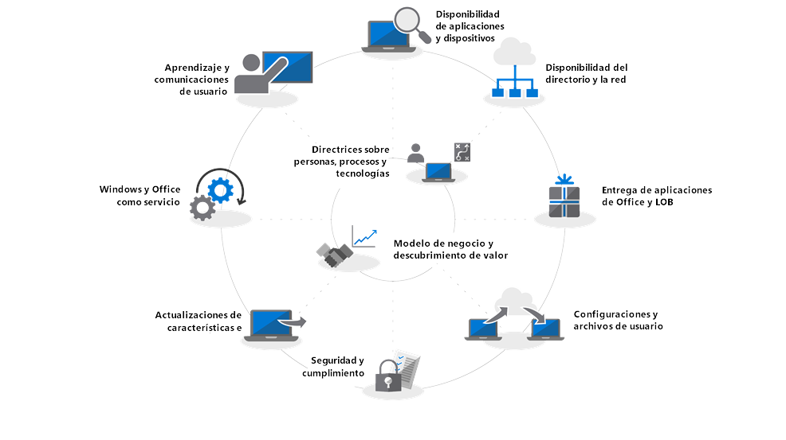

# Introducción: Implementación de escritorios modernosGetting Started - Modern Desktop Deployment

La nube está cambiando la manera de administrar los equipos PC y Microsoft Intelligent Cloud proporciona información para ayudar a los profesionales de TI a cambiar a un escritorio moderno. Esta serie está diseñada para ayudarle a planificar y realizar el cambio a un escritorio moderno con Windows 10 y Office 365 ProPlus.The Cloud is changing how management of PCs is be done, with the Microsoft Intelligent Cloud delivering actional insights to help IT Professionals shift to a modern desktop. This series designed to help you plan for and make the shift to a modern desktop based on Windows 10 and Office 365 ProPlus.

<table>
<thead>
<td></td>
<td>
<strong>Introducción: Orientaciones sobre personas, procesos y tecnología</strong><strong>Getting Started: People, Process and Technology Guidance</strong>

Descubra las ventajas de un escritorio moderno, cambios y consideraciones clave frente a implementaciones anteriores, y los procedimientos recomendados para garantizar un transición sin problemas a Windows 10 y Office 365 ProPlus.Discover the benefits of a modern desktop, major changes and considerations versus previous deployments and best practices to ensure a smooth transition to Windows 10 and Office 365 ProPlus.
</td>
<td></td>
</thead>
</table>

>[!NOTE]
>En esta serie explicaremos las mejores formas de usar herramientas existentes y le presentaremos tecnologías, servicios y métodos nuevos que puede aplicar gracias a la nube. Para ver el proceso de implementación de escritorio completo, visite el [Centro de implementación de escritorios modernos](https://aka.ms/HowToShift).In this series we will explain the best ways to use existing tools, and introduce you to new technologies, services and methods enabled by the Cloud.  To see the full desktop deployment process, visit the [Modern Desktop Deployment Center](https://aka.ms/HowToShift).
>

Bienvenido al Centro de implementación de escritorios modernos, el lugar principal donde aprenderá cómo planificar y realizar el cambio a un escritorio moderno. Esto le permitirá aprovechar las ventajas de un espacio de trabajo seguro con lo último en tecnología de productividad, trabajo en equipo y colaboración.Welcome to the Modern Desktop Deployment Center, our central place to learn how to help you plan and make the shift to the modern desktop. This will allow you take advantage of a secure workspace, powered by the latest productivity, teamwork and collaboration experiences.

Si lleva tiempo sin implementar ningún entorno de escritorio, la buena noticia es que se ha mejorado gran parte del proceso de implementación. Los retos del pasado, como la compatibilidad de aplicaciones ya no son un problema hoy en día y las herramientas e información que proporciona la nube le permitirán avanzar con confianza, más rápido y de forma más eficiente que antes.If you haven’t deployed a new desktop environment for a while, the good news is much about the deployment process has improved. Challenges of the past, such as application compatibility, are much less of an issue today and new tools, and insight delivered from the Cloud, enable you to move forward with confidence, faster and more efficiently than ever before.

En esta introducción vamos a explicar lo que ha cambiado y realizaremos un recorrido por el ciclo de implementación de escritorio. Esto le servirá de guía durante los pasos recomendados para su cambio a Windows 10 y Office 365 ProPlus, proporcionándole detalles sobre cómo aprovechar las herramientas y procesos existentes mientras adopta la tecnología y los enfoques de administración moderna.In this introduction we’ll outline what has changed and go on a tour of the Desktop Deployment Wheel. This will guide you through the recommended steps for your shift to Windows 10 and Office 365 ProPlus, detailing how to leverage your existing tools and processes while adopting modern management technology and approaches along the way.

## ¿Por qué actualizarse?Why upgrade?

Combinados, Windows 10 y Microsoft Intelligence Cloud mejoran su capacidad para proporcionar el espacio de trabajo más potente, enriquecido y seguro para sus usuarios y le permite simplificar su infraestructura de soporte.In combination, Windows 10 and the Microsoft Intelligence Cloud enhance your ability to deliver the most empowering, rich and secure Workspace for your users, and allow you to simplify your supporting infrastructure.

Uno de los inquilinos clave de las prácticas de administración modernas es contar con dispositivos que siempre estén actualizados. Durante esta serie, comprobará las nuevas capacidades que le ayudarán a pasar a Windows 10 y Office 365 ProPlus y verá cómo estar al día de las versiones semianuales de ambos.One of the key tenants of modern management practices is devices that are always up-to-date. Through this series you are going to see new capabilities that are being delivered to help you move to Windows 10 and Office 365 ProPlus and how to stay current with the semi-annual releases of both.

[Windows 10 para el profesional de TIWindows 10 for the IT Pro](https://www.microsoft.com/es-ES/itpro/windows-10)

## ¿Qué ha cambiado?What has Changed

Comencemos echando un vistazo a lo que ha cambiado y mejorado desde su última implementación de escritorio. Si lleva tiempo sin cambiar de entorno de escritorio, es probable que siga usando Windows 7 y Office 2010 o 2013. En ese caso, verá que hay algunas cosas que han evolucionado desde su última actualización importante. Aquí describimos algunos de los cambios principales:Let’s start by taking a look at what has changed and improved since your last desktop deployment. If you haven’t shifted your desktop environment in a while you’re likely using Windows 7 and Office 2010 or Office 2013. If you are, you'll notice a few things have evolved since your last major upgrade. Here are some of the core changes:

**Administración de identidades y acceso** El escritorio moderno, con su conectividad a los servicios de productividad, seguridad y administración, tiene como núcleo un servicio nuevo de administración de identidad y acceso: Azure Active Directory. Esto permite un inicio de sesión único y conectividad segura a través de sus servicios en la nube, lo que significa que necesitará contar con Azure AD. Esto le permitirá aprovechar los servicios de Microsoft 365 como Office 365, Intune o Windows Autopilot.**Identity and Access Management** The modern desktop, with its connectivity to cloud productivity, security and management services, has, at its core, a new Identity and Access Management service: Azure Active Directory. This enables single sign-on and secure connectivity across your cloud services. That means you are going to need Azure AD in place. This will allow you take advantage of advantage of Microsoft 365 services such as Office 365, Intune, or Windows Autopilot.

[Microsoft 365Microsoft 365](https://www.microsoft.com/es-ES/microsoft-365/default.aspx)

**Proteger el entorno previo al inicio** El firmware UEFI de 64 bits sustituye a la BIOS. Esto no solo acelera el tiempo de inicio, también es necesario para habilitar muchas de las capacidades de seguridad modernas de Windows 10. Windows 10 puede ejecutarse en la BIOS, pero recomendamos encarecidamente UEFI. Si aún no ha cambiado de BIOS a UEFI y 64 bits, ahora es el momento. Hay herramientas que le ayudarán a realizar este cambio tanto durante una actualización de Windows 10 como al terminarla.**Secure Pre-Boot Environment** 64-bit UEFI firmware replaces BIOS. This not only speeds up boot times, it is required to enable many of the modern security capabilities in Windows 10. Windows 10 will run on BIOS but UEFI is strongly recommended. If you have not switched from BIOS to UEFI and 64-bit, now is the time. There are tools to help you make this switch either during a Windows 10 upgrade, or after it.

[Pasar de BIOS a UEFI con MBR2GPTConvert from BIOS to UEFI with MBR2GPT](https://technet.microsoft.com/es-ES/windows/mt782786.aspx)

**Administración de dispositivos en la nube** Servicios como Microsoft Intune le permiten administrar sus dispositivos con Windows 10 igual que con otros dispositivos móviles, desde un mismo sitio. Lo que hace único a Microsoft Intune es la habilidad de coadministrar sus dispositivos con System Center Configuration Manager. Puede usar System Center Configuration Manager para cambiar a Windows 10 y, a continuación, añadir Microsoft Intune. Juntos, System Center Configuration Manager se convierte en una ventaja inteligente para su organización, conectada a la nube inteligente de Microsoft. Esto le permite administrar los dispositivos de sus usuarios de forma segura estén donde estén, tanto si están conectados a su organización como a la nube pública.**Cloud-based device Management** Services like Microsoft Intune you manage your Windows 10 devices as you do other mobile devices, all from one place. What makes Microsoft Intune unique is the ability to co-manage your Windows 10 devices with System Center Configuration Manager. You can use System Center Configuration Manager to help you in your shift to Windows 10, and then add Microsoft Intune. Working together, System Center Configuration Manager becomes the intelligent Edge within your organization, connected to the Microsoft intelligent cloud. This allows you to manage your users’ devices securely wherever they are, whether connected on your organization’s or in the public cloud.

[Administración conjunta para dispositivos con Windows 10Co-management for Windows 10 devices](https://docs.microsoft.com/es-ES/sccm/core/clients/manage/co-management-overview)

**Servicio de implementación en la nube** Los equipos PC que compre incluyen un nuevo servicio de nube que le ayudará a implementar dispositivos Microsoft 365. Recibe el nombre de servicio de entregas de Windows Autopilot. AutoPilot está integrado con su hardware y los nuevos equipos se registran en AutoPilot. Esto permite enviar el nuevo equipo directamente al usuario final. Al iniciar el equipo por primera vez, se configura con rapidez según la configuración deseada y personalizada para seguir las necesidades específicas del usuario.**Cloud-based Deployment Service** As you acquire new PCs, we’ve introduced a new cloud service to help you deploy Microsoft 365 devices. It is called the Windows Autopilot deployment service. AutoPilot is integrated with your hardware providers and new PCs are automatically registered in Auto Pilot. This enabling the new PC to be shipped directly to the end-user. When the PC is powered on the first time it is quickly configured to your organizations desired configuration and customized for the specific needs of the user.

[Windows AutopilotWindows Autopilot](https://www.microsoft.com/es-ES/windowsforbusiness/windows-autopilot)

**Hacer clic y ejecutar implementaciones** Al aprovisionar aplicaciones de escritorio de Office, Office 365 ProPlus es la opción preferida. Esto le otorga acceso a las innovaciones más modernas en Office conforme son desarrolladas, por lo que no tendrá que esperar años hasta obtener algo nuevo. También usará un sistema de instalación denominado Hacer clic y ejecutar (Click-to-Run).**Click-to-Run Deployments** When provisioning Office desktop apps, Office 365 ProPlus is the preferred option. This gives you access to the newest innovations in Office as they are developed, so you won’t need to wait years before getting new capabilities. You’ll also use a new installation called Click-to-Run.

Hacer clic y ejecutar es muy diferente de los antiguos paquetes basados en MSI. Es más rápido, más ligero y usa transmisión de programas para permitir a los usuarios tenerlo todo listo en apenas unos minutos, además de actualizarse en segundo plano. No se preocupe, sigue siendo una copia local de Office y puede seguir usando sus herramientas de implementación existentes (como System Center Configuration Manager) para aprovisionar y configurar las aplicaciones.Click-to-Run quite different from the MSI-based packages of the past. Click-to-Run is faster, lighter, and it uses program streaming to allow users to be up and running in just minutes, and to be updated in the background. Don’t worry, it is still a local copy of Office, and you can continue to use your existing deployment tools – like System Center Configuration Manager – to provision and configure the apps.

[Guía de implementación de Office 365 ProPlusDeployment guide for Office 365 ProPlus](https://docs.microsoft.com/es-ES/DeployOffice/deployment-guide-for-office-365-proplus)

**Actualizaciones semestrales** Una vez que se haya pasado a Windows 10 y Office 365 ProPlus, las actualizaciones con nuevas características se realizarán de forma semestral. Pero con Microsoft y su capacidad de proporcionar información de la nube para ayudarle, podrá aplicar estas actualizaciones con rapidez y seguridad a cientos o miles de dispositivos. Como una actualización local, las actualizaciones de características conservan las aplicaciones, los datos y la configuración de la versión anterior.**Semi-Annual Updates** Once you have moved to Windows 10 and Office 365 ProPlus, updates are delivered semi-annually with new features. But with Microsoft able to deliver insights from the Cloud to help you, you can quickly and confidently roll out these updates to hundreds or thousands of devices. Like an in-place upgrade, the Feature Update preserves apps, data and configurations from the previous release.

## El ciclo de proceso de implementaciónThe Deployment Process Wheel

Antes de empezar, querrá crear un plan de alto nivel y convencer a los patrocinadores necesarios. Nuestro ciclo de proceso de desarrollo describe los pasos críticos para ayudarle a identificar a los miembros y los recursos centrales del equipo que debe administrar en las siguientes áreas de implementación.Before you get started, the you’ll want to create a high-level plan and get the necessary sponsors on board. Our deployment process wheel outlines critical steps to help you to identify core team members and resources to manage in the following deployment areas.

**[Paso 1: Preparación de dispositivos y aplicaciones](https://aka.ms/mdd1)** Para poder realizar una implementación con éxito debe saber antes con qué cuenta. Esto significa realizar un inventario de sus dispositivos y aplicaciones y verificar su compatibilidad.**[Step 1: Device and App readiness](https://aka.ms/mdd1)** For a successful deployment you must first know what you have. That means taking an inventory of your devices and apps and verifying compatibility.

Para ayudarle con esto, cuenta con herramientas disponibles en nuestro servicio en la nube, Windows Analytics. Windows Analytics le permite consultar la información de compatibilidad y telemetría recopilada de cientos de millones de PC para valorar las aplicaciones y controladores que se ejecutan en su dispositivo, lo que le permite establecer el estado de preparación del estado de su escritorio. Incluso puede exportar una lista de "PC listos para la implementación" de Windows Analytics a System Center Configuration Manager si lo usa, lo que le permite implementar colecciones basadas en datos de los equipos PC de destino en cuanto están disponibles.To help with this you can tools available in our cloud-based service, Windows Analytics. Windows Analytics allows you tap into compatibility intelligence and telemetry gathered from hundreds of millions of PCs, to assess the apps and drivers running on your device so you can establish the readiness of your desktop estate. You can even export a list of “PCs ready for deployment” from Windows Analytics to System Center Configuration Manager if you use it, allowing you to build data-driven collections of targeted PCs as they become ready.

[Empezar con Upgrade ReadinessGet started with Upgrade Readiness](https://docs.microsoft.com/es-ES/windows/deployment/upgrade/upgrade-readiness-get-started)

**[Paso 2: Preparación de los directorios y la red](https://aka.ms/mdd2)** A continuación, si aún no lo ha hecho, querrá implementar Azure Active Directory para la administración de acceso e identidad. También deberá preparar su red para el movimiento de imágenes de sistema, paquetes de aplicaciones, archivos de usuario y actualizaciones. Esto significa una gran cantidad de datos adicionales que su red debe poder gestionar sin que afecte al trabajo diario de su organización. Tenemos una amplia gama de optimizaciones disponibles, desde la aceleración de la banda ancha y las opciones de punto a punto, al aprovechamiento de banda ancha dinámica y diferencial.**[Step 2: Directory and Network Readiness](https://aka.ms/mdd2)** If you haven’t already, you’ll want to implement Azure Active Directory for identity and access management next. You will also want to prepare your network for the movement of system images, application packages, user files and updates across it. That means a large amount of additional data; your network must have the capacity to handle this extra load without impact to the day-to-day work of your organization. We have a range of networking optimizations available from bandwidth throttling and peer-to-peer options to dynamic bandwidth scavenging and differential updating.

[Windows BranchCache frente a caché del mismo nivelBranchCache vs. Peer Cache](https://blogs.technet.microsoft.com/swisspfe/2018/01/25/branch-cache-vs-peer-cache/)

**[Paso 3: Entrega de aplicaciones de Office y de línea de negocio](https://aka.ms/mdd3)** Mientras Windows sigue siendo compatible con instalaciones basadas en MSI, ahora también lo es con nuevos mecanismos de instalación, optimizados para la implementación automatizada y las actualizaciones continuas. Los clientes de Office 365 ProPlus y Windows 2019 utilizan la tecnología Hacer clic y ejecutar, por lo que puede que desee tener a su disposición una variedad de aplicaciones UWP, y puede que cada vez necesite implementar más aplicaciones de terceros y de línea de negocio desarrolladas externamente que usan las nuevas aplicaciones basadas en MSIX. Este paso asegura que las aplicaciones estén listas para implementaciones automatizadas y que usted esté preparado para el éxito tanto si sus aplicaciones se instalan con Hacer clic y ejecutar, MSIX, MSI tradicional, como si se trata de aplicaciones UWP implementadas de una Microsoft Store de negocios que ha establecido.**[Step 3: Office and Line of Business App Delivery](https://aka.ms/mdd3)** While Windows continues to support MSI-based installations it also now supports newer installations mechanisms, optimized for automated deployment and continuous updates. Office 365 ProPlus and Windows 2019 clients use Click-to-Run, you may want to make a range of UWP apps available, and you may increasingly find yourself deploying third-party apps and in-house developed Line of Business Apps that use the new MSIX-based packaging apps. This step ensures your apps are ready for automated deployments, and that you are set up for success whether your apps deploy using Click-to-Run, MSIX, conventional MSI-based, or are UWP apps deployed from a Microsoft Store from Business you set up.

[MSIX IntroMSIX Intro](https://blogs.msdn.microsoft.com/sgern/2018/06/15/msix-intro/)

**[Paso 4: Migración de los archivos y la configuración del usuario](https://aka.ms/mdd4)** Este es un paso crítico en cualquier sustitución de PC o ciclo de actualización: tiene que asegurarse de que los archivos, datos y configuración de los usuarios se trasladan con éxito y se preservan durante la migración. Este paso cubre las opciones disponibles para migraciones manuales o automatizadas, incluyendo opciones conocidas y nuevas.**[Step 4: User Files and Settings Migration](https://aka.ms/mdd4)** This is a critical step in any PC replacement or refresh cycle: you have to ensure users’ files, data and settings move successfully and are preserved over the migration. This step covers the options available for manual or automated migrations, including well-known and new options.

Al igual que en actualizaciones anteriores, la Herramienta de migración de estado de usuario sigue siendo valiosa en este proceso y es una parte integral de las migraciones preparadas con System Center Configuration Manager o el kit de Microsoft Deployment. Pero, en ocasiones, trasladar todos estos datos durante una migración puede formar cuello de botella para el equipo PC sustituto debido a las físicas involucradas en la transferencia de cientos de gigabytes por PC en dos ocasiones: primero, desde el escritorio existente y luego de vuelta al escritorio nuevo. Una nueva opción activada por OneDrive se trata de Movimiento de carpeta conocida cuyo objetivo es sincronizar, documentos de usuario, fotografías y archivos de fondo. A escala, en la nube, por delante de los pagos.As in previous upgrades, the User State Migration Tool continues to be a valuable tool to automate this process and it remains an integral part of migrations orchestrated using System Center Configuration Manager or the Microsoft Deployment Toolkit. But moving all this data at migration can be a timing bottleneck for PC replacement, due to the physics involved in transferring sometimes hundreds of gigabytes per PC twice – first from the existing desktop, then back down to the new desktop. A new option enabled by OneDrive is Known Folder Move is to sync user documents, pictures and desktop files, at scale, in the cloud, ahead of deployment.

[Redirigir y mover las carpetas conocidas de Windows a OneDriveRedirect and move Windows known folders to OneDrive](https://docs.microsoft.com/es-ES/onedrive/redirect-known-folders)

**[Paso 5: Seguridad y cumplimiento](https://aka.ms/mdd5)** El área de seguridad y cumplimiento tiene muchas ventajas a la hora de trasladarse a Windows 10 y Office 365 ProPlus. Es importante que se familiarice con las nuevas características integradas y las compare con lo que ya tiene. Por ejemplo, las nuevas capacidades de Windows 10 con seguridad basada en virtualización pueden evitar el robo de credenciales, proteger contra vulnerabilidades del navegador y la ejecución de código malicioso al aislar los procesos principales y secretos del sistema operativo. Además, los servicios de la nube como Advanced Threat Protection proporcionan una plataforma unificada para fortalecimiento de la seguridad, detección de incursiones, investigación y respuesta. Advanced Threat Protection también puede protegerle contra archivos adjuntos de correo, hipervínculos poco seguros y mucho más.**[Step 5: Security and Compliance](https://aka.ms/mdd5)** Security and Compliance is an area with a lot upside when moving to Windows 10 and Office 365 ProPlus. It is important you familiarize yourself with the new built-in capabilities and compare that with what you already have. For example, new capabilities in Windows 10 using virtualization-based security can prevent credential theft, protect against browser-based exploits and malicious code execution by isolating core processes and secrets from the operating system. In addition, cloud services like Advanced Threat Protection give you a unified platform for security hardening, post-breach detection, investigation, and response. Advanced Threat Protection can also safeguard you against malicious email attachments, unsafe hyperlinks and more.

[Microsoft SecurityMicrosoft Security](https://www.microsoft.com/es-ES/security/default.aspx)

**[Paso 6: Implementación del sistema operativo y actualizaciones de características](https://aka.ms/mdd6)** Con todo preparado, el siguiente paso consiste en implementar las imágenes del sistema operativo. Gran parte del trabajo puede realizarse con la infraestructura y las secuencias de tareas de System Center Configuration Manager. La estrategia recomendada consiste en realizar un despliegue por fases, primero con la implementación en un "grupo preferente" de su organización que disponga del mismo conjunto representativo de hardware y aplicaciones. Después, puede usar los datos de esos dispositivos y usuarios para realizar la implementación en más PC.**[Step 6: OS Deployment and Feature Updates](https://aka.ms/mdd6)** With everything prepared, the next step is to deploy the OS images. A lot of the heavy lifting for can be done using System Center Configuration Manage task sequences and infrastructure. The recommended approach is to deploy in phases, first targeting and deploying to an “early adopter group” in your organization using a representative set of hardware and apps. You can then use the data from those devices and users to gradually target more and more PCs.

[Introducción a la implementación de un sistema operativo en System Center Configuration ManagerIntroduction to operating system deployment in System Center Configuration Manager](https://docs.microsoft.com/es-ES/sccm/osd/understand/introduction-to-operating-system-deployment)

**[Paso 7: Windows y Office como servicio](https://aka.ms/mdd7)** Esto representa un cambio importante en la forma en la que mantiene el escritorio. Con este movimiento de Windows 10 (-y Office 365 ProPlus) puede pasar a administrar Windows (y Office) como un servicio. En vez de un enorme intercambio de tecnología cada pocos años, seguirá aportando nuevas capacidades, experiencias y protección al usuario. Las actualizaciones importantes semestrales se implementarán en otoño y primavera de cada año, mientras que las actualizaciones de calidad contendrán seguridad, confianza y corrección de errores. Aunque puede desplegar clientes de Office 2019, recomendamos que se pase a Office ProPlus. Sigue un plan de servicio parecido para Windows, por lo que sus usuarios recibirán aplicaciones para las aplicaciones de Office con regularidad.**[Step 7: Windows and Office as a Service](https://aka.ms/mdd7)** This represents a major shift in the way you maintain users’ desktop real-estate. With this move to Windows 10 (and Office 365 ProPlus) you can move to managing Windows (and Office) as a service. In place of a massive shift in technology every few years, you will continually be bringing new capabilities, experiences and protections to your user. Semi-annual feature updates deliver new capabilities in the Fall and Spring of each year, while monthly cumulative Quality Updates will contain security, reliability and bug fixes. While you can opt to deploy Office 2019 clients, we strongly recommend you to move to Office ProPlus. This follows a similar service plan to Windows, so your users get updates to the Office apps on a regular basis too.

[Información general sobre Windows como servicioOverview of Windows as a service](https://docs.microsoft.com/es-ES/windows/deployment/update/waas-overview)

**[Paso 8: Comunicación con los usuarios y aprendizaje](https://aka.ms/mdd8)** Este último paso es crítico para impulsar el uso de nuevas capacidades para mejorar el trabajo en equipo, las comunicaciones, la seguridad y demás. Antes de que la implementación principal se lleve a usuarios fuera del grupo inicial, le recomendamos iniciar las comunicaciones de usuario y la formación. Esto ayudará a impulsar los cambios deseados en el uso que realicen los usuarios de las nuevas capacidades de Office, Windows y otras aplicaciones y servicios de línea de negocios. Para apoyarle, proporcionamos formación gratuita en línea a través de Microsoft FastTrack. Además, hemos publicado una muestra gratuita de planes de comunicación y líneas de tiempo junto a plantillas de correo, sociales y de intranet para ayudarle con su despliegue de Windows 10. Además, como organización de Microsoft 365 o de Office 365, su organización puede recurrir al soporte directo.**[Step 8: User Communications and Training](https://aka.ms/mdd8)** This last step is critical to driving usage of new capabilities for enhancing teamwork, communications, security and more. Before broad deployment is targeted to users outside early adopter rings, we recommend you roll out user communication and training. This will help drive desired changes in how people use new capabilities in Office, Windows or other line of business apps and services. To assist, we provide free online training via Microsoft FastTrack. Plus, we’ve published free sample communication plans and timelines together with email, social and intranet templates to help with your rollout of Windows 10. As a Microsoft 365 or Office 365 organization, your organization may also be eligible for and direct support.

## Paso siguienteNext Step

Ahora conoce las novedades y le hemos mostrado nuestro proceso de implementación recomendado. Con esta introducción como guía y las herramientas disponibles para realizar el cambio a un escritorio moderno, pongámonos manos a la obra.Now you know what’s new and different, and we have walked through our recommended deployment process wheel. With this taste for the end-to-end guidance and tools available for you to make the shift a modern desktop, let’s get started.

## [Paso 1: Preparación de dispositivos y aplicacionesStep 1: Device and App Readiness](https://aka.ms/mdd1)

