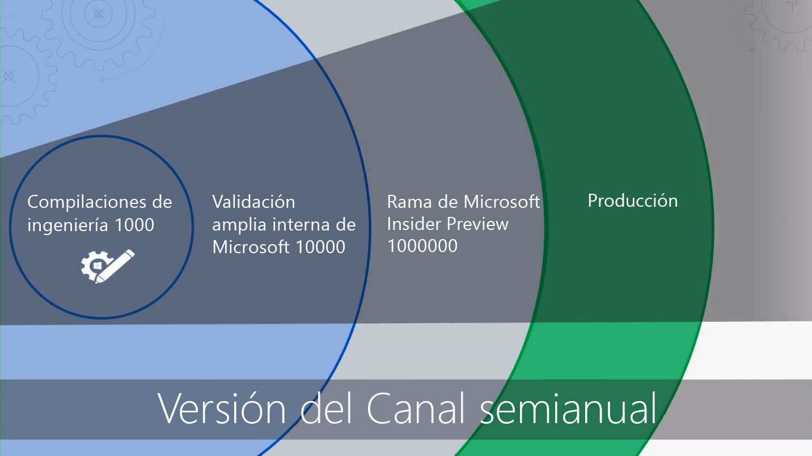

# Introducción: Implementación de escritorioGetting Started - Desktop Deployment

<table>
<thead>
<td></td>
<td>
<strong>Introducción: Orientaciones acerca de personas, procesos y tecnología</strong><strong>Getting Started: People, Process and Technology Guidance</strong>

Descubra las ventajas de Windows 10 y Office 365 ProPlus, los cambios y consideraciones clave frente a implementaciones anteriores, y los procedimientos recomendados para garantizar un transición sin problemas a Windows 10 y Office 365 ProPlus.Discover the benefits of Windows 10 and Office 365 ProPlus, major changes and considerations versus previous deployments, and best practices to ensure a smooth transition to Windows 10 and Office 365 ProPlus.
</td>
<td></td>
</thead>
</table>

>[!NOTE]
>En esta serie explicaremos las mejores formas de usar herramientas existentes y le presentaremos tecnologías, servicios y métodos nuevos que puede aplicar gracias a la nube.In this series we will explain the best ways to use existing tools and introduce you to new technologies, services, and methods enabled by the Cloud.  Para ver el proceso de implementación de escritorio completo, visite el [Centro de implementación de escritorio](https://aka.ms/HowToShift).To see the full desktop deployment process, visit the [Desktop Deployment Center](https://aka.ms/HowToShift).
>

Le damos la bienvenida al Centro de implementación de escritorio, nuestro lugar central para obtener información acerca de cómo ayudarle a planear y realizar el cambio a Windows 10 y Office 365 ProPlus.Welcome to the Desktop Deployment Center, our central place to learn how to help you plan and make the shift to Windows 10 and Office 365 ProPlus. Esto le permitirá aprovechar un área de trabajo segura, con las experiencias de colaboración, trabajo en equipo y productividad más recientes.This will allow you take advantage of a secure workspace, powered by the latest productivity, teamwork, and collaboration experiences.

Si no ha implementado un nuevo entorno de escritorio desde hace un tiempo, la buena noticia es que ha mejorado mucho en el proceso de implementación.If you haven’t deployed a new desktop environment for a while, the good news is much about the deployment process has improved. Los desafíos del pasado, como la compatibilidad de aplicaciones, son menos problemáticos hoy en día.Challenges of the past, such as application compatibility, are much less of an issue today. Las nuevas herramientas, así como información entregada desde la nube, le permiten avanzar con confianza más rápido y de forma más eficaz que nunca.New tools, as well as insight delivered from the Cloud, enable you to move forward with confidence faster and more efficiently than ever before.

En esta introducción vamos a explicar lo que ha cambiado y realizaremos un recorrido por el ciclo de implementación de escritorio. Esto le servirá de guía durante los pasos recomendados para su cambio a Windows 10 y Office 365 ProPlus, proporcionándole detalles sobre cómo aprovechar las herramientas y procesos existentes mientras adopta la tecnología y los enfoques de administración moderna.In this introduction we’ll outline what has changed and go on a tour of the Desktop Deployment Wheel. This will guide you through the recommended steps for your shift to Windows 10 and Office 365 ProPlus, detailing how to leverage your existing tools and processes while adopting modern management technology and approaches along the way.

## ¿Por qué actualizarse?Why upgrade?

Combinados, Windows 10 y Microsoft Intelligence Cloud mejoran su capacidad para proporcionar el espacio de trabajo más potente y seguro para sus usuarios y le permiten simplificar su infraestructura de soporte.In combination, Windows 10 and the Microsoft Intelligence Cloud enhance your ability to deliver the most empowering and secure workspace for your users while allowing you to simplify your supporting infrastructure.

Uno de los inquilinos clave de prácticas moderna son los dispositivos que siempre están actualizados.One of the key tenants of modern management practices is devices that are always up-to-date. A través de esta serie se informará acerca de las nuevas funciones que se publican para ayudarle a cambiar a Windows 10 y Office 365 ProPlus y mantenerse al día con las versiones semestrales de ambos.Through this series you will read about new capabilities that are being delivered to help you move to Windows 10 and Office 365 ProPlus while staying current with the semi-annual releases of both.

[Windows 10 para el profesional de TIWindows 10 for the IT Pro](https://www.microsoft.com/es-ES/itpro/windows-10)

[About Office 365 ProPlus in the enterprise](https://docs.microsoft.com/es-ES/deployoffice/about-office-365-proplus-in-the-enterprise) (Información acerca de Office 365 ProPlus en un entorno empresarial)[About Office 365 ProPlus in the enterprise](https://docs.microsoft.com/es-ES/deployoffice/about-office-365-proplus-in-the-enterprise)

## ¿Qué ha cambiado?What has Changed

Comencemos echando un vistazo a lo que ha cambiado y mejorado desde su última implementación de escritorio. Si lleva tiempo sin cambiar de entorno de escritorio, es probable que siga usando Windows 7 y Office 2010 o 2013. En ese caso, verá que hay algunas cosas que han evolucionado desde su última actualización importante. Aquí describimos algunos de los cambios principales:Let’s start by taking a look at what has changed and improved since your last desktop deployment. If you haven’t shifted your desktop environment in a while you’re likely using Windows 7 and Office 2010 or Office 2013. If you are, you'll notice a few things have evolved since your last major upgrade. Here are some of the core changes:

**Identidades y acceso:** Windows 10 y Office 365 ProPlus, con su conectividad a los servicios de administración, la seguridad y la productividad en la nube, tienen en su base un nuevo servicio de Administración de identidades y acceso: Azure Active Directory (Azure AD).**Identity and Access:** Windows 10 and Office 365 ProPlus, with its connectivity to cloud productivity, security, and management services, has a new Identity and Access Management service at its core: Azure Active Directory (Azure AD). Esto permite conectividad segura y el inicio de sesión único en los servicios de nube, lo que significa que va a necesitar Azure AD para aprovechar las ventajas de los servicios de Microsoft 365 como Office 365, Intune o Windows Autopilot.This enables single sign-on and secure connectivity across your cloud services, meaning that you are going to need Azure AD in place to take advantage of Microsoft 365 services such as Office 365, Intune, or Windows Autopilot.

[Microsoft 365Microsoft 365](https://www.microsoft.com/es-ES/microsoft-365/default.aspx)

**Entorno de inicio previo seguro:** el firmware de UEFI de 64 bits reemplaza a BIOS.**Secure Pre-Boot Environment:** 64-bit UEFI firmware replaces BIOS. Esto no solo acelera el tiempo de inicio, es necesario para habilitar muchas de las funciones de seguridad modernas en Windows 10.This not only speeds up boot times, it is required to enable many of the modern security capabilities in Windows 10. Aunque Windows 10 se ejecutará en BIOS, se recomienda encarecidamente UEFI.While Windows 10 will run on BIOS, UEFI is strongly recommended. Si ha cambiado de BIOS a UEFI y usa la versión de 64 bits, ahora es el momento.If you have not switched from BIOS to UEFI and leveraging 64-bit, now is the time. Existen herramientas para ayudarle a realizar este cambio durante una actualización de Windows 10 o después de ella.There are tools to help you make this switch either during a Windows 10 upgrade, or after it.

**Administración de dispositivos en la nube:** los servicios como Microsoft Intune le ayudan a administrar dispositivos de Windows 10 como lo haría con otros dispositivos móviles, todo desde un solo lugar.**Cloud-based device Management:** Services like Microsoft Intune help you manage your Windows 10 devices as you do other mobile devices, all from one place. Lo que hace que Microsoft Intune sea único es la capacidad de administrar los dispositivos de Windows 10 con System Center Configuration Manager.What makes Microsoft Intune unique is the ability to co-manage your Windows 10 devices with System Center Configuration Manager. Puede usar System Center Configuration Manager para ayudarle en el cambio a Windows 10 y después agregar Microsoft Intune.You can use System Center Configuration Manager to help you in your shift to Windows 10, and then add Microsoft Intune. Trabajar conjuntamente, System Center Configuration Manager se convierte en la inteligencia perimetral de la organización, conectada a la nube inteligente de Microsoft.Working together, System Center Configuration Manager becomes the intelligent edge within your organization, connected to the Microsoft intelligent cloud. Esto le permite administrar los dispositivos de los usuarios de forma segura estén donde estén, ya estén conectados en la infraestructura de su organización o en la nube pública.This allows you to manage your users’ devices securely wherever they are, whether connected on your organization’s infrastructure or in the public cloud.

[Administración conjunta para dispositivos con Windows 10Co-management for Windows 10 devices](https://docs.microsoft.com/es-ES/sccm/core/clients/manage/co-management-overview)

**Servicio de implementación basado en la nube:** hemos introducido un nuevo servicio de nube para ayudarle a implementar dispositivos Microsoft 365 a medida que adquiere nuevos equipos, el servicio de implementación Windows Autopilot.**Cloud-based Deployment Service:** As you acquire new PCs we’ve introduced a new cloud service to help you deploy Microsoft 365 devices called the Windows Autopilot deployment service. Autopilot se integra con los proveedores de hardware y los nuevos equipos se registran automáticamente en Autopilot, lo que permite que el nuevo equipo se envíe directamente a los usuarios finales.Autopilot is integrated with your hardware providers and new PCs are automatically registered in Autopilot enabling the new PC to be shipped directly to the end-user. Cuando el equipo se encienda por primera vez se configura rápidamente con las opciones deseadas de la organización y se personaliza para las necesidades específicas del usuario.When the PC is powered on the first time it is quickly configured to your organizations desired configuration and customized for the specific needs of the user.

[Windows AutopilotWindows Autopilot](https://www.microsoft.com/es-ES/windowsforbusiness/windows-autopilot)

**Implementaciones de Hacer clic y ejecutar:** cuando aprovisiona aplicaciones de escritorio de Office, Office 365 ProPlus es la opción preferida.**Click-to-Run Deployments:** When provisioning Office desktop apps, Office 365 ProPlus is the preferred option. Le da acceso a las nuevas innovaciones de Office mientras se desarrollan, por lo que no tendrá que esperar años antes de obtener las nuevas funciones.This gives you access to the newest innovations in Office as they are developed, so you won’t need to wait years before getting new capabilities. También usará una nueva instalación denominada Hacer clic y ejecutar.You’ll also use a new installation called Click-to-Run.

Hacer clic y ejecutar es bastante diferente de los paquetes basados en MSI del pasado.Click-to-Run is quite different from the MSI-based packages of the past. Hacer clic y ejecutar es más rápido, ligero y es compatible con las actualizaciones en segundo plano para que los usuarios se mantengan productivos.Click-to-Run is faster, lighter, and supports updates in the background to keep your users to be up and running. Sigue siendo una copia local de Office y aún puede usar las herramientas de implementación existentes, como System Center Configuration Manager, para aprovisionar y configurar las aplicaciones.It is still a local copy of Office and you can continue to use your existing deployment tools, like System Center Configuration Manager, to provision and configure the apps.

[Guía de implementación de Office 365 ProPlusDeployment guide for Office 365 ProPlus](https://docs.microsoft.com/es-ES/DeployOffice/deployment-guide-for-office-365-proplus)

**Actualizaciones semestrales:** una vez que haya cambiado a Windows 10 y Office 365 ProPlus, las actualizaciones se entregan de forma semestral con nuevas características.**Semi-Annual Updates:** Once you have moved to Windows 10 and Office 365 ProPlus, updates are delivered semi-annually with new features. Pero con la capacidad de Microsoft de ofrecer información de la nube para ayudarle, puede implementar rápidamente y con confianza estas actualizaciones a cientos o miles de dispositivos.But with Microsoft able to deliver insights from the cloud to help, you can quickly and confidently roll out these updates to hundreds or thousands of devices. Como una actualización local, la actualización de características conserva aplicaciones, datos y configuraciones de la versión anterior.Like an in-place upgrade, the Feature Update preserves apps, data, and configurations from the previous release.

## El ciclo de proceso de implementaciónThe Deployment Process Wheel

Antes de empezar, deberá crear un plan de alto nivel y obtener a el respaldo de los patrocinadores necesarios.Before you get started, you’ll want to create a high-level plan and get the necessary sponsors on board. La rueda del proceso de implementación describe los pasos más importantes para ayudarle a identificar los recursos y los miembros del equipo principales que deberá administrar en las siguientes áreas de la implementación.Our deployment process wheel outlines critical steps to help you to identify core team members and resources to manage in the following deployment areas.

\*\*[Paso 1: Disponibilidad de aplicaciones y dispositivos](https://aka.ms/mdd1) \*\* Para una implementación correcta debe conocer lo que tiene.**[Step 1: Device and App readiness](https://aka.ms/mdd1)** For a successful deployment you must first know what you have. Eso significa que debe realizar un inventario de los dispositivos y las aplicaciones y comprobar la compatibilidad.That means taking an inventory of your devices and apps and verifying compatibility. Para ayudarle con esto puede aprovechar las herramientas disponibles en nuestro servicio basado en la nube, Desktop Analytics.To help with this you can leverage the tools available in our cloud-based service, Windows Analytics. Desktop Analytics le permite aprovechar la inteligencia de compatibilidad y los datos de diagnóstico recopilados en cientos de millones de equipos, para evaluar las aplicaciones y los controladores en el dispositivo para poder establecer la preparación de sus equipos.Windows Analytics allows you tap into compatibility intelligence and diagnostic data gathered from hundreds of millions of PCs, to assess the apps and drivers running on your device so you can establish the readiness of your desktop estate. Incluso puede exportar una lista de "Equipos listos para la implementación" de Desktop Analytics a System Center Configuration Manager si lo usa, lo que le permite crear colecciones basadas en datos de equipos de destino cuando estén listos.You can even export a list of “PCs ready for deployment” from Windows Analytics to System Center Configuration Manager if you use it, allowing you to build data-driven collections of targeted PCs as they become ready.

[Empezar con Upgrade ReadinessGet started with Upgrade Readiness](https://docs.microsoft.com/es-ES/windows/deployment/upgrade/upgrade-readiness-get-started)

\*\*[Paso 2: Preparación de red y de directorio](https://aka.ms/mdd2) \*\* Si todavía no lo ha hecho, después deberá implementar Azure Active Directory para la administración de acceso y de identidad.**[Step 2: Directory and Network Readiness](https://aka.ms/mdd2)** If you haven’t already, you’ll want to implement Azure Active Directory for identity and access management next. También tendrá que preparar su red en el movimiento de las imágenes del sistema, los paquetes de aplicaciones, los archivos de usuario y las actualizaciones por ella.You will also want to prepare your network for the movement of system images, application packages, user files, and updates across it. Eso implica una gran cantidad de datos adicionales. La red debe tener la capacidad de soportar esta carga adicional sin afectar a las tareas diarias de su organización.That means a large amount of additional data; your network must have the capacity to handle this extra load without impact to the day-to-day work of your organization. Tenemos un rango de optimizaciones de red disponibles en las opciones de punto a punto y de limitación de ancho de banda para la limpieza de ancho de banda dinámica y la actualización diferencial.We have a range of networking optimizations available from bandwidth throttling and peer-to-peer options to dynamic bandwidth scavenging and differential updating.

[Windows BranchCache frente a caché del mismo nivelBranchCache vs. Peer Cache](https://blogs.technet.microsoft.com/swisspfe/2018/01/25/branch-cache-vs-peer-cache/)

\*\*[Paso 3: Entrega aplicaciones de línea de negocio y de Office](https://aka.ms/mdd3) \*\* Aunque Windows sigue admitiendo instalaciones basadas en MSI, ahora también admite mecanismos de instalaciones más recientes, optimizados para la distribución automática y las actualizaciones continuas.**[Step 3: Office and Line of Business App Delivery](https://aka.ms/mdd3)** While Windows continues to support MSI-based installations it also now supports newer installations mechanisms, optimized for automated deployment and continuous updates. Los clientes de Office 365 ProPlus y Office 2019 usan la tecnología de instalación Hacer clic y ejecutar.Office 365 ProPlus and Office 2019 clients use Click-to-Run installation technology. Le recomendamos que haga que un rango de aplicaciones de UWP estén disponibles, y es posible que implemente aplicaciones de línea de negocios internas y aplicaciones de terceros que usan las nuevas aplicaciones de empaquetado basado en MSIX.You may want to make a range of UWP apps available, and you may increasingly find yourself deploying third-party apps and in-house developed Line of Business Apps that use the new MSIX-based packaging apps. Este paso asegura que las aplicaciones están preparadas para la implementación automatizada, y que todo saldrá bien, independientemente de si usa aplicaciones Hacer clic y ejecutar, MSIX, convencionales basadas en MSI o UWP implementadas desde un Microsoft Store para Empresas que configure.This step ensures your apps are ready for automated deployments, and that you are set up for success whether your apps deploy using Click-to-Run, MSIX, conventional MSI-based, or are UWP apps deployed from a Microsoft Store from Business you set up.

[MSIX IntroMSIX Intro](https://blogs.msdn.microsoft.com/sgern/2018/06/15/msix-intro/)

**[Paso 4: Migración de los archivos y la configuración del usuario](https://aka.ms/mdd4)** Este es un paso crítico en cualquier sustitución de PC o ciclo de actualización: tiene que asegurarse de que los archivos, datos y configuración de los usuarios se trasladan con éxito y se preservan durante la migración.**[Step 4: User Files and Settings Migration](https://aka.ms/mdd4)** This is a critical step in any PC replacement or refresh cycle: you have to ensure users’ files, data, and settings move successfully and are preserved over the migration. Este paso cubre las opciones disponibles para migraciones manuales o automatizadas, incluyendo opciones conocidas y nuevas.This step covers the options available for manual or automated migrations, including well-known and new options.

Como en anteriores actualizaciones, la Herramienta de migración de estado de usuario sigue siendo una herramienta valiosa para automatizar este proceso y sigue siendo una parte integral de las migraciones organizadas con System Center Configuration Manager o Microsoft Deployment Toolkit.As in previous upgrades, the User State Migration Tool continues to be a valuable tool to automate this process and it remains an integral part of migrations orchestrated using System Center Configuration Manager or the Microsoft Deployment Toolkit. Pero mover todos los datos durante la migración puede ser un cuello de botella de intervalos para la sustitución de equipos debido a la física de transferir hasta cientos de gigabytes por equipo dos veces: primero desde el escritorio existente y después al nuevo escritorio.But moving all this data at migration can be a timing bottleneck for PC replacement due to the physics involved in transferring sometimes hundreds of gigabytes per PC twice – first from the existing desktop, then back down to the new desktop. Una nueva opción que permite OneDrive conocida como Mover a carpeta conocida se utiliza para sincronizar archivos, documentos e imágenes a escala a la nube antes de la implementación.A new option enabled by OneDrive is Known Folder Move used to sync user documents, pictures, and desktop files at scale, in the cloud, and ahead of deployment.

[Redirigir y mover las carpetas conocidas de Windows a OneDriveRedirect and move Windows known folders to OneDrive](https://docs.microsoft.com/es-ES/onedrive/redirect-known-folders)

**[Paso 5: Seguridad y cumplimiento](https://aka.ms/mdd5)** El área de seguridad y cumplimiento tiene muchas ventajas a la hora de trasladarse a Windows 10 y Office 365 ProPlus. Es importante que se familiarice con las nuevas características integradas y las compare con lo que ya tiene. Por ejemplo, las nuevas capacidades de Windows 10 con seguridad basada en virtualización pueden evitar el robo de credenciales, proteger contra vulnerabilidades del navegador y la ejecución de código malicioso al aislar los procesos principales y secretos del sistema operativo. Además, los servicios de la nube como Advanced Threat Protection proporcionan una plataforma unificada para fortalecimiento de la seguridad, detección de incursiones, investigación y respuesta. Advanced Threat Protection también puede protegerle contra archivos adjuntos de correo, hipervínculos poco seguros y mucho más.**[Step 5: Security and Compliance](https://aka.ms/mdd5)** Security and Compliance is an area with a lot upside when moving to Windows 10 and Office 365 ProPlus. It is important you familiarize yourself with the new built-in capabilities and compare that with what you already have. For example, new capabilities in Windows 10 using virtualization-based security can prevent credential theft, protect against browser-based exploits and malicious code execution by isolating core processes and secrets from the operating system. In addition, cloud services like Advanced Threat Protection give you a unified platform for security hardening, post-breach detection, investigation, and response. Advanced Threat Protection can also safeguard you against malicious email attachments, unsafe hyperlinks and more.

[Microsoft SecurityMicrosoft Security](https://www.microsoft.com/es-ES/security/default.aspx)

**[Paso 6: Implementación del sistema operativo y actualizaciones de características](https://aka.ms/mdd6)** Con todo preparado, el siguiente paso consiste en implementar las imágenes del sistema operativo. Gran parte del trabajo puede realizarse con la infraestructura y las secuencias de tareas de System Center Configuration Manager. La estrategia recomendada consiste en realizar un despliegue por fases, primero con la implementación en un "grupo preferente" de su organización que disponga del mismo conjunto representativo de hardware y aplicaciones. Después, puede usar los datos de esos dispositivos y usuarios para realizar la implementación en más PC.**[Step 6: OS Deployment and Feature Updates](https://aka.ms/mdd6)** With everything prepared, the next step is to deploy the OS images. A lot of the heavy lifting for can be done using System Center Configuration Manage task sequences and infrastructure. The recommended approach is to deploy in phases, first targeting and deploying to an “early adopter group” in your organization using a representative set of hardware and apps. You can then use the data from those devices and users to gradually target more and more PCs.

[Introducción a la implementación de un sistema operativo en System Center Configuration ManagerIntroduction to operating system deployment in System Center Configuration Manager](https://docs.microsoft.com/es-ES/sccm/osd/understand/introduction-to-operating-system-deployment)

\*\*[Paso 7: Windows y Office como servicio](https://aka.ms/mdd7) \*\* Esto representa un gran cambio en la manera de mantener los escritorios de los usuarios.**[Step 7: Windows and Office as a Service](https://aka.ms/mdd7)** This represents a major shift in the way you maintain users’ desktop real-estate. Con el cambio a Windows 10 y Office 365 ProPlus puede pasar a administrar Windows y Office como un servicio.With this move to Windows 10 and Office 365 ProPlus you can move to managing Windows and Office as a service. En lugar de un cambio masivo en tecnología cada pocos años, introducirá continuamente nuevas funciones, experiencias y protecciones para el usuario.In place of a massive shift in technology every few years, you will continually be bringing new capabilities, experiences, and protections to your user. Las actualizaciones de características semestrales ofrecen nuevas funciones en el otoño y la primavera de cada año, mientras que las actualizaciones acumulativas mensuales contienen correcciones de errores, de fiabilidad y de seguridad.Semi-annual feature updates deliver new capabilities in the Fall and Spring of each year, while monthly cumulative Quality Updates will contain security, reliability, and bug fixes. Aunque puede optar por implementar al cliente de Office 2019, le recomendamos cambiar a Office 365 ProPlus.While you can opt to deploy the Office 2019 client, we strongly recommend you to move to Office 365 ProPlus. Este sigue un plan de servicio similar a Windows por lo que los usuarios también reciben actualizaciones para las aplicaciones de Office de forma regular.This follows a similar service plan to Windows so your users get updates to the Office apps on a regular basis too.

[Información general de Windows como servicio](https://docs.microsoft.com/es-ES/windows/deployment/update/waas-overview)
[Información general de Office como servicio](https://docs.microsoft.com/es-ES/DeployOffice/overview-of-update-channels-for-office-365-proplus)[Overview of Windows as a service](https://docs.microsoft.com/es-ES/windows/deployment/update/waas-overview)
[Overview of Office as a service](https://docs.microsoft.com/es-ES/DeployOffice/overview-of-update-channels-for-office-365-proplus)

\*\*[Paso 8: Comunicaciones y aprendizaje de usuario](https://aka.ms/mdd8) \*\* Este último paso es fundamental para fomentar el uso de las nuevas funcionalidades para mejorar el trabajo en equipo, las comunicaciones, la seguridad y mucho más.**[Step 8: User Communications and Training](https://aka.ms/mdd8)** This last step is critical to driving usage of new capabilities for enhancing teamwork, communications, security, and more. Antes de que la implementación se dirija a usuarios ajenos a los círculos de usuarios pioneros, le recomendamos que publique aprendizaje y comunicaciones de usuarios.Before broad deployment is targeted to users outside early adopter rings, we recommend you roll out user communication and training. Esto le ayudará a impulsar cambios deseados en cómo acceden a las nuevas capacidades de Office, Windows u otras aplicaciones y servicios de línea de negocio.This will help drive desired changes in how people use new capabilities in Office, Windows, or other line of business apps and services. Para ayudarle, proporcionamos formación en línea gratuita a través de Microsoft FastTrack.To assist, we provide free online training via Microsoft FastTrack. Además, hemos publicado planes de comunicación y escalas de tiempo de muestra gratuitos junto con plantillas de correo electrónico, redes social e intranet para ayudarle con la implementación de Windows 10.Plus, we’ve published free sample communication plans and timelines together with email, social, and intranet templates to help with your rollout of Windows 10. Como una organización de Microsoft 365 u Office 365, su organización también puede ser elegible para soporte directo.As a Microsoft 365 or Office 365 organization, your organization may also be eligible for and direct support.

## Paso siguienteNext Step

Ahora conoce las novedades y diferencias en Windows 10 y Office 365 ProPlus, y hemos tratado la rueda de proceso de implementación recomendada.Now you know what’s new and different in Windows 10 and Office 365 ProPlus, and we have walked through our recommended deployment process wheel. Con esta introducción de las instrucciones de punto a punto y las herramientas disponibles para realizar el cambio a Windows 10 y Office 365 ProPlus, empecemos.With this taste for the end-to-end guidance and tools available for you to make the shift to Windows 10 and Office 365 ProPlus, let’s get started.

## [Paso 1: Preparación de dispositivos y aplicacionesStep 1: Device and App Readiness](https://aka.ms/mdd1)

