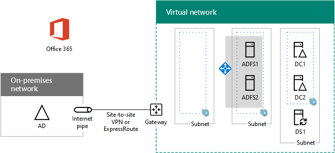

# <a name="high-availability-federated-authentication-phase-3-configure-ad-fs-servers"></a>Fase 3 de la autenticación federada de alta disponibilidad: Configurar servidores de AD FS

En esta fase de implementación de alta disponibilidad para la autenticación federada de Microsoft 365 en los servicios de infraestructura de Azure, creará un equilibrador de carga interno y dos servidores de AD FS.
  
Debe completar esta fase antes de pasar a [Fase 4: Configuración de servidores proxy de aplicaciones web](high-availability-federated-authentication-phase-4-configure-web-application-pro.md). Consulte Implementación de la [autenticación federada de alta disponibilidad para Microsoft 365 en Azure](deploy-high-availability-federated-authentication-for-microsoft-365-in-azure.md) para todas las fases.
  
## <a name="create-the-ad-fs-server-virtual-machines-in-azure"></a>Crear las máquinas virtuales del servidor de AD FS en Azure

Use the following block of PowerShell commands to create the virtual machines for the two AD FS servers. This PowerShell command set uses values from the following tables:
  
- Tabla N, para las máquinas virtuales
    
- Tabla R, para los grupos de recursos
    
- Tabla V, para la configuración de la red virtual
    
- Tabla S, para las subredes
    
- Tabla I, para las direcciones IP estáticas
    
- Tabla A, para los conjuntos de disponibilidad
    
Recuerde que ha definido la tabla M en [la fase 2: Configuración de controladores de dominio](high-availability-federated-authentication-phase-2-configure-domain-controllers.md) y tablas R, V, S, I y A en [la fase 1: Configuración de Azure](high-availability-federated-authentication-phase-1-configure-azure.md).
  
> [!NOTE]
> Los siguientes conjuntos de comandos utilizan la última versión de Azure PowerShell. Consulte [Introducción a Azure PowerShell](/powershell/azure/get-started-azureps). 
  
Primero, cree un equilibrador de carga interno de Azure para los dos servidores de AD FS. Especifique los valores de las variables, quitando los \< and > caracteres. Después de especificar todos los valores correctos, ejecute el bloque resultante en el símbolo del sistema de Azure PowerShell o en PowerShell ISE.
  
> [!TIP]
> Para generar bloques de comandos de PowerShell listos para ejecutarse en función de la configuración personalizada, use este [libro de configuración de Microsoft Excel](https://github.com/MicrosoftDocs/OfficeDocs-Enterprise/raw/live/Enterprise/downloads/O365FedAuthInAzure_Config.xlsx). 

```powershell
# Set up key variables
$locName="<your Azure location>"
$vnetName="<Table V - Item 1 - Value column>"
$subnetName="<Table R - Item 2 - Subnet name column>"
$privIP="<Table I - Item 4 - Value column>"
$rgName=<Table R - Item 4 - Resource group name column>"

$vnet=Get-AzVirtualNetwork -Name $vnetName -ResourceGroupName $rgName
$subnet=Get-AzVirtualNetworkSubnetConfig -VirtualNetwork $vnet -Name $subnetName

$frontendIP=New-AzLoadBalancerFrontendIpConfig -Name "ADFSServers-LBFE" -PrivateIPAddress $privIP -Subnet $subnet
$beAddressPool=New-AzLoadBalancerBackendAddressPoolConfig -Name "ADFSServers-LBBE"

$healthProbe=New-AzLoadBalancerProbeConfig -Name WebServersProbe -Protocol "TCP" -Port 443 -IntervalInSeconds 15 -ProbeCount 2
$lbrule=New-AzLoadBalancerRuleConfig -Name "HTTPSTraffic" -FrontendIpConfiguration $frontendIP -BackendAddressPool $beAddressPool -Probe $healthProbe -Protocol "TCP" -FrontendPort 443 -BackendPort 443
New-AzLoadBalancer -ResourceGroupName $rgName -Name "ADFSServers" -Location $locName -LoadBalancingRule $lbrule -BackendAddressPool $beAddressPool -Probe $healthProbe -FrontendIpConfiguration $frontendIP
```

Después, cree las máquinas virtuales del servidor de AD FS.
  
Después de especificar todos los valores correctos, ejecute el bloque resultante en el símbolo del sistema de Azure PowerShell o en PowerShell ISE.
  
```powershell
# Set up variables common to both virtual machines
$locName="<your Azure location>"
$vnetName="<Table V - Item 1 - Value column>"
$subnetName="<Table R - Item 2 - Subnet name column>"
$avName="<Table A - Item 2 - Availability set name column>"
$rgNameTier="<Table R - Item 2 - Resource group name column>"
$rgNameInfra="<Table R - Item 4 - Resource group name column>"

$rgName=$rgNameInfra
$vnet=Get-AzVirtualNetwork -Name $vnetName -ResourceGroupName $rgName
$subnet=Get-AzVirtualNetworkSubnetConfig -VirtualNetwork $vnet -Name $subnetName
$backendSubnet=Get-AzVirtualNetworkSubnetConfig -Name $subnetName -VirtualNetwork $vnet
$webLB=Get-AzLoadBalancer -ResourceGroupName $rgName -Name "ADFSServers"

$rgName=$rgNameTier
$avSet=Get-AzAvailabilitySet -Name $avName -ResourceGroupName $rgName

# Create the first ADFS server virtual machine
$vmName="<Table M - Item 4 - Virtual machine name column>"
$vmSize="<Table M - Item 4 - Minimum size column>"
$staticIP="<Table I - Item 5 - Value column>"
$diskStorageType="<Table M - Item 4 - Storage type column>"

$nic=New-AzNetworkInterface -Name ($vmName +"-NIC") -ResourceGroupName $rgName -Location $locName -Subnet $backendSubnet -LoadBalancerBackendAddressPool $webLB.BackendAddressPools[0] -PrivateIpAddress $staticIP
$vm=New-AzVMConfig -VMName $vmName -VMSize $vmSize -AvailabilitySetId $avset.Id

$cred=Get-Credential -Message "Type the name and password of the local administrator account for the first AD FS server." 
$vm=Set-AzVMOperatingSystem -VM $vm -Windows -ComputerName $vmName -Credential $cred -ProvisionVMAgent -EnableAutoUpdate
$vm=Set-AzVMSourceImage -VM $vm -PublisherName MicrosoftWindowsServer -Offer WindowsServer -Skus 2016-Datacenter -Version "latest"
$vm=Add-AzVMNetworkInterface -VM $vm -Id $nic.Id
$vm=Set-AzVMOSDisk -VM $vm -Name ($vmName +"-OS") -DiskSizeInGB 128 -CreateOption FromImage -StorageAccountType $diskStorageType
New-AzVM -ResourceGroupName $rgName -Location $locName -VM $vm

# Create the second AD FS virtual machine
$vmName="<Table M - Item 5 - Virtual machine name column>"
$vmSize="<Table M - Item 5 - Minimum size column>"
$staticIP="<Table I - Item 6 - Value column>"
$diskStorageType="<Table M - Item 5 - Storage type column>"

$nic=New-AzNetworkInterface -Name ($vmName +"-NIC") -ResourceGroupName $rgName -Location $locName  -Subnet $backendSubnet -LoadBalancerBackendAddressPool $webLB.BackendAddressPools[0] -PrivateIpAddress $staticIP
$vm=New-AzVMConfig -VMName $vmName -VMSize $vmSize -AvailabilitySetId $avset.Id

$cred=Get-Credential -Message "Type the name and password of the local administrator account for the second AD FS server." 
$vm=Set-AzVMOperatingSystem -VM $vm -Windows -ComputerName $vmName -Credential $cred -ProvisionVMAgent -EnableAutoUpdate
$vm=Set-AzVMSourceImage -VM $vm -PublisherName MicrosoftWindowsServer -Offer WindowsServer -Skus 2016-Datacenter -Version "latest"
$vm=Add-AzVMNetworkInterface -VM $vm -Id $nic.Id
$vm=Set-AzVMOSDisk -VM $vm -Name ($vmName +"-OS") -DiskSizeInGB 128 -CreateOption FromImage -StorageAccountType $diskStorageType
New-AzVM -ResourceGroupName $rgName -Location $locName -VM $vm

```

> [!NOTE]
> Because these virtual machines are for an intranet application, they are not assigned a public IP address or a DNS domain name label and exposed to the Internet. However, this also means that you cannot connect to them from the Azure portal. The **Connect** option is unavailable when you view the properties of the virtual machine. Use the Remote Desktop Connection accessory or another Remote Desktop tool to connect to the virtual machine using its private IP address or intranet DNS name.
  
For each virtual machine, use the remote desktop client of your choice and create a remote desktop connection. Use its intranet DNS or computer name and the credentials of the local administrator account.
  
Para cada máquina virtual, únelas al dominio de Servicios de dominio de Active Directory adecuado (AD DS) con estos comandos en el símbolo del sistema de Windows PowerShell.
  
```powershell
$domName="<AD DS domain name to join, such as corp.contoso.com>"
$cred=Get-Credential -Message "Type the name and password of a domain acccount."
Add-Computer -DomainName $domName -Credential $cred
Restart-Computer
```

Esta es la configuración completada después de la finalización correcta de esta fase, con los nombres de equipo de marcadores de posición.
  
**Fase 3: Equilibrador de carga interno y servidores de AD FS para la infraestructura de autenticación federada de alta disponibilidad en Azure**


  
## <a name="next-step"></a>Paso siguiente

Use [Fase 4: Configuración de servidores proxy de aplicaciones web](high-availability-federated-authentication-phase-4-configure-web-application-pro.md) para seguir configurando esta carga de trabajo.
  
## <a name="see-also"></a>Consulta también

[Implementar la autenticación federada de alta disponibilidad para Microsoft 365 en Azure](deploy-high-availability-federated-authentication-for-microsoft-365-in-azure.md)
  
[Identidad federada para el entorno de desarrollo y pruebas de Microsoft 365](federated-identity-for-your-microsoft-365-dev-test-environment.md)