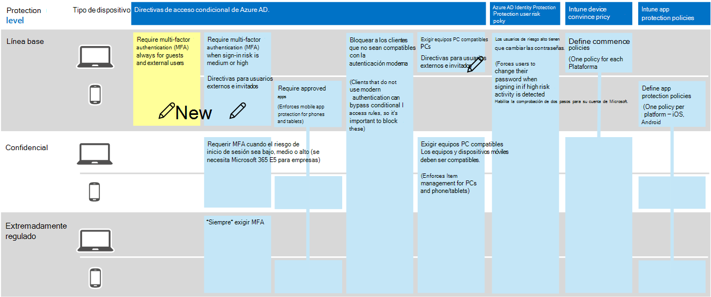

# Directivas para permitir el acceso de B2B y de invitado externo
En este artículo se describe cómo ajustar las directivas de identidad y acceso a dispositivos comunes recomendadas para permitir el acceso a las cuentas B2B (usuarios invitados y externos). Esta guía se basa en las [directivas comunes de identidad y acceso a dispositivos](identity-access-policies.md).

Estas recomendaciones están diseñadas para aplicarse al nivel de **línea base** de protección. Sin embargo, puede ajustar las recomendaciones en función de la granularidad de sus necesidades de protección **sensible** y **altamente regulada** . 

Proporcionar una ruta de acceso para que los usuarios B2B se autentiquen con su espacio empresarial de Azure AD no concede a estos usuarios acceso a todo el entorno. Los usuarios B2B solo tienen acceso a los recursos compartidos con ellos (por ejemplo, archivos) dentro de los servicios concedidos en las directivas de acceso condicional.

## Actualización de las directivas comunes para permitir y proteger el acceso de invitados y externos 

El siguiente diagrama ilustra las directivas comunes de identidad y acceso a dispositivos e indica (con un icono de lápiz) las directivas que se agregarán o actualizarán para proteger a los invitados y al acceso externo. 

En la siguiente tabla se enumeran las directivas que debe actualizar o crear nuevas. Las directivas comunes vinculan a las instrucciones de configuración asociadas en el artículo [Common Identity and Device Access Policies](identity-access-policies.md) .

|Nivel de protección|Directivas|Más información|
|:---------------|:-------|:----------------|
|**Baseline**|[Requerir MFA siempre para los usuarios externos y invitados](identity-access-policies.md#require-mfa-based-on-sign-in-risk)|Cree esta nueva regla y aplíquela solo a los invitados y a los usuarios externos. En riesgo de inicio de sesión, deje todas las opciones desactivadas para exigir siempre la MFA.|
|        |[Requerir MFA cuando el riesgo de inicio de sesión sea *medio* o *alto*](identity-access-policies.md#require-mfa-based-on-sign-in-risk)|Modifique esta regla para excluir usuarios externos y invitados.|
|        |[Exigir equipos PC compatibles](identity-access-policies.md#require-compliant-pcs-but-not-compliant-phones-and-tablets)|Modifique esta regla para excluir usuarios externos y invitados.|

Para incluir o excluir invitados y usuarios externos en las reglas de acceso condicional, haga clic en la ficha incluir o excluir y compruebe **todos los invitados y usuarios externos**.

## Más información

### Invitados frente a usuarios externos
En Azure AD, los usuarios externos y invitados son los mismos. El tipo de usuario para ambos es invitado. Los usuarios invitados son usuarios B2B.

Microsoft Teams diferencia entre los usuarios invitados y los usuarios externos dentro de la aplicación, pero ambos son usuarios B2B cuando se autentican. Para obtener más información acerca de los usuarios externos y invitados de Teams, consulte [Enabling Guest and external Access for Teams](teams-access-policies.md#enabling-guest-and-external-access-for-teams).

### Requerir MFA siempre para los usuarios externos y invitados
Esta regla solicita a los invitados que se registren en MFA en su espacio empresarial, independientemente de si están registrados para MFA en su inquilino de inicio. Al obtener acceso a los recursos de su espacio empresarial, los invitados y los usuarios externos deben usar MFA para cada solicitud. 

### Exclusión de invitados y usuarios externos de la MFA basada en riesgos
Si bien las organizaciones pueden aplicar directivas basadas en riesgos para los usuarios de B2B mediante la protección de identidad, existen limitaciones en la implementación de la protección de identidad para los usuarios de colaboración B2B en un directorio de recursos debido a su identidad en su hogar. Active. Debido a estas limitaciones, Microsoft recomienda excluir a los usuarios invitados de las directivas de MFA basadas en riesgos y requerir que estos usuarios usen siempre la MFA. 

Para obtener más información, vea [limitaciones de la protección de identidad para usuarios de colaboración B2B](https://docs.microsoft.com/azure/active-directory/identity-protection/concept-identity-protection-b2b#limitations-of-identity-protection-for-b2b-collaboration-users). 

### Excluir usuarios externos y invitados de la administración de dispositivos 
Solo una organización puede administrar un dispositivo. Si no excluye a los usuarios externos y invitados de las directivas que requieran el cumplimiento de dispositivos, estas directivas bloquearán a estos usuarios. 

## Siguientes pasos

[Obtenga información sobre cómo habilitar el acceso condicional de Teams](teams-access-policies.md)

