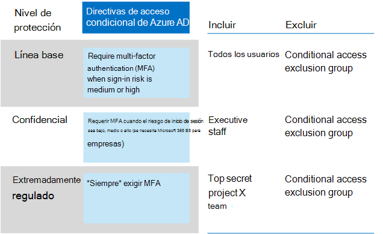
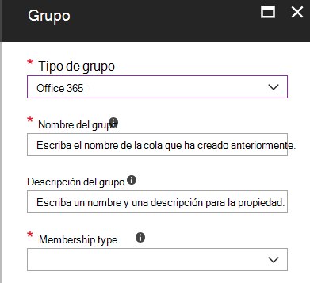

# Directivas comunes de acceso a dispositivos e identidadesCommon identity and device access policies
En este artículo se describen las directivas comunes recomendadas para proteger el acceso a los servicios en la nube, incluidas las aplicaciones locales publicadas con el proxy de aplicación de Azure AD.This article describes the common recommended policies for securing access to cloud services, including on-premises applications published with Azure AD Application Proxy. 

En esta guía se explica cómo implementar las directivas recomendadas en un entorno recién aprovisionado.This guidance discusses how to deploy the recommended policies in a newly-provisioned environment. La configuración de estas directivas en un entorno de laboratorio independiente permite comprender y evaluar las directivas recomendadas antes de ensayar la implementación en los entornos de preproducción y producción.Setting up these policies in a separate lab environment allows you to understand and evaluate the recommended policies before staging the rollout to your preproduction and production environments. El entorno recién aprovisionado puede ser solo de nube o híbrido.Your newly provisioned environment may be cloud-only or hybrid.  

## Conjunto de directivasPolicy set 

El siguiente diagrama ilustra el conjunto de directivas recomendado.The following diagram illustrates the recommended set of policies. Muestra el nivel de protección al que se aplica cada directiva y si las directivas se aplican a equipos, teléfonos y tabletas o a ambas categorías de dispositivos.It shows which tier of protections each policy applies to and whether the policies apply to PCs or phones and tablets, or both categories of devices. También indica dónde están configuradas estas directivas.It also indicates where these policies are configured.

 
 [consulte una versión más amplia de esta imagen](https://github.com/MicrosoftDocs/microsoft-365-docs/raw/public/microsoft-365/media/Identity_device_access_policies_byplan.png)
[See a larger version of this image](https://github.com/MicrosoftDocs/microsoft-365-docs/raw/public/microsoft-365/media/Identity_device_access_policies_byplan.png)

En el resto de este artículo se describe cómo configurar estas directivas.The rest of this article describes how to configure these policies. 

Se recomienda usar la autenticación multifactor antes de inscribir los dispositivos en Intune para asegurarse de que el dispositivo está en la posesión del usuario deseado.Using multi-factor authentication is recommended before enrolling devices into Intune for assurance that the device is in the possession of the intended user. También debe inscribir los dispositivos en Intune antes de aplicar las directivas de cumplimiento de dispositivos.You must also enroll devices into Intune before enforcing device compliance policies.

Para darle tiempo para llevar a cabo estas tareas, se recomienda implementar las directivas de línea de base en el orden que se indica en esta tabla.To give you time to accomplish these tasks, we recommend implementing the baseline policies in the order listed in this table. Sin embargo, las directivas de MFA para la protección sensible y altamente regulada pueden implementarse en cualquier momento.However, the MFA policies for sensitive and highly regulated protection can be implemented at any time.

|Nivel de protecciónProtection level|DirectivasPolicies|Más informaciónMore information|
|:---------------|:-------|:----------------|
|**Baseline****Baseline**|[Requerir MFA cuando el riesgo de inicio de sesión sea *medio* o *alto*Require MFA when sign-in risk is *medium* or *high*](#require-mfa-based-on-sign-in-risk)| |
|        |[Bloquear a los clientes que no sean compatibles con la autenticación modernaBlock clients that don't support modern authentication](#block-clients-that-dont-support-modern-authentication)|Los clientes que no usan la autenticación moderna pueden omitir las reglas de acceso condicional, por lo que es importante bloquear estosClients that do not use modern authentication can bypass conditional access rules, so it's important to block these|
|        |[Los usuarios de riesgo alto tienen que cambiar la contraseñaHigh risk users must change password](#high-risk-users-must-change-password)|Obliga a los usuarios a cambiar su contraseña al iniciar sesión si se detecta actividad de alto riesgo para su cuentaForces users to change their password when signing in if high-risk activity is detected for their account|
|        |[Aplicar directivas de protección de datos de aplicacionesApply APP data protection policies](#apply-app-data-protection-policies)|Una directiva por plataforma (iOS, Android, Windows).One policy per platform (iOS, Android, Windows). Las directivas de protección de aplicaciones (aplicación) de Intune son conjuntos predefinidos de protección, del nivel 1 al nivel 3.Intune App Protection Policies (APP) are predefined sets of protection, from Level 1 to Level 3.|
|        |[Requerir aplicaciones aprobadas y protección de aplicacionesRequire approved apps and APP protection](#require-approved-apps-and-app-protection)|Fuerza la protección de aplicaciones móviles para teléfonos y tabletasEnforces mobile app protection for phones and tablets|
|        |[Definir directivas de cumplimiento de dispositivosDefine device compliance policies](#define-device-compliance-policies)|Una directiva para cada plataformaOne policy for each platform|
|        |[Exigir equipos PC compatiblesRequire compliant PCs](#require-compliant-pcs-but-not-compliant-phones-and-tablets)|Fuerza la administración de los equipos de IntuneEnforces Intune management of PCs|
|**Confidencial****Sensitive**|[Requerir MFA cuando el riesgo de inicio de sesión es *bajo*, *medio* o *alto*Require MFA when sign-in risk is *low*, *medium* or *high*](#require-mfa-based-on-sign-in-risk)| |
|         |[Requerir equipos *y* dispositivos móviles compatiblesRequire compliant PCs *and* mobile devices](#require-compliant-pcs-and-mobile-devices)|Fuerza la administración de Intune para los PC y el teléfono/tabletasEnforces Intune management for PCs and phone/tablets|
|**Extremadamente regulado****Highly regulated**|[Requerir *siempre* MFA*Always* require MFA](#require-mfa-based-on-sign-in-risk)|
| | |

## Asignar directivas a usuariosAssigning policies to users
Antes de configurar directivas, identifique los grupos de Azure AD que está usando para cada nivel de protección.Before configuring policies, identify the Azure AD groups you are using for each tier of protection. Normalmente, la protección de línea de base se aplica a todos los de la organización.Typically, baseline protection applies to everybody in the organization. Un usuario que se incluya para la protección de línea base y sensible tendrá todas las directivas de línea de base aplicadas, además de las directivas confidenciales.A user who is included for both baseline and sensitive protection will have all the baseline policies applied plus the sensitive policies. La protección es acumulativa y se aplica la directiva más restrictiva.Protection is cumulative and the most restrictive policy is enforced. 

Una práctica recomendada es crear un grupo de Azure AD para la exclusión de acceso condicional.A recommended practice is to create an Azure AD group for conditional access exclusion. Agregue este grupo a todas las reglas de acceso condicional en "excluir".Add this group to all of your conditional access rules under "Exclude". Esto le proporciona un método para proporcionar acceso a un usuario mientras se solucionan problemas de acceso.This gives you a method to provide access to a user while you troubleshoot access issues. Solo se recomienda como solución temporal.This is recommended as a temporary solution only. Supervise si hay cambios en este grupo y asegúrese de que el grupo de exclusión solo se usa como se esperaba.Monitor this group for changes and be sure the exclusion group is being used only as intended. 

El siguiente diagrama muestra un ejemplo de asignación de usuarios y exclusiones.The following diagram provides an example of user assignment and exclusions.

En la ilustración, se asigna una directiva de acceso condicional que requiere MFA *siempre*a "Top Secret Project X Team".In the illustration the "Top secret project X team" is assigned a conditional access policy that requires MFA *always*. Tenga cuidado al aplicar niveles más altos de protección a los usuarios.Be judicious when applying higher levels of protection to users. Los miembros de este equipo de proyecto tendrán que proporcionar dos formas de autenticación cada vez que inicien sesión, incluso si no están viendo contenido altamente regulado.Members of this project team will be required to provide two forms of authentication every time they log on, even if they are not viewing highly-regulated content.  

Todos los grupos de Azure AD creados como parte de estas recomendaciones deben crearse como grupos de Microsoft 365.All Azure AD groups created as part of these recommendations must be created as Microsoft 365 groups. Esto es especialmente importante para la implementación de Azure Information Protection (AIP) al proteger documentos en SharePoint Online.This is specifically important for the deployment of Azure Information Protection (AIP) when securing documents in SharePoint Online.

## Requerir MFA según el riesgo de inicio de sesiónRequire MFA based on sign-in risk
Antes de requerir MFA, use primero una directiva de registro de la identidad de MFA de protección para registrar usuarios para MFA.Before requiring MFA, first use an Identity Protection MFA registration policy to register users for MFA. Una vez que se hayan registrado los usuarios, puede exigir MFA para iniciar sesión.After users are registered you can enforce MFA for sign-in. El [trabajo de requisitos previos](identity-access-prerequisites.md) incluye el registro de todos los usuarios con MFA.The [prerequisite work](identity-access-prerequisites.md) includes registering all users with MFA.

Para crear una directiva de acceso condicional, haga lo siguiente:To create a new conditional access policy: 

1. Vaya al [Azure Portal](https://portal.azure.com) e inicie sesión con sus credenciales.Go to the [Azure portal](https://portal.azure.com), and sign in with your credentials. Una vez que haya iniciado sesión correctamente, verá el panel de Azure.After you've successfully signed in, you see the Azure dashboard.

2. En el menú de la izquierda, seleccione **Azure Active Directory**.Choose **Azure Active Directory** from the left menu.

3. En la sección **Seguridad**, seleccione **Acceso condicional**.Under the **Security** section, choose **Conditional access**.

4. Pulse **Nueva directiva**.Choose **New policy**.

 En las tablas siguientes se describen las opciones de configuración de directivas de acceso condicional para implementarlas en esta Directiva.The following tables describes the conditional access policy settings to implement for this policy.

**Asignaciones****Assignments**

|TipoType|PropiedadesProperties|ValoresValues|NotasNotes|
|:---|:---------|:-----|:----|
|Usuarios y gruposUsers and groups|IncluirInclude|Seleccionar usuarios y grupos: selecciona un grupo de seguridad específico que contiene usuarios de destinoSelect users and groups – Select specific security group containing targeted users|Comenzar con el grupo de seguridad que incluye usuarios de pruebaStart with security group including pilot users|
||ExcluirExclude|Grupo de seguridad de excepción; cuentas de servicio (identidades de aplicación)Exception security group; service accounts (app identities)|Pertenencia modificada en una base de tiempo necesariaMembership modified on an as-needed temporary basis|
|Aplicaciones en la nubeCloud apps|IncluirInclude|Seleccione las aplicaciones a las que desea que se aplique esta regla.Select the apps you want this rule to apply to. Por ejemplo, seleccione Exchange OnlineFor example, select Exchange Online||
|CondicionesConditions|ConfiguradoConfigured|SíYes|Configuración específica del entorno y las necesidadesConfigure specific to your environment and needs|
|Riesgo de inicio de sesiónSign-in risk|Nivel de riesgoRisk level||Vea las instrucciones de la tabla siguienteSee the guidance in the following table|

**Riesgo de inicio de sesión****Sign-in risk**

Aplique la configuración en función del nivel de protección de destino.Apply the settings based on the protection level you are targeting.

|PropiedadProperty|Nivel de protecciónLevel of protection|ValoresValues|NotasNotes|
|:---|:---------|:-----|:----|
|Nivel de riesgoRisk level|Línea baseBaseline|Alto, medioHigh, medium|Comprobar ambosCheck both|
| |ConfidencialSensitive|Alta, media, bajaHigh, medium, low|Marcar los tresCheck all three|
| |Extremadamente reguladoHighly regulated| |Dejar todas las opciones desactivadas para exigir siempre la MFALeave all options unchecked to always enforce MFA|

**Controles de acceso****Access controls**

|TipoType|PropiedadesProperties|ValoresValues|NotasNotes|
|:---|:---------|:-----|:----|
|ConcederGrant|Conceder accesoGrant access|TrueTrue|SeleccionadoSelected|
||Exigir MFARequire MFA|TrueTrue|CheckCheck|
||Requerir que el dispositivo esté marcado como compatibleRequire device to be marked as compliant|FalsoFalse||
||Requerir un dispositivo híbrido de Azure AD conectadoRequire hybrid Azure AD-joined device|FalsoFalse||
||Requerir aplicación cliente aprobadaRequire approved client app|FalseFalse||
||Exigir todos los controles seleccionadosRequire all the selected controls|TrueTrue|SeleccionadoSelected|

> [!NOTE]
> Asegúrese de habilitar esta directiva; para ello, seleccione **activado**.Be sure to enable this policy, by choosing **On**. También considere la posibilidad de usar la herramienta [What if](https://docs.microsoft.com/azure/active-directory/active-directory-conditional-access-whatif) para probar la Directiva.Also consider using the [What if](https://docs.microsoft.com/azure/active-directory/active-directory-conditional-access-whatif) tool to test the policy.

## Bloquear a los clientes que no sean compatibles con la autenticación modernaBlock clients that don't support modern authentication
1. Vaya al [Azure Portal](https://portal.azure.com) e inicie sesión con sus credenciales.Go to the [Azure portal](https://portal.azure.com), and sign in with your credentials. Una vez que haya iniciado sesión correctamente, verá el panel de Azure.After you've successfully signed in, you see the Azure dashboard.

2. En el menú de la izquierda, seleccione **Azure Active Directory**.Choose **Azure Active Directory** from the left menu.

3. En la sección **Seguridad**, seleccione **Acceso condicional**.Under the **Security** section, choose **Conditional access**.

4. Pulse **Nueva directiva**.Choose **New policy**.

En las tablas siguientes se describen las opciones de configuración de directivas de acceso condicional para implementarlas en esta Directiva.The following tables describes the conditional access policy settings to implement for this policy.

**Asignaciones****Assignments**

|TipoType|PropiedadesProperties|ValoresValues|NotasNotes|
|:---|:---------|:-----|:----|
|Usuarios y gruposUsers and groups|IncluirInclude|Seleccionar usuarios y grupos: selecciona un grupo de seguridad específico que contiene usuarios de destinoSelect users and groups – Select specific security group containing targeted users|Comenzar con el grupo de seguridad que incluye usuarios de pruebaStart with security group including pilot users|
||ExcluirExclude|Grupo de seguridad de excepción; cuentas de servicio (identidades de aplicación)Exception security group; service accounts (app identities)|Pertenencia modificada de forma temporal según necesidadMembership modified on an as needed temporary basis|
|Aplicaciones en la nubeCloud apps|IncluirInclude|Seleccione las aplicaciones a las que desea que se aplique esta regla.Select the apps you want this rule to apply to. Por ejemplo, seleccione Exchange OnlineFor example, select Exchange Online||
|CondicionesConditions|ConfiguradoConfigured|SíYes|Configurar las aplicaciones clienteConfigure Client apps|
|Aplicaciones clienteClient apps|ConfiguradoConfigured|SíYes|Aplicaciones móviles y clientes de escritorio, otros clientes (seleccione ambos)Mobile apps and desktop clients, Other clients (select both)|

**Controles de acceso****Access controls**

|TipoType|PropiedadesProperties|ValoresValues|NotasNotes|
|:---|:---------|:-----|:----|
|ConcederGrant|Bloquear accesoBlock access|TrueTrue|SeleccionadoSelected|
||Exigir MFARequire MFA|FalsoFalse||
||Requerir que el dispositivo esté marcado como compatibleRequire device to be marked as compliant|FalsoFalse||
||Requerir un dispositivo híbrido de Azure AD conectadoRequire hybrid Azure AD-joined device|FalsoFalse||
||Requerir aplicación cliente aprobadaRequire approved client app|FalseFalse||
||Exigir todos los controles seleccionadosRequire all the selected controls|TrueTrue|SeleccionadoSelected|

> [!NOTE]
> Asegúrese de habilitar esta directiva; para ello, seleccione **activado**.Be sure to enable this policy, by choosing **On**. También considere la posibilidad de usar la herramienta [What if](https://docs.microsoft.com/azure/active-directory/active-directory-conditional-access-whatif) para probar la Directiva.Also consider using the [What if](https://docs.microsoft.com/azure/active-directory/active-directory-conditional-access-whatif) tool to test the policy.

## Los usuarios de riesgo alto tienen que cambiar la contraseñaHigh risk users must change password
Para asegurarse de que todas las cuentas de usuarios de alto riesgo se vean obligadas a realizar un cambio de contraseña al iniciar sesión, debe aplicar la siguiente directiva.To ensure that all high-risk users' compromised accounts are forced to perform a password change when signing-in, you must apply the following policy.

Inicie sesión en [Microsoft Azure Portal (https://portal.azure.com)](https://portal.azure.com/) con las credenciales de administrador y luego vaya a **Azure AD Identity Protection > Directiva de riesgo de usuario**.Log in to the [Microsoft Azure portal (https://portal.azure.com)](https://portal.azure.com/) with your administrator credentials, and then navigate to **Azure AD Identity Protection > User Risk Policy**.

**Asignaciones****Assignments**

|TipoType|PropiedadesProperties|ValoresValues|NotasNotes|
|:---|:---------|:-----|:----|
|UsuariosUsers|IncluirInclude|Todos los usuariosAll users|SeleccionadoSelected|
||ExcluirExclude|NingunoNone||
|CondicionesConditions|Riesgo de usuarioUser risk|AltoHigh|SeleccionadoSelected|

**Controles****Controls**

| TipoType | PropiedadesProperties | ValoresValues                  | NotasNotes |
|:-----|:-----------|:------------------------|:------|
|      | AccesoAccess     | Permitir accesoAllow access            | TrueTrue  |
|      | AccesoAccess     | Exigir cambio de contraseñaRequire password change | TrueTrue  |

**Revisión:** no aplicable**Review:** not applicable

> [!NOTE]
> Asegúrese de habilitar esta directiva; para ello, seleccione **activado**.Be sure to enable this policy, by choosing **On**. También considere la posibilidad de usar la herramienta [What if](https://docs.microsoft.com/azure/active-directory/active-directory-conditional-access-whatif) para probar la DirectivaAlso consider using the [What if](https://docs.microsoft.com/azure/active-directory/active-directory-conditional-access-whatif) tool to test the policy

## Aplicar directivas de protección de datos de aplicacionesApply APP data protection policies
Las directivas de protección de aplicaciones (aplicación) definen qué aplicaciones están permitidas y las acciones que pueden llevar a cabo con los datos de la organización.App Protection Policies (APP) define which apps are allowed and the actions they can take with your organization's data. Las opciones disponibles en la aplicación permiten a las organizaciones adaptar la protección a sus necesidades específicas.The choices available in APP enable organizations to tailor the protection to their specific needs. Para algunos, puede que no sea obvio qué configuración de directiva es necesaria para implementar un escenario completo.For some, it may not be obvious which policy settings are required to implement a complete scenario. Para ayudar a las organizaciones a priorizar la protección de extremos de extremos de cliente móvil, Microsoft ha lanzado una taxonomía para el marco de protección de datos de aplicaciones para iOS y la administración de aplicaciones móviles de Android.To help organizations prioritize mobile client endpoint hardening, Microsoft has introduced taxonomy for its APP data protection framework for iOS and Android mobile app management. 

El marco de protección de datos de la aplicación está organizado en tres niveles de configuración distintos, donde cada nivel se basa en el nivel anterior:The APP data protection framework is organized into three distinct configuration levels, with each level building off the previous level: 

- **Enterprise Basic Data Protection** (nivel 1) garantiza que las aplicaciones están protegidas con PIN y se cifran y realizan operaciones selectivas de borrado.**Enterprise basic data protection** (Level 1) ensures that apps are protected with a PIN and encrypted and performs selective wipe operations. Para dispositivos Android, este nivel valida la atestación del dispositivo de Android.For Android devices, this level validates Android device attestation. Se trata de una configuración de nivel de entrada que proporciona un control de protección de datos similar en las directivas de buzones de correo de Exchange Online y lo presenta y el llenado del usuario a la aplicación.This is an entry level configuration that provides similar data protection control in Exchange Online mailbox policies and introduces IT and the user population to APP. 
- La **protección de datos mejorada** de la empresa (nivel 2) introduce los mecanismos de prevención de fugas de datos de aplicaciones y los requisitos mínimos del sistema operativo.**Enterprise enhanced data protection** (Level 2) introduces APP data leakage prevention mechanisms and minimum OS requirements. Esta es la configuración que se aplica a la mayoría de los usuarios móviles que tienen acceso a datos de trabajo o escuela.This is the configuration that is applicable to most mobile users accessing work or school data. 
- La **alta protección de datos empresariales** (nivel 3) introduce mecanismos avanzados de protección de datos, configuración mejorada de PIN y defensa para la amenaza de aplicaciones móviles.**Enterprise high data protection** (Level 3) introduces advanced data protection mechanisms, enhanced PIN configuration, and APP Mobile Threat Defense. Esta configuración es preferible para los usuarios que tienen acceso a datos de alto riesgo.This configuration is desirable for users that are accessing high risk data. 

Para ver las recomendaciones específicas para cada nivel de configuración y las aplicaciones mínimas que deben protegerse, revise el [marco de protección de datos con directivas de protección de aplicaciones](https://docs.microsoft.com/mem/intune/apps/app-protection-framework).To see the specific recommendations for each configuration level and the minimum apps that must be protected, review [Data protection framework using app protection policies](https://docs.microsoft.com/mem/intune/apps/app-protection-framework). 

Mediante el uso de los principios descritos en [configuraciones de identidad y acceso a dispositivos](microsoft-365-policies-configurations.md), los niveles de protección base y confidencial se asignan estrechamente con la configuración de protección de datos mejorada de nivel 2.Using the principles outlined in [Identity and device access configurations](microsoft-365-policies-configurations.md), the Baseline and Sensitive protection tiers map closely with the Level 2 enterprise enhanced data protection settings. El nivel de protección altamente regulado se asigna estrechamente a la configuración de la protección de datos de nivel 3 Enterprise High.The Highly regulated protection tier maps closely to the Level 3 enterprise high data protection settings.

|Nivel de protecciónProtection level |Directiva de protección de aplicacionesApp Protection Policy  |Más informaciónMore information  |
|---------|---------|---------|
|Línea baseBaseline     | [Protección de datos mejorada de nivel 2Level 2 enhanced data protection](https://docs.microsoft.com/mem/intune/apps/app-protection-framework#level-2-enterprise-enhanced-data-protection)        | La configuración de la Directiva que se aplica en el nivel 2 incluye todas las configuraciones de directiva recomendadas para el nivel 1 y solo agrega o actualiza la configuración de directivas siguiente para implementar más controles y una configuración más sofisticada que el nivel 1.The policy settings enforced in level 2 include all the policy settings recommended for level 1 and only adds to or updates the below policy settings to implement more controls and a more sophisticated configuration than level 1.         |
|ConfidencialSensitive     | [Protección de datos mejorada de nivel 2Level 2 enhanced data protection](https://docs.microsoft.com/mem/intune/apps/app-protection-framework#level-2-enterprise-enhanced-data-protection)        | La configuración de la Directiva que se aplica en el nivel 2 incluye todas las configuraciones de directiva recomendadas para el nivel 1 y solo agrega o actualiza la configuración de directivas siguiente para implementar más controles y una configuración más sofisticada que el nivel 1.The policy settings enforced in level 2 include all the policy settings recommended for level 1 and only adds to or updates the below policy settings to implement more controls and a more sophisticated configuration than level 1.        |
|Altamente reguladoHighly Regulated     | [Nivel 3 de protección empresarial alta para la informaciónLevel 3 enterprise high data protection](https://docs.microsoft.com/mem/intune/apps/app-protection-framework#level-3-enterprise-high-data-protection)        | La configuración de la Directiva que se aplica en el nivel 3 incluye todas las configuraciones de directiva recomendadas para los niveles 1 y 2 y solo agrega o actualiza la configuración de directivas siguiente para implementar más controles y una configuración más sofisticada que el nivel 2.The policy settings enforced in level 3 include all the policy settings recommended for level 1 and 2 and only adds to or updates the below policy settings to implement more controls and a more sophisticated configuration than level 2.        |

Para crear una nueva Directiva de protección de aplicaciones para cada plataforma (iOS y Android) en Microsoft Endpoint Manager con la configuración del marco de protección de datos, los administradores pueden:To create a new app protection policy for each platform (iOS and Android) within Microsoft Endpoint Manager using the data protection framework settings, administrators can:
1. Cree manualmente las directivas siguiendo los pasos de [Cómo crear e implementar directivas de protección de aplicaciones con Microsoft Intune](https://docs.microsoft.com/mem/intune/apps/app-protection-policies).Manually create the policies by following the steps in [How to create and deploy app protection policies with Microsoft Intune](https://docs.microsoft.com/mem/intune/apps/app-protection-policies). 
2. Importe las [plantillas JSON del marco de configuración de la Directiva de protección de aplicaciones de Intune](https://github.com/microsoft/Intune-Config-Frameworks/tree/master/AppProtectionPolicies) de ejemplo con los [scripts de PowerShell de Intune](https://github.com/microsoftgraph/powershell-intune-samples).Import the sample [Intune App Protection Policy Configuration Framework JSON templates](https://github.com/microsoft/Intune-Config-Frameworks/tree/master/AppProtectionPolicies) with [Intune's PowerShell scripts](https://github.com/microsoftgraph/powershell-intune-samples).

## Requerir aplicaciones aprobadas y protección de aplicacionesRequire approved apps and APP protection
Para aplicar las directivas de protección de aplicaciones que ha aplicado en Intune, debe crear una regla de acceso condicional que requiera las aplicaciones cliente aprobadas y las condiciones establecidas en las directivas de protección de aplicaciones.To enforce the APP protection policies you applied in Intune, you must create a conditional access rule to require approved client apps and the conditions set in the APP protection policies. 

La aplicación de directivas de protección de aplicaciones requiere un conjunto de directivas que se describen en en [requerir la Directiva de protección de aplicaciones para Cloud Access Access con acceso condicional](https://docs.microsoft.com/azure/active-directory/conditional-access/app-protection-based-conditional-access).Enforcing APP protection policies requires a set of policies described in in [Require app protection policy for cloud app access with Conditional Access](https://docs.microsoft.com/azure/active-directory/conditional-access/app-protection-based-conditional-access). Estas directivas se incluyen en este conjunto recomendado de directivas de configuración de identidad y acceso.These policies are each included in this recommended set of identity and access configuration policies.

Para crear la regla de acceso condicional que requiere aplicaciones aprobadas y protección de aplicaciones, siga "paso 1: configurar una directiva de acceso condicional de Azure AD para Microsoft 365" en el [escenario 1: las aplicaciones de Microsoft 365 requieren aplicaciones aprobadas con directivas de protección de aplicaciones](https://docs.microsoft.com/azure/active-directory/conditional-access/app-protection-based-conditional-access#scenario-1-office-365-apps-require-approved-apps-with-app-protection-policies), lo que permite a Outlook para iOS y Android, pero bloquea la conexión de los clientes de Exchange ActiveSync a Exchange OnlineTo create the conditional access rule that requires approved apps and APP protection, follow "Step 1: Configure an Azure AD Conditional Access policy for Microsoft 365" in [Scenario 1: Microsoft 365 apps require approved apps with app protection policies](https://docs.microsoft.com/azure/active-directory/conditional-access/app-protection-based-conditional-access#scenario-1-office-365-apps-require-approved-apps-with-app-protection-policies), which allows Outlook for iOS and Android, but blocks OAuth capable Exchange ActiveSync clients from connecting to Exchange Online.

   > [!NOTE]
   > Esta Directiva garantiza que los usuarios móviles puedan acceder a todos los puntos de conexión de Office con las aplicaciones correspondientes.This policy ensures mobile users can access all Office endpoints using the applicable apps.

Si va a habilitar el acceso móvil a Exchange Online, implemente [los clientes de Block ActiveSync](secure-email-recommended-policies.md#block-activesync-clients), que impide que los clientes de Exchange ActiveSync que aprovechan la autenticación básica se conecten a Exchange Online.If you are enabling mobile access to Exchange Online, implement [Block ActiveSync clients](secure-email-recommended-policies.md#block-activesync-clients), which prevents Exchange ActiveSync clients leveraging basic authentication from connecting to Exchange Online. Esta Directiva no se ilustra en la ilustración de la parte superior de este artículo.This policy is not pictured in the illustration at the top of this article. Se describe y se describen en [recomendaciones de directivas para proteger el correo electrónico](secure-email-recommended-policies.md).It is described and pictured in [Policy recommendations for securing email](secure-email-recommended-policies.md).

 Estas directivas aprovechan los controles Grant [requieren la aplicación cliente aprobada](https://docs.microsoft.com/azure/active-directory/conditional-access/concept-conditional-access-grant#require-approved-client-app) y [requieren la Directiva de protección de aplicaciones](https://docs.microsoft.com/azure/active-directory/conditional-access/concept-conditional-access-grant#require-app-protection-policy).These policies leverage the grant controls [Require approved client app](https://docs.microsoft.com/azure/active-directory/conditional-access/concept-conditional-access-grant#require-approved-client-app) and [Require app protection policy](https://docs.microsoft.com/azure/active-directory/conditional-access/concept-conditional-access-grant#require-app-protection-policy).

Por último, el bloqueo de la autenticación heredada para otras aplicaciones cliente en dispositivos iOS y Android garantiza que estos clientes no puedan eludir las reglas de acceso condicional.Finally, blocking legacy authentication for other client apps on iOS and Android devices ensures that these clients cannot bypass conditional access rules. Si sigue las instrucciones de este artículo, ya ha configurado [bloquear clientes que no admiten la autenticación moderna](#block-clients-that-dont-support-modern-authentication).If you're following the guidance in this article, you've already configured [Block clients that don't support modern authentication](#block-clients-that-dont-support-modern-authentication).

<!---
With Conditional Access, organizations can restrict access to approved (modern authentication capable) iOS and Android client apps with Intune app protection policies applied to them. Several conditional access policies are required, with each policy targeting all potential users. Details on creating these policies can be found in [Require app protection policy for cloud app access with Conditional Access](https://docs.microsoft.com/azure/active-directory/conditional-access/app-protection-based-conditional-access).

1. Follow "Step 1: Configure an Azure AD Conditional Access policy for Microsoft 365" in [Scenario 1: Microsoft 365 apps require approved apps with app protection policies](https://docs.microsoft.com/azure/active-directory/conditional-access/app-protection-based-conditional-access#scenario-1-office-365-apps-require-approved-apps-with-app-protection-policies), which allows Outlook for iOS and Android, but blocks OAuth capable Exchange ActiveSync clients from connecting to Exchange Online.

   > [!NOTE]
   > This policy ensures mobile users can access all Office endpoints using the applicable apps.

2. If enabling mobile access to Exchange Online, implement [Block ActiveSync clients](secure-email-recommended-policies.md#block-activesync-clients), which prevents Exchange ActiveSync clients leveraging basic authentication from connecting to Exchange Online.

   The above policies leverage the grant controls [Require approved client app](https://docs.microsoft.com/azure/active-directory/conditional-access/concept-conditional-access-grant#require-approved-client-app) and [Require app protection policy](https://docs.microsoft.com/azure/active-directory/conditional-access/concept-conditional-access-grant#require-app-protection-policy).

3. Disable legacy authentication for other client apps on iOS and Android devices. For more information, see [Block clients that don't support modern authentication](#block-clients-that-dont-support-modern-authentication).
-->

## Definir directivas de cumplimiento de dispositivosDefine device-compliance policies

Las directivas de cumplimiento de dispositivos definen los requisitos que deben cumplir los dispositivos para que se marquen como compatibles.Device-compliance policies define the requirements that devices must adhere to in order to be marked as compliant. Cree directivas de cumplimiento de dispositivos de Intune en el centro de administración de Microsoft Endpoint Manager.Create Intune device compliance policies from within the Microsoft Endpoint Manager admin center.

Cree una directiva para cada plataforma:Create a policy for each platform:
- Administrador de dispositivos AndroidAndroid device administrator
- Android EnterpriseAndroid Enterprise
- iOS/iPadosiOS/iPadOS
- macOSmacOS
- Windows Phone 8.1Windows Phone 8.1
- Windows 8,1 y versiones posterioresWindows 8.1 and later
- Windows 10 y versiones posterioresWindows 10 and later

Para crear directivas de cumplimiento de dispositivos, inicie sesión en el [centro de administración de Microsoft Endpoint Manager](https://go.microsoft.com/fwlink/?linkid=2109431) con sus credenciales de administración y, a continuación, navegue a directivas de directivas de cumplimiento de **dispositivos**  >  **Compliance policies**  >  **Policies**.To create device compliance policies, log in to the [Microsoft Endpoint Manager Admin Center](https://go.microsoft.com/fwlink/?linkid=2109431) with your administer credentials, and then navigate to **Devices** > **Compliance policies** > **Policies**. Seleccione **crear Directiva**.Select **Create Policy**.

Para que se implementen las directivas de cumplimiento de dispositivos, se deben asignar a grupos de usuarios.For device compliance policies to be deployed, they must be assigned to user groups. Una directiva se asigna después de crearla y guardarla.You assign a policy after you create and save it. En el centro de administración, seleccione la Directiva y, a continuación, seleccione **asignaciones**.In the admin center, select the policy and then select **Assignments**. Después de seleccionar los grupos que desea que reciban la Directiva, seleccione **Guardar** para guardar esa asignación de grupo e implementar la Directiva.After selecting the groups that you want to receive the policy, select **Save** to save that group assignment and deploy the policy.

Para obtener instrucciones paso a paso sobre cómo crear directivas de cumplimiento en Intune, consulte [Create a Compliance Policy in Microsoft Intune](https://docs.microsoft.com/mem/intune/protect/create-compliance-policy) en la documentación de Intune.For step-by-step guidance on creating compliance policies in Intune, see [Create a compliance policy in Microsoft Intune](https://docs.microsoft.com/mem/intune/protect/create-compliance-policy) in the Intune documentation.

Se recomiendan las siguientes opciones de configuración para Windows 10.The following settings are recommended for Windows 10.

**Estado del dispositivo: reglas de evaluación del servicio de atestación de estado de Windows****Device health: Windows Health Attestation Service evaluation rules**

|PropiedadesProperties|ValoresValues|NotasNotes|
|:---------|:-----|:----|
|Requerir BitLockerRequire BitLocker|ObligatoriaRequire||
|Requerir el arranque seguro para habilitarse en el dispositivoRequire Secure Boot to be enabled on the device|ObligatoriaRequire||
|Requerir integridad de códigoRequire code integrity|ObligatoriaRequire||

**Propiedades del dispositivo****Device properties**

|TipoType|PropiedadesProperties|ValoresValues|NotasNotes|
|:---|:---------|:-----|:----|
|Versión del sistema operativoOperating system version|TodosAll|No configuradoNot configured||

**Seguridad del sistema****System security**

|TipoType|PropiedadesProperties|ValoresValues|NotasNotes|
|:---|:---------|:-----|:----|
|PasswordPassword|Requerir una contraseña para desbloquear dispositivos móvilesRequire a password to unlock mobile devices|ObligatoriaRequire||
||Contraseñas sencillasSimple passwords|BloquearBlock||
||Tipo de contraseñaPassword type|Valor predeterminado del dispositivoDevice default||
||Longitud mínima de la contraseñaMinimum password length|6 6||
||Minutos máximos de inactividad antes de que se requiera la contraseñaMaximum minutes of inactivity before password is required|15 15|Esta configuración es compatible con las versiones 4,0 y anteriores de Android o KNOX 4,0 y superior.This setting is supported for Android versions 4.0 and above or KNOX 4.0 and above. Para dispositivos iOS, es compatible con iOS 8,0 y versiones posterioresFor iOS devices, it's supported for iOS 8.0 and above|
||Expiración de contraseña (días)Password expiration (days)|4141||
||Número de contraseñas anteriores para impedir la reutilizaciónNumber of previous passwords to prevent reuse|5 5||
||Requerir contraseña cuando el dispositivo vuelve del estado de inactividad (móvil y holográfica)Require password when device returns from idle state (Mobile and Holographic)|ObligatoriaRequire|Disponible para Windows 10 y versiones posterioresAvailable for Windows 10 and later|
|CifradoEncryption|Cifrado del almacenamiento de datos en el dispositivoEncryption of data storage on device|ObligatoriaRequire||
|Seguridad del dispositivoDevice Security|ÉsteFirewall|ObligatoriaRequire||
||AntivirusAntivirus|ObligatoriaRequire||
||ActualizadosAntispyware|ObligatoriaRequire|Esta configuración requiere una solución anti-spyware registrada en el centro de seguridad de WindowsThis setting requires an Anti-Spyware solution registered with Windows Security Center|
|DefenderDefender|Antimalware de Microsoft defenderMicrosoft Defender Antimalware|ObligatoriaRequire||
||Versión mínima de antimalware de Microsoft defenderMicrosoft Defender Antimalware minimum version||Solo se admite en el escritorio de Windows 10.Only supported for Windows 10 desktop. Microsoft recomienda versiones no más de cinco versiones anteriores a la más recienteMicrosoft recommends versions no more than five behind from the most recent version|
||La firma antimalware de Microsoft defender actualizadaMicrosoft Defender Antimalware signature up to date|ObligatoriaRequire||
||Protección en tiempo realReal-time protection|ObligatoriaRequire|Solo se admite en el escritorio de Windows 10Only supported for Windows 10 desktop|

**ATP de Microsoft Defender****Microsoft Defender ATP**

|TipoType|PropiedadesProperties|ValoresValues|NotasNotes|
|:---|:---------|:-----|:----|
|Reglas de protección contra amenazas avanzada de Microsoft defenderMicrosoft Defender Advanced Threat Protection rules|Requerir que el dispositivo esté por encima o por debajo de la puntuación de riesgo de la máquinaRequire the device to be at or under the machine-risk score|MedioMedium||

## Requerir equipos compatibles (pero no teléfonos y tabletas compatibles)Require compliant PCs (but not compliant phones and tablets)
Antes de agregar una directiva para requerir equipos compatibles, asegúrese de inscribir los dispositivos para la administración en Intune.Before adding a policy to require compliant PCs, be sure to enroll devices for management into Intune. Se recomienda usar la autenticación multifactor antes de inscribir los dispositivos en Intune para asegurarse de que el dispositivo está en la posesión del usuario deseado.Using multi-factor authentication is recommended before enrolling devices into Intune for assurance that the device is in the possession of the intended user. 

Para requerir equipos compatibles:To require compliant PCs:

1. Vaya al [Azure Portal](https://portal.azure.com) e inicie sesión con sus credenciales.Go to the [Azure portal](https://portal.azure.com), and sign in with your credentials. Una vez que haya iniciado sesión correctamente, verá el panel de Azure.After you've successfully signed in, you see the Azure dashboard.

2. En el menú de la izquierda, seleccione **Azure Active Directory**.Choose **Azure Active Directory** from the left menu.

3. En la sección **Seguridad**, seleccione **Acceso condicional**.Under the **Security** section, choose **Conditional access**.

4. Pulse **Nueva directiva**.Choose **New policy**.

5. Escriba un nombre de directiva y seleccione los **Usuarios y grupos** a los que quiera que se aplique la directiva.Enter a policy name, then choose the **Users and groups** you want to apply the policy for.

6. Seleccione **Aplicaciones en la nube**.Choose **Cloud apps**.

7. Elija **seleccionar aplicaciones**y seleccione las aplicaciones que desee en la lista de **aplicaciones de nube** .Choose **Select apps**, select the desired apps from the **Cloud apps** list. Por ejemplo, seleccione Exchange Online.For example, select Exchange Online. Elija **seleccionar** y **listo**.Choose **Select** and **Done**.

8. Para requerir equipos compatibles, pero no teléfonos y tabletas compatibles, elija **condiciones** y **plataformas de dispositivos**.To require compliant PCs, but not compliant phones and tablets, choose **Conditions** and **Device platforms**. Elija **seleccionar plataformas de dispositivos** y seleccione **Windows** y **MacOS**.Choose **Select device platforms** and select **Windows** and **macOS**.

9. Pulse **Conceder** en la sección **Controles de acceso**.Choose **Grant** from the **Access controls** section.

10. Elija **conceder acceso**, seleccione requerir que el **dispositivo esté marcado como compatible**.Choose **Grant access**, select **Require device to be marked as compliant**. Para varios controles, seleccione **requerir todos los controles seleccionados**y, a continuación, elija **seleccionar**.For multiple controls, select **Require all the selected controls**, then choose **Select**. 

11. Seleccione **Crear**.Choose **Create**.

Si su objetivo es requerir equipos *y* dispositivos móviles compatibles, no seleccione plataformas.If your objective is to require compliant PCs *and* mobile devices, do not select platforms. Esto exige el cumplimiento para todos los dispositivos.This enforces compliance for all devices. 

## Requerir equipos *y* dispositivos móviles compatiblesRequire compliant PCs *and* mobile devices

Para requerir el cumplimiento de todos los dispositivos:To require compliance for all devices:

1. Vaya al [Azure Portal](https://portal.azure.com) e inicie sesión con sus credenciales.Go to the [Azure portal](https://portal.azure.com), and sign in with your credentials. Una vez que haya iniciado sesión correctamente, verá el panel de Azure.After you've successfully signed in, you see the Azure dashboard.

2. En el menú de la izquierda, seleccione **Azure Active Directory**.Choose **Azure Active Directory** from the left menu.

3. En la sección **Seguridad**, seleccione **Acceso condicional**.Under the **Security** section, choose **Conditional access**.

4. Pulse **Nueva directiva**.Choose **New policy**.

5. Escriba un nombre de directiva y seleccione los **Usuarios y grupos** a los que quiera que se aplique la directiva.Enter a policy name, then choose the **Users and groups** you want to apply the policy for.

6. Seleccione **Aplicaciones en la nube**.Choose **Cloud apps**.

7. Elija **seleccionar aplicaciones**y seleccione las aplicaciones que desee en la lista de **aplicaciones de nube** .Choose **Select apps**, select the desired apps from the **Cloud apps** list. Por ejemplo, seleccione Exchange Online.For example, select Exchange Online. Elija **seleccionar** y **listo**.Choose **Select** and **Done**.

8. Pulse **Conceder** en la sección **Controles de acceso**.Choose **Grant** from the **Access controls** section.

9. Elija **conceder acceso**, seleccione requerir que el **dispositivo esté marcado como compatible**.Choose **Grant access**, select **Require device to be marked as compliant**. Para varios controles, seleccione **requerir todos los controles seleccionados**y, a continuación, elija **seleccionar**.For multiple controls, select **Require all the selected controls**, then choose **Select**. 

10. Seleccione **Crear**.Choose **Create**.

Al crear esta Directiva, no seleccione plataformas.When creating this policy, do not select platforms. Esto aplica los dispositivos compatibles.This enforces compliant devices.

## Pasos siguientesNext steps

[Más información sobre recomendaciones de directivas para proteger el correo electrónicoLearn about policy recommendations for securing email](secure-email-recommended-policies.md)
