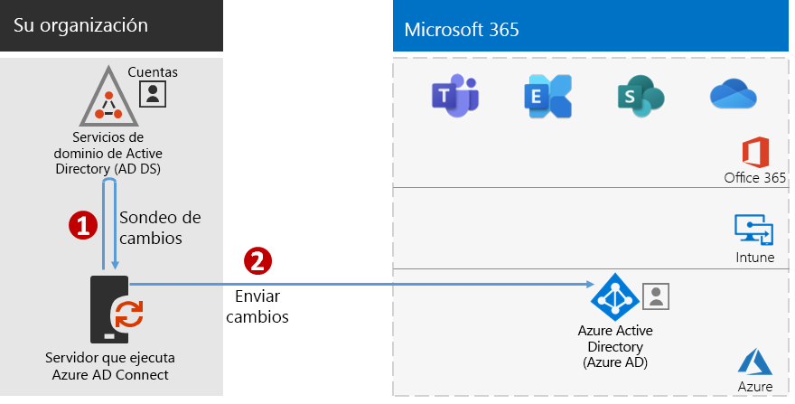
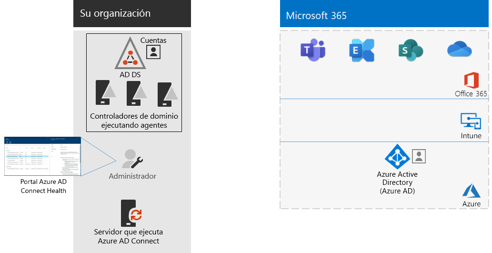

# Paso 4: Agregar las cuentas de usuarioStep 4: Add your user accounts

## Crear cuentas de usuario para identidades solo de nubeCreate your user accounts for cloud-only identity

Para la identidad solo de nube, cree los usuarios y grupos en Azure Active Directory (Azure AD).For cloud-only identity, create your users and groups in Azure Active Directory (Azure AD). Puede utilizar:You can use:

- Centro de administración de Microsoft 365The Microsoft 365 admin center
- Microsoft Azure PortalThe Azure portal
- Azure PowerShellAzure PowerShell

## Sincronizar identidades para identidades híbridasSynchronize identities for hybrid identity

*Este paso es obligatorio para los entornos híbridos y se aplica a las versiones E3 y E5 de Microsoft 365 Enterprise**This is required for hybrid environments and applies to both the E3 and E5 versions of Microsoft 365 Enterprise*

En esta sección, sincronizará su instancia local de Active Directory Domain Services (AD DS) con el espacio empresarial de Azure AD que usan sus suscripciones a Office 365, Microsoft Intune y otros servicios basados en la nube incluidos con Microsoft 365 Enterprise.In this section, you'll synchronize your on-premises Active Directory Domain Services (AD DS) with the Azure AD tenant used by Office 365, Microsoft Intune, and other cloud-based services included with Microsoft 365 Enterprise.

Azure AD Connect es la herramienta compatible de Microsoft que le guiará durante el proceso de sincronizar solo las identidades que necesita desde entornos de AD DS de bosque único o bosques múltiples a su espacio empresarial de Azure AD.Azure AD Connect is the supported Microsoft tool that guides you through synchronizing only the identities you really need from single or multi-forest AD DS environments to your Azure AD tenant. La siguiente figura muestra el proceso básico para la sincronización de Azure AD Connect.The following figure shows the basic process for Azure AD Connect synchronization.

1. Azure AD Connect ejecutado en un servidor busca cambios en las cuentas, grupos y contactos de AD DS.Azure AD Connect running on a server polls AD DS for changes in accounts, groups, and contacts.
2. Azure AD Connect envía los cambios al espacio empresarial de Azure AD de su suscripción de Microsoft 365.Azure AD Connect sends those changes to the Azure AD tenant of your Microsoft 365 subscription.

La primera decisión en su solución de identidad híbrida es el requisito de autenticación. Las siguientes opciones son:The first decision in your hybrid identity solution is your authentication requirement. The following options are options:

- Con la **autenticación administrada**, Azure AD controla el proceso de autenticación de inicio de sesión del usuario. Hay dos métodos de autenticación administrada:With **managed authentication**, Azure AD handles the authentication process for user sign-in. There are two methods for managed authentication: 
    - **Sincronización de hash de contraseña (PHS)** (recomendado y necesario para algunas características premium).**Password Hash Sync (PHS)** [Recommended and required for some premium features]. Esta es la forma más sencilla de habilitar la autenticación para los objetos del directorio local en Azure AD.This is the simplest way to enable authentication for on-premises directory objects in Azure AD. Azure AD Connect extrae la contraseña con hash de AD DS, realiza procesamientos de seguridad adicionales en el hash de contraseña y la sincroniza con Azure AD.Azure AD Connect extracts the hashed password from AD DS, does extra security processing on the password hash, and synchronizes it to Azure AD. Para obtener más información, vea [Implement password hash synchronization with Azure AD Connect sync](https://docs.microsoft.com/azure/active-directory/hybrid/how-to-connect-password-hash-synchronization) (Implementación de la sincronización de hash de contraseñas mediante la sincronización de Azure AD Connect).For more information, see [Implement password hash synchronization with Azure AD Connect sync](https://docs.microsoft.com/azure/active-directory/hybrid/how-to-connect-password-hash-synchronization).
    - La **autenticación de paso a través (PTA)** proporciona una sencilla solución de validación de contraseñas para servicios basados en Azure AD.**Pass-through Authentication (PTA)** provides a simple password validation solution for Azure AD-based services. PTA usa un agente que se ejecuta en uno o más servidores locales para validar las autenticaciones de usuario directamente con AD DS local.PTA uses an agent running on one or more on-premises servers to validate the user authentications directly with your on-premises AD DS. Para obtener más información, vea [User sign-in with Azure Active Directory Pass-through Authentication](https://docs.microsoft.com/azure/active-directory/connect/active-directory-aadconnect-pass-through-authentication) (Inicio de sesión de usuario con autenticación de paso a través de Azure Active Directory).For more information, see [User sign-in with Azure Active Directory Pass-through Authentication](https://docs.microsoft.com/azure/active-directory/connect/active-directory-aadconnect-pass-through-authentication).
- Con la **autenticación federada**, el proceso de autenticación se redirige a otro proveedor de identidades a través de un servidor de federación de identidades, como Servicios de federación de Active Directory (AD FS), para el inicio de sesión de un usuario. El proveedor de identidades puede proporcionar métodos de autenticación adicionales, como la autenticación basada en tarjeta inteligente. Para obtener más información, vea [Elegir el método de autenticación adecuado para la solución de identidad híbrida de Azure Active Directory](https://docs.microsoft.com/azure/security/azure-ad-choose-authn).With **federated authentication**, the authentication process is redirected to another identity provider through an identity federation server, such as Active Directory Federation Services (AD FS), for a user’s sign-in. The identity provider can provide additional authentication methods, such as smartcard-based authentication. For more information, see [Choosing the right authentication method for your Azure Active Directory hybrid identity solution](https://docs.microsoft.com/azure/security/azure-ad-choose-authn).

Vea este vídeo para obtener una introducción a los modelos de identidad y autenticación de Microsoft 365 Enterprise.Watch this video for an overview of identity models and authentication for Microsoft 365 Enterprise.

 

 

> [!VIDEO https://www.microsoft.com/videoplayer/embed/RE2Pjwu]

Una vez que haya determinado la solución de identidad híbrida, descargue y ejecute la [IdFix Directory Synchronization Error Remediation Tool](https://www.microsoft.com/download/details.aspx?id=36832) (herramienta de corrección de errores de sincronización de directorios IdFix) para analizar los problemas de AD DS.After you've determined your hybrid identity solution, download and run the [IdFix Directory Synchronization Error Remediation Tool](https://www.microsoft.com/download/details.aspx?id=36832) to analyze your AD DS for issues.

Después de resolver todos los problemas que haya identificado la herramienta IdFix, vea [Implement password hash synchronization](https://docs.microsoft.com/azure/active-directory/connect/active-directory-aadconnectsync-implement-password-hash-synchronization) (Implementación de sincronización de hash de contraseñas) para obtener instrucciones sobre cómo instalar la herramienta Azure AD Connect y configurar la sincronización de directorios entre la instancia local de AD DS y el espacio empresarial de Azure AD para sus suscripciones a Microsoft 365.After resolving all of the issues identified by the IdFix tool, see [Implement password hash synchronization](https://docs.microsoft.com/azure/active-directory/connect/active-directory-aadconnectsync-implement-password-hash-synchronization) for guidance on installing the Azure AD Connect tool and configuring directory synchronization between your on-premises AD DS and the Azure AD tenant for your Microsoft 365 subscription. Después de que se inicie la sincronización, mantendrá sus cuentas de usuario y grupos con su proveedor de identidades local, como AD DS.After synchronization starts, you'll maintain your user accounts and groups with your on-premises identity provider, such as AD DS.

Microsoft proporciona un conjunto de recomendaciones para el [acceso a identidades y dispositivos](microsoft-365-policies-configurations.md) para asegurar la seguridad y la productividad de los empleados.Microsoft provides a set of recommendations for [identity and device access](microsoft-365-policies-configurations.md) to ensure a secure and productive workforce. 

- Para ver los requisitos recomendados para entornos híbridos, consulte la columna **Active Directory con sincronización de contraseñas hash** en [requisitos previos](identity-access-prerequisites.md#prerequisites).For recommended requirements for hybrid environments, see the **Active Directory with password hash sync** column in [prerequisites](identity-access-prerequisites.md#prerequisites). 

- Para ver los requisitos recomendados para entornos de solo nube, consulte la columna **solo nube** en [requisitos previos](identity-access-prerequisites.md#prerequisites).For recommended requirements for cloud only environments, see the **Cloud only** column in [prerequisites](identity-access-prerequisites.md#prerequisites).

Una vez que existan usuarios y grupos locales en Azure AD, podrá empezar a asignar licencias y usar cargas de trabajo de productividad como OneDrive para la Empresa y Exchange Online.Once your on-premises users and groups are present in Azure AD, you can start assigning licenses and using productivity workloads such as OneDrive for Business and Exchange Online.

|||
|:-------|:-----|
|| [Guía de laboratorio de pruebas: sincronización de hash de contraseñasTest Lab Guide: Password hash synchronization](password-hash-sync-m365-ent-test-environment.md)  [Guía de laboratorio de pruebas: autenticación de paso a travésTest Lab Guide: Pass-through authentication](pass-through-auth-m365-ent-test-environment.md) |
|||

Como control provisional, puede ver [Fase 2: Criterios de salida de infraestructura de identidades](identity-exit-criteria.md#crit-identity-sync), que corresponde a esta sección.As an interim checkpoint, you can see the [exit criteria](identity-exit-criteria.md#crit-identity-sync) corresponding to this section.

## Supervisión del estado de sincronizaciónMonitor synchronization health

*Este paso es opcional y se aplica a las versiones E3 y E5 de Microsoft 365**This is optional and applies to both the E3 and E5 versions of Microsoft 365*

En esta sección, deberá instalar a un agente de Azure AD Connect Health en cada uno de los controladores de dominio AD DS locales para supervisar su infraestructura de identidades y los servicios de sincronización proporcionados por Azure AD Connect.In this section, you'll install an Azure AD Connect Health agent on each of your on-premises AD DS domain controllers to monitor your identity infrastructure and the synchronization services provided by Azure AD Connect. En el portal de Azure AD Connect Health podrá consultar la información de supervisión, y se pueden ver alertas, supervisión del rendimiento y análisis de uso, entre otros datos.The monitoring information is made available in an Azure AD Connect Health portal, where you can view alerts, performance monitoring, usage analytics, and other information.

La decisión de diseño clave sobre cómo usar Azure AD Connect Health se basa en la forma en que use Azure AD Connect:The key design decision of how to use Azure AD Connect Health is based on how you are using Azure AD Connect:

- Si usa la opción de **autenticación administrada**, vea primero [Usar Azure AD Connect Health con sincronización](https://docs.microsoft.com/azure/active-directory/connect-health/active-directory-aadconnect-health-sync) para comprender y configurar Azure AD Connect Health.If you’re using the **managed authentication** option, start with [Using Azure AD Connect Health with sync](https://docs.microsoft.com/azure/active-directory/connect-health/active-directory-aadconnect-health-sync) to understand and configure Azure AD Connect Health.
- Si solo sincroniza los nombres de las cuentas y los grupos mediante la **autenticación federada** con Servicios de federación de Active Directory (AD FS), empiece con [Usar Azure AD Connect Health con AD FS](https://docs.microsoft.com/azure/active-directory/connect-health/active-directory-aadconnect-health-adfs) para comprender y configurar Azure AD Connect Health.If you're synchronizing just the names of the accounts and groups using **federated authentication** with Active Directory Federation Services (AD FS), start with [Using Azure AD Connect Health with AD FS](https://docs.microsoft.com/azure/active-directory/connect-health/active-directory-aadconnect-health-adfs) to understand and configure Azure AD Connect Health.

Cuando complete este paso, tendrá:When you complete this section, you’ll have:

- El agente de Azure AD Connect Health instalado en los servidores de proveedor de identidades locales.The Azure AD Connect Health agent installed on your on-premises identity provider servers.
- En el portal de Azure AD Connect Health, se mostrará el estado actual de la infraestructura local y las actividades de sincronización con el espacio empresarial de Azure AD para su suscripción de Microsoft 365.The Azure AD Connect Health portal displaying the current state of your on-premises infrastructure and synchronization activities with the Azure AD tenant for your Microsoft 365 subscription.

Como control provisional, puede consultar los [criterios de salida](identity-exit-criteria.md#crit-identity-sync-health) correspondientes a esta sección.As an interim checkpoint, you can see the [exit criteria](identity-exit-criteria.md#crit-identity-sync-health) for this section.

## Simplificación de actualizaciones de contraseñaSimplify password updates

*Esta función es opcional para los entornos híbridos y se aplica a las versiones E3 y E5 de Microsoft 365 Enterprise**This is optional for hybrid environments and applies to both the E3 and E5 versions of Microsoft 365 Enterprise*

En esta sección, permitirá a los usuarios restablecer sus contraseñas a través de Azure Active Directory (Azure AD), que se replicarán en el Active Directory Domain Services (AD DS) local.In this section, you'll allow users to reset their passwords through Azure Active Directory (Azure AD), which is then replicated to your local Active Directory Domain Services (AD DS). Este proceso se conoce como reescritura de contraseña.This process is known as password writeback. Con la escritura diferida de contraseñas, los usuarios no necesitan actualizar las contraseñas mediante AD DS local donde se almacenan las cuentas de usuario y sus atributos.With password writeback, users don’t need to update their passwords through the on-premises AD DS where user accounts and their attributes are stored. Esto resulta útil para los usuarios móviles o remotos que no disponen de una conexión de acceso remoto a la red local.This is valuable to roaming or remote users who do not have a remote access connection to the on-premises network.

La escritura diferida de contraseñas es necesaria para utilizar por completo las capacidades de Azure AD Identity Protection, como solicitar a los usuarios que cambien sus contraseñas locales cuando se haya detectado un alto riesgo de que la cuenta se haya visto comprometida.Password writeback is required to fully utilize Azure AD Identity Protection capabilities, such as requiring users to change their on-premises passwords when there has been a high risk of account compromise detected.

Para obtener más información e instrucciones de configuración, vea [Azure AD SSPR with password writeback](https://docs.microsoft.com/azure/active-directory/active-directory-passwords-writeback) (SSPR de Azure AD con escritura diferida de contraseñas).For additional information and configuration instructions, see [Azure AD SSPR with password writeback](https://docs.microsoft.com/azure/active-directory/active-directory-passwords-writeback).

>[!Note]
>Actualice a la última versión de Azure AD Connect para garantizar que tiene la mejor experiencia posible y nuevas características cuando se publican. Para obtener más información, vea [Instalación personalizada de Azure AD Connect](https://docs.microsoft.com/azure/active-directory/connect/active-directory-aadconnect-get-started-custom).Upgrade to the latest version of Azure AD Connect to ensure the best possible experience and new features as they are released. For more information, see [Custom installation of Azure AD Connect](https://docs.microsoft.com/azure/active-directory/connect/active-directory-aadconnect-get-started-custom).
>

|||
|:-------|:-----|
|| [Guía del entorno de pruebas: reescritura de contraseñasTest Lab Guide: Password writeback](password-writeback-m365-ent-test-environment.md) |
|||

Como control provisional, puede consultar los [criterios de salida](identity-exit-criteria.md#crit-identity-pw-writeback) correspondientes a esta sección.As an interim checkpoint, you can see the [exit criteria](identity-exit-criteria.md#crit-identity-pw-writeback) for this section.

|||
|:-------|:-----|
|| [Use grupos para administraciónUse groups for management](identity-use-group-management.md) |
