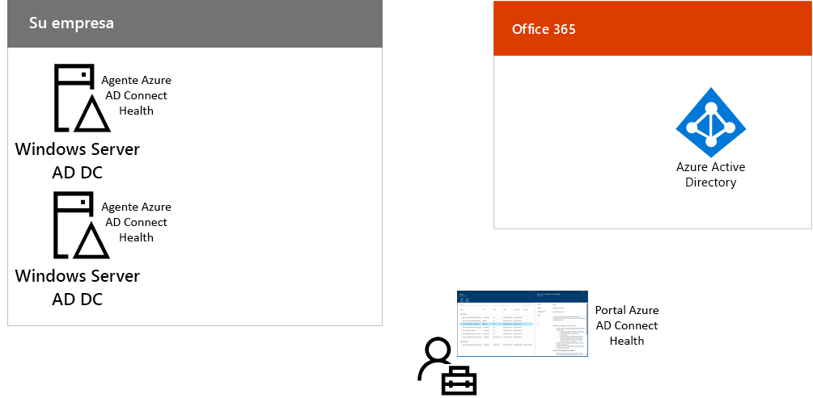

# Paso 8: Supervisar el estado de sincronización

*Este paso es opcional y es válido para las versiones E3 y E5 de Microsoft 365 Enterprise*

En este paso, instalará un agente de Azure AD Connect Health en todos los servidores de identidades locales para supervisar la infraestructura de identidades y los servicios de sincronización proporcionados por Azure AD Connect. La información de supervisión estará disponible en un portal de Azure AD Connect Health, donde puede ver alertas, supervisión de rendimiento, análisis de uso y otra información.

La decisión de diseño clave sobre cómo usar Azure AD Connect Health se basa en la forma en que use Azure AD Connect:

- Si usa la opción de **autenticación administrada**, vea primero [Usar Azure AD Connect Health con sincronización](https://docs.microsoft.com/azure/active-directory/connect-health/active-directory-aadconnect-health-sync) para comprender y configurar Azure AD Connect Health.
- Si solo sincroniza los nombres de las cuentas y los grupos mediante la **autenticación federada** con Servicios de federación de Active Directory (AD FS), empiece con [Usar Azure AD Connect Health con AD FS](https://docs.microsoft.com/azure/active-directory/connect-health/active-directory-aadconnect-health-adfs) para comprender y configurar Azure AD Connect Health.

Cuando complete este paso, tendrá:

- El agente de Azure AD Connect Health instalado en los servidores de proveedor de identidades locales.
- En el portal de Azure AD Connect Health, se mostrará el estado actual de la infraestructura local y las actividades de sincronización con el espacio empresarial de Azure AD para sus suscripciones de Office 365 y EMS.

Como punto de control provisional, puede ver los [criterios de salida](identity-exit-criteria.md#crit-identity-sync-health) de este paso.

## Paso siguiente

|||
|:-------|:-----|
|| [Simplificar las actualizaciones de contraseña](identity-password-writeback.md) |

