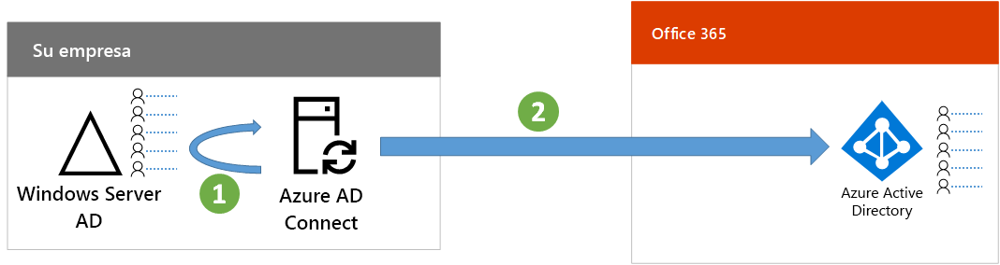

# Paso 7: Sincronizar las identidadesStep 7: Synchronize identities

*Este paso es obligatorio para los entornos híbridos y se aplica a las versiones E3 y E5 de Microsoft 365 Enterprise**This step is required for hybrid environments and applies to both the E3 and E5 versions of Microsoft 365 Enterprise*

En este paso, sincronizará su instancia local de Windows Server Active Directory (AD) con el espacio empresarial de Azure Active Directory (AD) que usan sus suscripciones a Office 365 y Enterprise Mobility + Security (EMS).In this step, you'll synchronize your on-premises Windows Server Active Directory (AD) with the Azure Active Directory (AD) tenant used by your Office 365 and Enterprise Mobility + Security (EMS) subscriptions.

Azure AD Connect es la herramienta compatible de Microsoft que le guiará por el proceso de sincronizar solo las identidades que necesita desde entornos de Windows Server AD de bosque único o bosques múltiples a su espacio empresarial de Azure AD.Azure AD Connect is the supported Microsoft tool that guides you through synchronizing only the identities you really need from single or multi-forest Windows Server AD environments to your Azure AD tenant.

*Cómo sincroniza Azure AD Connect su directorio local con Azure AD**How Azure AD Connect synchronizes your on-premises directory with Azure AD*

La primera decisión en su solución de identidad híbrida es el requisito de autenticación. Las siguientes opciones son:The first decision in your hybrid identity solution is your authentication requirement. The following options are options:

- Con la **autenticación administrada**, Azure AD controla el proceso de autenticación de inicio de sesión del usuario. Hay dos métodos de autenticación administrada:With **managed authentication**, Azure AD handles the authentication process for user sign-in. There are two methods for managed authentication: 
    - **Sincronización de hash de contraseñas (PHS)** [recomendado y obligatorio para algunas características premium]. Esta es la forma más sencilla de habilitar la autenticación para objetos del directorio local en Azure AD. Azure AD Connect extrae la contraseña con hash de Windows Server AD, aplica un procesamiento de seguridad adicional en la contraseña y la guarda en Azure AD. Para obtener más información, vea [Implementación de la sincronización de hash de contraseñas con la sincronización de Azure AD Connect](https://docs.microsoft.com/azure/active-directory/connect/active-directory-aadconnectsync-implement-password-synchronization).**Password Hash Sync (PHS)** [Recommended and required for some premium features]. This is the simplest way to enable authentication for on-premises directory objects in Azure AD. Azure AD Connect extracts the hashed password from Windows Server AD, does extra security processing on the password, and saves it in Azure AD. For more information, see [Implement password hash synchronization with Azure AD Connect sync](https://docs.microsoft.com/azure/active-directory/connect/active-directory-aadconnectsync-implement-password-synchronization).
    - La **autenticación de paso a través (PTA)** proporciona una solución de validación de contraseña simple para los servicios basados en Azure AD. PTA usa un agente que se ejecuta en uno o varios servidores locales para validar las autenticaciones de los usuarios directamente con su instancia local de Windows Server AD. Para obtener más información, vea [Inicio de sesión del usuario con la autenticación de paso a través de Azure Active Directory](https://docs.microsoft.com/azure/active-directory/connect/active-directory-aadconnect-pass-through-authentication).**Pass-through Authentication (PTA)** provides a simple password validation solution for Azure AD-based services. PTA uses an agent running on one or more on-premises servers to validate the user authentications directly with your on-premises Windows Server AD. For more information, see [User sign-in with Azure Active Directory Pass-through Authentication](https://docs.microsoft.com/azure/active-directory/connect/active-directory-aadconnect-pass-through-authentication).
- Con la **autenticación federada**, el proceso de autenticación se redirige a otro proveedor de identidades a través de un servidor de federación de identidades, como Servicios de federación de Active Directory (AD FS), para el inicio de sesión de un usuario. El proveedor de identidades puede proporcionar métodos de autenticación adicionales, como la autenticación basada en tarjeta inteligente. Para obtener más información, vea [Elegir el método de autenticación adecuado para la solución de identidad híbrida de Azure Active Directory](https://docs.microsoft.com/azure/security/azure-ad-choose-authn).With **federated authentication**, the authentication process is redirected to another identity provider through an identity federation server, such as Active Directory Federation Services (AD FS), for a user’s sign-in. The identity provider can provide additional authentication methods, such as smartcard-based authentication. For more information, see [Choosing the right authentication method for your Azure Active Directory hybrid identity solution](https://docs.microsoft.com/azure/security/azure-ad-choose-authn).

Una vez que haya determinado la solución de identidad híbrida, descargue y ejecute la [herramienta de corrección de errores de DirSync IdFix](https://www.microsoft.com/download/details.aspx?id=36832) para analizar los problemas de Windows Server AD.After you've determined your hybrid identity solution, download and run the [IdFix Directory Synchronization Error Remediation Tool](https://www.microsoft.com/download/details.aspx?id=36832) to analyze your Windows Server AD for issues.

Después de resolver todos los problemas que haya identificado la herramienta IdFix, vea [Implementar la sincronización de hash de contraseñas](https://docs.microsoft.com/azure/active-directory/connect/active-directory-aadconnectsync-implement-password-hash-synchronization) para obtener instrucciones sobre cómo instalar la herramienta Azure AD Connect y configurar la sincronización de directorios entre la instancia local de Windows Server AD y el espacio empresarial de Azure AD para sus suscripciones a Office 365 y EMS. Después de que se inicie la sincronización, mantendrá sus cuentas de usuario y grupos con su proveedor de identidades local, como Windows Server AD.After resolving all of the issues identified by the IdFix tool, see [Implement password hash synchronization](https://docs.microsoft.com/azure/active-directory/connect/active-directory-aadconnectsync-implement-password-hash-synchronization) for guidance on installing the Azure AD Connect tool and configuring directory synchronization between your on-premises Windows Server AD and the Azure AD tenant for your Office 365 and EMS subscriptions. After synchronization starts, you'll maintain your user accounts and groups with your on-premises identity provider, such as Windows Server AD.

Microsoft proporciona un conjunto de recomendaciones para el [acceso a identidades y dispositivos](microsoft-365-policies-configurations.md) para asegurar la seguridad y la productividad de los empleados.Microsoft provides a set of recommendations for [identity and device access](microsoft-365-policies-configurations.md) to ensure a secure and productive workforce. 
- Para ver los requisitos recomendados para entornos híbridos, consulte la columna **Active Directory con sincronización de contraseñas hash** en [requisitos previos](identity-access-prerequisites.md#prerequisites).For recommended requirements for hybrid environments, see the **Active Directory with password hash sync** column in [prerequisites](identity-access-prerequisites.md#prerequisites). 

- Para ver los requisitos recomendados para entornos de solo nube, consulte la columna **solo nube** en [requisitos previos](identity-access-prerequisites.md#prerequisites).For recommended requirements for cloud only environments, see the **Cloud only** column in [prerequisites](identity-access-prerequisites.md#prerequisites).

|||
|:-------|:-----|
|| [Guía de laboratorio de pruebas: sincronización de hash de contraseñasTest Lab Guide: Password hash synchronization](password-hash-sync-m365-ent-test-environment.md)  [Guía de laboratorio de pruebas: autenticación de paso a travésTest Lab Guide: Pass-through authentication](pass-through-auth-m365-ent-test-environment.md) |
|||

Como control provisional, puede consultar los [criterios de salida](identity-exit-criteria.md#crit-identity-sync) correspondientes a este paso.As an interim checkpoint, you can see the [exit criteria](identity-exit-criteria.md#crit-identity-sync) corresponding to this step.

## Siguiente pasoNext step

|||
|:-------|:-----|
|| [Supervisar el estado de sincronizaciónMonitor synchronization health](identity-azure-ad-connect-health.md) |

