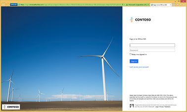

# Paso 5 Simplificación del acceso de usuarios

## Simplificación de actualizaciones de contraseña

*Esta función es opcional para los entornos híbridos y se aplica a las versiones E3 y E5 de Microsoft 365 Enterprise*

En esta sección, permitirá a los usuarios restablecer sus contraseñas a través de Azure Active Directory (Azure AD), que se replicarán en el Active Directory Domain Services (AD DS) local. Este proceso se conoce como reescritura de contraseña. Con la contraseña reescritura, los usuarios no necesitan actualizar las contraseñas mediante el Active Directory Domain Services (AD DS) local donde se almacenan las cuentas de usuario y sus atributos. Esto resulta útil para los usuarios móviles o remotos que no disponen de una conexión de acceso remoto a la red local.

La escritura diferida de contraseñas es necesaria para utilizar por completo las funcionalidades de la característica de Identity Protection, como solicitar a los usuarios que cambien sus contraseñas locales cuando se haya detectado un alto riesgo de que la cuenta se haya visto comprometida.

Para obtener más información e instrucciones de configuración, vea [Azure AD SSPR with password writeback](https://docs.microsoft.com/azure/active-directory/active-directory-passwords-writeback) (SSPR de Azure AD con escritura diferida de contraseñas).

>[!Note]
>Actualice a la última versión de Azure AD Connect para garantizar que tiene la mejor experiencia posible y nuevas características cuando se publican. Para obtener más información, vea [Instalación personalizada de Azure AD Connect](https://docs.microsoft.com/azure/active-directory/connect/active-directory-aadconnect-get-started-custom).
>

|||
|:-------|:-----|
|| [Guía del entorno de pruebas: reescritura de contraseñas](password-writeback-m365-ent-test-environment.md) |
|||

Como control provisional, puede consultar los [criterios de salida](identity-exit-criteria.md#crit-identity-pw-writeback) correspondientes a esta sección.

## Simplificar los restablecimientos de contraseña

*Este paso es opcional y se aplica a las versiones E3 y E5 de Microsoft 365 Enterprise*

En esta sección, habilitará el restablecimiento de contraseña de autoservicio (SSPR) para permitir a los usuarios restablecer o desbloquear sus contraseñas o cuentas. Para alertarle acerca de abusos o usos indebidos, el sistema incluye informes detallados del seguimiento de acceso de los usuarios al sistema, además de notificaciones. Debe habilitar la reescritura de contraseña para poder implementar los restablecimientos de contraseña.

Consulte las [instrucciones para habilitar el restablecimiento de contraseña](https://docs.microsoft.com/azure/active-directory/authentication/howto-sspr-deployment).

|||
|:-------|:-----|
|| [Guía del laboratorio de pruebas: restablecimiento de contraseña](password-reset-m365-ent-test-environment.md) |
|||

Como control provisional, puede consultar los [criterios de salida](identity-exit-criteria.md#crit-identity-pw-reset) correspondientes a esta sección.

## Simplificar el inicio de sesión de usuario

*Esta función es opcional para los entornos híbridos y se aplica a las versiones E3 y E5 de Microsoft 365 Enterprise*

En esta sección, configurará Azure Active Directory Seamless Single Sign-On (Azure AD Seamless SSO) para permitir que los usuarios inicien sesión en servicios que usan cuentas de usuario de Azure AD sin tener que escribir sus contraseñas y, en muchos casos, los nombres de usuario. Esto ofrece facilita a los usuarios el acceso a aplicaciones en la nube, como Office 365, sin necesidad de componentes locales adicionales, como los servidores de federación de identidades.

Configurará el SSO de conexión directa de Azure AD con la herramienta Azure AD Connect.

Vea las [instrucciones para configurar el SSO de conexión directa de Azure AD](https://docs.microsoft.com/azure/active-directory/connect/active-directory-aadconnect-sso-quick-start).

|||
|:-------|:-----|
|| [Guía del entorno de pruebas: Inicio de sesión único de conexión directa de Azure AD](single-sign-on-m365-ent-test-environment.md) |
|||

Como control provisional, puede consultar los [criterios de salida](identity-exit-criteria.md#crit-identity-sso) correspondientes a esta sección.

## Personalizar la página de inicio de sesión de Office 365

*Esta sección es opcional y se aplica a las versiones E3 y E5 de Microsoft 365 Enterprise*

En esta sección, ayudará a los usuarios a reconocer la página de inicio de sesión de su organización; para ello, agregará el nombre de la compañía, el logotipo y otros elementos reconocibles. 

Con Microsoft 365 Enterprise, puede personalizar la apariencia de las páginas de inicio de sesión y del Panel de acceso de forma que incluyan información de usuario personalizada, las combinaciones de colores y el logotipo de su compañía. 

Cuando un usuario intenta iniciar sesión desde un dispositivo, ve algo similar al ejemplo siguiente en la página de inicio de sesión de Office 365 *antes de personalizarla*.

Esto es lo que verá el mismo usuario de Contoso Corporation *después de personalizarla*.

Para obtener más información, vea [Agregar la personalización de marca de su empresa a la página de inicio de sesión de Office 365](https://docs.microsoft.com/office365/admin/setup/customize-sign-in-page).

Para obtener instrucciones de configuración, vea [Incorporación de personalización de marca de empresa a sus páginas de inicio de sesión y del Panel de acceso](http://aka.ms/aadpaddbranding).

Como control provisional, puede consultar los [criterios de salida](identity-exit-criteria.md#crit-identity-custom-sign-in) correspondientes a esta sección.

## Paso siguiente

|||
|:-------|:-----|
|| [Uso de grupos para facilitar la administración](identity-self-service-group-management.md) |

