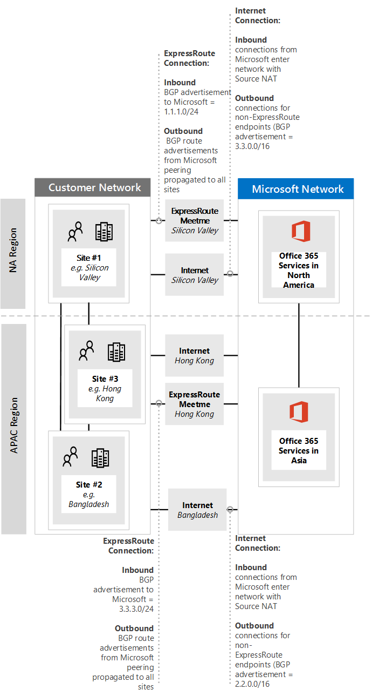

# <a name="implementing-expressroute-for-office-365"></a><span data-ttu-id="48a87-103">Implementar ExpressRoute para Office 365</span><span class="sxs-lookup"><span data-stu-id="48a87-103">Implementing ExpressRoute for Office 365</span></span>

<span data-ttu-id="48a87-104">*Este artículo afecta tanto a Office 365 Enterprise como a Microsoft 365 Enterprise*</span><span class="sxs-lookup"><span data-stu-id="48a87-104">*This article applies to both Microsoft 365 Enterprise and Office 365 Enterprise.*</span></span>

<span data-ttu-id="48a87-105">ExpressRoute para Office 365 proporciona una ruta de enrutamiento alternativa a muchos servicios Office 365 Internet.</span><span class="sxs-lookup"><span data-stu-id="48a87-105">ExpressRoute for Office 365 provides an alternate routing path to many internet facing Office 365 services.</span></span> <span data-ttu-id="48a87-106">La arquitectura de ExpressRoute para Office 365 se basa en la publicidad de prefijos IP públicos de servicios de Office 365 que ya son accesibles a través de Internet en los circuitos de ExpressRoute aprovisionados para la redistribución posterior de esos prefijos IP en la red.</span><span class="sxs-lookup"><span data-stu-id="48a87-106">The architecture of ExpressRoute for Office 365 is based on advertising public IP prefixes of Office 365 services that are already accessible over the Internet into your provisioned ExpressRoute circuits for subsequent redistribution of those IP prefixes into your network.</span></span> <span data-ttu-id="48a87-107">Con ExpressRoute, habilita varias rutas de enrutamiento diferentes, a través de Internet y a través de ExpressRoute, para muchos Office 365 servicios.</span><span class="sxs-lookup"><span data-stu-id="48a87-107">With ExpressRoute you effectively enable several different routing paths, through the internet and through ExpressRoute, for many Office 365 services.</span></span> <span data-ttu-id="48a87-108">Este estado de enrutamiento en la red puede representar un cambio significativo en la forma en que se diseñó la topología de red interna.</span><span class="sxs-lookup"><span data-stu-id="48a87-108">This state of routing on your network may represent a significant change to how your internal network topology is designed.</span></span>
  
 <span data-ttu-id="48a87-109">**Estado:** Guía completa v2</span><span class="sxs-lookup"><span data-stu-id="48a87-109">**Status:** Complete Guide v2</span></span>
  
<span data-ttu-id="48a87-110">Debe planear cuidadosamente la implementación de ExpressRoute Office 365 para adaptarse a las complejidades de red de tener el enrutamiento disponible a través de un circuito dedicado con rutas inyectadas en la red principal e Internet.</span><span class="sxs-lookup"><span data-stu-id="48a87-110">You must carefully plan your ExpressRoute for Office 365 implementation to accommodate for the network complexities of having routing available via both a dedicated circuit with routes injected into your core network and the internet.</span></span> <span data-ttu-id="48a87-111">Si usted y su equipo no realizan la planeación y las pruebas detalladas de esta guía, existe un alto riesgo de que experimente una pérdida intermitente o total de conectividad a los servicios de Office 365 cuando el circuito de ExpressRoute esté habilitado.</span><span class="sxs-lookup"><span data-stu-id="48a87-111">If you and your team don't perform the detailed planning and testing in this guide, there is a high risk you'll experience intermittent or a total loss of connectivity to Office 365 services when the ExpressRoute circuit is enabled.</span></span>
  
<span data-ttu-id="48a87-112">Para tener una implementación correcta, deberá analizar los requisitos de la infraestructura, analizar la evaluación y el diseño detallados de la red, planear cuidadosamente el lanzamiento de forma controlada y por fases y crear un plan detallado de validación y pruebas.</span><span class="sxs-lookup"><span data-stu-id="48a87-112">To have a successful implementation, you will need to analyze your infrastructure requirements, go through detailed network assessment and design, carefully plan the rollout in a staged and controlled manner, and build a detailed validation and testing plan.</span></span> <span data-ttu-id="48a87-113">Para un entorno grande y distribuido, no es raro ver implementaciones que abarcan varios meses.</span><span class="sxs-lookup"><span data-stu-id="48a87-113">For a large, distributed environment it's not uncommon to see implementations span several months.</span></span> <span data-ttu-id="48a87-114">Esta guía está diseñada para ayudarle a planear con antelación.</span><span class="sxs-lookup"><span data-stu-id="48a87-114">This guide is designed to help you plan ahead.</span></span>
  
<span data-ttu-id="48a87-115">Las grandes implementaciones correctas pueden tardar seis meses en planearse y a menudo incluyen miembros del equipo de muchas áreas de la organización, incluidos los administradores de redes, firewalls y servidores proxy, administradores de Office 365, seguridad, soporte al usuario final, administración de proyectos y patrocinador ejecutivo.</span><span class="sxs-lookup"><span data-stu-id="48a87-115">Large successful deployments may take six months in planning and often include team members from many areas in the organization including networking, Firewall and Proxy server administrators, Office 365 administrators, security, end-user support, project management, and executive sponsorship.</span></span> <span data-ttu-id="48a87-116">Su inversión en el proceso de planeación reducirá la probabilidad de que experimente errores de implementación que resulten en tiempo de inactividad o problemas complejos y costosos.</span><span class="sxs-lookup"><span data-stu-id="48a87-116">Your investment in the planning process will reduce the likelihood that you'll experience deployment failures resulting in downtime or complex and expensive troubleshooting.</span></span>
  
<span data-ttu-id="48a87-117">Esperamos que se completen los siguientes requisitos previos antes de iniciar esta guía de implementación.</span><span class="sxs-lookup"><span data-stu-id="48a87-117">We expect the following pre-requisites to be completed before this implementation guide is started.</span></span>
  
1. <span data-ttu-id="48a87-118">Ha completado una evaluación de red para determinar si ExpressRoute se recomienda y aprueba.</span><span class="sxs-lookup"><span data-stu-id="48a87-118">You've completed a network assessment to determine if ExpressRoute is recommended and approved.</span></span>

2. <span data-ttu-id="48a87-119">Ha seleccionado un proveedor de servicios de red de ExpressRoute.</span><span class="sxs-lookup"><span data-stu-id="48a87-119">You've selected an ExpressRoute network service provider.</span></span> <span data-ttu-id="48a87-120">Encuentre detalles sobre los partners [de ExpressRoute y las ubicaciones de emparejamiento.](/azure/expressroute/expressroute-locations)</span><span class="sxs-lookup"><span data-stu-id="48a87-120">Find details about the [ExpressRoute partners and peering locations](/azure/expressroute/expressroute-locations).</span></span>

3. <span data-ttu-id="48a87-121">Ya ha leído y entendido la documentación de [ExpressRoute](https://azure.microsoft.com/documentation/services/expressroute/) y su red interna puede cumplir los requisitos previos de ExpressRoute de un extremo a otro.</span><span class="sxs-lookup"><span data-stu-id="48a87-121">You've already read and understand the [ExpressRoute documentation](https://azure.microsoft.com/documentation/services/expressroute/) and your internal network is able to meet ExpressRoute pre-requisites end to end.</span></span>

4. <span data-ttu-id="48a87-122">Su equipo ha leído toda la guía pública y la documentación en , y ha visto la serie de aprendizaje de Azure ExpressRoute para Office 365 en canal 9 para obtener una comprensión de los detalles técnicos críticos, [https://aka.ms/expressrouteoffice365](./azure-expressroute.md) [https://aka.ms/ert](https://aka.ms/ert) como: [](https://channel9.msdn.com/series/aer)</span><span class="sxs-lookup"><span data-stu-id="48a87-122">Your team has read all of the public guidance and documentation at [https://aka.ms/expressrouteoffice365](./azure-expressroute.md), [https://aka.ms/ert](https://aka.ms/ert), and watched the [Azure ExpressRoute for Office 365 Training](https://channel9.msdn.com/series/aer) series on Channel 9 to gain an understanding of critical technical details including:</span></span>

      - <span data-ttu-id="48a87-123">Las dependencias de Internet de los servicios SaaS.</span><span class="sxs-lookup"><span data-stu-id="48a87-123">The internet dependencies of SaaS services.</span></span>

      - <span data-ttu-id="48a87-124">Cómo evitar rutas asimétricas y controlar el enrutamiento complejo.</span><span class="sxs-lookup"><span data-stu-id="48a87-124">How to avoid asymmetric routes and handle complex routing.</span></span>

      - <span data-ttu-id="48a87-125">Cómo incorporar controles de seguridad perimetral, disponibilidad y nivel de aplicación.</span><span class="sxs-lookup"><span data-stu-id="48a87-125">How to incorporate perimeter security, availability, and application level controls.</span></span>

## <a name="begin-by-gathering-requirements"></a><span data-ttu-id="48a87-126">Empezar por recopilar requisitos</span><span class="sxs-lookup"><span data-stu-id="48a87-126">Begin by gathering requirements</span></span>
<span data-ttu-id="48a87-127"><a name="requirements"> </a></span><span class="sxs-lookup"><span data-stu-id="48a87-127"><a name="requirements"> </a></span></span>

<span data-ttu-id="48a87-128">Empiece por determinar qué características y servicios tiene previsto adoptar dentro de su organización.</span><span class="sxs-lookup"><span data-stu-id="48a87-128">Start by determining which features and services you plan to adopt within your organization.</span></span> <span data-ttu-id="48a87-129">Debe determinar qué características de los distintos servicios de Office 365 se usarán y qué ubicaciones de la red hospedarán a las personas que usan esas características.</span><span class="sxs-lookup"><span data-stu-id="48a87-129">You need to determine which features of the different Office 365 services will be used and which locations on your network will host people using those features.</span></span> <span data-ttu-id="48a87-130">Con el catálogo de escenarios, debe agregar los atributos de red que cada uno de esos escenarios requiere; como los flujos de tráfico de red entrantes y salientes y si los Office 365 están disponibles a través de ExpressRoute o no.</span><span class="sxs-lookup"><span data-stu-id="48a87-130">With the catalog of scenarios, you need to add the network attributes that each of those scenarios require; such as inbound and outbound network traffic flows and if the Office 365 endpoints are available over ExpressRoute or not.</span></span>
  
<span data-ttu-id="48a87-131">Para recopilar los requisitos de la organización:</span><span class="sxs-lookup"><span data-stu-id="48a87-131">To gather your organization's requirements:</span></span>
  
- <span data-ttu-id="48a87-132">Cataloge el tráfico de red entrante y saliente para los Office 365 que usa su organización.</span><span class="sxs-lookup"><span data-stu-id="48a87-132">Catalog the inbound and outbound network traffic for the Office 365 services your organization is using.</span></span> <span data-ttu-id="48a87-133">Consulte Office 365 de direcciones URL e intervalos de direcciones IP para obtener la descripción de los flujos que requieren Office 365 diferentes escenarios.</span><span class="sxs-lookup"><span data-stu-id="48a87-133">Consult Office 365 URLs and IP address ranges page for the description of flows that different Office 365 scenarios require.</span></span>

- <span data-ttu-id="48a87-134">Recopila documentación sobre la topología de red existente que muestra detalles de la topología y la red troncal WAN interna, la conectividad de sitios satélite, la conectividad de usuario de última milla, el enrutamiento a puntos de salida perimetral de red y los servicios proxy.</span><span class="sxs-lookup"><span data-stu-id="48a87-134">Gather documentation of existing network topology showing details of your internal WAN backbone and topology, connectivity of satellite sites, last mile user connectivity, routing to network perimeter egress points, and proxy services.</span></span>

  - <span data-ttu-id="48a87-135">Identifique los puntos de conexión de servicio entrantes en los diagramas de red a los que se Office 365 y otros servicios Microsoft se conectarán, mostrando las rutas de conexión de Internet y ExpressRoute propuestas.</span><span class="sxs-lookup"><span data-stu-id="48a87-135">Identify inbound service endpoints on the network diagrams that Office 365 and other Microsoft services will connect to, showing both internet and proposed ExpressRoute connection paths.</span></span>

  - <span data-ttu-id="48a87-136">Identifique todas las ubicaciones de usuario geográficas y la conectividad WAN entre ubicaciones, junto con las ubicaciones con las que actualmente hay una salida a Internet y qué ubicaciones se propone que tengan una salida a una ubicación de emparejamiento de ExpressRoute.</span><span class="sxs-lookup"><span data-stu-id="48a87-136">Identify all geographic user locations and WAN connectivity between locations along with which locations currently have an egress to the internet and which locations are proposed to have an egress to an ExpressRoute peering location.</span></span>

  - <span data-ttu-id="48a87-137">Identifique todos los dispositivos perimetrales, como servidores proxy, firewalls, y así sucesivamente y cataloge su relación con los flujos que van a través de Internet y ExpressRoute.</span><span class="sxs-lookup"><span data-stu-id="48a87-137">Identify all edge devices, such as proxies, firewalls, and so on and catalog their relationship to flows going over the Internet and ExpressRoute.</span></span>

  - <span data-ttu-id="48a87-138">Documente si los usuarios finales tendrán acceso Office 365 a través de enrutamiento directo o proxy indirecto de aplicaciones para flujos de Internet y ExpressRoute.</span><span class="sxs-lookup"><span data-stu-id="48a87-138">Document whether end users will access Office 365 services via direct routing or indirect application proxy for both Internet and ExpressRoute flows.</span></span>

- <span data-ttu-id="48a87-139">Agregue la ubicación del inquilino y las ubicaciones de reunión al diagrama de red.</span><span class="sxs-lookup"><span data-stu-id="48a87-139">Add the location of your tenant and meet-me locations to your network diagram.</span></span>

- <span data-ttu-id="48a87-140">Calcule las características de latencia y rendimiento de red esperados y observados desde las principales ubicaciones de usuario hasta Office 365.</span><span class="sxs-lookup"><span data-stu-id="48a87-140">Estimate the expected and observed network performance and latency characteristics from major user locations to Office 365.</span></span> <span data-ttu-id="48a87-141">Tenga en cuenta que Office 365 es un conjunto global y distribuido de servicios y los usuarios se conectarán a ubicaciones que pueden ser diferentes de la ubicación de su inquilino.</span><span class="sxs-lookup"><span data-stu-id="48a87-141">Keep in mind that Office 365 is a global and distributed set of services and users will be connecting to locations that may be different from the location of their tenant.</span></span> <span data-ttu-id="48a87-142">Por este motivo, se recomienda medir y optimizar la latencia entre el usuario y el borde más cercano de la red global de Microsoft a través de ExpressRoute y las conexiones a Internet.</span><span class="sxs-lookup"><span data-stu-id="48a87-142">For this reason, it is recommended to measure and optimize for latency between the user and the closest edge of Microsoft global network over ExpressRoute and Internet connections.</span></span> <span data-ttu-id="48a87-143">Puede usar los resultados de la evaluación de red para ayudar con esta tarea.</span><span class="sxs-lookup"><span data-stu-id="48a87-143">You can use your findings from the network assessment to aid with this task.</span></span>

- <span data-ttu-id="48a87-144">Enumerar la seguridad de red de la empresa y los requisitos de alta disponibilidad que deben cumplirse con la nueva conexión de ExpressRoute.</span><span class="sxs-lookup"><span data-stu-id="48a87-144">List company network security and high availability requirements that need to be met with the new ExpressRoute connection.</span></span> <span data-ttu-id="48a87-145">Por ejemplo, cómo los usuarios siguen teniendo acceso a Office 365 en caso de que se produce un error en la salida de Internet o el circuito de ExpressRoute.</span><span class="sxs-lookup"><span data-stu-id="48a87-145">For example, how do users continue to get access to Office 365 in the event of the Internet egress or ExpressRoute circuit failure.</span></span>

- <span data-ttu-id="48a87-146">Documente qué flujos de red Office 365 entrantes y salientes usarán la ruta de acceso de Internet y cuáles usarán ExpressRoute.</span><span class="sxs-lookup"><span data-stu-id="48a87-146">Document which inbound and outbound Office 365 network flows will use the Internet path and which will use ExpressRoute.</span></span> <span data-ttu-id="48a87-147">Los detalles específicos de las ubicaciones geográficas de los usuarios y los detalles de la topología de red local pueden requerir que el plan sea diferente de una ubicación de usuario a otra.</span><span class="sxs-lookup"><span data-stu-id="48a87-147">The specifics of geographical locations of your users and details of your on-premises network topology may require the plan to be different from one user location to another.</span></span>

### <a name="catalog-your-outbound-and-inbound-network-traffic"></a><span data-ttu-id="48a87-148">Catalogar el tráfico de red saliente y entrante</span><span class="sxs-lookup"><span data-stu-id="48a87-148">Catalog your outbound and inbound network traffic</span></span>
<span data-ttu-id="48a87-149"><a name="trafficCatalog"> </a></span><span class="sxs-lookup"><span data-stu-id="48a87-149"><a name="trafficCatalog"> </a></span></span>

<span data-ttu-id="48a87-150">Para minimizar el enrutamiento y otras complejidades de red, se recomienda usar ExpressRoute solo para Office 365 para los flujos de tráfico de red necesarios para pasar por una conexión dedicada debido a requisitos normativos o como resultado de la evaluación de red.</span><span class="sxs-lookup"><span data-stu-id="48a87-150">To minimize routing and other network complexities, we recommend that you only use ExpressRoute for Office 365 for the network traffic flows that are required to go over a dedicated connection due to regulatory requirements or as the result of the network assessment.</span></span> <span data-ttu-id="48a87-151">Además, le recomendamos que escente el ámbito del enrutamiento de ExpressRoute y aborde los flujos de tráfico de red salientes y entrantes como distintas y distintas etapas del proyecto de implementación.</span><span class="sxs-lookup"><span data-stu-id="48a87-151">Additionally, we recommend that you stage the scope of ExpressRoute routing and approach outbound and inbound network traffic flows as different and distinct stages of the implementation project.</span></span> <span data-ttu-id="48a87-152">Implementar ExpressRoute para Office 365 para flujos de tráfico de red salientes iniciados por el usuario y dejar flujos de tráfico de red entrantes a través de Internet puede ayudar a controlar el aumento de la complejidad topológica y los riesgos de introducir posibilidades de enrutamiento asimétrico adicionales.</span><span class="sxs-lookup"><span data-stu-id="48a87-152">Deploy ExpressRoute for Office 365 for just user initiated outbound network traffic flows and leave inbound network traffic flows across the Internet can help to control the increase in topological complexity and risks of introducing additional asymmetric routing possibilities.</span></span>
  
<span data-ttu-id="48a87-153">El catálogo de tráfico de red debe contener listas de todas las conexiones de red entrantes y salientes que tendrá entre la red local y Microsoft.</span><span class="sxs-lookup"><span data-stu-id="48a87-153">Your network traffic catalog should contain listings of all the inbound and outbound network connections that you'll have between your on-premises network and Microsoft.</span></span>
  
- <span data-ttu-id="48a87-154">Los flujos de tráfico de red salientes son escenarios en los que se inicia una conexión desde el entorno local, como desde clientes o servidores internos, con un destino de la servicios Microsoft.</span><span class="sxs-lookup"><span data-stu-id="48a87-154">Outbound network traffic flows are any scenarios where a connection is initiated from your on-premises environment, such as from internal clients or servers, with a destination of the Microsoft services.</span></span> <span data-ttu-id="48a87-155">Estas conexiones pueden ser directas Office 365 o indirectas, como cuando la conexión pasa por servidores proxy, firewalls u otros dispositivos de red en la ruta de acceso a Office 365.</span><span class="sxs-lookup"><span data-stu-id="48a87-155">These connections may be direct to Office 365 or indirect, such as when the connection goes through proxy servers, firewalls, or other networking devices on the path to Office 365.</span></span>

- <span data-ttu-id="48a87-156">Los flujos de tráfico de red entrantes son escenarios en los que se inicia una conexión desde la nube de Microsoft a un host local.</span><span class="sxs-lookup"><span data-stu-id="48a87-156">Inbound network traffic flows are any scenarios where a connection is initiated from the Microsoft cloud to an on-premises host.</span></span> <span data-ttu-id="48a87-157">Por lo general, estas conexiones deben pasar por firewall y otra infraestructura de seguridad que la directiva de seguridad del cliente requiere para los flujos originados externamente.</span><span class="sxs-lookup"><span data-stu-id="48a87-157">These connections typically need to go through firewall and other security infrastructure that customer security policy requires for externally originated flows.</span></span>

<span data-ttu-id="48a87-158">Lea  la sección Garantizar la simetría de ruta del artículo Enrutamiento con [ExpressRoute](https://support.office.com/article/Routing-with-ExpressRoute-for-Office-365-e1da26c6-2d39-4379-af6f-4da213218408) para Office 365 para determinar qué servicios enviarán tráfico entrante y buscar la columna marcada como **ExpressRoute para Office 365** en el artículo de referencia de extremos de [Office 365](https://support.office.com/article/Office-365-URLs-and-IP-address-ranges-8548a211-3fe7-47cb-abb1-355ea5aa88a2) para determinar el resto de la información de conectividad.</span><span class="sxs-lookup"><span data-stu-id="48a87-158">Read the **Ensuring route symmetry** section of the article [Routing with ExpressRoute for Office 365](https://support.office.com/article/Routing-with-ExpressRoute-for-Office-365-e1da26c6-2d39-4379-af6f-4da213218408) to determine which services will send inbound traffic and look for the column marked **ExpressRoute for Office 365** in the [Office 365 endpoints](https://support.office.com/article/Office-365-URLs-and-IP-address-ranges-8548a211-3fe7-47cb-abb1-355ea5aa88a2) reference article to determine the rest of the connectivity information.</span></span>
  
<span data-ttu-id="48a87-159">Para cada servicio que requiera una conexión saliente, querrá describir la conectividad planeada para el servicio, incluido el enrutamiento de red, la configuración de proxy, la inspección de paquetes y las necesidades de ancho de banda.</span><span class="sxs-lookup"><span data-stu-id="48a87-159">For each service that requires an outbound connection, you'll want to describe the planned connectivity for the service including network routing, proxy configuration, packet inspection, and bandwidth needs.</span></span>
  
<span data-ttu-id="48a87-160">Para cada servicio que requiera una conexión entrante, necesitará información adicional.</span><span class="sxs-lookup"><span data-stu-id="48a87-160">For each service that requires an inbound connection, you'll need some additional information.</span></span> <span data-ttu-id="48a87-161">Los servidores de la nube de Microsoft establecerán conexiones a la red local.</span><span class="sxs-lookup"><span data-stu-id="48a87-161">Servers in the Microsoft cloud will establish connections to your on-premises network.</span></span> <span data-ttu-id="48a87-162">para asegurarse de que las conexiones se realizan correctamente, querrá describir todos los aspectos de esta conectividad, incluidos; las entradas DNS públicas para los servicios que aceptarán estas conexiones entrantes, las direcciones IP IPv4 con formato CIDR, los equipos ISP implicados y la forma en que se administra NAT entrante o NAT de origen para estas conexiones.</span><span class="sxs-lookup"><span data-stu-id="48a87-162">to ensure the connections are made correctly, you'll want to describe all aspects of this connectivity, including; the public DNS entries for the services that will accept these inbound connections, the CIDR formatted IPv4 IP addresses, which ISP equipment is involved, and how inbound NAT or source NAT is handled for these connections.</span></span>
  
<span data-ttu-id="48a87-163">Las conexiones entrantes deben revisarse independientemente de si se conectan a través de Internet o ExpressRoute para garantizar que no se haya introducido el enrutamiento asimétrico.</span><span class="sxs-lookup"><span data-stu-id="48a87-163">Inbound connections should be reviewed regardless of whether they're connecting over the internet or ExpressRoute to ensure asymmetric routing hasn't been introduced.</span></span> <span data-ttu-id="48a87-164">En algunos casos, los puntos de conexión locales a los que los servicios Office 365 inician conexiones entrantes también pueden tener acceso otros microsoft y no servicios Microsoft.</span><span class="sxs-lookup"><span data-stu-id="48a87-164">In some cases, on-premises endpoints that Office 365 services initiate inbound connections to may also need to be accessed by other Microsoft and non-Microsoft services.</span></span> <span data-ttu-id="48a87-165">Es fundamental que habilitar el enrutamiento de ExpressRoute a estos servicios Office 365 no rompa otros escenarios.</span><span class="sxs-lookup"><span data-stu-id="48a87-165">It is paramount that enabling ExpressRoute routing to these services for Office 365 purposes doesn't break other scenarios.</span></span> <span data-ttu-id="48a87-166">En muchos casos, es posible que los clientes necesiten implementar cambios específicos en su red interna, como NAT basada en origen, para garantizar que los flujos entrantes de Microsoft permanezcan simétricos después de habilitar ExpressRoute.</span><span class="sxs-lookup"><span data-stu-id="48a87-166">In many cases, customers may need to implement specific changes to their internal network, such as source based NAT, to ensure that inbound flows from Microsoft remain symmetric after ExpressRoute is enabled.</span></span>
  
<span data-ttu-id="48a87-167">Este es un ejemplo del nivel de detalle requerido.</span><span class="sxs-lookup"><span data-stu-id="48a87-167">Here's a sample of the level of detail required.</span></span> <span data-ttu-id="48a87-168">En este caso, Exchange híbrido se enrutaría al sistema local a través de ExpressRoute.</span><span class="sxs-lookup"><span data-stu-id="48a87-168">In this case Exchange Hybrid would route to the on-premises system over ExpressRoute.</span></span> 

|<span data-ttu-id="48a87-169">Connection (propiedad)</span><span class="sxs-lookup"><span data-stu-id="48a87-169">Connection property</span></span>   |<span data-ttu-id="48a87-170">Valor</span><span class="sxs-lookup"><span data-stu-id="48a87-170">Value</span></span>  |
|----------|-----------|
|<span data-ttu-id="48a87-171">**Dirección del tráfico de red**</span><span class="sxs-lookup"><span data-stu-id="48a87-171">**Network traffic direction**</span></span> <br/> |<span data-ttu-id="48a87-172">Entrada</span><span class="sxs-lookup"><span data-stu-id="48a87-172">Inbound</span></span>  <br/> |
|<span data-ttu-id="48a87-173">**Servicio**</span><span class="sxs-lookup"><span data-stu-id="48a87-173">**Service**</span></span> <br/> |<span data-ttu-id="48a87-174">Exchange Hybrid</span><span class="sxs-lookup"><span data-stu-id="48a87-174">Exchange Hybrid</span></span>  <br/> |
|<span data-ttu-id="48a87-175">**Extremo Office 365 público (origen)**</span><span class="sxs-lookup"><span data-stu-id="48a87-175">**Public Office 365 endpoint (source)**</span></span> <br/> |<span data-ttu-id="48a87-176">Exchange Online (direcciones IP)</span><span class="sxs-lookup"><span data-stu-id="48a87-176">Exchange Online (IP addresses)</span></span>  <br/> |
|<span data-ttu-id="48a87-177">**Extremo local público (destino)**</span><span class="sxs-lookup"><span data-stu-id="48a87-177">**Public On-Premises Endpoint (destination)**</span></span> <br/> |<span data-ttu-id="48a87-178">5.5.5.5</span><span class="sxs-lookup"><span data-stu-id="48a87-178">5.5.5.5</span></span>  <br/> |
|<span data-ttu-id="48a87-179">**Entrada DNS pública (Internet)**</span><span class="sxs-lookup"><span data-stu-id="48a87-179">**Public (Internet) DNS entry**</span></span> <br/> |<span data-ttu-id="48a87-180">Autodiscover.contoso.com</span><span class="sxs-lookup"><span data-stu-id="48a87-180">Autodiscover.contoso.com</span></span>  <br/> |
|<span data-ttu-id="48a87-181">**¿Este extremo local se usará para otros usuarios (que no Office 365) servicios Microsoft**</span><span class="sxs-lookup"><span data-stu-id="48a87-181">**Will this on-premises endpoint be used for by other (non-Office 365) Microsoft services**</span></span> <br/> |<span data-ttu-id="48a87-182">No</span><span class="sxs-lookup"><span data-stu-id="48a87-182">No</span></span>  <br/> |
|<span data-ttu-id="48a87-183">**¿Los usuarios o sistemas de Internet usarán este extremo local?**</span><span class="sxs-lookup"><span data-stu-id="48a87-183">**Will this on-premises endpoint be used by users/systems on the Internet**</span></span> <br/> |<span data-ttu-id="48a87-184">Sí</span><span class="sxs-lookup"><span data-stu-id="48a87-184">Yes</span></span>  <br/> |
|<span data-ttu-id="48a87-185">**Sistemas internos publicados a través de puntos de conexión públicos**</span><span class="sxs-lookup"><span data-stu-id="48a87-185">**Internal systems published through public endpoints**</span></span> <br/> |<span data-ttu-id="48a87-186">Exchange Server de acceso de cliente (local) 192.168.101, 192.168.102, 192.168.103</span><span class="sxs-lookup"><span data-stu-id="48a87-186">Exchange Server client access role (on-premises) 192.168.101, 192.168.102, 192.168.103</span></span>  <br/> |
|<span data-ttu-id="48a87-187">**Anuncio DE IP del extremo público**</span><span class="sxs-lookup"><span data-stu-id="48a87-187">**IP advertisement of the public endpoint**</span></span> <br/> |<span data-ttu-id="48a87-188">**To Internet**: 5.5.0.0/16 **To ExpressRoute**: 5.5.5.0/24</span><span class="sxs-lookup"><span data-stu-id="48a87-188">**To Internet**: 5.5.0.0/16 **To ExpressRoute**: 5.5.5.0/24</span></span>  <br/> |
|<span data-ttu-id="48a87-189">**Controles de seguridad/perímetro**</span><span class="sxs-lookup"><span data-stu-id="48a87-189">**Security/Perimeter Controls**</span></span> <br/> |<span data-ttu-id="48a87-190">**Ruta de** acceso a Internet: DeviceID_002  **de ExpressRoute**: DeviceID_003</span><span class="sxs-lookup"><span data-stu-id="48a87-190">**Internet path**: DeviceID_002  **ExpressRoute path**: DeviceID_003</span></span>  <br/> |
|<span data-ttu-id="48a87-191">**Alta disponibilidad**</span><span class="sxs-lookup"><span data-stu-id="48a87-191">**High Availability**</span></span> <br/> |<span data-ttu-id="48a87-192">Activo/Activo en 2 circuitos de ExpressRoute con redundancia geográfica: Chicago y Dallas</span><span class="sxs-lookup"><span data-stu-id="48a87-192">Active/Active across 2 geo-redundant / ExpressRoute circuits - Chicago and Dallas</span></span>  <br/> |
|<span data-ttu-id="48a87-193">**Control de simetría de ruta**</span><span class="sxs-lookup"><span data-stu-id="48a87-193">**Path symmetry control**</span></span> <br/> |<span data-ttu-id="48a87-194">**Método**: Ruta de acceso NAT de **origen a Internet:** Conexiones entrantes NAT de origen a 192.168.5.5 Ruta de **acceso de ExpressRoute:** Conexiones NAT de origen a 192.168.1.0 (Chicago) y 192.168.2.0 (Dallas)</span><span class="sxs-lookup"><span data-stu-id="48a87-194">**Method**: Source NAT **Internet path**: Source NAT inbound connections to 192.168.5.5 **ExpressRoute path**: Source NAT connections to 192.168.1.0 (Chicago) and 192.168.2.0 (Dallas)</span></span>  <br/> |

<span data-ttu-id="48a87-195">Este es un ejemplo de un servicio que solo es saliente:</span><span class="sxs-lookup"><span data-stu-id="48a87-195">Here's a sample of a service that is outbound only:</span></span>

|<span data-ttu-id="48a87-196">**Connection (propiedad)**</span><span class="sxs-lookup"><span data-stu-id="48a87-196">**Connection property**</span></span>|<span data-ttu-id="48a87-197">**Valor**</span><span class="sxs-lookup"><span data-stu-id="48a87-197">**Value**</span></span>|
|----------|-----------|
|<span data-ttu-id="48a87-198">**Dirección del tráfico de red**</span><span class="sxs-lookup"><span data-stu-id="48a87-198">**Network traffic direction**</span></span> <br/> |<span data-ttu-id="48a87-199">Salida</span><span class="sxs-lookup"><span data-stu-id="48a87-199">Outbound</span></span>  <br/> |
|<span data-ttu-id="48a87-200">**Servicio**</span><span class="sxs-lookup"><span data-stu-id="48a87-200">**Service**</span></span> <br/> |<span data-ttu-id="48a87-201">SharePoint Online</span><span class="sxs-lookup"><span data-stu-id="48a87-201">SharePoint Online</span></span>  <br/> |
|<span data-ttu-id="48a87-202">**Extremo local (origen)**</span><span class="sxs-lookup"><span data-stu-id="48a87-202">**On-premises endpoint (source)**</span></span> <br/> |<span data-ttu-id="48a87-203">Estación de trabajo de usuario</span><span class="sxs-lookup"><span data-stu-id="48a87-203">User workstation</span></span>  <br/> |
|<span data-ttu-id="48a87-204">**Extremo Office 365 público (destino)**</span><span class="sxs-lookup"><span data-stu-id="48a87-204">**Public Office 365 endpoint (destination)**</span></span> <br/> |<span data-ttu-id="48a87-205">SharePoint En línea (direcciones IP)</span><span class="sxs-lookup"><span data-stu-id="48a87-205">SharePoint Online (IP addresses)</span></span>  <br/> |
|<span data-ttu-id="48a87-206">**Entrada DNS pública (Internet)**</span><span class="sxs-lookup"><span data-stu-id="48a87-206">**Public (Internet) DNS entry**</span></span> <br/> |<span data-ttu-id="48a87-207">\*.sharepoint.com (y FQDN adicionales)</span><span class="sxs-lookup"><span data-stu-id="48a87-207">\*.sharepoint.com (and additional FQDNs)</span></span>  <br/> |
|<span data-ttu-id="48a87-208">**CDN Referencias**</span><span class="sxs-lookup"><span data-stu-id="48a87-208">**CDN Referrals**</span></span> <br/> |<span data-ttu-id="48a87-209">cdn.sharepointonline.com (y FQDN adicionales): direcciones IP mantenidas por CDN proveedores)</span><span class="sxs-lookup"><span data-stu-id="48a87-209">cdn.sharepointonline.com (and additional FQDNs) - IP addresses maintained by CDN providers)</span></span>  <br/> |
|<span data-ttu-id="48a87-210">**Anuncio IP y NAT en uso**</span><span class="sxs-lookup"><span data-stu-id="48a87-210">**IP advertisement and NAT in use**</span></span> <br/> |<span data-ttu-id="48a87-211">**Ruta de acceso a Internet/NAT de** origen: 1.1.1.0/24</span><span class="sxs-lookup"><span data-stu-id="48a87-211">**Internet path/Source NAT**: 1.1.1.0/24</span></span>  <br/> <span data-ttu-id="48a87-212">Ruta de acceso **de ExpressRoute/NAT** de origen: 1.1.2.0/24 (Chicago) y 1.1.3.0/24 (Dallas)</span><span class="sxs-lookup"><span data-stu-id="48a87-212">**ExpressRoute path/Source NAT**: 1.1.2.0/24 (Chicago) and 1.1.3.0/24 (Dallas)</span></span>  <br/> |
|<span data-ttu-id="48a87-213">**Método de conectividad**</span><span class="sxs-lookup"><span data-stu-id="48a87-213">**Connectivity method**</span></span> <br/> |<span data-ttu-id="48a87-214">**Internet:** a través del proxy de la capa 7 (archivo .pac)</span><span class="sxs-lookup"><span data-stu-id="48a87-214">**Internet**: via layer 7 proxy (.pac file)</span></span>  <br/> <span data-ttu-id="48a87-215">**ExpressRoute:** enrutamiento directo (sin proxy)</span><span class="sxs-lookup"><span data-stu-id="48a87-215">**ExpressRoute**: direct routing (no proxy)</span></span>  <br/> |
|<span data-ttu-id="48a87-216">**Controles de seguridad/perímetro**</span><span class="sxs-lookup"><span data-stu-id="48a87-216">**Security/Perimeter Controls**</span></span> <br/> |<span data-ttu-id="48a87-217">**Ruta de acceso a Internet:** DeviceID_002</span><span class="sxs-lookup"><span data-stu-id="48a87-217">**Internet path**: DeviceID_002</span></span>  <br/> <span data-ttu-id="48a87-218">**Ruta de acceso de ExpressRoute:** DeviceID_003</span><span class="sxs-lookup"><span data-stu-id="48a87-218">**ExpressRoute path**: DeviceID_003</span></span>  <br/> |
|<span data-ttu-id="48a87-219">**Alta disponibilidad**</span><span class="sxs-lookup"><span data-stu-id="48a87-219">**High Availability**</span></span> <br/> |<span data-ttu-id="48a87-220">**Ruta de acceso** a Internet: salida redundante de Internet</span><span class="sxs-lookup"><span data-stu-id="48a87-220">**Internet path**: Redundant internet egress</span></span>  <br/> <span data-ttu-id="48a87-221">**Ruta de acceso de ExpressRoute:** enrutamiento activo/activo de "hot potato" a través de 2 circuitos de ExpressRoute con redundancia geográfica: Chicago y Dallas</span><span class="sxs-lookup"><span data-stu-id="48a87-221">**ExpressRoute path**: Active/Active 'hot potato' routing across 2 geo-redundant ExpressRoute circuits - Chicago and Dallas</span></span>  <br/> |
|<span data-ttu-id="48a87-222">**Control de simetría de ruta**</span><span class="sxs-lookup"><span data-stu-id="48a87-222">**Path symmetry control**</span></span> <br/> |<span data-ttu-id="48a87-223">**Método**: NAT de origen para todas las conexiones</span><span class="sxs-lookup"><span data-stu-id="48a87-223">**Method**: Source NAT for all connections</span></span>  <br/> |

### <a name="your-network-topology-design-with-regional-connectivity"></a><span data-ttu-id="48a87-224">Diseño de topología de red con conectividad regional</span><span class="sxs-lookup"><span data-stu-id="48a87-224">Your network topology design with regional connectivity</span></span>
<span data-ttu-id="48a87-225"><a name="topology"> </a></span><span class="sxs-lookup"><span data-stu-id="48a87-225"><a name="topology"> </a></span></span>

<span data-ttu-id="48a87-226">Una vez que comprenda los servicios y sus flujos de tráfico de red asociados, puede crear un diagrama de red que incorpore estos nuevos requisitos de conectividad e ilustra los cambios que hará para usar ExpressRoute para Office 365.</span><span class="sxs-lookup"><span data-stu-id="48a87-226">Once you understand the services and their associated network traffic flows, you can create a network diagram that incorporates these new connectivity requirements and illustrates the changes you'll make to use ExpressRoute for Office 365.</span></span> <span data-ttu-id="48a87-227">El diagrama debe incluir:</span><span class="sxs-lookup"><span data-stu-id="48a87-227">Your diagram should include:</span></span>
  
1. <span data-ttu-id="48a87-228">Todas las ubicaciones de usuario desde Office 365 y otros servicios.</span><span class="sxs-lookup"><span data-stu-id="48a87-228">All user locations where Office 365 and other services will be accessed from.</span></span>

2. <span data-ttu-id="48a87-229">Todos los puntos de salida de Internet y ExpressRoute.</span><span class="sxs-lookup"><span data-stu-id="48a87-229">All internet and ExpressRoute egress points.</span></span>

3. <span data-ttu-id="48a87-230">Todos los dispositivos salientes y entrantes que administran la conectividad dentro y fuera de la red, incluidos enrutadores, firewalls, servidores proxy de aplicaciones y detección y prevención de intrusiones.</span><span class="sxs-lookup"><span data-stu-id="48a87-230">All outbound and inbound devices that manage connectivity in and out of the network, including routers, firewalls, application proxy servers, and intrusion detection/prevention.</span></span>

4. <span data-ttu-id="48a87-231">Destinos internos para todo el tráfico entrante, como servidores ADFS internos que aceptan conexiones desde los servidores proxy de aplicación web de ADFS.</span><span class="sxs-lookup"><span data-stu-id="48a87-231">Internal destinations for all inbound traffic, such as internal ADFS servers that accept connections from the ADFS web application proxy servers.</span></span>

5. <span data-ttu-id="48a87-232">Catálogo de todas las subredes IP que se anunciarán</span><span class="sxs-lookup"><span data-stu-id="48a87-232">Catalog of all IP subnets that will be advertised</span></span>

6. <span data-ttu-id="48a87-233">Identifique cada ubicación en la que las personas accederán Office 365 y enumérme las ubicaciones de reunión que se usarán para ExpressRoute.</span><span class="sxs-lookup"><span data-stu-id="48a87-233">Identify each location where people will access Office 365 from and list the meet-me locations that will be used for ExpressRoute.</span></span>

7. <span data-ttu-id="48a87-234">Ubicaciones y partes de la topología de red interna, donde se aceptarán, filtrarán y propagarán los prefijos IP de Microsoft aprendidos de ExpressRoute.</span><span class="sxs-lookup"><span data-stu-id="48a87-234">Locations and portions of your internal network topology, where Microsoft IP prefixes learned from ExpressRoute will be accepted, filtered and propagated to.</span></span>

8. <span data-ttu-id="48a87-235">La topología de red debe ilustrar la ubicación geográfica de cada segmento de red y cómo se conecta a la red de Microsoft a través de ExpressRoute o Internet.</span><span class="sxs-lookup"><span data-stu-id="48a87-235">The network topology should illustrate the geographic location of each network segment and how it connects to the Microsoft network over ExpressRoute and/or the Internet.</span></span>

<span data-ttu-id="48a87-236">El diagrama siguiente muestra cada ubicación en la que las personas usarán Office 365 los anuncios de enrutamiento entrantes y salientes para Office 365.</span><span class="sxs-lookup"><span data-stu-id="48a87-236">The diagram below shows each location where people will be using Office 365 from along with the inbound and outbound routing advertisements to Office 365.</span></span>
  

  
<span data-ttu-id="48a87-238">Para el tráfico saliente, el acceso de Office 365 de tres maneras:</span><span class="sxs-lookup"><span data-stu-id="48a87-238">For outbound traffic, the people access Office 365 in one of three ways:</span></span>
  
1. <span data-ttu-id="48a87-239">A través de una ubicación de reunión en Norteamérica para los usuarios de California.</span><span class="sxs-lookup"><span data-stu-id="48a87-239">Through a meet-me location in North America for the people in California.</span></span>

2. <span data-ttu-id="48a87-240">A través de una ubicación de reunión en Hong Kong para los usuarios de Hong Kong.</span><span class="sxs-lookup"><span data-stu-id="48a87-240">Through a meet-me location in Hong Kong for the people in Hong Kong.</span></span>

3. <span data-ttu-id="48a87-241">A través de Internet en Bangladesh donde hay menos personas y ningún circuito de ExpressRoute aprovisionado.</span><span class="sxs-lookup"><span data-stu-id="48a87-241">Through the internet in Bangladesh where there are fewer people and no ExpressRoute circuit provisioned.</span></span>


  
<span data-ttu-id="48a87-243">Del mismo modo, el tráfico de red entrante de Office 365 devuelve de tres maneras:</span><span class="sxs-lookup"><span data-stu-id="48a87-243">Similarly, the inbound network traffic from Office 365 returns in one of three ways:</span></span>
  
1. <span data-ttu-id="48a87-244">A través de una ubicación de reunión en Norteamérica para los usuarios de California.</span><span class="sxs-lookup"><span data-stu-id="48a87-244">Through a meet-me location in North America for the people in California.</span></span>

2. <span data-ttu-id="48a87-245">A través de una ubicación de reunión en Hong Kong para los usuarios de Hong Kong.</span><span class="sxs-lookup"><span data-stu-id="48a87-245">Through a meet-me location in Hong Kong for the people in Hong Kong.</span></span>

3. <span data-ttu-id="48a87-246">A través de Internet en Bangladesh donde hay menos personas y ningún circuito de ExpressRoute aprovisionado.</span><span class="sxs-lookup"><span data-stu-id="48a87-246">Through the internet in Bangladesh where there are fewer people and no ExpressRoute circuit provisioned.</span></span>


  
### <a name="determine-the-appropriate-meet-me-location"></a><span data-ttu-id="48a87-248">Determinar la ubicación de reunión adecuada</span><span class="sxs-lookup"><span data-stu-id="48a87-248">Determine the appropriate meet-me location</span></span>

<span data-ttu-id="48a87-249">La selección de ubicaciones de reunión, que son la ubicación física desde la que el circuito de ExpressRoute conecta la red a la red de Microsoft, se ve influenciada por las ubicaciones desde las que los usuarios tendrán acceso Office 365 usuario.</span><span class="sxs-lookup"><span data-stu-id="48a87-249">The selection of meet-me locations, which are the physical location where your ExpressRoute circuit connects your network to the Microsoft network, is influenced by the locations where people will access Office 365 from.</span></span> <span data-ttu-id="48a87-250">Como oferta de SaaS, Office 365 no funciona en el modelo regional de IaaS o PaaS del mismo modo que Lo hace Azure.</span><span class="sxs-lookup"><span data-stu-id="48a87-250">As a SaaS offering, Office 365 does not operate under the IaaS or PaaS regional model in the same way Azure does.</span></span> <span data-ttu-id="48a87-251">En su lugar, Office 365 es un conjunto distribuido de servicios de colaboración, donde es posible que los usuarios necesiten conectarse a puntos de conexión en varios centros de datos y regiones, que puede que no necesariamente esté en la misma ubicación o región donde se hospeda el inquilino del usuario.</span><span class="sxs-lookup"><span data-stu-id="48a87-251">Instead, Office 365 is a distributed set of collaboration services, where users may need to connect to endpoints across multiple datacenters and regions, which may not necessarily be in the same location or region where the user's tenant is hosted.</span></span>
  
<span data-ttu-id="48a87-252">Esto significa que la consideración más importante que debe tener en cuenta al seleccionar ubicaciones de reunión para ExpressRoute para Office 365 es desde dónde se conectarán las personas de su organización.</span><span class="sxs-lookup"><span data-stu-id="48a87-252">This means the most important consideration you need to make when selecting meet-me locations for ExpressRoute for Office 365 is where the people in your organization will be connecting from.</span></span> <span data-ttu-id="48a87-253">La recomendación general para una conectividad Office 365 óptima es implementar el enrutamiento, de modo que las solicitudes de usuario a los servicios de Office 365 se entreguen en la red de Microsoft a través de la ruta de red más corta, lo que también suele denominarse enrutamiento de "hot potato".</span><span class="sxs-lookup"><span data-stu-id="48a87-253">The general recommendation for optimal Office 365 connectivity is implement routing, so that user requests to Office 365 services are handed off into the Microsoft network over the shortest network path, this is also often being referred to as 'hot potato' routing.</span></span> <span data-ttu-id="48a87-254">Por ejemplo, si la mayoría de los usuarios de Office 365 se encuentran en una o dos ubicaciones, seleccionar las ubicaciones de reunión que están más cerca de la ubicación de esos usuarios creará el diseño óptimo.</span><span class="sxs-lookup"><span data-stu-id="48a87-254">For example, if most of the Office 365 users are in one or two locations, selecting meet-me locations that are in the closest proximity to the location of those users will create the optimal design.</span></span> <span data-ttu-id="48a87-255">Si su empresa tiene grandes poblaciones de usuarios en muchas regiones diferentes, es posible que desee considerar tener varios circuitos de ExpressRoute y ubicaciones de reunión.</span><span class="sxs-lookup"><span data-stu-id="48a87-255">If your company has large user populations in many different regions, you may want to consider having multiple ExpressRoute circuits and meet-me locations.</span></span> <span data-ttu-id="48a87-256">Para algunas de las ubicaciones de usuario, la ruta de acceso más corta o óptima a la red de Microsoft y Office 365, puede que no sea a través de la WAN interna y los puntos de reunión de ExpressRoute, sino a través de Internet.</span><span class="sxs-lookup"><span data-stu-id="48a87-256">For some of your user locations, the shortest/most optimal path into Microsoft network and Office 365, may not be through your internal WAN and ExpressRoute meet-me points, but via the Internet.</span></span>
  
<span data-ttu-id="48a87-257">A menudo, hay varias ubicaciones de reunión que podrían seleccionarse dentro de una región con una proximidad relativa a los usuarios.</span><span class="sxs-lookup"><span data-stu-id="48a87-257">Often times, there are multiple meet-me locations that could be selected within a region with relative proximity to your users.</span></span> <span data-ttu-id="48a87-258">Rellene la tabla siguiente para guiar sus decisiones.</span><span class="sxs-lookup"><span data-stu-id="48a87-258">Fill out the following table to guide your decisions.</span></span>

<span data-ttu-id="48a87-259">**Ubicaciones de reunión de Planned ExpressRoute en California y Nueva York**</span><span class="sxs-lookup"><span data-stu-id="48a87-259">**Planned ExpressRoute meet-me locations in California and New York**</span></span>

|<span data-ttu-id="48a87-260">Ubicación</span><span class="sxs-lookup"><span data-stu-id="48a87-260">Location</span></span>  <br/> |<span data-ttu-id="48a87-261">Número de personas</span><span class="sxs-lookup"><span data-stu-id="48a87-261">Number of people</span></span>  <br/> |<span data-ttu-id="48a87-262">Latencia esperada en la red de Microsoft a través de la salida de Internet</span><span class="sxs-lookup"><span data-stu-id="48a87-262">Expected latency to Microsoft network over Internet egress</span></span>  <br/> |<span data-ttu-id="48a87-263">Latencia esperada en la red de Microsoft a través de ExpressRoute</span><span class="sxs-lookup"><span data-stu-id="48a87-263">Expected latency to Microsoft network over ExpressRoute</span></span>  <br/> |
|----------|-----------|----------|-----------|
|<span data-ttu-id="48a87-264">Los Ángeles</span><span class="sxs-lookup"><span data-stu-id="48a87-264">Los Angeles</span></span>  <br/> |<span data-ttu-id="48a87-265">10 000</span><span class="sxs-lookup"><span data-stu-id="48a87-265">10,000</span></span>  <br/> |<span data-ttu-id="48a87-266">~15 ms</span><span class="sxs-lookup"><span data-stu-id="48a87-266">~15ms</span></span>  <br/> |<span data-ttu-id="48a87-267">~10ms (a través de Silicon Valley)</span><span class="sxs-lookup"><span data-stu-id="48a87-267">~10ms (via Silicon Valley)</span></span>  <br/> |
|<span data-ttu-id="48a87-268">Washington DC</span><span class="sxs-lookup"><span data-stu-id="48a87-268">Washington DC</span></span>  <br/> |<span data-ttu-id="48a87-269">15 000</span><span class="sxs-lookup"><span data-stu-id="48a87-269">15,000</span></span>  <br/> |<span data-ttu-id="48a87-270">~20ms</span><span class="sxs-lookup"><span data-stu-id="48a87-270">~20ms</span></span>  <br/> |<span data-ttu-id="48a87-271">~10ms (a través de Nueva York)</span><span class="sxs-lookup"><span data-stu-id="48a87-271">~10ms (via New York)</span></span>  <br/> |
|<span data-ttu-id="48a87-272">Dallas</span><span class="sxs-lookup"><span data-stu-id="48a87-272">Dallas</span></span>  <br/> |<span data-ttu-id="48a87-273">5.000</span><span class="sxs-lookup"><span data-stu-id="48a87-273">5,000</span></span>  <br/> |<span data-ttu-id="48a87-274">~15 ms</span><span class="sxs-lookup"><span data-stu-id="48a87-274">~15ms</span></span>  <br/> |<span data-ttu-id="48a87-275">~40ms (a través de Nueva York)</span><span class="sxs-lookup"><span data-stu-id="48a87-275">~40ms (via New York)</span></span>  <br/> |

<span data-ttu-id="48a87-276">Una vez desarrollada la arquitectura de red global que muestra la región de Office 365, las ubicaciones de reunión del proveedor de servicios de red de ExpressRoute y la cantidad de personas por ubicación, se puede usar para identificar si se puede realizar alguna optimización.</span><span class="sxs-lookup"><span data-stu-id="48a87-276">Once the global network architecture showing the Office 365 region, ExpressRoute network service provider meet-me locations, and the quantity of people by location has been developed, it can be used to identify if any optimizations can be made.</span></span> <span data-ttu-id="48a87-277">También puede mostrar conexiones de red de horquilla global en las que el tráfico se enruta a una ubicación lejana para obtener la ubicación de reunión.</span><span class="sxs-lookup"><span data-stu-id="48a87-277">It may also show global hairpin network connections where traffic routes to a distant location in order to get the meet-me location.</span></span> <span data-ttu-id="48a87-278">Si se detecta una horquilla en la red global, debe corregirse antes de continuar.</span><span class="sxs-lookup"><span data-stu-id="48a87-278">If a hairpin on the global network is discovered it should be remediated before continuing.</span></span> <span data-ttu-id="48a87-279">Busque otra ubicación de reunión o use puntos de salida de interrupción selectiva de Internet para evitar la horquilla.</span><span class="sxs-lookup"><span data-stu-id="48a87-279">Either find another meet-me location, or use selective Internet breakout egress points to avoid the hairpin.</span></span>
  
<span data-ttu-id="48a87-280">El primer diagrama muestra un ejemplo de un cliente con dos ubicaciones físicas en Norteamérica.</span><span class="sxs-lookup"><span data-stu-id="48a87-280">The first diagram, shows an example of a customer with two physical locations in North America.</span></span> <span data-ttu-id="48a87-281">Puede ver la información acerca de las ubicaciones de oficina, Office 365 de inquilinos y varias opciones para las ubicaciones de reunión de ExpressRoute.</span><span class="sxs-lookup"><span data-stu-id="48a87-281">You can see the information about office locations, Office 365 tenant locations, and several choices for ExpressRoute meet-me locations.</span></span> <span data-ttu-id="48a87-282">En este ejemplo, el cliente ha seleccionado la ubicación meet-me en función de dos principios, en orden:</span><span class="sxs-lookup"><span data-stu-id="48a87-282">In this example, the customer has selected the meet-me location based on two principles, in order:</span></span>
  
1. <span data-ttu-id="48a87-283">Proximidad más cercana a las personas de su organización.</span><span class="sxs-lookup"><span data-stu-id="48a87-283">Closest proximity to the people in their organization.</span></span>

2. <span data-ttu-id="48a87-284">Más cerca de un centro de datos de Microsoft donde Office 365 está hospedado.</span><span class="sxs-lookup"><span data-stu-id="48a87-284">Closest in proximity to a Microsoft datacenter where Office 365 is hosted.</span></span>


  
<span data-ttu-id="48a87-286">Expandiendo este concepto un poco más lejos, el segundo diagrama muestra un ejemplo de cliente multinacionales frente a información y toma de decisiones similares.</span><span class="sxs-lookup"><span data-stu-id="48a87-286">Expanding this concept slightly further, the second diagram shows an example multi-national customer faced with similar information and decision making.</span></span> <span data-ttu-id="48a87-287">Este cliente tiene una pequeña oficina en Bangladesh con un pequeño equipo de diez personas centrado en aumentar su superficie en la región.</span><span class="sxs-lookup"><span data-stu-id="48a87-287">This customer has a small office in Bangladesh with only a small team of ten people focused on growing their footprint in the region.</span></span> <span data-ttu-id="48a87-288">Hay una ubicación de reunión en Chennai y un centro de datos de Microsoft con Office 365 hospedado en Chennai para que una ubicación de reunión tenga sentido; sin embargo, para diez personas, el gasto del circuito adicional es gravoso.</span><span class="sxs-lookup"><span data-stu-id="48a87-288">There is a meet-me location in Chennai and a Microsoft datacenter with Office 365 hosted in Chennai so a meet-me location would make sense; however, for ten people, the expense of the additional circuit is burdensome.</span></span> <span data-ttu-id="48a87-289">Al mirar la red, deberá determinar si la latencia que implica enviar el tráfico de red a través de la red es más eficaz que gastar el capital para adquirir otro circuito de ExpressRoute.</span><span class="sxs-lookup"><span data-stu-id="48a87-289">As you look at your network, you'll need to determine if the latency involved in sending your network traffic across your network is more effective than spending the capital to acquire another ExpressRoute circuit.</span></span>
  
<span data-ttu-id="48a87-290">Como alternativa, las diez personas de Bangladesh pueden experimentar un mejor rendimiento con su tráfico de red enviado a través de Internet a la red de Microsoft que enrutar en su red interna, como mostramos en los diagramas introductorios y reproducimos a continuación.</span><span class="sxs-lookup"><span data-stu-id="48a87-290">Alternatively, the ten people in Bangladesh may experience better performance with their network traffic sent over the internet to the Microsoft network than they would routing on their internal network as we showed in the introductory diagrams and reproduced below.</span></span>
  

  
## <a name="create-your-expressroute-for-office-365-implementation-plan"></a><span data-ttu-id="48a87-292">Crear el plan de implementación de ExpressRoute Office 365 de implementación</span><span class="sxs-lookup"><span data-stu-id="48a87-292">Create your ExpressRoute for Office 365 implementation plan</span></span>
<span data-ttu-id="48a87-293"><a name="implementation"> </a></span><span class="sxs-lookup"><span data-stu-id="48a87-293"><a name="implementation"> </a></span></span>

<span data-ttu-id="48a87-294">El plan de implementación debe incluir tanto los detalles técnicos de la configuración de ExpressRoute como los detalles de la configuración de toda la infraestructura de la red, como la siguiente.</span><span class="sxs-lookup"><span data-stu-id="48a87-294">Your implementation plan should encompass both the technical details of configuring ExpressRoute as well as the details of configuring all the other infrastructure on your network, such as the following.</span></span>
  
- <span data-ttu-id="48a87-295">Planee qué servicios se dividen entre ExpressRoute e Internet.</span><span class="sxs-lookup"><span data-stu-id="48a87-295">Plan which services split between ExpressRoute and Internet.</span></span>

- <span data-ttu-id="48a87-296">Planee el ancho de banda, la seguridad, la alta disponibilidad y la conmutación por error.</span><span class="sxs-lookup"><span data-stu-id="48a87-296">Plan for bandwidth, security, high availability and failover.</span></span>

- <span data-ttu-id="48a87-297">Diseñar el enrutamiento entrante y saliente, incluidas las optimizaciones de ruta de enrutamiento adecuadas para diferentes ubicaciones</span><span class="sxs-lookup"><span data-stu-id="48a87-297">Design inbound and outbound routing, including proper routing path optimizations for different locations</span></span>

- <span data-ttu-id="48a87-298">Decida hasta dónde se anunciarán las rutas de ExpressRoute en la red y cuál es el mecanismo para que los clientes seleccionen la ruta de Acceso de Internet o ExpressRoute; por ejemplo, enrutamiento directo o proxy de aplicación.</span><span class="sxs-lookup"><span data-stu-id="48a87-298">Decide how far ExpressRoute routes will be advertised into your network and what is the mechanism for clients to select Internet or ExpressRoute path; for example, direct routing or application proxy.</span></span>

- <span data-ttu-id="48a87-299">Planear cambios en los registros DNS, incluidas las entradas [del marco](../security/office-365-security/set-up-spf-in-office-365-to-help-prevent-spoofing.md) de directivas de remitente.</span><span class="sxs-lookup"><span data-stu-id="48a87-299">Plan DNS record changes, including [Sender Policy Framework](../security/office-365-security/set-up-spf-in-office-365-to-help-prevent-spoofing.md) entries.</span></span>

- <span data-ttu-id="48a87-300">Planeación de la estrategia NAT, incluido NAT de origen saliente y entrante.</span><span class="sxs-lookup"><span data-stu-id="48a87-300">Plan NAT strategy including outbound and inbound source NAT.</span></span>

### <a name="plan-your-routing-with-both-internet-and-expressroute-network-paths"></a><span data-ttu-id="48a87-301">Planear el enrutamiento con rutas de red de Internet y ExpressRoute</span><span class="sxs-lookup"><span data-stu-id="48a87-301">Plan your routing with both internet and ExpressRoute network paths</span></span>
<span data-ttu-id="48a87-302"><a name="paths"> </a></span><span class="sxs-lookup"><span data-stu-id="48a87-302"><a name="paths"> </a></span></span>

- <span data-ttu-id="48a87-303">Para la implementación inicial, se recomienda usar Internet para todos los servicios entrantes, como el correo electrónico entrante o la conectividad híbrida.</span><span class="sxs-lookup"><span data-stu-id="48a87-303">For your initial deployment, all inbound services, such as inbound email or hybrid connectivity, are recommended to use the internet.</span></span>

- <span data-ttu-id="48a87-304">Plan end user client LAN routing, such as [configuring a PAC/WPAD file,](./managing-office-365-endpoints.md)default route, proxy servers, and BGP route advertisements.</span><span class="sxs-lookup"><span data-stu-id="48a87-304">Plan end user client LAN routing, such as [configuring a PAC/WPAD file](./managing-office-365-endpoints.md), default route, proxy servers, and BGP route advertisements.</span></span>

- <span data-ttu-id="48a87-305">Planee el enrutamiento perimetral, incluidos servidores proxy, firewalls y servidores proxy en la nube.</span><span class="sxs-lookup"><span data-stu-id="48a87-305">Plan perimeter routing, including proxy servers, firewalls, and cloud proxies.</span></span>

### <a name="plan-your-bandwidth-security-high-availability-and-failover"></a><span data-ttu-id="48a87-306">Planear el ancho de banda, la seguridad, la alta disponibilidad y la conmutación por error</span><span class="sxs-lookup"><span data-stu-id="48a87-306">Plan your bandwidth, security, high availability and failover</span></span>
<span data-ttu-id="48a87-307"><a name="availability"> </a></span><span class="sxs-lookup"><span data-stu-id="48a87-307"><a name="availability"> </a></span></span>

<span data-ttu-id="48a87-308">Cree un plan para el ancho de banda necesario para cada carga de trabajo Office 365 principal.</span><span class="sxs-lookup"><span data-stu-id="48a87-308">Create a plan for bandwidth required for each major Office 365 workload.</span></span> <span data-ttu-id="48a87-309">Calcule por separado Exchange Online, SharePoint online y Skype Empresarial de ancho de banda en línea.</span><span class="sxs-lookup"><span data-stu-id="48a87-309">Separately estimate Exchange Online, SharePoint Online, and Skype for Business Online bandwidth requirements.</span></span> <span data-ttu-id="48a87-310">Puede usar las calculadoras de estimación que hemos proporcionado para Exchange Online y Skype Empresarial como punto de partida; sin embargo, se requiere una prueba piloto con una muestra representativa de los perfiles y ubicaciones de usuario para comprender completamente las necesidades de ancho de banda de su organización.</span><span class="sxs-lookup"><span data-stu-id="48a87-310">You can use the estimation calculators we've provided for Exchange Online and Skype for Business as a starting place; however, a pilot test with a representative sample of the user profiles and locations is required to fully understand the bandwidth needs of your organization.</span></span>
  
<span data-ttu-id="48a87-311">Agregue a su plan cómo se administra la seguridad en cada ubicación de salida de Internet y ExpressRoute, recuerde que todas las conexiones de ExpressRoute Office 365 usan emparejamiento público y debe protegerse de acuerdo con las directivas de seguridad de la empresa para conectarse a redes externas.</span><span class="sxs-lookup"><span data-stu-id="48a87-311">Add how security is handled at each internet and ExpressRoute egress location to your plan, remember all ExpressRoute connections to Office 365 use public peering and must still be secured in accordance with your company security policies of connecting to external networks.</span></span>
  
<span data-ttu-id="48a87-312">Agregue detalles al plan sobre qué personas se verán afectadas por el tipo de interrupción y cómo podrán realizar su trabajo a plena capacidad de la manera más sencilla.</span><span class="sxs-lookup"><span data-stu-id="48a87-312">Add details to your plan about which people will be affected by what type of outage and how those people will be able to perform their work at full capacity in the simplest manner.</span></span>
  
#### <a name="plan-bandwidth-requirements-including-skype-for-business-requirements-on-jitter-latency-congestion-and-headroom"></a><span data-ttu-id="48a87-313">Planear los requisitos de ancho de banda Skype Empresarial los requisitos de vibración, latencia, congestión y Headroom</span><span class="sxs-lookup"><span data-stu-id="48a87-313">Plan bandwidth requirements including Skype for Business requirements on Jitter, Latency, Congestion, and Headroom</span></span>
  
<span data-ttu-id="48a87-314">Skype Empresarial Online también tiene requisitos de red adicionales específicos que se detallan en el artículo Calidad de medios y Rendimiento de conectividad de [red en Skype Empresarial Online](https://support.office.com/article/Media-Quality-and-Network-Connectivity-Performance-in-Skype-for-Business-Online-5fe3e01b-34cf-44e0-b897-b0b2a83f0917).</span><span class="sxs-lookup"><span data-stu-id="48a87-314">Skype for Business Online also has specific additional network requirements which are detailed in the article [Media Quality and Network Connectivity Performance in Skype for Business Online](https://support.office.com/article/Media-Quality-and-Network-Connectivity-Performance-in-Skype-for-Business-Online-5fe3e01b-34cf-44e0-b897-b0b2a83f0917).</span></span>
  
<span data-ttu-id="48a87-315">Lea la sección **Planeación de ancho de banda para Azure ExpressRoute** en [Network planning with ExpressRoute for Office 365](https://support.office.com/article/Network-planning-with-ExpressRoute-for-Office-365-103208f1-e788-4601-aa45-504f896511cd).</span><span class="sxs-lookup"><span data-stu-id="48a87-315">Read the section **Bandwidth planning for Azure ExpressRoute** in [Network planning with ExpressRoute for Office 365](https://support.office.com/article/Network-planning-with-ExpressRoute-for-Office-365-103208f1-e788-4601-aa45-504f896511cd).</span></span>
  
<span data-ttu-id="48a87-316">Al realizar una evaluación de ancho de banda con los usuarios piloto, puede usar nuestra guía; [Office 365 optimización del rendimiento mediante líneas base e historial de rendimiento](https://support.office.com/article/Office-365-performance-tuning-using-baselines-and-performance-history-1492cb94-bd62-43e6-b8d0-2a61ed88ebae).</span><span class="sxs-lookup"><span data-stu-id="48a87-316">When performing a bandwidth assessment with your pilot users, you can use our guide; [Office 365 performance tuning using baselines and performance history](https://support.office.com/article/Office-365-performance-tuning-using-baselines-and-performance-history-1492cb94-bd62-43e6-b8d0-2a61ed88ebae).</span></span>
  
#### <a name="plan-for-high-availability-requirements"></a><span data-ttu-id="48a87-317">Planeación de requisitos de alta disponibilidad</span><span class="sxs-lookup"><span data-stu-id="48a87-317">Plan for high availability requirements</span></span>
  
<span data-ttu-id="48a87-318">Cree un plan de alta disponibilidad para satisfacer sus necesidades e incorpore esto en el diagrama de topología de red actualizado.</span><span class="sxs-lookup"><span data-stu-id="48a87-318">Create a plan for high availability to meet your needs and incorporate this into your updated network topology diagram.</span></span> <span data-ttu-id="48a87-319">Lea la sección **Alta disponibilidad y conmutación** por error con Azure ExpressRoute en Network planning with [ExpressRoute for Office 365](https://support.office.com/article/Network-planning-with-ExpressRoute-for-Office-365-103208f1-e788-4601-aa45-504f896511cd).</span><span class="sxs-lookup"><span data-stu-id="48a87-319">Read the section **High availability and failover with Azure ExpressRoute** in [Network planning with ExpressRoute for Office 365](https://support.office.com/article/Network-planning-with-ExpressRoute-for-Office-365-103208f1-e788-4601-aa45-504f896511cd).</span></span>
  
#### <a name="plan-for-network-security-requirements"></a><span data-ttu-id="48a87-320">Planear los requisitos de seguridad de red</span><span class="sxs-lookup"><span data-stu-id="48a87-320">Plan for network security requirements</span></span>
  
<span data-ttu-id="48a87-321">Cree un plan para cumplir los requisitos de seguridad de red e incorpore esto en el diagrama de topología de red actualizado.</span><span class="sxs-lookup"><span data-stu-id="48a87-321">Create a plan to meet your network security requirements and incorporate this into your updated network topology diagram.</span></span> <span data-ttu-id="48a87-322">Lea la sección Aplicar controles de seguridad a **Azure ExpressRoute para** Office 365 escenarios de planificación de red con [ExpressRoute para Office 365](https://support.office.com/article/Network-planning-with-ExpressRoute-for-Office-365-103208f1-e788-4601-aa45-504f896511cd).</span><span class="sxs-lookup"><span data-stu-id="48a87-322">Read the section **Applying security controls to Azure ExpressRoute for Office 365 scenarios** in [Network planning with ExpressRoute for Office 365](https://support.office.com/article/Network-planning-with-ExpressRoute-for-Office-365-103208f1-e788-4601-aa45-504f896511cd).</span></span>
  
### <a name="design-outbound-service-connectivity"></a><span data-ttu-id="48a87-323">Diseñar conectividad de servicio saliente</span><span class="sxs-lookup"><span data-stu-id="48a87-323">Design outbound service connectivity</span></span>
<span data-ttu-id="48a87-324"><a name="outbound"> </a></span><span class="sxs-lookup"><span data-stu-id="48a87-324"><a name="outbound"> </a></span></span>

<span data-ttu-id="48a87-325">ExpressRoute para Office 365 tiene *requisitos de* red salientes que pueden ser desconocidos.</span><span class="sxs-lookup"><span data-stu-id="48a87-325">ExpressRoute for Office 365 has  *outbound*  network requirements that may be unfamiliar.</span></span> <span data-ttu-id="48a87-326">En concreto, las direcciones IP que representan a los usuarios y redes para Office 365 y actúan como puntos de conexión de origen para las conexiones de red salientes a Microsoft deben cumplir los requisitos específicos que se describen a continuación.</span><span class="sxs-lookup"><span data-stu-id="48a87-326">Specifically, the IP addresses that represent your users and networks to Office 365 and act as the source endpoints for outbound network connections to Microsoft must follow specific requirements outlined below.</span></span>
  
1. <span data-ttu-id="48a87-327">Los puntos de conexión deben ser direcciones IP públicas, registradas en su empresa o para la compañía que le proporcione conectividad a ExpressRoute.</span><span class="sxs-lookup"><span data-stu-id="48a87-327">The endpoints must be public IP addresses, that are registered to your company or to carrier providing ExpressRoute connectivity to you.</span></span>

2. <span data-ttu-id="48a87-328">ExpressRoute debe anunciar los puntos de conexión a Microsoft y validar o aceptar los puntos de conexión.</span><span class="sxs-lookup"><span data-stu-id="48a87-328">The endpoints must be advertised to Microsoft and validated/accepted by ExpressRoute.</span></span>

3. <span data-ttu-id="48a87-329">Los puntos de conexión no deben anunciarse en Internet con la misma o más métrica de enrutamiento preferida.</span><span class="sxs-lookup"><span data-stu-id="48a87-329">The endpoints must not be advertised to the Internet with the same or more preferred routing metric.</span></span>

4. <span data-ttu-id="48a87-330">Los extremos no deben usarse para la conectividad a servicios Microsoft que no están configurados a través de ExpressRoute.</span><span class="sxs-lookup"><span data-stu-id="48a87-330">The endpoints must not be used for connectivity to Microsoft services that are not configured over ExpressRoute.</span></span>

<span data-ttu-id="48a87-331">Si el diseño de red no cumple estos requisitos, existe un alto riesgo de que los usuarios experimenten errores de conectividad en Office 365 y otros servicios Microsoft debido a la enrutación de holing negro o el enrutamiento asimétrico.</span><span class="sxs-lookup"><span data-stu-id="48a87-331">If your network design doesn't meet these requirements, there is a high risk your users will experience connectivity failures to Office 365 and other Microsoft services due to route black holing or asymmetric routing.</span></span> <span data-ttu-id="48a87-332">Esto ocurre cuando las solicitudes a servicios Microsoft se enrutan a través de ExpressRoute, pero las respuestas se enrutan de nuevo a través de Internet o viceversa, y los dispositivos de red con estado, como firewalls, descartan las respuestas.</span><span class="sxs-lookup"><span data-stu-id="48a87-332">This occurs when requests to Microsoft services are routed over ExpressRoute, but responses are routed back across the internet, or vice versa, and the responses are dropped by stateful network devices such as firewalls.</span></span>
  
<span data-ttu-id="48a87-333">El método más común que puede usar para cumplir los requisitos anteriores es usar NAT de origen, ya sea implementado como parte de la red o proporcionado por el proveedor de ExpressRoute.</span><span class="sxs-lookup"><span data-stu-id="48a87-333">The most common method you can use to meet the above requirements is to use source NAT, either implemented as a part of your network or provided by your ExpressRoute carrier.</span></span> <span data-ttu-id="48a87-334">NAT de origen le permite abstraer los detalles y el direccionamiento IP privado de su red de Internet desde ExpressRoute y; junto con los anuncios de ruta IP adecuados, proporciona un mecanismo fácil para garantizar la simetría de la ruta.</span><span class="sxs-lookup"><span data-stu-id="48a87-334">Source NAT allows you to abstract the details and private IP addressing of your internet network from ExpressRoute and; coupled with proper IP route advertisements, provide an easy mechanism to ensure path symmetry.</span></span> <span data-ttu-id="48a87-335">Si usa dispositivos de red con estado específicos para las ubicaciones de emparejamiento de ExpressRoute, debe implementar grupos NAT independientes para cada emparejamiento de ExpressRoute para garantizar la simetría de rutas.</span><span class="sxs-lookup"><span data-stu-id="48a87-335">If you're using stateful network devices that are specific to ExpressRoute peering locations, you must implement separate NAT pools for each ExpressRoute peering to ensure path symmetry.</span></span>
  
<span data-ttu-id="48a87-336">Obtenga más información sobre los [requisitos de NAT de ExpressRoute.](/azure/expressroute/expressroute-nat)</span><span class="sxs-lookup"><span data-stu-id="48a87-336">Read more about the [ExpressRoute NAT requirements](/azure/expressroute/expressroute-nat).</span></span>
  
<span data-ttu-id="48a87-337">Agregue los cambios para la conectividad saliente al diagrama de topología de red.</span><span class="sxs-lookup"><span data-stu-id="48a87-337">Add the changes for the outbound connectivity to the network topology diagram.</span></span>
  
### <a name="design-inbound-service-connectivity"></a><span data-ttu-id="48a87-338">Diseñar conectividad de servicio entrante</span><span class="sxs-lookup"><span data-stu-id="48a87-338">Design inbound service connectivity</span></span>
<span data-ttu-id="48a87-339"><a name="inbound"> </a></span><span class="sxs-lookup"><span data-stu-id="48a87-339"><a name="inbound"> </a></span></span>

<span data-ttu-id="48a87-340">La mayoría de las implementaciones de Office 365 de empresa suponen algún tipo de conectividad entrante de Office 365 a servicios locales, como para escenarios híbridos de Exchange, SharePoint y Skype Empresarial, migraciones de buzones y autenticación mediante infraestructura de ADFS.</span><span class="sxs-lookup"><span data-stu-id="48a87-340">The majority of enterprise Office 365 deployments assume some form of inbound connectivity from Office 365 to on-premises services, such as for Exchange, SharePoint, and Skype for Business hybrid scenarios, mailbox migrations, and authentication using ADFS infrastructure.</span></span> <span data-ttu-id="48a87-341">Cuando ExpressRoute habilita una ruta de enrutamiento adicional entre la red local y Microsoft para la conectividad saliente, estas conexiones entrantes pueden inadvertidamente resultar afectadas por el enrutamiento asimétrico, incluso si desea que esos flujos sigan usando Internet.</span><span class="sxs-lookup"><span data-stu-id="48a87-341">When ExpressRoute you enable an additional routing path between your on-premises network and Microsoft for outbound connectivity, these inbound connections may inadvertently be impacted by asymmetric routing, even if you intend to have those flows continue to use the Internet.</span></span> <span data-ttu-id="48a87-342">Se recomiendan algunas precauciones que se describen a continuación para garantizar que no haya ningún impacto en los flujos de entrada basados en Internet desde Office 365 a sistemas locales.</span><span class="sxs-lookup"><span data-stu-id="48a87-342">A few precautions described below are recommended to ensure there is no impact to Internet based inbound flows from Office 365 to on-premises systems.</span></span>
  
<span data-ttu-id="48a87-343">Para minimizar los riesgos del enrutamiento asimétrico para los flujos de tráfico de red entrantes, todas las conexiones entrantes deben usar NAT de origen antes de enrutar a segmentos de la red que tienen visibilidad de enrutamiento en ExpressRoute.</span><span class="sxs-lookup"><span data-stu-id="48a87-343">To minimize the risks of asymmetric routing for inbound network traffic flows, all of the inbound connections should use source NAT before they're routed into segments of your network which have routing visibility into ExpressRoute.</span></span> <span data-ttu-id="48a87-344">Si las conexiones entrantes se permiten en un segmento de red con visibilidad de enrutamiento en ExpressRoute sin NAT de origen, las solicitudes procedentes de Office 365 entrarán desde Internet, pero la respuesta que vuelva a Office 365 preferirá la ruta de red de ExpressRoute de vuelta a la red de Microsoft, lo que provocará un enrutamiento asimétrico.</span><span class="sxs-lookup"><span data-stu-id="48a87-344">If the incoming connections are allowed onto a network segment with routing visibility into ExpressRoute without source NAT, requests originating from Office 365 will enter from the internet, but the response going back to Office 365 will prefer the ExpressRoute network path back to the Microsoft network, causing asymmetric routing.</span></span>
  
<span data-ttu-id="48a87-345">Puede considerar uno de los siguientes patrones de implementación para satisfacer este requisito:</span><span class="sxs-lookup"><span data-stu-id="48a87-345">You may consider one of the following implementation patterns to satisfy this requirement:</span></span>
  
1. <span data-ttu-id="48a87-346">Realice NAT de origen antes de que las solicitudes se enruten a la red interna con equipos de red como firewalls o equilibradores de carga en la ruta de acceso de Internet a los sistemas locales.</span><span class="sxs-lookup"><span data-stu-id="48a87-346">Perform source NAT before requests are routed into your internal network using networking equipment such as firewalls or load balancers on the path from the Internet to your on-premises systems.</span></span>

2. <span data-ttu-id="48a87-347">Asegúrese de que las rutas de ExpressRoute no se propagan a los segmentos de red donde residen los servicios entrantes, como servidores front-end o sistemas proxy inversos, que administran las conexiones a Internet.</span><span class="sxs-lookup"><span data-stu-id="48a87-347">Ensure that ExpressRoute routes are not propagated to the network segments where inbound services, such as front end servers or reverse proxy systems, handling Internet connections reside.</span></span>

<span data-ttu-id="48a87-348">La contabilidad explícita de estos escenarios en la red y el mantenimiento de todos los flujos de tráfico de red entrantes a través de Internet ayuda a minimizar el riesgo operativo y de implementación del enrutamiento asimétrico.</span><span class="sxs-lookup"><span data-stu-id="48a87-348">Explicitly accounting for these scenarios in your network and keeping all inbound network traffic flows over the Internet helps to minimize deployment and operational risk of asymmetric routing.</span></span>
  
<span data-ttu-id="48a87-349">Puede haber casos en los que puede optar por dirigir algunos flujos de entrada a través de conexiones de ExpressRoute.</span><span class="sxs-lookup"><span data-stu-id="48a87-349">There may be cases where you may choose to direct some inbound flows over ExpressRoute connections.</span></span> <span data-ttu-id="48a87-350">Para estos escenarios, tiene en cuenta las siguientes consideraciones adicionales.</span><span class="sxs-lookup"><span data-stu-id="48a87-350">For these scenarios, take the following additional considerations into account.</span></span>
  
1. <span data-ttu-id="48a87-351">Office 365 solo pueden dirigirse a puntos de conexión locales que usen IP públicas.</span><span class="sxs-lookup"><span data-stu-id="48a87-351">Office 365 can only target on-premises endpoints that use public IPs.</span></span> <span data-ttu-id="48a87-352">Esto significa que, incluso si el punto de conexión de entrada local solo se expone a Office 365 a través de ExpressRoute, debe tener una IP pública asociada.</span><span class="sxs-lookup"><span data-stu-id="48a87-352">This means that even if the on-premises inbound endpoint is only exposed to Office 365 over ExpressRoute, it still needs to have public IP associated with it.</span></span>

2. <span data-ttu-id="48a87-353">Todas las resoluciones de nombres DNS que Office 365 servicios realizan para resolver puntos de conexión locales se realizan mediante DNS público.</span><span class="sxs-lookup"><span data-stu-id="48a87-353">All DNS name resolution that Office 365 services perform to resolve on-premises endpoints happen using public DNS.</span></span> <span data-ttu-id="48a87-354">Esto significa que debe registrar el FQDN de los extremos de servicio entrantes en las asignaciones IP en Internet.</span><span class="sxs-lookup"><span data-stu-id="48a87-354">This means that you must register inbound service endpoints' FQDN to IP mappings on the Internet.</span></span>

3. <span data-ttu-id="48a87-355">Para recibir conexiones de red entrantes a través de ExpressRoute, las subredes IP públicas de estos extremos deben anunciarse a Microsoft a través de ExpressRoute.</span><span class="sxs-lookup"><span data-stu-id="48a87-355">In order to receive inbound network connections over ExpressRoute, the public IP subnets for these endpoints must to be advertised to Microsoft over ExpressRoute.</span></span>

4. <span data-ttu-id="48a87-356">Evalúe cuidadosamente estos flujos de tráfico de red entrantes para asegurarse de que se les aplican controles de seguridad y de red adecuados de acuerdo con las directivas de seguridad y red de su empresa.</span><span class="sxs-lookup"><span data-stu-id="48a87-356">Carefully evaluate these inbound network traffic flows to ensure that proper security and network controls are applied to them in accordance with your company security and network policies.</span></span>

5. <span data-ttu-id="48a87-357">Una vez que los puntos de conexión de entrada locales se anuncian en Microsoft a través de ExpressRoute, ExpressRoute se convertirá en la ruta de enrutamiento preferida a esos puntos de conexión para todos los servicios Microsoft, incluidos Office 365.</span><span class="sxs-lookup"><span data-stu-id="48a87-357">Once your on-premises inbound endpoints are advertised to Microsoft over ExpressRoute, ExpressRoute will effectively become the preferred routing path to those endpoints for all Microsoft services, including Office 365.</span></span> <span data-ttu-id="48a87-358">Esto significa que esas subredes de extremo solo deben usarse para las comunicaciones con Office 365 servicios y ningún otro servicio en la red de Microsoft.</span><span class="sxs-lookup"><span data-stu-id="48a87-358">This means that those endpoint subnets must only be used for communications with Office 365 services and no other services on the Microsoft network.</span></span> <span data-ttu-id="48a87-359">De lo contrario, el diseño provocará un enrutamiento asimétrico en el que las conexiones entrantes de otras servicios Microsoft prefieran enrutar entrantes a través de ExpressRoute, mientras que la ruta de devolución usará Internet.</span><span class="sxs-lookup"><span data-stu-id="48a87-359">Otherwise, your design will cause asymmetric routing where inbound connections from other Microsoft services prefer to route inbound over ExpressRoute, while the return path will use the Internet.</span></span>

6. <span data-ttu-id="48a87-360">En el caso de que un circuito de ExpressRoute o una ubicación de reunión no esté disponible, deberá asegurarse de que los extremos de entrada locales siguen estando disponibles para aceptar solicitudes a través de una ruta de red independiente.</span><span class="sxs-lookup"><span data-stu-id="48a87-360">In the event an ExpressRoute circuit or meet-me location is down, you'll need to ensure the on-premises inbound endpoints are still available to accept requests over a separate network path.</span></span> <span data-ttu-id="48a87-361">Esto puede significar subredes de publicidad para esos puntos de conexión a través de varios circuitos de ExpressRoute.</span><span class="sxs-lookup"><span data-stu-id="48a87-361">This may mean advertising subnets for those endpoints through multiple ExpressRoute circuits.</span></span>

7. <span data-ttu-id="48a87-362">Se recomienda aplicar NAT de origen para todos los flujos de tráfico de red entrantes que entran en la red a través de ExpressRoute, especialmente cuando estos flujos atraviesan dispositivos de red con estado, como firewalls.</span><span class="sxs-lookup"><span data-stu-id="48a87-362">We recommend applying source NAT for all inbound network traffic flows entering your network through ExpressRoute, especially when these flows cross stateful network devices such as firewalls.</span></span>

8. <span data-ttu-id="48a87-363">Algunos servicios locales, como el proxy ADFS o la detección automática de Exchange, pueden recibir solicitudes entrantes tanto de los servicios Office 365 como de los usuarios de Internet.</span><span class="sxs-lookup"><span data-stu-id="48a87-363">Some on-premises services, such as ADFS proxy or Exchange autodiscover, may receive inbound requests from both Office 365 services and users from the Internet.</span></span> <span data-ttu-id="48a87-364">Para estas solicitudes, Office 365 se dirigirá al mismo FQDN que las solicitudes de usuario a través de Internet.</span><span class="sxs-lookup"><span data-stu-id="48a87-364">For these requests Office 365 will target the same FQDN as user requests over the Internet.</span></span> <span data-ttu-id="48a87-365">Permitir conexiones de usuarios entrantes desde Internet a esos puntos de conexión locales, al tiempo que forzar Office 365 conexiones a usar ExpressRoute, representa una complejidad de enrutamiento significativa.</span><span class="sxs-lookup"><span data-stu-id="48a87-365">Allowing inbound user connections from the internet to those on-premises endpoints, while forcing Office 365 connections to use ExpressRoute, represents significant routing complexity.</span></span> <span data-ttu-id="48a87-366">Para la gran mayoría de los clientes que implementan estos escenarios complejos a través de ExpressRoute no se recomienda debido a consideraciones operativas.</span><span class="sxs-lookup"><span data-stu-id="48a87-366">For the vast majority of customers implementing such complex scenarios over ExpressRoute is not recommended due to operational considerations.</span></span> <span data-ttu-id="48a87-367">Esta sobrecarga adicional incluye la administración de riesgos de enrutamiento asimétrico y le exigirá administrar cuidadosamente los anuncios y directivas de enrutamiento en varias dimensiones.</span><span class="sxs-lookup"><span data-stu-id="48a87-367">This additional overhead includes, managing risks of asymmetric routing and will require you to carefully manage routing advertisements and policies across multiple dimensions.</span></span>

### <a name="update-your-network-topology-plan-to-show-how-you-would-avoid-asymmetric-routes"></a><span data-ttu-id="48a87-368">Actualizar el plan de topología de red para mostrar cómo evitar rutas asimétricas</span><span class="sxs-lookup"><span data-stu-id="48a87-368">Update your network topology plan to show how you would avoid asymmetric routes</span></span>
<span data-ttu-id="48a87-369"><a name="asymmetric"> </a></span><span class="sxs-lookup"><span data-stu-id="48a87-369"><a name="asymmetric"> </a></span></span>

<span data-ttu-id="48a87-370">Desea evitar el enrutamiento asimétrico para garantizar que los usuarios de su organización puedan usar sin problemas Office 365 y otros servicios importantes en Internet.</span><span class="sxs-lookup"><span data-stu-id="48a87-370">You want to avoid asymmetric routing to ensure people in your organization can seamlessly use Office 365 as well as other important services on the internet.</span></span> <span data-ttu-id="48a87-371">Hay dos configuraciones comunes que tienen los clientes que provocan el enrutamiento asimétrico.</span><span class="sxs-lookup"><span data-stu-id="48a87-371">There are two common configurations customers have that cause asymmetric routing.</span></span> <span data-ttu-id="48a87-372">Ahora es un buen momento para revisar la configuración de red que está planeando usar y comprobar si podría existir uno de estos escenarios de enrutamiento asimétrico.</span><span class="sxs-lookup"><span data-stu-id="48a87-372">Now's a good time to review the network configuration you're planning to use and check if one of these asymmetric routing scenarios could exist.</span></span>
  
<span data-ttu-id="48a87-373">Para empezar, examinaremos algunas situaciones diferentes asociadas con el siguiente diagrama de red.</span><span class="sxs-lookup"><span data-stu-id="48a87-373">To begin, we'll examine a few different situations associated with the following network diagram.</span></span> <span data-ttu-id="48a87-374">En este diagrama, todos los servidores que reciben solicitudes entrantes, como ADFS o servidores híbridos locales, están en el centro de datos de Nueva Jersey y se anuncian en Internet.</span><span class="sxs-lookup"><span data-stu-id="48a87-374">In this diagram, all servers that receive inbound requests, such as ADFS or on-premises hybrid servers are in the New Jersey data center and are advertised to the internet.</span></span>
  
1. <span data-ttu-id="48a87-375">Aunque la red perimetral es segura, no hay nat de origen disponible para las solicitudes entrantes.</span><span class="sxs-lookup"><span data-stu-id="48a87-375">While the perimeter network is secure, there is no Source NAT available for incoming requests.</span></span>

2. <span data-ttu-id="48a87-376">Los servidores del centro de datos de Nueva Jersey pueden ver las rutas de Internet y ExpressRoute.</span><span class="sxs-lookup"><span data-stu-id="48a87-376">The servers in the New Jersey data center are able to see both internet and ExpressRoute routes.</span></span>


  
<span data-ttu-id="48a87-378">También tenemos sugerencias sobre cómo corregirlas.</span><span class="sxs-lookup"><span data-stu-id="48a87-378">We also have suggestions on how to fix them.</span></span>
  
#### <a name="problem-1-cloud-to-on-premises-connection-over-the-internet"></a><span data-ttu-id="48a87-379">Problema 1: conexión de nube a local a través de Internet</span><span class="sxs-lookup"><span data-stu-id="48a87-379">Problem 1: Cloud to on-premises connection over the Internet</span></span>
  
<span data-ttu-id="48a87-380">En el siguiente diagrama se muestra la ruta de acceso de red asimétrica que se toma cuando la configuración de red no proporciona NAT para las solicitudes entrantes de la nube de Microsoft a través de Internet.</span><span class="sxs-lookup"><span data-stu-id="48a87-380">The following diagram illustrates the asymmetric network path taken when your network configuration doesn't provide NAT for inbound requests from the Microsoft cloud over the internet.</span></span>
  
1. <span data-ttu-id="48a87-381">La solicitud entrante de Office 365 recupera la dirección IP del extremo local del DNS público y envía la solicitud a la red perimetral.</span><span class="sxs-lookup"><span data-stu-id="48a87-381">The inbound request from Office 365 retrieves the IP address of the on-premises endpoint from public DNS and sends the request to your perimeter network.</span></span>

2. <span data-ttu-id="48a87-382">En esta configuración defectuosa, no hay nat de origen configurada o disponible en la red perimetral donde se envía el tráfico, lo que da como resultado que la dirección IP de origen real se utilice como destino de devolución.</span><span class="sxs-lookup"><span data-stu-id="48a87-382">In this faulty configuration, there is no Source NAT configured or available at the perimeter network where the traffic is sent resulting in the actual source IP address being used as the return destination.</span></span>

  - <span data-ttu-id="48a87-383">El servidor de la red enruta el tráfico devuelto a Office 365 a través de cualquier conexión de red de ExpressRoute disponible.</span><span class="sxs-lookup"><span data-stu-id="48a87-383">The server on your network routes the return traffic to Office 365 through any available ExpressRoute network connection.</span></span>

  - <span data-ttu-id="48a87-384">El resultado es una ruta asimétrica para que ese flujo Office 365, lo que da como resultado una conexión rota.</span><span class="sxs-lookup"><span data-stu-id="48a87-384">The result is an Asymmetric path for that flow to Office 365, resulting in a broken connection.</span></span>


  
##### <a name="solution-1a-source-nat"></a><span data-ttu-id="48a87-386">Solución 1a: NAT de origen</span><span class="sxs-lookup"><span data-stu-id="48a87-386">Solution 1a: Source NAT</span></span>
  
<span data-ttu-id="48a87-387">Simplemente agregar un NAT de origen a la solicitud entrante resuelve esta red mal configurada.</span><span class="sxs-lookup"><span data-stu-id="48a87-387">Simply adding a source NAT to the inbound request resolves this misconfigured network.</span></span> <span data-ttu-id="48a87-388">En este diagrama:</span><span class="sxs-lookup"><span data-stu-id="48a87-388">In this diagram:</span></span>
  
1. <span data-ttu-id="48a87-389">La solicitud entrante continúa entrando a través de la red perimetral del centro de datos de Nueva Jersey.</span><span class="sxs-lookup"><span data-stu-id="48a87-389">The incoming request continues to enter through the New Jersey data center's perimeter network.</span></span> <span data-ttu-id="48a87-390">Esta vez nat de origen está disponible.</span><span class="sxs-lookup"><span data-stu-id="48a87-390">This time Source NAT is available.</span></span>

2. <span data-ttu-id="48a87-391">La respuesta del servidor se enruta de nuevo hacia la DIRECCIÓN IP asociada con nat de origen en lugar de la dirección IP original, lo que da como resultado que la respuesta vuelva a lo largo de la misma ruta de red.</span><span class="sxs-lookup"><span data-stu-id="48a87-391">The response from the server routes back toward the IP associated with the Source NAT instead of the original IP address, resulting in the response returning along the same network path.</span></span>


  
##### <a name="solution-1b-route-scoping"></a><span data-ttu-id="48a87-393">Solución 1b: Ámbito de ruta</span><span class="sxs-lookup"><span data-stu-id="48a87-393">Solution 1b: Route Scoping</span></span>
  
<span data-ttu-id="48a87-394">Como alternativa, puede optar por no permitir la publicidad de los prefijos BGP de ExpressRoute, quitando la ruta de acceso de red alternativa para esos equipos.</span><span class="sxs-lookup"><span data-stu-id="48a87-394">Alternatively, you can choose to not allow the ExpressRoute BGP prefixes to be advertised, removing the alternate network path for those computers.</span></span> <span data-ttu-id="48a87-395">En este diagrama:</span><span class="sxs-lookup"><span data-stu-id="48a87-395">In this diagram:</span></span>
  
1. <span data-ttu-id="48a87-396">La solicitud entrante continúa entrando a través de la red perimetral del centro de datos de Nueva Jersey.</span><span class="sxs-lookup"><span data-stu-id="48a87-396">The incoming request continues to enter through the New Jersey data center's perimeter network.</span></span> <span data-ttu-id="48a87-397">Esta vez, los prefijos anunciados desde Microsoft a través del circuito ExpressRoute no están disponibles en el centro de datos de Nueva Jersey.</span><span class="sxs-lookup"><span data-stu-id="48a87-397">This time the prefixes advertised from Microsoft over the ExpressRoute circuit are not available to the New Jersey data center.</span></span>

2. <span data-ttu-id="48a87-398">La respuesta del servidor se enruta hacia la DIRECCIÓN IP asociada a la dirección IP original a través de la única ruta disponible, lo que da como resultado que la respuesta vuelva a lo largo de la misma ruta de red.</span><span class="sxs-lookup"><span data-stu-id="48a87-398">The response from the server routes back toward the IP associated with the original IP address over the only route available, resulting in the response returning along the same network path.</span></span>


  
#### <a name="problem-2-cloud-to-on-premises-connection-over-expressroute"></a><span data-ttu-id="48a87-400">Problema 2: Conexión de nube a local a través de ExpressRoute</span><span class="sxs-lookup"><span data-stu-id="48a87-400">Problem 2: Cloud to on-premises connection over ExpressRoute</span></span>
  
<span data-ttu-id="48a87-401">En el siguiente diagrama se muestra la ruta de acceso de red asimétrica que se toma cuando la configuración de red no proporciona NAT para las solicitudes entrantes de la nube de Microsoft a través de ExpressRoute.</span><span class="sxs-lookup"><span data-stu-id="48a87-401">The following diagram illustrates the asymmetric network path taken when your network configuration doesn't provide NAT for inbound requests from the Microsoft cloud over ExpressRoute.</span></span>
  
1. <span data-ttu-id="48a87-402">La solicitud entrante de Office 365 recupera la dirección IP de DNS y envía la solicitud a la red perimetral.</span><span class="sxs-lookup"><span data-stu-id="48a87-402">The inbound request from Office 365 retrieves the IP address from DNS and sends the request to your perimeter network.</span></span>

2. <span data-ttu-id="48a87-403">En esta configuración defectuosa, no hay nat de origen configurada o disponible en la red perimetral donde se envía el tráfico, lo que da como resultado que la dirección IP de origen real se utilice como destino de devolución.</span><span class="sxs-lookup"><span data-stu-id="48a87-403">In this faulty configuration, there is no Source NAT configured or available at the perimeter network where the traffic is sent resulting in the actual source IP address being used as the return destination.</span></span>

  - <span data-ttu-id="48a87-404">El equipo de la red enruta el tráfico devuelto a Office 365 a través de cualquier conexión de red de ExpressRoute disponible.</span><span class="sxs-lookup"><span data-stu-id="48a87-404">The computer on your network routes the return traffic to Office 365 through any available ExpressRoute network connection.</span></span>

  - <span data-ttu-id="48a87-405">El resultado es una conexión asimétrica a Office 365.</span><span class="sxs-lookup"><span data-stu-id="48a87-405">The result is an Asymmetric connection to Office 365.</span></span>


  
##### <a name="solution-2-source-nat"></a><span data-ttu-id="48a87-407">Solución 2: NAT de origen</span><span class="sxs-lookup"><span data-stu-id="48a87-407">Solution 2: Source NAT</span></span>
  
<span data-ttu-id="48a87-408">Simplemente agregar un NAT de origen a la solicitud entrante resuelve esta red mal configurada.</span><span class="sxs-lookup"><span data-stu-id="48a87-408">Simply adding a source NAT to the inbound request resolves this misconfigured network.</span></span> <span data-ttu-id="48a87-409">En este diagrama:</span><span class="sxs-lookup"><span data-stu-id="48a87-409">In this diagram:</span></span>
  
1. <span data-ttu-id="48a87-410">La solicitud entrante sigue entrando a través de la red perimetral del centro de datos de Nueva York.</span><span class="sxs-lookup"><span data-stu-id="48a87-410">The incoming request continues to enter through the New York data center's perimeter network.</span></span> <span data-ttu-id="48a87-411">Esta vez nat de origen está disponible.</span><span class="sxs-lookup"><span data-stu-id="48a87-411">This time Source NAT is available.</span></span>

2. <span data-ttu-id="48a87-412">La respuesta del servidor se enruta de nuevo hacia la DIRECCIÓN IP asociada con nat de origen en lugar de la dirección IP original, lo que da como resultado que la respuesta vuelva a lo largo de la misma ruta de red.</span><span class="sxs-lookup"><span data-stu-id="48a87-412">The response from the server routes back toward the IP associated with the Source NAT instead of the original IP address, resulting in the response returning along the same network path.</span></span>


  
### <a name="paper-verify-that-the-network-design-has-path-symmetry"></a><span data-ttu-id="48a87-414">Papel para comprobar que el diseño de red tiene simetría de ruta de acceso</span><span class="sxs-lookup"><span data-stu-id="48a87-414">Paper verify that the network design has path symmetry</span></span>

<span data-ttu-id="48a87-415">En este punto, debe comprobar en papel que el plan de implementación ofrece simetría de ruta para los diferentes escenarios en los que va a usar Office 365.</span><span class="sxs-lookup"><span data-stu-id="48a87-415">At this point, you need to verify on paper that your implementation plan offers route symmetry for the different scenarios in which you'll be using Office 365.</span></span> <span data-ttu-id="48a87-416">Identificará la ruta de red específica que se espera tomar cuando una persona use características diferentes del servicio.</span><span class="sxs-lookup"><span data-stu-id="48a87-416">You'll identify the specific network route that is expected to be taken when a person uses different features of the service.</span></span> <span data-ttu-id="48a87-417">Desde la red local y el enrutamiento WAN, hasta los dispositivos perimetrales, hasta la ruta de conectividad; ExpressRoute o Internet, y en la conexión al punto de conexión en línea.</span><span class="sxs-lookup"><span data-stu-id="48a87-417">From the on-premises network and WAN routing, to the perimeter devices, to the connectivity path; ExpressRoute or the internet, and on to the connection to the online endpoint.</span></span>
  
<span data-ttu-id="48a87-418">Tendrá que hacerlo para todos los servicios de red Office 365 que se identificaron anteriormente como servicios que adoptará su organización.</span><span class="sxs-lookup"><span data-stu-id="48a87-418">You'll need to do this for all of the Office 365 network services that were previously identified as services that your organization will adopt.</span></span>
  
<span data-ttu-id="48a87-419">Ayuda a hacer este recorrido por las rutas con una segunda persona.</span><span class="sxs-lookup"><span data-stu-id="48a87-419">It helps to do this paper walk through of routes with a second person.</span></span> <span data-ttu-id="48a87-420">Explíqueles de dónde se espera que cada salto de red obtenga su siguiente ruta y asegúrese de que está familiarizado con las rutas de enrutamiento.</span><span class="sxs-lookup"><span data-stu-id="48a87-420">Explain to them where each network hop is expected to get its next route from and ensure that you're familiar with the routing paths.</span></span> <span data-ttu-id="48a87-421">Recuerde que ExpressRoute siempre proporcionará una ruta con más ámbito a las direcciones IP de Microsoft Server, lo que le dará un costo de ruta menor que una ruta predeterminada de Internet.</span><span class="sxs-lookup"><span data-stu-id="48a87-421">Remember that ExpressRoute will always provide a more scoped route to Microsoft server IP addresses giving it lower route cost than an Internet default route.</span></span>
  
### <a name="design-client-connectivity-configuration"></a><span data-ttu-id="48a87-422">Configuración de conectividad de cliente de diseño</span><span class="sxs-lookup"><span data-stu-id="48a87-422">Design Client Connectivity Configuration</span></span>
<span data-ttu-id="48a87-423"><a name="asymmetric"> </a></span><span class="sxs-lookup"><span data-stu-id="48a87-423"><a name="asymmetric"> </a></span></span>


  
<span data-ttu-id="48a87-425">Si usa un servidor proxy para el tráfico enlazado a Internet, debe ajustar los archivos de configuración de cliente o PAC para asegurarse de que los equipos cliente de la red estén configurados correctamente para enviar el tráfico de ExpressRoute que desea Office 365 sin transitar el servidor proxy y el tráfico restante, incluido algún tráfico de Office 365, se envía al proxy correspondiente.</span><span class="sxs-lookup"><span data-stu-id="48a87-425">If you're using a proxy server for internet bound traffic then you need to adjust any PAC or client configuration files to ensure client computers on your network are correctly configured to send the ExpressRoute traffic you desire to Office 365 without transiting your proxy server, and the remaining traffic, including some Office 365 traffic, is sent to the relevant proxy.</span></span> <span data-ttu-id="48a87-426">Lea nuestra guía sobre [cómo administrar Office 365 puntos de conexión como,](./managing-office-365-endpoints.md) por ejemplo, los archivos PAC.</span><span class="sxs-lookup"><span data-stu-id="48a87-426">Read our guide on [managing Office 365 endpoints](./managing-office-365-endpoints.md) for example PAC files.</span></span>
  
> [!NOTE]
> <span data-ttu-id="48a87-427">Los puntos de conexión cambian con frecuencia, tan a menudo como semanalmente.</span><span class="sxs-lookup"><span data-stu-id="48a87-427">The endpoints change frequently, as often as weekly.</span></span> <span data-ttu-id="48a87-428">Solo debe realizar cambios en función de los servicios y características que su organización ha adoptado para reducir el número de cambios que necesitará realizar para mantenerse al día.</span><span class="sxs-lookup"><span data-stu-id="48a87-428">You should only make changes based on the services and features your organization has adopted to reduce the number of changes you'll need to make to stay current.</span></span> <span data-ttu-id="48a87-429">Preste especial atención  a la fecha de vigencia en la fuente RSS donde se anuncian los cambios y se mantiene un registro de todos los cambios anteriores, las direcciones IP que se anuncian no se pueden anunciar o quitar del anuncio hasta que se alcance la fecha de vigencia.</span><span class="sxs-lookup"><span data-stu-id="48a87-429">Pay close attention to the **Effective Date** in the RSS feed where the changes are announced and a record is kept of all past changes, IP addresses that are announced may not be advertised, or removed from advertisement, until the effective date is reached.</span></span>
  
## <a name="build-your-deployment-and-testing-procedures"></a><span data-ttu-id="48a87-430">Crear los procedimientos de implementación y pruebas</span><span class="sxs-lookup"><span data-stu-id="48a87-430">Build your deployment and testing procedures</span></span>
<span data-ttu-id="48a87-431"><a name="testing"> </a></span><span class="sxs-lookup"><span data-stu-id="48a87-431"><a name="testing"> </a></span></span>

<span data-ttu-id="48a87-432">El plan de implementación debe incluir tanto la planeación de pruebas como la reversión.</span><span class="sxs-lookup"><span data-stu-id="48a87-432">Your implementation plan should include both testing and rollback planning.</span></span> <span data-ttu-id="48a87-433">Si la implementación no funciona como se esperaba, el plan debe diseñarse para afectar al menor número de personas antes de detectar problemas.</span><span class="sxs-lookup"><span data-stu-id="48a87-433">If your implementation isn't functioning as expected, the plan should be designed to affect the least number of people before problems are discovered.</span></span> <span data-ttu-id="48a87-434">A continuación se deberán tener en cuenta algunos principios de alto nivel que el plan debe tener en cuenta.</span><span class="sxs-lookup"><span data-stu-id="48a87-434">The following are some high level principles your plan should consider.</span></span>
  
1. <span data-ttu-id="48a87-435">Fase del segmento de red y la incorporación del servicio de usuario para minimizar la interrupción.</span><span class="sxs-lookup"><span data-stu-id="48a87-435">Stage the network segment and user service onboarding to minimize disruption.</span></span>

2. <span data-ttu-id="48a87-436">Plan for testing routes with traceroute and TCP connect from a separate Internet connected host.</span><span class="sxs-lookup"><span data-stu-id="48a87-436">Plan for testing routes with traceroute and TCP connect from a separate internet connected host.</span></span>

3. <span data-ttu-id="48a87-437">Preferiblemente, las pruebas de los servicios entrantes y salientes deben realizarse en una red de prueba aislada con un inquilino Office 365 prueba.</span><span class="sxs-lookup"><span data-stu-id="48a87-437">Preferably, testing of inbound and outbound services should be done on an isolated test network with a test Office 365 tenant.</span></span>

      - <span data-ttu-id="48a87-438">Como alternativa, las pruebas se pueden realizar en una red de producción si el cliente aún no está usando Office 365 o está en fase piloto.</span><span class="sxs-lookup"><span data-stu-id="48a87-438">Alternatively, testing can be performed on a production network if the customer is not yet using Office 365 or is in pilot.</span></span>

      - <span data-ttu-id="48a87-439">Como alternativa, las pruebas se pueden realizar durante una interrupción de producción que se reserva solo para pruebas y supervisión.</span><span class="sxs-lookup"><span data-stu-id="48a87-439">Alternatively, testing can be performed during a production outage that is set aside for test and monitoring only.</span></span>

      - <span data-ttu-id="48a87-440">Como alternativa, las pruebas se pueden realizar comprobando las rutas de cada servicio en cada nodo de enrutador de capa 3.</span><span class="sxs-lookup"><span data-stu-id="48a87-440">Alternatively, testing can be done by checking routes for each service on each layer 3 router node.</span></span> <span data-ttu-id="48a87-441">Esta reserva solo debe usarse si no es posible realizar otras pruebas, ya que la falta de pruebas físicas presenta riesgos.</span><span class="sxs-lookup"><span data-stu-id="48a87-441">This fall back should only be used if no other testing is possible since a lack of physical testing introduces risk.</span></span>

### <a name="build-your-deployment-procedures"></a><span data-ttu-id="48a87-442">Crear los procedimientos de implementación</span><span class="sxs-lookup"><span data-stu-id="48a87-442">Build your deployment procedures</span></span>

<span data-ttu-id="48a87-443">Los procedimientos de implementación deben implementarse en pequeños grupos de personas en fases para permitir las pruebas antes de implementarlas en grupos más grandes de personas.</span><span class="sxs-lookup"><span data-stu-id="48a87-443">Your deployment procedures should roll out to small groups of people in stages to allow for testing before deploying to larger groups of people.</span></span> <span data-ttu-id="48a87-444">Las siguientes son varias maneras de faser la implementación de ExpressRoute.</span><span class="sxs-lookup"><span data-stu-id="48a87-444">The following are several ways to stage the deployment of ExpressRoute.</span></span>
  
1. <span data-ttu-id="48a87-445">Configure ExpressRoute con el emparejamiento de Microsoft y reenvíe los anuncios de ruta a un único host solo con fines de pruebas por fases.</span><span class="sxs-lookup"><span data-stu-id="48a87-445">Set up ExpressRoute with Microsoft peering and have the route advertisements forwarded to a single host only for staged testing purposes.</span></span>

2. <span data-ttu-id="48a87-446">Anuncie las rutas a la red de ExpressRoute en un único segmento de red al principio y expanda los anuncios de ruta por segmento o región de red.</span><span class="sxs-lookup"><span data-stu-id="48a87-446">Advertise routes to the ExpressRoute network to a single network segment at first and expand route advertisements by network segment or region.</span></span>

3. <span data-ttu-id="48a87-447">Si implementa Office 365 por primera vez, use la implementación de red de ExpressRoute como piloto para un número reducido de personas.</span><span class="sxs-lookup"><span data-stu-id="48a87-447">If deploying Office 365 for the first time, use the ExpressRoute network deployment as a pilot for a small number of people.</span></span>

4. <span data-ttu-id="48a87-448">Si usa servidores proxy, también puede configurar un archivo PAC de prueba para dirigir un pequeño número de personas a ExpressRoute con pruebas y comentarios antes de agregar más.</span><span class="sxs-lookup"><span data-stu-id="48a87-448">If using proxy servers, you can alternatively configure a test PAC file to direct a small number of people to ExpressRoute with testing and feedback before adding more.</span></span>

<span data-ttu-id="48a87-449">El plan de implementación debe enumerar cada uno de los procedimientos de implementación que se deben tomar o los comandos que deben usarse para implementar la configuración de red.</span><span class="sxs-lookup"><span data-stu-id="48a87-449">Your implementation plan should list each of the deployment procedures that must be taken or commands that need to be used to deploy the networking configuration.</span></span> <span data-ttu-id="48a87-450">Cuando llegue el tiempo de interrupción de la red, todos los cambios que se realicen deben ser del plan de implementación escrito que se escribió por adelantado y revisado por el mismo nivel.</span><span class="sxs-lookup"><span data-stu-id="48a87-450">When the network outage time arrives all of the changes being made should be from the written deployment plan which was written in advance and peer reviewed.</span></span> <span data-ttu-id="48a87-451">Consulte nuestras instrucciones sobre la configuración técnica de ExpressRoute.</span><span class="sxs-lookup"><span data-stu-id="48a87-451">See our guidance on the technical configuration of ExpressRoute.</span></span>
  
- <span data-ttu-id="48a87-452">Actualizar los registros TXT de SPF si ha cambiado las direcciones IP de los servidores locales que seguirán mandando correo electrónico.</span><span class="sxs-lookup"><span data-stu-id="48a87-452">Updating your SPF TXT records if you've changed IP addresses for any on-premises servers that will continue to send email.</span></span>

- <span data-ttu-id="48a87-453">Actualizar las entradas DNS de los servidores locales si ha cambiado las direcciones IP para dar cabida a una nueva configuración nat.</span><span class="sxs-lookup"><span data-stu-id="48a87-453">Updating any DNS entries for on-premises servers if you've changed IP addresses to accommodate a new NAT configuration.</span></span>

- <span data-ttu-id="48a87-454">Asegúrese de que se ha suscrito a la fuente RSS Office 365 notificaciones de extremo para mantener cualquier configuración de enrutamiento o proxy.</span><span class="sxs-lookup"><span data-stu-id="48a87-454">Ensure you've subscribed to the RSS feed for Office 365 endpoint notifications to maintain any routing or proxy configurations.</span></span>

<span data-ttu-id="48a87-455">Una vez completada la implementación de ExpressRoute, se deben ejecutar los procedimientos del plan de prueba.</span><span class="sxs-lookup"><span data-stu-id="48a87-455">After your ExpressRoute deployment is complete the procedures in the test plan should be executed.</span></span> <span data-ttu-id="48a87-456">Se deben registrar los resultados de cada procedimiento.</span><span class="sxs-lookup"><span data-stu-id="48a87-456">Results for each procedure should be logged.</span></span> <span data-ttu-id="48a87-457">Debe incluir procedimientos para volver al entorno de producción original en caso de que los resultados del plan de prueba indiquen que la implementación no se ha realizado correctamente.</span><span class="sxs-lookup"><span data-stu-id="48a87-457">You must include procedures for rolling back to the original production environment in the event the test plan results indicate the implementation was not successful.</span></span>
  
### <a name="build-your-test-procedures"></a><span data-ttu-id="48a87-458">Crear los procedimientos de prueba</span><span class="sxs-lookup"><span data-stu-id="48a87-458">Build your test procedures</span></span>

<span data-ttu-id="48a87-459">Los procedimientos de prueba deben incluir pruebas para cada servicio de red entrante y saliente para Office 365 que usarán ExpressRoute y las que no lo harán.</span><span class="sxs-lookup"><span data-stu-id="48a87-459">Your testing procedures should include tests for each outbound and inbound network service for Office 365 both that will be using ExpressRoute and ones that will not.</span></span> <span data-ttu-id="48a87-460">Los procedimientos deben incluir pruebas desde cada ubicación de red única, incluidos los usuarios que no están locales en la LAN corporativa.</span><span class="sxs-lookup"><span data-stu-id="48a87-460">The procedures should include testing from each unique network location including users who are not on-premises in the corporate LAN.</span></span>
  
<span data-ttu-id="48a87-461">Algunos ejemplos de actividades de prueba son los siguientes.</span><span class="sxs-lookup"><span data-stu-id="48a87-461">Some examples of test activities include the following.</span></span>
  
1. <span data-ttu-id="48a87-462">Haga ping desde el enrutador local al enrutador del operador de red.</span><span class="sxs-lookup"><span data-stu-id="48a87-462">Ping from your on-premises router to your network operator router.</span></span>

2. <span data-ttu-id="48a87-463">Valide los más de 500 Office 365 y los anuncios de direcciones IP de CRM Online los recibe el enrutador local.</span><span class="sxs-lookup"><span data-stu-id="48a87-463">Validate the 500+ Office 365 and CRM Online IP address advertisements are received by your on-premises router.</span></span>

3. <span data-ttu-id="48a87-464">Valide que el NAT entrante y saliente funciona entre ExpressRoute y la red interna.</span><span class="sxs-lookup"><span data-stu-id="48a87-464">Validate your inbound and outbound NAT is operating between ExpressRoute and the internal network.</span></span>

4. <span data-ttu-id="48a87-465">Valide que las rutas a nat se anuncian desde el enrutador.</span><span class="sxs-lookup"><span data-stu-id="48a87-465">Validate that routes to your NAT are being advertised from your router.</span></span>

5. <span data-ttu-id="48a87-466">Valide que ExpressRoute ha aceptado los prefijos anunciados.</span><span class="sxs-lookup"><span data-stu-id="48a87-466">Validate that ExpressRoute has accepted your advertised prefixes.</span></span>

      - <span data-ttu-id="48a87-467">Use el siguiente cmdlet para comprobar los anuncios de emparejamiento:</span><span class="sxs-lookup"><span data-stu-id="48a87-467">Use the following cmdlet to verify peering advertisements:</span></span>

      ```PowerShell
      Get-AzureRmExpressRouteCircuitRouteTable -DevicePath Primary -ExpressRouteCircuitName TestER -ResourceGroupName RG -PeeringType MicrosoftPeering
      ```

6. <span data-ttu-id="48a87-468">Validar que el intervalo IP NAT público no se anuncia a Microsoft a través de ningún otro circuito de red pública de ExpressRoute o de Internet, a menos que sea un subconjunto específico de un intervalo mayor como en el ejemplo anterior.</span><span class="sxs-lookup"><span data-stu-id="48a87-468">Validate your public NAT IP range is not advertised to Microsoft through any other ExpressRoute or public Internet network circuit unless it is a specific subset of a larger range as in the previous example.</span></span>

7. <span data-ttu-id="48a87-469">Los circuitos de ExpressRoute están emparejados, validan que se estén ejecutando ambas sesiones de BGP.</span><span class="sxs-lookup"><span data-stu-id="48a87-469">ExpressRoute circuits are paired, validate that both BGP sessions are running.</span></span>

8. <span data-ttu-id="48a87-470">Configure un único host en el interior de su NAT y use ping, tracert y tcpping para probar la conectividad a través del nuevo circuito al host outlook.office365.com.</span><span class="sxs-lookup"><span data-stu-id="48a87-470">Set up a single host on the inside of your NAT and use ping, tracert, and tcpping to test connectivity across the new circuit to the host outlook.office365.com.</span></span> <span data-ttu-id="48a87-471">Como alternativa, puede usar una herramienta como Wireshark o Microsoft Network Monitor 3.4 en un puerto reflejado al MSEE para validar que puede conectarse a la dirección IP asociada con outlook.office365.com.</span><span class="sxs-lookup"><span data-stu-id="48a87-471">Alternatively, you could use a tool such as Wireshark or Microsoft Network Monitor 3.4 on a mirrored port to the MSEE to validate you're able to connect to the IP address associated with outlook.office365.com.</span></span>

9. <span data-ttu-id="48a87-472">Probar la funcionalidad de nivel de aplicación Exchange Online.</span><span class="sxs-lookup"><span data-stu-id="48a87-472">Test application level functionality for Exchange Online.</span></span>

  - <span data-ttu-id="48a87-473">Test Outlook es capaz de conectarse a Exchange Online y enviar y recibir correo electrónico.</span><span class="sxs-lookup"><span data-stu-id="48a87-473">Test Outlook is able to connect to Exchange Online and send/receive email.</span></span>

  - <span data-ttu-id="48a87-474">La Outlook puede usar el modo en línea.</span><span class="sxs-lookup"><span data-stu-id="48a87-474">Test Outlook is able to use online-mode.</span></span>

  - <span data-ttu-id="48a87-475">Probar la conectividad de smartphones y la funcionalidad de envío y recepción.</span><span class="sxs-lookup"><span data-stu-id="48a87-475">Test smartphone connectivity and send/receive capability.</span></span>

10. <span data-ttu-id="48a87-476">Probar la funcionalidad de nivel de aplicación para SharePoint Online</span><span class="sxs-lookup"><span data-stu-id="48a87-476">Test application level functionality for SharePoint Online</span></span>

  - <span data-ttu-id="48a87-477">Pruebe OneDrive para la Empresa de sincronización.</span><span class="sxs-lookup"><span data-stu-id="48a87-477">Test OneDrive for Business sync client.</span></span>

  - <span data-ttu-id="48a87-478">Probar SharePoint web en línea.</span><span class="sxs-lookup"><span data-stu-id="48a87-478">Test SharePoint Online web access.</span></span>

11. <span data-ttu-id="48a87-479">Probar la funcionalidad de nivel de aplicación Skype Empresarial escenarios de llamadas:</span><span class="sxs-lookup"><span data-stu-id="48a87-479">Test application level functionality for Skype for Business calling scenarios:</span></span>

  - <span data-ttu-id="48a87-480">Unirse a una llamada de conferencia como usuario autenticado [invitación iniciada por el usuario final].</span><span class="sxs-lookup"><span data-stu-id="48a87-480">Join to conference call as authenticated user [invite initiated by end user].</span></span>

  - <span data-ttu-id="48a87-481">Invitar al usuario a una llamada de conferencia [invitación enviada desde MCU].</span><span class="sxs-lookup"><span data-stu-id="48a87-481">Invite user to conference call [invite sent from MCU].</span></span>

  - <span data-ttu-id="48a87-482">Únase a la conferencia como usuario anónimo mediante la Skype Empresarial web.</span><span class="sxs-lookup"><span data-stu-id="48a87-482">Join conference as anonymous user using the Skype for Business web application.</span></span>

  - <span data-ttu-id="48a87-483">Unirse a la llamada desde la conexión de pc cableada, el teléfono IP y el dispositivo móvil.</span><span class="sxs-lookup"><span data-stu-id="48a87-483">Join call from your wired PC connection, IP phone, and mobile device.</span></span>

  - <span data-ttu-id="48a87-484">Llamada al usuario federado o Llamada a validación RTC: la llamada se ha completado, la calidad de la llamada es aceptable, el tiempo de conexión es aceptable.</span><span class="sxs-lookup"><span data-stu-id="48a87-484">Call to federated user o Call to PSTN Validation: call is completed, call quality is acceptable, connection time is acceptable.</span></span>

  - <span data-ttu-id="48a87-485">Compruebe que el estado de presencia de los contactos se actualiza tanto para los miembros del inquilino como para los usuarios federados.</span><span class="sxs-lookup"><span data-stu-id="48a87-485">Verify presence status for contacts is updated for both members of the tenant and federated users.</span></span>

### <a name="common-problems"></a><span data-ttu-id="48a87-486">Problemas comunes</span><span class="sxs-lookup"><span data-stu-id="48a87-486">Common problems</span></span>

<span data-ttu-id="48a87-487">El enrutamiento asimétrico es el problema de implementación más común.</span><span class="sxs-lookup"><span data-stu-id="48a87-487">Asymmetric routing is the most common implementation problem.</span></span> <span data-ttu-id="48a87-488">Estos son algunos orígenes comunes para buscar:</span><span class="sxs-lookup"><span data-stu-id="48a87-488">Here are some common sources to look for:</span></span>
  
- <span data-ttu-id="48a87-489">Usar una topología de enrutamiento de red abierta o plana sin NAT de origen en su lugar.</span><span class="sxs-lookup"><span data-stu-id="48a87-489">Using an open or flat network routing topology without source NAT in place.</span></span>

- <span data-ttu-id="48a87-490">No usar SNAT para enrutar a los servicios entrantes a través de las conexiones de Internet y ExpressRoute.</span><span class="sxs-lookup"><span data-stu-id="48a87-490">Not using SNAT to route to inbound services through both the internet and ExpressRoute connections.</span></span>

- <span data-ttu-id="48a87-491">No probar los servicios entrantes en ExpressRoute en una red de prueba antes de implementarse de forma general.</span><span class="sxs-lookup"><span data-stu-id="48a87-491">Not testing inbound services on ExpressRoute on a test network prior to deploying broadly.</span></span>

## <a name="deploying-expressroute-connectivity-through-your-network"></a><span data-ttu-id="48a87-492">Implementar la conectividad de ExpressRoute a través de la red</span><span class="sxs-lookup"><span data-stu-id="48a87-492">Deploying ExpressRoute connectivity through your network</span></span>
<span data-ttu-id="48a87-493"><a name="testing"> </a></span><span class="sxs-lookup"><span data-stu-id="48a87-493"><a name="testing"> </a></span></span>

<span data-ttu-id="48a87-494">Escenifique la implementación en un segmento de la red a la vez, implementando progresivamente la conectividad a diferentes partes de la red con un plan para revertir cada nuevo segmento de red.</span><span class="sxs-lookup"><span data-stu-id="48a87-494">Stage your deployment to one segment of the network at a time, progressively rolling out the connectivity to different parts of the network with a plan to roll back for each new network segment.</span></span> <span data-ttu-id="48a87-495">Si la implementación está alineada con una implementación Office 365, implemente en su Office 365 usuarios piloto primero y extienda desde allí.</span><span class="sxs-lookup"><span data-stu-id="48a87-495">If your deployment is aligned with an Office 365 deployment, deploy to your Office 365 pilot users first and extend from there.</span></span>
  
<span data-ttu-id="48a87-496">Primero para la prueba y luego para la producción:</span><span class="sxs-lookup"><span data-stu-id="48a87-496">First for your test and then for production:</span></span>
  
- <span data-ttu-id="48a87-497">Ejecute los pasos de implementación para habilitar ExpressRoute.</span><span class="sxs-lookup"><span data-stu-id="48a87-497">Run the deployment steps to enable ExpressRoute.</span></span>

- <span data-ttu-id="48a87-498">Pruebe que las rutas de red son las esperadas.</span><span class="sxs-lookup"><span data-stu-id="48a87-498">Test your seeing the network routes are as expected.</span></span>

- <span data-ttu-id="48a87-499">Realice pruebas en cada servicio entrante y saliente.</span><span class="sxs-lookup"><span data-stu-id="48a87-499">Perform testing on each inbound and outbound service.</span></span>

- <span data-ttu-id="48a87-500">Reversión si detecta algún problema.</span><span class="sxs-lookup"><span data-stu-id="48a87-500">Rollback if you discover any issues.</span></span>

### <a name="set-up-a-test-connection-to-expressroute-with-a-test-network-segment"></a><span data-ttu-id="48a87-501">Configurar una conexión de prueba a ExpressRoute con un segmento de red de prueba</span><span class="sxs-lookup"><span data-stu-id="48a87-501">Set up a test connection to ExpressRoute with a test network segment</span></span>

<span data-ttu-id="48a87-502">Ahora que tiene el plan completado en papel, es el momento de probar a pequeña escala.</span><span class="sxs-lookup"><span data-stu-id="48a87-502">Now that you have the completed plan on paper it is time to test at a small scale.</span></span> <span data-ttu-id="48a87-503">En esta prueba, establecerá una única conexión de ExpressRoute con Microsoft Peering a una subred de prueba en la red local.</span><span class="sxs-lookup"><span data-stu-id="48a87-503">In this test you will establish a single ExpressRoute connection with Microsoft Peering to a test subnet on your on-premises network.</span></span> <span data-ttu-id="48a87-504">Puede configurar un inquilino de [prueba Office 365](https://go.microsoft.com/fwlink/p/?LinkID=403802) con conectividad a y desde la subred de prueba e incluir todos los servicios salientes y entrantes que va a usar en producción en la subred de prueba.</span><span class="sxs-lookup"><span data-stu-id="48a87-504">You can configure a [trial Office 365 tenant](https://go.microsoft.com/fwlink/p/?LinkID=403802) with connectivity to and from the test subnet and include all outbound and inbound services that you will be using in production in the test subnet.</span></span> <span data-ttu-id="48a87-505">Configure DNS para el segmento de red de prueba y establezca todos los servicios entrantes y salientes.</span><span class="sxs-lookup"><span data-stu-id="48a87-505">Set up DNS for the test network segment and establish all inbound and outbound services.</span></span> <span data-ttu-id="48a87-506">Ejecute el plan de prueba y asegúrese de que está familiarizado con el enrutamiento de cada servicio y la propagación de rutas.</span><span class="sxs-lookup"><span data-stu-id="48a87-506">Execute your test plan and ensure that you are familiar with the routing for each service and the route propagation.</span></span>
  
### <a name="execute-the-deployment-and-test-plans"></a><span data-ttu-id="48a87-507">Ejecutar los planes de implementación y prueba</span><span class="sxs-lookup"><span data-stu-id="48a87-507">Execute the deployment and test plans</span></span>

<span data-ttu-id="48a87-508">Al completar los elementos descritos anteriormente, descátese de las áreas que ha completado y asegúrese de que usted y su equipo los han revisado antes de ejecutar los planes de implementación y pruebas.</span><span class="sxs-lookup"><span data-stu-id="48a87-508">As you complete the items described above, check off the areas you've completed and ensure you and your team have reviewed them before executing your deployment and testing plans.</span></span>
  
- <span data-ttu-id="48a87-509">Lista de servicios salientes y entrantes que participan en el cambio de red.</span><span class="sxs-lookup"><span data-stu-id="48a87-509">List of outbound and inbound services that are involved in the network change.</span></span>

- <span data-ttu-id="48a87-510">Diagrama de arquitectura de red global que muestra las ubicaciones de salida de Internet y ExpressRoute.</span><span class="sxs-lookup"><span data-stu-id="48a87-510">Global network architecture diagram showing both internet egress and ExpressRoute meet-me locations.</span></span>

- <span data-ttu-id="48a87-511">Diagrama de enrutamiento de red que muestra las distintas rutas de red usadas para cada servicio implementado.</span><span class="sxs-lookup"><span data-stu-id="48a87-511">Network routing diagram demonstrating the different network paths used for each service deployed.</span></span>

- <span data-ttu-id="48a87-512">Un plan de implementación con pasos para implementar los cambios y la reversión si es necesario.</span><span class="sxs-lookup"><span data-stu-id="48a87-512">A deployment plan with steps to implement the changes and rollback if needed.</span></span>

- <span data-ttu-id="48a87-513">Un plan de prueba para probar cada Office 365 y servicio de red.</span><span class="sxs-lookup"><span data-stu-id="48a87-513">A test plan for testing each Office 365 and network service.</span></span>

- <span data-ttu-id="48a87-514">Validación en papel completada de las rutas de producción para los servicios entrantes y salientes.</span><span class="sxs-lookup"><span data-stu-id="48a87-514">Completed paper validation of production routes for inbound and outbound services.</span></span>

- <span data-ttu-id="48a87-515">Una prueba completada en un segmento de red de prueba, incluidas las pruebas de disponibilidad.</span><span class="sxs-lookup"><span data-stu-id="48a87-515">A completed test across a test network segment including availability testing.</span></span>

<span data-ttu-id="48a87-516">Elija una ventana de interrupción que sea lo suficientemente larga como para ejecutar todo el plan de implementación y el plan de prueba, tiene tiempo disponible para solucionar problemas y tiempo para revertir si es necesario.</span><span class="sxs-lookup"><span data-stu-id="48a87-516">Choose an outage window that is long enough to run through the entire deployment plan and the test plan, has some time available for troubleshooting and time for rolling back if required.</span></span>
  
> [!CAUTION]
> <span data-ttu-id="48a87-517">Debido a la naturaleza compleja del enrutamiento a través de Internet y ExpressRoute, se recomienda agregar tiempo de búfer adicional a esta ventana para solucionar problemas de enrutamiento complejo.</span><span class="sxs-lookup"><span data-stu-id="48a87-517">Due to the complex nature of routing over both the internet and ExpressRoute, it is recommended that additional buffer time is added to this window to handle troubleshooting complex routing.</span></span>
  
### <a name="configure-qos-for-skype-for-business-online"></a><span data-ttu-id="48a87-518">Configurar QoS para Skype Empresarial Online</span><span class="sxs-lookup"><span data-stu-id="48a87-518">Configure QoS for Skype for Business Online</span></span>

<span data-ttu-id="48a87-519">QoS es necesario para obtener ventajas de voz y reunión para Skype Empresarial Online.</span><span class="sxs-lookup"><span data-stu-id="48a87-519">QoS is necessary to obtain voice and meeting benefits for Skype for Business Online.</span></span> <span data-ttu-id="48a87-520">Puede configurar QoS después de asegurarse de que la conexión de red de ExpressRoute no bloquee ninguno de los demás accesos Office 365 servicio.</span><span class="sxs-lookup"><span data-stu-id="48a87-520">You can configure QoS after you have ensured that the ExpressRoute network connection does not block any of your other Office 365 service access.</span></span> <span data-ttu-id="48a87-521">La configuración de QoS se describe en el artículo [ExpressRoute y QoS en Skype Empresarial Online](https://support.office.com/article/ExpressRoute-and-QoS-in-Skype-for-Business-Online-20c654da-30ee-4e4f-a764-8b7d8844431d) .</span><span class="sxs-lookup"><span data-stu-id="48a87-521">Configuration for QoS is described in the article [ExpressRoute and QoS in Skype for Business Online](https://support.office.com/article/ExpressRoute-and-QoS-in-Skype-for-Business-Online-20c654da-30ee-4e4f-a764-8b7d8844431d) .</span></span>
  
## <a name="troubleshooting-your-implementation"></a><span data-ttu-id="48a87-522">Solución de problemas de la implementación</span><span class="sxs-lookup"><span data-stu-id="48a87-522">Troubleshooting your implementation</span></span>
<span data-ttu-id="48a87-523"><a name="troubleshooting"> </a></span><span class="sxs-lookup"><span data-stu-id="48a87-523"><a name="troubleshooting"> </a></span></span>

<span data-ttu-id="48a87-524">El primer lugar para ver es en los pasos de esta guía de implementación, ¿se ha perdido alguna falta en el plan de implementación?</span><span class="sxs-lookup"><span data-stu-id="48a87-524">The first place to look is at the steps in this implementation guide, were any missed in your implementation plan?</span></span> <span data-ttu-id="48a87-525">Vuelva atrás y ejecute más pruebas de red pequeñas si es posible para replicar el error y depurarlo allí.</span><span class="sxs-lookup"><span data-stu-id="48a87-525">Go back and run further small network testing if possible to replicate the error and debug it there.</span></span>
  
<span data-ttu-id="48a87-526">Identificar qué servicios entrantes o salientes fallaron durante las pruebas.</span><span class="sxs-lookup"><span data-stu-id="48a87-526">Identify which inbound or outbound services failed during testing.</span></span> <span data-ttu-id="48a87-527">Obtenga específicamente las direcciones IP y subredes de cada uno de los servicios que han fallado.</span><span class="sxs-lookup"><span data-stu-id="48a87-527">Get specifically the IP addresses and subnets for each of the services which failed.</span></span> <span data-ttu-id="48a87-528">Sigue adelante y sigue el diagrama de topología de red en papel y valida el enrutamiento.</span><span class="sxs-lookup"><span data-stu-id="48a87-528">Go ahead and walk the network topology diagram on paper and validate the routing.</span></span> <span data-ttu-id="48a87-529">Valide específicamente dónde se anuncia el enrutamiento de ExpressRoute, pruebe ese enrutamiento durante la interrupción si es posible con seguimientos.</span><span class="sxs-lookup"><span data-stu-id="48a87-529">Validate specifically where the ExpressRoute routing is advertised to, Test that routing during the outage if possible with traces.</span></span>
  
<span data-ttu-id="48a87-530">Ejecute PSPing con un seguimiento de red a cada extremo de cliente y evalúe las direcciones IP de origen y de destino para validar que son las esperadas.</span><span class="sxs-lookup"><span data-stu-id="48a87-530">Run PSPing with a network trace to each customer endpoint and evaluate source and destination IP addresses to validate that they are as expected.</span></span> <span data-ttu-id="48a87-531">Ejecute telnet en cualquier host de correo que exponga en el puerto 25 y compruebe que SNAT oculta la dirección IP de origen original si se espera.</span><span class="sxs-lookup"><span data-stu-id="48a87-531">Run telnet to any mail host that you expose on port 25 and verify that SNAT is hiding the original source IP address if this is expected.</span></span>
  
<span data-ttu-id="48a87-532">Tenga en cuenta que al implementar Office 365 con una conexión de ExpressRoute, deberá asegurarse de que la configuración de red de ExpressRoute está diseñada de forma óptima y también ha optimizado los demás componentes de la red, como los equipos cliente.</span><span class="sxs-lookup"><span data-stu-id="48a87-532">Keep in mind that while deploying Office 365 with an ExpressRoute connection you'll need to ensure both the network configuration for ExpressRoute is optimally designed and you've also optimized the other components on your network such as client computers.</span></span> <span data-ttu-id="48a87-533">Además de usar esta guía de planeación para solucionar los pasos que puede haber perdido, también hemos escrito un plan de solución de problemas de [rendimiento para Office 365](https://support.office.com/article/Performance-troubleshooting-plan-for-Office-365-e241e5d9-b1d8-4f1d-a5c8-4106b7325f8c) .</span><span class="sxs-lookup"><span data-stu-id="48a87-533">In addition to using this planning guide to troubleshoot the steps you may have missed, we also have written a [Performance troubleshooting plan for Office 365](https://support.office.com/article/Performance-troubleshooting-plan-for-Office-365-e241e5d9-b1d8-4f1d-a5c8-4106b7325f8c) .</span></span>
  
<span data-ttu-id="48a87-534">Este es un vínculo breve que se puede usar para volver: [https://aka.ms/implementexpressroute365]()</span><span class="sxs-lookup"><span data-stu-id="48a87-534">Here's a short link you can use to come back: [https://aka.ms/implementexpressroute365]()</span></span>
  
## <a name="related-topics"></a><span data-ttu-id="48a87-535">Temas relacionados</span><span class="sxs-lookup"><span data-stu-id="48a87-535">Related Topics</span></span>

[<span data-ttu-id="48a87-536">Evaluar la conectividad de red de Office 365</span><span class="sxs-lookup"><span data-stu-id="48a87-536">Assessing Office 365 network connectivity</span></span>](assessing-network-connectivity.md)
  
[<span data-ttu-id="48a87-537">Azure ExpressRoute para Office 365</span><span class="sxs-lookup"><span data-stu-id="48a87-537">Azure ExpressRoute for Office 365</span></span>](azure-expressroute.md)
  
[<span data-ttu-id="48a87-538">Administrar ExpressRoute para la conectividad de Office 365</span><span class="sxs-lookup"><span data-stu-id="48a87-538">Managing ExpressRoute for Office 365 connectivity</span></span>](managing-expressroute-for-connectivity.md)
  
[<span data-ttu-id="48a87-539">Enrutamiento con ExpressRoute para Office 365</span><span class="sxs-lookup"><span data-stu-id="48a87-539">Routing with ExpressRoute for Office 365</span></span>](routing-with-expressroute.md)
  
[<span data-ttu-id="48a87-540">Planeamiento de red con ExpressRoute para Office 365</span><span class="sxs-lookup"><span data-stu-id="48a87-540">Network planning with ExpressRoute for Office 365</span></span>](network-planning-with-expressroute.md)
  
[<span data-ttu-id="48a87-541">Uso de comunidades BGP en ExpressRoute para Office 365 escenarios</span><span class="sxs-lookup"><span data-stu-id="48a87-541">Using BGP communities in ExpressRoute for Office 365 scenarios</span></span>](bgp-communities-in-expressroute.md)
  
[<span data-ttu-id="48a87-542">Calidad de medios y rendimiento de conectividad de red en Skype Empresarial Online</span><span class="sxs-lookup"><span data-stu-id="48a87-542">Media Quality and Network Connectivity Performance in Skype for Business Online</span></span>](https://support.office.com/article/5fe3e01b-34cf-44e0-b897-b0b2a83f0917)
  
[<span data-ttu-id="48a87-543">Optimización de la red para Skype Empresarial Online</span><span class="sxs-lookup"><span data-stu-id="48a87-543">Optimizing your network for Skype for Business Online</span></span>](https://support.office.com/article/b363bdca-b00d-4150-96c3-ec7eab5a8a43)
  
[<span data-ttu-id="48a87-544">ExpressRoute y calidad del servicio en Skype Empresarial Online</span><span class="sxs-lookup"><span data-stu-id="48a87-544">ExpressRoute and QoS in Skype for Business Online</span></span>](https://support.office.com/article/20c654da-30ee-4e4f-a764-8b7d8844431d)
  
[<span data-ttu-id="48a87-545">Flujo de llamadas con ExpressRoute</span><span class="sxs-lookup"><span data-stu-id="48a87-545">Call flow using ExpressRoute</span></span>](https://support.office.com/article/413acb29-ad83-4393-9402-51d88e7561ab)
  
[<span data-ttu-id="48a87-546">Ajuste del rendimiento de Office 365 mediante líneas base y el historial de rendimiento</span><span class="sxs-lookup"><span data-stu-id="48a87-546">Office 365 performance tuning using baselines and performance history</span></span>](performance-tuning-using-baselines-and-history.md)
  
[<span data-ttu-id="48a87-547">Plan de solución de problemas de rendimiento para Office 365</span><span class="sxs-lookup"><span data-stu-id="48a87-547">Performance troubleshooting plan for Office 365</span></span>](performance-troubleshooting-plan.md)
  
[<span data-ttu-id="48a87-548">Intervalos de direcciones IP y URL de Office 365</span><span class="sxs-lookup"><span data-stu-id="48a87-548">Office 365 URLs and IP address ranges</span></span>](https://support.office.com/article/8548a211-3fe7-47cb-abb1-355ea5aa88a2)
  
[<span data-ttu-id="48a87-549">Red de Office 365 y ajuste de rendimiento</span><span class="sxs-lookup"><span data-stu-id="48a87-549">Office 365 network and performance tuning</span></span>](network-planning-and-performance.md)
