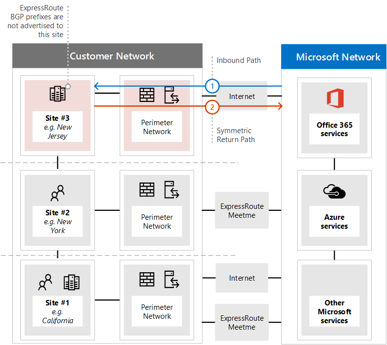

# <a name="implementing-expressroute-for-office-365"></a>Implementar ExpressRoute para Office 365

*Este artículo se aplica tanto a Microsoft 365 Enterprise como a Office 365 Enterprise.*

ExpressRoute para Office 365 proporciona una ruta de acceso de enrutamiento alternativa a muchos servicios de Office 365 accesibles desde Internet. La arquitectura de ExpressRoute para Office 365 se basa en la publicidad de prefijos IP públicos de Office 365 servicios a los que ya se puede acceder a través de Internet en los circuitos ExpressRoute aprovisionados para la redistribución posterior de esos prefijos IP en la red. Con ExpressRoute se habilitan de forma eficaz varias rutas de enrutamiento diferentes, a través de Internet y a través de ExpressRoute, para muchos servicios de Office 365. Este estado de enrutamiento en la red puede representar un cambio significativo en la forma en que se diseña la topología de red interna.
  
 **Estado:** Guía completa v2
  
Debe planear cuidadosamente ExpressRoute para Office 365 implementación a fin de adaptarse a las complejidades de red de tener el enrutamiento disponible a través de un circuito dedicado con rutas insertadas en la red principal e Internet. Si usted y su equipo no realizan el planeamiento y las pruebas detallados en esta guía, existe un alto riesgo de que experimente una pérdida intermitente o una pérdida total de conectividad con Office 365 servicios cuando el circuito ExpressRoute esté habilitado.
  
Para tener una implementación correcta, tendrá que analizar los requisitos de la infraestructura, examinar la evaluación y el diseño detallados de la red, planear cuidadosamente el lanzamiento de forma provisional y controlada, y crear un plan detallado de validación y pruebas. Para un entorno grande y distribuido, no es raro ver que las implementaciones abarcan varios meses. Esta guía está diseñada para ayudarle a planear con antelación.
  
Las implementaciones de gran éxito pueden tardar seis meses en planearse e incluir a menudo miembros del equipo de muchas áreas de la organización, incluidos los administradores de redes, firewall y servidor proxy, administradores de Office 365, seguridad, soporte técnico para el usuario final, administración de proyectos y patrocinio ejecutivo. La inversión en el proceso de planeación reducirá la probabilidad de que experimente errores de implementación que darán lugar a tiempo de inactividad o a una solución de problemas compleja y costosa.
  
Esperamos que se completen los siguientes requisitos previos antes de iniciar esta guía de implementación.
  
1. Ha completado una evaluación de red para determinar si Se recomienda y aprueba ExpressRoute.

2. Ha seleccionado un proveedor de servicios de red de ExpressRoute. Busque detalles sobre los [asociados de ExpressRoute y las ubicaciones de emparejamiento](/azure/expressroute/expressroute-locations).

3. Ya ha leído y comprendido la documentación de [ExpressRoute](https://azure.microsoft.com/documentation/services/expressroute/) y la red interna puede cumplir los requisitos previos de ExpressRoute de un extremo a otro.

4. El equipo ha leído toda la guía pública y la documentación en [https://aka.ms/expressrouteoffice365](./azure-expressroute.md), [https://aka.ms/ert](https://aka.ms/ert)y ha visto la serie [Azure ExpressRoute para Office 365 Training](https://channel9.msdn.com/series/aer) en Channel 9 para comprender los detalles técnicos críticos, entre los que se incluyen:

      - Dependencias de Internet de los servicios SaaS.

      - Cómo evitar rutas asimétricas y controlar el enrutamiento complejo.

      - Incorporación de controles perimetrales de seguridad, disponibilidad y nivel de aplicación.

## <a name="begin-by-gathering-requirements"></a>Empezar por recopilar requisitos
<a name="requirements"> </a>

Empiece por determinar qué características y servicios planea adoptar dentro de su organización. Debe determinar qué características de los diferentes servicios de Office 365 se usarán y qué ubicaciones de la red hospedarán a las personas que usen esas características. Con el catálogo de escenarios, debe agregar los atributos de red que cada uno de esos escenarios requiere; como flujos de tráfico de red entrantes y salientes y si los puntos de conexión de Office 365 están disponibles a través de ExpressRoute o no.
  
Para recopilar los requisitos de la organización:
  
- Cataloge el tráfico de red entrante y saliente para los servicios de Office 365 que usa su organización. Consulte Office 365 página Direcciones URL e intervalos de direcciones IP para obtener la descripción de los flujos que requieren diferentes escenarios de Office 365.

- Recopile la documentación de la topología de red existente que muestra los detalles de la red troncal y la topología interna de WAN, la conectividad de los sitios satélite, la conectividad de usuario de última milla, el enrutamiento a los puntos de salida perimetrales de red y los servicios proxy.

  - Identifique los puntos de conexión de servicio entrantes en los diagramas de red a los que se conectarán Office 365 y otros servicios Microsoft, que muestran las rutas de conexión de ExpressRoute propuestas y de Internet.

  - Identifique todas las ubicaciones de usuarios geográficos y la conectividad WAN entre ubicaciones junto con las ubicaciones que actualmente tienen una salida a Internet y qué ubicaciones se proponen para tener una salida a una ubicación de emparejamiento de ExpressRoute.

  - Identifique todos los dispositivos perimetrales, como servidores proxy, firewalls, etc., y cataloge su relación con los flujos que pasan por Internet y ExpressRoute.

  - Documente si los usuarios finales tendrán acceso a Office 365 servicios a través de enrutamiento directo o proxy de aplicación indirecto para flujos de Internet y ExpressRoute.

- Agregue la ubicación del inquilino y las ubicaciones meet-me al diagrama de red.

- Calcule las características de rendimiento y latencia de red esperadas y observadas desde las principales ubicaciones de usuario a Office 365. Tenga en cuenta que Office 365 es un conjunto global y distribuido de servicios y los usuarios se conectarán a ubicaciones que pueden ser diferentes de la ubicación de su inquilino. Por este motivo, se recomienda medir y optimizar la latencia entre el usuario y el perímetro más cercano de la red global de Microsoft a través de ExpressRoute y conexiones a Internet. Puede usar los resultados de la evaluación de red para ayudar con esta tarea.

- Enumera la seguridad de red de la empresa y los requisitos de alta disponibilidad que deben cumplirse con la nueva conexión de ExpressRoute. Por ejemplo, cómo los usuarios siguen obteniendo acceso a Office 365 en caso de que se produzca un error de salida de Internet o del circuito ExpressRoute.

- Documente qué flujos de red Office 365 entrantes y salientes usarán la ruta de acceso de Internet y cuáles usarán ExpressRoute. Los detalles de las ubicaciones geográficas de los usuarios y los detalles de la topología de red local pueden requerir que el plan sea diferente de una ubicación de usuario a otra.

### <a name="catalog-your-outbound-and-inbound-network-traffic"></a>Catalogar el tráfico de red saliente y entrante
<a name="trafficCatalog"> </a>

Para minimizar el enrutamiento y otras complejidades de red, se recomienda que solo use ExpressRoute para Office 365 para los flujos de tráfico de red necesarios para pasar por una conexión dedicada debido a los requisitos normativos o como resultado de la evaluación de la red. Además, se recomienda almacenar provisionalmente el ámbito del enrutamiento de ExpressRoute y abordar los flujos de tráfico de red saliente y entrante como fases diferentes y distintas del proyecto de implementación. Implementar ExpressRoute para Office 365 solo para flujos de tráfico de red saliente iniciados por el usuario y dejar flujos de tráfico de red entrantes a través de Internet puede ayudar a controlar el aumento de la complejidad topológica y los riesgos de introducir posibilidades adicionales de enrutamiento asimétrico.
  
El catálogo de tráfico de red debe contener listas de todas las conexiones de red entrantes y salientes que tendrá entre la red local y Microsoft.
  
- Los flujos de tráfico de red salientes son escenarios en los que se inicia una conexión desde el entorno local, como desde clientes o servidores internos, con un destino del servicios Microsoft. Estas conexiones pueden ser directas a Office 365 o indirectas, como cuando la conexión pasa a través de servidores proxy, firewalls u otros dispositivos de red en la ruta de acceso a Office 365.

- Los flujos de tráfico de red entrantes son escenarios en los que se inicia una conexión desde la nube de Microsoft a un host local. Estas conexiones suelen tener que pasar por el firewall y otras infraestructuras de seguridad que requiere la directiva de seguridad del cliente para los flujos originados externamente.

Lea la sección **Garantía de simetría de rutas** del artículo [Enrutamiento con ExpressRoute para Office 365](https://support.office.com/article/Routing-with-ExpressRoute-for-Office-365-e1da26c6-2d39-4379-af6f-4da213218408) para determinar qué servicios enviarán tráfico entrante y busque la columna marcada **como ExpressRoute para Office 365** en el artículo de referencia [de puntos de conexión de Office 365](https://support.office.com/article/Office-365-URLs-and-IP-address-ranges-8548a211-3fe7-47cb-abb1-355ea5aa88a2) para determinar el resto de la información de conectividad.
  
Para cada servicio que requiera una conexión saliente, querrá describir la conectividad planeada para el servicio, incluido el enrutamiento de red, la configuración del proxy, la inspección de paquetes y las necesidades de ancho de banda.
  
Para cada servicio que requiera una conexión entrante, necesitará información adicional. Los servidores de la nube de Microsoft establecerán conexiones a la red local. Para asegurarse de que las conexiones se realizan correctamente, querrá describir todos los aspectos de esta conectividad, incluidos; las entradas dns públicas para los servicios que aceptarán estas conexiones entrantes, las direcciones IP IPv4 con formato CIDR, qué equipo ISP está implicado y cómo se controla NAT de entrada o NAT de origen para estas conexiones.
  
Las conexiones entrantes deben revisarse independientemente de si se conectan a través de Internet o ExpressRoute para asegurarse de que no se ha introducido el enrutamiento asimétrico. En algunos casos, los puntos de conexión locales a los que Office 365 servicios inician conexiones entrantes también pueden tener acceso a ellos otros microsoft y no servicios Microsoft. Es fundamental que habilitar el enrutamiento de ExpressRoute a estos servicios con fines Office 365 no interrumpa otros escenarios. En muchos casos, es posible que los clientes necesiten implementar cambios específicos en su red interna, como NAT basada en origen, para asegurarse de que los flujos entrantes de Microsoft permanecen simétricos después de habilitar ExpressRoute.
  
Este es un ejemplo del nivel de detalle necesario. En este caso, Exchange híbrido se enrutaría al sistema local a través de ExpressRoute. 

|Connection (propiedad)   |Valor  |
|----------|-----------|
|**Dirección del tráfico de red** <br/> |Entrada  <br/> |
|**Servicio** <br/> |Exchange Hybrid  <br/> |
|**Punto de conexión de Office 365 público (origen)** <br/> |Exchange Online (direcciones IP)  <br/> |
|**Punto de conexión local público (destino)** <br/> |5.5.5.5  <br/> |
|**Entrada DNS pública (Internet)** <br/> |Autodiscover.contoso.com  <br/> |
|**¿Usará este punto de conexión local para otros servicios Microsoft (que no sean de Office 365)** <br/> |No  <br/> |
|**¿Usarán este punto de conexión local los usuarios o sistemas en Internet?** <br/> |Sí  <br/> |
|**Sistemas internos publicados a través de puntos de conexión públicos** <br/> |Exchange Server rol de acceso de cliente (local) 192.168.101, 192.168.102, 192.168.103  <br/> |
|**Anuncio de IP del punto de conexión público** <br/> |**A Internet**: 5.5.0.0/16 **a ExpressRoute**: 5.5.5.0/24  <br/> |
|**Controles de seguridad y perímetro** <br/> |**Ruta de acceso a Internet**: DeviceID_002  **ruta de acceso de ExpressRoute**: DeviceID_003  <br/> |
|**Alta disponibilidad** <br/> |Activo/activo en 2 circuitos ExpressRoute con redundancia geográfica: Chicago y Dallas  <br/> |
|**Control de simetría de ruta de acceso** <br/> |**Método**: Ruta de **acceso de Internet** NAT de origen: conexiones entrantes NAT de origen a la **ruta de acceso de ExpressRoute** 192.168.5.5: conexiones NAT de origen a 192.168.1.0 (Chicago) y 192.168.2.0 (Dallas)  <br/> |

Este es un ejemplo de un servicio que solo es saliente:

|**Connection (propiedad)**|**Valor**|
|----------|-----------|
|**Dirección del tráfico de red** <br/> |Salida  <br/> |
|**Servicio** <br/> |SharePoint Online  <br/> |
|**Punto de conexión local (origen)** <br/> |Estación de trabajo de usuario  <br/> |
|**Punto de conexión de Office 365 público (destino)** <br/> |SharePoint Online (direcciones IP)  <br/> |
|**Entrada DNS pública (Internet)** <br/> |\*.sharepoint.com (y más FQDN)  <br/> |
|**referencias de CDN** <br/> |cdn.sharepointonline.com (y más FQDN): direcciones IP mantenidas por proveedores de CDN)  <br/> |
|**Anuncio de IP y NAT en uso** <br/> |**Ruta de acceso a Internet/NAT de origen**: 1.1.1.0/24  <br/> **Ruta de acceso de ExpressRoute/NAT de origen**: 1.1.2.0/24 (Chicago) y 1.1.3.0/24 (Dallas)  <br/> |
|**Método de conectividad** <br/> |**Internet**: a través del proxy de capa 7 (archivo .pac)  <br/> **ExpressRoute**: enrutamiento directo (sin proxy)  <br/> |
|**Controles de seguridad y perímetro** <br/> |**Ruta de acceso a Internet**: DeviceID_002  <br/> **Ruta de acceso de ExpressRoute**: DeviceID_003  <br/> |
|**Alta disponibilidad** <br/> |**Ruta de acceso a Internet**: salida redundante de Internet  <br/> **Ruta de acceso de ExpressRoute**: enrutamiento activo o activo de "patata caliente" en dos circuitos ExpressRoute con redundancia geográfica: Chicago y Dallas  <br/> |
|**Control de simetría de ruta de acceso** <br/> |**Método**: NAT de origen para todas las conexiones  <br/> |

### <a name="your-network-topology-design-with-regional-connectivity"></a>Diseño de la topología de red con conectividad regional
<a name="topology"> </a>

Una vez que comprenda los servicios y sus flujos de tráfico de red asociados, puede crear un diagrama de red que incorpore estos nuevos requisitos de conectividad e ilustra los cambios que realizará para usar ExpressRoute para Office 365. El diagrama debe incluir:
  
1. Todas las ubicaciones de usuario desde las que se accederá a Office 365 y otros servicios.

2. Todos los puntos de salida de Internet y ExpressRoute.

3. Todos los dispositivos salientes y entrantes que administran la conectividad dentro y fuera de la red, incluidos enrutadores, firewalls, servidores proxy de aplicaciones y detección y prevención de intrusiones.

4. Destinos internos para todo el tráfico entrante, como servidores ADFS internos que aceptan conexiones desde los servidores proxy de aplicación web de ADFS.

5. Catálogo de todas las subredes IP que se anunciarán

6. Identifique cada ubicación desde la que las personas accederán a Office 365 y enumere las ubicaciones de reunión que se usarán para ExpressRoute.

7. Ubicaciones y partes de la topología de red interna, donde se aceptarán, filtrarán y propagarán los prefijos IP de Microsoft aprendidos de ExpressRoute.

8. La topología de red debe ilustrar la ubicación geográfica de cada segmento de red y cómo se conecta a la red de Microsoft a través de ExpressRoute o Internet.

En el diagrama siguiente se muestra cada ubicación en la que los usuarios usarán Office 365 junto con los anuncios de enrutamiento entrante y saliente a Office 365.
  

  
Para el tráfico saliente, los usuarios acceden a Office 365 de una de estas tres maneras:
  
1. A través de una ubicación de reunión en Norteamérica para la gente de California.

2. A través de una ubicación meet-me en Hong Kong para la gente de Hong Kong.

3. A través de Internet en Bangladesh, donde hay menos personas y no se aprovisiona ningún circuito ExpressRoute.


  
De forma similar, el tráfico de red entrante de Office 365 devuelve de una de estas tres maneras:
  
1. A través de una ubicación de reunión en Norteamérica para la gente de California.

2. A través de una ubicación meet-me en Hong Kong para la gente de Hong Kong.

3. A través de Internet en Bangladesh, donde hay menos personas y no se aprovisiona ningún circuito ExpressRoute.


  
### <a name="determine-the-appropriate-meet-me-location"></a>Determinación de la ubicación adecuada de meet-me

La selección de ubicaciones meet-me, que son la ubicación física desde la que el circuito ExpressRoute conecta la red a la red de Microsoft, está influenciada por las ubicaciones desde las que las personas accederán a Office 365. Como oferta de SaaS, Office 365 no funciona bajo el modelo regional de IaaS o PaaS de la misma manera que Azure. En su lugar, Office 365 es un conjunto distribuido de servicios de colaboración, donde los usuarios pueden necesitar conectarse a puntos de conexión en varios centros de datos y regiones, que pueden no estar necesariamente en la misma ubicación o región donde se hospeda el inquilino del usuario.
  
Esto significa que la consideración más importante que debe tener al seleccionar ubicaciones meet-me para ExpressRoute para Office 365 es desde donde se conectarán las personas de su organización. La recomendación general para una conectividad de Office 365 óptima es implementar el enrutamiento, de modo que las solicitudes de los usuarios a Office 365 servicios se entreguen a la red de Microsoft a través de la ruta de acceso de red más corta, esto también se conoce a menudo como enrutamiento "patata caliente". Por ejemplo, si la mayoría de los usuarios de Office 365 se encuentran en una o dos ubicaciones, al seleccionar ubicaciones meet-me que estén en la proximidad más cercana a la ubicación de esos usuarios se creará el diseño óptimo. Si su empresa tiene grandes poblaciones de usuarios en muchas regiones diferentes, es posible que desee considerar la posibilidad de tener varios circuitos ExpressRoute y ubicaciones meet-me. Para algunas de las ubicaciones de usuario, la ruta de acceso más corta o óptima a la red de Microsoft y Office 365, puede que no sea a través de los puntos de reunión internos de WAN y ExpressRoute, sino a través de Internet.
  
A menudo, hay varias ubicaciones de reunión que se pueden seleccionar dentro de una región con proximidad relativa a los usuarios. Rellene la tabla siguiente para guiar sus decisiones.

**Ubicaciones de reunión de ExpressRoute planeadas en California y Nueva York**

|Ubicación  <br/> |Número de personas  <br/> |Latencia esperada en la red de Microsoft a través de la salida de Internet  <br/> |Latencia esperada en la red de Microsoft a través de ExpressRoute  <br/> |
|----------|-----------|----------|-----------|
|Los Ángeles  <br/> |10,000  <br/> |~15 ms  <br/> |~10 ms (a través de Silicon Valley)  <br/> |
|Washington DC  <br/> |15 000  <br/> |~20 ms  <br/> |~10 ms (a través de Nueva York)  <br/> |
|Dallas  <br/> |5,000  <br/> |~15 ms  <br/> |~40 ms (a través de Nueva York)  <br/> |

Una vez que se haya desarrollado la arquitectura de red global que muestra la región Office 365, las ubicaciones meet-me del proveedor de servicios de red de ExpressRoute y la cantidad de personas por ubicación, se puede usar para identificar si se pueden realizar optimizaciones. También puede mostrar conexiones de red de horquilla globales donde el tráfico se enruta a una ubicación lejana con el fin de obtener la ubicación meet-me. Si se detecta una horquilla en la red global, debe corregirse antes de continuar. Busque otra ubicación de meet-me o use puntos de salida selectivos de salida de Internet para evitar la horquilla.
  
El primer diagrama muestra un ejemplo de un cliente con dos ubicaciones físicas en Norteamérica. Puede ver la información sobre las ubicaciones de oficina, Office 365 ubicaciones de inquilino y varias opciones para las ubicaciones meet-me de ExpressRoute. En este ejemplo, el cliente ha seleccionado la ubicación meet-me en función de dos principios, en orden:
  
1. Proximidad más cercana a las personas de su organización.

2. Más cercano a un centro de datos de Microsoft donde se hospeda Office 365.


  
Ampliando ligeramente este concepto, en el segundo diagrama se muestra un cliente multinacional de ejemplo que se enfrenta a información y toma de decisiones similares. Este cliente tiene una pequeña oficina en Bangladesh con solo un pequeño equipo de diez personas centrado en aumentar su superficie en la región. Hay una ubicación meet-me en Chennai y un centro de datos de Microsoft con Office 365 hospedado en Chennai, por lo que una ubicación meet-me tendría sentido; sin embargo, para diez personas, el gasto del circuito adicional es gravoso. Al examinar la red, deberá determinar si la latencia implicada en el envío del tráfico de red a través de la red es más eficaz que gastar el capital para adquirir otro circuito ExpressRoute.
  
Como alternativa, las diez personas de Bangladesh pueden experimentar un mejor rendimiento con su tráfico de red enviado a través de Internet a la red de Microsoft de lo que enrutarían en su red interna, como mostramos en los diagramas introductorios y reproducimos a continuación.
  

  
## <a name="create-your-expressroute-for-office-365-implementation-plan"></a>Creación del plan de implementación de ExpressRoute para Office 365
<a name="implementation"> </a>

El plan de implementación debe abarcar tanto los detalles técnicos de la configuración de ExpressRoute como los detalles de la configuración del resto de la infraestructura de la red, como los siguientes.
  
- Planee qué servicios se dividen entre ExpressRoute e Internet.

- Planee el ancho de banda, la seguridad, la alta disponibilidad y la conmutación por error.

- Diseñar el enrutamiento entrante y saliente, incluidas las optimizaciones de ruta de enrutamiento adecuadas para diferentes ubicaciones

- Decida hasta dónde se anunciarán las rutas de ExpressRoute en la red y cuál es el mecanismo para que los clientes seleccionen la ruta de acceso de Internet o ExpressRoute; por ejemplo, enrutamiento directo o proxy de aplicación.

- Planee los cambios en los registros DNS, incluidas las entradas [del marco de directivas de remitente](../security/office-365-security/set-up-spf-in-office-365-to-help-prevent-spoofing.md) .

- Planifique la estrategia NAT, incluida la NAT de origen de salida y de entrada.

### <a name="plan-your-routing-with-both-internet-and-expressroute-network-paths"></a>Planear el enrutamiento con rutas de acceso de red de Internet y ExpressRoute
<a name="paths"> </a>

- Para la implementación inicial, se recomienda usar Internet para todos los servicios entrantes, como el correo electrónico entrante o la conectividad híbrida.

- Planee el enrutamiento DE LAN de cliente de usuario final, como [configurar un archivo PAC/WPAD](./managing-office-365-endpoints.md), una ruta predeterminada, servidores proxy y anuncios de ruta BGP.

- Planee el enrutamiento perimetral, incluidos servidores proxy, firewalls y servidores proxy en la nube.

### <a name="plan-your-bandwidth-security-high-availability-and-failover"></a>Planear el ancho de banda, la seguridad, la alta disponibilidad y la conmutación por error
<a name="availability"> </a>

Cree un plan para el ancho de banda necesario para cada carga de trabajo de Office 365 principal. Calcule por separado los requisitos de ancho de banda de Exchange Online, SharePoint Online y Skype Empresarial Online. Puede usar las calculadoras de estimación que hemos proporcionado para Exchange Online y Skype Empresarial como punto de partida; sin embargo, se requiere una prueba piloto con un ejemplo representativo de los perfiles de usuario y las ubicaciones para comprender completamente las necesidades de ancho de banda de su organización.
  
Agregue cómo se controla la seguridad en cada ubicación de salida de Internet y ExpressRoute al plan, recuerde todas las conexiones de ExpressRoute para Office 365 usar el emparejamiento público y debe protegerse de acuerdo con las directivas de seguridad de la empresa de conectarse a redes externas.
  
Agregue detalles a su plan sobre qué personas se verán afectadas por el tipo de interrupción y cómo esas personas podrán realizar su trabajo a plena capacidad de la manera más sencilla.
  
#### <a name="plan-bandwidth-requirements-including-skype-for-business-requirements-on-jitter-latency-congestion-and-headroom"></a>Planear los requisitos de ancho de banda, incluidos los requisitos de Skype Empresarial en Jitter, Latency, Congestion y Headroom
  
Skype Empresarial Online también tiene requisitos de red adicionales específicos, que se detallan en el artículo Calidad de los [medios y Rendimiento de conectividad de red en Skype Empresarial Online](https://support.office.com/article/Media-Quality-and-Network-Connectivity-Performance-in-Skype-for-Business-Online-5fe3e01b-34cf-44e0-b897-b0b2a83f0917).
  
Lea la sección **Planeamiento de ancho de banda para Azure ExpressRoute** en [Planeamiento de red con ExpressRoute para Office 365](https://support.office.com/article/Network-planning-with-ExpressRoute-for-Office-365-103208f1-e788-4601-aa45-504f896511cd).
  
Al realizar una evaluación del ancho de banda con los usuarios piloto, puede usar nuestra guía; [Office 365 ajuste del rendimiento mediante líneas base e historial de rendimiento](https://support.office.com/article/Office-365-performance-tuning-using-baselines-and-performance-history-1492cb94-bd62-43e6-b8d0-2a61ed88ebae).
  
#### <a name="plan-for-high-availability-requirements"></a>Planear los requisitos de alta disponibilidad
  
Cree un plan de alta disponibilidad para satisfacer sus necesidades e incorpore esto en el diagrama de topología de red actualizado. Lea la sección **Alta disponibilidad y conmutación por error con Azure ExpressRoute** en [Planeamiento de red con ExpressRoute para Office 365](https://support.office.com/article/Network-planning-with-ExpressRoute-for-Office-365-103208f1-e788-4601-aa45-504f896511cd).
  
#### <a name="plan-for-network-security-requirements"></a>Planear los requisitos de seguridad de red
  
Cree un plan para cumplir los requisitos de seguridad de red e incorpore esto en el diagrama de topología de red actualizado. Lea la sección **Aplicación de controles de seguridad a Azure ExpressRoute para escenarios de Office 365** en [Planeamiento de red con ExpressRoute para Office 365](https://support.office.com/article/Network-planning-with-ExpressRoute-for-Office-365-103208f1-e788-4601-aa45-504f896511cd).
  
### <a name="design-outbound-service-connectivity"></a>Diseño de la conectividad de servicio saliente
<a name="outbound"> </a>

ExpressRoute para Office 365 tiene requisitos de red *salientes* que pueden no estar familiarizados. En concreto, las direcciones IP que representan a los usuarios y redes para Office 365 y actúan como puntos de conexión de origen para las conexiones de red salientes a Microsoft deben seguir los requisitos específicos que se describen a continuación.
  
1. Los puntos de conexión deben ser direcciones IP públicas, que están registradas en su empresa o en el operador que le proporciona conectividad de ExpressRoute.

2. Los puntos de conexión deben anunciarse en Microsoft y ExpressRoute debe validarlo o aceptarlo.

3. Los puntos de conexión no deben anunciarse en Internet con la misma métrica de enrutamiento o más preferida.

4. Los puntos de conexión no se deben usar para la conectividad con servicios Microsoft que no están configurados a través de ExpressRoute.

Si el diseño de red no cumple estos requisitos, hay un alto riesgo de que los usuarios experimenten errores de conectividad en Office 365 y otros servicios Microsoft debido a la holing negro de rutas o al enrutamiento asimétrico. Esto ocurre cuando las solicitudes a servicios Microsoft se enrutan a través de ExpressRoute, pero las respuestas se enrutan a través de Internet, o viceversa, y las respuestas se quitan mediante dispositivos de red con estado, como firewalls.
  
El método más común que puede usar para cumplir los requisitos anteriores es usar NAT de origen, ya sea implementado como parte de la red o proporcionado por el operador de ExpressRoute. NAT de origen le permite abstraer los detalles y el direccionamiento IP privado de la red de Internet desde ExpressRoute y; junto con anuncios de ruta IP adecuados, proporcione un mecanismo fácil para garantizar la simetría de la ruta de acceso. Si usa dispositivos de red con estado específicos de las ubicaciones de emparejamiento de ExpressRoute, debe implementar grupos NAT independientes para cada emparejamiento de ExpressRoute para garantizar la simetría de ruta de acceso.
  
Obtenga más información sobre los [requisitos de NAT de ExpressRoute](/azure/expressroute/expressroute-nat).
  
Agregue los cambios de la conectividad saliente al diagrama de topología de red.
  
### <a name="design-inbound-service-connectivity"></a>Diseño de la conectividad de servicio entrante
<a name="inbound"> </a>

La mayoría de las implementaciones de Office 365 empresariales asumen algún tipo de conectividad entrante de Office 365 a servicios locales, como para Exchange, SharePoint y Skype Empresarial escenarios híbridos, migraciones de buzones y autenticación mediante la infraestructura de ADFS. Cuando ExpressRoute habilita una ruta de acceso de enrutamiento adicional entre la red local y Microsoft para la conectividad saliente, estas conexiones entrantes pueden verse afectadas involuntariamente por el enrutamiento asimétrico, incluso si pretende que esos flujos sigan usando Internet. Se recomiendan algunas precauciones que se describen a continuación para asegurarse de que no haya ningún impacto en los flujos entrantes basados en Internet desde Office 365 a sistemas locales.
  
Para minimizar los riesgos del enrutamiento asimétrico para los flujos de tráfico de red entrantes, todas las conexiones entrantes deben usar NAT de origen antes de que se enruten en segmentos de la red, que tienen visibilidad de enrutamiento en ExpressRoute. Si las conexiones entrantes se permiten en un segmento de red con visibilidad de enrutamiento en ExpressRoute sin NAT de origen, las solicitudes que se originan desde Office 365 entrarán desde Internet, pero la respuesta que vuelve a Office 365 preferirá la ruta de acceso de red de ExpressRoute de vuelta a la red de Microsoft, lo que provoca el enrutamiento asimétrico.
  
Puede considerar uno de los siguientes patrones de implementación para satisfacer este requisito:
  
1. Realice NAT de origen antes de que las solicitudes se enruten a la red interna mediante equipos de red como firewalls o equilibradores de carga en la ruta de acceso desde Internet a los sistemas locales.

2. Asegúrese de que las rutas de ExpressRoute no se propaguen a los segmentos de red donde residen los servicios entrantes, como servidores front-end o sistemas de proxy inverso, que controlan las conexiones a Internet.

Tener en cuenta explícitamente estos escenarios en la red y mantener todos los flujos de tráfico de red entrantes a través de Internet ayuda a minimizar el riesgo operativo y de implementación del enrutamiento asimétrico.
  
Puede haber casos en los que puede optar por dirigir algunos flujos de entrada a través de conexiones ExpressRoute. Para estos escenarios, tenga en cuenta las siguientes consideraciones adicionales.
  
1. Office 365 solo pueden dirigirse a puntos de conexión locales que usan direcciones IP públicas. Esto significa que incluso si el punto de conexión de entrada local solo se expone a Office 365 a través de ExpressRoute, todavía debe tener asociada la dirección IP pública.

2. Toda la resolución de nombres DNS que Office 365 servicios realizan para resolver los puntos de conexión locales se produce mediante DNS público. Esto significa que debe registrar el FQDN de los puntos de conexión de servicio entrantes en las asignaciones de IP en Internet.

3. Para recibir conexiones de red entrantes a través de ExpressRoute, las subredes IP públicas de estos puntos de conexión deben anunciarse a Microsoft a través de ExpressRoute.

4. Evalúe cuidadosamente estos flujos de tráfico de red entrantes para asegurarse de que se les aplican controles de red y seguridad adecuados de acuerdo con las directivas de red y seguridad de la empresa.

5. Una vez que los puntos de conexión de entrada locales se anuncian a Microsoft a través de ExpressRoute, ExpressRoute se convertirá efectivamente en la ruta de acceso de enrutamiento preferida a esos puntos de conexión para todos los servicios Microsoft, incluidos los Office 365. Esto significa que esas subredes de punto de conexión solo deben usarse para las comunicaciones con Office 365 servicios y ningún otro servicio de la red de Microsoft. De lo contrario, el diseño provocará un enrutamiento asimétrico donde las conexiones entrantes de otros servicios Microsoft prefieren enrutar la entrada a través de ExpressRoute, mientras que la ruta de acceso de retorno usará Internet.

6. En caso de que un circuito ExpressRoute o una ubicación de meet-me estén inactivos, deberá asegurarse de que los puntos de conexión de entrada locales siguen estando disponibles para aceptar solicitudes a través de una ruta de acceso de red independiente. Esto puede significar la publicidad de subredes para esos puntos de conexión a través de varios circuitos ExpressRoute.

7. Se recomienda aplicar NAT de origen para todos los flujos de tráfico de red entrantes que entran en la red a través de ExpressRoute, especialmente cuando estos flujos fluyen entre dispositivos de red con estado, como firewalls.

8. Algunos servicios locales, como el proxy de ADFS o Exchange detección automática, pueden recibir solicitudes entrantes tanto de los servicios Office 365 como de los usuarios de Internet. Para estas solicitudes, Office 365 tendrá como destino el mismo FQDN que las solicitudes de usuario a través de Internet. Permitir conexiones de usuario entrantes desde Internet a esos puntos de conexión locales, al tiempo que se fuerzan las conexiones Office 365 para usar ExpressRoute, representa una complejidad de enrutamiento significativa. Para la gran mayoría de los clientes que implementan este tipo de escenarios complejos a través de ExpressRoute no se recomienda debido a consideraciones operativas. Esta sobrecarga adicional incluye la administración de riesgos de enrutamiento asimétrico y requerirá que administre cuidadosamente los anuncios de enrutamiento y las directivas en varias dimensiones.

### <a name="update-your-network-topology-plan-to-show-how-you-would-avoid-asymmetric-routes"></a>Actualizar el plan de topología de red para mostrar cómo evitar rutas asimétricas
<a name="asymmetric"> </a>

Quiere evitar el enrutamiento asimétrico para asegurarse de que los usuarios de su organización puedan usar sin problemas Office 365, así como otros servicios importantes en Internet. Hay dos configuraciones comunes que los clientes tienen que provocan el enrutamiento asimétrico. Ahora es un buen momento para revisar la configuración de red que va a usar y comprobar si podría existir uno de estos escenarios de enrutamiento asimétrico.
  
Para empezar, examinaremos algunas situaciones diferentes asociadas con el siguiente diagrama de red. En este diagrama, todos los servidores que reciben solicitudes entrantes, como ADFS o servidores híbridos locales, se encuentran en el centro de datos de Nueva Jersey y se anuncian en Internet.
  
1. Aunque la red perimetral es segura, no hay ninguna NAT de origen disponible para las solicitudes entrantes.

2. Los servidores del centro de datos de Nueva Jersey pueden ver las rutas de Internet y ExpressRoute.


  
También tenemos sugerencias sobre cómo corregirlas.
  
#### <a name="problem-1-cloud-to-on-premises-connection-over-the-internet"></a>Problema 1: Conexión de nube a local a través de Internet
  
En el diagrama siguiente se muestra la ruta de acceso de red asimétrica que se toma cuando la configuración de red no proporciona NAT para las solicitudes entrantes desde la nube de Microsoft a través de Internet.
  
1. La solicitud de entrada de Office 365 recupera la dirección IP del punto de conexión local de DNS público y envía la solicitud a la red perimetral.

2. En esta configuración defectuosa, no hay ninguna NAT de origen configurada o disponible en la red perimetral donde se envía el tráfico, lo que da lugar a que la dirección IP de origen real se use como destino de devolución.

  - El servidor de la red enruta el tráfico devuelto a Office 365 a través de cualquier conexión de red de ExpressRoute disponible.

  - El resultado es una ruta asimétrica para que ese flujo Office 365, lo que da lugar a una conexión interrumpida.


  
##### <a name="solution-1a-source-nat"></a>Solución 1a: NAT de origen
  
Simplemente agregar una NAT de origen a la solicitud entrante resuelve esta red mal configurada. En este diagrama:
  
1. La solicitud entrante continúa ingresando a través de la red perimetral del centro de datos de Nueva Jersey. Esta vez nat de origen está disponible.

2. La respuesta del servidor vuelve a dirigirse a la dirección IP asociada a nat de origen en lugar de a la dirección IP original, lo que da lugar a que la respuesta vuelva a lo largo de la misma ruta de acceso de red.


  
##### <a name="solution-1b-route-scoping"></a>Solución 1b: Ámbito de ruta
  
Como alternativa, puede optar por no permitir que se anuncie los prefijos BGP de ExpressRoute, quitando la ruta de acceso de red alternativa para esos equipos. En este diagrama:
  
1. La solicitud entrante continúa ingresando a través de la red perimetral del centro de datos de Nueva Jersey. Esta vez los prefijos anunciados por Microsoft a través del circuito ExpressRoute no están disponibles para el centro de datos de Nueva Jersey.

2. La respuesta del servidor vuelve a dirigirse a la dirección IP asociada a la dirección IP original a través de la única ruta disponible, lo que da lugar a que la respuesta vuelva a lo largo de la misma ruta de acceso de red.


  
#### <a name="problem-2-cloud-to-on-premises-connection-over-expressroute"></a>Problema 2: Conexión de nube a local a través de ExpressRoute
  
En el diagrama siguiente se muestra la ruta de acceso de red asimétrica que se toma cuando la configuración de red no proporciona NAT para las solicitudes entrantes desde la nube de Microsoft a través de ExpressRoute.
  
1. La solicitud entrante de Office 365 recupera la dirección IP de DNS y envía la solicitud a la red perimetral.

2. En esta configuración defectuosa, no hay ninguna NAT de origen configurada o disponible en la red perimetral donde se envía el tráfico, lo que da lugar a que la dirección IP de origen real se use como destino de devolución.

  - El equipo de la red enruta el tráfico devuelto a Office 365 a través de cualquier conexión de red de ExpressRoute disponible.

  - El resultado es una conexión asimétrica a Office 365.


  
##### <a name="solution-2-source-nat"></a>Solución 2: NAT de origen
  
Simplemente agregar una NAT de origen a la solicitud entrante resuelve esta red mal configurada. En este diagrama:
  
1. La solicitud entrante continúa ingresando a través de la red perimetral del centro de datos de Nueva York. Esta vez nat de origen está disponible.

2. La respuesta del servidor vuelve a dirigirse a la dirección IP asociada a nat de origen en lugar de a la dirección IP original, lo que da lugar a que la respuesta vuelva a lo largo de la misma ruta de acceso de red.


  
### <a name="paper-verify-that-the-network-design-has-path-symmetry"></a>Comprobar en papel que el diseño de red tiene simetría de ruta de acceso

En este punto, debe comprobar en papel que el plan de implementación ofrece simetría de ruta para los distintos escenarios en los que va a usar Office 365. Identificará la ruta de red específica que se espera que se tome cuando una persona use distintas características del servicio. Desde la red local y el enrutamiento WAN, a los dispositivos perimetrales, a la ruta de acceso de conectividad; ExpressRoute o Internet, y en la conexión al punto de conexión en línea.
  
Tendrá que hacerlo para todos los servicios de red de Office 365 que se identificaron anteriormente como servicios que su organización adoptará.
  
Ayuda a hacer este tutorial de las rutas con una segunda persona. Explíqueles de dónde se espera que cada salto de red obtenga su siguiente ruta y asegúrese de que está familiarizado con las rutas de acceso de enrutamiento. Recuerde que ExpressRoute siempre proporcionará una ruta con más ámbito a las direcciones IP del servidor de Microsoft, lo que le proporcionará un costo de ruta menor que una ruta predeterminada de Internet.
  
### <a name="design-client-connectivity-configuration"></a>Configuración de conectividad de cliente de diseño
<a name="asymmetric"> </a>


  
Si usa un servidor proxy para el tráfico enlazado a Internet, debe ajustar los archivos de configuración de cliente o PAC para asegurarse de que los equipos cliente de la red están configurados correctamente para enviar el tráfico de ExpressRoute que desea Office 365 sin transitar el servidor proxy, y el tráfico restante, incluidos algunos Office 365 tráfico, se envía al proxy correspondiente. Lea nuestra guía sobre [la administración de puntos de conexión de Office 365](./managing-office-365-endpoints.md), por ejemplo, archivos PAC.
  
> [!NOTE]
> Los puntos de conexión cambian con frecuencia, tan a menudo como semanalmente. Solo debe realizar cambios en función de los servicios y características que ha adoptado su organización para reducir el número de cambios que tendrá que realizar para mantenerse al día. Preste especial atención a la **fecha de entrada en vigor** en la fuente RSS donde se anuncian los cambios y se mantiene un registro de todos los cambios pasados, es posible que las direcciones IP anunciadas no se anuncien o se eliminen del anuncio hasta que se alcance la fecha de vigencia.
  
## <a name="build-your-deployment-and-testing-procedures"></a>Compilación de los procedimientos de implementación y pruebas
<a name="testing"> </a>

El plan de implementación debe incluir el planeamiento de pruebas y reversión. Si la implementación no funciona según lo esperado, el plan debe diseñarse para afectar al menor número de personas antes de que se detecten problemas. A continuación se muestran algunos principios de alto nivel que debe tener en cuenta el plan.
  
1. Almacene provisionalmente el segmento de red y la incorporación del servicio de usuario para minimizar la interrupción.

2. Planee la prueba de rutas con traceroute y conexión TCP desde un host conectado a Internet independiente.

3. Preferiblemente, las pruebas de los servicios entrantes y salientes deben realizarse en una red de prueba aislada con un inquilino de prueba Office 365.

      - Como alternativa, las pruebas se pueden realizar en una red de producción si el cliente aún no usa Office 365 o está en fase piloto.

      - Como alternativa, las pruebas se pueden realizar durante una interrupción de producción que se reserva solo para pruebas y supervisión.

      - Como alternativa, las pruebas se pueden realizar comprobando las rutas de cada servicio en cada nodo de enrutador de nivel 3. Esta reversión solo debe usarse si no es posible realizar otras pruebas, ya que la falta de pruebas físicas supone un riesgo.

### <a name="build-your-deployment-procedures"></a>Compilación de los procedimientos de implementación

Los procedimientos de implementación deben implementarse en grupos pequeños de personas en fases para permitir las pruebas antes de realizar la implementación en grupos de personas más grandes. A continuación se muestran varias maneras de almacenar provisionalmente la implementación de ExpressRoute.
  
1. Configure ExpressRoute con el emparejamiento de Microsoft y reenvíe los anuncios de ruta a un único host solo con fines de pruebas preconfiguradas.

2. Anuncie las rutas a la red de ExpressRoute a un único segmento de red al principio y expanda los anuncios de ruta por segmento de red o región.

3. Si implementa Office 365 por primera vez, use la implementación de red de ExpressRoute como piloto para algunas personas.

4. Si usa servidores proxy, también puede configurar un archivo PAC de prueba para dirigir a algunas personas a ExpressRoute con pruebas y comentarios antes de agregar más.

El plan de implementación debe enumerar cada uno de los procedimientos de implementación que se deben tomar o los comandos que deben usarse para implementar la configuración de red. Cuando llega el tiempo de interrupción de la red, todos los cambios que se realizan deben ser del plan de implementación escrito por adelantado y revisado por el mismo nivel. Consulte nuestras instrucciones sobre la configuración técnica de ExpressRoute.
  
- Actualizar los registros TXT de SPF si ha cambiado las direcciones IP de los servidores locales que seguirán enviando correo electrónico.

- Actualizar las entradas DNS de los servidores locales si ha cambiado las direcciones IP para dar cabida a una nueva configuración NAT.

- Asegúrese de que se ha suscrito a la fuente RSS para Office 365 notificaciones de punto de conexión para mantener las configuraciones de enrutamiento o proxy.

Una vez completada la implementación de ExpressRoute, se deben ejecutar los procedimientos del plan de prueba. Los resultados de cada procedimiento deben registrarse. Debe incluir procedimientos para revertir al entorno de producción original en caso de que los resultados del plan de prueba indiquen que la implementación no se realizó correctamente.
  
### <a name="build-your-test-procedures"></a>Compilación de los procedimientos de prueba

Los procedimientos de prueba deben incluir pruebas para cada servicio de red entrante y saliente para Office 365 tanto que usarán ExpressRoute como para los que no. Los procedimientos deben incluir pruebas desde cada ubicación de red única, incluidos los usuarios que no son locales en la LAN corporativa.
  
Algunos ejemplos de actividades de prueba incluyen lo siguiente.
  
1. Haga ping desde el enrutador local al enrutador del operador de red.

2. Valide que el enrutador local recibe más de 500 anuncios de direcciones IP en línea de CRM y Office 365.

3. Valide que la NAT entrante y saliente funciona entre ExpressRoute y la red interna.

4. Valide que las rutas a su NAT se anuncian desde el enrutador.

5. Valide que ExpressRoute ha aceptado los prefijos anunciados.

      - Use el siguiente cmdlet para comprobar los anuncios de emparejamiento:

      ```PowerShell
      Get-AzureRmExpressRouteCircuitRouteTable -DevicePath Primary -ExpressRouteCircuitName TestER -ResourceGroupName RG -PeeringType MicrosoftPeering
      ```

6. Valide que el intervalo de DIRECCIONES NAT públicas no se anuncia a Microsoft a través de ningún otro circuito de ExpressRoute o de red pública de Internet, a menos que sea un subconjunto específico de un intervalo mayor, como en el ejemplo anterior.

7. Los circuitos ExpressRoute están emparejados y validan que ambas sesiones BGP se están ejecutando.

8. Configure un único host en el interior de la NAT y use ping, tracert y tcpping para probar la conectividad entre el nuevo circuito y el host outlook.office365.com. Como alternativa, puede usar una herramienta como Wireshark o Microsoft Network Monitor 3.4 en un puerto reflejado en el MSEE para validar que puede conectarse a la dirección IP asociada a outlook.office365.com.

9. Pruebe la funcionalidad de nivel de aplicación para Exchange Online.

  - Probar Outlook es capaz de conectarse a Exchange Online y enviar y recibir correo electrónico.

  - Probar Outlook puede usar el modo en línea.

  - Pruebe la conectividad del teléfono inteligente y la funcionalidad de envío y recepción.

10. Prueba de la funcionalidad de nivel de aplicación para SharePoint Online

  - Pruebe OneDrive para la Empresa cliente de sincronización.

  - Pruebe SharePoint acceso web en línea.

11. Pruebe la funcionalidad de nivel de aplicación para Skype Empresarial escenarios de llamada:

  - Únase a la llamada de conferencia como usuario autenticado [invitación iniciada por el usuario final].

  - Invite al usuario a la llamada de conferencia [invitación enviada desde MCU].

  - Únase a la conferencia como usuario anónimo mediante la aplicación web Skype Empresarial.

  - Unirse a la llamada desde su conexión de PC cableada, teléfono IP y dispositivo móvil.

  - Llamada al usuario federado o Llamada a validación RTC: se completa la llamada, la calidad de la llamada es aceptable y el tiempo de conexión es aceptable.

  - Compruebe que el estado de presencia de los contactos se actualiza tanto para los miembros del inquilino como para los usuarios federados.

### <a name="common-problems"></a>Problemas comunes

El enrutamiento asimétrico es el problema de implementación más común. Estos son algunos orígenes comunes que se pueden buscar:
  
- Usar una topología de enrutamiento de red abierta o plana sin NAT de origen en su lugar.

- No usar SNAT para enrutar a servicios entrantes a través de las conexiones de Internet y ExpressRoute.

- No probar los servicios entrantes en ExpressRoute en una red de prueba antes de implementarlo ampliamente.

## <a name="deploying-expressroute-connectivity-through-your-network"></a>Implementación de la conectividad de ExpressRoute a través de la red
<a name="testing"> </a>

Escenifique la implementación en un segmento de la red a la vez, implementando progresivamente la conectividad a diferentes partes de la red con un plan para revertir para cada nuevo segmento de red. Si la implementación está alineada con una implementación de Office 365, implemente primero en los usuarios piloto de Office 365 y amplíe desde allí.
  
Primero para la prueba y, después, para producción:
  
- Ejecute los pasos de implementación para habilitar ExpressRoute.

- Pruebe a ver que las rutas de red son las esperadas.

- Realice pruebas en cada servicio entrante y saliente.

- Reversión si detecta algún problema.

### <a name="set-up-a-test-connection-to-expressroute-with-a-test-network-segment"></a>Configuración de una conexión de prueba a ExpressRoute con un segmento de red de prueba

Ahora que tiene el plan completado en papel, es el momento de probarlo a pequeña escala. En esta prueba, establecerá una única conexión de ExpressRoute con El emparejamiento de Microsoft a una subred de prueba en la red local. Puede configurar un [inquilino de prueba Office 365](https://go.microsoft.com/fwlink/p/?LinkID=403802) con conectividad hacia y desde la subred de prueba e incluir todos los servicios salientes y entrantes que usará en producción en la subred de prueba. Configure DNS para el segmento de red de prueba y establezca todos los servicios entrantes y salientes. Ejecute el plan de prueba y asegúrese de que está familiarizado con el enrutamiento de cada servicio y la propagación de rutas.
  
### <a name="execute-the-deployment-and-test-plans"></a>Ejecución de los planes de implementación y prueba

A medida que complete los elementos descritos anteriormente, compruebe las áreas que ha completado y asegúrese de que usted y su equipo los han revisado antes de ejecutar los planes de implementación y pruebas.
  
- Lista de servicios salientes y entrantes que participan en el cambio de red.

- Diagrama de arquitectura de red global que muestra tanto la salida de Internet como las ubicaciones meet-me de ExpressRoute.

- Diagrama de enrutamiento de red que muestra las distintas rutas de acceso de red usadas para cada servicio implementado.

- Un plan de implementación con pasos para implementar los cambios y la reversión si es necesario.

- Un plan de prueba para probar cada Office 365 y servicio de red.

- Validación en papel completada de las rutas de producción para los servicios entrantes y salientes.

- Una prueba completada en un segmento de red de prueba, incluidas las pruebas de disponibilidad.

Elija una ventana de interrupción que sea lo suficientemente larga como para ejecutarse a través de todo el plan de implementación y el plan de prueba, tiene algún tiempo disponible para solucionar problemas y tiempo para revertir si es necesario.
  
> [!CAUTION]
> Debido a la naturaleza compleja del enrutamiento a través de Internet y ExpressRoute, se recomienda agregar tiempo de búfer adicional a esta ventana para controlar la solución de problemas de enrutamiento complejo.
  
### <a name="configure-qos-for-skype-for-business-online"></a>Configuración de QoS para Skype Empresarial Online

QoS es necesario para obtener las ventajas de voz y reunión para Skype Empresarial Online. Puede configurar QoS después de asegurarse de que la conexión de red de ExpressRoute no bloquea ninguno de los demás Office 365 acceso al servicio. La configuración de QoS se describe en el artículo [ExpressRoute y QoS en Skype Empresarial Online](https://support.office.com/article/ExpressRoute-and-QoS-in-Skype-for-Business-Online-20c654da-30ee-4e4f-a764-8b7d8844431d) .
  
## <a name="troubleshooting-your-implementation"></a>Solución de problemas de la implementación
<a name="troubleshooting"> </a>

El primer lugar que se debe examinar es en los pasos de esta guía de implementación, ¿se han perdido en el plan de implementación? Volver y ejecute pruebas de red más pequeñas si es posible para replicar el error y depurarlo allí.
  
Identifique qué servicios entrantes o salientes produjeron errores durante las pruebas. Obtenga específicamente las direcciones IP y subredes de cada uno de los servicios con errores. Siga adelante y recoste el diagrama de topología de red en papel y valide el enrutamiento. Valide específicamente dónde se anuncia el enrutamiento de ExpressRoute, pruebe ese enrutamiento durante la interrupción si es posible con seguimientos.
  
Ejecute PSPing con un seguimiento de red a cada punto de conexión de cliente y evalúe las direcciones IP de origen y destino para validar que son las esperadas. Ejecute telnet en cualquier host de correo que exponga en el puerto 25 y compruebe que SNAT oculta la dirección IP de origen original si se espera.
  
Tenga en cuenta que, al implementar Office 365 con una conexión de ExpressRoute, deberá asegurarse de que la configuración de red de ExpressRoute está diseñada de forma óptima y también ha optimizado los demás componentes de la red, como los equipos cliente. Además de usar esta guía de planeamiento para solucionar los pasos que puede haber perdido, también hemos escrito un [plan de solución de problemas de rendimiento para Office 365](https://support.office.com/article/Performance-troubleshooting-plan-for-Office-365-e241e5d9-b1d8-4f1d-a5c8-4106b7325f8c) .
  
Este es un vínculo breve que se puede usar para volver: [https://aka.ms/implementexpressroute365]()
  
## <a name="related-topics"></a>Temas relacionados

[Evaluar la conectividad de red de Office 365](assessing-network-connectivity.md)
  
[Azure ExpressRoute para Office 365](azure-expressroute.md)
  
[Administrar ExpressRoute para la conectividad de Office 365](managing-expressroute-for-connectivity.md)
  
[Enrutamiento con ExpressRoute para Office 365](routing-with-expressroute.md)
  
[Planeamiento de red con ExpressRoute para Office 365](network-planning-with-expressroute.md)
  
[Uso de comunidades BGP en ExpressRoute para escenarios de Office 365](bgp-communities-in-expressroute.md)
  
[Calidad de medios y rendimiento de conectividad de red en Skype Empresarial Online](https://support.office.com/article/5fe3e01b-34cf-44e0-b897-b0b2a83f0917)
  
[Optimización de la red para Skype Empresarial Online](https://support.office.com/article/b363bdca-b00d-4150-96c3-ec7eab5a8a43)
  
[ExpressRoute y calidad del servicio en Skype Empresarial Online](https://support.office.com/article/20c654da-30ee-4e4f-a764-8b7d8844431d)
  
[Flujo de llamadas con ExpressRoute](https://support.office.com/article/413acb29-ad83-4393-9402-51d88e7561ab)
  
[Ajuste del rendimiento de Office 365 mediante líneas base y el historial de rendimiento](performance-tuning-using-baselines-and-history.md)
  
[Plan de solución de problemas de rendimiento para Office 365](performance-troubleshooting-plan.md)
  
[Direcciones URL e intervalos de direcciones IP de Office 365](https://support.office.com/article/8548a211-3fe7-47cb-abb1-355ea5aa88a2)
  
[Red de Office 365 y ajuste de rendimiento](network-planning-and-performance.md)
