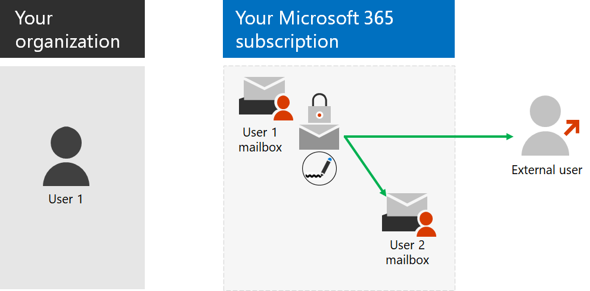

# Paso 6: Configurar el cifrado de correo electrónico

*Este paso es opcional y es válido para las versiones E3 y E5 de Microsoft 365 Enterprise*

Hay tres tipos de cifrado de correo electrónico en Microsoft 365.

|||
|:-------|:-----|
| Cifrado de mensajes de Office (OME) | Cifrado para el correo electrónico de Exchange Online enviado fuera de la organización. |
| Information Rights Management (IRM) | Cifrado y permisos que viajan con el correo electrónico. |
| Extensiones seguras multipropósito al correo de Internet (S/MIME) | Protección de correo electrónico con cifrado y firmas digitales. |
|||

## Cifrado de mensajes de Office 365

Con OME, su organización puede enviar y recibir mensajes de correo electrónico cifrados entre usuarios de dentro y fuera de la organización. OME funciona con Outlook.com, Yahoo!, gmail y otros servicios de correo electrónico. El cifrado de mensajes de correo electrónico ayuda a garantizar que solo los destinatarios deseados puedan ver el mensaje.

Configure las reglas de transporte que definen las condiciones para el cifrado. Cuando un usuario envía un mensaje que coincide con una regla, se aplica automáticamente el cifrado.

Para ver los mensajes cifrados, los destinatarios pueden obtener un código de acceso de un solo uso, iniciar sesión con una cuenta de Microsoft o iniciar sesión con una cuenta profesional o educativa asociada con Microsoft 365. Los destinatarios también pueden enviar respuestas cifradas. No necesitan su propia suscripción a Microsoft 365 para ver mensajes cifrados ni enviar respuestas cifradas.

Para obtener más información, consulte [Cifrado en Office 365](https://docs.microsoft.com/Office365/SecurityCompliance/ome).

## IRM

IRM en Microsoft 365 le ayuda a proteger su información con cifrado adicional y al aplicar una directiva inteligente que especifica quién tiene acceso a lo que puede hacer. Para los mensajes de correo electrónico, puede usar IRM para cifrado y aplicar restricciones de uso. Por ejemplo, puede especificar que algunos destinatarios tengan todas las capacidades para administrar el correo electrónico y otros no puedan imprimir o reenviar el correo electrónico. 

Las directivas de IRM se configuran en Microsoft 365 y se pueden aplicar a documentos en SharePoint Online y mensajes de correo electrónico. Un correo electrónico protegido con IRM incluye la configuración de directiva aplicada y se desplaza con ella. 

Cuando el destinatario abre el correo electrónico con la Directiva incluida, la configuración de la Directiva se usa para descifrar el mensaje y determinar lo que el destinatario puede hacer con él. 

Para obtener más información, consulte [Information Rights Management en Exchange Online]( https://docs.microsoft.com/office365/SecurityCompliance/information-rights-management-in-exchange-online).

## S/MIME

S/MIME es una solución de protección basada en correo electrónico basada en certificados digitales que permite cifrar y firmar digitalmente un mensaje. El cifrado de mensajes ayuda a garantizar que solo el destinatario pueda abrir y leer el mensaje. Una firma digital ayuda al destinatario a validar la identidad del remitente y a determinar que sólo el remitente lo haya enviado.

S/MIME puede usarse para el correo electrónico a otros buzones de la suscripción de Microsoft 365 o a usuarios externos.
Tanto el cifrado de mensajes como las firmas digitales se hacen posible mediante el uso de certificados digitales que contienen las claves públicas y privadas para cifrar o descifrar mensajes, y para crear y comprobar firmas digitales.
Para usar S/MIME, debe tener las claves públicas para cada destinatario. Los destinatarios mantienen sus propias claves privadas, que deben permanecer seguras. Si la clave privada está comprometida, debe obtener un nuevo certificado digital y redistribuir las claves públicas a todos los remitentes potenciales.

Para obtener más información, vea [S/MIME para la firma y el cifrado de mensajes](https://docs.microsoft.com/Exchange/policy-and-compliance/smime).

Como punto de control provisional, vea los [criterios de salida](infoprotect-exit-criteria.md#crit-infoprotect-step6) correspondientes a este paso.

## Siguiente paso

|||
|:-------|:-----|
||[Configurar Privileged Access Management para Office 365](infoprotect-configure-privileged-access-management.md)|
