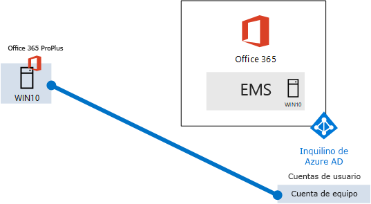
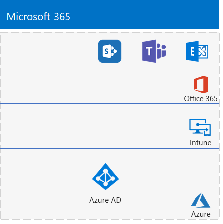

# <a name="the-lightweight-base-configuration"></a>Configuración básica ligera

En este artículo se le ofrecen instrucciones paso a paso para crear un entorno simplificado con una suscripción Microsoft 365 E5 y un equipo que ejecute Windows 10 Enterprise. 



Use el entorno resultante para probar las características y funciones de [Microsoft 365 Enterprise](https://www.microsoft.com/microsoft-365/enterprise).


  
> [!TIP]
> Haga clic [aquí](https://aka.ms/m365etlgstack) para ver un mapa visual de todos los artículos de la pila Guía de laboratorio de pruebas de Microsoft 365 Enterprise.

## <a name="phase-1-create-your-office-365-e5-subscription"></a>Fase 1: Crear la suscripción de Office 365 E5

Siga los pasos los pasos de Fase 2 y Fase 3 del [entorno de desarrollo y prueba de Office 365](https://docs.microsoft.com/office365/enterprise/office-365-dev-test-environment) para crear un entorno de desarrollo y prueba ligero de Office 365.

>[!Note]
>Tenemos que crear una suscripción de prueba de Office 365 para que su entorno de desarrollo y prueba tenga un espacio empresarial de Azure AD separado de cualquier suscripción de pago que tenga actualmente.  Esta separación significa que puede agregar y quitar usuarios y grupos en el espacio empresarial de prueba sin que afecte a las suscripciones de producción.
>
  
## <a name="phase-2-add-a-microsoft-365-e5-trial-subscription"></a>Fase 2: agregar una suscripción de prueba a Microsoft 365 E5.

En esta fase se inscribe en la suscripción de evaluación de Microsoft 365 E5 y la agrega a la misma organización de la suscripción de evaluación de Office 365 E5.
  
Primero agregue la suscripción de prueba de Microsoft 365 E5 y asigne una licencia de Microsoft 365 a su cuenta de administrador global.
  
1. Con una instancia privada de un explorador de Internet, inicie sesión en el Centro de administración de Microsoft 365 en [http://admin.microsoft.com](http://admin.microsoft.com) con sus credenciales de cuenta de administrador global.
    
2. En la página **Centro de administración de Microsoft 365**, en el panel de navegación izquierdo, haga clic en **Facturación > Servicios de compra**.
    
3. En la página **Servicios de compra**, busque el elemento **Microsoft 365 E5**. Mantenga el puntero del ratón sobre dicho elemento y haga clic en **Iniciar prueba gratuita**. 

4. En la página de la **Versión de prueba de Microsoft 365 E5**, elija entre recibir una llamada o un mensaje de texto, escriba el número de teléfono y haga clic en **Enviarme un mensaje de texto** o **Llamarme**.

5. En la página **Confirmar pedido**, haga clic en **Probar ahora**.

6. En la página **Recibo del pedido**, haga clic en **Continuar**.

7. En el Centro de administración de Microsoft 365, haga clic en **Usuarios activos** y en su cuenta de administrador.

8. Haga clic en **Editar** para **Licencias de productos**.

9. Desactive la licencia para Office 365 Enterprise E5 y active la licencia de Microsoft 365 E5.

10. Haga clic en **Guardar > Cerrar > Cerrar**.

***Si ha completado la fase 3 del*** [entorno de desarrollo y prueba de Office 365](https://docs.microsoft.com/office365/enterprise/office-365-dev-test-environment), repita los pasos 8 al 11 del procedimiento anterior para las demás cuentas (usuario 2, usuario 3, usuario 4 y usuario 5).
  
> [!NOTE]
> La suscripción de prueba de Microsoft 365 E5 tiene una duración de 30 días. Para tener un entorno de prueba permanente, convierta esta suscripción de prueba en una suscripción de pago con unas pocas licencias. 
  
Su entorno de desarrollo y prueba ahora tiene:
  
- Una suscripción de prueba de Microsoft 365 E5.
- Todas las cuentas de usuario adecuadas (ya sea solo la cuenta de administrador global o las cinco cuentas de usuario) están habilitadas para usar Microsoft 365 E5.
    
La figura 1 muestra la configuración resultante. Agrega Microsoft 365 E5, que incluye Office 365 y seguridad + administración (EMS).
  
**Figura 1: Agregar la suscripción de prueba de Microsoft 365**


  
## <a name="phase-3-create-a-windows-10-enterprise-computer"></a>Fase 3: Crear un equipo con Windows 10 Enterprise

En esta fase se crea un equipo independiente que ejecuta Windows 10 Enterprise como equipo físico, máquina virtual o máquina virtual de Azure.
  
### <a name="physical-computer"></a>Equipo físico

Obtenga un equipo personal e instale Windows 10 Enterprise en él. Puede descargar la versión de evaluación de Windows 10 Enterprise [aquí](https://www.microsoft.com/evalcenter/evaluate-windows-10-enterprise).
  
### <a name="virtual-machine"></a>Máquina virtual

Cree una máquina virtual con el hipervisor que prefiera e instale Windows 10 Enterprise en ella. Puede descargar la versión de evaluación de Windows 10 Enterprise [aquí](https://www.microsoft.com/evalcenter/evaluate-windows-10-enterprise).
  
### <a name="virtual-machine-in-azure"></a>Máquina virtual de Azure

Para crear una máquina virtual con Windows 10 en Microsoft Azure ***necesita tener una suscripción basada en Visual Studio***, que tiene acceso a la imagen de Windows 10 Enterprise. Otros tipos de suscripciones de Azure, como las suscripciones de prueba y suscripciones de pago, no tienen acceso a esta imagen. Para obtener la información más reciente, vea [Usar el cliente de Windows en Azure para escenarios de desarrollo y pruebas](https://docs.microsoft.com/azure/virtual-machines/windows/client-images).
  
> [!NOTE]
> Los siguientes conjuntos de comandos usan la versión más reciente de Azure PowerShell. Vea [Introducción a los cmdlets de Azure PowerShell](https://docs.microsoft.com/powershell/azureps-cmdlets-docs/). Estos conjuntos de comandos compilan una máquina virtual con Windows 10 Enterprise llamada WIN10 y toda la infraestructura necesaria, que incluye un grupo de recursos, una cuenta de almacenamiento y una red virtual. Si ya está familiarizado con los servicios de infraestructura de Azure, adapte estas instrucciones para que se ajusten a la infraestructura implementada actualmente. 
  
En primer lugar, abra un símbolo del sistema de Microsoft PowerShell.
  
Inicie sesión en su cuenta de Azure con el siguiente comando.
  
```
Connect-AzAccount
```

Obtenga su nombre de suscripción mediante el comando siguiente.
  
```
Get-AzSubscription | Sort Name | Select Name
```

Configure su suscripción de Azure. Cambie todo el contenido entrecomillado, incluidos los caracteres \< y >, por los nombres correctos.
  
```
$subscr="<subscription name>"
Get-AzSubscription -SubscriptionName $subscr | Select-AzSubscription
```

Después, cree un nuevo grupo de recursos. Para determinar un nombre único de grupo de recursos, use este comando a fin de enumerar los grupos de recursos existentes.
  
```
Get-AzResourceGroup | Sort ResourceGroupName | Select ResourceGroupName
```

Cree el nuevo grupo de recursos con estos comandos. Reemplace todo el contenido entrecomillado, incluidos los caracteres \< y > , por los nombres correctos.
  
```
$rgName="<resource group name>"
$locName="<location name, such as West US>"
New-AzResourceGroup -Name $rgName -Location $locName
```

Después, cree una red virtual y la máquina virtual WIN10 con estos comandos. Cuando se le pida, indique el nombre y contraseña de la cuenta de administrador local para WIN10 y guárdelos en un lugar seguro.
  
```
$corpnetSubnet=New-AzVirtualNetworkSubnetConfig -Name Corpnet -AddressPrefix 10.0.0.0/24
New-AzVirtualNetwork -Name "M365Ent-TestLab" -ResourceGroupName $rgName -Location $locName -AddressPrefix 10.0.0.0/8 -Subnet $corpnetSubnet
$rule1=New-AzNetworkSecurityRuleConfig -Name "RDPTraffic" -Description "Allow RDP to all VMs on the subnet" -Access Allow -Protocol Tcp -Direction Inbound -Priority 100 -SourceAddressPrefix Internet -SourcePortRange * -DestinationAddressPrefix * -DestinationPortRange 3389
New-AzNetworkSecurityGroup -Name Corpnet -ResourceGroupName $rgName -Location $locName -SecurityRules $rule1
$vnet=Get-AzVirtualNetwork -ResourceGroupName $rgName -Name "M365Ent-TestLab"
$nsg=Get-AzNetworkSecurityGroup -Name Corpnet -ResourceGroupName $rgName
Set-AzVirtualNetworkSubnetConfig -VirtualNetwork $vnet -Name Corpnet -AddressPrefix "10.0.0.0/24" -NetworkSecurityGroup $nsg
$vnet | Set-AzVirtualNetwork
$pip=New-AzPublicIpAddress -Name WIN10-PIP -ResourceGroupName $rgName -Location $locName -AllocationMethod Dynamic
$nic=New-AzNetworkInterface -Name WIN10-NIC -ResourceGroupName $rgName -Location $locName -SubnetId $vnet.Subnets[0].Id -PublicIpAddressId $pip.Id
$vm=New-AzVMConfig -VMName WIN10 -VMSize Standard_D1_V2
$cred=Get-Credential -Message "Type the name and password of the local administrator account for WIN10."
$vm=Set-AzVMOperatingSystem -VM $vm -Windows -ComputerName WIN10 -Credential $cred -ProvisionVMAgent -EnableAutoUpdate
$vm=Set-AzVMSourceImage -VM $vm -PublisherName MicrosoftWindowsDesktop -Offer Windows-10 -Skus RS3-Pro -Version "latest"
$vm=Add-AzVMNetworkInterface -VM $vm -Id $nic.Id
$vm=Set-AzVMOSDisk -VM $vm -Name WIN10-TestLab-OSDisk -DiskSizeInGB 128 -CreateOption FromImage
New-AzVM -ResourceGroupName $rgName -Location $locName -VM $vm
```

## <a name="phase-4-join-your-windows-10-computer-to-azure-ad"></a>Fase 4: Unir el equipo con Windows 10 a Azure AD

Después de crear la máquina física o virtual con Windows 10 Enterprise, inicie sesión con una cuenta de administrador local.
  
> [!NOTE]
> En el caso de una máquina virtual de Azure, conéctela siguiendo [estas instrucciones](https://docs.microsoft.com/azure/virtual-machines/windows/connect-logon).
  
Después, una el equipo WIN10 al espacio empresarial de Azure AD de la suscripción de Microsoft 365 E5.
  
1. En el escritorio del equipo WIN10, haga clic en **Inicio > Configuración > Cuentas > Obtener acceso a trabajo o escuela > Conectarse**.
    
2. En el cuadro de diálogo **Set up a work or school account** (Configurar una cuenta profesional o educativa), haga clic en **Join this device to Azure Active Directory** (Unir este dispositivo a Azure Active Directory).
    
3. En **Cuenta profesional o educativa**, escriba el nombre de la cuenta de administrador global de la suscripción de Microsoft 365 E5 y haga clic en **Siguiente**.
    
4. En **Escribir contraseña**, escriba la contraseña de la cuenta de administrador global y luego haga clic en **Iniciar sesión**.
    
5. Cuando se le pida que confirme que es su organización, haga clic en **Unir** y luego en **Listo**.
    
6. Cierre la ventana de configuración.
    
Después, instale Office 365 ProPlus en el equipo con Windows 10.
  
1. Abra el explorador Microsoft Edge e inicie sesión en el portal de Office con las credenciales de la cuenta de administrador global. Para obtener ayuda, vea [Where to sign in to Office 365](https://support.office.com/Article/Where-to-sign-in-to-Office-365-e9eb7d51-5430-4929-91ab-6157c5a050b4) (Dónde iniciar sesión en Office 365).
    
2. En la pestaña **Inicio de Microsoft Office**, haga clic en **Instalar Office**.
    
3. Cuando se le pregunte qué hacer, haga clic en **Ejecutar** y luego en **Sí** para **Control de cuentas de usuario**.
    
4. Espere hasta que se complete la instalación de Office. Cuando vea **Ya está listo**, haga clic en **Cerrar** dos veces.
    
En la ilustración 3, se muestra el entorno resultante con el equipo con Windows 10 que:

- Se unió al espacio empresarial de Azure AD de su suscripción de Microsoft 365 E5.
- Se inscribió como un dispositivo de Azure AD en Microsoft Intune (EMS).
- Tiene instalado Office 365 ProPlus.
  
**Figura 2: Configuración final del entorno de prueba de Microsoft 365**


  
Ahora está preparado para experimentar con otras características de [Microsoft 365 Enterprise](https://www.microsoft.com/microsoft-365/enterprise).
  
## <a name="next-steps"></a>Pasos siguientes

Explore estos conjuntos adicionales de guías de laboratorio de pruebas:
  
- [Identidad](m365-enterprise-test-lab-guides.md#identity)
- [Administración de dispositivos móviles](m365-enterprise-test-lab-guides.md#mobile-device-management)
- [Protección de la información](m365-enterprise-test-lab-guides.md#information-protection)
   

## <a name="see-also"></a>Vea también

[Guías de laboratorio de pruebas de Microsoft 365 Enterprise](m365-enterprise-test-lab-guides.md)

[Implementar Microsoft 365 Enterprise](deploy-microsoft-365-enterprise.md)

[Documentación y recursos de Microsoft 365 Enterprise](https://docs.microsoft.com/microsoft-365-enterprise/)
