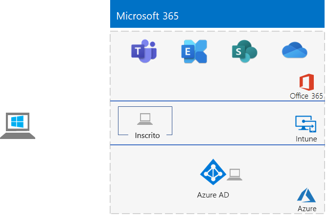

# <a name="the-lightweight-base-configuration"></a>Configuración básica ligera

*Esta Guía del laboratorio de pruebas se puede usar tanto Microsoft 365 entornos de prueba empresariales como Office 365 Enterprise de prueba.*

En este artículo se describe cómo crear un entorno simplificado con una suscripción Microsoft 365 E5 y un equipo que ejecuta Windows 10 Enterprise.



La creación de un entorno de prueba ligero implica cinco fases:
- [Fase 1: Crear su Microsoft 365 E5 suscripción](#phase-1-create-your-microsoft-365-e5-subscription)
- [Fase 2: configurar la suscripción de prueba de Office 365](#phase-2-configure-your-office-365-trial-subscription)
- [Fase 3: agregar una suscripción de prueba a Microsoft 365 E5](#phase-3-add-a-microsoft-365-e5-trial-subscription)
- [Fase 4: crear un equipo con Windows 10 Enterprise](#phase-4-create-a-windows-10-enterprise-computer)
- [Fase 5: unir el equipo con Windows 10 a Azure AD](#phase-5-join-your-windows-10-computer-to-azure-ad)

Use el entorno resultante para probar las características y la funcionalidad de [Microsoft 365 para empresas](https://www.microsoft.com/microsoft-365/enterprise).


  
> [!TIP]
> Para obtener una asignación visual a todos los artículos de la pila Microsoft 365 guía del laboratorio de pruebas de empresa, vea [Microsoft 365 enterprise Test Lab Guide Stack](../downloads/Microsoft365EnterpriseTLGStack.pdf).

>[!NOTE]
>Es recomendable que imprima este artículo para registrar la información específica que necesitará para este entorno durante los 30 días de la suscripción de prueba de Office 365. Puede extender fácilmente la suscripción de prueba otros 30 días. Para un entorno de pruebas permanente, cree una nueva suscripción de pago con un inquilino de Azure AD distinto y un número reducido de licencias.

## <a name="phase-1-create-your-microsoft-365-e5-subscription"></a>Fase 1: Crear su Microsoft 365 E5 suscripción

Empezamos con una Microsoft 365 E5 de prueba y, a continuación, agregamos la Microsoft 365 E5 suscripción a ella.

>[!NOTE]
>Se recomienda crear una suscripción de prueba de Office 365 para que el entorno de prueba tenga un inquilino de Azure AD independiente de cualquier suscripción de pago que tenga actualmente. Esta separación significa que puede agregar y quitar usuarios y grupos en el inquilino de prueba sin que ello afecte a las suscripciones de producción.

Para iniciar la suscripción de prueba de Microsoft 365 E5, en primer lugar necesita un nombre de compañía ficticio y una nueva cuenta de Microsoft.
  
1. Le recomendamos que use una variante del nombre de la compañía Contoso para el nombre de su compañía, que es una compañía ficticia usada en contenido de ejemplo de Microsoft, pero no es imprescindible. Anote aquí el nombre de la compañía ficticia: 
    
2. Para registrarse para obtener una nueva cuenta Microsoft, vaya a [https://outlook.com](https://outlook.com) y cree una cuenta con una nueva cuenta y una dirección de correo electrónico. Usará esta cuenta para suscribirse a Office 365.
    
    - Anote aquí el nombre y los apellidos de la nueva cuenta: 
    
    - Anote la dirección de la cuenta de correo electrónico nueva aquí: Outlook.com
    
### <a name="sign-up-for-an-office-365-e5-trial-subscription"></a>Registrarse para una suscripción de prueba de Office 365 E5

1. En el explorador, vaya a [https://aka.ms/e5trial](https://aka.ms/e5trial) .
    
2. En el paso 1 de la página Gracias **por elegir** Office 365 E5, escriba la nueva dirección de su cuenta de correo electrónico.
3. En el paso 2 del proceso de suscripción a trail, escriba la información solicitada y, a continuación, realice la comprobación.
4. En el paso 3, escriba un nombre de organización y, a continuación, un nombre de cuenta que será el administrador global de la suscripción.
5. En el paso 4, registre la página de inicio de sesión aquí (seleccionar y copiar):  
6. Registre el identificador de usuario aquí:  . onmicrosoft.com  
   Registre la contraseña que escribió en una ubicación segura.
   Este valor se denominará **nombre de administrador global**.
7. Seleccione **Ir a Instalación**.
8. En Office 365 E5 configuración, seleccione Continuar con su organización **.onmicrosoft.com** correo electrónico e iniciar sesión y, a continuación, seleccione **Salir y continuar más adelante.**

Debería ver el Centro de administración de Microsoft 365.
    
## <a name="phase-2-configure-your-office-365-trial-subscription"></a>Fase 2: configurar la suscripción de prueba de Office 365

En esta fase, se configura la suscripción con usuarios adicionales y se les asignan licencias de Office 365 E5.
  
Para conectarse a la suscripción con el módulo Azure Active Directory PowerShell para Graph desde el equipo, use las instrucciones de Conectar para Microsoft 365 [con PowerShell](connect-to-microsoft-365-powershell.md#connect-with-the-azure-active-directory-powershell-for-graph-module).
    
En el **Windows PowerShell de** diálogo Solicitud de credenciales, escriba el nombre del administrador global *(por* ejemplo, jdoe@contosotoycompany.onmicrosoft.com ) y la contraseña.
  
Rellene el nombre de la organización (por ejemplo, *contosotoycompany*), el código de país de dos caracteres para su ubicación, una contraseña de cuenta común y, a continuación, ejecute los siguientes comandos desde el símbolo del sistema de PowerShell:

```powershell
$orgName="<organization name>"
$loc="<two-character country code, such as US>"
$commonPW="<common user account password>"
$PasswordProfile=New-Object -TypeName Microsoft.Open.AzureAD.Model.PasswordProfile
$PasswordProfile.Password=$commonPW

$License = New-Object -TypeName Microsoft.Open.AzureAD.Model.AssignedLicense
$License.SkuId = (Get-AzureADSubscribedSku | Where-Object -Property SkuPartNumber -Value "ENTERPRISEPREMIUM" -EQ).SkuID
$LicensesToAssign = New-Object -TypeName Microsoft.Open.AzureAD.Model.AssignedLicenses
$LicensesToAssign.AddLicenses = $License

for($i=2;$i -le 4; $i++) {
    $userUPN= "user$($i)@$($orgName).onmicrosoft.com"
    New-AzureADUser -DisplayName "User $($i)" -GivenName User -SurName $i -UserPrincipalName $userUPN -UsageLocation $loc -AccountEnabled $true -PasswordProfile $PasswordProfile -MailNickName "user$($i)"
    $userObjectID = (Get-AzureADUser -SearchString $userupn).ObjectID
    Set-AzureADUserLicense -ObjectId $userObjectID -AssignedLicenses $LicensesToAssign
}
```
> [!NOTE]
> Aquí se usa una contraseña común para automatizar y facilitar la configuración de un entorno de prueba. Evidentemente, esto no se recomienda en el caso de suscripciones de producción. 

### <a name="record-key-information-for-future-reference"></a>Guardar información clave para futuras referencias

Si aún no ha registrado estos valores, indómelos ahora:
  
- Nombre de administrador global: . onmicrosoft.com (del paso 6 de la fase 1)
    
    Guarde también la contraseña de esta cuenta en una ubicación segura.
    
- Nombre de la organización de la suscripción de prueba:  (en el paso 4 de la fase 1)
    
- Para mostrar las cuentas de los usuarios 2, 3, 4 y 5, ejecute los siguientes comandos desde el símbolo del sistema del Módulo de Windows Azure Active Directory para Windows PowerShell.
    
  ```powershell
  Get-AzureADUser | Sort UserPrincipalName | Select UserPrincipalName
  ```

    Anote aquí los nombres de las cuentas:
    
  - Nombre de la cuenta de usuario 2: usuario2 @.onmicrosoft.com
    
  - Nombre de la cuenta de usuario 3: usuario3 @.onmicrosoft.com
    
  - Nombre de la cuenta de usuario 4: usuario4 @.onmicrosoft.com
    
  - Nombre de la cuenta de usuario 5: usuario5 @.onmicrosoft.com
    
    También puede guardar la contraseña común de estas cuentas en un lugar seguro.
   
### <a name="using-an-office-365-test-environment"></a>Usar un entorno de prueba de Office 365

Si solo necesita un entorno Office 365 prueba, no es necesario leer el resto de este artículo.

Para obtener guías de laboratorio de prueba adicionales que se aplican a Office 365 y Microsoft 365, consulte Microsoft 365 guías de laboratorio [de pruebas empresariales](m365-enterprise-test-lab-guides.md).
  
## <a name="phase-3-add-a-microsoft-365-e5-trial-subscription"></a>Fase 3: agregar una suscripción de prueba a Microsoft 365 E5

En esta fase se inscribe en la suscripción de evaluación de Microsoft 365 E5 y la agrega a la misma organización de la suscripción de evaluación de Office 365 E5.
  
Primero, agregue la suscripción de prueba de Microsoft 365 E5 y asigne la nueva licencia de Microsoft 365 a su cuenta de administrador global.
  
1. En una ventana privada del explorador de Internet, use las credenciales de la cuenta de administrador global para iniciar sesión en el Centro de administración de Microsoft 365 en [https://admin.microsoft.com](https://admin.microsoft.com) .
    
2. En la **Centro de administración de Microsoft 365,** en la navegación izquierda, seleccione **Servicios de compra** de  >  <a href="https://go.microsoft.com/fwlink/p/?linkid=868433" target="_blank">**facturación.**</a>
    
3. En la **página Servicios de** compra, seleccione **Microsoft 365 E5** y, a continuación, seleccione Obtener **prueba gratuita.**

4. En la **Microsoft 365 E5 de** prueba, decida recibir un mensaje de texto o una llamada  telefónica, escriba su número de teléfono y, a continuación, seleccione Enviarme un mensaje de texto o **Llamarme**. Realice la comprobación.

5. En la **página Confirmar su pedido,** seleccione **Probar ahora**.

6. En la **página Recibo de pedido,** seleccione **Continuar**.

7. En el Centro de administración de Microsoft 365, seleccione **Usuarios**  >  <a href="https://go.microsoft.com/fwlink/p/?linkid=834822" target="_blank">**usuarios activos.**</a>

8. En **Usuarios activos,** seleccione su cuenta de administrador.

9. Selecciona **Licencias y aplicaciones**.

10. Desactive la licencia para Office 365 Enterprise E5 y active la licencia de Microsoft 365 E5.

11. Seleccione **Guardar cambios** y, a continuación, cierre el panel de información de la cuenta de usuario.

Después, repita los pasos del 8 al 11 del procedimiento anterior para todas las demás cuentas (usuario 2, usuario 3, usuario 4 y usuario 5).
  
> [!NOTE]
> La duración de la Microsoft 365 E5 de prueba es de 30 días. Para tener un entorno de prueba permanente, convierta esta suscripción de prueba en una suscripción de pago con un bajo número de licencias.
  
Su entorno de desarrollo y prueba ahora tiene:
  
- Una suscripción de prueba de Microsoft 365 E5.
- Todas las cuentas de usuario adecuadas (ya sea solo la cuenta de administrador global o las cinco cuentas de usuario) están habilitadas para usar Microsoft 365 E5.
    
La configuración resultante, que agrega Microsoft 365 E5, tiene este aspecto:
  

  
## <a name="phase-4-create-a-windows-10-enterprise-computer"></a>Fase 4: crear un equipo con Windows 10 Enterprise

En esta fase se crea un equipo independiente que ejecuta Windows 10 Enterprise como equipo físico, máquina virtual o máquina virtual de Azure.
  
### <a name="physical-computer"></a>Equipo físico

En un equipo personal, instale Windows 10 Enterprise. Puede descargar la versión de Windows 10 Enterprise [aquí](https://www.microsoft.com/evalcenter/evaluate-windows-10-enterprise).
  
### <a name="virtual-machine"></a>Máquina virtual

Use el hipervisor que prefiera para crear una máquina virtual y, a continuación, instale Windows 10 Enterprise en ella. Puede descargar la versión de Windows 10 Enterprise [aquí](https://www.microsoft.com/evalcenter/evaluate-windows-10-enterprise).
  
### <a name="virtual-machine-in-azure"></a>Máquina virtual de Azure

Para crear una máquina virtual con Windows 10 en Microsoft Azure ***necesita tener una suscripción basada en Visual Studio***, que tiene acceso a la imagen de Windows 10 Enterprise. Otros tipos de suscripciones de Azure, como las suscripciones de prueba y suscripciones de pago, no tienen acceso a esta imagen. Para obtener la información más reciente, vea [Usar el cliente de Windows en Azure para escenarios de desarrollo y pruebas](/azure/virtual-machines/windows/client-images).
  
> [!NOTE]
> Los siguientes conjuntos de comandos utilizan la última versión de Azure PowerShell. Visite [Get started with Azure PowerShell cmdlets (Introducción a los cmdlets de Azure)](/powershell/azureps-cmdlets-docs/). Estos conjuntos de comandos crean una Windows 10 Enterprise virtual denominada WIN10 y toda la infraestructura necesaria, incluido un grupo de recursos, una cuenta de almacenamiento y una red virtual. Si ya está familiarizado con los servicios de infraestructura de Azure, adapte estas instrucciones a la infraestructura implementada actualmente.
  
En primer lugar, abra un símbolo del sistema de Microsoft PowerShell.
  
Inicie sesión en su cuenta de Azure con este comando.
  
```powershell
Connect-AzAccount
```

Obtén el nombre de la suscripción con este comando.
  
```powershell
Get-AzSubscription | Sort Name | Select Name
```

Configure su suscripción de Azure. Reemplace todo dentro de las comillas, \< and > incluidos los caracteres, por el nombre correcto.
  
```powershell
$subscr="<subscription name>"
Get-AzSubscription -SubscriptionName $subscr | Select-AzSubscription
```

Después, cree un nuevo grupo de recursos. Para determinar un nombre único de grupo de recursos, use este comando a fin de enumerar los grupos de recursos existentes.
  
```powershell
Get-AzResourceGroup | Sort ResourceGroupName | Select ResourceGroupName
```

Cree el nuevo grupo de recursos con estos comandos. Reemplace todo dentro de las comillas, \< and > incluidos los caracteres, por los nombres correctos.
  
```powershell
$rgName="<resource group name>"
$locName="<location name, such as West US>"
New-AzResourceGroup -Name $rgName -Location $locName
```

A continuación, cree una nueva red virtual y la máquina virtual WIN10 con estos comandos. Cuando se le pida, proporcione el nombre y la contraseña de la cuenta de administrador local para WIN10 y guárdalo en una ubicación segura.
  
```powershell
$corpnetSubnet=New-AzVirtualNetworkSubnetConfig -Name Corpnet -AddressPrefix 10.0.0.0/24
New-AzVirtualNetwork -Name "M365Ent-TestLab" -ResourceGroupName $rgName -Location $locName -AddressPrefix 10.0.0.0/8 -Subnet $corpnetSubnet
$rule1=New-AzNetworkSecurityRuleConfig -Name "RDPTraffic" -Description "Allow RDP to all VMs on the subnet" -Access Allow -Protocol Tcp -Direction Inbound -Priority 100 -SourceAddressPrefix Internet -SourcePortRange * -DestinationAddressPrefix * -DestinationPortRange 3389
New-AzNetworkSecurityGroup -Name Corpnet -ResourceGroupName $rgName -Location $locName -SecurityRules $rule1
$vnet=Get-AzVirtualNetwork -ResourceGroupName $rgName -Name "M365Ent-TestLab"
$nsg=Get-AzNetworkSecurityGroup -Name Corpnet -ResourceGroupName $rgName
Set-AzVirtualNetworkSubnetConfig -VirtualNetwork $vnet -Name Corpnet -AddressPrefix "10.0.0.0/24" -NetworkSecurityGroup $nsg
$vnet | Set-AzVirtualNetwork
$pip=New-AzPublicIpAddress -Name WIN10-PIP -ResourceGroupName $rgName -Location $locName -AllocationMethod Dynamic
$nic=New-AzNetworkInterface -Name WIN10-NIC -ResourceGroupName $rgName -Location $locName -SubnetId $vnet.Subnets[0].Id -PublicIpAddressId $pip.Id
$vm=New-AzVMConfig -VMName WIN10 -VMSize Standard_A2_V2
$cred=Get-Credential -Message "Type the name and password of the local administrator account for WIN10."
$vm=Set-AzVMOperatingSystem -VM $vm -Windows -ComputerName WIN10 -Credential $cred -ProvisionVMAgent -EnableAutoUpdate
$vm=Set-AzVMSourceImage -VM $vm -PublisherName MicrosoftWindowsDesktop -Offer Windows-10 -Skus RS3-Pro -Version "latest"
$vm=Add-AzVMNetworkInterface -VM $vm -Id $nic.Id
$vm=Set-AzVMOSDisk -VM $vm -Name WIN10-TestLab-OSDisk -DiskSizeInGB 128 -CreateOption FromImage
New-AzVM -ResourceGroupName $rgName -Location $locName -VM $vm
```

## <a name="phase-5-join-your-windows-10-computer-to-azure-ad"></a>Fase 5: unir el equipo con Windows 10 a Azure AD

Después de crear la máquina física o virtual con Windows 10 Enterprise, inicie sesión con una cuenta de administrador local.
  
> [!NOTE]
> Para una máquina virtual en Azure, use  [estas instrucciones](/azure/virtual-machines/windows/connect-logon) para conectarse a ella.
  
Después, una el equipo WIN10 al espacio empresarial de Azure AD de la suscripción de Microsoft 365 E5.
  
1. En el escritorio del equipo WIN10, seleccione **Iniciar > Configuración > cuentas**> Acceso al trabajo o escuela > Conectar .
    
2. En el **cuadro de diálogo** Configurar una cuenta de trabajo o escuela, seleccione Unirse a este dispositivo para **Azure Active Directory**.
    
3. En **Cuenta de trabajo o escuela,** escriba el nombre de la cuenta de administrador global de su Microsoft 365 E5 suscripción y, a continuación, seleccione **Siguiente**.
    
4. En **Escribir contraseña,** escriba la contraseña de su cuenta de administrador global y, a continuación, seleccione **Iniciar sesión.**
    
5. Cuando se le pida que asegúrese de que se trata de su organización, seleccione **Unirse** y, a continuación, seleccione **Listo**.
    
6. Cierre la ventana de configuración.
    
A continuación, Aplicaciones Microsoft 365 para empresas en el equipo WIN10:
  
1. Abra el Microsoft Edge explorador e inicie sesión en el [Centro de administración de Microsoft 365](https://admin.microsoft.com) con las credenciales de la cuenta de administrador global.
    
2. En la **Microsoft Office inicio,** seleccione **Instalar Office**.
    
3. Cuando se le pida qué hacer, seleccione **Ejecutar** y, a continuación, **seleccione Sí para** control de cuentas de **usuario**.
    
4. Espere a Office para completar su instalación. Cuando vea **You're all set!**, seleccione **Cerrar dos** veces.
    
El entorno resultante tiene este aspecto:


Esto incluye el equipo WIN10 que tiene:

- Se unió al espacio empresarial de Azure AD de su suscripción de Microsoft 365 E5.
- Se inscribió como un dispositivo de Azure AD en Microsoft Intune (EMS).
- Aplicaciones Microsoft 365 para empresas instalado.
  
Ya está listo para experimentar con características adicionales de [Microsoft 365 para empresas](https://www.microsoft.com/microsoft-365/enterprise).
  
## <a name="next-steps"></a>Pasos siguientes

Explore estos conjuntos adicionales de guías de laboratorio de pruebas:
  
- [Identidad](m365-enterprise-test-lab-guides.md#identity)
- [Administración de dispositivos móviles](m365-enterprise-test-lab-guides.md#mobile-device-management)
- [Protección de la información](m365-enterprise-test-lab-guides.md#information-protection)
   

## <a name="see-also"></a>Vea también

[Guías de entornos de pruebas de Microsoft 365 para empresas](m365-enterprise-test-lab-guides.md)

[Información general de Microsoft 365 para empresas](microsoft-365-overview.md)

[Documentación para Microsoft 365 Enterprise](/microsoft-365-enterprise/)
