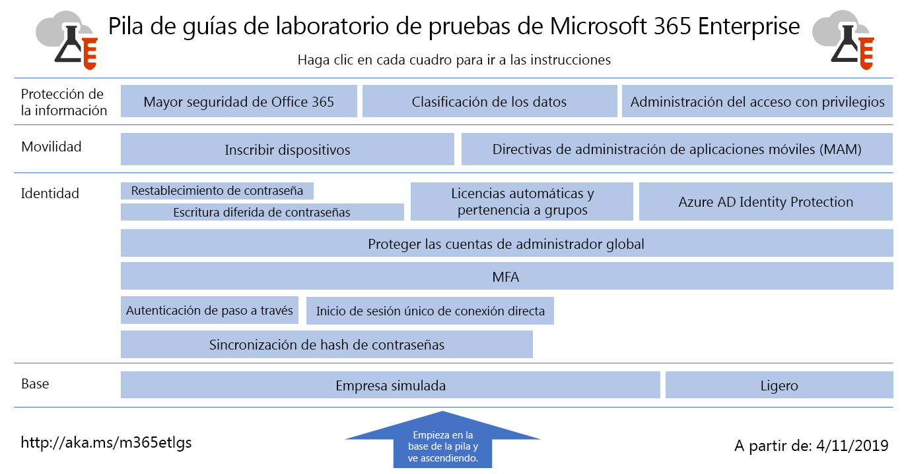

# Guías de laboratorio para pruebas de Microsoft 365 para empresasMicrosoft 365 for enterprise Test Lab Guides

*Esto se aplica tanto a Microsoft 365 para empresas como a Office 365 Enterprise.**This applies to both Microsoft 365 for enterprise and Office 365 Enterprise.*

Las Guías del laboratorio de pruebas (TLG) le ayudan a obtener información rápidamente sobre productos de Microsoft. Proporcionan instrucciones prescriptivas para configurar entornos de pruebas representativos pero simplificados. Puede usar estos entornos para la demostración, la personalización o la creación de pruebas de concepto complejas durante el tiempo que dure una suscripción de prueba o de pago.Test Lab Guides (TLGs) help you quickly learn about Microsoft products. They provide prescriptive instructions to configure simplified but representative test environments. You can use these environments for demonstration, customization, or creation of complex proofs of concept for the duration of a trial or paid subscription. 

Las TLG están diseñadas para ser modulares. Se desarrollan entre sí para crear varias configuraciones que se adapten a sus necesidades de configuración de aprendizaje o de prueba. La experiencia práctica "Lo diseñé yo mismo y funciona" le ayudará a comprender los requisitos de implementación de un nuevo producto o escenario para que pueda planear mejor su hospedaje en producción.TLGs are designed to be modular. They build upon each other to create multiple configurations that more closely match your learning or test configuration needs. The "I built it out myself and it works" hands-on experience helps you understand the deployment requirements of a new product or scenario so you can better plan for hosting it in production.

Las TLG también le permiten crear entornos representativos para desarrollo y prueba de aplicaciones, también conocidos como entornos de desarrollo y prueba.You can also use TLGs to create representative environments for development and testing of applications, also known as dev/test environments.
  

Haga clic [aquí](../media/m365-enterprise-test-lab-guides/Microsoft365EnterpriseTLGStack.pdf) para ver un mapa visual con todos los artículos en la pila de la guías de laboratorio para pruebas de Microsoft 365 para empresas.Click [here](../media/m365-enterprise-test-lab-guides/Microsoft365EnterpriseTLGStack.pdf) for a visual map to all the articles in the Microsoft 365 for enterprise Test Lab Guide stack.

## Configuración básicaBase configuration

Primero, debe crear un entorno de prueba en [Microsoft 365 para empresas](https://docs.microsoft.com/microsoft-365-enterprise/) que incluya Office 365 E5, Enterprise Mobility + Security (EMS) E5 y Windows 10 Enterprise. Puede crear dos tipos diferentes de configuraciones de base:First, you create a test environment for [Microsoft 365 for enterprise](https://docs.microsoft.com/microsoft-365-enterprise/) that includes Office 365 E5, Enterprise Mobility + Security (EMS) E5, and Windows 10 Enterprise. You can create two different types of base configurations:

- Utilice la [configuración de base ligera](lightweight-base-configuration-microsoft-365-enterprise.md) cuando desee configurar y realizar demostraciones sobre las características y capacidades de Microsoft 365 para empresas en un entorno únicamente de la nube, que no incluya componentes locales.Use the [lightweight base configuration](lightweight-base-configuration-microsoft-365-enterprise.md) when you want to configure and demonstrate Microsoft 365 for enterprise features and capabilities in a cloud-only environment, which does not include any on-premises components.

- Utilice la [configuración de base simulada para empresas](simulated-ent-base-configuration-microsoft-365-enterprise.md) cuando desee configurar y demostrar las características y capacidades de Microsoft 365 para empresas en un entorno híbrido de la nube, que usa componentes locales como el Servicios de dominio de Active Directory (AD DS).Use the [simulated enterprise base configuration](simulated-ent-base-configuration-microsoft-365-enterprise.md) when you want to configure and demonstrate Microsoft 365 for enterprise features and capabilities in a hybrid cloud environment, which uses on-premises components such as an Active Directory Domain Services (AD DS) domain.

También puede crear entornos de prueba para Office 365 E5 al no agregar la licencia de Microsoft 365 E5 a su prueba o entorno de prueba de producción.You can also create test environments for Office 365 E5 by not adding the Microsoft 365 E5 license to your trial or production test environment.
    
## IdentidadIdentity

Para mostrar características y funciones relacionadas con identidades, vea:To demonstrate identity-related features and capabilities, see:

- [Sincronización de hash de contraseñasPassword hash synchronization](password-hash-sync-m365-ent-test-environment.md)
  
   Habilite y pruebe la sincronización de directorios basada en hash de contraseñas desde un controlador de dominio AD DS.Enable and test password hash-based directory synchronization from an AD DS domain controller.

- [Autenticación de paso a travésPass-through authentication](pass-through-auth-m365-ent-test-environment.md)
  
   Habilite y pruebe la autenticación de paso a un controlador de dominio AD DS.Enable and test pass-through authentication to an AD DS domain controller.

- [Autenticación federadaFederated authentication](federated-identity-for-your-office-365-dev-test-environment.md)
  
   Habilite y pruebe la autenticación federada a un controlador de dominio AD DS.Enable and test federated authentication to an AD DS domain controller.

- [Inicio de sesión único de conexión directa de Azure ADAzure AD Seamless Single Sign-on](single-sign-on-m365-ent-test-environment.md)
  
   Habilite y pruebe Azure AD Seamless Single Sign-on (SSO) con un controlador de dominio AD DS.Enable and test Azure AD Seamless Single Sign-on (SSO) with an AD DS domain controller.

- [Autenticación multifactorMulti-factor authentication](multi-factor-authentication-microsoft-365-test-environment.md)
  
   Habilite y pruebe la autenticación multifactor basada en teléfono inteligente para una cuenta de usuario determinada.Enable and test smart phone-based multi-factor authentication for a specific user account.

- [Proteger las cuentas de administrador globalProtect global administrator accounts](protect-global-administrator-accounts-microsoft-365-test-environment.md)
 
   Bloquear sus cuentas de administrador global con directivas de acceso condicional.Lock down your global administrator accounts with conditional access policies.

- [Reescritura de contraseñaPassword writeback](password-writeback-m365-ent-test-environment.md)

   Usar una escritura diferida de contraseñas para cambiar la contraseña de su cuenta de usuario de AD DS de Azure AD.Use password writeback to change the password on your AD DS user account from Azure AD.

- [Restablecimiento de contraseñaPassword reset](password-reset-m365-ent-test-environment.md)

   Use el restablecimiento de contraseñas de autoservicio (SSPR) para restablecer su contraseña.Use self-service password reset (SSPR) to reset your password.

- [Licencias automáticas y pertenencia a gruposAutomatic licensing and group membership](automate-licenses-group-membership-microsoft-365-test-environment.md)

   Haga que administrar nuevas cuentas sea más fácil que nunca con licencias automáticas y pertenencia a grupos dinámica.Make administering new accounts easier than ever with automatic licensing and dynamic group membership.

- [Azure AD Identity ProtectionAzure AD Identity Protection](azure-ad-identity-protection-microsoft-365-test-environment.md)

   Examine sus cuentas actuales de usuarios en busca de vulnerabilidades.Scan your current user accounts for vulnerabilities.

- [Acceso de dispositivos e identidadesIdentity and device access](identity-device-access-m365-test-environment.md)

   Crear un entorno para probar la identidad recomendada y configuraciones de acceso de dispositivo y directivas de acceso condicional.Create an environment to test recommended identity and device access configurations and conditional access policies.

## Administración de dispositivos móvilesMobile device management

Para mostrar funcionalidades y características relacionadas con la administración de dispositivos móviles, vea:To demonstrate mobile device management-related features and capabilities, see:

- [Directivas de cumplimiento de dispositivosDevice compliance policies](mam-policies-for-your-microsoft-365-enterprise-dev-test-environment.md)
    
   Cree un grupo de usuarios y una directiva de cumplimiento de dispositivos para dispositivos con Windows 10.Create a user group and a device compliance policy for Windows 10 devices.
    
- [Inscribir dispositivos iOS y AndroidEnroll iOS and Android devices](enroll-ios-and-android-devices-in-your-microsoft-enterprise-365-dev-test-environ.md)
   
   Inscriba los dispositivos Android o iOS y adminístrelos de forma remota.Enroll iOS or Android devices and manage them remotely.

## Protección de la informaciónInformation protection

Para demostrar características y funciones de la información relacionadas con la protección, vea:To demonstrate information protection-related features and capabilities, see:

- [Mayor seguridad de Office 365Increased Office 365 security](increased-o365-security-microsoft-365-enterprise-dev-test-environment.md)
    
   Configure las opciones para aumentar la seguridad de Office 365 y analizar las herramientas de seguridad integrada.Configure settings for increased Office 365 security and investigate built-in security tools.
  
- [Clasificación de datosData classification](data-classification-microsoft-365-enterprise-dev-test-environment.md)
    
   Configure y aplique etiquetas de Office 365 a un documento en un sitio de grupo de SharePoint Online.Configure and apply Office 365 labels to a document in a SharePoint Online team site.
    
- [Administración del acceso con privilegiosPrivileged access management](privileged-access-microsoft-365-enterprise-dev-test-environment.md)
    
   Configure la administración del acceso con privilegios para habilitar el acceso puntual a tareas elevadas o con privilegios en su organización de Office 365.Configure privileged access management for just-in-time access to elevated and privileged tasks in your Office 365 organization.

