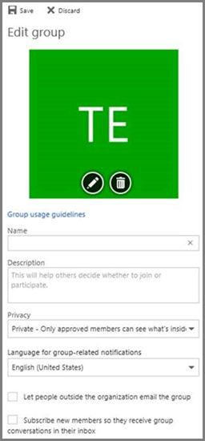

# <a name="manage-microsoft-365-groups-with-powershell"></a><span data-ttu-id="9541b-103">Administración de grupos de Microsoft 365 con PowerShell</span><span class="sxs-lookup"><span data-stu-id="9541b-103">Manage Microsoft 365 Groups with PowerShell</span></span>

<span data-ttu-id="9541b-104">*Este artículo afecta tanto a Office 365 Enterprise como a Microsoft 365 Enterprise*</span><span class="sxs-lookup"><span data-stu-id="9541b-104">*This article applies to both Microsoft 365 Enterprise and Office 365 Enterprise.*</span></span>

<span data-ttu-id="9541b-105">En este artículo se describen los pasos para realizar tareas de administración comunes para los grupos de Microsoft PowerShell.</span><span class="sxs-lookup"><span data-stu-id="9541b-105">This article provides the steps for doing common management tasks for Groups in Microsoft PowerShell.</span></span> <span data-ttu-id="9541b-106">También muestra los cmdlets de PowerShell para grupos.</span><span class="sxs-lookup"><span data-stu-id="9541b-106">It also lists the PowerShell cmdlets for Groups.</span></span> <span data-ttu-id="9541b-107">Para obtener información sobre la administración de sitios de SharePoint, vea [administrar sitios de SharePoint Online con PowerShell](https://docs.microsoft.com/sharepoint/manage-team-and-communication-sites-in-powershell).</span><span class="sxs-lookup"><span data-stu-id="9541b-107">For info about managing SharePoint sites, see [Manage SharePoint Online sites using PowerShell](https://docs.microsoft.com/sharepoint/manage-team-and-communication-sites-in-powershell).</span></span>

## <a name="link-to-your-microsoft-365-groups-usage-guidelines"></a><span data-ttu-id="9541b-108">Vínculo a las instrucciones de uso de Microsoft 365 Groups</span><span class="sxs-lookup"><span data-stu-id="9541b-108">Link to your Microsoft 365 Groups usage guidelines</span></span>
<span data-ttu-id="9541b-109"><a name="BK_LinkToGuideLines"> </a></span><span class="sxs-lookup"><span data-stu-id="9541b-109"><a name="BK_LinkToGuideLines"> </a></span></span>

<span data-ttu-id="9541b-110">Cuando los usuarios [creen o editen un grupo en Outlook](https://support.office.com/article/04d0c9cf-6864-423c-a380-4fa858f27102.aspx), podrá mostrarles un vínculo a las instrucciones de uso de su organización.</span><span class="sxs-lookup"><span data-stu-id="9541b-110">When users [create or edit a group in Outlook](https://support.office.com/article/04d0c9cf-6864-423c-a380-4fa858f27102.aspx), you can show them a link to your organization's usage guidelines.</span></span> <span data-ttu-id="9541b-111">Por ejemplo, si necesita agregar un prefijo o un sufijo específico a un nombre de grupo.</span><span class="sxs-lookup"><span data-stu-id="9541b-111">For example, if you require a specific prefix or suffix to be added to a group name.</span></span>

<span data-ttu-id="9541b-112">Use Azure Active Directory (Azure AD) PowerShell para apuntar a los usuarios a las directrices de uso de su organización para los grupos de Microsoft 365.</span><span class="sxs-lookup"><span data-stu-id="9541b-112">Use the Azure Active Directory (Azure AD) PowerShell to point your users to your organization's usage guidelines for Microsoft 365 groups.</span></span> <span data-ttu-id="9541b-113">Consulte [Azure Active Directory cmdlets para configurar las opciones de grupo](https://go.microsoft.com/fwlink/?LinkID=827484) y siga los pasos que se indican en el vínculo **crear configuración a nivel de directorio** para definir el hipervínculo de la instrucción de uso.</span><span class="sxs-lookup"><span data-stu-id="9541b-113">Check out [Azure Active Directory cmdlets for configuring group settings](https://go.microsoft.com/fwlink/?LinkID=827484) and follow the steps in the **Create settings at the directory level** to define the usage guideline hyperlink.</span></span> <span data-ttu-id="9541b-114">Una vez que se haya ejecutado el cmdlet de AAD, el usuario verá el vínculo a las directrices al crear o editar un grupo en Outlook.</span><span class="sxs-lookup"><span data-stu-id="9541b-114">Once you run the AAD cmdlet, user's will see the link to your guidelines when they create or edit a group in Outlook.</span></span>




## <a name="allow-users-to-send-as-the-microsoft-365-group"></a><span data-ttu-id="9541b-117">Permitir a los usuarios enviar como grupo de 365 de Microsoft</span><span class="sxs-lookup"><span data-stu-id="9541b-117">Allow users to Send as the Microsoft 365 Group</span></span>
<span data-ttu-id="9541b-118"><a name="BK_LinkToGuideLines"> </a></span><span class="sxs-lookup"><span data-stu-id="9541b-118"><a name="BK_LinkToGuideLines"> </a></span></span>

<span data-ttu-id="9541b-119">Si desea habilitar los grupos de Microsoft 365 para "enviar como", use los cmdlets [Add-RecipientPermission](https://docs.microsoft.com/powershell/module/exchange/add-recipientpermission) y [Get-RecipientPermission](https://docs.microsoft.com/powershell/module/exchange/get-recipientpermission) para configurarlos.</span><span class="sxs-lookup"><span data-stu-id="9541b-119">If you want to enable your Microsoft 365 groups to "Send As", use the [Add-RecipientPermission](https://docs.microsoft.com/powershell/module/exchange/add-recipientpermission) and [Get-RecipientPermission](https://docs.microsoft.com/powershell/module/exchange/get-recipientpermission) cmdlets to configure this.</span></span> <span data-ttu-id="9541b-120">Una vez habilitada esta opción, los usuarios del grupo de 365 de Microsoft pueden usar Outlook o Outlook en la web para enviar y responder correo electrónico como el grupo de Microsoft 365.</span><span class="sxs-lookup"><span data-stu-id="9541b-120">Once you enable this setting, Microsoft 365 group users can use Outlook or Outlook on the web to send and reply to email as the Microsoft 365 group.</span></span> <span data-ttu-id="9541b-121">Los usuarios pueden ir al grupo, crear un nuevo correo electrónico y cambiar el campo "enviar como" por la dirección de correo electrónico del grupo.</span><span class="sxs-lookup"><span data-stu-id="9541b-121">Users can go to the group, create a new email, and change the "Send As" field to the group's email address.</span></span>

<span data-ttu-id="9541b-122">([También puede hacerlo en el centro de administración de Exchange](https://docs.microsoft.com/office365/admin/create-groups/allow-members-to-send-as-or-send-on-behalf-of-group)).</span><span class="sxs-lookup"><span data-stu-id="9541b-122">([You can also do this in the Exchange Admin Center](https://docs.microsoft.com/office365/admin/create-groups/allow-members-to-send-as-or-send-on-behalf-of-group).)</span></span>

<span data-ttu-id="9541b-123">Use el siguiente script, reemplazando *\<GroupAlias\>* por el alias del grupo que desea actualizar y *\<UserAlias\>* con el alias del usuario al que desea conceder permisos.</span><span class="sxs-lookup"><span data-stu-id="9541b-123">Use the following script, replacing *\<GroupAlias\>* with the alias of the group that you want to update, and *\<UserAlias\>* with the alias of the user to whom you want to grant permissions.</span></span> <span data-ttu-id="9541b-124">[Conéctese a Exchange Online PowerShell](https://docs.microsoft.com/powershell/exchange/connect-to-exchange-online-powershell) para ejecutar este script.</span><span class="sxs-lookup"><span data-stu-id="9541b-124">[Connect to Exchange Online PowerShell](https://docs.microsoft.com/powershell/exchange/connect-to-exchange-online-powershell) to run this script.</span></span>

```PowerShell
$groupAlias = "<GroupAlias>"
$userAlias = "<UserAlias>"
$groupsRecipientDetails = Get-Recipient -RecipientTypeDetails groupmailbox -Identity $groupAlias

Add-RecipientPermission -Identity $groupsRecipientDetails.Name -Trustee $userAlias -AccessRights SendAs
```

<span data-ttu-id="9541b-125">Una vez que se ejecuta el cmdlet, los usuarios pueden ir a Outlook o Outlook en la web para enviarlos como grupo, agregando la dirección de correo electrónico del grupo al campo **de** .</span><span class="sxs-lookup"><span data-stu-id="9541b-125">Once the cmdlet is executed, users can go to Outlook or Outlook on the web to send as the group, by adding the group email address to the **From** field.</span></span>

## <a name="create-classifications-for-microsoft-365-groups-in-your-organization"></a><span data-ttu-id="9541b-126">Crear clasificaciones para los grupos de Microsoft 365 en su organización</span><span class="sxs-lookup"><span data-stu-id="9541b-126">Create classifications for Microsoft 365 Groups in your organization</span></span>

<span data-ttu-id="9541b-127">Puede crear etiquetas de confidencialidad que los usuarios de su organización puedan establecer al crear un grupo de Microsoft 365.</span><span class="sxs-lookup"><span data-stu-id="9541b-127">You can create sensitivity labels that the users in your organization can set when they create a Microsoft 365 Group.</span></span> <span data-ttu-id="9541b-128">Si desea clasificar grupos, se recomienda usar etiquetas de confidencialidad en lugar de la característica de clasificación de grupos anterior.</span><span class="sxs-lookup"><span data-stu-id="9541b-128">If you want to classify groups, we recommend using sensitivity labels instead of the previous groups classification feature.</span></span> <span data-ttu-id="9541b-129">Para obtener información sobre el uso de las etiquetas de confidencialidad, consulte [usar las etiquetas de confidencialidad para proteger el contenido en Microsoft Teams, grupos de microsoft 365 y sitios de SharePoint](https://docs.microsoft.com/microsoft-365/compliance/sensitivity-labels-teams-groups-sites).</span><span class="sxs-lookup"><span data-stu-id="9541b-129">For information about using sensitivity labels, see [Use sensitivity labels to protect content in Microsoft Teams, Microsoft 365 groups, and SharePoint sites](https://docs.microsoft.com/microsoft-365/compliance/sensitivity-labels-teams-groups-sites).</span></span>

> [!IMPORTANT]
> <span data-ttu-id="9541b-130">Si actualmente usa etiquetas de clasificación, ya no estarán disponibles para los usuarios que crean grupos cuando las etiquetas de confidencialidad están habilitadas.</span><span class="sxs-lookup"><span data-stu-id="9541b-130">If you are currently using classification labels, they will no longer be available to users who create groups once sensitivity labels are enabled.</span></span>

<span data-ttu-id="9541b-131">Todavía puede usar la característica clasificación de grupos anterior.</span><span class="sxs-lookup"><span data-stu-id="9541b-131">You can still use the previous groups classification feature.</span></span> <span data-ttu-id="9541b-132">Puede crear clasificaciones que los usuarios de su organización puedan establecer al crear un grupo de 365 de Microsoft.</span><span class="sxs-lookup"><span data-stu-id="9541b-132">You can create classifications that the users in your organization can set when they create an Microsoft 365 Group.</span></span> <span data-ttu-id="9541b-133">Por ejemplo, puede permitir que los usuarios establezcan "Standard", "Secret" y "Top Secret" en los grupos que crean.</span><span class="sxs-lookup"><span data-stu-id="9541b-133">For example, you can allow users to set "Standard", "Secret", and "Top Secret" on groups they create.</span></span> <span data-ttu-id="9541b-134">Las clasificaciones de grupo no se establecen de forma predeterminada y es necesario crearlas para que los usuarios las configuren.</span><span class="sxs-lookup"><span data-stu-id="9541b-134">Group classifications aren't set by default and you need to create it in order for your users to set it.</span></span> <span data-ttu-id="9541b-135">Use Azure Active Directory PowerShell para apuntar a los usuarios a las instrucciones de uso de la organización para los grupos de Microsoft 365.</span><span class="sxs-lookup"><span data-stu-id="9541b-135">Use Azure Active Directory PowerShell to point your users to your organization's usage guidelines for Microsoft 365 Groups.</span></span>

<span data-ttu-id="9541b-136">Consulte los [cmdlets de Azure Active Directory para configurar las opciones de grupo](https://docs.microsoft.com/azure/active-directory/users-groups-roles/groups-settings-cmdlets) y siga los pasos descritos en el **nivel de directorio** para definir la clasificación de los grupos de Microsoft 365.</span><span class="sxs-lookup"><span data-stu-id="9541b-136">Check out [Azure Active Directory cmdlets for configuring group settings](https://docs.microsoft.com/azure/active-directory/users-groups-roles/groups-settings-cmdlets) and follow the steps in the **Create settings at the directory level** to define the classification for Microsoft 365 Groups.</span></span>

```powershell
$setting["ClassificationList"] = "Low Impact, Medium Impact, High Impact"
```

<span data-ttu-id="9541b-137">Para asociar una descripción a cada clasificación, puede usar el atributo Settings  *ClassificationDescriptions* para definirla.</span><span class="sxs-lookup"><span data-stu-id="9541b-137">In order to associate a description to each classification you can use the settings attribute  *ClassificationDescriptions* to define.</span></span>

```powershell
$setting["ClassificationDescriptions"] ="Classification:Description,Classification:Description"
```

<span data-ttu-id="9541b-138">donde clasificación coincide con las cadenas de ClassificationList.</span><span class="sxs-lookup"><span data-stu-id="9541b-138">where Classification matches the strings in the ClassificationList.</span></span>

<span data-ttu-id="9541b-139">Ejemplo:</span><span class="sxs-lookup"><span data-stu-id="9541b-139">Example:</span></span>

```powershell
$setting["ClassificationDescriptions"] = "Low Impact: General communication, Medium Impact: Company internal data , High Impact: Data that has regulatory requirements"
```

<span data-ttu-id="9541b-140">Después de ejecutar el cmdlet de Azure Active Directory anterior para establecer la clasificación, ejecute el cmdlet [set-UnifiedGroup](https://docs.microsoft.com/powershell/module/exchange/Set-UnifiedGroup) si desea establecer la clasificación para un grupo específico.</span><span class="sxs-lookup"><span data-stu-id="9541b-140">After you run the above Azure Active Directory cmdlet to set your classification, run the [Set-UnifiedGroup](https://docs.microsoft.com/powershell/module/exchange/Set-UnifiedGroup) cmdlet if you want to set the classification for a specific group.</span></span>

```powershell
Set-UnifiedGroup <LowImpactGroup@constoso.com> -Classification <LowImpact>
```

<span data-ttu-id="9541b-141">O bien, cree un nuevo grupo con una clasificación.</span><span class="sxs-lookup"><span data-stu-id="9541b-141">Or create a new group with a classification.</span></span>

```powershell
New-UnifiedGroup <HighImpactGroup@constoso.com> -Classification <HighImpact> -AccessType <Public>
```

<span data-ttu-id="9541b-142">Vea [usar PowerShell con Exchange Online](https://docs.microsoft.com/powershell/exchange/exchange-online-powershell) y [Conéctese a Exchange Online PowerShell](https://docs.microsoft.com/powershell/exchange/connect-to-exchange-online-powershell) para obtener más información sobre el uso de Exchange Online PowerShell.</span><span class="sxs-lookup"><span data-stu-id="9541b-142">Check out [Using PowerShell with Exchange Online](https://docs.microsoft.com/powershell/exchange/exchange-online-powershell) and [Connect to Exchange Online PowerShell](https://docs.microsoft.com/powershell/exchange/connect-to-exchange-online-powershell) for more details on using Exchange Online PowerShell.</span></span>

<span data-ttu-id="9541b-143">Una vez habilitada esta configuración, el propietario del grupo podrá elegir una clasificación en el menú desplegable de Outlook en la web y en Outlook, y guardarla desde la página **Editar** grupo.</span><span class="sxs-lookup"><span data-stu-id="9541b-143">Once these settings are enabled, the group owner will be able to choose a classification from the drop down menu in Outlook on the Web and Outlook, and save it from the **Edit** group page.</span></span>


## <a name="hide-microsoft-365-groups-from-the-global-address-list"></a><span data-ttu-id="9541b-145">Oculte los grupos de Microsoft 365 de la lista global de direcciones.</span><span class="sxs-lookup"><span data-stu-id="9541b-145">Hide Microsoft 365 Groups from the global address list.</span></span>
<span data-ttu-id="9541b-146"><a name="BKMK_CreateClassification"> </a></span><span class="sxs-lookup"><span data-stu-id="9541b-146"><a name="BKMK_CreateClassification"> </a></span></span>

<span data-ttu-id="9541b-147">Puede especificar si un grupo de 365 de Microsoft aparece en la lista global de direcciones (GAL) y en otras listas de la organización.</span><span class="sxs-lookup"><span data-stu-id="9541b-147">You can specify whether a Microsoft 365 Group appears in the global address list (GAL) and other lists in your organization.</span></span> <span data-ttu-id="9541b-148">Por ejemplo, si tiene un grupo de departamento legal que no desea que aparezca en la lista de direcciones, puede impedir que ese grupo aparezca en la GAL.</span><span class="sxs-lookup"><span data-stu-id="9541b-148">For example, if you have a legal department group that you don't want to show up in the address list, you can stop that group from appearing in the GAL.</span></span> <span data-ttu-id="9541b-149">Ejecute el cmdlet de grupo Set-Unified para ocultar el grupo de la lista de direcciones de la siguiente manera:</span><span class="sxs-lookup"><span data-stu-id="9541b-149">Run the Set-Unified Group cmdlet to hide the group from the address list like this:</span></span>

```powershell
Set-UnifiedGroup -Identity "Legal Department" -HiddenFromAddressListsEnabled $true
```

## <a name="allow-only-internal-users-to-send-message-to-microsoft-365-groups"></a><span data-ttu-id="9541b-150">Permitir que solo los usuarios internos envíen mensajes a grupos de Microsoft 365</span><span class="sxs-lookup"><span data-stu-id="9541b-150">Allow only internal users to send message to Microsoft 365 Groups</span></span>
<span data-ttu-id="9541b-151"><a name="BKMK_CreateClassification"> </a></span><span class="sxs-lookup"><span data-stu-id="9541b-151"><a name="BKMK_CreateClassification"> </a></span></span>

<span data-ttu-id="9541b-152">Si no quiere que los usuarios de otras organizaciones envíen mensajes de correo electrónico a un grupo de Microsoft 365, puede cambiar la configuración de ese grupo.</span><span class="sxs-lookup"><span data-stu-id="9541b-152">If you don't want users from other organizations to send emails to a Microsoft 365 Group, you can change the settings for that group.</span></span> <span data-ttu-id="9541b-153">Permitirá que solo los usuarios internos envíen un correo electrónico a su grupo.</span><span class="sxs-lookup"><span data-stu-id="9541b-153">It will allow only internal users to send an email to your group.</span></span> <span data-ttu-id="9541b-154">Si un usuario externo intenta enviar un mensaje a ese grupo, se rechazará.</span><span class="sxs-lookup"><span data-stu-id="9541b-154">If an external user tries to send a message to that group, it will be rejected.</span></span>

<span data-ttu-id="9541b-155">Ejecute el cmdlet Set-UnifiedGroup para actualizar esta configuración, como se muestra a continuación:</span><span class="sxs-lookup"><span data-stu-id="9541b-155">Run the Set-UnifiedGroup cmdlet to update this setting, like this:</span></span>

```powershell
Set-UnifiedGroup -Identity "Internal senders only" -RequireSenderAuthenticationEnabled $true
```

## <a name="add-mailtips-to-microsoft-365-groups"></a><span data-ttu-id="9541b-156">Agregar sugerencias de correo a los grupos de Microsoft 365</span><span class="sxs-lookup"><span data-stu-id="9541b-156">Add MailTips to Microsoft 365 Groups</span></span>
<span data-ttu-id="9541b-157"><a name="BKMK_CreateClassification"> </a></span><span class="sxs-lookup"><span data-stu-id="9541b-157"><a name="BKMK_CreateClassification"> </a></span></span>

<span data-ttu-id="9541b-158">Cuando un remitente intenta enviar un correo electrónico a un grupo de Microsoft 365, se le puede mostrar una sugerencia de correo electrónico.</span><span class="sxs-lookup"><span data-stu-id="9541b-158">Whenever a sender tries to send an email to a Microsoft 365 Group, a MailTip can be shown to them.</span></span>

<span data-ttu-id="9541b-159">Ejecute el cmdlet de grupo Set-Unified para agregar una sugerencia de correo al Grupo:</span><span class="sxs-lookup"><span data-stu-id="9541b-159">Run the Set-Unified Group cmdlet to add a mailTip to the group:</span></span>

```powershell
Set-UnifiedGroup -Identity "MailTip Group" -MailTip "This group has a MailTip"
```

<span data-ttu-id="9541b-160">Además de la sugerencia de correo, también puede establecer MailTipTranslations, que especifica los idiomas adicionales para la sugerencia de correo.</span><span class="sxs-lookup"><span data-stu-id="9541b-160">Along with MailTip, you can also set MailTipTranslations, which specifies additional languages for the MailTip.</span></span> <span data-ttu-id="9541b-161">Suponga que quiere tener la traducción al español y, a continuación, ejecute el siguiente comando:</span><span class="sxs-lookup"><span data-stu-id="9541b-161">Suppose you want to have the Spanish translation, then run the following command:</span></span>

```powershell
Set-UnifiedGroup -Identity "MailaTip Group" -MailTip "This group has a MailTip" -MailTipTranslations "@{Add="ES:Esta caja no se supervisa."
```

## <a name="change-the-display-name-of-the-microsoft-365-group"></a><span data-ttu-id="9541b-162">Cambiar el nombre para mostrar del grupo 365 de Microsoft</span><span class="sxs-lookup"><span data-stu-id="9541b-162">Change the display name of the Microsoft 365 Group</span></span>

<span data-ttu-id="9541b-163">El nombre para mostrar especifica el nombre del grupo de Microsoft 365.</span><span class="sxs-lookup"><span data-stu-id="9541b-163">The display name specifies the name of the Microsoft 365 Group.</span></span> <span data-ttu-id="9541b-164">Puede ver este nombre en su centro de administración de Exchange o en el centro de administración de Microsoft 365.</span><span class="sxs-lookup"><span data-stu-id="9541b-164">You can see this name in your exchange admin center or Microsoft 365 admin center.</span></span> <span data-ttu-id="9541b-165">Puede editar el nombre para mostrar del grupo o asignar un nombre para mostrar a un grupo de Microsoft 365 existente ejecutando el comando Set-UnifiedGroup:</span><span class="sxs-lookup"><span data-stu-id="9541b-165">You can edit the display name of the group or assign a display name to an existing Microsoft 365 Group by running the Set-UnifiedGroup command:</span></span>

```powershell
Set-UnifiedGroup -Identity "mygroup@contoso.com" -DisplayName "My new group"
```

## <a name="change-the-default-setting-of-microsoft-365-groups-for-outlook-to-public-or-private"></a><span data-ttu-id="9541b-166">Cambiar la configuración predeterminada de los grupos de Microsoft 365 para Outlook a Public o Private</span><span class="sxs-lookup"><span data-stu-id="9541b-166">Change the default setting of Microsoft 365 Groups for Outlook to Public or Private</span></span>
<span data-ttu-id="9541b-167"><a name="BKMK_CreateClassification"> </a></span><span class="sxs-lookup"><span data-stu-id="9541b-167"><a name="BKMK_CreateClassification"> </a></span></span>

<span data-ttu-id="9541b-168">Los grupos de Microsoft 365 en Outlook se crean como privados de forma predeterminada.</span><span class="sxs-lookup"><span data-stu-id="9541b-168">Microsoft 365 Groups in Outlook are created as Private by default.</span></span> <span data-ttu-id="9541b-169">Si su organización desea que los grupos de Microsoft 365 se creen como públicos de forma predeterminada (o volver a privado), use esta sintaxis de cmdlet de PowerShell:</span><span class="sxs-lookup"><span data-stu-id="9541b-169">If your organization wants Microsoft 365 Groups to be created as Public by default (or back to Private), use this PowerShell cmdlet syntax:</span></span>

 `Set-OrganizationConfig -DefaultGroupAccessType Public`

<span data-ttu-id="9541b-170">Para establecer en privado:</span><span class="sxs-lookup"><span data-stu-id="9541b-170">To set to Private:</span></span>

 `Set-OrganizationConfig -DefaultGroupAccessType Private`

<span data-ttu-id="9541b-171">Para comprobar la configuración:</span><span class="sxs-lookup"><span data-stu-id="9541b-171">To verify the setting:</span></span>

 `Get-OrganizationConfig | ft DefaultGroupAccessType`

<span data-ttu-id="9541b-172">Para obtener más información, consulte [set-organizationconfig](https://docs.microsoft.com/powershell/module/exchange/set-organizationconfig) y [Get-organizationconfig](https://docs.microsoft.com/powershell/module/exchange/get-organizationconfig).</span><span class="sxs-lookup"><span data-stu-id="9541b-172">To learn more, see [Set-OrganizationConfig](https://docs.microsoft.com/powershell/module/exchange/set-organizationconfig) and [Get-OrganizationConfig](https://docs.microsoft.com/powershell/module/exchange/get-organizationconfig).</span></span>

## <a name="microsoft-365-groups-cmdlets"></a><span data-ttu-id="9541b-173">Cmdlets de Microsoft 365 Groups</span><span class="sxs-lookup"><span data-stu-id="9541b-173">Microsoft 365 Groups cmdlets</span></span>

<span data-ttu-id="9541b-174">Los siguientes cmdlets se pueden usar con los grupos de Microsoft 365.</span><span class="sxs-lookup"><span data-stu-id="9541b-174">The following cmdlets can be used with Microsoft 365 Groups.</span></span>

|<span data-ttu-id="9541b-175">**Nombre de cmdlet**</span><span class="sxs-lookup"><span data-stu-id="9541b-175">**Cmdlet name**</span></span>|<span data-ttu-id="9541b-176">**Descripción**</span><span class="sxs-lookup"><span data-stu-id="9541b-176">**Description**</span></span>|
|:-----|:-----|
|[<span data-ttu-id="9541b-177">Get-UnifiedGroup</span><span class="sxs-lookup"><span data-stu-id="9541b-177">Get-UnifiedGroup</span></span>](https://go.microsoft.com/fwlink/p/?LinkId=616182) <br/> |<span data-ttu-id="9541b-178">Use este cmdlet para buscar grupos existentes de Microsoft 365 y para ver las propiedades del objeto de grupo.</span><span class="sxs-lookup"><span data-stu-id="9541b-178">Use this cmdlet to look up existing Microsoft 365 Groups, and to view properties of the group object</span></span>  <br/> |
|[<span data-ttu-id="9541b-179">Set-UnifiedGroup</span><span class="sxs-lookup"><span data-stu-id="9541b-179">Set-UnifiedGroup</span></span>](https://go.microsoft.com/fwlink/p/?LinkId=616189) <br/> |<span data-ttu-id="9541b-180">Actualizar las propiedades de un grupo de Microsoft 365 específico</span><span class="sxs-lookup"><span data-stu-id="9541b-180">Update the properties of a specific Microsoft 365 Group</span></span>  <br/> |
|[<span data-ttu-id="9541b-181">New-UnifiedGroup</span><span class="sxs-lookup"><span data-stu-id="9541b-181">New-UnifiedGroup</span></span>](https://go.microsoft.com/fwlink/p/?LinkId=616183) <br/> |<span data-ttu-id="9541b-182">Cree un nuevo grupo de 365 de Microsoft.</span><span class="sxs-lookup"><span data-stu-id="9541b-182">Create a new Microsoft 365 Group.</span></span> <span data-ttu-id="9541b-183">Este cmdlet proporciona un conjunto mínimo de parámetros.</span><span class="sxs-lookup"><span data-stu-id="9541b-183">This cmdlet provides a minimal set of parameters.</span></span> <span data-ttu-id="9541b-184">Para establecer los valores de las propiedades extendidas, use Set-UnifiedGroup después de crear el nuevo grupo.</span><span class="sxs-lookup"><span data-stu-id="9541b-184">To set values for extended properties, use Set-UnifiedGroup after creating the new group</span></span>  <br/> |
|[<span data-ttu-id="9541b-185">Remove-UnifiedGroup</span><span class="sxs-lookup"><span data-stu-id="9541b-185">Remove-UnifiedGroup</span></span>](https://go.microsoft.com/fwlink/p/?LinkId=616186) <br/> |<span data-ttu-id="9541b-186">Eliminar un grupo de Microsoft 365 existente</span><span class="sxs-lookup"><span data-stu-id="9541b-186">Delete an existing Microsoft 365 Group</span></span>  <br/> |
|[<span data-ttu-id="9541b-187">Get-UnifiedGroupLinks</span><span class="sxs-lookup"><span data-stu-id="9541b-187">Get-UnifiedGroupLinks</span></span>](https://go.microsoft.com/fwlink/p/?LinkId=616194) <br/> |<span data-ttu-id="9541b-188">Recuperar la información de pertenencia y propietario de un grupo de 365 de Microsoft</span><span class="sxs-lookup"><span data-stu-id="9541b-188">Retrieve membership and owner information for a Microsoft 365 Group</span></span>  <br/> |
|[<span data-ttu-id="9541b-189">Add-UnifiedGroupLinks</span><span class="sxs-lookup"><span data-stu-id="9541b-189">Add-UnifiedGroupLinks</span></span>](https://go.microsoft.com/fwlink/p/?LinkId=616191) <br/> |<span data-ttu-id="9541b-190">Agregar miembros, propietarios y suscriptores a un grupo de Microsoft 365 existente</span><span class="sxs-lookup"><span data-stu-id="9541b-190">Add members, owners, and subscribers to an existing Microsoft 365 Group</span></span> <br/> |
|[<span data-ttu-id="9541b-191">Remove-UnifiedGroupLinks</span><span class="sxs-lookup"><span data-stu-id="9541b-191">Remove-UnifiedGroupLinks</span></span>](https://go.microsoft.com/fwlink/p/?LinkId=616195) <br/> |<span data-ttu-id="9541b-192">Quitar propietarios y miembros de un grupo de Microsoft 365 existente</span><span class="sxs-lookup"><span data-stu-id="9541b-192">Remove owners and members from an existing Microsoft 365 Group</span></span>  <br/> |
|[<span data-ttu-id="9541b-193">Get-UserPhoto</span><span class="sxs-lookup"><span data-stu-id="9541b-193">Get-UserPhoto</span></span>](https://go.microsoft.com/fwlink/p/?LinkId=536510) <br/> |<span data-ttu-id="9541b-194">Se usa para ver información sobre la foto de usuario asociada a una cuenta.</span><span class="sxs-lookup"><span data-stu-id="9541b-194">Used to view information about the user photo associated with an account.</span></span> <span data-ttu-id="9541b-195">Las fotos de los usuarios se almacenan en Active Directory</span><span class="sxs-lookup"><span data-stu-id="9541b-195">User photos are stored in Active Directory</span></span>  <br/> |
|[<span data-ttu-id="9541b-196">Set-UserPhoto</span><span class="sxs-lookup"><span data-stu-id="9541b-196">Set-UserPhoto</span></span>](https://go.microsoft.com/fwlink/p/?LinkId=536511) <br/> |<span data-ttu-id="9541b-197">Se usa para asociar una foto de usuario con una cuenta.</span><span class="sxs-lookup"><span data-stu-id="9541b-197">Used to associate a user photo with an account.</span></span> <span data-ttu-id="9541b-198">Las fotos de los usuarios se almacenan en Active Directory</span><span class="sxs-lookup"><span data-stu-id="9541b-198">User photos are stored in Active Directory</span></span>  <br/> |
|[<span data-ttu-id="9541b-199">Remove-UserPhoto</span><span class="sxs-lookup"><span data-stu-id="9541b-199">Remove-UserPhoto</span></span>](https://go.microsoft.com/fwlink/p/?LinkId=536512) <br/> |<span data-ttu-id="9541b-200">Quitar la foto de un grupo de 365 de Microsoft</span><span class="sxs-lookup"><span data-stu-id="9541b-200">Remove the photo for an Microsoft 365 Group</span></span>  <br/> |

## <a name="related-topics"></a><span data-ttu-id="9541b-201">Temas relacionados</span><span class="sxs-lookup"><span data-stu-id="9541b-201">Related topics</span></span>

[<span data-ttu-id="9541b-202">Actualizar listas de distribución a grupos de 365 de Microsoft</span><span class="sxs-lookup"><span data-stu-id="9541b-202">Upgrade distribution lists to Microsoft 365 Groups</span></span>](https://docs.microsoft.com/office365/admin/manage/upgrade-distribution-lists)

[<span data-ttu-id="9541b-203">Administrar quién puede crear grupos de Microsoft 365</span><span class="sxs-lookup"><span data-stu-id="9541b-203">Manage who can create Microsoft 365 Groups</span></span>](https://docs.microsoft.com/office365/admin/create-groups/manage-creation-of-groups)

[<span data-ttu-id="9541b-204">Administrar el acceso de invitado a grupos de 365 de Microsoft</span><span class="sxs-lookup"><span data-stu-id="9541b-204">Manage guest access to Microsoft 365 Groups</span></span>](https://support.office.com/article/bfc7a840-868f-4fd6-a390-f347bf51aff6)

[<span data-ttu-id="9541b-205">Cambiar la pertenencia al grupo estático a dinámico</span><span class="sxs-lookup"><span data-stu-id="9541b-205">Change static group membership to dynamic in</span></span>](https://docs.microsoft.com/azure/active-directory/users-groups-roles/groups-change-type)
