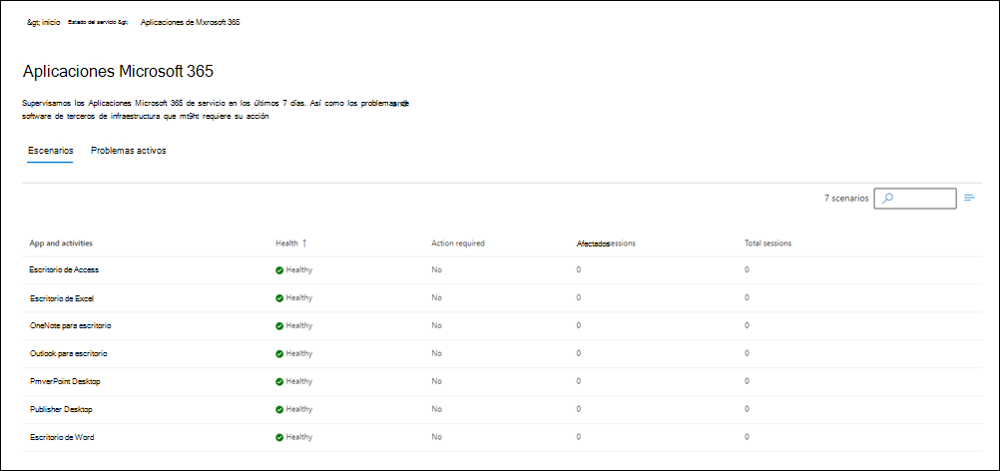

# Supervisión de aplicaciones de Microsoft 365

Aplicaciones Microsoft 365 supervisión admite los siguientes escenarios de nivel organizativo para estas aplicaciones de Escritorio de Office: Access, Excel, OneNote, Outlook, PowerPoint, Publisher y Word.

- **Errores excesivos en tiempo de ejecución de cliente**. La tasa de errores en tiempo de ejecución de una aplicación de Office específica ha aumentado significativamente en las últimas 24 horas.

- **Tiempo de carga de archivo local largo**. El tiempo medio de carga de archivos del almacenamiento local ha superado el umbral recomendado en las últimas 24 horas.

- **Tiempo de carga largo de la aplicación**. El tiempo medio de carga de la aplicación ha superado el umbral recomendado en las últimas 24 horas.

- **Errores excesivos de macro**. La tasa de errores de macro ha superado el umbral recomendado en las últimas 24 horas.

- **Errores excesivos de complemento**. La tasa de errores del complemento ha superado el umbral recomendado en las últimas 24 horas.

- **Tiempo de carga de archivos de SharePoint largo**. El promedio de tiempo de carga de archivos de SharePoint ha superado el umbral recomendado en las últimas 24 horas.

Este es un ejemplo del panel de supervisión de aplicaciones

Cuando Microsoft detecta una condición de error, se crea una publicación para notificar al administrador de inquilinos que vaya al panel de Microsoft 365 App Health para obtener más información para corregir problemas. Para más información, consulte la [El estado de las Aplicaciones de Microsoft 365](/deployoffice/admincenter/microsoft-365-apps-health).
