# Cambios en el contenido de implementación de Microsoft 365 EnterpriseChanges to Microsoft 365 Enterprise deployment content

## Octubre de 2019October 2019

### Nuevo contenidoNew content 

- [Póster Equipos para datos altamente reguladosTeams for highly regulated data poster](secure-teams-highly-regulated-data-scenario.md#poster)

  [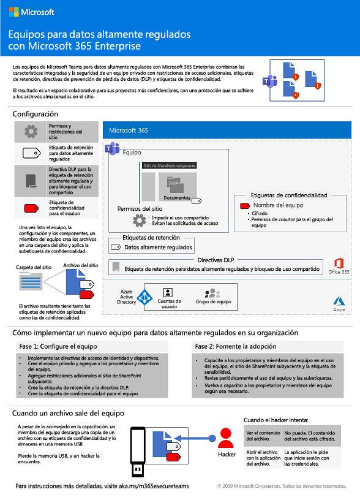](./media/secure-teams-highly-regulated-data-scenario/TeamsHighlyRegulatedData.pdf)

  Puede descargar este póster también como un [PDF](https://github.com/MicrosoftDocs/microsoft-365-docs/raw/public/microsoft-365/enterprise/media/secure-teams-highly-regulated-data-scenario/TeamsHighlyRegulatedData.pdf) para imprimirlo en formato de carta, DIN o cartel (11 x 17 pulgadas).You can also download this poster as a [PDF](https://github.com/MicrosoftDocs/microsoft-365-docs/raw/public/microsoft-365/enterprise/media/secure-teams-highly-regulated-data-scenario/TeamsHighlyRegulatedData.pdf) and print it in letter, legal, or tabloid (11 x 17) formats.

- [Póster Sitios de SharePoint para datos altamente reguladosSharePoint sites for highly regulated data poster](teams-sharepoint-online-sites-highly-regulated-data.md#poster)

  [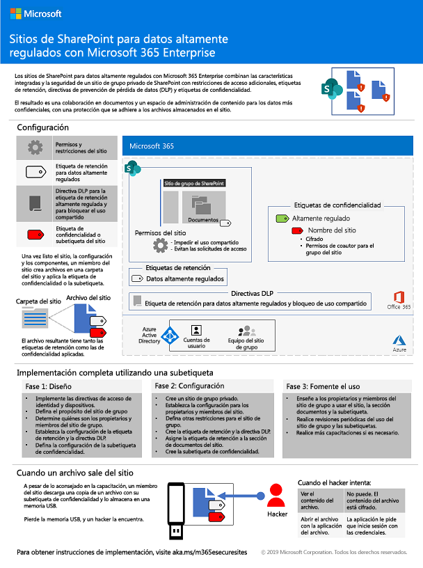](./media/teams-sharepoint-online-sites-highly-regulated-data/SharePointSitesHighlyRegulatedData.pdf)

  Puede descargar este póster también como un [PDF](https://github.com/MicrosoftDocs/microsoft-365-docs/raw/public/microsoft-365/enterprise/media/teams-sharepoint-online-sites-highly-regulated-data/SharePointSitesHighlyRegulatedData.pdf) para imprimirlo en formato de carta, DIN o cartel (11 x 17 pulgadas).You can also download this poster as a [PDF](https://github.com/MicrosoftDocs/microsoft-365-docs/raw/public/microsoft-365/enterprise/media/teams-sharepoint-online-sites-highly-regulated-data/SharePointSitesHighlyRegulatedData.pdf) and print it in letter, legal, or tabloid (11 x 17) formats.

- [El póster para la implementación de Windows 10 con piloto automáticoThe Deploy Windows 10 with Autopilot poster](windows10-deploy-autopilot.md) 

  

  También puede descargar este póster en [PDF](https://github.com/MicrosoftDocs/windows-itpro-docs/raw/public/windows/deployment/media/Windows10AutopilotFlowchart.pdf) o en formato de [Visio](https://github.com/MicrosoftDocs/windows-itpro-docs/raw/public/windows/deployment/media/Windows10Autopilotflowchart.vsdx).You can also download this poster in [PDF](https://github.com/MicrosoftDocs/windows-itpro-docs/raw/public/windows/deployment/media/Windows10AutopilotFlowchart.pdf) or [Visio](https://github.com/MicrosoftDocs/windows-itpro-docs/raw/public/windows/deployment/media/Windows10Autopilotflowchart.vsdx) format.

- [Implementación de Windows 10 con el póster de Microsoft Endpoint Configuration ManagerThe Windows 10 deployment with System Center Configuration Manager poster](windows10-deploy-inplaceupgrade.md)

  

  También puede descargar este póster en [PDF](https://github.com/MicrosoftDocs/windows-itpro-docs/raw/public/windows/deployment/media/Windows10DeploymentConfigManager.pdf) o en formato de [Visio](https://github.com/MicrosoftDocs/windows-itpro-docs/raw/public/windows/deployment/media/Windows10DeploymentConfigManager.vsdx).You can also download this poster in [PDF](https://github.com/MicrosoftDocs/windows-itpro-docs/raw/public/windows/deployment/media/Windows10DeploymentConfigManager.pdf) or [Visio](https://github.com/MicrosoftDocs/windows-itpro-docs/raw/public/windows/deployment/media/Windows10DeploymentConfigManager.vsdx) format.

- [Teams para un escenario de datos altamente regulados Teams for highly regulated data scenario](secure-teams-highly-regulated-data-scenario.md)

  [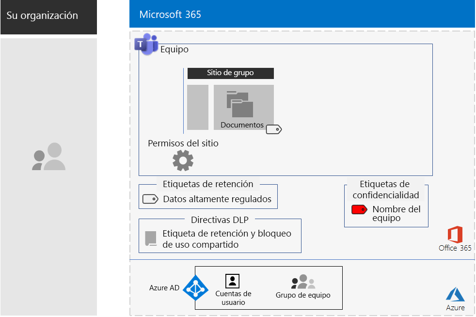](secure-teams-highly-regulated-data-scenario.md)

  Anuncios: [Blog de la comunidad técnica de Microsoft 365](https://techcommunity.microsoft.com/t5/Microsoft-365-Blog/Protect-your-highly-regulated-files-in-Teams-with-Microsoft-365/ba-p/962985)  |  [LinkedIn](https://www.linkedin.com/pulse/how-can-i-lock-down-team-sensitive-top-secret-joe-davies/?published=t) Announcements: [Microsoft 365 Technical Community blog](https://techcommunity.microsoft.com/t5/Microsoft-365-Blog/Protect-your-highly-regulated-files-in-Teams-with-Microsoft-365/ba-p/962985)  |  [LinkedIn](https://www.linkedin.com/pulse/how-can-i-lock-down-team-sensitive-top-secret-joe-davies/?published=t)

- [Póster para aumentar la productividad de los trabajadores remotosEmpower remote workers poster](empower-people-to-work-remotely.md#poster)

  [Póster para aumentar la productividad de los trabajadores remotos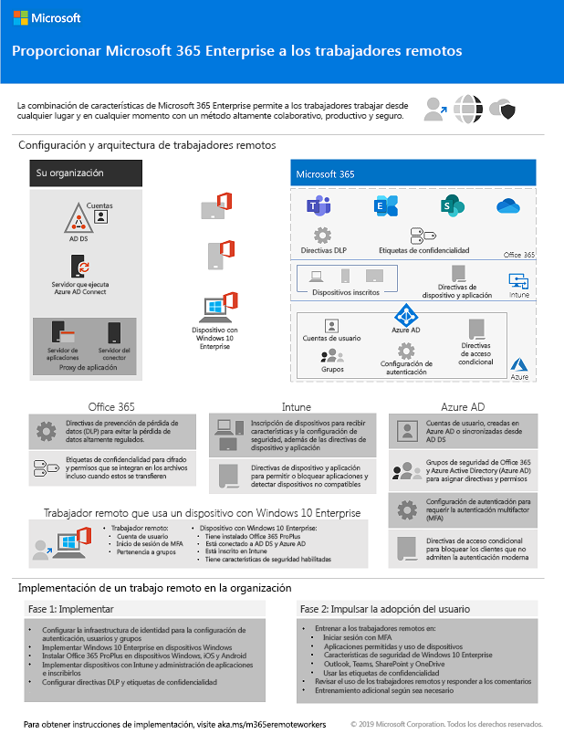](media/empower-people-to-work-remotely/empower-remote-workers-scenario.pdf) 

- [Migrar de Microsoft 365 Empresa a Microsoft 365 Enterprise E3Migrate from Microsoft 365 Business to Microsoft 365 Enterprise E3](https://docs.microsoft.com/microsoft-365/business/migrate-from-microsoft-365-business-to-microsoft-365-enterprise)

### Actualizaciones y mejorasUpdates and enhancements

- Actualización de [fase 4: Office 365 ProPlus](office365proplus-infrastructure.md)Refresh of [Phase 4: Office 365 ProPlus](office365proplus-infrastructure.md)
- Actualización del [caso práctico de Contoso](contoso-case-study.md)Refresh of the [Contoso case study](contoso-case-study.md)
- Actualización de las cargas de trabajo de [Microsoft Teams](teams-workload.md), [Exchange Online](exchangeonline-workload.md) y [SharePoint Online](sharepoint-online-onedrive-workload.md)Refresh of the [Microsoft Teams](teams-workload.md), [Exchange Online](exchangeonline-workload.md), and [SharePoint Online](sharepoint-online-onedrive-workload.md) workloads
- Actualización de los [Sitios de SharePoint para un escenario de datos altamente regulados](teams-sharepoint-online-sites-highly-regulated-data.md)Refresh of the [SharePoint sites for highly regulated data](teams-sharepoint-online-sites-highly-regulated-data.md) scenario
 
  [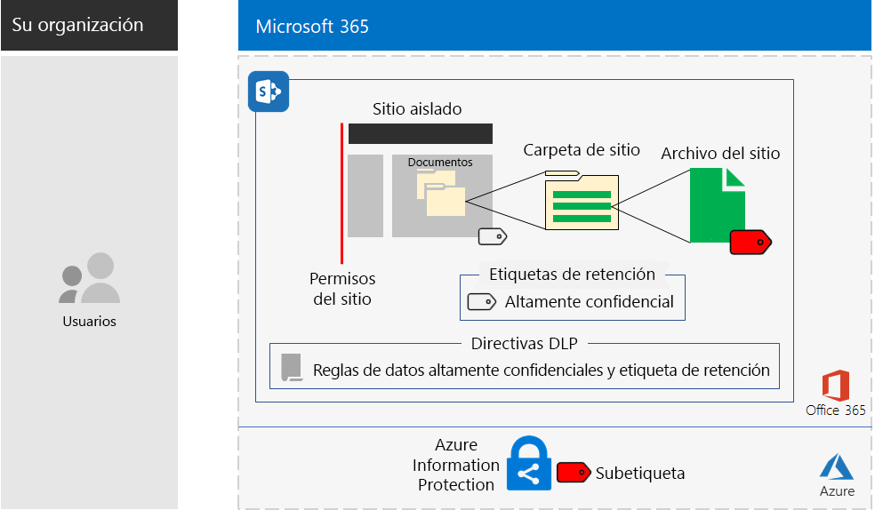](teams-sharepoint-online-sites-highly-regulated-data.md)

- [Póster de Microsoft 365 Enterprise](microsoft-365-overview.md#get-the-big-picture) para nuevos escenarios[Microsoft 365 Enterprise poster](microsoft-365-overview.md#get-the-big-picture) for new scenarios 

  [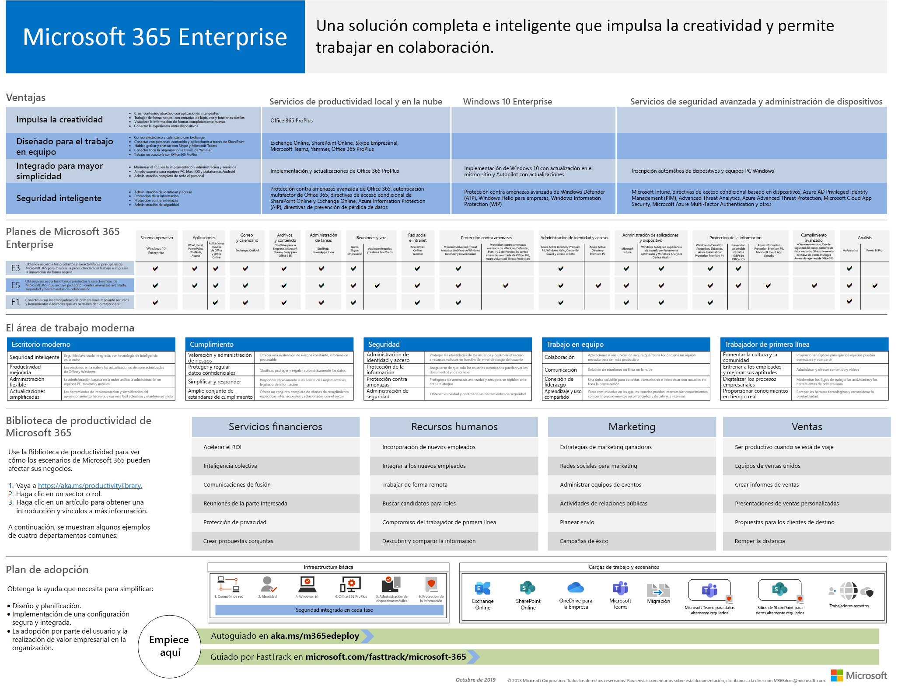](media/m365-poster/Microsoft365Enterprise.pdf)

## Septiembre de 2019September 2019

### Nuevo contenidoNew content 

- [Escenario de trabajadores remotosRemote workers scenario](empower-people-to-work-remotely.md)

  [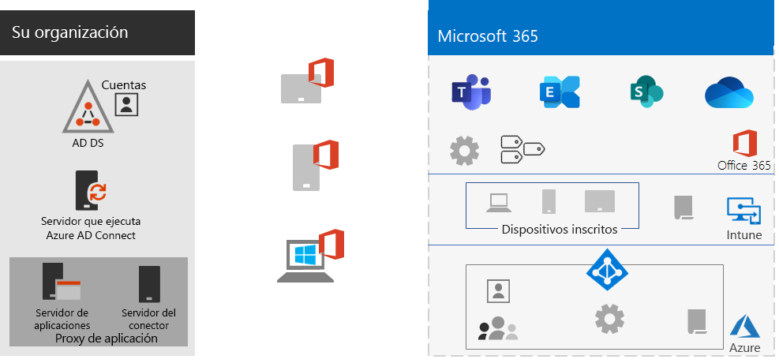](empower-people-to-work-remotely.md) 
 
  Anuncios: [Blog de la comunidad técnica de Microsoft 365](https://techcommunity.microsoft.com/t5/Microsoft-365-Blog/Empower-your-remote-workers-with-Microsoft-365-Enterprise/ba-p/935196#M236)  |  [LinkedIn](https://www.linkedin.com/pulse/how-do-i-configure-microsoft-365-enterprise-empower-my-joe-davies/) Announcements: [Microsoft 365 Technical Community blog](https://techcommunity.microsoft.com/t5/Microsoft-365-Blog/Empower-your-remote-workers-with-Microsoft-365-Enterprise/ba-p/935196#M236)  |  [LinkedIn](https://www.linkedin.com/pulse/how-do-i-configure-microsoft-365-enterprise-empower-my-joe-davies/)

- [Paso de encriptación de correo electrónico](infoprotect-email-encryption.md) para la [Fase 6: Protección de la información](infoprotect-infrastructure.md) [Email encryption step](infoprotect-email-encryption.md) for [Phase 6: Information Protection](infoprotect-infrastructure.md)

### Actualizaciones y mejorasUpdates and enhancements

- Reorganización y actualización de la [Fase 2: Identidad](identity-infrastructure.md)Reorganization and refresh of [Phase 2: Identity](identity-infrastructure.md)
- Actualización de la [Fase 1: Redes](networking-infrastructure.md) y [Fase 6: Protección de la información](infoprotect-infrastructure.md) Refresh of [Phase 1: Networking](networking-infrastructure.md) and [Phase 6: Information Protection](infoprotect-infrastructure.md)

## Agosto de 2019August 2019

### Nuevo contenidoNew content 

- [Transición de su organización a un póster de Microsoft 365 EnterpriseTransition Your Organization to Microsoft 365 Enterprise poster](migration-microsoft-365-enterprise-workload.md#transition-your-entire-organization)

   [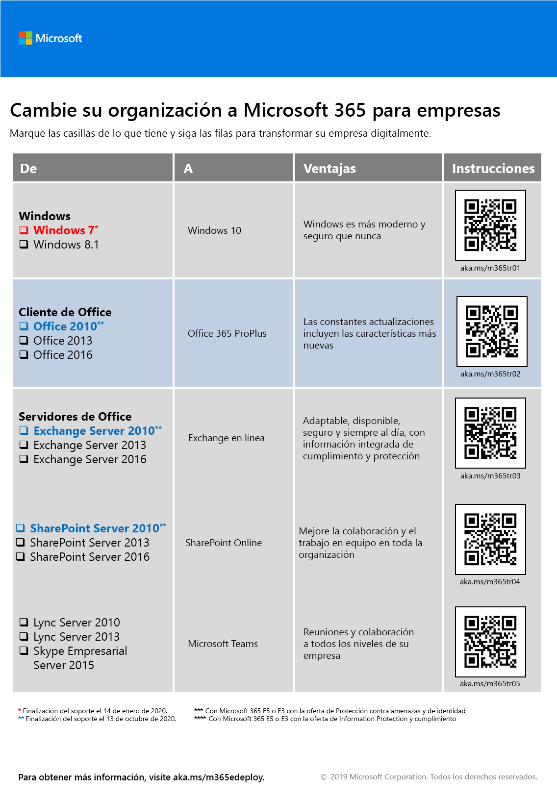](media/deploy-microsoft-365-enterprise/transition-org-to-m365.pdf) 
 
- [Infraestructura de identidad para el póster de Microsoft 365 EnterpriseIdentity infrastructure for Microsoft 365 Enterprise poster](identity-infrastructure.md)

  [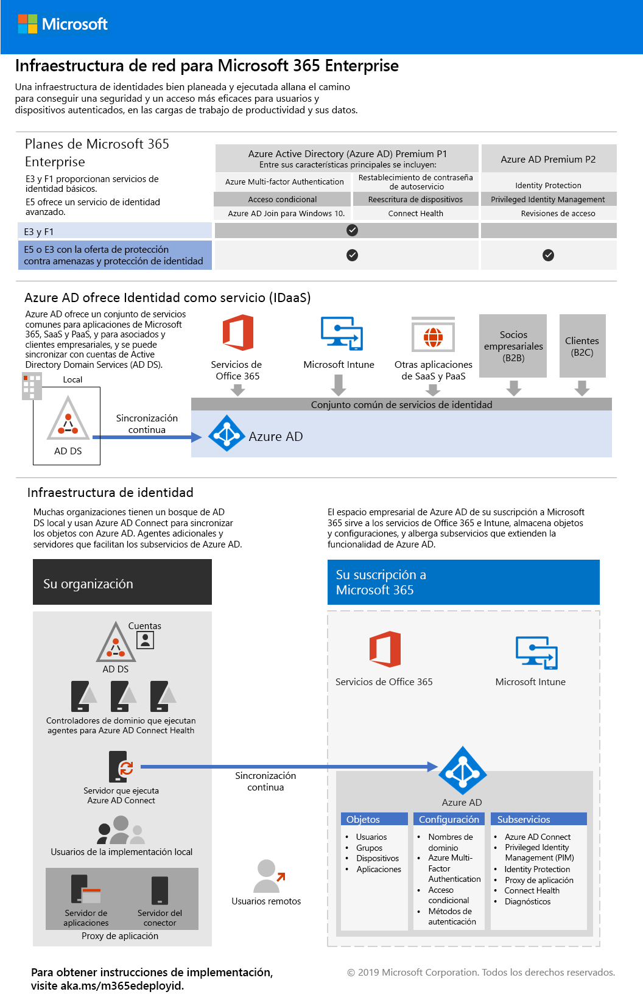](media/identity-infrastructure/M365E-ID-Infra.pdf)

  Anuncios: [Blog de la comunidad técnica de Microsoft 365](https://techcommunity.microsoft.com/t5/Microsoft-365-Blog/Get-the-new-Identity-infrastructure-for-Microsoft-365-Enterprise/ba-p/874941)  |  [LinkedIn](https://www.linkedin.com/pulse/how-can-i-quickly-ramp-up-key-concepts-features-identity-joe-davies/?published=t) Announcements: [Microsoft 365 Technical Community blog](https://techcommunity.microsoft.com/t5/Microsoft-365-Blog/Get-the-new-Identity-infrastructure-for-Microsoft-365-Enterprise/ba-p/874941)  |  [LinkedIn](https://www.linkedin.com/pulse/how-can-i-quickly-ramp-up-key-concepts-features-identity-joe-davies/?published=t)

- [Póster de finalización del soporte para Windows 7 y Office 10Windows 7 and Office 10 End-of-Support poster](migration-microsoft-365-enterprise-workload.md#summary-of-options-for-office-2010-clients-and-servers-and-windows-7)
  
  [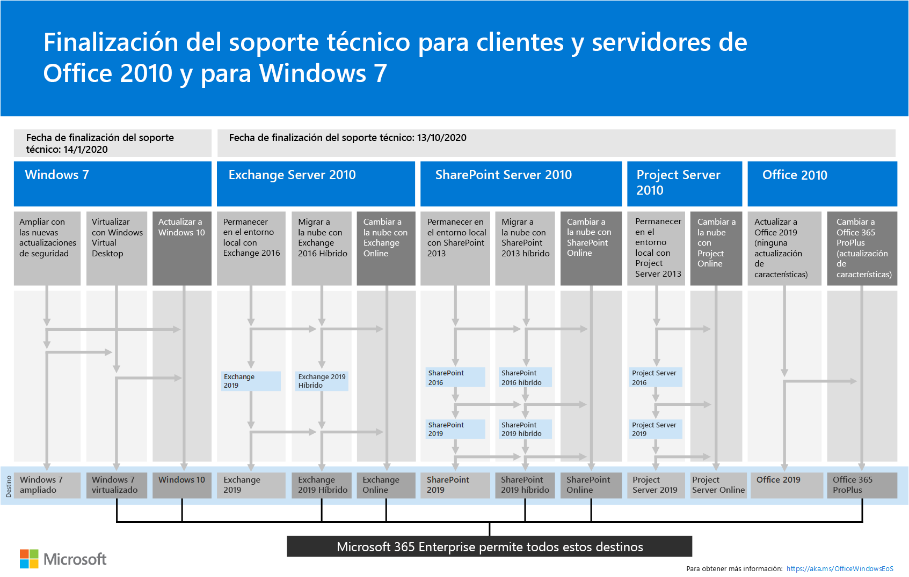](media/migration-microsoft-365-enterprise-workload/Office2010Windows7EndOfSupport.pdf)

  Anuncios: [Blog de la comunidad técnica de Microsoft 365](https://techcommunity.microsoft.com/t5/Microsoft-365-Blog/Move-from-Office-2010-clients-and-servers-and-Windows-7-to/ba-p/846994)  |  [LinkedIn](https://www.linkedin.com/pulse/how-can-microsoft-365-enterprise-help-me-end-support-products-davies/) Announcements: [Microsoft 365 Technical Community blog](https://techcommunity.microsoft.com/t5/Microsoft-365-Blog/Move-from-Office-2010-clients-and-servers-and-Windows-7-to/ba-p/846994)  |  [LinkedIn](https://www.linkedin.com/pulse/how-can-microsoft-365-enterprise-help-me-end-support-products-davies/)

### Actualizaciones y mejorasUpdates and enhancements

- [Póster de Microsoft 365 Enterprise](microsoft-365-overview.md#get-the-big-picture) para nuevos escenarios de productividad[Microsoft 365 Enterprise poster](microsoft-365-overview.md#get-the-big-picture) for new productivity scenarios

   

## Julio de 2019July 2019

### Nuevo contenidoNew content

- Libro de Excel para [Microsoft 365 Enterprise para organizaciones no empresariales artículo](deploy-foundation-infrastructure-non-enterprises.md#onboarding)Excel workbook for [Microsoft 365 Enterprise for non-enterprise organizations article](deploy-foundation-infrastructure-non-enterprises.md#onboarding)

## Mayo de 2019May 2019

### Nuevo contenidoNew content

- [Póster de infraestructura básicaFoundation Infrastructure poster](deploy-foundation-infrastructure.md#at-a-glance)

  [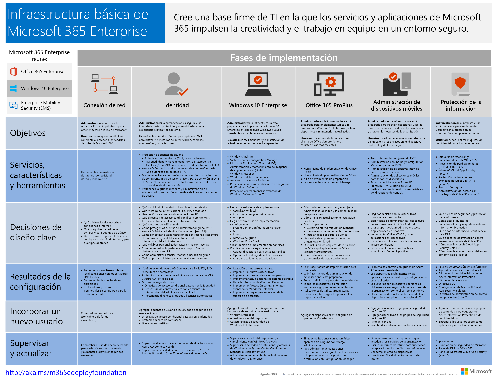](media/deploy-foundation-infrastructure/Microsoft365EnterpriseFoundInfra.pdf)

  Anuncios: [LinkedIn](https://www.linkedin.com/pulse/how-can-i-get-big-picture-microsoft-365-enterprise-joe-davies/)Announcements: [LinkedIn](https://www.linkedin.com/pulse/how-can-i-get-big-picture-microsoft-365-enterprise-joe-davies/)

 
- [Microsoft 365 Enterprise para organizaciones no empresariales artículoMicrosoft 365 Enterprise for non-enterprise organizations article](deploy-foundation-infrastructure-non-enterprises.md)

  [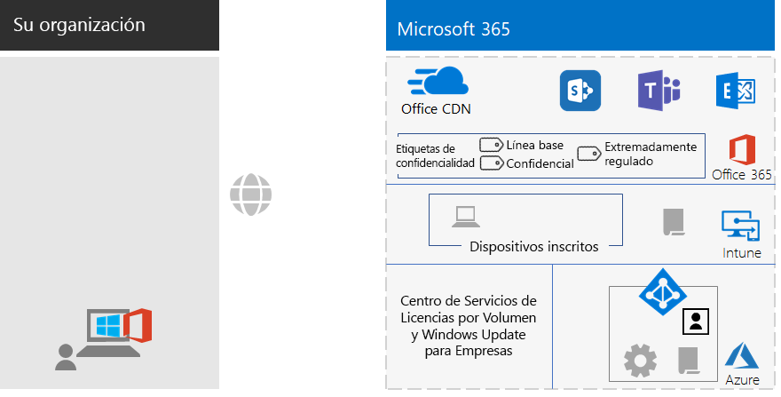](deploy-foundation-infrastructure-non-enterprises.md)

  Anuncios: [Blog de la comunidad técnica de Microsoft 365](https://techcommunity.microsoft.com/t5/Microsoft-365-Blog/Deploy-Microsoft-365-Enterprise-infrastructure-even-if-you-re/ba-p/900012)  |  [LinkedIn](https://www.linkedin.com/pulse/how-do-i-deploy-microsoft-365-enterprise-without-joe-davies/) Announcements: [Microsoft 365 Technical Community blog](https://techcommunity.microsoft.com/t5/Microsoft-365-Blog/Deploy-Microsoft-365-Enterprise-infrastructure-even-if-you-re/ba-p/900012)  |  [LinkedIn](https://www.linkedin.com/pulse/how-do-i-deploy-microsoft-365-enterprise-without-joe-davies/)

## Abril de 2019April 2019

### Nuevo contenidoNew content 

- Guías de requisitos previos del laboratorio de pruebas de [identidad y acceso a los dispositivos](identity-device-access-m365-test-environment.md)[Identity and device access](identity-device-access-m365-test-environment.md) prerequisite Test Lab Guides
- [Protección de la información de Windows](infoprotect-deploy-windows-information-protection.md) y los pasos de [prevención de pérdida de datos de Office 365](infoprotect-data-loss-prevention.md) para la [Fase 6: Protección de la información](infoprotect-infrastructure.md) [Windows Information Protection](infoprotect-deploy-windows-information-protection.md) and [Office 365 Data Loss Prevention](infoprotect-data-loss-prevention.md) steps for [Phase 6: Information Protection](infoprotect-infrastructure.md)

## Vea tambiénSee also

[Guía de implementaciónDeployment guide](deploy-microsoft-365-enterprise.md)
