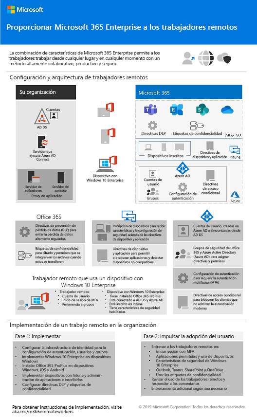

# Cambios en el contenido de implementación de Microsoft 365 Enterprise

## Octubre de 2019

### Nuevo contenido 

- [Póster para aumentar la productividad de los trabajadores remotos](empower-people-to-work-remotely.md#poster)

  [Póster para aumentar la productividad de los trabajadores remotos](media/empower-people-to-work-remotely/empower-remote-workers-scenario.pdf) 
 

### Actualizaciones y mejoras

- Actualización del [caso práctico de Contoso](contoso-case-study.md)
- Actualización de la carga de trabajo de [Exchange Online](exchangeonline-workload.md)
- Actualización de los [Sitios de SharePoint para un escenario de datos altamente regulados](teams-sharepoint-online-sites-highly-regulated-data.md)
 
  

- [Póster de Microsoft 365 Enterprise](microsoft-365-overview.md#get-the-big-picture) para nuevos escenarios 

  

## Septiembre de 2019

### Nuevo contenido 

- [Escenario de trabajadores remotos](empower-people-to-work-remotely.md)

   
 
- [Paso de encriptación de correo electrónico](infoprotect-email-encryption.md) para la [Fase 6: Protección de la información](infoprotect-infrastructure.md) 

### Actualizaciones y mejoras

- Reorganización y actualización de la [Fase 2: Identidad](identity-infrastructure.md)
- Actualización de la [Fase 1: Redes](networking-infrastructure.md) y [Fase 6: Protección de la información](infoprotect-infrastructure.md) 

## Agosto de 2019

### Nuevo contenido 

- [Transición de su organización a un póster de Microsoft 365 Enterprise](migration-microsoft-365-enterprise-workload.md#transition-your-entire-organization)

    
 
- [Infraestructura de identidad para el póster de Microsoft 365 Enterprise](identity-infrastructure.md)

  

  Anuncios: [Blog de la comunidad técnica de Microsoft 365](https://techcommunity.microsoft.com/t5/Microsoft-365-Blog/Get-the-new-Identity-infrastructure-for-Microsoft-365-Enterprise/ba-p/874941)  |  [LinkedIn](https://www.linkedin.com/pulse/how-can-i-quickly-ramp-up-key-concepts-features-identity-joe-davies/?published=t) 

- [Póster de finalización del soporte para Windows 7 y Office 10](migration-microsoft-365-enterprise-workload.md#summary-of-options-for-office-2010-clients-and-servers-and-windows-7)
  
  

  Anuncios: [Blog de la comunidad técnica de Microsoft 365](https://techcommunity.microsoft.com/t5/Microsoft-365-Blog/Move-from-Office-2010-clients-and-servers-and-Windows-7-to/ba-p/846994)  |  [LinkedIn](https://www.linkedin.com/pulse/how-can-microsoft-365-enterprise-help-me-end-support-products-davies/) 

### Actualizaciones y mejoras

- [Póster de Microsoft 365 Enterprise](microsoft-365-overview.md#get-the-big-picture) para nuevos escenarios de productividad

   

## Julio de 2019

### Nuevo contenido

- Libro de Excel para [Microsoft 365 Enterprise para organizaciones no empresariales artículo](deploy-foundation-infrastructure-non-enterprises.md#onboarding)

## Mayo de 2019

### Nuevo contenido

- [Póster de infraestructura básica](deploy-foundation-infrastructure.md#at-a-glance)

  

  Anuncios: [LinkedIn](https://www.linkedin.com/pulse/how-can-i-get-big-picture-microsoft-365-enterprise-joe-davies/)

 
- [Microsoft 365 Enterprise para organizaciones no empresariales artículo](deploy-foundation-infrastructure-non-enterprises.md)

  

  Anuncios: [Blog de la comunidad técnica de Microsoft 365](https://techcommunity.microsoft.com/t5/Microsoft-365-Blog/Deploy-Microsoft-365-Enterprise-infrastructure-even-if-you-re/ba-p/900012)  |  [LinkedIn](https://www.linkedin.com/pulse/how-do-i-deploy-microsoft-365-enterprise-without-joe-davies/) 

## Abril de 2019

### Nuevo contenido 

- Guías de requisitos previos del laboratorio de pruebas de [identidad y acceso a los dispositivos](identity-device-access-m365-test-environment.md)
- [Protección de la información de Windows](infoprotect-deploy-windows-information-protection.md) y los pasos de [prevención de pérdida de datos de Office 365](infoprotect-data-loss-prevention.md) para la [Fase 6: Protección de la información](infoprotect-infrastructure.md) 

## Vea también

[Guía de implementación](deploy-microsoft-365-enterprise.md)
