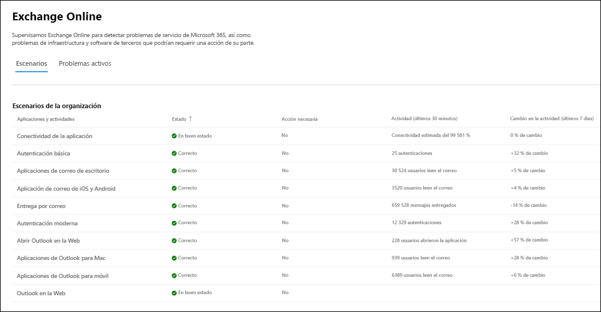
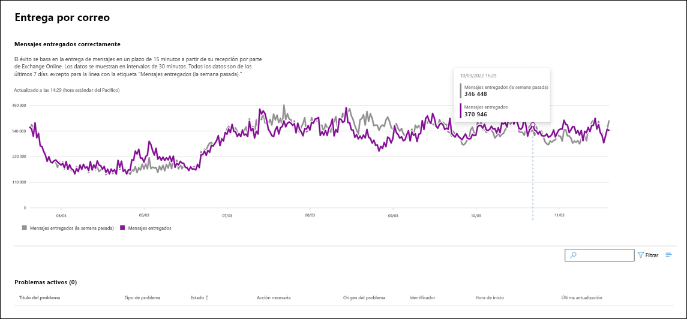

# Supervisión de Exchange Online para Microsoft 365

La supervisión de Exchange Online admite los siguientes escenarios de nivel de organización:

- **Clientes de correo**: con la supervisión de Exchange, puede ver el estado de los siguientes clientes de correo electrónico basándose en la actividad de lectura de correo electrónico:

  - Versión de escritorio de Outlook
  - Outlook en la Web
  - Clientes de correo electrónico nativo de iOS y Android
  - Aplicación móvil de Outlook en iOS y Android
  - Cliente de Outlook para Mac

   Para estos clientes, puede ver el número de usuarios activos en los últimos 30 minutos basándose en los usuarios que lean un correo electrónico, así como la cantidad de incidentes y avisos en el panel. Estos datos se comparan con el mismo intervalo de la semana anterior para ver si hay un problema.

   >[!Note]
   > El recuento de usuarios activos se mide por una única actividad, por ejemplo, cuando un usuario lee un correo electrónico. Solo se tienen en cuenta los últimos 30 minutos de actividad.

- **Conectividad de la aplicación**: la conectividad estimada se basa en el porcentaje de conexiones sintéticas exitosas entre los dispositivos de su organización y Exchange Online, y puede incluir problemas fuera del control de Microsoft. Para obtener más información, consulte [Óptica de conectividad de Microsoft 365](microsoft-365-connectivity-optics.md).

- **Autenticación básica y autenticación moderna**: número de usuarios validados correctamente en el servicio de Exchange Online.

- **Flujo de correo**: el número de mensajes entregados correctamente a un buzón sin retraso desde que el mensaje llegó a la red Microsoft 365.

- **Abrir Outlook para la Web**: el número de usuarios que iniciaron sesión correctamente en Outlook en la Web e iniciaron el programa correctamente.
  
Este es un ejemplo de los escenarios de nivel de organización para Exchange Online en el panel principal.

Para todos estos escenarios, los números clave son para los últimos 30 minutos en el panel principal. Las vistas detalladas de cada uno de estos escenarios muestran la tendencia en tiempo casi real durante siete días con un agregado de 30 minutos en comparación con la semana anterior.

Observará incidentes o avisos creados para su organización en los cuales "Origen del problema" tendrá en la comunicación la etiqueta "Su organización". Se trata de notificaciones dirigidas individualmente a su organización con problemas que requieren su atención para la mitigación y la resolución. Para obtener más información sobre los distintos tipos de incidencias que se crean y comunican en el estado del servicio (para informar a su organización sobre el posible impacto) consulte los artículos siguientes:

- [Alertas de servicio para el uso de buzones](microsoft-365-mailbox-utilization-service-alerts.md)

- [Alertas de servicio para retrasos de origen MRS](microsoft-365-mrs-source-delays-service-alerts.md)

- [Alertas de servicio para mensajes pendientes de entrega a destinatarios externos](microsoft-365-external-recipient-service-alerts.md)

## Escenarios de supervisión de cuentas prioritarias

Con la supervisión de las cuentas prioritarias de Exchange Online, puede ver el estado de los siguientes escenarios después de configurar [cuentas prioritarias](/microsoft-365/admin/setup/priority-accounts):

- Licencias de Exchange

- Almacenamiento de buzones

- Límite de mensajes

- Subcarpetas por carpeta

- Jerarquía de carpetas

- Elementos recuperables

El escenario de la licencia de Exchange comprueba si la cuenta de prioridad no puede iniciar sesión porque haya problemas de licencia no válida, que puede solucionar el administrador del espacio empresarial.

Los otros cinco escenarios anteriores comprueban si el buzón de la cuenta prioritaria está cerca de llegar al límite, o si ya lo ha alcanzado, según los límites descritos en [límites de Exchange Online](/office365/servicedescriptions/exchange-online-service-description/exchange-online-limits#mailbox-storage-limits).

En estos escenarios, puede ver avisos e incidentes, activos y resueltos, que afectan a sus cuentas prioritarias. La información identificable de las cuentas prioritarias se mostrará en los detalles de aviso o de incidente junto con las recomendaciones. Este es un ejemplo de la página **Estado > Estado del servicio > Exchange Online**.

:::image type="content" source="../media/microsoft-365-exchange-monitoring/exchange-priority-accounts-example.png" alt-text="Ejemplo de avisos e incidentes, activos y resueltos, que afectan a sus cuentas prioritarias":::

En el panel de cuentas afectadas, la columna **Estado** tiene estos valores:

- Corregido: se ha solucionado el problema que causaba el aviso o incidente para la cuenta de prioridad. Ya no hay ningún problema. 

- Activo: el problema que causa el aviso o incidente está en curso para la cuenta de prioridad. El problema persiste. 

- Retrasado: el problema que causa el aviso o incidente no se ha solucionado para la cuenta prioritaria en 96 horas, por lo que se ha suspendido. El problema sigue sin solucionarse. 

Por ejemplo:

:::image type="content" source="../media/microsoft-365-exchange-monitoring/exchange-status-column-example.png" alt-text="Ejemplo de la columna de estado del panel de cuentas afectadas":::

Un aviso o un incidente se resolverá después de que ninguna cuenta continúe en el estado **Activo**.

## Preguntas frecuentes

### 1. El número de usuarios activos en el panel de control de cada cliente parece ser bajo. Tenemos muchas licencias activas asignadas a los usuarios. ¿Qué significa esto?

El recuento de usuarios activos que se muestra en la supervisión se basa en una ventana de 30 minutos donde los usuarios han realizado la actividad indicada en la característica. No debe confundirse con los números de uso. Para ver los números de uso, use los informes de actividad en el Centro de administración de Microsoft 365 (**Informes** > <a href="https://go.microsoft.com/fwlink/p/?linkid=2074756" target="_blank">**Uso**</a>).

### 2. ¿Dónde están los datos instrumentados para los escenarios que muestran las tendencias de actividad?

Los datos se usan en el servicio de Exchange Online. Si se produce un error antes de que la solicitud llegue a Exchange Online o existe un error en Exchange Online, verá una caída en la señal de actividad.
