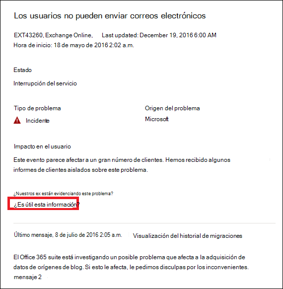

# Supervisión de Exchange Online para Microsoft 365

Puede usar la supervisión de Exchange Online en el <a href="https://go.microsoft.com/fwlink/p/?linkid=2024339" target="_blank">Centro de administración de Microsoft 365</a> para supervisar el estado del servicio de Exchange para la suscripción de Microsoft 365 de su organización. La supervisión de Exchange Online ofrece información sobre incidentes y avisos que se recopilan en estas categorías:

- **Infraestructura**: se detecta un problema en la infraestructura de Microsoft 365 que es propiedad de Microsoft para proporcionar actualizaciones periódicas y solucionar el problema. Por ejemplo, los usuarios no pueden acceder a Exchange Online debido a problemas con Exchange u otra infraestructura en la nube de Microsoft 365.
- **Infraestructura de terceros**: se detecta un problema en una infraestructura de terceros en la que la organización tiene una dependencia y necesita una acción de su organización para su resolución. Por ejemplo, las transacciones de autenticación de usuario se limitan con un proveedor de servicio de token de seguridad (STS) de terceros que impide que los usuarios se conecten a Exchange Online.
- **Infraestructura del cliente**: se detecta un problema en la infraestructura de la organización y requiere una acción de su organización para su resolución. Por ejemplo, los usuarios no pueden acceder a Exchange Online porque no pueden obtener un token de autenticación de un proveedor de STS hospedado por la organización debido a un certificado caducado.

Este es un ejemplo de la página **Estado del servicio** del Centro de administración de Microsoft 365, disponible en **Estado > Estado del servicio** para organizaciones y escenarios de [cuentas prioritarias](../admin/setup/priority-accounts.md).

**Los problemas de la organización** se identificarán y usarán mediante la supervisión de nivel organizativo y la supervisión de cuentas prioritarias.

El valor de la columna **Estado** en **Problemas de la organización** indica si la infraestructura de la organización o el software de terceros afectan a la experiencia del estado del servicio de los usuarios de la organización o de las cuentas prioritarias en Exchange Online. Los avisos o incidencias requieren *sus* acciones para resolverse.

El valor de la columna **Estado** en **Estado del servicio Microsoft** indica que el servicio está en buen estado o tiene avisos o incidentes basados en los servicios en la nube que mantiene Microsoft.

Este es un ejemplo de la página de supervisión de Exchange Online del Centro de administración de Microsoft 365 que muestra el estado de los escenarios de nivel de organización y de las cuentas prioritarias, disponible en **Estado > Estado del servicio > Exchange Online**.

Con la página de supervisión de **Exchange Online**, puede ver si el servicio de Exchange Online está en buen estado o no y si hay incidentes o avisos asociados. Con la supervisión de Exchange Online, puede observar el estado del servicio para escenarios de correo electrónico específicos y ver señales casi en tiempo real para determinar el impacto por escenario a nivel de organización. También puede ver el estado de los escenarios de cuentas prioritarias.

## Requisitos

Esta vista previa está habilitada para los clientes que cumplan estos requisitos:

- Su organización necesita tener al menos 5000 licencias de uno o varios de estos productos: Office 365 E3, Microsoft 365 E3, Office 365 E5 o Microsoft 365 E5.

  Por ejemplo, su organización podría tener 3000 licencias de Office 365 E3 y 2500 de Microsoft 365 E5, con un total de 5500 licencias de productos aptos.

- Su organización necesita tener al menos 50 usuarios activos mensuales para uno o más servicios principales de Microsoft 365, entre los que se incluyen Microsoft Teams, OneDrive para la Empresa, SharePoint Online, Exchange Online y aplicaciones de Office.

- Cualquier rol con permisos de nivel de panel de Estado del servicio puede tener acceso a la supervisión de Exchange Online. Para más información, consulte [Cómo comprobar el estado del servicio de Microsoft 365](view-service-health.md).

## Escenarios de nivel de organización

Con la supervisión de Exchange Online se admiten los siguientes escenarios:

- **Clientes de correo**: con la supervisión de Exchange, puede ver el estado de los siguientes clientes de correo electrónico basándose en la actividad de lectura de correo electrónico:

  - Versión de escritorio de Outlook
  - Outlook en la Web
  - Clientes de correo electrónico nativo de iOS y Android
  - Aplicación móvil de Outlook en iOS y Android
  - Cliente de Outlook para Mac
  - Abrir Outlook en la Web

   Para estos clientes, puede ver el número de usuarios activos en los últimos 30 minutos basándose en los usuarios que lean un correo electrónico, así como la cantidad de incidentes y avisos en el panel. Estos datos se comparan con el mismo intervalo de la semana anterior para ver si hay un problema.

   >[!Note]
   > El recuento de usuarios activos se mide por una única actividad, por ejemplo, cuando un usuario lee un correo electrónico. Solo se tienen en cuenta los últimos 30 minutos de actividad.

- **Conectividad de aplicaciones**: la conectividad estimada se basa en el porcentaje de conexiones sintéticas correctas entre los dispositivos de la organización y Exchange Online, y puede incluir problemas fuera del control de Microsoft. Para obtener más información, consulte [Microsoft 365 Connectivity Optics](microsoft-365-connectivity-optics.md).

- **Autenticación básica y autenticación moderna**: número de usuarios validados correctamente en el servicio de Exchange Online.

- **Flujo de correo**: el número de mensajes entregados correctamente a un buzón sin retraso desde que el mensaje llegó a la red Microsoft 365.

  

Para todos estos escenarios, los números clave son para los últimos 30 minutos en el panel principal. Las vistas detalladas de cada uno de estos escenarios muestran la tendencia en tiempo casi real durante siete días con un agregado de 30 minutos en comparación con la semana anterior.

## Escenarios de supervisión de cuentas prioritarias

Con la supervisión de las cuentas prioritarias de Exchange Online, puede ver el estado de los siguientes escenarios después de configurar [cuentas prioritarias](/microsoft-365/admin/setup/priority-accounts):

- Licencias de Exchange

- Almacenamiento de buzones

- Límite de mensajes

- Subcarpetas por carpeta

- Jerarquía de carpetas

- Elementos recuperables

El escenario de la licencia de Exchange comprueba si la cuenta de prioridad no puede iniciar sesión porque haya problemas de licencia no válida, que puede solucionar el administrador del espacio empresarial.

Los otros cinco escenarios anteriores comprueban si el buzón de la cuenta prioritaria está cerca de llegar al límite, o si ya lo ha alcanzado, según los límites descritos en [límites de Exchange Online](/office365/servicedescriptions/exchange-online-service-description/exchange-online-limits#mailbox-storage-limits).

En estos escenarios, puede ver avisos e incidentes, activos y resueltos, que afectan a sus cuentas prioritarias. La información identificable de las cuentas prioritarias se mostrará en los detalles de aviso o de incidente junto con las recomendaciones. Este es un ejemplo de la página **Estado > Estado del servicio > Exchange Online**.

:::image type="content" source="../media/microsoft-365-exchange-monitoring/exchange-priority-accounts-example.png" alt-text="Ejemplo de avisos e incidentes, activos y resueltos, que afectan a sus cuentas prioritarias":::

En el panel de cuentas afectadas, la columna **Estado** tiene estos valores:

- Corregido: el problema que causaba el aviso o el incidente se ha solucionado para la cuenta prioritaria. Ya no hay ningún problema. 

- Activo: el problema que causa el aviso o el incidente continúa para la cuentaprioritaria. Sigue estando el problema. 

- Retraso: el problema que causa el aviso o el incidente no se ha resuelto para la cuenta de prioridad en el plazo de 96 horas, por lo que se ha suspendido. Sigue estando el problema. 

Aquí le mostramos un ejemplo.

:::image type="content" source="../media/microsoft-365-exchange-monitoring/exchange-status-column-example.png" alt-text="Ejemplo de la columna de estado del panel de cuentas afectadas":::

Un aviso o un incidente se resolverá después de que ninguna cuenta continúe en el estado **Activo**. 

## Enviarnos comentarios

Hay dos formas de proporcionar comentarios:

- Usar la opción **Enviar comentarios** disponible en cada página del Centro de administración de Microsoft 365.

- Enviar comentarios usando el vínculo **¿Es útil esta publicación?** para un incidente o aviso específico.

  

## Preguntas frecuentes

#### 1. ¿Por qué no veo "Supervisión de Exchange Online" en Estado en el Centro de administración de Microsoft 365? 

En primer lugar, asegúrese de que ha habilitado el nuevo centro de administración en la página **Inicio** del <a href="https://go.microsoft.com/fwlink/p/?linkid=2024339" target="_blank">Centro de administración de Microsoft 365</a>.

Después, asegúrese de que cumple los siguientes requisitos:

- Su organización necesita tener al menos 5000 licencias de uno o varios de estos productos: Office 365 E3, Microsoft 365 E3, Office 365 E5 o Microsoft 365 E5.

- Su organización necesita tener al menos 50 usuarios activos mensuales para uno o más servicios principales de Microsoft 365, entre los que se incluyen Microsoft Teams, OneDrive para la Empresa, SharePoint Online, Exchange Online y aplicaciones de Office.

Si el número de licencias de la organización es inferior a 5000 usuarios y los usuarios activos mensuales son menos de 50 para los servicios principales, no se habilitará la supervisión de Exchange Online hasta que se cumplan estos requisitos.

#### 2. El número de usuarios activos en el panel de control de cada cliente parece ser bajo. Tenemos muchas licencias activas asignadas a los usuarios. ¿Qué significa esto?

El recuento de usuarios activos que se muestra en la supervisión se basa en una ventana de 30 minutos donde los usuarios han realizado la actividad indicada en la característica. No debe confundirse con los números de uso. Para ver los números de uso, use los informes de actividad en el Centro de administración de Microsoft 365 (**Informes** > <a href="https://go.microsoft.com/fwlink/p/?linkid=2074756" target="_blank">**Uso**</a>).

#### 3. ¿Hay otros escenarios de supervisión para otros servicios, como Microsoft Teams y SharePoint?

Microsoft está integrando esta experiencia directamente en el panel de Estado del servicio en el Centro de administración de Microsoft 365. Esto ofrecerá oportunidades para que Microsoft extienda escenarios de supervisión a otros servicios, que se anunciarán cuando haya novedades para compartir.

#### 4. ¿Cuál es el plan para la disponibilidad general de esta experiencia?

Microsoft ha integrado la supervisión de Exchange Online directamente en el panel <a href="https://go.microsoft.com/fwlink/p/?linkid=842900" target="_blank">**Estado de servicio**</a> del Centro de administración de Microsoft 365.

Con esta nueva experiencia integrada, el plan de Microsoft es recopilar sus comentarios y definir nuestro plan de disponibilidad general.

#### 5. ¿Es una característica gratuita (incluida) o de pago (extra)? 

Esta es una característica gratuita que está en versión preliminar y solo está disponible para los clientes que cumplen los requisitos de la pregunta 1. No existe una opción de pago para recibir este contenido.

#### 6. ¿Cómo puedo proporcionar comentarios?

Para los comentarios generales, use el icono **Enviar comentarios** en la esquina inferior derecha de la página de supervisión de **Exchange Online**. 

Para los comentarios sobre incidentes o avisos use el vínculo **¿Es útil esta publicación?**.

#### 7. ¿Dónde están los datos instrumentados para los escenarios que muestran las tendencias de actividad?

Los datos se usan en el servicio de Exchange Online. Si se produce un error antes de que la solicitud llegue a Exchange Online o existe un error en Exchange Online, verá una caída en la señal de actividad.

#### 8. ¿Hay problemas de privacidad?

La supervisión se centra en los metadatos del servicio y no se supervisa el contenido del usuario.

## Vea también

- [Cómo comprobar el estado del servicio de Microsoft 365](view-service-health.md) 

- [Límites de Exchange Online](/office365/servicedescriptions/exchange-online-service-description/exchange-online-limits#mailbox-storage-limits)

- [Administrar y supervisar cuentas prioritarias](/microsoft-365/admin/setup/priority-accounts)

- [Uso de Cuentas prioritarias en Microsoft 365](https://techcommunity.microsoft.com/t5/microsoft-365-blog/using-priority-accounts-in-microsoft-365/ba-p/1873314)

- [Alertas de servicio para el uso de buzones en la supervisión de Exchange Online](microsoft-365-mailbox-utilization-service-alerts.md)
